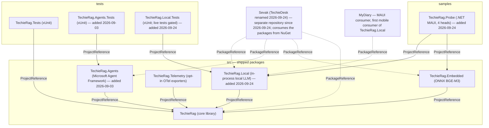
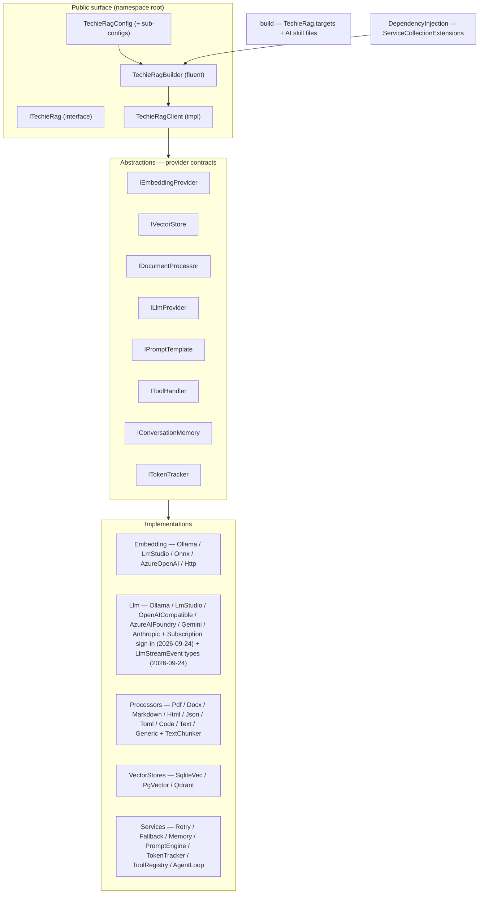
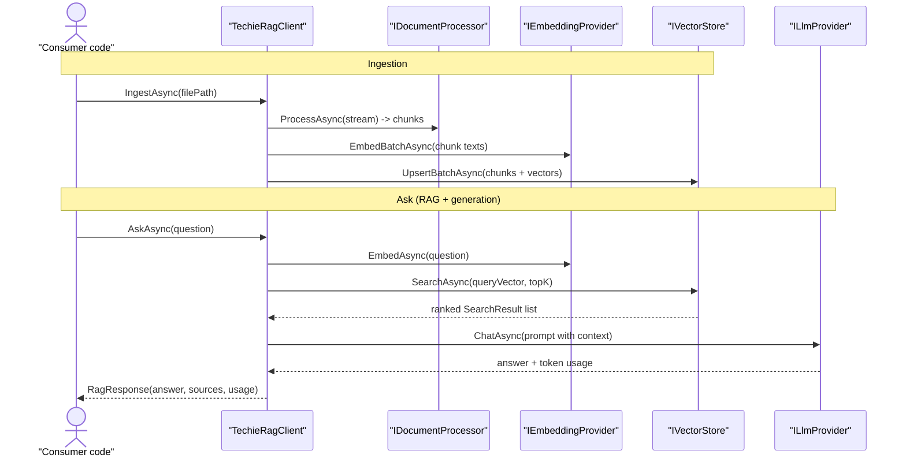
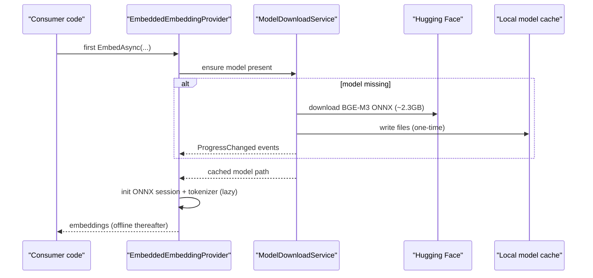
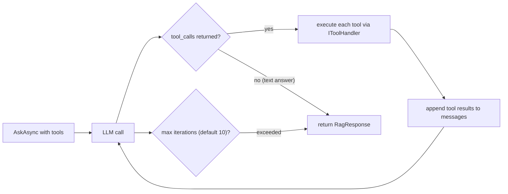
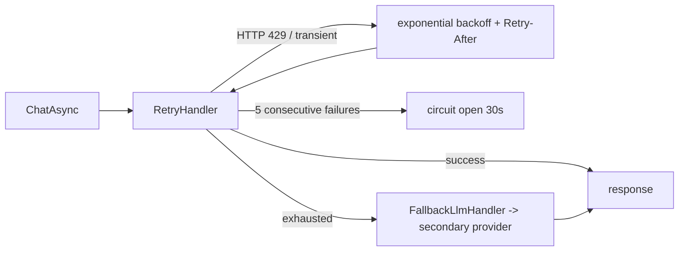
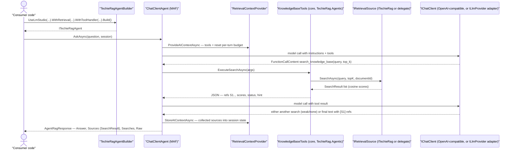
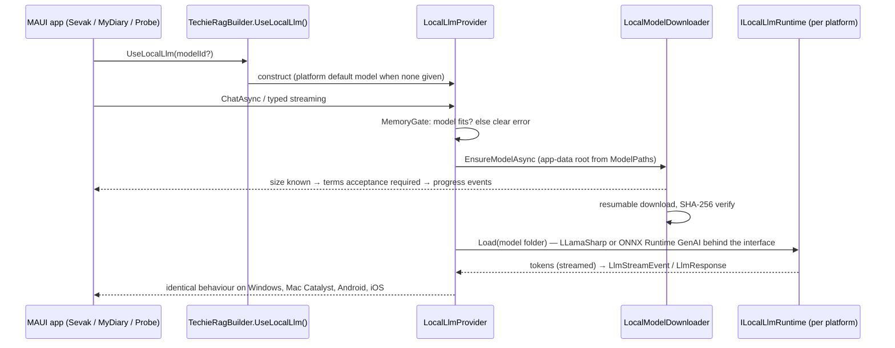
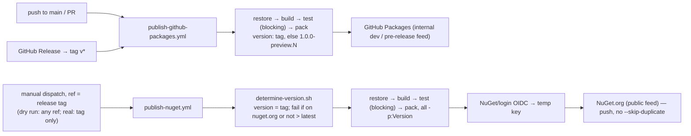
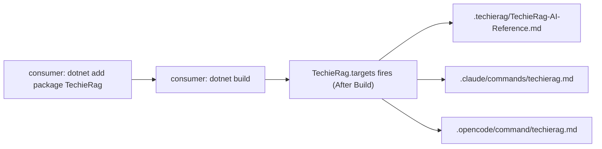

# TechieRag — Architecture

| | |
|---|---|
| App | TechieRag |
| Kind | library |
| Size | Large |
| Stack answer set | none |
| Date | 2026-09-24 |

**Last updated:** 2026-09-24 (header and ADR-012…016; body last restructured 2026-06-25)
**Status:** Current (brownfield) — amended 2026-07-17: TechieDesk repositioning (app renamed from TechieRagWeb, promoted from sample to product; ADR-007) — amended 2026-09-03: third package `TechieRag.Agents` on Microsoft Agent Framework, agentic retrieval contract in core, and TechieDesk separated into its own repository (ADR-008…011; BRD-83…87)

## Table of Contents

1. [Tech stack](#tech-stack)
2. [Component map](#component-map)
3. [Data flow — primary path](#data-flow-primary-path)
4. [Module responsibilities](#module-responsibilities)
5. [Cross-cutting concerns](#cross-cutting-concerns)
6. [Deployment architecture](#deployment-architecture)
7. [Architectural decisions (ADR-style log)](#architectural-decisions-adr-style-log)
8. [Target architecture](#target-architecture)
9. [Open questions / risks](#open-questions-risks)
10. [Sources harvested](#sources-harvested)

## 1. Tech stack

TechieRag is a **configurable RAG (Retrieval-Augmented Generation) library for .NET**, shipped as two NuGet packages (`TechieRag`, `TechieRag.Embedded`) plus the **TechieDesk** Blazor Server application (formerly `TechieRagWeb`; folder `apps/TechieDesk`, renamed per BRD-82 / REQ-UI-014 on 2026-07-17) and an xUnit test project. The library is a class-library SDK, not a hosted application — consumers reference it and wire it into their own apps via a fluent builder or DI. TechieDesk is being productized as a self-hostable AnythingLLM alternative built on the library (BRD-81; roadmap in `docs/TechieRag-CompetitorAnalysis.md`).

**Amended 2026-09-03.** The shipped set is now **three packages** — `TechieRag`, `TechieRag.Embedded`, and **`TechieRag.Agents`** (agents on Microsoft Agent Framework; BRD-84/85) — plus the opt-in `TechieRag.Telemetry`. **TechieDesk is no longer in this repository** (BRD-87, ADR-010): it lives in its own repository and consumes the packages from NuGet. This document describes the library only; TechieDesk's code shape is in the TechieDesk repository's Architecture doc.

**Amended 2026-09-24 (ADR-012…016; `docs/TechieRag-Update-Brief.md`).** The application is **Sevak** (TechieDesk renamed at the split, executed 2026-09-24). A **fourth package, `TechieRag.Local`**, runs a language model in-process on Windows, macOS (Mac Catalyst), Android and iOS (F-LOCAL-LLM, BRD-96…109). Core gains two contract additions: **typed streaming events** on `ILlmProvider` (BRD-110/111) and **subscription sign-in** providers (BRD-112…114). `TechieRag.Embedded` and `TechieRag.Local` ship the native wiring a MAUI app needs as `buildTransitive` targets, and every model folder moves to the per-user application data root (F-PLATFORM, BRD-88…95).

| Layer | Choice | Version | Notes |
|-------|--------|---------|-------|
| Runtime | .NET | net10.0; net8.0 | `TechieRag`, `TechieRag.Telemetry`, `TechieRag.Agents` multi-target `net10.0;net8.0`; `TechieRag.Embedded` is `net10.0` only; nullable + implicit usings enabled *(amended 2026-09-03)* |
| Package type | NuGet class library | 1.0.0 | `TechieRag` + `TechieRag.Embedded` + `TechieRag.Agents` (+ `TechieRag.Telemetry`); semantic versioning, version derived from the release tag at pack time *(amended 2026-09-03)* |
| Agent framework | Microsoft.Agents.AI (Microsoft Agent Framework) | 1.20.0 | `TechieRag.Agents` only — `ChatClientAgent`, `AgentSession`, `AIContextProvider`, middleware, `ApprovalRequiredAIFunction` *(added 2026-09-03)* |
| AI abstractions | Microsoft.Extensions.AI + Microsoft.Extensions.AI.OpenAI | 10.9.0 | `TechieRag.Agents` only — `IChatClient`, `AIFunction`, `FunctionInvokingChatClient`; the OpenAI adapter covers LM Studio, Ollama `/v1`, OpenAI and any compatible server (pins `OpenAI` SDK 2.12.x) *(added 2026-09-03)* |
| Document parsing | PdfPig, DocumentFormat.OpenXml, HtmlAgilityPack, Markdig, Tomlyn | 0.1.13 / 3.4.1 / 1.12.4 / 0.45.0 / 0.20.0 | One library per format processor |
| Vector stores | Microsoft.Data.Sqlite + sqlite-vec, Npgsql + Pgvector, Qdrant.Client | 10.0.3 / 10.0.1 + 0.3.2 / 1.16.1 | Pluggable; SQLite-vec is the zero-config default |
| Data access | Dapper | 2.1.66 | Used by the SQL-based vector stores |
| Cloud embedding | Azure.AI.OpenAI | 2.1.0 | Azure OpenAI embedding provider |
| Embedded embedding | Microsoft.ML.OnnxRuntime (+ Managed), Microsoft.ML.Tokenizers | 1.24.1 / 2.0.0 | `TechieRag.Embedded` only — BGE-M3 ONNX inference |
| DI / config | Microsoft.Extensions.{DependencyInjection,Configuration,Logging,Options}.Abstractions | 10.0.3 | Abstractions only — no framework lock-in |
| ~~TechieDesk UI~~ | ~~Blazor Server + TrBlazeUI.Components + TrBlazeUI.Icons.Lucide~~ | — | Moved to the TechieDesk repository 2026-09-03 (BRD-87); the repository is named **Sevak** since 2026-09-24 |
| Local inference runtime | LLamaSharp (llama.cpp, GGUF) **or** Microsoft.ML.OnnxRuntimeGenAI, per platform | to be pinned after the spike | `TechieRag.Local` only; one internal runtime interface, one implementation per platform, decision recorded in `DECISIONS.md` with measured numbers (ADR-014; BRD-97) *(added 2026-09-24)* |
| Consumer platforms | .NET MAUI: Windows, Mac Catalyst, Android (arm64-v8a, x86_64), iOS | net10.0 heads | The libraries stay plain `net10.0`/`net8.0`; platform behaviour arrives through `buildTransitive` targets and runtime folder resolution, not through platform TFMs in the packages (ADR-016; BRD-89/90/102) *(added 2026-09-24)* |
| Test | xUnit | — | `tests/TechieRag.Tests`; `tests/TechieRag.Agents.Tests` *(added 2026-09-03)* |

**LLM providers** are implemented with raw `HttpClient` + `System.Text.Json` (no heavy vendor SDKs) so the core package stays dependency-light: Ollama, LM Studio, OpenAI-compatible, Azure AI Foundry, Google Gemini, Anthropic Claude. **This rule is why `TechieRag.Agents` is a separate package** (ADR-008): the MAF and MEAI dependencies never enter core, and `TechieRag.Agents` reuses those same providers through an `ILlmProvider` → `IChatClient` adapter rather than requiring a second provider configuration.

## 2. Component map



**Inside `src/TechieRag` — module folders:**



## 3. Data flow — primary path

The core flow is **ingest → embed → store**, then **query → embed → search → (optionally) generate**.



For `SearchAsync` (retrieval only, v1 behaviour) the LLM leg is skipped and the ranked `SearchResult` list is returned directly. `AskStreamAsync` / `ChatWithRagStreamAsync` replace the single `ChatAsync` call with `ChatStreamAsync`, yielding tokens through an `IAsyncEnumerable<string>`.

## 4. Module responsibilities

| Module | Key types | Responsibility | Depends on |
|--------|-----------|----------------|------------|
| (root) | `ITechieRag`, `TechieRagClient`, `TechieRagBuilder`, `TechieRagConfig` | Public SDK surface — orchestration + fluent configuration | Abstractions |
| `Abstractions` | `IEmbeddingProvider`, `IVectorStore`, `IDocumentProcessor`, `ILlmProvider`, `IPromptTemplate`, `IToolHandler`, `IConversationMemory`, `ITokenTracker` | Provider contracts that make every backend pluggable | (none) |
| `Embedding` | `OllamaEmbeddingProvider`, `LmStudioEmbeddingProvider`, `OnnxEmbeddingProvider`, `AzureOpenAIEmbeddingProvider`, `HttpEmbeddingProvider` | Turn text into vectors across local + cloud services | Abstractions |
| `Llm` | `OllamaLlmProvider`, `LmStudioLlmProvider`, `OpenAICompatibleLlmProvider`, `AzureAIFoundryLlmProvider`, `GoogleGeminiLlmProvider`, `AnthropicLlmProvider` | Chat / completion / streaming / tool-calling across 6 LLM backends | Abstractions, Models |
| `Llm` — typed streaming *(added 2026-09-24, BRD-110)* | `LlmStreamEvent` (abstract), `LlmTextDelta`, `LlmToolCallEvent`, `LlmStreamCompleted`; new `ILlmProvider` method returning `IAsyncEnumerable<LlmStreamEvent>` | One event model for "text arrived", "the model decided to call a tool", "turn finished with usage"; `ChatStreamAsync` / `CompleteStreamAsync` become projections of it. Additive; every provider implements it; one conformance test runs against all of them | Abstractions, Models |
| `Llm/Subscription` *(added 2026-09-24, BRD-112…114)* | `SubscriptionSignIn` (device-code / browser flow state), `ISubscriptionSessionStore` (host persists / restores the session), one provider per permitting vendor (first `ChatGptSubscriptionLlmProvider`), `LlmSource.Subscription`, catalog rows with `VendorTerms` + `TermsCheckedOn` | Turn a user's own vendor subscription into an `ILlmProvider`; the host app opens the browser, the library waits and yields the provider. Vendor policy is data in the catalog, never a rule in code | Abstractions, Models, `HttpClient` |
| **`TechieRag.Local`** *(package, added 2026-09-24, BRD-96…109)* | `UseLocalLlm()` builder extensions, `LocalLlmProvider : ILlmProvider`, internal `ILocalLlmRuntime` + one implementation per platform, `LocalModelCatalog` (curated models: id, size, RAM needed, terms URL, SHA-256), `LocalModelDownloader` (resumable, verified, `ModelDownloadService` events), `MemoryGate`, `buildTransitive/TechieRag.Local.targets` | Run a small language model inside the app process on all four platforms behind the unchanged `ILlmProvider`; download weights once to the app-data root; refuse what will not fit | core, the chosen native runtime per platform |
| `Embedded` / `Local` shared *(added 2026-09-24, BRD-89/90/92)* | `ModelPaths` (per-user app-data root, host override), `ModelDownloadService` (generalised: any model, size known before start), `TechieRag.Embedded.targets` (native ONNX wiring for Mac Catalyst / iOS / Android) | The platform groundwork every model-carrying package inherits | `Environment.SpecialFolder.LocalApplicationData`, MSBuild |
| `Processors` | `Pdf/Docx/Text/Markdown/Html/Json/Toml/Code/GenericTextProcessor`, `TextChunker` | Extract text from 9 formats and split into overlapping chunks | format libraries |
| `VectorStores` | `SqliteVecStore`, `PgVectorStore`, `QdrantStore` | Persist + similarity-search embeddings | Dapper, Npgsql, Qdrant.Client |
| `Services` | `RetryHandler`, `FallbackLlmHandler`, `InMemoryConversationMemory`, `PromptTemplateEngine`, `TokenUsageTracker`, `ToolRegistry`, `AgentLoopRunner` | Resilience, prompt building, token accounting, multi-turn memory, agent loop | Abstractions, Models |
| `Models` | `TextChunk`, `SearchResult`, `Document`, `RagResponse`, `LlmResponse`, `ChatMessage`, `ToolDefinition/Call/Result`, `TokenUsage`, `IngestionStats` | Immutable DTOs across the pipeline | (none) |
| `Telemetry` | `EmbeddingCompletedEventArgs`, `LlmCompletionEventArgs` | Event payloads carrying model, duration, token counts | Models |
| `DependencyInjection` | `ServiceCollectionExtensions` | `AddTechieRag(...)` registration (builder + `IConfiguration` overloads) | builder |
| `build` | `TechieRag.targets`, AI skill markdown | Post-build autodistribution of AI-agent skill files into consumer repos | MSBuild |
| `Agentic` *(core, added 2026-09-03, BRD-83)* | `IRetrievalSource`, `TechieRagRetrievalSource`, `DelegateRetrievalSource`, `RetrievalToolOptions`, `RetrievalTurnState`, `RetrievalTrace`, `KnowledgeBaseTools`, `AgenticInstructions`, `ToolRegistryExtensions.RegisterKnowledgeBase` | The agentic retrieval contract: two tool definitions with stable description + JSON schema, the structured result (refs, score, `strong`/`weak`/`none`/`limit_reached`, hint), per-turn budget, citation-ref numbering, default retrieve-first instructions. Zero package dependencies; bound to the classic loop here and to MAF in `TechieRag.Agents` | Abstractions, Models, Services (`ToolRegistry`) |
| **`TechieRag.Agents`** *(package, added 2026-09-03, BRD-84/85)* | `TechieRagAgentBuilder`, `ITechieRagAgent`, `AgentRagResponse`, `Retrieval/RetrievalContextProvider`, `Interop/LlmProviderChatClient`, `Interop/ToolHandlerFunctions`, `Interop/AIToolHandler`, `Interop/AgentStepReporter`, `Interop/ConversationMemoryChatHistoryProvider`, `ChatClients/OpenAICompatibleChatClientFactory`, `DependencyInjection` | A MAF `ChatClientAgent` over TechieRag: fluent builder in the core's style (LM Studio primary), an `AIContextProvider` that serves the `Agentic` tools and keeps per-session ref numbering, and the four public seam adapters (model, tools both ways, trace, memory) | `TechieRag`, `Microsoft.Agents.AI` 1.20.0, `Microsoft.Extensions.AI` 10.9.0, `Microsoft.Extensions.AI.OpenAI` 10.9.0 |

**Provider abstractions (`Abstractions`).** Every backend choice — embedding source, vector store, document format, LLM, prompt template, tool handler, conversation memory, token tracker — sits behind an interface. This is the architectural keystone: `TechieRagClient` depends only on the interfaces, so switching Ollama → OpenAI or SQLite-vec → Qdrant is a configuration change, never a code change.

**`TechieRagClient` (orchestrator).** The single concrete implementation of `ITechieRag`. It selects the right `IDocumentProcessor` by file extension, drives the embed→store ingestion pipeline, and on query composes embedding + vector search + prompt building + LLM completion. v2 added the auto-RAG methods (`AskAsync`, `AskStreamAsync`, `ChatWithRagAsync`, `ChatWithRagStreamAsync`) on top of the v1 retrieval surface without breaking it.

**`Services` (cross-cutting behaviours).** `RetryHandler` and `FallbackLlmHandler` are decorators over `ILlmProvider` (exponential backoff, HTTP-429 handling, circuit breaker, primary→fallback failover). `AgentLoopRunner` drives the tool-calling loop; `ToolRegistry` lets callers register tools as delegates. `TokenUsageTracker` subscribes to provider completion events and enforces budgets. `InMemoryConversationMemory` holds per-conversation history with token-budget trimming.

### Secondary flow — embedded ONNX model load (`TechieRag.Embedded`)



`TechieRag.Embedded` adds `.UseEmbedded()` to the builder. The BGE-M3 model (1024-dim, multilingual) is **not** packed into the NuGet (size) — it is fetched once to a platform cache (`%LOCALAPPDATA%\TechieRag\Models` / `~/.local/share/TechieRag/Models`), after which the provider runs fully offline. `ModelDownloadService` is a singleton exposing a `ProgressChanged` event for download UX.

### Secondary flow — agent/tool loop



### Secondary flow — LLM resilience decorators



### Secondary flow — agentic retrieval on Microsoft Agent Framework (`TechieRag.Agents`, added 2026-09-03)



The loop itself is MAF's `FunctionInvokingChatClient`, capped by `MaximumIterationsPerRequest` (`WithMaxToolIterations`) on top of the contract's own per-turn search budget. A consumer that already configured a core LLM (`UseLmStudioLlm`, `UseConnectorLlm("groq")`, …) calls `UseConfiguredLlm()` and the `LlmProviderChatClient` adapter carries tool definitions and tool calls across, so retry, fallback, routing and token accounting apply unchanged. Trace goes out through `AgentStepReporter` on the same `IProgress<AgentStep>` channel the classic loop uses — the four original kinds only, per the REQ-RAG-042 "trace is not forked" rule.

### Secondary flow — in-process local model (`TechieRag.Local`, added 2026-09-24, BRD-96…109)



The provider is the seventh `ILlmProvider` and the first written against the typed streaming contract from day one. Nothing of it enters core: the package sits beside `TechieRag.Embedded`, references core, and carries its own native runtime and `buildTransitive` targets. The runtime interface exists so the platform comparison (plan 08 step 2) can end with one runtime everywhere or one per platform family without the consumer seeing a difference; an operating system's built-in model is a possible later implementation behind the same interface.

### Secondary flow — subscription sign-in (added 2026-09-24, BRD-112…114)

```mermaid
sequenceDiagram
  participant App as host app
  participant B as TechieRagBuilder.UseChatGptSubscriptionLlm(callback)
  participant S as SubscriptionSignIn
  participant V as vendor authorisation endpoint
  participant P as subscription ILlmProvider
  App->>B: register, passing a callback and optional ISubscriptionSessionStore
  B->>S: Start(vendor)
  S->>V: request device code
  V-->>S: verification URL + user code
  S-->>App: callback(url, code) — the APP opens the browser
  App->>V: user signs in on the vendor's site
  S->>V: poll until authorised
  V-->>S: token / session
  S->>App: ISubscriptionSessionStore.Save (host persists; sign in once)
  S-->>P: provider bound to the session
  P-->>App: ILlmProvider — same contract as every other provider
```

The library never opens a browser and never stores a secret itself: the host drives the interactive step and owns persistence through the session-store seam. `LlmConnectorCatalog` carries each vendor's stated terms and the date they were checked (at 2026-09-24: OpenAI permits external-tool use for personal use; Anthropic prohibits it; others to be researched, BRD-114). A vendor with no permitted flow has no builder method and a catalog row that says so.

## 5. Cross-cutting concerns

- **Logging** — `Microsoft.Extensions.Logging.Abstractions` (`ILogger<T>`) injected throughout; `NullLogger` fallback when no `ILoggerFactory` is supplied via `.WithLogging(...)`. Serilog-compatible (the consumer owns the sink).
- **Configuration / options** — `TechieRagConfig` is the root, with nested `EmbeddingConfig`, `VectorStoreConfig`, `ProcessingConfig`, `LlmConfig`, `LlmFallbackConfig`, `UsageTrackingConfig`, `PromptConfig`, `ResilienceConfig`. Bindable from `appsettings.json` (`TechieRag` section) or built fluently. Four equivalent configuration paths: fluent builder, `appsettings.json`, DI extension, or a hand-built `TechieRagConfig` object.
- **Dependency injection** — `ServiceCollectionExtensions.AddTechieRag(...)` registers `ITechieRag` and conditionally registers `ILlmProvider`, `ITokenTracker`, `IConversationMemory`, `IPromptTemplate`, `IToolHandler`, `AgentLoopRunner` based on what was configured; LLM completion events are auto-wired to the token tracker.
- **Telemetry** — event-based: `IEmbeddingProvider.OnEmbeddingCompleted` and `ILlmProvider.OnCompletionCompleted` carry model name, duration, and token counts. `TokenUsageTracker` aggregates per-model usage and cost, fires `OnBudgetAlert` at a configurable threshold (default 80%), and can block on budget exceed. (OpenTelemetry counters / distributed tracing are explicitly deferred — see §9.)
- **Resilience** — retry with exponential backoff (1s→30s, ×2), HTTP-429 `Retry-After` handling, circuit breaker (open after 5 failures, 30s recovery), 120s default timeout, and optional fallback provider — all applied automatically to LLM calls via decorators.
- **Error handling** — argument null-checks at the public surface; structured exceptions with descriptive messages; resilience decorators absorb transient failures.

**Pluggable provider matrix:**

| Category | Implementations |
|----------|-----------------|
| Embedding | Ollama · LM Studio · ONNX (local) · Azure OpenAI · generic HTTP · embedded BGE-M3 · custom |
| Vector store | SQLite-vec (default) · PostgreSQL/pgvector · Qdrant |
| LLM | Ollama · LM Studio · OpenAI-compatible · Azure AI Foundry · Google Gemini · Anthropic Claude · custom |
| Document processor | PDF · DOCX · Markdown · HTML · JSON · TOML · Code · Text · Generic |
| Prompt template | `PromptTemplateEngine` (default) · custom `IPromptTemplate` |
| Conversation memory | `InMemoryConversationMemory` · custom |

## 6. Deployment architecture

TechieRag is published as NuGet packages, not deployed as a service.



- **CI** — two workflows, one per feed. `.github/workflows/publish-github-packages.yml` runs on push to `main`, `v*` tags and PRs and publishes to GitHub Packages (the internal dev / pre-release feed); its version comes from the `v*` tag when present, else `1.0.0-preview.{run_number}`. `.github/workflows/publish-nuget.yml` is **manual dispatch only** (never a push or tag trigger): the owner selects the release tag as `ref` and it publishes to nuget.org (the public feed) via OIDC trusted publishing — no stored API key; its version is derived from that tag by `.github/workflows/scripts/determine-version.sh`, which fails the run if that version is already on nuget.org or does not increment past the latest published (a real run must be a tag; a dry run may use any ref).
- **NuGet feeds** — `nuget.config` adds nuget.org plus a `TrBlazeUI` GitHub Packages source (`nuget.pkg.github.com/techierathore`) for the sample's UI dependency. *(2026-09-03: the TrBlazeUI source moves to the TechieDesk repository with the app; the library restores from nuget.org alone.)*
- **Three packages, one consumer repository** *(added 2026-09-03, BRD-86/87)* — both workflows gain a third `dotnet pack` for `TechieRag.Agents`, always at the same version. The separated TechieDesk repository pins the packages in `Directory.Packages.props`: pre-releases from GitHub Packages (fed on push to `main`), releases from nuget.org, and a local folder feed (`dotnet pack -o <feed> -p:Version=x.y.z-local.N`) for same-day iteration. The core's `TechieRag.targets` now runs in TechieDesk as a genuine consumer and writes the AI-skill files there, which is the intended dogfooding.
- **AI-agent autodistribution** — `src/TechieRag/build/TechieRag.targets` runs post-build in any consumer project and copies the AI skill files (`.techierag/TechieRag-AI-Reference.md`, `.claude/commands/techierag.md`, `.opencode/command/techierag.md`) into the consuming repo, so `/techierag` is available with zero manual setup.



## 7. Architectural decisions (ADR-style log)

- **ADR-001 — Current stack as-is (reverse-doc baseline).** net10.0 class libraries; the architecture documented here is the shipped state at 2026-06-25.
- **ADR-002 — Everything behind a provider interface.** Embedding, vector store, document processor, and LLM are all abstractions so backends swap by configuration, not code. This is the library's core value proposition.
- **ADR-003 — Raw HttpClient + System.Text.Json for LLM providers.** Avoids heavy vendor SDK dependencies, keeps the core package light, and gives uniform behaviour across all 6 LLM backends.
- **ADR-004 — Embedded model downloaded on first use, not packed.** The ~2.3GB BGE-M3 ONNX model is fetched from Hugging Face to a local cache instead of bloating the NuGet; offline after first run.
- **ADR-005 — Additive v2 (LLM/RAG generation).** All v2 methods are additive; `LlmSource.None` preserves identical v1 (retrieval-only) behaviour — guaranteed backward compatibility.
- **ADR-006 — MSBuild autodistribution of AI skills.** Skill files ship inside the package and self-install into consumer repos via `buildTransitive` targets.
- **ADR-007 — TechieDesk repositioning (2026-07-17).** The companion app `TechieRagWeb` is renamed **TechieDesk** and promoted from demo sample to a first-class, self-hostable AnythingLLM-alternative product in the monorepo (folder `apps/TechieDesk` per the BRD-82 rename, completed 2026-07-17 / REQ-UI-014); the TechieRag library remains the reusable core powering it and any other consumer. Repo split into separate library/app repositories is deferred until post-MVP (rationale + phased roadmap: `docs/TechieRag-CompetitorAnalysis.md` §6–7). *(The deferral clause is superseded by ADR-010.)*
- **ADR-008 — Agents on Microsoft Agent Framework as a sibling package; core stays dependency-free (2026-09-03).** `TechieRag.Agents` carries `Microsoft.Agents.AI` 1.20.0 and `Microsoft.Extensions.AI` 10.9.0; nothing MAF- or MEAI-shaped enters `TechieRag` (reaffirms ADR-003 and ADR-005 — `ITechieRag` is unchanged). *Reason:* MAF's ecosystem (sessions, middleware, approval, workflows, hosting) is worth adopting; its monthly release cadence is not worth importing into every core consumer. *Consequence:* MAF types (`AIAgent`, `AgentSession`, `AITool`) are exposed on the package's public surface, not wrapped, so upgrades stay mechanical and consumers keep the whole ecosystem. `HarnessAgent` and MAF hosted tools are never used (zero-egress default). Verified against the live docs on 2026-09-03: `AgentThread` no longer exists; `AgentSession` is the state container.
- **ADR-009 — The agentic retrieval contract lives in core and is bound by both loops (2026-09-03).** Tool description, JSON schema, structured result (refs, score, `strong`/`weak`/`none`/`limit_reached`, hint), per-turn budget and default instructions are plain types in `TechieRag.Agentic` with zero packages (BRD-83). `ToolRegistry` binds them to `AgentLoopRunner`; `TechieRag.Agents` binds the same objects to MAF. *Reason:* one tested contract instead of two prompts drifting apart; a consumer on the classic loop gets agentic retrieval without adopting MAF. *Rejected:* MAF's `TextSearchProvider` on-demand mode as the primary mechanism — its delegate is `query → text`, with no `top_k`, no document scope, no score and no status, so it cannot drive re-retrieval. It remains available as the optional `WithPrefetch()` mode.
- **ADR-010 — TechieDesk is a separate repository that consumes the packages (2026-09-03).** `apps/*`, app tests, app docs, app workflows and the UI verification harness move out (BRD-87); this repository holds library and library-test projects only. *Reason:* owner decision — TechieDesk is the live implementation of `TechieRag`, `TechieRag.Embedded` and `TechieRag.Agents`, and it should consume them exactly as a customer does. *Supersedes* the "deferred until post-MVP" clause of ADR-007. *Consequences:* library requirements are ledgered in the TechieRag BRD/checklist again (the 2026-07-17 single-checklist arrangement is reversed); a library change reaches the app only through a package (local folder feed for same-day iteration, GitHub Packages pre-release otherwise); the metrics `project_type` becomes honest per repository. *Precondition verified:* no app project uses library internals, so `PackageReference` replaces `ProjectReference` without code change.
- **ADR-011 — Seam adapters are public API of `TechieRag.Agents` (2026-09-03).** `ILlmProvider` → `IChatClient`; `IToolHandler` ↔ `AITool` (raw JSON schema; `RequiresConfirmation` → `ApprovalRequiredAIFunction`); MAF middleware → `IProgress<AgentStep>` emitting only the four original kinds; `IConversationMemory` → `ChatHistoryProvider` (BRD-85). *Reason:* a package consumer such as TechieDesk must keep one provider configuration, one tool catalogue with permission-by-absence, one egress gate and one trace renderer while running on MAF; if the adapters were internal, the app would have to rebuild each of those. *Constraint:* nothing app-shaped may leak into them.
- **ADR-012 — TechieDesk is renamed Sevak at the split; one product, one name (2026-09-24).** The application repository created on 2026-09-24 is named **Sevak**; projects, namespaces, bundle id, artefacts and documents follow; requirement ids keep their numbers. Sevak is *the application showing the full capabilities of TechieRag* and stays the library's test bed; it is freemium with limited, never gated, features; its repository is private until Sevak v0.1. *Reason:* owner decision (`docs/TechieRag-Update-Brief.md` decisions 1–6, `docs/OldDocs/Sevak-Decision-Request.md` D1); the rename is free only at the moment the new repository is created. *Consequence:* cross-repository references carry the repository name (`Sevak#REQ-FN-054`); F-REPO/F-WEB and ADR-007/010 read "TechieDesk" as history. Status: planned, BRD-87 amended, `REQ-FN-006`.
- **ADR-013 — Typed streaming events on `ILlmProvider`, additive, before `TechieRag.Local` exists (2026-09-24).** A new streaming method yields `LlmStreamEvent`s (text delta, tool call, completed-with-usage); `ChatStreamAsync` / `CompleteStreamAsync` stay and are implemented over it. *Reason:* Chatur TR-RAG-002 — a tool-using turn cannot stream today; six providers exist and a seventh is about to be written, so changing the contract now touches six once instead of seven twice. Additive keeps the 1.0.x line (reaffirms ADR-005). Status: planned, BRD-110, BRD-111.
- **ADR-014 — `TechieRag.Local` is a sibling package with one public provider over an internal per-platform runtime; weights downloaded, never packed (2026-09-24).** `UseLocalLlm()` is the only contract the consumer sees; `ILocalLlmRuntime` has one implementation per platform, chosen after a measured comparison recorded in `DECISIONS.md`. Core stays dependency-free (reaffirms ADR-003/008); download-once extends ADR-004 to language models. *Reason:* MyDiary TR-RAG-001 (no on-device completion provider); neither candidate runtime is proven on all four platforms from .NET, so the design must not bet on one. Status: planned, BRD-96…109.
- **ADR-015 — Subscription sign-in is in scope; the host drives the browser, the catalog carries vendor terms, code enforces nothing (2026-09-24).** One builder method per permitting vendor with a shared callback shape; the library returns URL and code, waits, yields an `ILlmProvider`; the host persists the session through `ISubscriptionSessionStore`. *Reason:* Chatur TR-RAG-001; owner decision that the library is flexible for personal and team use and that who signs in decides which applies. Vendor policy is a dated fact in `LlmConnectorCatalog`, verified against live documentation before build (BRD-114). Status: planned, BRD-112…114.
- **ADR-016 — Platform groundwork lives in the packages, not in the consuming app (2026-09-24).** Model and cache folders default to the per-user application data root; `TechieRag.Embedded` and `TechieRag.Local` ship `buildTransitive` targets carrying the native wiring for Mac Catalyst, iOS and Android (today hand-written in the app csproj); phones default to a 384-dimension embedding model; `SqliteVecStore`'s managed search is the supported path everywhere; a MAUI probe app on four heads is the proof. *Reason:* the local model inherits every one of these problems, and every consuming app would otherwise solve them by hand (extends ADR-006's "the package configures the consumer"). Status: planned, BRD-88…95.

## 8. Target architecture

No structural change is in flight — the shipped architecture above is current and stable. The only known forward-looking deltas are **additive, deferred enhancements** (not restructures), tracked in §9 and the BRD §4:

- Optional OpenTelemetry metrics (`TechieRagMetrics`) and distributed tracing (`TechieRagActivitySource`) for Prometheus/Grafana/Jaeger consumers.
- A formal automated test suite to complement the current manual/integration validation.

These bolt onto existing seams (telemetry events, the test project) without changing module boundaries.

**Amended 2026-09-03 — two structural deltas are now in flight**, both additive to core and tracked in the BRD §4 as F-AGENTS and F-REPO:

1. **`TechieRag.Agentic` in core + the `TechieRag.Agents` package** (ADR-008/009/011; BRD-83…86). Core gains one namespace with no new dependencies; the package sits beside `TechieRag.Embedded` and `TechieRag.Telemetry` with a `ProjectReference` to core. Target layout: `src/TechieRag.Agents/{TechieRagAgentBuilder, ITechieRagAgent, TechieRagAgent, Retrieval/, Interop/, ChatClients/, DependencyInjection/}` and `tests/TechieRag.Agents.Tests` with a scripted `IChatClient` fake, a fake `ITechieRag`, a fake `IToolHandler`, and `[LiveNetworkFact]` LM Studio smoke tests.
2. **Repository separation** (ADR-010; BRD-87). Sequence: cut a library baseline release → create the TechieDesk repository with the moved paths → switch its `ProjectReference`s to `PackageReference`s at the baseline version with central package management → new `TechieDesk.slnx`, app projects removed from `TechieRag.slnx` → amend both ledgers → verify both repositories independently → delete `apps/` and app docs here only after that passes. Full plan: `docs/TechieRag.Agents-Proposal.md` §10.

**Amended 2026-09-24 — three further deltas are in flight** (ADR-012…016; BRD §4 F-PLATFORM, F-LOCAL-LLM, F-LLM amendments), all additive to core:

3. **Typed streaming events** (BRD-110/111): `Abstractions/ILlmProvider` gains one method and `Models` gains the `LlmStreamEvent` family; six providers and `AgentLoopRunner` implement it; `TechieRag.Agents`' `LlmProviderChatClient` maps it to `IChatClient` streaming. Lands first, because `TechieRag.Local` is written against it.
4. **Platform groundwork + `TechieRag.Local`** (BRD-88…109): `ModelPaths` and a generalised `ModelDownloadService` in `TechieRag.Embedded`; `buildTransitive` targets in `TechieRag.Embedded` and `TechieRag.Local`; the new package `src/TechieRag.Local/{UseLocalLlm extensions, LocalLlmProvider, Runtime/ILocalLlmRuntime + per-platform implementations, LocalModelCatalog, LocalModelDownloader, MemoryGate, buildTransitive/}` with `tests/TechieRag.Local.Tests` (live tests gated) and `samples/TechieRag.Probe` (MAUI, four heads). Order inside the build: Mac and Windows together, then Android, then iOS.
5. **Subscription sign-in** (BRD-112…114): `Llm/Subscription/` with the flow state, the session-store seam, one provider per permitting vendor, `LlmSource.Subscription`, catalog rows with dated vendor terms. Independent of 3 and 4; can proceed alongside.

The repository separation (delta 2) executed on 2026-09-24 under the name **Sevak**; the deletion here is `REQ-FN-006`.

## 9. Open questions / risks

- **Field-naming convention (resolved):** the codebase uses **bare camelCase, no prefix, no underscores** for instance fields/params/locals (~95%+ dominance — standard Microsoft style, e.g. `private readonly ILlmProvider llmProvider;`). Recorded as the project convention in Coding-Standards §"Fields, Parameters, Locals". The TechieFlow default `obj`/`a`/`v` prefixes are **not** adopted for this established library; new code follows the codebase's camelCase convention. No drift remediation required.
- **Formal automated tests:** the `tests/TechieRag.Tests` project exists but the suite is minimal — v2 was validated by manual/integration testing (21 documented scenarios, all passed). Formal unit tests are deferred (v2 Phase 7). This is the single largest gap for long-term maintainability.
- **Observability depth:** event-based telemetry exists; OpenTelemetry exporters are deferred (enterprise feature).
- ~~**TechieDesk build dependency:** the app (`apps/TechieDesk`) pulls `TrBlazeUI.*` from GitHub Packages, which needs an authenticated `nuget.config` token. A clean restore of the **app** requires that credential; the two shipped library packages have no such dependency and restore from nuget.org alone.~~ *(Moved with TechieDesk 2026-09-03, ADR-010.)*
- **Microsoft Agent Framework cadence (added 2026-09-03):** `Microsoft.Agents.AI` ships roughly monthly and has renamed core types before (`AgentThread` → `AgentSession`). Mitigation: exact pin, MAF types exposed rather than wrapped, and a live-docs check before each bump. The `Microsoft.Extensions.AI.OpenAI` dependency pins the `OpenAI` SDK to 2.12.x; core's `Azure.AI.OpenAI` 2.1.0 has an open upper bound so restore unifies, and `TechieRag.Agents.Tests` constructs core's Azure OpenAI embedding provider under the unified SDK to prove it.
- **Two-repository dev loop (added 2026-09-03):** a library change reaches TechieDesk only through a package. Mitigation: local folder feed for same-day iteration; GitHub Packages pre-release on push to `main`; `Directory.Packages.props` in the app so a bump is one line.
- **Local tool-calling reliability (added 2026-09-03):** LM Studio returns tool-call text rather than a tool-call array for models without native tool support. Mitigation: the live smoke asserts a real `FunctionCallContent`; `WithPrefetch()` seeds one search before the first model call for reluctant models.
- **SQLite concurrency:** documented limitation — multiple processes against one `.db` file can lock; single-instance or a server-backed store (PgVector/Qdrant) for multi-user.
- **Local runtime choice (added 2026-09-24):** LLamaSharp (llama.cpp, GGUF; official Windows and Mac, community-only Android, no iOS statement) against ONNX Runtime GenAI (NuGet lists Android and Mac Catalyst compatibility; the C# binding's mobile support is unstated). Resolved by the measured comparison in the probe app on named devices (plan 08 step 2), recorded in `DECISIONS.md`; the `ILocalLlmRuntime` seam absorbs either outcome. Reversing after build is costly.
- **Vendor subscription policy (added 2026-09-24):** OpenAI permits its sign-in in external tools for personal use; Anthropic prohibits subscription tokens outside its own clients since April 2026; Google, Groq, xAI and Meta unknown. Research item R1 in `docs/TechieRag-Update-Brief.md`; BRD-114 requires the live-docs check before BRD-112 is built.
- **Mobile memory limits (added 2026-09-24):** iOS and Android kill an app that exceeds its memory budget without warning. Mitigation: `MemoryGate` before load, small default models on phones, per-device limits recorded in the support matrix (BRD-99, BRD-108); check the iOS increased-memory entitlement if a 1B-class model does not fit.
- **Sevak split sequencing (added 2026-09-24):** the app paths were copied to the Sevak repository and its build-from-packages goal is running; `apps/` still exists here until that goal is green (`docs/TechieRag-Split-Goal.md` precondition). Until then this repository builds both the library and the app.

## 10. Sources harvested

This architecture was reverse-documented from the codebase and the following source docs:

- `docs/techierag-v2-llm-implementation-spec.md` — v2 LLM/RAG component design and phase status
- `docs/trrag-refactoring-roadmap.md` — v1.1 phased build plan and module inventory
- `docs/TechieRag-AI-Reference.md`, `docs/TechieRag-UserGuide.md`, `docs/TechieRag.Embedded-UserGuide.md` — API surface and behaviour
- `docs/ai-agent-autodistribution-guide.md` — MSBuild skill-file distribution
- `docs/SETUP-AND-TESTING-GUIDE.md`, `docs/integration-testing-guide.md`, `docs/NUGET-PUBLISHING-GUIDE.md`, `docs/EMBEDDED-PACKAGE-GUIDE.md` — runbook, test plan, packaging
- `README.md`, `docs/brainstorming-session-results.md` — project intent
- Code scan of `src/TechieRag`, `src/TechieRag.Embedded`, `apps/TechieDesk`, `tests/TechieRag.Tests`
- `docs/TechieRag.Agents-Proposal.md` (2026-09-03) — MAF surface verified against learn.microsoft.com / nuget.org / microsoft/agent-framework source; seam analysis; repository separation plan

---
Last updated: 2026-06-25
Last amended: 2026-09-03 — `TechieRag.Agents` on Microsoft Agent Framework (ADR-008/011), agentic retrieval contract in core (ADR-009), TechieDesk separated into its own repository (ADR-010); new `Agentic` and `TechieRag.Agents` module rows, agentic retrieval flow, deployment and risk updates
