# TechieRag — Developer Guide (Screen-by-Screen Code Map)

> 🔁 **App renamed 2026-07-17 (REQ-UI-014 / BRD-82): `TechieRagWeb` → TechieDesk.** All screen file paths below are now under **`apps/TechieDesk/`** (was `samples/TechieRagWeb/`); the project/assembly/namespace root is **TechieDesk**. Code, lineage, and controls per screen are unchanged by the rename — only the folder and identity moved. Re-verified live at handoff: build 0-err, app boots on `:5099` as TechieDesk, Playwright render+visual sweep 10/10 PASS @1280/390 (all screens regression-clean).

> ✅ **Runtime-verified 2026-07-02 as Anonymous (verifier `*verify all` — all 10 screens exercised live)** — live boot on `http://localhost:5099`, LM Studio `qwen2.5-coder-32b-instruct` at `192.168.1.13:1234`, Qdrant 1.15.5 live in Docker. Each screen in §4 now carries its own dated **Runtime-verified 2026-07-02** blockquote recording exactly what was exercised (including live LLM, ingest write-path, and Qdrant CRUD data-paths); those blockquotes supersede the 2026-07-01 sweep note below.

> ✅ **RUNTIME-VERIFIED (2026-07-01 — verifier `*verify ui`)** — the **TechieDesk** app (formerly `TechieRagWeb`) now restores + boots (TrBlazeUI PAT refreshed → GitHub Packages 200) and was driven live on `http://localhost:5099` with headless Playwright. All 11 screens passed the **§4a render gate + §4b visual-truth gate** at 1280×800 and 390×844: every control renders and every screen looks right (no overlap/clip/off-canvas, no `#blazor-error-ui`). Full-page screenshots under `test-results/screens/`. Live data observed: Ingestion/Text-Ingestion stats (2 docs / 151 chunks / 768 KB), Tool Demo Available-Tools table (4 tools), Qdrant Admin live status (Docker Available / Qdrant Disconnected / Version N/A). Backend note: the running instance has **no LLM provider configured (Source=None)** and **Qdrant is down**, so LLM data-paths (Chat streamed tokens, Playground completion/typed-parse, Tool Demo execution trace) and Qdrant collection/vector CRUD were NOT exercised this run — those keep their prior status. The prior STATIC-ONLY caveat is superseded for the screens below; controls still tagged `static-only` are ones not re-swept.

> **Purpose — this is the document a HUMAN developer uses to trace any screen, control, or number on the page all the way down to its data source, so they can find and fix a bug, or verify that AI-generated code is actually correct.** The BRD explains *what* the app does; the Architecture explains *how the system is shaped*. Neither tells a developer "the Chat footer's token count comes from `Chat.razor`'s `HandleAutoRag()` → `TechieRagManager.AskAsync()` → `TechieRagClient.AskAsync()` → `response.Usage`." This guide does exactly that, per screen, down to the provider call.
>
> It documents the **AS-BUILT code**, not the plan. Regenerate it with `*devguide TechieRag` after meaningful code changes.

> **What "the database" means here.** TechieRag is a **configurable RAG library**, not a CRUD app — there is **no relational database and no stored procedures**. The sample app's "data layer" is the library API (`ITechieRag` / `TechieRagClient`) over pluggable providers: an **embedding provider** (HTTP to Ollama/LM Studio/Azure, or in-process ONNX), a **vector store** (SQLite-vec default · PostgreSQL/pgvector · Qdrant), and an **LLM provider** (HTTP to Ollama/LM Studio/OpenAI-compatible/Azure/Gemini/Anthropic). Config is persisted to a JSON file (`techierag-config.json`), not a DB. So every lineage row reads **Razor → sample Service (or injected `ITechieRag`) → library API → provider / JSON file**.

## Table of Contents

1. [How to use this guide](#how-to-use-this-guide)
2. [Architecture cheat-sheet](#architecture-cheat-sheet)
3. [Roles and menu map](#roles-and-menu-map)
4. [Screen-by-screen code map](#screen-by-screen-code-map)
5. [Cross-cutting flows](#cross-cutting-flows)
6. [How to fix a bug with this guide](#how-to-fix-a-bug-with-this-guide)

---

## How to use this guide

- **Find your screen** in §4. There is only one role (the sample has no authentication — a single anonymous user), so screens are grouped by sidebar menu group in navigation order. Each screen tells you the route, the Razor file, every control, and where each control's data comes from.
- **Chasing a wrong number / missing data?** Find the control in that screen's *Data lineage* table → it names the Razor handler → the service method → the library API call → the provider/persistence target. Open those files in order.
- **Verifying AI-generated code?** Compare what this guide claims against the actual files. If a row says a value comes from `response.Usage` but the streaming branch never reads it, the guide (or the code) is wrong — that mismatch is exactly the kind of bug this guide is meant to catch (several real ones are flagged in §4 "Known issues").
- **Render-status is STATIC-ONLY.** Nothing here was observed at runtime. Treat every "renders" claim as a hypothesis until `*verify` (or a re-run of `*devguide` with the app booted) confirms it.

## Architecture cheat-sheet

Brief — just enough to navigate the code. (Full detail in `docs/TechieRag-Architecture.md`.)

| Layer | Project / folder | What lives here | Example types |
|-------|------------------|-----------------|---------------|
| UI (Blazor Server) | `apps/TechieDesk/Components/Pages` | The 11 routed Razor pages + layout/sidebar | `Chat.razor`, `Settings.razor`, `MainLayout.razor` |
| Sample services | `apps/TechieDesk/Services` | Builds/holds the live `ITechieRag`; config persistence; Qdrant/Docker admin | `TechieRagManager`, `TechieRagConfigService`, `QdrantAdminService`, `DockerContainerService` |
| Library (orchestrator) | `src/TechieRag` | The RAG engine consumed via `ITechieRag` | `TechieRagClient`, `AgentLoopRunner`, `ToolRegistry`, `TokenUsageTracker` |
| Provider abstractions | `src/TechieRag/Abstractions` | Pluggable backend contracts (the keystone) | `IEmbeddingProvider`, `IVectorStore`, `ILlmProvider`, `ITokenTracker` |
| Embedding (offline) | `src/TechieRag.Embedded` | BGE-M3 ONNX provider + model download | `EmbeddedEmbeddingProvider`, `ModelDownloadService` |
| Persistence | (no DB) | Vector store backends + a JSON config file | SQLite-vec / pgvector / Qdrant; `techierag-config.json` |

- **No stored procs / no ORM entities.** Reads/writes go through the library: ingestion = `processor/chunker → embeddingProvider.EmbedBatchAsync → vectorStore.UpsertBatchAsync`; query = `embeddingProvider.EmbedAsync → vectorStore.SearchAsync → promptTemplate.BuildRagPrompt → llmProvider.Chat/Complete`.
- **How a Razor page gets its data:** two patterns. The **ingestion/chat-style pages inject `ITechieRag Rag` directly** (the singleton built at startup) and call it. The **config/admin pages inject the sample services** (`TechieRagConfigService` for JSON load/save, `TechieRagManager` to rebuild the live client, `QdrantAdminService`/`DockerContainerService` for the Qdrant console).
- **`TechieRagManager`** is the bridge: `ReconfigureAsync()` rebuilds the `ITechieRag` instance from the saved config; `GetLlmProvider()` / `GetTokenTracker()` expose library sub-services to the playground/monitoring pages. Note `GetLlmProvider()` blocks sync-over-async (`GetInstanceAsync().GetAwaiter().GetResult()`, `TechieRagManager.cs:367`).

## Roles and menu map

The sample app has **no authentication, no login, and no roles** (confirmed: zero `[Authorize]` / `AddAuthentication` / `AddAuthorization` in `apps/TechieDesk`; `docs/TechieRag-UsageGuide.md` test-users table records "none — no auth"). It is a single-user, config-driven demo.

| Role | Test user | Authorization | Menus this role sees | Detail |
|------|-----------|---------------|----------------------|--------|
| Anonymous (single user) | none — no login | none (no auth anywhere in the sample) | All groups: General · Configuration · Data · AI Features · Monitoring · Admin | §4 (this doc) |

**Landing-truth.** There is no post-login redirect because there is no login. The router (`Components/Routes.razor`) has no custom redirect; the default landing is `Home` at `@page "/"` (`Components/Pages/Home.razor:1`), reached directly by URL. The sidebar (`Components/Layout/MainLayout.razor`) is the only navigation; every page is reached by its menu item below — none is inferred from folder names.

### Anonymous — menu structure (`MainLayout.razor` sidebar)
- **General** → **Home** → opens `/` (`Pages/Home.razor`) — see [§4 · Home](#anonymous--home)
- **Configuration** → **Settings** → opens `/settings` (`Pages/Settings.razor`) — see [§4 · Settings](#anonymous--settings)
- **Configuration** → **LLM Settings** → opens `/llm-settings` (`Pages/LlmSettings.razor`) — see [§4 · LlmSettings](#anonymous--llmsettings)
- **Data** → **File Ingestion** → opens `/ingestion` (`Pages/Ingestion.razor`) — see [§4 · Ingestion](#anonymous--ingestion-file-ingestion)
- **Data** → **Text Ingestion** → opens `/text-ingestion` (`Pages/TextIngestion.razor`) — see [§4 · TextIngestion](#anonymous--textingestion-text-ingestion)
- **AI Features** → **RAG Chat** → opens `/chat` (`Pages/Chat.razor`) — see [§4 · RAG Chat](#anonymous--rag-chat)
- **AI Features** → **LLM Playground** → opens `/llm-playground` (`Pages/LlmPlayground.razor`) — see [§4 · LLM Playground](#anonymous--llm-playground)
- **AI Features** → **Tool Demo** → opens `/tool-demo` (`Pages/ToolDemo.razor`) — see [§4 · Tool Demo](#anonymous--tool-calling-demo)
- **Monitoring** → **Token Usage** → opens `/token-usage` (`Pages/TokenUsage.razor`) — see [§4 · Token Usage](#anonymous--token-usage)
- **Admin** → **Qdrant Admin** → opens `/qdrant-admin` (`Pages/QdrantAdmin.razor`) — see [§4 · Qdrant Admin](#anonymous--qdrant-admin)

> **Discovery count:** 1 role, 11 distinct screens (Home + 10 feature pages; `NavMenu.razor` is an empty stub — nav lives in `MainLayout.razor`).

## Screen-by-screen code map

---

### Anonymous · Home

> **Runtime-verified 2026-07-02** (verifier `*verify all`, live boot :5099): renders ✓ + looks-right ✓ @1280 **and** @390. All six navigation cards render and their links navigate correctly.

- **Route:** `@page "/"` (`apps/TechieDesk/Components/Pages/Home.razor:1`)
- **Razor file:** `apps/TechieDesk/Components/Pages/Home.razor`
- **Reached via:** General → Home; **Log in as:** no auth (single anonymous user). This is the default landing route `/`.
- **What this screen does:** Static landing dashboard. Renders six navigation cards (Document Ingestion, RAG Chat, LLM Playground, Tool Calling Demo, Token Usage, Configuration) that link to other pages. No data access, no `@code` block, no service injection.

**Screen flowchart**
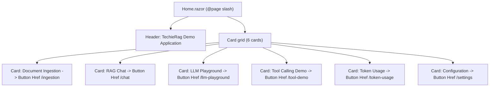

**Controls on this screen**

| Control | Type | Purpose | Populated / calculated by |
|---------|------|---------|---------------------------|
| File Ingestion | Button (Href `/ingestion`) | Navigate to ingestion page | Static markup (Home.razor:21) |
| Open Chat | Button (Href `/chat`) | Navigate to RAG chat | Static markup (Home.razor:37) |
| Open Playground | Button (Href `/llm-playground`) | Navigate to LLM playground | Static markup (Home.razor:53) |
| Tool Demo | Button (Href `/tool-demo`) | Navigate to tool-calling demo | Static markup (Home.razor:69) |
| View Usage | Button (Href `/token-usage`) | Navigate to token usage | Static markup (Home.razor:85) |
| Settings | Button (Href `/settings`) | Navigate to Settings | Static markup (Home.razor:101) |

**Data lineage**

| Control / Action | Razor component (file:line) | Service method (file) | Library / data-access call (file) | Provider / persistence target | Notes / render status |
|------------------|----------------------------|-----------------------|-----------------------------------|-------------------------------|------------------------|
| All 6 cards | Home.razor:12-106 | none (no injected service) | none | none | static-only (unconfirmed). Pure navigation links; no data binding |

**Business rules / calculations on this screen**
- None. No `@code` block, no conditionals, no service calls.

**Known issues / gotchas**
- No `@rendermode` directive (only `@page "/"` at line 1), so it renders as static SSR. Acceptable because the page is link-only with no interactivity.
- Card titles/descriptions are hardcoded English strings; no localization.

---

### Anonymous · Settings

> **Runtime-verified 2026-07-02** (verifier `*verify all`, live boot :5099): renders ✓ + looks-right ✓ @1280 **and** @390. The form loads the REAL saved config (SqliteVec `techieragex.db`, Embedded BGE-M3). Save / Reset / Initialize write-actions were NOT re-driven (they mutate the live config); the known static issues below stand unchanged (Reset never calls `ReconfigureAsync`; `EnableTelemetry` persisted but unread).

- **Route:** `@page "/settings"` (`apps/TechieDesk/Components/Pages/Settings.razor:1`)
- **Razor file:** `apps/TechieDesk/Components/Pages/Settings.razor`
- **Reached via:** Configuration → Settings; **Log in as:** no auth (single anonymous user)
- **What this screen does:** Edits embedding provider, vector store, document-processing, and telemetry config. Loads from `techierag-config.json` (fallback `appsettings.json` / defaults), saves back to that JSON file, then rebuilds the live `ITechieRag` instance via `ReconfigureAsync`.

**Screen flowchart**
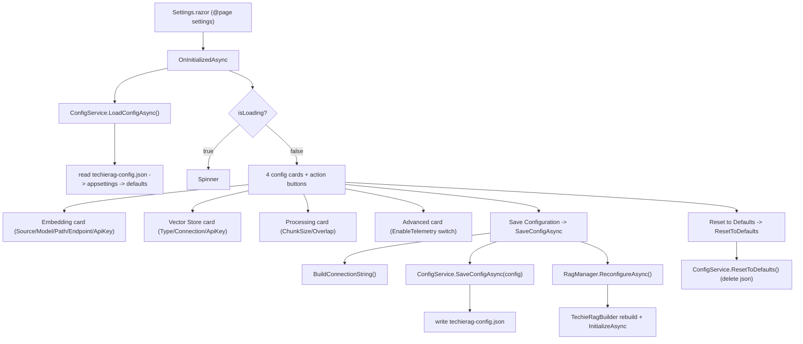

**Controls on this screen**

| Control | Type | Purpose | Populated / calculated by |
|---------|------|---------|---------------------------|
| Embedding Source | Select (7 items) | Choose embedding provider | `embeddingSourceString` get/set over `config.Embedding.Source` (Settings.razor:35, 220-224) |
| BGE-M3 info Alert | Alert (Info) | Shows only when Source=Embedded | `config.Embedding.Source == EmbeddingSource.Embedded` (Settings.razor:53) |
| Model Name | Input | Embedding model name (non-Embedded) | `config.Embedding.Model`; placeholder `GetModelPlaceholder()`, hint `GetModelHint()` (Settings.razor:65-66) |
| Model Path | Input | ONNX model dir (Source=Onnx only) | `config.Embedding.ModelPath` (Settings.razor:76) |
| Endpoint URL | Input | Provider endpoint (non-Embedded, non-Onnx) | `config.Embedding.Endpoint`; `GetEndpointPlaceholder()/GetEndpointHint()` (Settings.razor:86-87) |
| API Key | Input (Password) | Key for Azure/OpenAI embedding | shown when `RequiresApiKey()`; `config.Embedding.ApiKey` (Settings.razor:92-97) |
| Vector Store Type | Select (3 items) | Choose vector store | `vectorStoreTypeString` get/set over `config.VectorStore.Type` (Settings.razor:115, 226-230) |
| Connection / Path | Input | Store connection string | `vectorStoreConnectionInput` (Settings.razor:132); label/placeholder/hint helpers |
| Qdrant API Key | Input (Password) | Qdrant auth (Type=Qdrant only) | `config.VectorStore.ApiKey` (Settings.razor:142) |
| Chunk Size | Input (Number) | Chunk size in chars | `chunkSizeString` over `config.Processing.DefaultChunkSize` (Settings.razor:161, 232-236) |
| Chunk Overlap | Input (Number) | Overlap in chars | `chunkOverlapString` over `config.Processing.DefaultChunkOverlap` (Settings.razor:168, 238-242) |
| Enable Telemetry | Switch | Toggle telemetry flag | `config.EnableTelemetry` (Settings.razor:184) |
| Reset to Defaults | Button | Delete saved JSON, reload | `ResetToDefaults` (Settings.razor:195, 326-331) |
| Save Configuration | Button | Persist + apply config | `SaveConfigAsync` (Settings.razor:198, 303-324) |

**Data lineage**

| Control / Action | Razor component (file:line) | Service method (file) | Library / data-access call (file) | Provider / persistence target | Notes / render status |
|------------------|----------------------------|-----------------------|-----------------------------------|-------------------------------|------------------------|
| Initial load | OnInitializedAsync Settings.razor:244-262 | `ConfigService.LoadConfigAsync()` (TechieRagConfigService.cs:54) | `JsonSerializer.Deserialize<TechieRagConfig>` of `techierag-config.json`; fallback `configuration.GetSection("TechieRag")` (TechieRagConfigService.cs:64-120) | File `techierag-config.json` → else `appsettings.json` → else `new TechieRagConfig()` | static-only (unconfirmed). Cached in `cachedConfig` |
| All form fields | Settings.razor:35-184 | bound to in-memory `config` (field, Settings.razor:215) | none until Save | in-memory | static-only (unconfirmed) |
| Save Configuration | SaveConfigAsync Settings.razor:303-324 | `ConfigService.SaveConfigAsync(config)` (TechieRagConfigService.cs:148) then `RagManager.ReconfigureAsync()` (TechieRagManager.cs:63) | `File.WriteAllTextAsync(configFilePath, json)` (TechieRagConfigService.cs:160); rebuild via `TechieRagBuilder` (TechieRagManager.cs:94-253) + `InitializeAsync` (TechieRagManager.cs:81) | Writes `techierag-config.json`; rebuilds live `ITechieRag` (embedding/vector/LLM providers) | static-only (unconfirmed). Connection string normalized by `BuildConnectionString` (Settings.razor:280-301) before save |
| Reset to Defaults | ResetToDefaults Settings.razor:326-331 | `ConfigService.ResetToDefaults()` (TechieRagConfigService.cs:190) then `LoadConfigAsync()` | `File.Delete(configFilePath)` + clear cache (TechieRagConfigService.cs:192-198) | Deletes `techierag-config.json` | **suspected defect** — does NOT call `ReconfigureAsync`, so the live instance keeps old settings until a later Save — static |

**Business rules / calculations on this screen**
- Conditional fields: Embedded source hides Model/Endpoint/Path and shows an Info alert (Settings.razor:53-90); ONNX shows Model Path; Azure/OpenAI show API Key via `RequiresApiKey()` (line 333); Qdrant shows its own API Key (line 137).
- SQLite connection input is path-only in the UI; `BuildConnectionString` wraps it as `Data Source=...` and `ExtractConnectionInput` strips that prefix on load (Settings.razor:264-301).
- Placeholders/hints/labels are computed per selected source/type via the `Get*` helper switch methods (Settings.razor:335-401).

**Known issues / gotchas**
- **Reset does not re-apply to the running instance** (`Settings.razor:326-331`): it deletes the JSON and reloads the form but never calls `RagManager.ReconfigureAsync()`; the live RAG instance keeps old settings until the next Save. State mismatch. *(logged to REQ-UI-002)*
- **`EnableTelemetry` is a no-op for the applied instance**: it is saved to JSON but `TechieRagManager.CreateInstanceFromConfigAsync` never reads `savedConfig.EnableTelemetry` (no usage in `TechieRagManager.cs:94-253`) — the toggle is persisted but has no runtime effect. *(logged to REQ-UI-002)*
- `LoadConfigAsync` caches in `cachedConfig` and Settings + LlmSettings share the same scoped service instance and cached object, so edits on one page's `config` object can leak to the other if not reloaded.

---

### Anonymous · LlmSettings

> **Runtime-verified 2026-07-02** (verifier `*verify all`, live boot :5099): renders ✓ + looks-right ✓ @1280 **and** @390. LIVE: "Test LLM Connection" succeeded in **912 ms** against LM Studio (`qwen2.5-coder-32b-instruct` at `192.168.1.13:1234`) — inline success alert + toast + Serilog log entry all observed. Save / Reset were not re-driven.

- **Route:** `@page "/llm-settings"` (`apps/TechieDesk/Components/Pages/LlmSettings.razor:1`)
- **Razor file:** `apps/TechieDesk/Components/Pages/LlmSettings.razor`
- **Reached via:** Configuration → LLM Settings; **Log in as:** no auth (single anonymous user)
- **What this screen does:** Tabbed editor (Provider / Fallback / Usage / Prompts) for LLM provider config plus a live "Test LLM Connection" button. Loads/saves the same `techierag-config.json` and applies via `ReconfigureAsync`; the test calls the configured provider's `CompleteAsync` over HTTP.

**Screen flowchart**
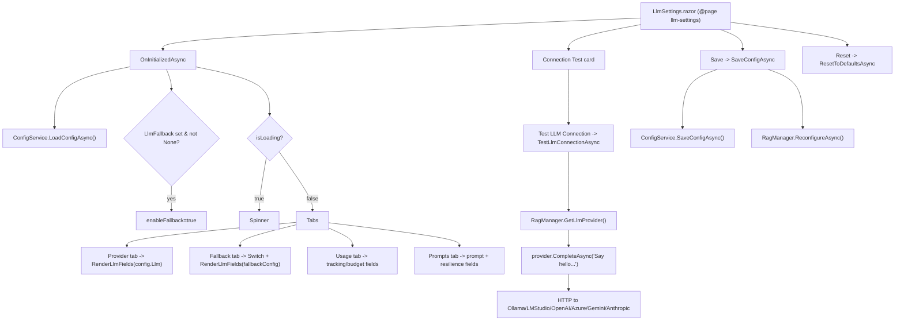

**Controls on this screen**

| Control | Type | Purpose | Populated / calculated by |
|---------|------|---------|---------------------------|
| Reset | Button | Reset LLM/usage/resilience/prompt to defaults | `ResetToDefaultsAsync` (LlmSettings.razor:17, 415-425) |
| Save | Button | Persist + apply config | `SaveConfigAsync` (LlmSettings.razor:18, 392-413) |
| Tabs (Provider/Fallback/Usage/Prompts) | Tabs | Section switching | static, `DefaultValue="provider"` (LlmSettings.razor:33) |
| Source (primary/fallback) | Select (7 LlmSource items) | Choose LLM provider | `@bind-Value` to `llmConfig.Source` in `RenderLlmFields` (LlmSettings.razor:300) |
| Endpoint | Input | Provider URL (when Source≠None) | `llmConfig.Endpoint`; placeholder `GetLlmEndpointPlaceholder` (LlmSettings.razor:322, 370-379) |
| API Key | Input (Password) | Key for OpenAICompatible/Azure/Gemini/Anthropic | `llmConfig.ApiKey` (LlmSettings.razor:326-334) |
| Model | Input | Model name | `llmConfig.Model`; placeholder `GetLlmModelPlaceholder` (LlmSettings.razor:339, 381-390) |
| Temperature | Slider (0-2) | Sampling temperature | `llmConfig.Temperature` via ValueChanged (LlmSettings.razor:347) |
| Max Tokens | Input (Number) | Max output tokens | `llmConfig.MaxTokens` via ValueChanged (LlmSettings.razor:353) |
| Enable Fallback Provider | Switch | Toggle fallback section | `enableFallback` (LlmSettings.razor:61) |
| Enable Token Tracking | Switch | Toggle usage tracking | `config.UsageTracking.Enabled` (LlmSettings.razor:82) |
| Max Total Tokens | Input (Number) | Token budget | `maxTotalTokensString` over `config.UsageTracking.MaxTotalTokens` (LlmSettings.razor:93, 231-235) |
| Max Cost (USD) | Input (Number) | Cost budget | `maxCostString` over `config.UsageTracking.MaxCostUsd` (LlmSettings.razor:99, 237-241) |
| Alert Threshold | Slider (0-100) | Budget alert % | `alertThresholdSlider` over `config.UsageTracking.AlertThreshold` (LlmSettings.razor:107, 225-229) |
| Block When Exceeded | Switch | Block on budget exceed | `config.UsageTracking.BlockOnExceeded` (LlmSettings.razor:112) |
| System Prompt | Textarea | RAG system prompt | `config.Prompt.SystemPrompt` (LlmSettings.razor:131) |
| Context Template | Textarea | Context chunk template | `config.Prompt.ContextChunkTemplate` (LlmSettings.razor:137) |
| Max Context Chunks / Tokens | Input (Number) | Context limits | `maxContextChunksString` / `maxContextTokensString` (LlmSettings.razor:144,150, 243-253) |
| Max Retries / Timeout / CB Threshold | Input (Number) | Resilience tuning | `maxRetriesString` / `timeoutString` / `cbThresholdString` (LlmSettings.razor:167,173,184, 255-271) |
| Handle Rate Limiting | Switch | Resilience toggle | `config.Resilience.HandleRateLimiting` (LlmSettings.razor:178) |
| Test LLM Connection | Button | Live provider ping | `TestLlmConnectionAsync` (LlmSettings.razor:200, 427-459) |

**Data lineage**

| Control / Action | Razor component (file:line) | Service method (file) | Library / data-access call (file) | Provider / persistence target | Notes / render status |
|------------------|----------------------------|-----------------------|-----------------------------------|-------------------------------|------------------------|
| Initial load | OnInitializedAsync LlmSettings.razor:273-293 | `ConfigService.LoadConfigAsync()` (TechieRagConfigService.cs:54) | deserialize `techierag-config.json` / appsettings (TechieRagConfigService.cs:64-120) | File / appsettings / defaults | static-only (unconfirmed). Fallback flag derived from `config.LlmFallback` |
| All tab fields | LlmSettings.razor:41-189 | bound to in-memory `config` / `fallbackConfig` (LlmSettings.razor:216-217) | none until Save | in-memory | static-only (unconfirmed) |
| Save | SaveConfigAsync LlmSettings.razor:392-413 | `ConfigService.SaveConfigAsync(config)` (TechieRagConfigService.cs:148); `RagManager.ReconfigureAsync()` (TechieRagManager.cs:63) | `File.WriteAllTextAsync` (TechieRagConfigService.cs:160); rebuild via `builder.UseLlm/WithFallbackLlm/WithUsageTracking/WithResilience` (TechieRagManager.cs:191-243) | Writes `techierag-config.json`; rebuilds `ITechieRag` LLM provider | static-only (unconfirmed). `config.LlmFallback` set to `fallbackConfig` or null before save (line 399) |
| Test LLM Connection | TestLlmConnectionAsync LlmSettings.razor:427-459 | `RagManager.GetLlmProvider()` (TechieRagManager.cs:365) | `instance.GetLlmProvider()` then `provider.CompleteAsync("Say 'hello'...")` (ILlmProvider.cs:31; e.g. OllamaLlmProvider/OpenAICompatibleLlmProvider/AnthropicLlmProvider `CompleteAsync`) | Live HTTP call to the configured provider | static-only (unconfirmed). Uses the CURRENTLY BUILT instance; unsaved edits are not reflected until Save — see gotchas |
| Reset | ResetToDefaultsAsync LlmSettings.razor:415-425 | none (no service call) | none | in-memory only | **suspected defect** — Reset never persists or reconfigures; resets form objects + shows success toast only — static |

**Business rules / calculations on this screen**
- `RenderLlmFields(llmConfig, prefix)` is reused for both primary and fallback; Endpoint/API Key/Model/Temp/MaxTokens only render when `Source != None`, API Key only for OpenAICompatible/Azure/Gemini/Anthropic (LlmSettings.razor:317-334).
- Usage and Prompt/Resilience sub-fields only render when their parent toggle is on (`config.UsageTracking.Enabled`, line 86; `enableFallback`, line 65).
- Slider/numeric string adapters convert between bound primitives and string inputs (LlmSettings.razor:225-271); `alertThresholdSlider` scales 0-1 ↔ 0-100.
- Default Anthropic model placeholder is `claude-sonnet-4-5-20250929` (LlmSettings.razor:388) and default endpoint `https://api.anthropic.com` (line 377) — placeholders only, not applied values.

**Known issues / gotchas**
- **Reset is in-memory only and silent to the backend** (`ResetToDefaultsAsync`, `LlmSettings.razor:415-425`): resets the form objects and shows a success toast but never calls `SaveConfigAsync` or `RagManager.ReconfigureAsync()`. The "reset" is lost unless the user also clicks Save (and is inconsistent with Settings.razor's Reset, which at least deletes the JSON). *(logged to REQ-UI-003)*
- **Test-vs-edit staleness**: `TestLlmConnectionAsync` (line 435) uses `RagManager.GetLlmProvider()` which returns the provider from the last-built instance. Unsaved edits in the form are not reflected; you must Save (→ `ReconfigureAsync`) before Test reflects new settings. Not obvious from the UI. *(logged to REQ-UI-009)*
- `GetLlmProvider()` calls `GetInstanceAsync().GetAwaiter().GetResult()` (`TechieRagManager.cs:367`) — sync-over-async blocking on the Blazor circuit thread; can stall/deadlock under load.
- Dead code: `GetMaxTokensString`/`SetMaxTokens` (LlmSettings.razor:360-368) are defined but never referenced (Max Tokens uses inline ValueChanged at line 353). The awaited `CompleteAsync` result (`response`, line 444) is discarded — the success message reports only model name + elapsed ms (cosmetic).

---

### Anonymous · Ingestion (File Ingestion)

> **Runtime-verified 2026-07-02** (verifier `*verify all`, live boot :5099): renders ✓ + looks-right ✓ @1280 **and** @390. LIVE DATA: the Vector Store Statistics card showed correct counts before/after a real ingest (Documents 2 → 3 → 2). Note @390: the DataTable pagination buttons live inside the local `relative overflow-x-auto` wrapper (the accepted TR-004 containment pattern — reachable by scrolling the wrapper, not a defect).

- **Route:** `@page "/ingestion"` (`apps/TechieDesk/Components/Pages/Ingestion.razor:1`)
- **Razor file:** `apps/TechieDesk/Components/Pages/Ingestion.razor`
- **Reached via:** Data → File Ingestion; **Log in as:** no auth (single anonymous user)
- **What this screen does:** Scans a server-side folder for files matching a pattern and ingests each one into the vector store (read → chunk → embed → upsert), showing per-file results, vector-store stats, and the document list.

**Screen flowchart**
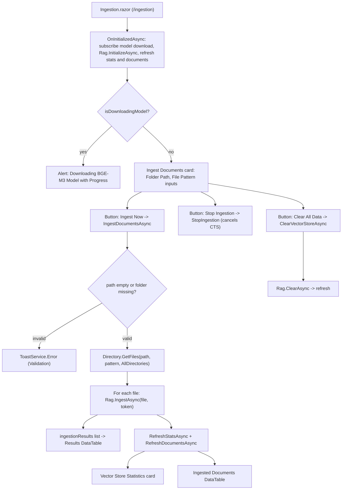

**Controls on this screen**

| Control | Type | Purpose | Populated / calculated by |
|---------|------|---------|---------------------------|
| Documents Folder Path | `Input` (`@bind documentsPath`) | Server-side folder to scan | Two-way bind to `documentsPath` (Ingestion.razor:44, 159) |
| File Pattern | `Input` (`@bind filePattern`) | Glob pattern (`*.*` default) | Two-way bind to `filePattern` (Ingestion.razor:51, 160) |
| Ingest Now | `Button` | Starts folder ingestion | `IngestDocumentsAsync` (Ingestion.razor:57, 225) |
| Stop Ingestion | `Button` (while ingesting) | Cancels run | `StopIngestion` → `ingestionCts.Cancel()` (Ingestion.razor:63, 214) |
| Clear All Data | `Button` (Destructive) | Wipes vector store | `ClearVectorStoreAsync` → `Rag.ClearAsync` (Ingestion.razor:67, 330) |
| Progress / progressMessage | `Progress` + `TypographyMuted` | Live progress | `progress` / `progressMessage` set in loop (Ingestion.razor:75-76, 280-281) |
| Model download alert | `Alert` + `Progress` | BGE-M3 download status | `ModelDownloadService.Instance` events (Ingestion.razor:19-33, 176) |
| Ingestion Results | `DataTable<IngestionResult>` | Per-file success/error | `ingestionResults` local record list (Ingestion.razor:93, 172, 288) |
| Vector Store Statistics | Card | Doc/chunk count, size, last time | `stats` from `Rag.GetStatsAsync` (Ingestion.razor:106-129, 363) |
| Ingested Documents | `DataTable<Document>` | Name + chunk count | `documents` from `Rag.ListDocumentsAsync` (Ingestion.razor:146, 368) |

**Data lineage**

| Control / Action | Razor component (file:line) | Service method (file) | Library / data-access call (file) | Provider / persistence target | Notes / render status |
|------------------|----------------------------|-----------------------|-----------------------------------|-------------------------------|------------------------|
| Page init | OnInitializedAsync (Ingestion.razor:174) | none — injects `ITechieRag Rag` directly (Ingestion.razor:5) | `ITechieRag.InitializeAsync` → `TechieRagClient.InitializeAsync` (TechieRagClient.cs:82) → `vectorStore.InitializeAsync` (TechieRagClient.cs:85) | IVectorStore (default SqliteVecStore, `Data Source=techierag.db` — TechieRagConfigService.cs:100-101) | static-only (unconfirmed) |
| Ingest Now (per file) | IngestDocumentsAsync loop (Ingestion.razor:287) | none (direct `Rag`) | `ITechieRag.IngestAsync` → `TechieRagClient.IngestAsync` (TechieRagClient.cs:104): `processor.ProcessAsync` → `embeddingProvider.EmbedBatchAsync` (TechieRagClient.cs:160) → `vectorStore.UpsertBatchAsync` (TechieRagClient.cs:172) | Embedding provider (HTTP Ollama/LmStudio/Azure, or ONNX `EmbeddedEmbeddingProvider.cs:324`) + IVectorStore upsert | static-only (unconfirmed) |
| File scan | Directory.GetFiles (Ingestion.razor:254) | n/a (in-component `System.IO`) | n/a | local filesystem (server-side) | static-only (unconfirmed) |
| Clear All Data | ClearVectorStoreAsync (Ingestion.razor:334) | none (direct `Rag`) | `ITechieRag.ClearAsync` → `TechieRagClient.ClearAsync` (TechieRagClient.cs:405) → `vectorStore.ClearAsync` (TechieRagClient.cs:408) | IVectorStore | static-only (unconfirmed) |
| Vector Store Statistics | stats card (Ingestion.razor:106) | none (direct `Rag`) | `ITechieRag.GetStatsAsync` → `TechieRagClient.GetStatsAsync` (TechieRagClient.cs:383) → `vectorStore.GetStatsAsync` (TechieRagClient.cs:386) | IVectorStore | static-only (unconfirmed) |
| Ingested Documents table | documents table (Ingestion.razor:146) | none (direct `Rag`) | `ITechieRag.ListDocumentsAsync` → `TechieRagClient.ListDocumentsAsync` (TechieRagClient.cs:370) → `vectorStore.ListDocumentsAsync` (TechieRagClient.cs:373) | IVectorStore | static-only (unconfirmed) |
| Delete document | `DeleteDocumentAsync` (Ingestion.razor:346) | none (direct `Rag`) | `ITechieRag.DeleteDocumentAsync` → `TechieRagClient.DeleteDocumentAsync` (TechieRagClient.cs:356) → `vectorStore.DeleteByDocumentAsync` (TechieRagClient.cs:361) | IVectorStore | **unreachable from UI** — no control binds to it on this page — static |

**Business rules / calculations on this screen**
- Pre-flight validation: empty path or non-existent folder aborts with a validation toast (Ingestion.razor:227-237).
- Recursive scan: `Directory.GetFiles(..., SearchOption.AllDirectories)` (Ingestion.razor:254); zero matches aborts with toast (256-261).
- Progress math: `progress = 5 + (int)((i / files.Length) * 90)` during loop, 100 on complete (Ingestion.razor:281, 304).
- Per-file failures are caught and recorded (truncated to 100 chars) without stopping the batch; cancellation breaks the loop and marks remaining as skipped (Ingestion.razor:291-301, 271-276).
- Document ID is generated in the library as `Guid.NewGuid()` (TechieRagClient.cs:129), not by the screen. `FormatSize`/`FormatBytes` convert byte counts for display (Ingestion.razor:371-385).

**Known issues / gotchas**
- `DeleteDocumentAsync` (Ingestion.razor:346) is defined but **no control invokes it** on this page — dead code here (delete exists only on TextIngestion).
- Server-side path input: ingestion reads folders on the **server** host, not the client machine — the `C:\Documents\RAGData` placeholder (Ingestion.razor:44) is misleading on a remote/Linux deployment.
- `EnsureDocumentExistsAsync` (TechieRagClient.cs:622) is a documented no-op (`await Task.CompletedTask`, line 632); document records depend on `UpsertBatchAsync` behaviour of the chosen store.
- Statistics/Results cards are conditionally rendered (`stats != null`, `ingestionResults.Count > 0`); on a fresh store they render-empty by design — static.

---

### Anonymous · TextIngestion (Text Ingestion)

> **Runtime-verified 2026-07-02** (verifier `*verify all`, live boot :5099): renders ✓ + looks-right ✓ @1280 **and** @390. LIVE WRITE PATH: ingested a temp doc `verify-datapath-tmp` → success toast + document id, sidebar Documents count 2 → 3; the per-row trash delete removed it → back to 2. The chunk → BGE-M3 embed → SQLite-vec cycle is proven end-to-end.

- **Route:** `@page "/text-ingestion"` (`apps/TechieDesk/Components/Pages/TextIngestion.razor:1`)
- **Razor file:** `apps/TechieDesk/Components/Pages/TextIngestion.razor`
- **Reached via:** Data → Text Ingestion; **Log in as:** no auth (single anonymous user)
- **What this screen does:** Lets the user paste raw text with a name and optional source, then ingests it directly (chunk → embed → upsert) into the vector store; sidebar shows stats and a deletable document list.

**Screen flowchart**
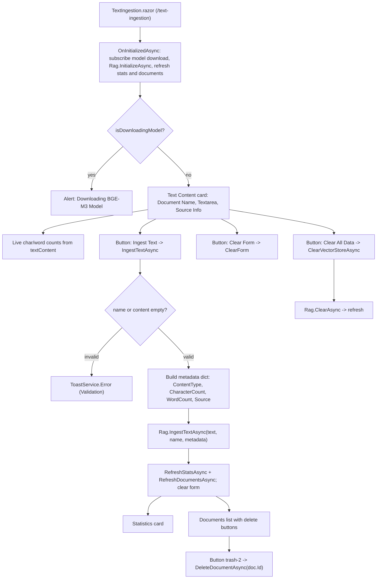

**Controls on this screen**

| Control | Type | Purpose | Populated / calculated by |
|---------|------|---------|---------------------------|
| Document Name | `Input` (Required) | Friendly name | Two-way bind to `documentName` (TextIngestion.razor:47, 148) |
| Text Content | `Textarea` | Raw text to ingest | Two-way bind to `textContent` (TextIngestion.razor:55, 149) |
| Char / word counters | `TypographyMuted` ×2 | Live counts | Computed from `textContent` inline (TextIngestion.razor:57-58) |
| Source Info | `Input` | Optional source URL/id | Two-way bind to `sourceInfo` (TextIngestion.razor:66, 150) |
| Ingest Text | `Button` | Ingests the text | `IngestTextAsync` (TextIngestion.razor:72, 204) |
| Clear Form | `Button` (Outline) | Resets the 3 fields | `ClearForm` (TextIngestion.razor:76, 197) |
| Clear All Data | `Button` (Destructive) | Wipes vector store | `ClearVectorStoreAsync` → `Rag.ClearAsync` (TextIngestion.razor:77, 267) |
| Progress / message | `Progress` + `TypographyMuted` | Ingest progress | `progress`/`progressMessage` (TextIngestion.razor:83-84, 224-246) |
| Statistics | Card | Doc/chunk count, storage | `stats` from `Rag.GetStatsAsync` (TextIngestion.razor:93-113, 299) |
| Documents list | `@foreach` rows | Names + delete button | `documents` from `Rag.ListDocumentsAsync` (TextIngestion.razor:130, 304) |
| Delete (trash-2) | `Button` (Ghost icon) | Deletes one document | `DeleteDocumentAsync(doc.Id)` (TextIngestion.razor:134, 282) |

**Data lineage**

| Control / Action | Razor component (file:line) | Service method (file) | Library / data-access call (file) | Provider / persistence target | Notes / render status |
|------------------|----------------------------|-----------------------|-----------------------------------|-------------------------------|------------------------|
| Page init | OnInitializedAsync (TextIngestion.razor:159) | none — injects `ITechieRag Rag` directly (TextIngestion.razor:5) | `ITechieRag.InitializeAsync` → `TechieRagClient.InitializeAsync` (TechieRagClient.cs:82) → `vectorStore.InitializeAsync` (TechieRagClient.cs:85) | IVectorStore (default SqliteVecStore) | static-only (unconfirmed) |
| Ingest Text | IngestTextAsync (TextIngestion.razor:243) | none (direct `Rag`) | `ITechieRag.IngestTextAsync` → `TechieRagClient.IngestTextAsync` (TechieRagClient.cs:189): `TextChunker.ChunkText` (203) → `embeddingProvider.EmbedBatchAsync` (249) → `vectorStore.UpsertBatchAsync` (261) | Embedding provider (HTTP/ONNX) + IVectorStore upsert | static-only (unconfirmed) |
| Clear All Data | ClearVectorStoreAsync (TextIngestion.razor:271) | none (direct `Rag`) | `ITechieRag.ClearAsync` → `TechieRagClient.ClearAsync` (TechieRagClient.cs:405) → `vectorStore.ClearAsync` (408) | IVectorStore | static-only (unconfirmed) |
| Statistics card | stats card (TextIngestion.razor:93) | none (direct `Rag`) | `ITechieRag.GetStatsAsync` → `TechieRagClient.GetStatsAsync` (TechieRagClient.cs:383) → `vectorStore.GetStatsAsync` (386) | IVectorStore | static-only (unconfirmed) |
| Documents list | foreach (TextIngestion.razor:130) | none (direct `Rag`) | `ITechieRag.ListDocumentsAsync` → `TechieRagClient.ListDocumentsAsync` (TechieRagClient.cs:370) → `vectorStore.ListDocumentsAsync` (373) | IVectorStore | static-only (unconfirmed) |
| Delete (trash-2) | DeleteDocumentAsync (TextIngestion.razor:282) | none (direct `Rag`) | `ITechieRag.DeleteDocumentAsync` → `TechieRagClient.DeleteDocumentAsync` (TechieRagClient.cs:356) → `vectorStore.DeleteByDocumentAsync` (361) | IVectorStore | static-only (unconfirmed) |

**Business rules / calculations on this screen**
- Validation: empty `documentName` or empty `textContent` aborts with a validation toast (TextIngestion.razor:206-216).
- Metadata built client-side: `ContentType="text"`, `CharacterCount`, `WordCount`, and `Source` only when `sourceInfo` is non-blank (TextIngestion.razor:229-236). Word count uses `Split(...).Length` (line 58, 233).
- On success the form fields are cleared and stats/documents refreshed (TextIngestion.razor:249-253). Document ID generated in library via `Guid.NewGuid()` (TechieRagClient.cs:200); chunking via `TextChunker.ChunkText` using `config.Processing.DefaultChunkSize/Overlap` (TechieRagClient.cs:203-206).

**Known issues / gotchas**
- **Progress bar is cosmetic/fake**: hardcoded 10/30/100 steps with artificial `Task.Delay(50)` (TextIngestion.razor:227, 241) — it does not reflect actual embedding/upsert progress.
- `Required="true"` on Document Name (line 47) is decorative — no `EditForm`/validation wraps it; enforcement is the manual null check in `IngestTextAsync` (206).
- Live char/word counts recompute on every render via inline `Split(...)` (line 58) — O(n) per render for large pastes (minor perf gotcha).
- Both ingestion pages inject `ITechieRag` directly; neither uses `TechieRagManager`/`TechieRagConfigService` at runtime (those configure/build the DI-registered `ITechieRag`).

---

### Anonymous · RAG Chat

> **Runtime-verified 2026-07-02** (verifier `*verify all`, live boot :5099, LM Studio `qwen2.5-coder-32b-instruct`): renders ✓ + looks-right ✓ @1280 **and** @390. LIVE: Auto-RAG with streaming ON returned a streamed answer, the "Sources Used (N)" panel rendered with % relevance scores, and the session footer moved off zero. Direct-LLM streaming was also re-confirmed.

- **Route:** `@page "/chat"` (`apps/TechieDesk/Components/Pages/Chat.razor:1`)
- **Razor file:** `apps/TechieDesk/Components/Pages/Chat.razor`
- **Reached via:** AI Features → RAG Chat; **Log in as:** no auth (single anonymous user)
- **What this screen does:** Conversational RAG UI. User asks a question; depending on the selected mode it does retrieval-only search, a direct LLM completion, or full Auto-RAG (retrieve + generate). Shows sources, a token/cost footer, and optional token-by-token streaming.

**Screen flowchart**
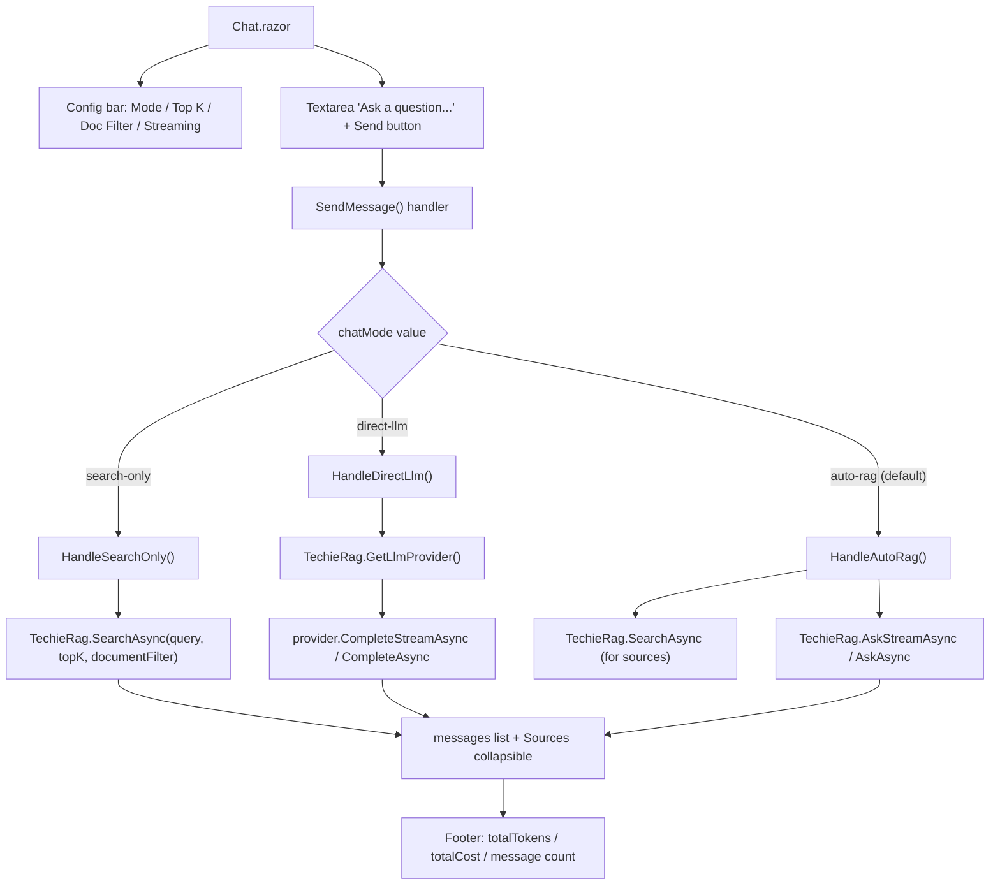

**Controls on this screen**

| Control | Type | Purpose | Populated / calculated by |
|---------|------|---------|---------------------------|
| Clear Chat | Button | Clears messages + token/cost counters | `ClearChat()` Chat.razor:301 |
| New Conversation | Button | Clears messages + streaming buffer | `NewConversation()` Chat.razor:308 |
| Chat Configuration | Collapsible | Toggles config bar | `@bind-Open="configOpen"` Chat.razor:31 |
| Mode | Select | auto-rag / direct-llm / search-only | `@bind chatMode` (default "auto-rag") Chat.razor:46,178 |
| Top K | Select | Retrieval depth (3/5/10) | `@bind topKString`; `topK` derived prop Chat.razor:61,187 |
| Doc Filter | Input | Optional documentId filter | `@bind documentFilter` Chat.razor:76 |
| Streaming | Switch | Toggle token streaming | `@bind useStreaming` (default true) Chat.razor:83,180 |
| Message list | foreach render | User/assistant bubbles | `messages` list Chat.razor:107 |
| Sources Used (n) | Collapsible per assistant msg | Source docs + score badge | `msg.Sources` Chat.razor:113-132 |
| Streaming indicator | conditional block | Live streamed text + cursor, or "Thinking..." | `isProcessing` / `streamingContent` Chat.razor:137-154 |
| Ask a question | Textarea | Question input | `@bind userInput` Chat.razor:160 |
| Send | Button | Submits question | `SendMessage()`; disabled while processing/empty Chat.razor:161 |
| Footer stats | text | Session tokens / cost / msg count | `totalTokens`, `totalCost`, `messages.Count` Chat.razor:167-170 |

**Data lineage**

| Control / Action | Razor component (file:line) | Service method (file) | Library / data-access call (file) | Provider / persistence target | Notes / render status |
|------------------|----------------------------|-----------------------|-----------------------------------|-------------------------------|------------------------|
| Send (search-only) | Chat.razor:240 `HandleSearchOnly` | `TechieRagManager.SearchAsync` (TechieRagManager.cs:281) | `TechieRagClient.SearchAsync` (TechieRagClient.cs:330) → `embeddingProvider.EmbedAsync` (342) + `vectorStore.SearchAsync` (345) | Embedding + vector store | static-only (unconfirmed). Renders raw search results as assistant text |
| Send (direct-llm, stream) | Chat.razor:261 `HandleDirectLlm` | `TechieRagManager.GetLlmProvider` (TechieRagManager.cs:365) | `ILlmProvider.CompleteStreamAsync` (ILlmProvider.cs:37) | LLM provider HTTP | **suspected defect** — streaming branch never adds to `totalTokens`/`totalCost`; footer stays 0 (Chat.razor:263-264) — static |
| Send (direct-llm, non-stream) | Chat.razor:270 | same `GetLlmProvider` | `ILlmProvider.CompleteAsync` (ILlmProvider.cs:31) | LLM provider HTTP | static-only. Updates `totalTokens` only (no cost) |
| Send (auto-rag, stream) | Chat.razor:280-288 `HandleAutoRag` | `TechieRagManager.SearchAsync` + `AskStreamAsync` (TechieRagManager.cs:281,323) | `TechieRagClient.SearchAsync` (330) for sources, then `TechieRagClient.AskStreamAsync` (443) → `promptTemplate.BuildRagPrompt` (455) → `llmProvider.ChatStreamAsync` (457) | Embedding + vector store + LLM provider HTTP | **suspected defects** — (1) search runs TWICE (sources + inside AskStreamAsync); (2) streaming branch never updates tokens/cost — static |
| Send (auto-rag, non-stream) | Chat.razor:292 | `TechieRagManager.AskAsync` (TechieRagManager.cs:311) | `TechieRagClient.AskAsync` (TechieRagClient.cs:415) | Embedding + vector store + LLM provider HTTP | static-only. Updates `totalTokens` + `totalCost` from `response.Usage` |
| Sources badge | Chat.razor:125 | n/a | `SearchResult.Score` / `Chunk.DocumentId` (from SearchAsync) | vector store | static-only. Score shown as %; DocumentName = DocumentId |

**Business rules / calculations on this screen**
- `topK` parsed from `topKString`, default 5 on failure (Chat.razor:187). Mode routing: "search-only" → search only; "direct-llm" → LLM, no retrieval; else → Auto-RAG (Chat.razor:212-223).
- Footer cost/tokens accumulate only in non-streaming branches; `totalCost` only ever incremented in auto-rag non-stream (Chat.razor:294). Send disabled while `isProcessing` or empty (line 161).

**Known issues / gotchas**
- **Streaming token/cost never counted (default path)**: both `HandleDirectLlm` (Chat.razor:259-266) and `HandleAutoRag` (278-288) streaming branches never add to `totalTokens`/`totalCost`. Since Streaming is **on by default**, the footer reads "0 tokens / $0.0000" regardless of usage. *(logged to REQ-UI-005)*
- **Double retrieval in streamed Auto-RAG**: `SearchAsync` is called once for sources (Chat.razor:280) and again internally by `AskStreamAsync` (TechieRagClient.cs:454) — duplicate embedding + vector query cost per question. *(logged to REQ-UI-005)*
- `HandleAutoRag` streaming passes null systemPrompt and no history — no conversation memory is used even though the library supports it; each question is stateless.
- Source label shows `DocumentId` (often a GUID/path) as the `DocumentName` (Chat.razor:246,281,296) — cosmetic.

---

### Anonymous · LLM Playground

> **Runtime-verified 2026-07-02** (verifier `*verify all`, live boot :5099, LM Studio `qwen2.5-coder-32b-instruct`): renders ✓ + looks-right ✓ @1280 **and** @390. LIVE: a completion returned text plus real token counts; Structured Output deserialized to the typed object (SentimentAnalysis fields rendered).

- **Route:** `@page "/llm-playground"` (`apps/TechieDesk/Components/Pages/LlmPlayground.razor:1`)
- **Razor file:** `apps/TechieDesk/Components/Pages/LlmPlayground.razor`
- **Reached via:** AI Features → LLM Playground; **Log in as:** no auth (single anonymous user)
- **What this screen does:** Direct LLM testbench with three tabs — Completion (single prompt, optional streaming), Structured Output (JSON-mode responses), and Chat (multi-turn direct LLM chat). Bypasses retrieval entirely; talks straight to the configured LLM provider.

**Screen flowchart**
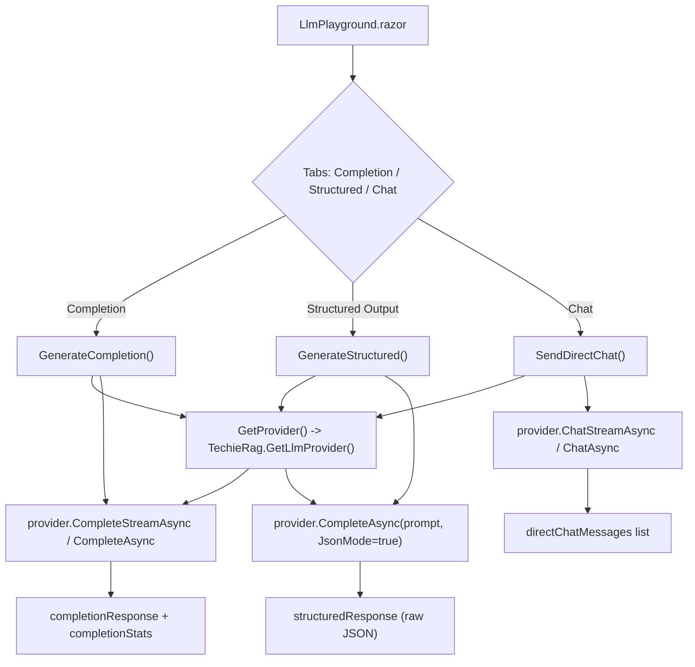

**Controls on this screen**

| Control | Type | Purpose | Populated / calculated by |
|---------|------|---------|---------------------------|
| Tabs (Completion/Structured/Chat) | Tabs | Switch test mode (default "completion") | `DefaultValue="completion"` LlmPlayground.razor:16 |
| System Prompt | Textarea | System role text | `@bind systemPrompt` (default "You are a helpful assistant.") :34,180 |
| User Prompt | Textarea | User message | `@bind userPrompt` :40 |
| Temperature | Number Input | Temperature | `@bind temperatureString` (default "0.7") :47,193 |
| Max Tokens | Number Input | Max tokens | `@bind maxTokensString` (default "2048") :53,194 |
| Streaming | Switch | Toggle streaming (completion+chat) | `@bind useStreaming` (default true) :60,185 |
| Generate | Button | Run completion | `GenerateCompletion()` :66 |
| Completion Response card | conditional | Answer + stats | `completionResponse`/`completionStats` :73-87 |
| Structured Prompt | Textarea | Prompt for typed test | `@bind structuredPrompt` :102 |
| Response Type | Select | sentiment/weather/book | `@bind structuredType` (default "sentiment") :108,183 |
| Generate Typed Response | Button | Run JSON-mode call | `GenerateStructured()` :120 |
| Parsed Result card | conditional | Raw JSON string output | `structuredResponse` :127-137 |
| Direct chat messages | foreach render | Chat bubbles | `directChatMessages` :151 |
| Chat input + Send | Textarea + Button | Send chat turn | `SendDirectChat()` :169-170 |
| Clear (chat) | Button | Clears chat history | `ClearDirectChat()` :147,326 |

**Data lineage**

| Control / Action | Razor component (file:line) | Service method (file) | Library / data-access call (file) | Provider / persistence target | Notes / render status |
|------------------|----------------------------|-----------------------|-----------------------------------|-------------------------------|------------------------|
| Generate (stream) | LlmPlayground.razor:221 `GenerateCompletion` | `TechieRagManager.GetLlmProvider` (TechieRagManager.cs:365) | `ILlmProvider.CompleteStreamAsync` (ILlmProvider.cs:37) | LLM provider HTTP | static-only. Stats = elapsed ms only (streaming yields strings, not usage) |
| Generate (non-stream) | LlmPlayground.razor:232 | same `GetLlmProvider` | `ILlmProvider.CompleteAsync` (ILlmProvider.cs:31) | LLM provider HTTP | static-only. Stats include input/output tokens from `response.Usage` |
| Generate Typed Response | LlmPlayground.razor:268 `GenerateStructured` | same `GetLlmProvider` | `ILlmProvider.CompleteAsync` with `LlmCompletionOptions{JsonMode=true}` (ILlmProvider.cs:31) | LLM provider HTTP | **suspected defect** — output rendered as raw JSON string, never deserialized into the named types — static |
| Chat Send (stream) | LlmPlayground.razor:302 `SendDirectChat` | same `GetLlmProvider` | `ILlmProvider.ChatStreamAsync(IReadOnlyList<ChatMessage>)` (ILlmProvider.cs:49) | LLM provider HTTP | static-only. Sends full `directChatMessages` history each turn |
| Chat Send (non-stream) | LlmPlayground.razor:311 | same `GetLlmProvider` | `ILlmProvider.ChatAsync` (ILlmProvider.cs:43) | LLM provider HTTP | static-only |

**Business rules / calculations on this screen**
- Provider gate: `GetProvider()` shows a toast error and returns null if no LLM configured (LlmPlayground.razor:196-202); all actions early-return.
- Completion concatenates system + user prompt as `"{system}\n\n{user}"` when system is non-empty (:220,231). Structured mode wraps the prompt with a hardcoded JSON-shape instruction per `structuredType` (:259-265). Chat sends the entire local message history each turn (no server-side memory).

**Known issues / gotchas**
- **Temperature and Max Tokens are collected but never used**: `temperatureString`/`maxTokensString` are never parsed into `LlmCompletionOptions` for any call (LlmPlayground.razor:47,53 vs 221/232/268). No-op inputs. *(logged to REQ-UI-006)*
- **Structured "Parsed Result" is not parsed**: it renders the raw model JSON string; the SentimentAnalysis/WeatherForecast/BookSummary types implied by the labels are never used for deserialization (:269,134). Misleading label. *(logged to REQ-UI-006)*
- System Prompt in Completion is folded into the user-prompt string rather than passed as `options.SystemPrompt`; Structured and Chat tabs ignore the System Prompt field entirely.

---

### Anonymous · Tool Calling Demo

> **Runtime-verified 2026-07-02** (verifier `*verify REQ-UI-007`; **re-confirmed same day by `*verify all`**, live boot :5099, LM Studio qwen2.5-coder-32b): the live agent loop made REAL `get_weather` **and** `calculate_math` tool calls end-to-end and the **Execution Trace rendered each live step** (requested → executed + result → final answer). All controls render ✓; looks-right ✓ @1280 **and** @390 (the earlier mobile overflow was fixed same day — `main{min-width:0}` TR-003 workaround + `relative overflow-x-auto` DataTable wrapper TR-004 + wrapping rows; `document.scrollWidth=390` at 390px).

- **Route:** `@page "/tool-demo"` (`apps/TechieDesk/Components/Pages/ToolDemo.razor:1`)
- **Razor file:** `apps/TechieDesk/Components/Pages/ToolDemo.razor`
- **Reached via:** AI Features → Tool Demo; **Log in as:** no auth (single anonymous user)
- **What this screen does:** Demonstrates the agent tool-calling loop. Registers four demo tools (weather, math, document search, current time) plus user-defined mock tools, then runs a multi-iteration agent loop where the LLM decides which tools to call.

**Screen flowchart**
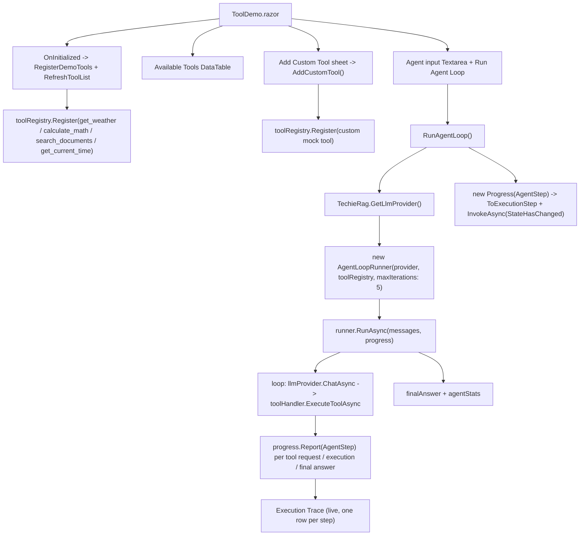

**Controls on this screen**

| Control | Type | Purpose | Populated / calculated by |
|---------|------|---------|---------------------------|
| Available Tools table | DataTable | Registered tools (Name/Description/Status) | `toolRows` from `RefreshToolList()` ToolDemo.razor:69,212 |
| Add Custom Tool | Sheet + Button | Register a mock tool | `AddCustomTool()` :62,219 |
| Tool Name/Description/Schema/Mock Response | Inputs/Textareas | Custom tool fields | `@bind` customTool* :39,45,51,57 |
| Agent input | Textarea | Prompt for the agent | `@bind agentInput` :86 |
| Run Agent Loop | Button | Executes the agent loop | `RunAgentLoop()` :87 |
| Execution Trace | conditional | Per-step description/result | `executionSteps` :93-111 |
| Final Answer | conditional | Agent final text | `finalAnswer` :113-119 |
| Agent stats | text | Elapsed ms + total tokens | `agentStats` :121-124 |

**Data lineage**

| Control / Action | Razor component (file:line) | Service method (file) | Library / data-access call (file) | Provider / persistence target | Notes / render status |
|------------------|----------------------------|-----------------------|-----------------------------------|-------------------------------|------------------------|
| OnInitialized registers tools | ToolDemo.razor:161 `RegisterDemoTools` | n/a (local) | `ToolRegistry.Register` (ToolRegistry.cs:37,61) | in-memory tool registry | static-only. Four tools into local `toolRegistry` |
| search_documents tool body | ToolDemo.razor:200 | none — injects `ITechieRag TechieRag` directly (ToolDemo.razor:7) | `ITechieRag.SearchAsync` (ITechieRag.cs) → `TechieRagClient.SearchAsync` (TechieRagClient.cs:330) → embed + vector search | Embedding + vector store | static-only. Only invoked if the LLM chooses this tool |
| Add Tool | ToolDemo.razor:219 `AddCustomTool` | n/a | `ToolRegistry.Register` (ToolRegistry.cs:61) with constant mock response | in-memory registry | static-only. Schema passed verbatim, no validation |
| Run Agent Loop | ToolDemo.razor:242 `RunAgentLoop` | none — `ITechieRag.GetLlmProvider()` (ITechieRag.cs:186) → `TechieRagClient.GetLlmProvider()` (TechieRagClient.cs:540) | `new AgentLoopRunner(provider, toolRegistry, maxIterations: 5)` (ToolDemo.razor:261) → `AgentLoopRunner.RunAsync(messages, progress)` (AgentLoopRunner.cs:66) → loop of `ILlmProvider.ChatAsync` (AgentLoopRunner.cs:94,155) + `ToolRegistry.ExecuteToolAsync` (ToolRegistry.cs:70) | LLM provider HTTP + tool handlers | static-only. Final `LlmResponse.Content` → `finalAnswer` (ToolDemo.razor:279); stats = ms + input+output tokens (ToolDemo.razor:280) |
| Execution Trace render | ToolDemo.razor:93-111 (markup) ← `Progress<AgentStep>` (ToolDemo.razor:269) | `ToExecutionStep` (ToolDemo.razor:297) | `AgentLoopRunner.RunAsync` `progress.Report(new AgentStep{…})` per tool-call request (AgentLoopRunner.cs:108), each tool execution (cs:132), final answer (cs:99) and max-iterations (cs:156) | n/a (in-memory step list) | **renders ✓ (runtime-confirmed 2026-07-02)** — live agent loop rendered "Step 1: LLM requested tool(s): get_weather" → "Step 2: Executed get_weather({"city":"Tokyo"})" + result `32°C, Partly Cloudy…` → final-answer step; fallback branch (ToolDemo.razor:283) not hit. Runner reports `IProgress<AgentStep>` (AgentLoopRunner.cs:69); page appends live via `InvokeAsync(StateHasChanged)` (ToolDemo.razor:272) |

**Business rules / calculations on this screen**
- Demo tools registered once in `OnInitialized` (ToolDemo.razor:145-149). `AddCustomTool` requires non-empty name + description (221-231). Math tool evaluates via `System.Data.DataTable().Compute` (184).
- Provider gate: missing LLM → toast error, abort (244-249). Agent loop capped at `maxIterations: 5` (named arg, correctly skipping the optional `logger` — AgentLoopRunner.cs:39-43).

**Known issues / gotchas**
- ✅ **FIXED 2026-06-25 — Execution Trace now shows real steps.** `AgentLoopRunner.RunAsync` gained an optional `IProgress<AgentStep>` parameter (new `src/TechieRag/Models/AgentStep.cs` + `AgentStepKind`) and reports a step for each tool-call request, each individual tool execution (name/args/result/success), and the final answer. `ToolDemo.razor:269` passes a `Progress<AgentStep>` that maps each `AgentStep.Kind` (`ToolCallRequested`/`ToolExecuted`/`FinalAnswer`/`MaxIterationsReached`, AgentStep.cs:4-17) via `ToExecutionStep` (ToolDemo.razor:297) and re-renders live (`InvokeAsync(StateHasChanged)`, ToolDemo.razor:272). The old hardcoded single-step fallback (ToolDemo.razor:282-285) remains only as a safety net. Core library **re-built clean (0 errors, 2026-06-30)**. ⚠ **RUNTIME 2026-07-01 (verifier, live LM Studio) — the trace does NOT show real tool steps:** the agent loop made no tool call (the model answered/hallucinated), so `IProgress<AgentStep>` fired **0 times** and the page fell through to its `executionSteps.Count == 0` fallback (`ToolDemo.razor:283`) → the trace showed only "Step 1: LLM generated final answer". The endpoint DOES tool-call when tools are sent directly (raw `finish_reason:tool_calls`), so the gap is in the agent-loop/provider path — logged **TR-RAG-006**. ✅✅ **RESOLVED AT RUNTIME 2026-07-02 (verifier):** after the TR-RAG-006 fix (`LmStudioLlmProvider` tools/tool_calls) the live UI trace shows the real steps — requested tool(s) → `Executed get_weather({"city":"Tokyo"})` with result block → final answer using the tool result; two consecutive runs consistent (test `tests/verify/req-ui-007.spec.ts`, screenshot `test-results/screens/req-ui-007-trace-desktop.png`). *(REQ-UI-007 / REQ-RAG-009)*
- ✅ **RESOLVED 2026-07-02 — mobile (390px) overflow fixed same day.** Three compounding causes: TrBlazeUI `SidebarInset` `<main>` lacks `min-width:0` (**TR-003** — app workaround `main{min-width:0}` in `wwwroot/styles/base.css`); the DataTable pagination's `sr-only` absolutely-positioned spans escape scroll containers to the `relative` `<main>` and widen the document (**TR-004** — fixed by wrapping DataTables in `relative overflow-x-auto`, shadcn pattern); non-wrapping header/input rows (ToolDemo.razor:20 `flex-wrap`, :84 `flex-col sm:flex-row`). Verified: `/tool-demo` and `/ingestion` both measure `scrollWidth == 390` at a 390px viewport; visual gate PASS @1280 + @390 (screenshots `req-ui-007-trace-{desktop,mobile}.png`, `ingestion-fixed-{desktop,mobile}.png`). *(REQ-UI-007; REQ-UI-004)*
- The custom-tool JSON Schema textarea accepts arbitrary text passed verbatim to `Register` with no validation (ToolDemo.razor:231).
- `agentStats` token count comes from the final response only; intermediate tool-call round-trip tokens are not summed.

---

### Anonymous · Token Usage

> **Runtime-verified 2026-07-02** (verifier `*verify all`, live boot :5099): renders ✓ + looks-right ✓ @1280 **and** @390. LIVE DATA (upgrades the earlier zeros-only observation): after this run's live LLM operations the dashboard showed **non-zero Total Tokens / Operations** and a populated Usage-by-Model row for `qwen2.5-coder-32b-instruct`. Known issue stands: Estimated Cost reads $0.0000 for models absent from the hard-coded pricing table; the budget alert was not exercised (no budget configured).

- **Route:** `@page "/token-usage"` (`apps/TechieDesk/Components/Pages/TokenUsage.razor:1`)
- **Razor file:** `apps/TechieDesk/Components/Pages/TokenUsage.razor`
- **Reached via:** Monitoring → Token Usage; **Log in as:** no auth (single anonymous user)
- **What this screen does:** Read-only dashboard that polls the library's in-memory token tracker every 5s and shows session totals, cost, budget utilization, and a per-model usage grid; one action resets the session.

**Screen flowchart**
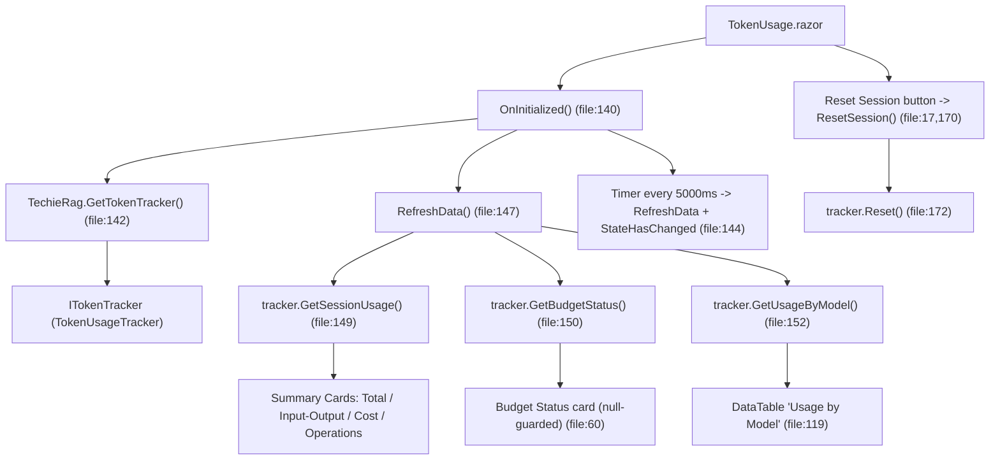

**Controls on this screen**

| Control | Type | Purpose | Populated / calculated by |
|---------|------|---------|---------------------------|
| Reset Session | Button (file:17) | Clears in-memory usage records | `ResetSession()` → `tracker.Reset()` (file:170,172) |
| Total Tokens | Card value (file:30) | Session total tokens | `sessionUsage.TotalTokens` (= `TotalInputTokens+TotalOutputTokens`, TokenUsage.cs:38) |
| Input / Output | Card value (file:38) | Input vs output counts | `sessionUsage.TotalInputTokens / TotalOutputTokens` |
| Estimated Cost | Card value (file:46) | Session cost USD | `sessionUsage.TotalEstimatedCostUsd` (`F4`) |
| Operations | Card value (file:54) | Recorded operation count | `sessionUsage.OperationCount` |
| Token Budget bar | Progress (file:74) | Token utilization % | `budgetStatus.TokenUtilization*100`; class via `GetBudgetClass` (file:163) |
| Cost Budget bar | Progress (file:85) | Cost utilization % | `budgetStatus.CostUtilization*100` |
| Budget Exceeded / Alert | Alert (file:91,98) | Conditional warning banners | `budgetStatus.IsExceeded` / `IsAlertTriggered` |
| Usage by Model grid | DataTable (file:119) | Per-model breakdown | `modelUsage` from `GetUsageByModel()` |

**Data lineage**

| Control / Action | Razor component (file:line) | Service method (file) | Library / data-access call (file) | Provider / persistence target | Notes / render status |
|------------------|----------------------------|-----------------------|-----------------------------------|-------------------------------|------------------------|
| Tracker handle | OnInitialized (TokenUsage.razor:142) | `ITechieRag.GetTokenTracker()` (ITechieRag.cs:192) → `TechieRagClient.GetTokenTracker()` (TechieRagClient.cs:543) | `TokenUsageTracker : ITokenTracker` (Services/TokenUsageTracker.cs:17) | In-memory `ConcurrentBag<TokenUsage>` (TokenUsageTracker.cs:19) — NO DB | static-only (unconfirmed) |
| Summary cards | RefreshData (TokenUsage.razor:149) | n/a (direct lib call) | `TokenUsageTracker.GetSessionUsage()` aggregates `usageRecords` (TokenUsageTracker.cs:67) | In-memory aggregation | static-only; empty if no LLM calls recorded |
| Budget Status card | RefreshData (TokenUsage.razor:150) | n/a | `TokenUsageTracker.GetBudgetStatus()` (returns null when no budget set, TokenUsageTracker.cs:127-139) | In-memory `currentBudget` (from `UsageTrackingConfig`, ctor TokenUsageTracker.cs:34-48) | renders-empty (expected — `@if (budgetStatus != null)` file:60; hidden unless a budget configured at build) — static |
| Usage by Model grid | RefreshData (TokenUsage.razor:152) | n/a | `TokenUsageTracker.GetUsageByModel()` groups by `ModelName` (TokenUsageTracker.cs:87) | In-memory aggregation | static-only; `@if (modelUsage.Count==0)` shows "No usage data yet." (file:113) |
| Reset Session | ResetSession (TokenUsage.razor:170) | n/a | `TokenUsageTracker.Reset()` drains the bag (TokenUsageTracker.cs:142) | In-memory clear | static-only |

**Business rules / calculations on this screen**
- `GetBudgetClass(utilization)` (file:163): ≥0.8 → red bar; ≥0.6 → yellow; else default. `TotalTokens = TotalInputTokens + TotalOutputTokens` (TokenUsage.cs:38).
- Cost computed at record time via `CalculateCost` using a built-in per-million pricing table (TokenUsageTracker.cs:158, 207-217); only models in that table get non-zero cost.
- `IsExceeded` when tokens ≥ MaxTotalTokens OR cost ≥ MaxCostUsd (TokenUsage.cs:89); `IsAlertTriggered` when either utilization ≥ AlertThreshold (TokenUsage.cs:94). 5s timer re-pulls all three queries (file:144); disposed in `Dispose()` (file:179).

**Known issues / gotchas**
- **"Estimated Cost" reads $0.0000 for any model not in the hard-coded pricing table** (TokenUsageTracker.cs:207-217) even though its tokens are counted — silent under-reporting for unlisted models. *(logged to REQ-UI-008)*
- Cards bind to `sessionUsage` while the budget bars use `budgetStatus` (whose `CurrentUsage` is a separate `GetSessionUsage()` call, TokenUsageTracker.cs:136); the 5s `RefreshData` fetches both together, but momentary skew is possible under concurrent recording.
- Usage is process-memory only (`ConcurrentBag`); an app restart loses all data — by design (no DB).

---

### Anonymous · Qdrant Admin

> **Runtime-verified 2026-07-02** (verifier `*verify all`, live boot :5099, Qdrant 1.15.5 in Docker): renders ✓ @1280 **and** @390; looks-right ✓ @1280 BUT **visual-broken @390 (DEFECT 2026-07-02)** — with a RUNNING container, the Container-Management row's Stop + logs icon buttons sit off-canvas (x ≈ 666–765 vs the 390px page), reachable only by panning the whole shell `<main>`; TR-003 class, needs flex-wrap/local containment; only manifests when a container is running. LIVE otherwise: Connect with API key → Docker Available, Qdrant Connected, **Version 1.15.5 (real server)**; collections table populated; created + deleted collection `verify_crud_tmp` via the UI; browsed `techierag_chunks` (1,043 points) with working pager Next/Previous; the vector detail dialog opened non-empty. Bulk delete + container lifecycle buttons were not exercised (real owner data/infrastructure).

- **Route:** `@page "/qdrant-admin"` (`apps/TechieDesk/Components/Pages/QdrantAdmin.razor:1`)
- **Razor file:** `apps/TechieDesk/Components/Pages/QdrantAdmin.razor`
- **Reached via:** Admin → Qdrant Admin; **Log in as:** no auth (single anonymous user)
- **What this screen does:** Operator console for the Qdrant vector DB — detects Docker, lists/creates/starts/stops Qdrant containers via the Docker API, tests the gRPC connection, and performs CRUD on collections and individual vectors via `Qdrant.Client`.

**Screen flowchart**
```mermaid
flowchart TD
  P["QdrantAdmin.razor"] --> INIT["OnInitializedAsync() (file:496)"]
  INIT --> RS["RefreshStatusAsync() (file:503)"]
  RS --> DAVAIL["DockerService.IsDockerAvailableAsync() (file:507)"]
  DAVAIL --> DK["DockerContainerService -> Docker daemon ping (DockerContainerService.cs:163)"]
  RS --> LIST["DockerService.ListQdrantContainersAsync() (file:510)"]
  LIST --> DKL["client.Containers.ListContainersAsync (DockerContainerService.cs:187)"]
  RS --> TEST["QdrantService.TestConnectionAsync() (file:524)"]
  TEST --> QC["QdrantClient.ListCollectionsAsync (QdrantAdminService.cs:261)"]
  RS --> CLU["QdrantService.GetClusterInfoAsync() (file:529)"]
  RS --> COLS["QdrantService.ListCollectionsAsync() (file:530)"]
  COLS --> GRIDC["Collections DataTable (file:272)"]
  P --> CONNBTN["Connect -> ApplyEndpointAsync() (file:49,545)"]
  CONNBTN --> CFG["QdrantService.ConfigureEndpoint(host,port,apiKey) (file:547)"]
  P --> CREATEC["Create Container -> CreateContainerAsync() (file:152,589)"]
  CREATEC --> DKCR["DockerService.CreateQdrantContainerAsync (DockerContainerService.cs:299)"]
  P --> STARTSTOP["Start / Stop -> Start/StopContainerAsync (file:188,192)"]
  STARTSTOP --> DKSS["DockerService.Start/StopContainerAsync (DockerContainerService.cs:351,365)"]
  P --> NEWCOL["New Collection -> CreateCollectionAsync() (file:255,650)"]
  NEWCOL --> QCRC["QdrantClient.CreateCollectionAsync (QdrantAdminService.cs:402)"]
  P --> DELCOL["Delete -> DeleteCollectionAsync() (file:281,665)"]
  P --> BROWSE["Browse -> SelectCollection() (file:280,684)"]
  BROWSE --> CINFO["QdrantService.GetCollectionInfoAsync (QdrantAdminService.cs:359)"]
  BROWSE --> BV["QdrantService.BrowseVectorsAsync (QdrantAdminService.cs:428)"]
  BV --> SCROLL["QdrantClient.ScrollAsync (QdrantAdminService.cs:438)"]
  BROWSE --> VGRID["Vectors DataTable (file:345)"]
  VGRID --> PREVNEXT["Previous / Next -> Browse offset (file:367,370)"]
  VGRID --> VIEWV["View -> ViewVectorAsync() (file:353,719)"]
  VIEWV --> GETV["QdrantService.GetVectorByIdAsync (QdrantAdminService.cs:456)"]
  VGRID --> DELV["Delete -> DeleteVectorAsync() (file:354,728)"]
```

**Controls on this screen**

| Control | Type | Purpose | Populated / calculated by |
|---------|------|---------|---------------------------|
| Refresh | Button (file:18) | Re-run full status refresh | `RefreshStatusAsync()` (file:503) |
| Host / gRPC Port / API Key | Input (file:34,40,46) | Endpoint config | `configHost`, `configPortString`, `configApiKey` (seeded from `QdrantService.Host/Port`, file:498) |
| Connect | Button (file:49) | Apply endpoint + reconnect | `ApplyEndpointAsync()` → `ConfigureEndpoint` (file:545,547) |
| Docker/Qdrant/Version/Collections status cards | Card values (file:62,72,82,90) | Live status | `isDockerAvailable`, `qdrantStatus`, `clusterInfo?.Version`, `clusterInfo?.TotalCollections` |
| Connection String + Copy | code + Button (file:100,101) | Show/copy gRPC conn string | `QdrantService.ConnectionString` (QdrantAdminService.cs:202); JS clipboard (file:576) |
| Create Container (dialog) | Dialog/Button (file:123,152) | Create new Qdrant container | `CreateContainerAsync()` (file:596) |
| Containers grid | DataTable (file:176) | List containers + Start/Stop/Use | `qdrantContainers` (file:510) |
| New Collection (dialog) | Dialog/Button (file:211,255) | Create vector collection | `CreateCollectionAsync()` (file:654) |
| Collections grid | DataTable (file:272) | List collections + Browse/Delete | `collections` (file:530) |
| Collection detail stats | Cards (file:303-338) | Points/Vector size/Distance/Status | `selectedCollectionDetail` (file:689) |
| Vectors grid | DataTable (file:345) | Page through vectors + View/Delete | `currentVectorPage.Vectors` (file:690) |
| Previous / Next | Button (file:367,370) | Custom pagination | `PreviousPage()`/`NextPage()` (file:698,707) |
| Vector Detail dialog | Dialog (file:388) | Full vector + payload | `selectedVector` (file:723) |

**Data lineage**

| Control / Action | Razor component (file:line) | Service method (file) | Library / data-access call (file) | Provider / persistence target | Notes / render status |
|------------------|----------------------------|-----------------------|-----------------------------------|-------------------------------|------------------------|
| Docker availability | RefreshStatusAsync (QdrantAdmin.razor:507) | `DockerContainerService.IsDockerAvailableAsync()` (DockerContainerService.cs:156) | `DockerClient.System.PingAsync()` (DockerContainerService.cs:163) | Docker daemon (npipe/unix socket, cs:140-142) | static-only; false if daemon not running |
| Containers grid | RefreshStatusAsync (QdrantAdmin.razor:510) | `DockerContainerService.ListQdrantContainersAsync()` (DockerContainerService.cs:181) | `client.Containers.ListContainersAsync(All=true)` filtered by image "qdrant" (cs:187-202) | Docker daemon | static-only; ports via `GetHostPort` 6333/6334 (cs:228) |
| Auto-connect to running container | RefreshStatusAsync (QdrantAdmin.razor:512-521) | `QdrantAdminService.ConfigureEndpoint` (QdrantAdminService.cs:230) | sets host=localhost, port=container.GrpcPort | In-memory endpoint | static-only; only when not Connected and a Running container has a gRPC port |
| Connection test / status | RefreshStatusAsync (QdrantAdmin.razor:524) | `QdrantAdminService.TestConnectionAsync()` (QdrantAdminService.cs:254) | `QdrantClient.ListCollectionsAsync()` (cs:261) | Qdrant via gRPC (`new QdrantClient(host,port,https:false,apiKey)`, cs:243) — **gRPC port 6334**, not HTTP 6333 | static-only; `LastError` on RpcException (cs:267) |
| Version / Collections-count cards | RefreshStatusAsync (QdrantAdmin.razor:529) | `QdrantAdminService.GetClusterInfoAsync()` (QdrantAdminService.cs:310) | `QdrantClient.ListCollectionsAsync()` (cs:315) | Qdrant gRPC | **suspected defect** — Version is **hard-coded `"1.12.x"`** (cs:318), not read from the server — static |
| Collections grid | RefreshStatusAsync (QdrantAdmin.razor:530) | `QdrantAdminService.ListCollectionsAsync()` (QdrantAdminService.cs:331) | `ListCollectionsAsync()` + per-collection `GetCollectionInfoAsync` (cs:334,341) | Qdrant gRPC | **suspected defect** — `VectorCount` and `PointCount` both set to the same `PointsCount` (cs:344-345); the "Vectors" column duplicates "Points" — static |
| Connection String / Copy | code (QdrantAdmin.razor:100) / CopyConnectionString (file:572) | `QdrantAdminService.ConnectionString` getter (cs:202) | string build + JS `navigator.clipboard.writeText` (file:576) | n/a | static-only; conn string embeds **masked** API key (cs:204) |
| Create Container | CreateContainerAsync (QdrantAdmin.razor:596) | `DockerContainerService.CreateQdrantContainerAsync` (DockerContainerService.cs:299) | `PullQdrantImageAsync` + `CreateContainerAsync` + `StartContainerAsync` (cs:307,340,344) | Docker daemon; `qdrant/qdrant:latest`, binds 6333/6334 | static-only |
| Start / Stop container | Start/StopContainerAsync (QdrantAdmin.razor:613,628) | `DockerContainerService.Start/StopContainerAsync` (cs:351,365) | `client.Containers.Start/StopContainerAsync` (cs:360,374) | Docker daemon | static-only |
| Use container | UseContainer (QdrantAdmin.razor:562) | `QdrantAdminService.ConfigureEndpoint` via `ApplyEndpointAsync` (file:568,547) | sets endpoint to container GrpcPort | In-memory + reconnect | static-only; **fire-and-forget** `_ = ApplyEndpointAsync()` (file:568) swallows exceptions |
| Create Collection | CreateCollectionAsync (QdrantAdmin.razor:654) | `QdrantAdminService.CreateCollectionAsync` (cs:390) | `QdrantClient.CreateCollectionAsync(VectorParams{Size,Distance})` (cs:402) | Qdrant gRPC | static-only; distance Cosine/Euclid/Dot (cs:394) |
| Delete Collection | DeleteCollectionAsync (QdrantAdmin.razor:669) | `QdrantAdminService.DeleteCollectionAsync` (cs:413) | `QdrantClient.DeleteCollectionAsync` (cs:416) | Qdrant gRPC | static-only; no confirm dialog |
| Browse (detail + vectors) | SelectCollection (QdrantAdmin.razor:684) | `GetCollectionInfoAsync` (cs:359) + `BrowseVectorsAsync` (cs:428) | `GetCollectionInfoAsync` + `ScrollAsync` (cs:362,438) | Qdrant gRPC | **suspected defect** — pagination offset built as `new PointId{Num=(ulong)offset}` (cs:437); Scroll `offset` is a point-ID cursor, not a numeric skip, so Next/Previous past page 1 misbehaves for UUID/non-sequential IDs — static |
| Vectors grid + Prev/Next | DataTable (QdrantAdmin.razor:345) / PreviousPage/NextPage (file:698,707) | `QdrantAdminService.BrowseVectorsAsync` (cs:428) | `QdrantClient.ScrollAsync` (cs:438) | Qdrant gRPC | grid uses `ShowPagination="false"`; pagination is custom Prev/Next (file:366) — static |
| View vector | ViewVectorAsync (QdrantAdmin.razor:719) | `QdrantAdminService.GetVectorByIdAsync` (cs:456) | `QdrantClient.RetrieveAsync(withPayload,withVectors)` (cs:465) | Qdrant gRPC | static-only; preview = first 10 values (cs:439) |
| Delete vector | DeleteVectorAsync (QdrantAdmin.razor:728) | `QdrantAdminService.DeleteVectorAsync` (cs:499) | `QdrantClient.DeleteAsync` by id or HasId filter (cs:507,514) | Qdrant gRPC | static-only |

**Business rules / calculations on this screen**
- gRPC vs HTTP: the admin talks to Qdrant over **gRPC** (default 6334), not the 6333 HTTP API; container HTTP port 6333 is shown only as info (cs:243).
- Endpoint precedence on refresh: if not already Connected and a Running container exposes a gRPC port, the page auto-overrides host/port to `localhost:<grpcPort>` before testing (file:512-521).
- New-collection defaults: 1024 dims (BGE-M3), Cosine distance (file:482-483); distance string mapped to `Distance` enum (cs:394-400). Vector page size fixed at 20; Prev/Next compute offset as `±Limit` bounded by `TotalCount` (file:702,711).
- Payload field extraction tries multiple key aliases (`Text/ChunkText/text`, `DocumentName/DocumentId/SourceFile`) (cs:447-448). "New Collection" disabled unless Connected (file:213); "Create Container" hidden unless Docker available (file:121).

**Known issues / gotchas**
- ✅ **Mobile (390px) overflow when a container is RUNNING — RESOLVED 2026-07-02** (flow-master `*build-phase`, REQ-UI-011): the Container-Management row's Stop + logs icon buttons rendered off-canvas (x ≈ 666–765 vs the 390px page). Root cause ran deeper than "add a scroll wrapper": the `.overflow-x-auto` Tailwind utility is **purged from the shipped TrBlazeUI CSS**, so the existing `
` DataTable wrappers were INERT (computed `overflow-x: visible`) and the 6-column containers table (~488px) escaped its 374px wrapper → `document.scrollWidth=496` @390. A `base.css` revival of the utility also failed to deliver (`MapStaticAssets` served 0-byte CSS to `br/gzip` clients). **Fix:** inline `style="overflow-x:auto;max-width:100%"` on the three QdrantAdmin DataTable wrappers (QdrantAdmin.razor:175/273/348) — immune to Tailwind purge + the static-asset pipeline. Live-verified with a running container: `document.scrollWidth` 496→**390** @390, table scrolls inside its local wrapper, desktop 1280 no regression (`tests/verify/req-ui-011-mobile-fix.spec.ts`, both cases PASS). Correction logged to TrBlazeUI feedback **TR-004** (the `overflow-x-auto` wrapper pattern noted elsewhere in this guide is inert in this app — inline style is the reliable mechanism).
- ✅ **Hard-coded version — RESOLVED 2026-07-01** (REQ-UI-012 Verified): `GetClusterInfoAsync` now reads `client.HealthAsync().Version` (falls back to "Unknown", never a fabricated number); live-verified showing real "1.15.5". *(the "1.12.x" description below is historical.)*
- ✅ **Collections grid "Vectors" column — RESOLVED 2026-07-01** (REQ-UI-012 Verified): `ListCollectionsAsync` now binds Vectors→`IndexedVectorsCount` (distinct from Points→`PointsCount`); no longer duplicated. *(SDK note TR-RAG-003.)*
- ✅ **Scroll pagination — RESOLVED 2026-07-01** (REQ-UI-013 Verified): `BrowseVectorsAsync` now threads Qdrant's opaque `ScrollResponse.NextPageOffset` cursor (not a numeric `PointId.Num`); page1/page2 non-overlapping + Previous replay live-verified. *(SDK note TR-RAG-004.)*
- Dead/unused helper `ShowCreateCollectionModal()` (file:642) never runs (the dialog uses a `DialogTrigger`), so re-opening retains prior field values. Destructive Delete actions have no confirmation. `UseContainer` fire-and-forget swallows errors (file:568).
- `{unresolved — TODO}`: whether TrBlazeUI `DataTable` *requires* a `Pagination` object could not be confirmed (component source is PAT-gated); given `ShowPagination="false"` it is almost certainly opt-in, so likely not a defect.

---

## Cross-cutting flows

### Configuration load / save / apply
Both config pages (`Settings`, `LlmSettings`) share `TechieRagConfigService` (JSON persistence) and `TechieRagManager` (live-instance rebuild).

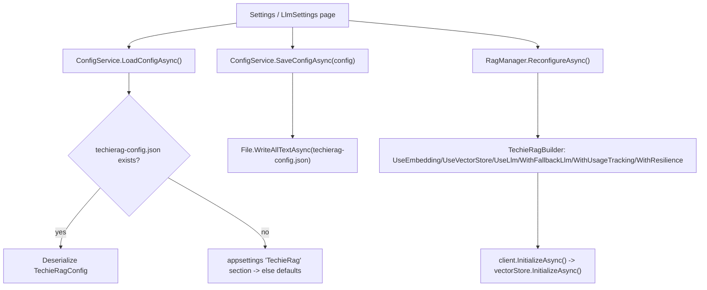
Lineage: `TechieRagConfigService.cs:54` (load) / `:148` (save) / `:190` (reset); `TechieRagManager.cs:63` (reconfigure) / `:94-253` (builder). **Gotcha:** both Reset buttons skip `ReconfigureAsync` (see Settings/LlmSettings known issues).

### Ingestion pipeline (file + text)
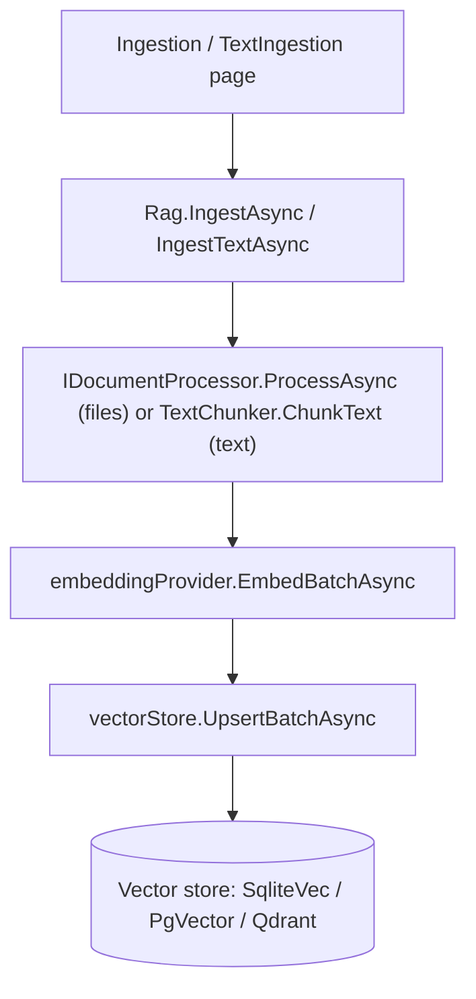
Lineage: `TechieRagClient.cs:104` (IngestAsync) / `:189` (IngestTextAsync) → `:160/:249` embed → `:172/:261` upsert.

### Query / Auto-RAG (used by Chat, Tool Demo search tool)
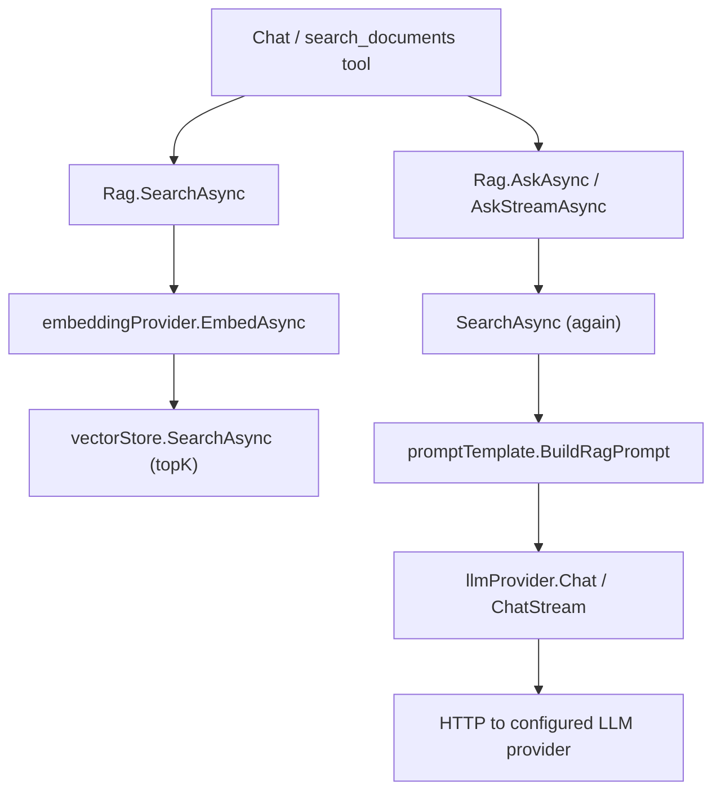
Lineage: `TechieRagClient.cs:330` (SearchAsync) / `:415` (AskAsync) / `:443` (AskStreamAsync). **Gotcha:** streamed Auto-RAG searches twice (sources + inside Ask) — see Chat known issues.

### Resilience + token tracking (automatic on LLM calls)
`RetryHandler` + `FallbackLlmHandler` decorate `ILlmProvider` (exponential backoff, HTTP-429, circuit breaker, primary→fallback). `TokenUsageTracker` subscribes to `ILlmProvider.OnCompletionCompleted` and aggregates per-model usage/cost in memory; the Token Usage page reads it via `GetTokenTracker()`. See `docs/TechieRag-Architecture.md` §Resilience.

## How to fix a bug with this guide

1. Reproduce the bug and note **which screen** and **which control** shows it.
2. Open §4, find that screen, find the control in the **Data lineage** table.
3. Walk the lineage **top-down**: Razor handler → sample service method → library API (`TechieRagClient`) → provider / JSON file. The bug is in one of those hops.
4. If the visible value is *calculated*, the lineage/business-rules name the method — check it (e.g. token totals only accumulate in non-streaming Chat branches).
5. Several known defects are already flagged inline (⚠ in Known issues) and logged to the checklists — check there first.
6. After fixing, re-run the screen's walkthrough in `docs/TechieRag-UsageGuide.md`, then re-generate this guide (`*devguide TechieRag`) if the code path changed — and run `*verify` with the app booted to upgrade the render-status from static to runtime-confirmed.

---
_Generated 2026-06-25 · refreshed 2026-06-30 (`--update`: Tool Calling Demo re-mapped) · **runtime-verified 2026-07-01 (verifier `*verify ui` — all 11 screens render+visual-confirmed as Anonymous; LLM/Qdrant data-paths not exercised — no provider/no Qdrant this run)** · **Tool Demo data-path runtime-verified 2026-07-02 as Anonymous (verifier `*verify REQ-UI-007` — live agent-loop tool call + Execution Trace confirmed; 390px overflow found AND fixed same day on /tool-demo + /ingestion, TR-003/TR-004 workarounds)** · **Runtime-verified 2026-07-02 as Anonymous (verifier `*verify all` — all 10 screens exercised live: LLM, ingest write-path, Auto-RAG streaming, token dashboard, Qdrant CRUD; one new @390 defect on /qdrant-admin)** · reflects code as built. Regenerate with `*devguide TechieRag` after code changes._
