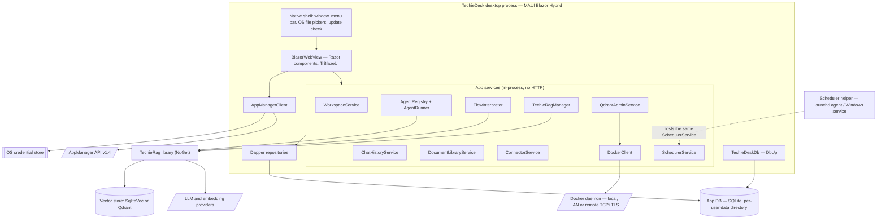
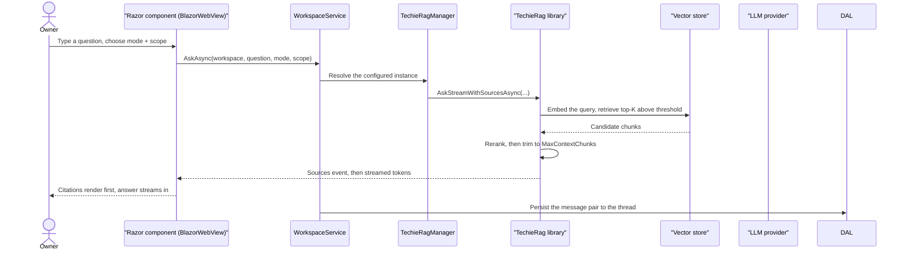
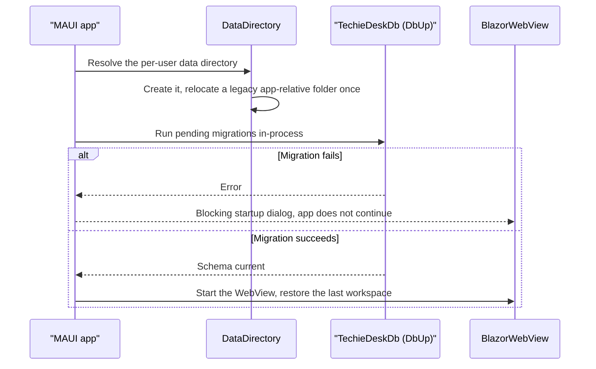
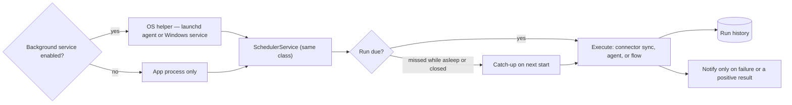
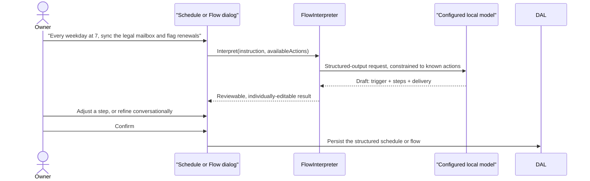

# TechieDesk — Architecture

**Last updated:** 2026-07-26
**Status:** Current + planned target — the shipped code is a Blazor Server app; the target is the MAUI Blazor Hybrid desktop app the BRD now specifies (BRD-128). Both are described below, and every section says which one it is talking about.

<!-- AGENT-ONLY AUTHORING NOTES.
  Created 2026-07-26 (owner request during the mockup review). Until now TechieDesk had no
  Architecture doc — its architecture lived in BRD §6/§8, which was tolerable for one head and
  is not now that the head is changing and new subsystems (scheduler helper, agent registry,
  flow interpreter) are being added.
  MERMAID MANDATE: quote every node/edge/subgraph label; never use `end` as a node id.
  This doc is the CODE-SHAPE authority. Requirements live in docs/TechieDesk-BRD.md and are
  referenced by BRD-N; per-REQ status lives in docs/TechieDesk-Checklist.md. Do not restate
  requirements here — say how the code is arranged to meet them.
-->

## Table of Contents

1. [Tech stack](#tech-stack)
2. [Component map](#component-map)
3. [Data flow — primary path](#data-flow-primary-path)
4. [Module responsibilities](#module-responsibilities)
5. [Runtime flows](#runtime-flows)
6. [Data architecture](#data-architecture)
7. [Cross-cutting concerns](#cross-cutting-concerns)
8. [Deployment architecture](#deployment-architecture)
9. [Verification architecture](#verification-architecture)
10. [Architectural decisions (ADR-style log)](#architectural-decisions-adr-style-log)
11. [Migration — Blazor Server to MAUI Hybrid](#migration-blazor-server-to-maui-hybrid)
12. [Open questions / risks](#open-questions-risks)

## 1. Tech stack

| Layer | Choice | Version | Notes |
|-------|--------|---------|-------|
| Runtime | .NET | 10 | Single target for app + library |
| Host (target) | .NET MAUI Blazor Hybrid | net10.0-maccatalyst · net10.0-windows | BRD-128. `BlazorWebView` hosting the existing Razor components in-process |
| Host (current) | Blazor Server + Kestrel | — | Being retired (ADR-002) |
| UI | TrBlazeUI | 1.0.7 | Known gaps TR-002…TR-013 tracked in the checklist |
| WebView | WKWebView (Mac Catalyst) · WebView2 (Windows) | platform | Fixed per platform — BRD-98 evergreen-browser support was retired with the web head |
| AI/RAG | TechieRag (NuGet) | v2 | Library-first boundary, BRD §3 |
| Embeddings | TechieRag.Embedded — BGE-M3 ONNX | — | Offline default, 1024-dim |
| App DB | SQLite via **Dapper** | — | EF Core banned (ADR-005). PostgreSQL dropped 2026-07-26 (ADR-006) |
| Vector store | SqliteVec (default) · Qdrant (optional) | — | Qdrant reachable on a configurable Docker daemon (BRD-134) |
| Migrations | DbUp via TechieDeskDb | — | Runs **in-process at launch** (ADR-007) |
| Secrets | OS credential store — Keychain / Windows Credential Manager | — | BRD-132, replaces the Data Protection key-ring file |
| Scheduling | In-process scheduler, optionally hosted by a per-user OS helper | — | BRD-139. No job server, no job DB, no third-party job framework (ADR-009) |
| Logging | Serilog → rolling file in the per-user data directory | — | BRD-100 |
| Identity | AppManager API v1.4 — licensing/billing/support only | — | Not an access gate (BRD-129) |

## 2. Component map

Target shape. Everything inside `Shell` is one OS process.

**The single most important property of this diagram is what is missing from it:** there is no HTTP boundary between the UI and the app services, no reverse proxy, no session store, and no container. A Razor component calls `WorkspaceService` as an ordinary C# method on the same thread. Most of the accidental complexity in the current Blazor Server code — circuit lifetime, session continuity, antiforgery, the `td.sid` cookie — exists only to bridge a boundary the target host does not have.

## 3. Data flow — primary path

Ask a question, get a cited answer (target host).

Two details are load-bearing. **Sources are emitted before the first token** so citations are visible while the answer streams. And **the sources event reflects what survived truncation** — that equivalence was a real defect (REQ-RAG-048) where the UI advertised citations the model never received; the trimming therefore happens in `WorkspaceManager` before the event, not inside the prompt builder.

## 4. Module responsibilities

| Module | Owns | Does not own |
|--------|------|--------------|
| `Native shell` (MAUI) | Window, minimum size, menu bar, OS file/folder pickers, reveal-in-Finder, update check, credential-store access | Anything rendered — that is all Razor |
| `WorkspaceService` | Workspace CRUD, settings, retrieval overrides, scope resolution | Retrieval itself (library) |
| `ChatHistoryService` | Thread metadata, message persistence, export | Conversation memory semantics (library `IConversationMemory`) |
| `DocumentLibraryService` | Document records, workspace links, ingest orchestration, source-file tracking | Extraction, chunking, embedding (library) |
| `ConnectorService` | Connector configuration, job queue, per-item results and failure reasons | Fetch/parse per source — library connectors |
| `AgentRegistry` | Named agents (BRD-138): handle, instructions, model, skill subset, knowledge scope, guardrails | Tool implementations — every skill is a library `ITool` |
| `AgentRunner` | Applies the two-level permission model, enforces guardrails, records the trace | The agent loop itself (library) |
| `SchedulerService` | Schedule records, next-run computation, run history, catch-up | Where it is hosted — same class in-app or in the helper |
| `FlowInterpreter` | Turns a natural-language instruction into a reviewable step list (BRD-140) and back | Executing steps — library orchestration |
| `TechieRagManager` | Builds/refreshes the configured `ITechieRag`, provider config, rerank wiring | Provider protocols (library) |
| `QdrantAdminService` + `DockerClient` | Collection CRUD, point browse, container lifecycle against a **configured** daemon endpoint (BRD-134) | Running Docker itself |
| `AppManagerClient` | AuthSvc/UserSvc/LicenseSvc/FeatureSvc/PaymentSvc/IssueSvc, RSA password encryption, token refresh | Authorization — there is none to do (BRD-23/24/25 retired) |
| `Dapper repositories` | Parameterized SQL over SQLite | Schema lifecycle (TechieDeskDb) |
| `TechieDeskDb` | Versioned, journaled DbUp scripts; runs in-process at launch | Runtime queries |
| `DataDirectory` | The **single** authority for every persistent path, plus one-time legacy relocation | — |
| `InstanceMode` *(new 2026-07-29)* | Resolves Individual vs Team/Enterprise from the AppManager licence tier (BRD-142), caches it for offline/grace operation, and exposes it for entitlement checks | Any access decision over local data — a lapsed seat degrades entitlements, never local capability (BRD-129) |
| `BackupService` *(new 2026-07-29)* | Writing and reading the `.tdbak` archive (BRD-144): scope selection, streaming pack/unpack, manifest with embedding-model identity, integrity verification, conflict resolution on restore | Where the archive is stored — the user picks any OS-reachable destination. It never touches the OS credential store, and it never turns the live data directory into a sync target (ADR-013) |

**`DataDirectory` deserves the emphasis.** REQ-FN-034 was a defect where the migrator resolved a CWD-relative path and the app a `BaseDirectory`-relative one, so DbUp migrated a 61,440-byte database while the app opened an empty one — and both logged success. The fix was not a corrected path but a **single resolution authority that nothing bypasses**, and BRD-130 moves that authority to the per-user OS location. Any future code that composes a persistent path itself reintroduces the defect class.

**`AgentRunner`'s permission model is a precedence rule, not a filter.** The workspace skill catalogue (BRD-84) is the outer boundary; a named agent (BRD-138) selects within it. An agent must not be able to enable what the catalogue forbids, and revoking a catalogue skill must take effect for every agent immediately. Implementing this as an intersection computed at run time — rather than a copy taken at save time — is what makes revocation trustworthy.

## 5. Runtime flows

### Launch and migration

Running the migrator inside the same process that later opens the database is what makes the REQ-FN-034 class **structurally** impossible rather than merely fixed: there is one resolution, so there is nothing to disagree with.

### Scheduled run, with and without the helper

The helper is a **hosting choice, not a second implementation**. It loads the same `SchedulerService` and the same data directory. This is why BRD-139 explicitly rules out a job server or job database — introducing one would hand back the operational weight the desktop pivot was meant to remove.

### Natural-language automation authoring

Interpretation is constrained to the **actions the app actually exposes**, so the model selects rather than invents. The confirm step shows the full understood result — schedule, every step, delivery — because a summary would hide exactly the misreading the confirm step exists to catch. Interpretation uses the configured local model, so automation authoring does not require a cloud provider (BRD-99).

## 6. Data architecture

Everything persistent lives in **one per-user directory** (BRD-130): `~/Library/Application Support/TechieDesk` on macOS, `%LOCALAPPDATA%\TechieDesk` on Windows.

| Artefact | File | Owner |
|---|---|---|
| App database | `techiedesk.db` | Dapper repositories; schema by TechieDeskDb |
| Vector store (default) | `techierag.db` | TechieRag library — SqliteVec |
| RAG document/chunk store | `techiedesk-rag-store.db` | TechieRag library |
| Saved provider configuration | `techierag-config.json` | `TechieRagConfigService`, secrets encrypted |
| Uploads | `uploads/` | `DocumentLibraryService` |
| Embedding model | `models/bge-m3` | TechieRag.Embedded |
| Logs | `logs/` | Serilog |

**Source files are tracked but not owned.** A document's original may be moved or deleted by the user after ingestion; the extracted text, chunks and embeddings live in TechieDesk's own store, so retrieval and citation are unaffected. The UI must therefore treat a missing source as a *preview* limitation, never a document error (BRD-137's document-view path).

## 7. Cross-cutting concerns

- **Configuration** — `IConfiguration` binding is retained, but the container-only env-var surface goes with F-DEPLOY. Settings the user edits live in the saved configuration file; secrets never do.
- **Secrets** — AppManager tokens, provider API keys, connector credentials (IMAP, Git, Confluence) and Docker client certificates all go to the **OS credential store** (BRD-132). The file-backed Data Protection key ring was a container-era compromise and is superseded on desktop.
- **Logging** — Serilog to rolling files in the data directory. Every ingestion, agent run and scheduled run writes a structured record; the event log UI renders a summary of exactly those records, with the raw JSON one click away.
- **Errors** — a backend outage must name itself. A vector-store failure once rendered as "this workspace does not exist", sending the user to the wrong problem (REQ-NFR-010); distinguishing *unavailable* from *not found* is a standing architectural requirement, not a one-off fix.
- **Validation** — provider configuration is validated at save time, not at first use (BRD-136). Accepting an unusable configuration and failing later on unrelated screens is the defect class this exists to prevent.

## 8. Deployment architecture

There is no server. Distribution is a signed desktop package per platform (BRD-131): notarized `.app`/DMG for macOS, MSIX or signed installer for Windows. Updates replace the application bundle and never touch the data directory.

**Release pipeline (added 2026-07-27).** Packages are produced by CI, not by hand on a developer machine — the same principle already applied to the library, where `.github/workflows/publish-nuget.yml` builds, tests, packs and pushes `TechieRag` / `TechieRag.Embedded`. The desktop head needs its own workflow because it cannot use that one: MAUI heads must be built on their *native* OS (a macOS runner for the Catalyst `.app`/DMG, a Windows runner for the MSIX), whereas the NuGet job runs on `ubuntu-latest`. This is also the only way the Windows head ever gets compiled, since it cannot be built from macOS (REQ-FN-035 PARTIAL).

Signing is a **secret-gated step, not a precondition**: the workflow builds and uploads unsigned artefacts when no identity is configured and signs + notarizes when one is, mirroring how the NuGet workflow gates its NuGet.org push on `NUGET_API_KEY != ''`. This matters architecturally — it means the pipeline is code-doable *before* the owner supplies an Apple Developer ID, and that identity turns on a step rather than unblocking the work. Tracked as REQ-FN-038.

The only optional installed component is the scheduler helper (BRD-139), installed and removed from the app UI.

Docker remains in the picture for exactly one purpose: **administering a Qdrant container** on a configurable daemon (BRD-134). TechieDesk itself is never containerized.

## 9. Verification architecture

This section exists because the pivot invalidated the project's entire runtime-verification approach, and that is an architectural fact rather than a testing detail.

| Gate | Current head | Target head |
|---|---|---|
| Unit / integration | xUnit | unchanged |
| Runtime UI driving | Playwright over `localhost` | **Appium `mac2`** (Mac Catalyst) and **FlaUI / Appium-Windows** — no URL exists to navigate to |
| Data-render + visual-truth | Playwright screenshots + DOM | same gates, fed from the Appium/FlaUI screenshot + element tree |

⚠ Until those endpoints exist (REQ-NFR-011), the verifier degrades UI requirements to `⚠ STATIC-ONLY`, which must never be recorded as a runtime pass. The 21 currently-`Verified` rows were proven against the Blazor head; the UI ones among them are re-verification debt.

## 10. Architectural decisions (ADR-style log)

- **ADR-001 — Library-first boundary.** Anything reusable outside the app is implemented in TechieRag and only surfaced by TechieDesk. *Reason:* one codebase serves both the product and every .NET consumer; it also stops app-shaped shortcuts becoming the product's retrieval behaviour.
- **ADR-002 — Desktop-only, MAUI Blazor Hybrid (2026-07-26).** The Blazor Server head and the Docker distribution are retired. *Reason:* owner decision; the product was already a single-user operator console, and the hosted framing was carrying multi-tenant machinery nothing used. *Supersedes* the implicit "Blazor Server" decision in BRD §8.
- **ADR-003 — AppManager for identity, never for access control (2026-07-26).** Sign-in activates a licence; it does not gate local data. *Reason:* BRD-129. *Consequence:* the role/capability/authz stack is retired (BRD-23/24/25).
- **ADR-004 — Secrets in the OS credential store (2026-07-26).** *Reason:* machine- and user-bound storage strictly improves on a file-backed key ring, and the Hybrid host has no cookie to protect. *Supersedes* the REQ-FN-032 signed-cookie session design, which solved a circuit problem that no longer exists.
- **ADR-005 — Dapper only; EF Core banned.** *Reason:* owner decision; explicit SQL over a single small SQLite schema.
- **ADR-006 — SQLite only; PostgreSQL + pgvector dropped (2026-07-26).** *Reason:* a single-user desktop install has no use for a server database, and dropping it removes a dual-dialect script burden that never shared an idiom.
- **ADR-007 — Migrations run in-process at launch (2026-07-26).** *Reason:* makes the REQ-FN-034 divergent-path defect class structurally impossible. *Trade-off:* a migration failure must surface as a blocking startup dialog rather than a process exit code.
- **ADR-008 — Docker daemon endpoint is configuration, not an assumption (2026-07-26).** *Reason:* owner decision (BRD-134); the daemon may be local, on the LAN, or remote. *Consequence:* a daemon endpoint is effectively root on its host, so TLS verification is on by default and credentials live in the credential store.
- **ADR-009 — Background scheduling by an OS helper hosting the same in-process scheduler (2026-07-26).** *Reason:* BRD-139 — schedules must be able to run with the window closed, but adding a job server or job database would return the operational weight ADR-002 removed. *Rejected alternatives:* a bundled job framework with its own storage; a always-running tray application that is really the whole app.
- **ADR-010 — Automations are authored in natural language; the structured form is the reviewable output (2026-07-26).** *Reason:* BRD-140 — a product that ships an LLM should not require its user to learn cron or a node-graph palette. *Constraint:* interpretation runs on the configured local model, and nothing saves without an explicit confirm showing the full understood result.
- **ADR-011 — Named agents with two-level permissions (2026-07-26).** *Reason:* BRD-138. The workspace skill catalogue is the outer boundary; agents select within it, and the intersection is computed at run time so revocation is immediate.
- **ADR-012 — Teams are N single-user installs joined by seats and portable files, NOT a shared instance (2026-07-29).** *Reason:* BRD-142/143. The owner needs to sell to teams and enterprises, but a shared instance would require reinstating roles, a capability matrix, per-workspace assignment and ultimately a server head — reversing ADR-002 and the 2026-07-26 desktop-only pivot. Instead an organisation buys **AppManager seats**, and each seat is one person on one ordinary single-user install. *Consequence:* nothing multi-tenant returns; `ProductRoleMapper` / `CapabilityService` / `IWorkspaceAssignmentRepository` (deleted by REQ-FN-041) are **not** reinstated and the `WorkspaceAssignment` table stays dropped. *Supersedes* the 2026-07-26 statement that sign-in exists "never to partition a shared instance" only in scope, not in mechanism — there is still no shared instance to partition. *Rejected alternatives:* multi-profile on one install (no competitor does it; serves only teams who literally share a machine); a sync engine (needs conflict resolution and a storage backend that does not exist); un-retiring the Blazor Server head (this is the benchmark's answer, and it discards the entire desktop-only architecture). *Benchmark note (re-scanned 2026-07-29):* AnythingLLM Desktop remains *"a 'single-player' application"* and its team story is Docker/Cloud with 3 fixed roles; its founder has declined even to let the desktop client connect to a self-hosted instance, citing permissioning.
- **ADR-013 — Data moves between installs as an inert archive FILE; the live data directory is never cloud-synced (2026-07-29).** *Reason:* BRD-144/145. Handing a workspace to a colleague via OneDrive/Drive/Dropbox is the team workflow, but the obvious implementation — pointing the BRD-130 data directory at a synced folder — **corrupts data**: it holds a live SQLite database and a live embedded vector store, and consumer sync clients perform partial-write sync with no locking semantics and produce conflict copies. Export/import of a self-contained archive is therefore the only supported exchange, and live-directory sync is explicitly prohibited. *Consequences, each taken from a known failure:* archives **stream** to and from disk and support **per-workspace** granularity, because the benchmark removed its own export partly because large instances "crash during zipping"; restore **refuses an archive whose embedding-model identity differs**, because same-dimension vectors from a different model corrupt retrieval silently instead of failing; restore presents an explicit **skip / duplicate / replace** choice and never silently merges, because the benchmark's restore was an all-or-nothing instance rollback; unpacking **never writes outside the data directory** (zip-slip); and archives **carry no credentials** — tokens, provider keys and connector secrets stay in the OS credential store (ADR-004), since an archive is expected to land in a third-party sync folder. *Note:* AnythingLLM's own export was removed as the remediation for CVE-2024-22422, an unauthenticated DoS in an HTTP export endpoint — that class does not apply here (no HTTP surface), but its scale and merge-less-restore lessons do.

## 11. Migration — Blazor Server to MAUI Hybrid

Sequence matters; several of these steps are unsafe out of order.

1. **REQ-FN-035** — stand up the MAUI Hybrid host over the existing Razor components. DI lifetimes move from scoped-per-circuit to scoped-per-app; anything touching `HttpContext` must go.
2. **REQ-FN-037** — move `DataDirectory` to the per-user OS location and run DbUp in-process.
3. **REQ-FN-036** — remove the login gate; the app opens into a workspace.
4. **REQ-FN-039** — move tokens and provider secrets to the OS credential store.
5. **REQ-NFR-011** — stand up Appium `mac2` / FlaUI **before** the first `*verify` of the new head, or every UI row degrades to `⚠ STATIC-ONLY`.
6. **REQ-FN-041** — only now delete the retired code: role/capability/authz, Dockerfile + compose, the `td.sid` session machinery, the Postgres script set.
7. **REQ-FN-038** — signing and packaging, which needs owner-supplied identities.

Deleting the session machinery before step 4 would break a working application with nothing to replace it. That is the one ordering constraint that is not merely preference.

## 12. Open questions / risks

| Question / risk | Impact | Current position |
|---|---|---|
| No runtime UI verification exists for a MAUI head | High — every UI row degrades to `⚠ STATIC-ONLY` | REQ-NFR-011, scheduled before the first verify of the new head |
| Dual-platform cost: signing, notarization, WKWebView vs WebView2, platform credential and speech APIs | High | Keep all UI in shared Razor; confine platform code to thin abstractions; build and sign both from day one |
| The scheduler helper is a user-visible OS install (macOS prompts; Windows may need elevation) | Medium | The toggle must state what it installs and where, and uninstall must genuinely remove it |
| Natural-language interpretation will sometimes misread an instruction | Medium | The confirm step shows the full understood result, not a summary; every element stays editable |
| Retiring shipped, verified work (F-ROLES, F-DEPLOY, the session stack) can rot half-removed | Medium | Tracked as REQ-FN-041; delete rather than comment out; retired BRD IDs stay struck through so the decision stays legible |
| TrBlazeUI accessibility defects (TR-008) are not app-fixable | Medium | NFR-005 cannot reach `Verified` without an upstream release |
| Qdrant remains reachable only where a Docker daemon is | Low | BRD-134 makes the endpoint configurable; SqliteVec remains the zero-dependency default |

---
Last updated: 2026-07-26
Created 2026-07-26 — TechieDesk had no Architecture doc before this; its architecture lived in BRD §6/§8.
