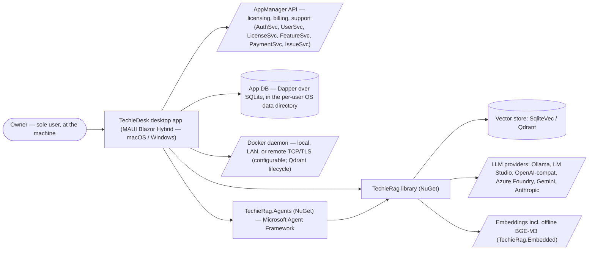
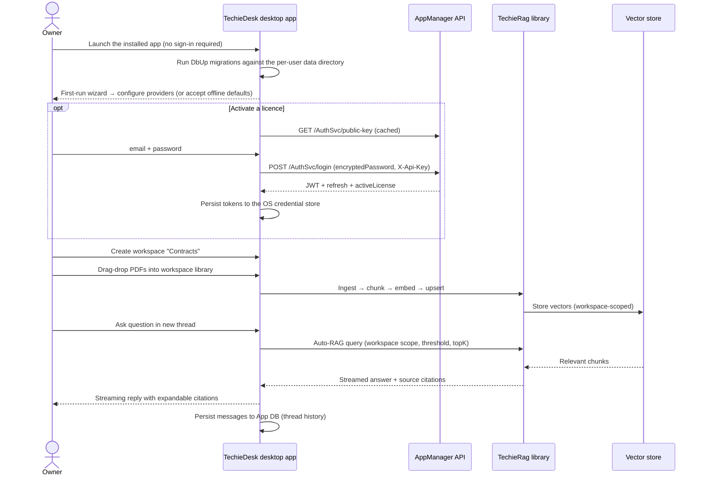
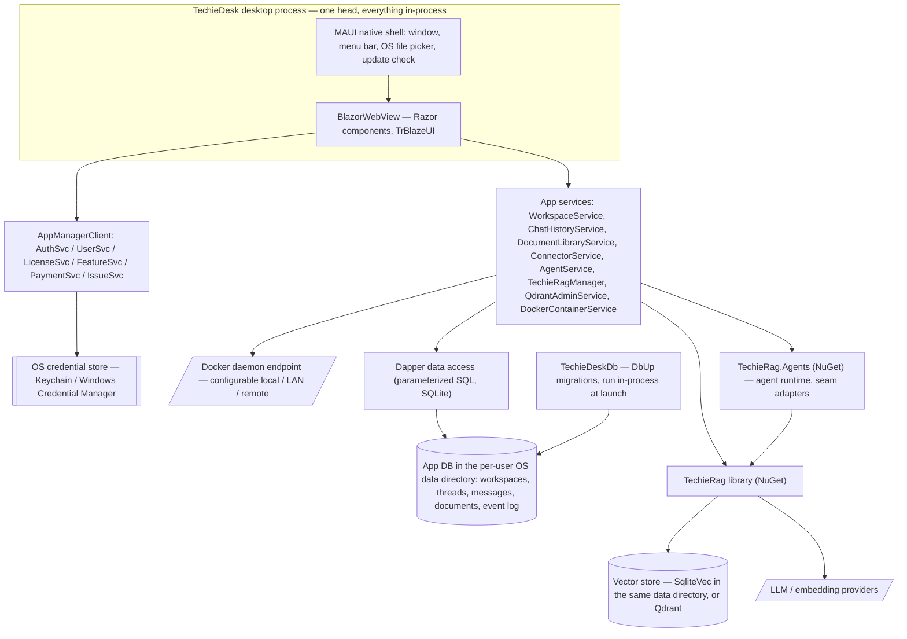
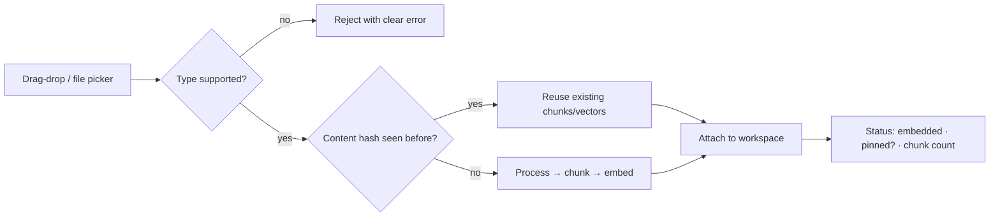
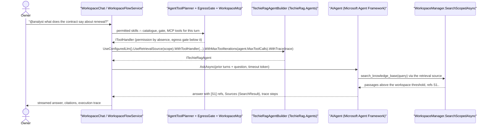

# TechieDesk — Business Requirements

<!-- AGENT-ONLY AUTHORING NOTES.
  STABLE IDS: every requirement has a BRD-{N} ID. IDs are append-only across revisions.
  This BRD has its OWN ID space (BRD-1…) separate from docs/TechieRag-BRD.md (library BRD).
  TechieDesk's origin entries in the library BRD (BRD-81 repositioning, BRD-82 rename) remain
  there as historical record; this document is the product BRD going forward.
  Gap traceability: requirements derived from docs/TechieRag-CompetitorAnalysis.md carry their
  GAP-APP-* / GAP-LIB-* source ID for register traceability. Library-side dependencies
  (GAP-LIB-*) are NOT given BRD-Ns here — they are tracked in the library BRD/checklist; app
  requirements that depend on them name the dependency inline.
  MERMAID MANDATE: quote every node/edge/subgraph label; never use `end` as a node id.
-->

## Table of Contents

1. [Executive summary](#executive-summary)
2. [Business objectives](#business-objectives)
3. [Scope](#scope)
4. [Development status](#development-status)
5. [Stakeholders / users](#stakeholders-users)
6. [Context diagram](#context-diagram)
7. [User journey — primary use case](#user-journey-primary-use-case)
8. [Component sketch](#component-sketch)
9. [Feature catalog](#feature-catalog)
10. [Functional requirements (BRD ledger)](#functional-requirements-brd-ledger)
11. [Non-functional requirements](#non-functional-requirements)
12. [Constraints & assumptions](#constraints-assumptions)
13. [Success metrics](#success-metrics)
14. [Risks](#risks)
15. [Glossary](#glossary)

## 1. Executive summary

**TechieDesk** is a **desktop RAG chat application** for macOS and Windows, built on .NET 10 / **MAUI Blazor Hybrid** with the TrBlazeUI component kit, powered by the **TechieRag** library (the reusable RAG core published on NuGet). Its mandate — confirmed by the product owner and recorded in `docs/TechieRag-CompetitorAnalysis.md` — is to become a **full productized AnythingLLM alternative**: workspace-based chat over private documents with any LLM/embedder/vector store, plus agents — re-imagined for the .NET ecosystem, where every product capability is also reusable by any .NET app via the underlying library.

As of 2026-07-17 the application has been separated from its sample-app origins: renamed from `TechieRagWeb` to **TechieDesk**, moved to `apps/TechieDesk`, fully re-branded and regression-verified (REQ-UI-014 / library BRD-82). What exists today is a strong **single-user operator console** — chat with Auto-RAG and citations, document/folder/text ingestion, an LLM playground, runtime provider settings, a unique Qdrant admin console with Docker lifecycle management, and a token/cost dashboard. What is missing is the **product layer**: workspaces and threads, persistent chat history, a document library UI, data connectors, agent UX, white-labeling, i18n, and desktop packaging.

**Form factor (amended 2026-07-26 — owner decision).** TechieDesk ships as a **desktop application only**. The Blazor Server head and the Docker distribution are retired: there is no web server, no browser, no container, and no hosted multi-tenant deployment. The product installs like any desktop app, keeps all data in a per-user OS location, and runs entirely on the user's machine. This narrows the product deliberately — the developer REST API, the embeddable widget, multi-user roles, and the multi-tenant admin console are retired with it (BRD-23/24/25, BRD-55/56/57, BRD-66…71, BRD-72, BRD-74) — and it aligns the BRD with what the codebase already is: a single-user operator console. **Amended 2026-07-29 (owner decision) — see BRD-142…145: the phrase "never to partition a shared instance" below still holds *literally*, but the product now serves teams. It does so WITHOUT a shared instance: every install stays strictly single-user, and teams are served by seat-based licensing plus portable backup/restore archives (BRD-144). Nothing multi-tenant returns — no server, no roles, no shared runtime.** AppManager remains the identity/licensing/billing/support backbone, but sign-in now exists only to activate a licence, never to partition a shared instance.

Five strategic decisions shape this BRD:

1. **User management is NOT built in-app.** TechieDesk integrates with the owner's **AppManager** platform (`docs/AppManager-api-usage-guide.md`, API v1.4) as a child application. Authentication, registration, password lifecycle, profiles, roles, **licensing/feature gating, payments/subscriptions, and support tickets** all come from AppManager's AuthSvc / UserSvc / LicenseSvc / FeatureSvc / PaymentSvc / IssueSvc. This replaces the competitor analysis' GAP-APP-01 (ASP.NET Core Identity) approach and — as a bonus AnythingLLM cannot match in its open-source tier — gives TechieDesk a **monetizable license/tier model and in-app support desk from day one**.
2. **Everything else follows the competitor benchmark.** Feature depth for workspaces, document library, connectors, developer API, widget, agents, branding, and i18n is taken from AnythingLLM (application benchmark); library-side capabilities they depend on are the GAP-LIB-* items — now ledgered **in this BRD** (F-LIB) so one checklist drives both codebases.
3. **One checklist governs the combined effort.** All open TechieRag library gaps (GAP-LIB-01…23 — verified unimplemented as of 2026-07-17), the open library feedback items (TR-RAG-001, TR-RAG-002; TrBlazeUI TR-002/003/004), and any **future** feedback are developed and tracked in the **TechieDesk Checklist** (`docs/TechieDesk-Checklist.md`, produced by `*split-brd TechieDesk`). The TechieRag BRD/checklist remain as historical record of the shipped v1.1/v2 scope; no new work is scheduled there. **Reversed 2026-09-03 (owner decision, BRD-146):** TechieDesk moves to its own repository and consumes the TechieRag packages from NuGet, so library work is ledgered in the **TechieRag** BRD and checklist again. Open F-LIB rows migrate there with their status and remarks; this BRD keeps app requirements and names library dependencies as package versions. The GAP-LIB register and the delivered F-LIB items stay here as historical record.
4. **Data access is Dapper, not EF Core.** All TechieDesk data access uses Dapper with parameterized SQL over **SQLite**, and schema migrations owned by a dedicated **TechieDeskDb** migration component built on **DbUp**. All logging is **Serilog** (the standing TechieFlow NFR, BRD-100). *(Amended 2026-07-26: the PostgreSQL + pgvector option is dropped — a single-user desktop install has no use for a server database, and SQLite + sqlite-vec covers the whole product.)*
5. **Desktop-only, single-user.** *(Amended 2026-07-26.)* The only head is the MAUI Blazor Hybrid desktop app (BRD-128). Everything that presupposed a shared, hosted instance is retired rather than reinterpreted, so the BRD does not carry requirements the product can no longer meet.

## 2. Business objectives

- **O1 — Product, not demo:** a stranger can download and install TechieDesk, create a workspace, drag in PDFs, and get streamed, cited answers within minutes of first launch — the competitor analysis Phase-2 exit criterion — inside the MVP timeline (~12–16 weeks per `TechieRag-CompetitorAnalysis.md` §6). *(Amended 2026-07-26: install path was `docker compose up`.)*
- **O2 — .NET-native differentiation:** remain the only offering that is simultaneously a private desktop RAG product **and** an embeddable .NET library; protect the §4.3 differentiators (offline BGE-M3, Qdrant admin console, token/cost governance, LLM playground).
- **O3 — Monetization-ready:** every install can run free/offline, but license tiers, feature gating, subscriptions, and payments are wired through AppManager so paid tiers can be switched on without re-architecture.
- **O4 — Zero-config first run:** out-of-the-box operation with no external services (Embedded BGE-M3 + SqliteVec + optional local Ollama), matching AnythingLLM's "works immediately" bar.
- **O5 — Operational trust:** all user documents, chats, and vectors remain on the user's own machine; only LLM-provider and AppManager calls leave the box; no product telemetry.

## 3. Scope

**In scope (this BRD):**

- The TechieDesk **desktop application** (`apps/TechieDesk`, MAUI Blazor Hybrid — macOS via Mac Catalyst and Windows): product shell, AppManager integration (sign-in for licensing/billing/support), workspaces & threads, persistent chat history, document library, streaming citations UX, retrieval tuning, data connectors UI, an operator console (Qdrant admin against any configured Docker daemon, token/cost governance, instance defaults, event log), agent UX, TTS/STT, white-labeling, i18n, signed desktop packaging and updates, onboarding wizard, and security hygiene.
- App-observable outcomes that require library work (e.g. native streaming citations, reranking toggle, XLSX/PPTX ingestion, connectors, MCP) — the app requirement is stated here, **and** the library work itself is ledgered here too (F-LIB, BRD-105…127) so it is planned, built, and verified through the TechieDesk Checklist. *(Until 2026-09-03. From then on the app requirement is stated here and names the library package version it needs; the library work is ledgered in the TechieRag BRD — see BRD-146.)*
- **The open TechieRag library gap register (GAP-LIB-01…23)** — all 23 verified unimplemented as of 2026-07-17 — plus the open library feedback items (TR-RAG-001/002, TrBlazeUI TR-002/003/004). Future library feedback also lands as rows in the TechieDesk Checklist (single-checklist governance). *(Reversed 2026-09-03: open library rows migrate to the TechieRag checklist; future library feedback is filed there.)*
- **TechieDesk as a separate repository** *(added 2026-09-03, BRD-146)*: the app, its tests, its UI verification harness, its docs and its desktop publish workflow live in their own repository; `TechieRag`, `TechieRag.Embedded` and `TechieRag.Agents` are consumed as NuGet packages at pinned versions.
- **Agent runtime on `TechieRag.Agents`** *(added 2026-09-03, BRD-147)*: every agent capability the product exposes runs on the library's Microsoft Agent Framework package, so TechieDesk is the live implementation of all three packages.
- **TechieDesk data platform:** Dapper-based data access and the TechieDeskDb migration console (DbUp) — see F-DATA.

**Library-first boundary (standing rule):** any capability that is reusable outside this app is implemented in the **TechieRag library** (as a GAP-LIB-* item) and only *surfaced* by TechieDesk. Concretely: the agent loop, agent skills/tools, MCP client, agent orchestration engine, data connectors and web crawlers, document processors, chunking, reranking, retrieval tuning primitives, workspace/collection primitives, persistent conversation memory, content-hash document dedupe, and TTS/STT abstractions are all **library** components. TechieDesk itself owns only what is inherently app-shaped: the Blazor Hybrid UX and native shell, AppManager integration, app metadata storage (workspace and thread metadata, event log, branding), and desktop packaging/distribution. Any new requirement that violates this boundary must be re-scoped into the library before implementation. *(Amended 2026-07-26: REST API and widget hosting removed from the app-owned list — those features are retired.)*

**Out of scope (explicit):**

- **In-app user/identity store** — no ASP.NET Core Identity, no local password handling beyond RSA-encrypting for transit to AppManager (owner decision, supersedes GAP-APP-01's Identity approach).
- **Payment processing UI beyond AppManager's API surface** — checkout/purchase happens on AppManager's side; TechieDesk shows pricing, subscriptions, invoices, and promo validation only.
- **Entity Framework Core** — banned in the TechieDesk codebase (owner decision); all data access is Dapper (see F-DATA).
- The TechieRag library's **already-shipped** v1.1/v2 scope — its historical record stays in `docs/TechieRag-BRD.md`; only the *open* gaps (F-LIB) are governed here.
- **Any web-served or hosted head** *(amended 2026-07-26 — this line previously excluded desktop instead)*: no Blazor Server head, no browser access, no Docker/container distribution of TechieDesk itself, no multi-tenant hosting. Browser extension and mobile (iOS/Android) heads remain deferred until demand (GAP-APP-19); **desktop is now the product**, not a deferred head.
- **Developer REST API, API keys, Swagger, and the embeddable chat widget** — retired 2026-07-26 (BRD-66…71): a desktop-only product has no hosted origin to serve them from.
- **Multi-user roles and shared-instance administration** — retired 2026-07-26 (BRD-23/24/25, BRD-72, BRD-74): one install serves one person.
- **PostgreSQL + pgvector** — dropped 2026-07-26; SQLite (with sqlite-vec) is the only app database.
- No-code agent flow builder and scheduled tasks are **in catalog but last phase** (Phase 5); realtime voice calls, fine-tuning UIs, image/video generation — not planned.

## 4. Development status

**Snapshot as of 2026-08-02** (refreshed by a six-cluster `*build-phase` on the service-layer English backlog — 569 → 330 literals, ratchet lowered to match; **2,180 tests pass**, 23/23 screens sweep clean in Hindi. Earlier the same day: a pass closing the two defects the previous live smoke found — the `View` menu now reaches the macOS menu bar, and the service layer no longer hands English to the screen; **2,073 tests pass**. Earlier, on 2026-08-01: TWO `*build-phase` runs — the BRD-123 → BRD-92 chain, then a four-cluster pass completing markup localization; **2,055 tests pass**, 23/23 screens sweep clean in English and Hindi. Earlier that day: a pass covering the BRD-123 → BRD-92 chain plus localization tranche 3, with `*verify all` chained inline; **2,019 tests pass**, 22/22 screens sweep clean in English and Hindi). Previously: two `*build-phase` runs on 2026-07-31 (refreshed by TWO `*build-phase` runs that day — 4 then 3 parallel clusters, scope confirmed by the owner each time, with `*verify all` chained inline after both). Build 0 errors, **1,914 tests pass**; the 21-screen Catalyst sweep ran clean at both widths with 0 render defects and 0 true visual defects. **BRD-125 was RE-SCOPED on owner decision** (see its entry) and **BRD-86 (MCP server registration) is now built and proven across a cold restart**. **BRD-117 (OpenTelemetry exporters) reached `Verified`** — shipped as the opt-in `TechieRag.Telemetry` package, local-only and default-off per the owner's decision, with REQ-NFR-008's zero-egress guarantee net *strengthened*. Live, per-requirement status: see `PROJECT-STATUS.md` and the **Requirements Status** table in `docs/TechieDesk-Checklist.md`.

> **Amended 2026-07-26 — desktop-only pivot.** Percentages below are unchanged where the feature is unaffected. Four features are **Retired** (F-DEPLOY, F-API, F-WIDGET, F-ROLES) and two are reduced (F-ADMIN, F-AUTH); one is added (F-DESKTOP). Retired rows stay in the table for traceability — they are never deleted.

| Feature (F-code) | Phase | Status | % | Notes |
|------------------|-------|--------|---|-------|
| F-SHELL: App shell, branding & navigation | 0 | Done | 100 | TechieDesk rename/rebrand verified 2026-07-17; runtime render-confirmed 2026-07-18 (9 console routes clean @1280/390) |
| F-CHAT: Chat (Direct-LLM + Auto-RAG, streaming) | 0 | Partial | 75 | ✅ **2026-07-31 — the composer geometry defect at the 1024×720 floor is FIXED (BRD-137, REQ-UI-044).** The transcript was sized `max-height:56vh`, a viewport percentage that scales *with* the chrome it must leave room for, so at the enforced floor the chat column ran 149px past the window bottom and pushed Attach/Prompts off-screen. Replaced with a measured budget, plus scroll-to-newest (which the page never had). Re-measured live: 0 overlaps at both widths. ⚠ Residual: two static hint rows still overflow by 8–34px. Prior note follows. — **2026-07-26:** +BRD-137 multi-line composer with per-turn mode/model/scope (owner review) · RAG-024/029 (streaming sources + usage) Verified 2026-07-18; live LLM stream pending provider UAT |
| F-INGEST: Folder/text ingestion (console-style) | 0 | Done | 100 | Folder/pattern + paste-text; superseded by F-DOCLIB for product UX |
| F-PLAYGROUND: LLM playground | 0 | Done | 100 | Differentiator |
| F-QADMIN: Qdrant admin + Docker lifecycle | 0 | Partial | 85 | Differentiator; **retained** in the desktop pivot. BRD-134 adds a configurable daemon endpoint (local/LAN/remote) — today it assumes a local daemon |
| F-SETTINGS: Provider settings + connection test | 0 | Partial | 95 | ✅ **2026-07-31 — the P1 save defect is FIXED and proven live (BRD-9, REQ-FN-052).** "Save & apply" never reached the file the RAG instance is built from. Two stacked causes: `TechieRagConfigService` handed its cached config out **by reference**, so a settings form binding mutated it before any save and every later read reported success; and the save was then being *refused* because the endpoint was placeholder text only. On the running app, selecting Ollama now writes `source 1` to `techierag-config.json` and `Test connection` resolves the provider for real. Prior note follows. — **2026-07-26:** BRD-136 added on owner review — the form must show only the selected provider's fields and reject an incomplete provider at save time (closes the REQ-NFR-010 crash) |
| F-TOKENS: Token/cost dashboard + budgets | 0 | Done | 100 | Differentiator |
| F-TOOLS: Agent/tool demo | 0 | Done | 100 | Dev-oriented; superseded by F-AGENT for product UX |
| F-AUTH: AppManager sign-in for licensing | 1 | In progress | 60 | **Reduced 2026-07-26** — sign-in now exists only to activate a licence, not to gate access. FN-001/004 Verified 2026-07-18 (RSA/wire); UI-006…013 render+visual confirmed. The cookie/circuit session machinery (FN-032) is superseded by BRD-132 OS credential storage |
| ~~F-ROLES: Roles & access control~~ | 1 | **Retired 2026-07-26** | — | Desktop-only, single-user: BRD-23/24/25 retired. BRD-26 (AppManager error states) moved to F-AUTH. Shipped code (`ProductRoleMapper`, `CapabilityService`, `IAuthGuard`) becomes removable |
| F-WS: Workspaces & threads | 1 | In progress | 85 | UI-014/016 driven live + FN-009 + RAG-007/028 Verified 2026-07-18. **Corrected 2026-07-28:** the note previously cited **FN-008** as evidence, but that REQ was **retired to `N/A` on 2026-07-26** (user↔workspace assignment is meaningless single-user) — dropped from the citation. UI-017 is no longer "resume pending", it is `Implemented`; UI-015 is `Needs re-verify` |
| F-HIST: Persistent chat history | 1 | In progress | 85 | ✅ **2026-07-30 — thread export writes a real file again (REQ-FN-010).** It had been a silent false success: the WKWebView blob-anchor download had no `WKDownloadDelegate`, so nothing was written while a success toast fired anyway. Replaced with a native save path that **stats the written file** before reporting success, and says nothing on cancel. Proven on a real 10-message thread (982 B Markdown, 1,943 B JSON). Prior note follows. — RAG-008/009/027 Verified 2026-07-18 (thread persisted live); resume-after-restart = pending |
| F-CITE: Native streaming citations | 1 | In progress | 60 | RAG-024 Verified; RAG-010 + UI-018 need live LLM (provider UAT) |
| F-DOCLIB: Document library | 1 | In progress | 75 | ✅ **2026-07-30 — the `Size` column renders real sizes (REQ-UI-021).** Three stacked defects: nothing wrote the metadata; `SqliteVecStore` (the desktop default) hardcoded every document row's `Metadata` to `{}`; and `JsonElement` is not `IConvertible`, so a correct value would still have rendered an em-dash. Proven on the real database via the embedded BGE-M3 provider. Documents ingested earlier correctly keep `—` — a backfill would be fabricated. Prior note follows. — RAG-012 Verified; UI-019/020/021 + FN-012 render+visual confirmed; RAG-011/013 PARTIAL; live ingest = UAT |
| F-RETRIEVE: Retrieval tuning | 1 | In progress | 90 | RAG-014/015/025 Verified 2026-07-18 (threshold/topK/rerank, chat-vs-query) |
| F-LIC: Licensing & feature gating (core) | 1 | In progress | 75 | **Corrected 2026-07-28** (was `Planned 0`) — FN-013/014/015 are all `Implemented`: licence validation + status UI, feature gating with upgrade prompts, AppManager-outage grace. Unverified: no live AppManager account has ever been exercised |
| F-ONBOARD: First-run onboarding wizard | 1 | In progress | 75 | ✅ **2026-07-30 — the wizard is REACHABLE again (BRD-52/53, REQ-FN-050).** It had been unreachable on every real install: the guard returned early on `workspaces.Count > 0` before consulting the setup flag, and BRD-31 bootstraps a default workspace on first boot, so the owner was never offered the LLM/Ollama/offline choice. Guard is now flag-first (`FirstRunGate` in Core, testable — a razor file is not). Once completed OR explicitly skipped it never reappears; offline-only is a legitimate completed outcome. **Visually proven** against an isolated data-dir copy. Prior note follows. — ⚠ visual: UI-022 /setup stepper overflows @390 (Needs re-verify); UI-023/FN-016 render OK |
| ~~F-DEPLOY: Docker distribution~~ | 1 | **Retired 2026-07-26** | — | Superseded by F-DESKTOP (BRD-131). Dockerfile/compose and the container-only config surface are removed from scope |
| F-DESKTOP: MAUI desktop head, packaging & local data | 1 | Partial | 75 | ✅ **2026-07-30 — the signed-bundle database defect is FIXED (REQ-FN-048).** The default vector-store connection string resolved against the CWD, and **UIKit resets the Catalyst CWD to the `.app` bundle root**, so every launch wrote a live database inside the signed bundle and broke `codesign`. Now anchored to the data directory at all four config seams; `codesign --verify --deep --strict` reproduced failing then passing, and a real launch leaves the bundle root clean. REQ-FN-034's invariant is finally true (the CLI logged to the repo root). Held at Partial for the unchanged reasons: **FN-035 the Windows head is unbuilt** and **FN-038 packaging is unsigned**. Prior note follows. — **Re-corrected 2026-07-28 (same day, after the fix).** The `FAIL` recorded by `*verify all` is cleared: the Release Catalyst head **launches and sweeps 18/18 screens clean**, and the BRD-133 1024 x 720 window floor is now **runtime-proven exactly** (was 515 x 319). Neither cause was what it looked like — the crash was a contaminated output directory (stale AOT images from an earlier `publish` over freshly built assemblies), not trimming; and the floor needed one constant in `App.CreateWindow`, not the `MainPage` scene-restriction code, which was dead and is deleted. The 'empty wwwroot' finding is **withdrawn** — those are per-RID intermediates; the universal bundle is complete. FN-036/037/039/040 + UI-041/042 `Implemented`. Held at Partial for the unchanged reasons: **FN-035 the Windows head is unbuilt** (MAUI cannot build it from macOS) and **FN-038 packaging is unsigned**, so the credential store falls back to machine-bound files |
| F-SEC: Security hygiene | 1 | In progress | 55 | ✅ **2026-07-30 — NFR-004/004a CLOSED.** A stable `HtmlSanitizer 9.1.973` now exists (AngleSharp 1.6.0 + AngleSharp.Css 1.0.0, both stable), so the pre-release pin is retired and **the product ships zero pre-release packages**. `dotnet list --vulnerable` clean across all nine projects. Runtime-smoked, because TrBlazeUI 1.0.7 was compiled against AngleSharp 0.17.1 and the failure mode is a load-time `TypeLoadException`. NFR-001 (owner PAT) stays Blocked. Prior note follows. — NFR-002 confirmed (empty secrets); NFR-001 Blocked (owner PAT); NU1902 AngleSharp advisory logged (NFR-004) |
| F-CONNECT: Data connectors | 2 | In progress | 85 | ✅ **2026-07-28 — BRD-135 (email/IMAP) is now BUILT**, so every non-postponed connector in this feature has an app surface: connector type, settings + validation, resolver and a mailbox form, live-smoked on the running app. Cleartext IMAP ports are refused at save time and the scope defaults stay narrow (INBOX only; sent/spam/attachments opt-in). Outstanding within it: attachment processors are not yet fed to the connector, and no live IMAP server has been contacted (owner UAT). Prior note follows. — **2026-07-28:** BRD-60/61 (URL scrape, site crawler), **BRD-63/64 (GitHub/GitLab, Confluence)** and **BRD-65 (background jobs, progress, per-item reasons)** all Implemented and live-proven against real hosts. **BRD-62 postponed by owner 2026-07-27** — YouTube serves zero-byte transcripts (TR-RAG-015); removed from the UI, backend retained. **BRD-135 (email/IMAP) Not Started** — library code exists and was security-audited 2026-07-28, but no app surface. Nothing `Verified`: Appium cannot drive the desktop head (REQ-NFR-011). GAP-APP-06 · depends GAP-LIB-05/06 |
| ~~F-API: Developer REST API~~ | 3 | **Retired 2026-07-26** | — | BRD-66…69 retired — no hosted origin in a desktop-only product (was GAP-APP-07) |
| ~~F-WIDGET: Embeddable chat widget~~ | 3 | **Retired 2026-07-26** | — | BRD-70/71 retired — the widget script requires an instance to serve it (was GAP-APP-08) |
| F-ADMIN: Operator console | 3 | In progress | 75 | **Corrected 2026-07-28** (was `Planned 0`) — BRD-73 event log (`/admin/events`) and BRD-75 instance defaults (`/admin/settings`) are both `Implemented`, nav-wired and test-covered. **Reduced 2026-07-26** — BRD-72/74 (all-users view, cross-workspace chat export) retired. GAP-APP-16 |
| F-BILLING: Subscriptions, invoices & promos | 3 | In progress | 75 | **Corrected 2026-07-28** (was `Planned 0`) — BRD-76 pricing, BRD-77 subscriptions view/cancel, BRD-78 transactions/invoices and BRD-79 promo codes are all `Implemented` across `Pricing.razor` + `Billing.razor`. Wire-contract-tested only: **no live AppManager account has ever been exercised**, and the invoice-PDF leg is unproven |
| F-SUPPORT: In-app support desk | 3 | In progress | 75 | **Corrected 2026-07-28** (was `Planned 0`) — BRD-80/81/82 and BRD-141 (attachments + change-priority) are all `Implemented` in `Support.razor` with an attachment store and policy. Unverified against a live AppManager account |
| F-AGENT: Agent experience | 4 | In progress | 88 | **2026-09-03 — BRD-147 added (Planned):** the agent runtime becomes the library's `TechieRag.Agents` package (Microsoft Agent Framework); `rag-search` and the agent system prompt adopt the library's agentic retrieval contract; `list_documents` joins under the same catalogue permission. Existing rows keep their status until BRD-147 lands. Prior note follows. — ✅ **2026-07-31 — BRD-86 MCP server registration is BUILT and proven live (REQ-RAG-023).** The last genuinely Not-Started item in this feature. Workspace-scoped registration UI, durable Dapper/SQLite persistence (the library's in-memory registry is never registered), and agent-loop wiring. Proven against REAL servers — a loopback HTTP/JSON-RPC listener and a `/bin/sh` stdio child — and on the running app: Test connection returned "Connected. 1 tool(s) available." and **the registration survived a cold restart**. Security: HTTP MCP tools inherit `EgressGate`; stdio deliberately does not (a local child process does not leave the machine and the prompt's wording would be false), pinned by test. Prior note follows. — ✅ **2026-07-30 — BRD-84 skills go 1-of-6 to 6-of-6 (REQ-RAG-022).** `web-search`, `web-scrape`, `sql-query`, `chart-generate` and `file-operations` are real library tools, wired into the running chat loop, every one invoked for real. Zero-egress posture intact: a stock catalogue still composes to exactly `[rag-search]`. `web-search` ships no provider pending egress review; `sql-query`/`file-operations` await a settings surface. Prior note follows. — **Corrected 2026-07-28** (was `Planned 0`) — BRD-83 `@handle` invocation, BRD-84 per-workspace skill toggles, BRD-85 execution trace and BRD-138 named user-defined agents are all `Implemented`. **BRD-86 MCP registration remains genuinely Not Started** — the library client exists, the app surface renders an honest empty state. GAP-APP-10 |
| F-SPEECH: TTS/STT in chat | 4 | In progress | 55 | **Corrected 2026-07-28** (was `Planned 0`) — dictation and read-aloud buttons are wired into the chat composer with services and tests, but the **registered implementation is the unsupported-fallback stub**; the platform speech APIs the 2026-07-26 BRD-87/88 amendment requires are absent. GAP-APP-15 |
| F-BRAND: White-labeling & appearance | 4 | In progress | 70 | **Corrected 2026-07-28** (was `Planned 0`) — BRD-89 branding and BRD-90 theme + accent colour are `Implemented` as self-contained panels with stores and tests. They live at `/settings/appearance`; the design's home is the `/admin/settings` Branding tab, not yet lifted. GAP-APP-13 |
| F-TEAM: Seat-based licensing & portable data | 2 | In progress | 75 | ✅ **2026-07-31 — the "one user on one install" gap is now half-closed (BRD-143, REQ-FN-051 → `PARTIAL`).** Built and **proven cross-process on real macOS**: a local install identity (a minted GUID combined with a salted hash of the machine UUID, no raw hardware id ever stored or sent) and a data-directory-scoped single-instance guard — a second copy was refused with a window naming the owning PID, and a SIGKILLed holder did not brick the next launch. BRD-129's account-free launch is guarded behaviourally. ⚠ **Cannot progress further without AppManager**: binding a seat needs install registration, an `installBinding` verdict on validation, and a device-enumeration endpoint — the existing DELETE-device call is unreachable because nothing ever issues a `deviceId`. ⚠ Owner decision owed: a restored `.tdbak` mints a new identity and so consumes a fresh seat. Prior note follows. — ⚠ **Corrected 2026-07-30** (was `Planned 0`, stale) — BRD-144/145 backup/restore (`REQ-FN-046/047`) and BRD-142 instance mode (`REQ-FN-044`) are `Implemented`; BRD-143 seat licensing (`REQ-FN-045`) is `PARTIAL`, audited 2026-07-30 as having **no code gap** — it is gated on a reachable AppManager, not on unwritten code. 🔴 One real finding: acceptance clause "a seat is one user on one install" is **enforced nowhere** — no install identity, no single-instance guard, and `MaxDevices`/`ActivatedDevices` are display-only counters echoed back from AppManager. Raised as `REQ-FN-051` rather than half-implemented. Prior note follows. — **Added 2026-07-29 (owner decision).** Sells to teams/enterprises without making any install multi-user: AppManager seats (BRD-142/143) + self-contained backup/restore archives exchanged via a shared cloud folder (BRD-144/145). Deliberate divergence from the AnythingLLM benchmark, which answers "team" with a Docker/Cloud server head — re-scanned 2026-07-29, unchanged. **Adds no server, no roles, no shared runtime**, so REQ-FN-041's deletions and `0002-DropWorkspaceAssignment.sql` stand |
| F-I18N: Localization | 4 | Partial | 95 | ✅ **2026-08-02 — the service-layer backlog is 58% closed: 569 → 330 English literals**, delivered by six parallel clusters and locked in by lowering the ratchet to 330. The highest-visibility fix was the licence message in the always-visible shell banner. `CronDescriber` was rebuilt to compose from whole localizable patterns because Hindi reverses three of its joins. ⚠ **What remains at 330 is NOT all defect** — a substantial share is deliberate machine-facing text (model-facing tool descriptions, plist fragments, SQL) that the counter cannot distinguish from prose, which is why it is a ratchet and not a zero gate. ⚠ 65 connector literals are BLOCKED on a policy decision about persisted English rows (REQ-UI-056), and ~2,900 agent-produced Hindi keys still await a native speaker. Prior note follows. — ✅ **2026-08-02 — the SERVICE LAYER no longer hands English to the screen.** The six known services now return invariant resource KEYS and the presentation layer resolves them, so "a service returned English" is structurally impossible rather than merely discouraged; `/settings/data` verified live in Devanagari with the file paths still Latin. ⚠ **But the class turned out to be ~95× larger than the known sites — 569 English prose literals across 88 service files**, now FROZEN by a ratchet and raised as **REQ-UI-055**. Confirmed-rendered English still includes the licensing message in the always-visible MainLayout banner and `CronDescriber` feeding the Automations schedule text. Prior note follows. — ✅ **2026-08-01 — MARKUP LOCALIZATION IS COMPLETE (100%).** Tranche 4 took the last sixteen components to zero; 2,577 keys in `en` + `hi`, registry 42 files. Two surfaces that had escaped three tranches were also closed: the **native macOS menu bar** (36 caption keys — it could never go on the registry, because the coverage counter measures MARKUP, which is exactly why it stayed English) and **all five auth screens**. ⚠ **The counter was deliberately widened so its own number would stop flattering us** — the same starting tree reads 80.4%, not 80.1%, once text-bearing attribute names and `@code` sentences are scored. ⚠ **Held at Partial, not Done: "100%" means 100% of MARKUP.** English still reaches the screen from the SERVICE layer — `/settings/data` renders nine artefact names from `DataStorageInspector.cs`, and `SkillCatalog` / `ChatComposerState` / `AgentTrace`'s step titles are the same class. ⚠ 2,577 agent-produced Hindi keys still await a native speaker. Prior note follows. — ✅ **2026-08-01 — coverage 48.2% → 80.1%** (`REQ-UI-050` tranche 3): ten more pages to zero hardcoded markup sites, 1,555 keys complete in `en` and `hi`, ratchet floor 942 → 1,709, and a new test that closes a gap every other localization test structurally has — none could see two values translating the same word two different ways. ⚠ **The percentage overstates reality**: unscored text-bearing attributes and user-visible English built in `@code` are invisible to the counter — including the chat composer's own placeholder, the most visible string in the product (`REQ-UI-051`, severity raised). Prior note follows. — ✅ **2026-07-31 — coverage 6.4% → 46.3% (owner-agreed tranche delivered, REQ-UI-050).** The six largest pages are fully localized (781 sites → 0); 883 keys, complete in both `en` and `hi`. The owner's "new UI is localized when written" policy is now **enforced by two tests**, the second existing solely to stop a builder deleting a page's registry row to go green. **Devanagari confirmed rendering live with zero tofu** at 1600 and at the 1024×720 floor — the one thing no unit test can cover. ⚠ Hindi is **agent-produced and needs native review**; ~1,090 sites remain, plus user-visible English still in `@code` blocks. Prior note follows. — **Amended 2026-07-29 (owner decision): locales are now NAMED `en` + `hi`; `de`/`fr` withdrawn.** The 2026-07-28 "satisfied structurally (en+2)" reading was wrong on two counts — the locales were never specified by BRD-91 and were chosen arbitrarily, and coverage was then **measured at 2.3%** (45 of 1,928 string sites), not merely "unmeasured". Mechanism (`AppStrings.resx`, picker, tests) is sound and reusable; the content is not. `REQ-UI-039` = mechanism + `hi`; `REQ-UI-050` = app-wide coverage. GAP-APP-14 |
| F-FLOWS: No-code agent flow builder | 5 | Partial | 70 | ✅ **2026-08-01 — BRD-123 and the builder half of BRD-92 both landed.** The library orchestration framework (`REQ-RAG-042`) ships graphs, handoffs, guardrails and agent-as-tool in `src/TechieRag/Orchestration/` with **zero new packages**, built on top of the existing agent loop rather than beside it; the trace format was extended, not forked. The builder (`REQ-UI-040`) ships at `/workspace/{slug}/flows` as a structured list/outline editor whose node forms render generically from the library catalogue, and it was **proven across a kill-and-relaunch on the running head**. REQ-NFR-013's egress gate is installed as a host guardrail no flow can name, add or remove. 🔴 **Held at Partial: BRD-92 also says flows are RUN FROM CHAT, and only the builder-side run exists** — the chat entry point is unbuilt and needs a mockup. Prior note follows. — **Corrected 2026-07-28** — BRD-140 natural-language authoring is `Implemented` (interpreter + reviewable step list + plain-language descriptions). **BRD-92 the builder UI itself remains Not Started.** GAP-APP-11 |
| F-SCHED: Scheduled tasks | 5 | In progress | 70 | ✅ **2026-07-28 — the ONNX blocker is FIXED** (TR-RAG-025: the native library now loads in a plain `net10.0` host), so BRD-139's helper can ingest on macOS in principle. Still `In progress`: no end-to-end scheduled ingest is proven here (the embedding models are not on this machine) and the **Windows per-user service has never been run**. Prior note follows. — **Corrected 2026-07-28** (was `Planned 0`) — BRD-93 cron-scheduled jobs are `Implemented` (full scheduler, `/automations`, 11 test files) and BRD-140 authoring with them. **BRD-139 the background helper is In Progress, not done: it cannot ingest on macOS** (ONNX native load) and the Windows service has never been run. GAP-APP-12 |
| F-DATA: Dapper data access + TechieDeskDb migrations (DbUp) | 1 | In progress | 85 | FN-029 (0 EF refs) + FN-030 (live DbUp migrations) Verified 2026-07-18. **2026-07-26:** Postgres dropped (BRD-104 retired, FN-031 → N/A); migrations move in-process at launch |
| F-LIB: TechieRag library gap closure (GAP-LIB-01…23) | 1–5 | In progress | 75 | **Retired for new work 2026-09-03 (BRD-146):** library requirements are ledgered in the TechieRag BRD/checklist again; the open rows (REQ-RAG-042/044/046/050/051/052) migrated there with status and remarks preserved and are closed here as "moved". BRD-126 closed as delivered by TechieRag BRD-84/85. Prior note follows. — **Corrected 2026-07-28** (was `30`) — RAG-024…030 Verified 2026-07-18; RAG-031/032/033/047/048 Implemented; and an audit found **ten more already built and unrecorded**: model routing + 6 LLM providers, 8 embedding providers, MCP client, net8.0 TFM, prompt caching, vision, audio transcription, TTS/STT, pgvector + sqlite-vec. Still open: RAG-036 (instrumentation ships, no exporter — owner decision), RAG-042, RAG-045, RAG-046 |
| F-REPO: Own repository, packages consumed from NuGet | 1 | Planned | 0 | Added 2026-09-03 (BRD-146). Moves with the app: `apps/*`, `tests/TechieDesk.Tests`, `tests/appium`, `tests/verify`, `publish-desktop.yml`, TechieDesk docs/mockups/screenshots, `uiIssues/`. Pins `TechieRag`, `TechieRag.Embedded`, `TechieRag.Agents` via central package management. Plan: `docs/TechieRag.Agents-Proposal.md` §10 |

**Legend:** **Done** = shipped & working · **In progress** = actively being built · **Partial** = some sub-features done, others pending · **Planned** = not started. (Maps to the checklist's `Done (pre-existing)` / `In Progress` / `PARTIAL` / `Not Started`.)

## 5. Stakeholders / users

**Amended 2026-07-26 — single-user desktop.** There is exactly one persona: **the owner of the machine**, who has full access to everything the install can do. The three-role model below is **retired** (BRD-23/24/25) and kept only as historical record of what the shipped `ProductRoleMapper` / `CapabilityService` code implements.

**Amended 2026-07-29 (owner decision) — "one persona" is now read PER INSTALL, not per product.** TechieDesk sells to teams and enterprises (BRD-142), but a team is **N independent single-user installs**, not one shared instance. Every install still has exactly one persona — the owner of that machine — with full access to everything that install can do. Team membership changes only two things: **where the licence comes from** (an AppManager seat rather than a personal licence, BRD-143) and **the ability to hand a workspace to a colleague as a file** (BRD-144). **The retired three-role model stays retired.** There is deliberately no Admin/Manager/User distinction, no per-workspace permission, and no capability matrix — because there is no shared runtime for them to govern. `ProductRoleMapper` / `CapabilityService` / `IWorkspaceAssignmentRepository` were deleted by REQ-FN-041 and are **not** being reinstated; the `WorkspaceAssignment` table dropped by `0002-DropWorkspaceAssignment.sql` stays dropped. *(This is the deliberate divergence from the AnythingLLM benchmark, which answers "team" with a Docker/Cloud server head and its 3 fixed roles — re-scanned 2026-07-29, unchanged. We answer it with portable data instead, which keeps the desktop-only architecture intact.)*

| Persona | Responsibilities | Key screens |
|---|---|---|
| **Owner (sole user)** | Everything: provider config, workspaces, document library, connectors, retrieval tuning, Qdrant admin, MCP servers, token/cost governance, own licence/billing/support | All screens |

~~Retired role model (pre-2026-07-26):~~ TechieDesk mapped AppManager's per-application role (`applicationRole`, returned app-scoped by `GET /UserSvc/profile`) onto three product roles:

| ~~Product role~~ | ~~AppManager `applicationRoleCode`~~ | ~~Responsibilities~~ |
|---|---|---|
| ~~**Admin**~~ | ~~`Admin`~~ | ~~Instance settings, provider config, all workspaces, user–workspace assignment, API keys, branding, logs, Qdrant admin, MCP servers~~ |
| ~~**Manager**~~ | ~~`Manager`~~ | ~~Create/manage workspaces, document library, connectors, retrieval tuning, assign users~~ |
| ~~**User**~~ | ~~`User` (default)~~ | ~~Chat in assigned workspaces, threads, own history/export~~ |

**Registration/onboarding path:** the app opens straight into a usable local workspace with no account (BRD-129). Sign-in is offered — not required — to activate a licence: `/register` → AppManager `POST /AuthSvc/register` with the app's API key → the licence attaches to this install. The **first-run wizard** configures providers, not administrators.

**Proposed license & feature matrix** (via AppManager FeatureSvc feature codes — final tier composition is a pricing decision for the owner, structure is the requirement):

| Feature code | Type | Free | Professional | Enterprise |
|---|---|---|---|---|
| `WORKSPACES` | Level | 2 | 10 | Unlimited |
| `DEVICES` | Level | 1 | 3 | Unlimited |
| `AGENTS` | Binary | ✗ | ✓ | ✓ |
| `CONNECTORS` | Binary | ✗ | ✓ | ✓ |
| `WHITE_LABEL` | Binary | ✗ | ✗ | ✓ |

*Amended 2026-07-26: `SEATS` → `DEVICES` (a desktop licence covers installs, not seats on a shared instance); `API_REQUESTS` and `EMBED_WIDGET` removed with F-API/F-WIDGET.*

## 6. Context diagram

*Amended 2026-09-03 (BRD-146/147): all three library packages are consumed from NuGet from a separate repository; the agent loop runs in `TechieRag.Agents`.*

## 7. User journey — primary use case

New user's first cited answer (the Phase-1 exit journey):

## 8. Component sketch

## 9. Feature catalog

### F-SHELL: App shell, branding & navigation

**Personas:** all · **Phase:** 0 (done)

TrBlazeUI sidebar shell with 10 routes, TechieDesk branding, responsive at 1280 px and 390 px (Playwright-verified). Post-Phase-1 the navigation reorganizes around workspaces (workspace switcher in sidebar), with operator screens (Qdrant admin, settings, playground) moving under an Admin section.

| Screen | Route | Description |
|--------|-------|-------------|
| Home | `/` | Dashboard, status cards |
| All current pages | `/chat`, `/ingestion`, `/text-ingestion`, `/llm-playground`, `/llm-settings`, `/qdrant-admin`, `/settings`, `/token-usage`, `/tool-demo` | Existing console screens |

**Requirements:** BRD-1, BRD-2

### F-CHAT: Chat (Direct-LLM + Auto-RAG, streaming)

**Personas:** all · **Phase:** 0 (done, partial) → evolves through F-WS/F-HIST/F-CITE

Streaming chat with a Direct-LLM vs Auto-RAG toggle; Auto-RAG retrieves from the vector store and shows source citations (currently via an app-side workaround while streaming — TR-RAG-001). In Phase 1 chat becomes workspace/thread-scoped with persistent history and native streaming citations.

**Requirements:** BRD-3, BRD-4, BRD-137

### F-INGEST: Folder/text ingestion (console-style)

**Personas:** Admin/Manager · **Phase:** 0 (done)

Folder-path + include-pattern ingestion and paste-text ingestion through the library's 9 processors (70+ code extensions). Remains as the operator-grade bulk path; the product-grade path is F-DOCLIB.

**Requirements:** BRD-5, BRD-6

### F-PLAYGROUND / F-QADMIN / F-SETTINGS / F-TOKENS / F-TOOLS (existing differentiators)

**Personas:** Admin (QADMIN/SETTINGS), all (others) · **Phase:** 0 (done)

- **F-PLAYGROUND:** completion / structured-output / chat playground — no competitor equivalent.
- **F-QADMIN:** Qdrant collection browse/CRUD, point inspection, Docker container lifecycle — unique operator tooling. **Retained and extended in the desktop pivot (BRD-134):** the Docker daemon TechieDesk drives is **configurable from the app UI** — the local socket (`unix:///var/run/docker.sock`, `npipe://./pipe/docker_engine`), a daemon on the LAN, or a remote TCP/TLS endpoint. The same lifecycle controls (start/stop/restart/pull/logs/status) act on whichever daemon is connected, so the desktop app can administer a Qdrant container running anywhere, not only on the user's own machine.
- **F-SETTINGS:** runtime LLM/embedding/vector-store provider settings with connection test.
- **F-TOKENS:** token/cost dashboard with budget alerts and block-on-exceed.
- **F-TOOLS:** tool/agent demo with live execution trace (dev-oriented; product agent UX = F-AGENT).

~~After Phase 1 these screens are role-gated: QADMIN + SETTINGS → Admin; TOKENS → Admin (instance-wide) with per-user view.~~ *(Retired 2026-07-26 with F-ROLES — the sole user reaches every screen.)*

**Requirements:** BRD-7, BRD-8, BRD-9, BRD-10, BRD-11, BRD-134, BRD-136

### F-AUTH: AppManager sign-in for licensing

**Personas:** owner · **Phase:** 1 · **Source:** GAP-APP-01 (re-scoped per owner decision) · **Reduced 2026-07-26**

All identity flows delegate to AppManager (API v1.4). TechieDesk registers as a child application and identifies itself with `X-Api-Key` / `X-Api-Secret` on every call. Passwords are **never sent or stored in plaintext**: the app fetches and caches the RSA public key (`GET /AuthSvc/public-key`) and encrypts all password fields with RSA-OAEP-SHA256.

**Amended 2026-07-26 (desktop-only).** Sign-in is **optional and licensing-scoped** — it activates a licence, records the owner's identity for billing/support, and unlocks gated features. It never gates access to the user's own local data, and there is no anonymous-vs-authenticated routing split. Tokens live in the **OS credential store** (BRD-132), not a Blazor circuit or a browser cookie: with no web server and no circuit there is nothing to lose across a navigation, so the session-continuity machinery built for the Blazor Server head (REQ-FN-032 — signed `td.sid` cookie, handle-keyed `ISessionStore`, `POST /auth/login` endpoint) is **superseded and removable**. Access tokens still auto-refresh via `POST /AuthSvc/refresh`.

| Screen | Route | Description |
|--------|-------|-------------|
| Login | `/login` | Email + password; forgot-password link. Reached from the licence/settings area, never forced at launch |
| Register | `/register` | Email, name, mobile (optional), password (complexity per AppManager rules) |
| Forgot / Reset password | `/forgot-password`, `/reset-password` | Token-based reset via AppManager email |
| Profile | `/profile` | View/update profile, change password, GDPR export/delete, addresses |

**Workflow (login):**
1. App ensures cached RSA public key.
2. User submits credentials → password RSA-encrypted → `POST /AuthSvc/login` with `X-Api-Key`.
3. Response yields JWT, refresh token, and `activeLicense` — persisted to the OS credential store (BRD-132).
4. On token expiry the app silently calls `/AuthSvc/refresh`; on refresh failure the licence falls back to its cached grace state (BRD-51) and the app **keeps working** on local data — the user is prompted, not ejected.
5. Errors map to friendly UI states: `INVALID_CREDENTIALS`, `ACCOUNT_LOCKED` (423), `ACCOUNT_DISABLED` (403), `DECRYPTION_FAILED` (stale key → refetch key and retry once), `NO_APP_ACCESS` (BRD-26).

**Requirements:** BRD-12 … BRD-22, BRD-26, BRD-132

### ~~F-ROLES: Roles & access control~~ — retired 2026-07-26

**Retired 2026-07-26 (desktop-only, single-user).** BRD-23, BRD-24 and BRD-25 are struck through in §10; **BRD-26** (friendly `NO_APP_ACCESS` / `ACCOUNT_DISABLED` / `ACCOUNT_LOCKED` states) survives and moves to **F-AUTH**, since those responses still arrive during licence activation.

~~The §5 role matrix, enforced **server-side** on every UI operation and API endpoint (never UI-hiding alone). Role comes from the app-scoped `applicationRole`; users with `NO_APP_ACCESS` get a "no access to this application" page. Workspace membership (which User sees which workspace) is stored in the local App DB and managed by Admin/Manager.~~

⚠ **Shipped code affected:** `ProductRoleMapper`, `CapabilityService`, `IAuthGuard`/`AuthGuard`, and the user↔workspace assignment tables were built and verified (REQ-FN-005/006/007, Verified 2026-07-18). They are now dead weight; their removal is tracked as a checklist item rather than assumed done.

**Requirements:** ~~BRD-23, BRD-24, BRD-25~~ (BRD-26 → F-AUTH)

### F-WS: Workspaces & threads

**Personas:** all · **Phase:** 1 · **Source:** GAP-APP-02 · **Depends:** GAP-LIB-08

The core product concept (AnythingLLM parity): a workspace is an isolated container of documents + settings; threads are separate conversations within it. Retrieval in a workspace only sees that workspace's documents (workspace-scoped collections/filters via the library's workspace primitives).

| Screen | Route | Description |
|--------|-------|-------------|
| Workspace switcher | sidebar | List of workspaces the user can access; new-workspace button (role-gated) |
| Workspace chat | `/workspace/{slug}` | Threads list + active thread chat |
| Workspace settings | `/workspace/{slug}/settings` | Name, system prompt, LLM override, mode, retrieval tuning, members, danger zone |

**Per-workspace settings:** display name/slug, custom system prompt, optional LLM provider/model override, chat mode (`chat` = general + context vs `query` = context-only), retrieval settings (F-RETRIEVE), member assignment.

**Requirements:** BRD-27 … BRD-32

### F-HIST: Persistent chat history

**Personas:** all · **Phase:** 1 · **Source:** GAP-APP-03 · **Depends:** GAP-LIB-07

Message persistence itself is a **library** capability — the DB-backed `IConversationMemory` with threads (GAP-LIB-07; SQLite by default, PostgreSQL option) — so any TechieRag consumer gets persistent conversations, not just TechieDesk. The app layer adds only the thread *metadata* UX (titles, ordering, ownership mapping to AppManager users) on top. History is per user, per workspace, per thread; survives restarts and logins; feeds the LLM context window with token-aware trimming.

**Workflow:** open workspace → thread list (most recent first) → resume any thread with full context → export or delete.

**Requirements:** BRD-33 … BRD-37

### F-CITE: Native streaming citations

**Personas:** all · **Phase:** 1 · **Source:** GAP-APP-05 · **Depends:** GAP-LIB-01 (TR-RAG-001 fix)

The flagship UX defect fix: streamed answers must carry sources natively (AnythingLLM does). Citations render as they arrive, expandable to show document name, snippet, and relevance score.

**Requirements:** BRD-38, BRD-39

### F-DOCLIB: Document library

**Personas:** Admin/Manager (manage), User (view) · **Phase:** 1 · **Source:** GAP-APP-04 · **Depends:** GAP-LIB-08 (workspace primitives), GAP-LIB-11 (XLSX/PPTX)

Product-grade document management replacing folder-path ingestion for end users: drag-drop multi-file upload, per-workspace embed/unembed, pinning, live status, and dedupe (a file uploaded once is embedded once and reusable across workspaces — AnythingLLM's cost-saving pattern).

| Screen | Route | Description |
|--------|-------|-------------|
| Document library | `/workspace/{slug}/documents` (+ instance-wide `/admin/documents`) | Upload, embed/unembed, pin, delete, metadata |

**Requirements:** BRD-40 … BRD-46

### F-RETRIEVE: Retrieval tuning

**Personas:** Admin/Manager · **Phase:** 1 · **Source:** GAP-APP-09 · **Depends:** GAP-LIB-02 (reranker), GAP-LIB-08 (threshold)

Per-workspace retrieval controls, AnythingLLM-parity: similarity threshold, snippet count (top-K), rerank toggle ("accuracy optimized"), and chat-vs-query mode.

**Requirements:** BRD-47, BRD-48

### F-LIC: Licensing & feature gating (core)

**Personas:** all · **Phase:** 1 (core) · **Source:** new — AppManager LicenseSvc/FeatureSvc

License state arrives with login (`activeLicense`) and is re-validated via `POST /LicenseSvc/validate`. Feature access is resolved through `GET /FeatureSvc` (binary + level features per §5 matrix) and cached per session; gated features render an upgrade prompt instead of silently disappearing. If AppManager is unreachable, the app degrades gracefully: last-known-good license honored for a configurable grace period (self-hosted instances must not brick when the license server is down). Feature flags (`GET /FeatureSvc/flags/{code}`) support staged rollout of new TechieDesk features.

**Requirements:** BRD-49 … BRD-51

### F-ONBOARD: First-run onboarding wizard

**Personas:** Admin (first run) · **Phase:** 1 · **Source:** GAP-APP-18

Zero-config first run mirroring AnythingLLM's out-of-the-box bar: on an empty instance the wizard (1) applies offline defaults — TechieRag.Embedded BGE-M3 + SqliteVec, (2) detects a local Ollama and offers it as the LLM, (3) captures AppManager connection settings (base URL, API key/secret) or lets the operator skip into **offline single-user mode**, (4) bootstraps the first Admin (register or login via AppManager), and (5) creates a default workspace.

**Requirements:** BRD-52 … BRD-54

### ~~F-DEPLOY: Docker distribution~~ — retired 2026-07-26

**Retired 2026-07-26**, superseded by **F-DESKTOP**. TechieDesk is no longer distributed as a container; there is no app image, no compose file, and no container configuration surface. *(Docker itself is not gone from the product — F-QADMIN still drives a Docker daemon to manage a **Qdrant** container, now at a configurable endpoint per BRD-134. What is retired is containerizing **TechieDesk**.)*

~~`docker compose up` = running product: app container + Postgres/pgvector, optional Qdrant and Ollama profiles; all settings via environment variables; named volumes for DB, uploads, and the bundled ONNX model so upgrades are data-safe.~~

⚠ **Shipped code affected:** the multi-stage `Dockerfile`, `docker-compose.yml`, `.env.example`, and migration-on-container-start (REQ-FN-017/018/019, Implemented 2026-07-18) become removable. The 12-factor env-var configuration itself (BRD-56) is **retained in spirit** — desktop settings still bind through `IConfiguration` — but the container-only variables are dropped.

**Requirements:** ~~BRD-55, BRD-56, BRD-57~~ → see BRD-128 … BRD-133

### F-DESKTOP: MAUI desktop head, packaging & local data

**Personas:** owner · **Phase:** 1 · **Source:** owner decision 2026-07-26 (supersedes GAP-APP-17; closes part of GAP-APP-19)

TechieDesk **is** the desktop application: a single .NET 10 **MAUI Blazor Hybrid** process hosting the existing Razor components in a `BlazorWebView`, shipped for **macOS (Mac Catalyst)** and **Windows**. No Kestrel, no browser, no container, no HTTP boundary between the UI and the app services — the same C# calls that crossed a circuit now happen in-process.

| Screen / surface | Description |
|--------|-------------|
| Native shell | App window with a sensible minimum size, native menu bar, standard OS shortcuts |
| OS file picker | Replaces browser drag-drop/upload for document ingestion |
| Data & storage settings | Shows the per-user data directory, disk usage, and a reveal-in-Finder/Explorer action |
| Licence & account | Optional AppManager sign-in, licence state, device count |
| Update check | Reports the available version and installs/relaunches |

**Workflow (first launch):**
1. Installer places the signed app bundle; the user launches it like any desktop app.
2. The app resolves its **per-user OS data directory** (BRD-130), creating it on first run and migrating any legacy app-relative `data/` folder once.
3. DbUp migrations run **in-process** at launch against that directory — the migration console's job moves inside the app, so the migrator and the app can no longer resolve different files (the REQ-FN-034 class of defect).
4. The first-run wizard configures providers, or the user accepts the offline defaults (Embedded BGE-M3 + SqliteVec) and starts working immediately with no account.
5. Licensing is offered but never required.

**Requirements:** BRD-128 … BRD-133

### F-SEC: Security hygiene

**Personas:** owner · **Phase:** 1 · **Source:** GAP-APP-20

Pre-distribution blockers: revoke + untrack the TrBlazeUI PAT committed in `nuget.config`; all secrets (AppManager API key/secret, provider keys) load from environment/user-secrets and are never committed.

**Requirements:** BRD-58, BRD-59

### F-CONNECT: Data connectors

**Personas:** owner · **Phase:** 2 · **Source:** GAP-APP-06 (+ owner review 2026-07-26) · **Depends:** GAP-LIB-05/06

Ingestion sources beyond file upload, run as background jobs with visible progress: single-URL scrape, site crawler (depth + max-links), YouTube transcripts, GitHub/GitLab repos, Confluence spaces, and **email over IMAP (BRD-135, added 2026-07-26)**. Email goes beyond AnythingLLM parity deliberately — for the contract/approval/decision material this product is aimed at, the mailbox is often where the source of truth actually lives.

| Screen | Route | Description |
|--------|-------|-------------|
| Connectors | `/workspace/{slug}/connectors` | Pick source type, configure, run, monitor job status |

**Requirements:** BRD-60 … BRD-65

### ~~F-API: Developer REST API~~ — retired 2026-07-26

**Retired 2026-07-26 (desktop-only).** A key-authenticated REST API is a property of a *hosted instance*; a desktop app has no stable origin for a developer to call, no operator to issue keys, and no server to meter against. Developers wanting programmatic RAG in .NET are served by the **TechieRag library** itself — which was always the better answer for that audience.

~~Key-authenticated REST API covering workspaces, documents, threads, and chat (incl. streaming/SSE), with Swagger UI at `/api/docs`. API keys are created/revoked by Admin. Usage can be metered against the AppManager `API_REQUESTS` level feature.~~

**Requirements:** ~~BRD-66, BRD-67, BRD-68, BRD-69~~

### ~~F-WIDGET: Embeddable chat widget~~ — retired 2026-07-26

**Retired 2026-07-26 (desktop-only).** The widget is a `<script>` tag served *by the instance* to a third-party website and authenticated against it; with no hosted instance there is nothing to embed against. Retired together with F-API, on which it depended.

~~A `<script>` snippet served by the instance embeds a workspace-scoped, API-key-authenticated chat bubble on any site, with configurable appearance. License-gated (`EMBED_WIDGET`).~~

**Requirements:** ~~BRD-70, BRD-71~~

### F-ADMIN: Operator console

**Personas:** owner · **Phase:** 3 · **Source:** GAP-APP-16 · **Reduced 2026-07-26**

In-product operations for the sole user: an **event log** (auth events, ingestion runs, configuration changes — sourced from the existing Serilog pipeline into a queryable store) and **app defaults** (default LLM/embedding/vector-store, upload limits, branding entry point). The multi-user surfaces are retired.

| Screen | Route | Description |
|--------|-------|-------------|
| ~~Users~~ | ~~`/admin/users`~~ | ~~Users + roles, workspace assignment~~ — retired 2026-07-26 (BRD-72) |
| Event log | `/admin/events` | Filterable event stream |
| ~~Chat logs~~ | ~~`/admin/chats`~~ | ~~Cross-workspace chat inspection/export~~ — retired 2026-07-26 (BRD-74); per-thread export stays in F-HIST |
| App settings | `/admin/settings` | Defaults, branding entry point |

**Requirements:** BRD-73, BRD-75 (~~BRD-72, BRD-74~~ retired)

### F-BILLING: Subscriptions, invoices & promos

**Personas:** User (own billing), Admin · **Phase:** 3 · **Source:** new — AppManager PaymentSvc/LicenseSvc

Self-service billing surface over AppManager: pricing page from `GET /LicenseSvc/types` (multi-currency), own licenses, subscriptions with cancel (immediate or period-end), transaction/invoice history with PDF download, and promo-code validation.

**Requirements:** BRD-76 … BRD-79

### F-SUPPORT: In-app support desk

**Personas:** User · **Phase:** 3 · **Source:** new — AppManager IssueSvc

Users raise and track support issues without leaving the product: create issue (type/priority), list with status filters, comment thread, close. All app-scoped by AppManager.

**Requirements:** BRD-80 … BRD-82

### F-AGENT: Agent experience

**Personas:** all (license-gated) · **Phase:** 4 · **Source:** GAP-APP-10 · **Depends:** GAP-LIB-12 (MCP)

Product-integrated agents, AnythingLLM-parity: invoke with `@agent` in any workspace chat; per-workspace skill toggles (RAG search, web search, web scrape, SQL query, chart generation, file operations); live execution trace (already proven in F-TOOLS); Admin-registered MCP tool servers exposing their tools to the agent loop. **Boundary:** the agent loop already lives in the library, and every skill is implemented as a library `ITool` (reusable by any TechieRag consumer), as is the MCP client (GAP-LIB-12); TechieDesk contributes only the `@agent` chat UX, the per-workspace toggle persistence, and the trace rendering.

**Amended 2026-09-03 (BRD-147) — the loop is `TechieRag.Agents`.** The agent runtime becomes the library's Microsoft Agent Framework package. The product composes exactly what it composes today — the permitted skill set from the catalogue intersection, the egress gate, the per-turn MCP tools, the time limit, the trace sink, the workspace-scoped search — and hands them to `TechieRagAgentBuilder` through the package's public seam adapters (TechieRag BRD-85), so catalogue permissions, `ConfirmEgress`, MCP provenance, `MaxToolCalls`, `ShowTrace` and citations behave identically. The `rag-search` skill and the agent system prompt adopt the library's agentic retrieval contract (TechieRag BRD-83): the tool returns citation refs, scores, a strong/weak/none/limit status and a next-step hint, and the prompt instructs retrieve-first, re-search-on-weak, cite-by-ref; `list_documents` is offered under the same catalogue permission. `AgentLoopRunner` is no longer called directly by the app; it remains in core for library consumers. Flows run MAF agents as Agent nodes through the reverse tool adapter; scheduled agent runs need only the package reference.

**Requirements:** BRD-83 … BRD-86, BRD-138, BRD-147

### F-SPEECH: TTS/STT in chat

**Personas:** all · **Phase:** 4 · **Source:** GAP-APP-15 · **Depends:** GAP-LIB-16 (provider TTS/STT, later)

WebView-first: microphone dictation via the Web Speech API, and read-aloud playback of responses via speech synthesis. **Amended 2026-07-26:** the host is now a `BlazorWebView` (WKWebView on Mac Catalyst, WebView2 on Windows), where Web Speech support is uneven — speech *recognition* in particular is not dependable on WKWebView. The MAUI head must therefore fall back to platform speech APIs (`AVSpeechSynthesizer`/`SFSpeechRecognizer`, Windows `SpeechSynthesizer`) or to provider-backed voices, rather than assuming the browser API is present.

**Requirements:** BRD-87, BRD-88

### F-BRAND: White-labeling & appearance

**Personas:** Admin · **Phase:** 4 · **Source:** GAP-APP-13

License-gated (`WHITE_LABEL`): custom logo, application display name, login/welcome messages, footer links; light/dark theme with TrBlazeUI theming and custom accent color.

**Requirements:** BRD-89, BRD-90

### F-TEAM: Seat-based licensing & portable data

**Personas:** the owner of each install · **Phase:** 2 · **Source:** owner decision 2026-07-29

Sells TechieDesk to organisations without making any install multi-user. Two halves. **Licensing:** an organisation buys seats in AppManager and assigns them to people; each seat entitles one person to one install signed in as themselves (BRD-142/143). **Portability:** a user can export their instance, or one workspace, to a **self-contained archive file** and restore it on another machine — dropping that file in a shared OneDrive/Drive/Dropbox folder is how a colleague receives it (BRD-144/145).

**Screens:** a Backup & Restore surface under settings (export scope picker, destination via the OS file picker, restore with a conflict choice and a pre-flight report). Seat status appears on the existing licence/profile surfaces rather than as a new screen.

**Why not a server:** this is the deliberate divergence from the AnythingLLM benchmark, which serves teams with a Docker/Cloud server head and 3 fixed roles while keeping its desktop *"single-player"*. Choosing portable data over a shared runtime keeps BRD-128…134 intact and adds no server, no roles and no multi-tenancy.

**Known hard parts, taken from the benchmark's own retreat:** archive **size** (they removed export partly because large instances "crash during zipping" — so streaming, and per-workspace granularity, not instance-only); **restore semantics** (theirs was an all-or-nothing instance rollback with no merge path — so an explicit conflict choice, never a silent merge); **embedding-model identity** (vectors from a different embedder are the same shape and silently wrong — so refuse and offer re-embed); and **credential exclusion** (an archive is expected to land in a third-party sync folder, so it must never carry secrets).

**Requirements:** BRD-142, BRD-143, BRD-144, BRD-145

### F-I18N: Localization

**Personas:** all · **Phase:** 4 · **Source:** GAP-APP-14

Resource-based localization (.resx) of all UI strings; ship **English (`en`) and Hindi (`hi`)**; per-user language picker; RTL deferred.

**Amended 2026-07-29 (owner decision) — the shipped locales are now NAMED.** The original wording ("`en` + 2 additional locales initially") named none, and an earlier build shipped `de` + `fr` on no recorded basis. The product's target audience is India, so the set is **`en` + `hi`**, and `de`/`fr` are withdrawn. Two consequences worth stating: Hindi is **Devanagari, not RTL** — it needs font-fallback verification inside the BlazorWebView but no RTL layout work, so the RTL deferral stands; and the change is cheap **only because coverage is still 2.3%** (45 of 1,928 user-visible string sites, measured 2026-07-29). Localizing into the wrong languages first would have made this expensive, which is the argument for naming locales in the requirement rather than leaving it open.

**Requirements:** BRD-91

### F-FLOWS: No-code agent flow builder · F-SCHED: Scheduled tasks

**Personas:** Admin/Manager · **Phase:** 5 · **Source:** GAP-APP-11/12

Visual multi-step agent flow builder and cron-scheduled agent/ingestion jobs — the last AnythingLLM parity items; deliberately deferred behind everything above. **Boundary:** the flow *execution engine* (graphs, handoffs, guardrails) is the library's orchestration framework (GAP-LIB-13); TechieDesk contributes the visual builder UI and the cron scheduling host.

**Requirements:** BRD-92, BRD-93

### F-DATA: Data access & migrations (Dapper + DbUp)

**Personas:** developer/operator · **Phase:** 1 · **Source:** owner decision (2026-07-17)

**EF Core is banned in the TechieDesk codebase.** All app data access goes through **Dapper** with parameterized SQL over **SQLite**. Schema lifecycle is owned by **TechieDeskDb**, which applies versioned, idempotent migration scripts via **DbUp**.

**Amended 2026-07-26 (desktop-only).** Two changes: the **PostgreSQL + pgvector option is dropped** (a single-user desktop install has no use for a server database, and dropping it also removes the dual-script-set burden — SQLite has no stored-procedure support, so the two paths never shared an idiom); and TechieDeskDb runs **in-process at app launch** rather than as a separately-invoked console at container start-up. That closes the REQ-FN-034 defect class structurally: with one process resolving one data directory (BRD-130), the migrator and the app cannot resolve different files. TechieDeskDb keeps its console entry point for development use.

**Workflow (migration):**
1. Developer adds a versioned SQLite script to TechieDeskDb.
2. At launch the app runs DbUp against the per-user data directory, reads the journal, applies only pending scripts in order.
3. Outcome logged via Serilog; a migration failure surfaces as a blocking startup error dialog rather than a silent bad state.

**Requirements:** BRD-102 … BRD-104

### F-LIB: TechieRag library gap closure (managed here)

**Personas:** developer (library consumers benefit) · **Phase:** 1–5 (per item) · **Source:** GAP-LIB-01…23, `docs/TechieRag-CompetitorAnalysis.md` §5.1

**Governance decision (2026-07-17):** all 23 library gaps are verified unimplemented, and the TechieRag BRD carries them only as the BRD-81 umbrella — no per-item requirement existed anywhere. From now on the open library work is ledgered **here** (BRD-105…127) and driven by the **TechieDesk Checklist**, alongside the open feedback items it absorbs (TR-RAG-001 → BRD-105, TR-RAG-002 → BRD-110; TrBlazeUI TR-002/003/004 tracked as checklist feedback rows). Future library feedback lands in the TechieDesk Checklist too. The library-first boundary (§3) is unchanged — this is *where the work is tracked*, not where the code lives: every one of these items is implemented inside `src/TechieRag*` and published via the library packages.

Phase alignment: each item below is tagged with the TechieDesk phase that needs it; P-numbers are the register's priorities.

**Retired for new work 2026-09-03 (owner decision, BRD-146).** With TechieDesk in its own repository, library work returns to the TechieRag BRD and `docs/TechieRag-Checklist.md`. The delivered F-LIB items stay here as record; the open rows (`REQ-RAG-042`, `044`, `046`, `050`, `051`, `052`) migrated to the TechieRag checklist with status and remarks preserved and are closed here as "moved". BRD-126 (Microsoft.Extensions.AI interop) is closed as delivered by TechieRag BRD-84/85 (`TechieRag.Agents`). New library needs are stated in this BRD as a package-version dependency on the app requirement, never as an F-LIB row.

**Requirements:** BRD-105 … BRD-127

### F-REPO: Own repository, packages consumed from NuGet

**Personas:** the owner as maintainer · **Phase:** 1 · **Source:** owner decision 2026-09-03 · **Plan:** `docs/TechieRag.Agents-Proposal.md` §10

TechieDesk is the live implementation of `TechieRag`, `TechieRag.Embedded` and `TechieRag.Agents`, and it consumes them the way every customer does: as NuGet packages at pinned versions, from its own repository. What moves with it: the five app projects, `tests/TechieDesk.Tests`, `tests/appium`, `tests/verify` + `playwright.config.ts`, `.github/workflows/publish-desktop.yml`, the TechieDesk docs, mockups and screenshots, `uiIssues/`, and an app-configured `.tfcore/`. Package sources: GitHub Packages for pre-releases (fed on every push to the library's `main`), nuget.org for releases, and a local folder feed for same-day iteration. `Directory.Packages.props` pins every version centrally so the drift the monorepo allowed (`Microsoft.Data.Sqlite` 10.0.3 vs 10.0.10, `Qdrant.Client` 1.16.1 vs 1.18.1) cannot recur. Verified precondition: no app project uses library internals, so `PackageReference` is a drop-in for `ProjectReference`.

**Workflow (separation):**
1. The library cuts a baseline release the app can pin.
2. The new repository is created with the moved paths (history preserved with `git subtree split` / `git filter-repo` if wanted).
3. `ProjectReference`s in `TechieDesk.Core` become `PackageReference`s; `Directory.Packages.props` and a `NuGet.config` with the GitHub Packages and local feeds are added; a new `TechieDesk.slnx` replaces the entries in `TechieRag.slnx`.
4. Both repositories build and test green independently; the Catalyst head launches from packages.
5. Only then are `apps/` and the app docs deleted from the library repository.

**Requirements:** BRD-146

## 10. Functional requirements (BRD ledger)

### Phase 0 — existing console (pre-existing, done)

- **BRD-1** — User can navigate all product screens via the TrBlazeUI sidebar shell, responsive at 1280 px and 390 px *(F-SHELL)*
- **BRD-2** — User can see a Home dashboard with instance status cards *(F-SHELL)*
- **BRD-3** — User can chat with the configured LLM directly (no RAG) with streamed responses *(F-CHAT)*
- **BRD-4** — User can chat in Auto-RAG mode and see source citations for retrieved context *(F-CHAT)*
- **BRD-137** — The chat composer shall be a **multi-line input** (Return sends, Shift+Return newlines, grows to ~12 lines) with a control bar exposing, per turn: the **answering mode** (Auto-RAG · Query · Chat · Direct-LLM · Agent — the modes BRD-48 already defines, chosen at the turn rather than only per workspace), a **model override**, and a **retrieval scope** (whole workspace · pinned only · chosen documents), plus attach and saved-prompt actions *(F-CHAT — added 2026-07-26 on owner review; the composer was a one-line box with a single mode option, which made BRD-48's modes unreachable at the point of use)*
- **BRD-5** — Admin can ingest documents from a folder path with include patterns through the library's 9 processors *(F-INGEST)*
- **BRD-6** — Admin can ingest pasted text as a document *(F-INGEST)*
- **BRD-7** — User can exercise completion, structured-output, and chat modes in the LLM playground *(F-PLAYGROUND)*
- **BRD-8** — Admin can browse/create/delete Qdrant collections, inspect points, and manage the Qdrant Docker container lifecycle *(F-QADMIN)*
- **BRD-9** — User can configure LLM/embedding/vector-store providers at runtime and run a connection test *(F-SETTINGS)*
- **BRD-136** — The provider settings form shall show **only the fields the selected provider actually uses** and shall **reject an incomplete provider at save time**, naming the missing field *(F-SETTINGS — added 2026-07-26 on owner review; extends BRD-9)*
  - *Conditional fields:* e.g. Azure AI Foundry needs endpoint + deployment name + API version and has no free-text model field; Ollama and LM Studio need a base URL and no key; OpenAI needs a key and no base URL. Showing one union-of-everything form invites exactly the misconfiguration below.
  - *Why this is a requirement and not polish:* on 2026-07-26 a half-configured provider (OpenAI-compatible, key entered, endpoint blank) saved successfully and then threw an unhandled `InvalidOperationException: Endpoint is required…` on **every** page that built a TechieRag instance — including pages unrelated to chat. This is the defect logged against REQ-NFR-010; validation belongs at save time, on the field that caused it.
- **BRD-10** — User can view token/cost usage on a dashboard with budget alerts and block-on-exceed *(F-TOKENS)*
- **BRD-11** — User can run tool-calling demos and see the live agent execution trace *(F-TOOLS)*

### F-AUTH — AppManager authentication & session (Phase 1)

- **BRD-12** — Visitor can register an account (email, first/last name, optional mobile, password meeting AppManager complexity rules) via AppManager `POST /AuthSvc/register` under this application *(F-AUTH)*
- **BRD-13** — User can log in with email + password via AppManager `POST /AuthSvc/login` and receives an app-scoped role and active license with the session *(F-AUTH)*
- **BRD-14** — System shall RSA-encrypt (OAEP-SHA256) every password field using the cached `GET /AuthSvc/public-key` key and shall never transmit or store a plaintext password; on `DECRYPTION_FAILED` it refetches the key and retries once *(F-AUTH)*
- **BRD-15** — System shall silently refresh the access token via `POST /AuthSvc/refresh` before expiry; on refresh failure the user is redirected to login with their original route preserved *(F-AUTH)*
- **BRD-16** — User can log out of the current session, or of all devices, via `POST /AuthSvc/logout` *(F-AUTH)*
- **BRD-17** — User can request a password reset (`/AuthSvc/forgot-password`) and set a new password with the emailed token (`/AuthSvc/reset-password`) *(F-AUTH)*
- **BRD-18** — Logged-in user can change their password (both current and new RSA-encrypted) via `POST /UserSvc/change-password` with field-level error feedback *(F-AUTH)*
- **BRD-19** — User can view and update their profile (name, mobile, avatar URL) via UserSvc *(F-AUTH)*
- **BRD-20** — System shall require authentication on every product route; unauthenticated visitors are redirected to `/login` and returned to their requested route after login *(F-AUTH)*
- **BRD-21** — System shall identify itself to AppManager with `X-Api-Key`/`X-Api-Secret` headers on every call, loading the credentials from environment/secret configuration *(F-AUTH)*
- **BRD-22** — User can submit GDPR data-export and account-deletion requests from their profile via UserSvc *(F-AUTH)*

### F-ROLES — Roles & access control (Phase 1)

- ~~**BRD-23**~~ *(removed 2026-07-26: desktop-only single-user — there is no role to map)* — ~~System shall map the AppManager app-scoped `applicationRole` to product roles Admin / Manager / User per the §5 matrix *(F-ROLES)*~~
- ~~**BRD-24**~~ *(removed 2026-07-26: one install, one user — no capability partitioning)* — ~~System shall restrict capabilities by role: Admin = instance settings + all workspaces + admin console; Manager = workspace/document/connector management; User = chat in assigned workspaces + own data *(F-ROLES)*~~
- ~~**BRD-25**~~ *(removed 2026-07-26: no server and no second user to enforce against)* — ~~System shall enforce every role check server-side (UI hiding alone is not sufficient) *(F-ROLES)*~~
- **BRD-26** — System shall present friendly, distinct states for `NO_APP_ACCESS`, `ACCOUNT_DISABLED`, and `ACCOUNT_LOCKED` responses from AppManager *(F-AUTH — moved from F-ROLES 2026-07-26; still reachable during licence activation)*

### F-WS — Workspaces & threads (Phase 1)

- **BRD-27** — Manager/Admin can create, rename, and delete workspaces *(F-WS)*
- **BRD-28** — Manager/Admin can configure per-workspace settings: system prompt, optional LLM provider/model override, and chat-vs-query mode *(F-WS)*
- **BRD-29** — Manager/Admin can assign users to workspaces; a User sees only their assigned workspaces *(F-WS)*
- **BRD-30** — User can create, rename, and delete conversation threads within a workspace *(F-WS)*
- **BRD-31** — System shall auto-create a default workspace on first run *(F-WS)*
- **BRD-32** — System shall scope retrieval strictly to the active workspace's documents *(F-WS)*

### F-HIST — Persistent chat history (Phase 1)

- **BRD-33** — System shall persist every chat message (user + assistant + citations) per user/workspace/thread, surviving restarts, via the library's DB-backed conversation memory *(F-HIST — depends GAP-LIB-07)*
- **BRD-34** — User can browse past threads and resume any thread with its full context after re-login *(F-HIST)*
- **BRD-35** — User can export a thread as Markdown or JSON *(F-HIST)*
- **BRD-36** — User can delete a thread, or their entire chat history, permanently *(F-HIST)*
- **BRD-37** — System shall build the LLM context from persisted history with token-aware trimming *(F-HIST — depends GAP-LIB-07)*

### F-CITE — Native streaming citations (Phase 1)

- **BRD-38** — Streamed RAG answers shall display their source citations natively as the stream arrives, with no post-hoc workaround *(F-CITE — depends GAP-LIB-01)*
- **BRD-39** — User can expand any citation to see document name, matching snippet, and relevance score *(F-CITE)*

### F-DOCLIB — Document library (Phase 1)

- **BRD-40** — Manager/Admin can upload documents by drag-drop or file picker, multiple files at once, into a workspace library *(F-DOCLIB)*
- **BRD-41** — System shall accept all library-supported types (9 processors + XLSX/PPTX once GAP-LIB-11 lands) and reject unsupported files with a clear per-file error *(F-DOCLIB)*
- **BRD-42** — Manager/Admin can embed/unembed a document per workspace and see live status (pending / embedding / embedded / failed) *(F-DOCLIB)*
- **BRD-43** — System shall deduplicate by content: a document uploaded once is embedded once and reusable across workspaces without re-embedding (content-hash dedupe as a library ingestion capability) *(F-DOCLIB — depends GAP-LIB-08)*
- **BRD-44** — Manager/Admin can pin a document so it is always included in the workspace's context (pinning is a library workspace primitive) *(F-DOCLIB — depends GAP-LIB-08)*
- **BRD-45** — Manager/Admin can delete a document, which removes its vectors from every workspace using it (with confirmation) *(F-DOCLIB)*
- **BRD-46** — Document library shall list per-document metadata: name, type, size, chunk count, upload date, and workspaces using it *(F-DOCLIB)*

### F-RETRIEVE — Retrieval tuning (Phase 1)

- **BRD-47** — Manager/Admin can tune retrieval per workspace: similarity threshold, snippet count (top-K), and rerank toggle *(F-RETRIEVE — depends GAP-LIB-02/08)*
- **BRD-48** — Manager/Admin can set a workspace to chat mode (general knowledge + context) or query mode (context-only, with an honest "not in my documents" answer) *(F-RETRIEVE)*

### F-LIC — Licensing & feature gating, core (Phase 1)

- **BRD-49** — System shall validate the user's license at login and periodically (`POST /LicenseSvc/validate`), showing license name/status/expiry in the UI *(F-LIC)*
- **BRD-50** — System shall gate license-tier features via FeatureSvc codes (binary + level per §5 matrix); gated features render an upgrade prompt, not a silent absence *(F-LIC)*
- **BRD-51** — System shall degrade gracefully when AppManager is unreachable: last-known-good license honored for a configurable grace period; clear banner shown *(F-LIC)*

### F-ONBOARD — First-run wizard (Phase 1)

- **BRD-52** — On an empty instance, the first-run wizard shall configure offline defaults (TechieRag.Embedded BGE-M3 + SqliteVec) with zero external services *(F-ONBOARD)*
- **BRD-53** — Wizard shall detect a local Ollama instance and offer discovered models as the LLM provider *(F-ONBOARD)*
- **BRD-54** — Wizard shall capture AppManager connection settings and bootstrap the first Admin (register/login) — or let the operator choose offline single-user mode explicitly *(F-ONBOARD)*

### F-DEPLOY — Docker distribution (Phase 1)

- ~~**BRD-55**~~ *(removed 2026-07-26: TechieDesk is not containerized; superseded by BRD-131)* — ~~Operator can self-host the full product with one command via Dockerfile + docker-compose (app + Postgres/pgvector; optional Qdrant and Ollama profiles) *(F-DEPLOY)*~~
- ~~**BRD-56**~~ *(removed 2026-07-26: no container environment to configure; desktop settings bind through `IConfiguration` + the settings UI)* — ~~System shall read all deployment configuration from environment variables (12-factor) *(F-DEPLOY)*~~
- ~~**BRD-57**~~ *(removed 2026-07-26: superseded by BRD-130 — the per-user OS data directory replaces named volumes)* — ~~Compose shall define persistent volumes for the App DB, uploaded documents, and the bundled ONNX model so upgrades preserve data *(F-DEPLOY)*~~

### F-DESKTOP — MAUI desktop head, packaging & local data (Phase 1, added 2026-07-26)

- **BRD-128** — User can install and run TechieDesk as a native desktop application on **macOS (Mac Catalyst)** and **Windows**, built as a .NET 10 MAUI Blazor Hybrid host for the existing Razor components, with no web server, no browser, and no container *(F-DESKTOP)*
- **BRD-129** — User can launch the app and reach a working workspace **without any account or sign-in**; licensing is offered, never required, and no product capability over the user's own local data is gated behind authentication *(F-DESKTOP — **amended 2026-07-29**: this is the **Individual-tier default and remains absolute**. A Team/Enterprise seat (BRD-143) adds entitlements; it must never subtract them. Specifically, an install whose seat is unassigned, expired, or unreachable **falls back to full local capability**, never to a locked or read-only state — a team member who loses network access, or whose organisation stops paying, keeps working over their own documents. Licensing gates paid FEATURES, never access to the user's own data.)*
- **BRD-130** — System shall store every persistent artefact (app database, vector store, saved configuration, protected keys, uploads, ONNX model) in a single **per-user OS data directory** — `~/Library/Application Support/TechieDesk` on macOS, `%LOCALAPPDATA%\TechieDesk` on Windows — resolved identically by every component, and shall migrate a legacy app-relative `data/` directory into it once *(F-DESKTOP; supersedes BRD-57, generalizes REQ-FN-034)*
- **BRD-131** — Owner can distribute TechieDesk as a **signed, installable package** per platform (notarized `.app`/DMG for macOS, MSIX or signed installer for Windows), and the app can check for and apply updates without losing user data *(F-DESKTOP; supersedes BRD-55)*
- **BRD-132** — System shall persist AppManager tokens and provider secrets in the **OS credential store** (Keychain on macOS, Windows Credential Manager / DPAPI on Windows) rather than cookies, browser storage, or a plain file — preserving the standing rule that credentials are never readable at rest *(F-DESKTOP; supersedes the REQ-FN-032 cookie/circuit session design)*
- **BRD-133** — User gets native desktop behaviour: a window with a sensible minimum size, a native menu bar with standard shortcuts, OS file/folder pickers for document ingestion, and a settings surface that reveals the data directory in Finder/Explorer *(F-DESKTOP)*

### F-TEAM — Seat-based licensing & portable data (Phase 2, added 2026-07-29)

> **Why this exists, and why it is NOT a server head.** The owner's requirement is that individuals use TechieDesk free-standing while teams and enterprises buy it as an organisation. The benchmark's answer to that (re-scanned 2026-07-29) is a **Docker/Cloud server deployment** with multi-user mode and 3 fixed roles — AnythingLLM Desktop remains, in their own words, *"a 'single-player' application"*, and its founder has explicitly declined to let the desktop client even connect to a self-hosted instance, citing permissioning. TechieDesk deliberately takes the other road: **teams are N single-user installs**, joined by seat-based licensing and by handing workspaces around as files. This preserves the whole desktop-only architecture (BRD-128…134) and costs no server, no roles and no shared runtime.
>
> **Learn from the benchmark's retreat.** AnythingLLM shipped full instance export/import (PR #146, 2023-07-15) and **deleted it six months later** (commit `08d33cfd`, 2024-01-18) — the removal was the remediation for **CVE-2024-22422** (CVSS 7.5, unauthenticated DoS in the export endpoint) — and the founder gave a second reason in 2025: *"when the files are large it becomes absolutely massive and would crash during zipping."* The request has been open ever since. Their CVE class does not apply to us (it was an HTTP endpoint; we have no HTTP surface), but **archive size and merge-less restore do**, and BRD-144/145 are written against both.

- **BRD-142** — System shall resolve an **instance mode** from the AppManager licence tier: **Individual** (personal or no licence) or **Team/Enterprise** (an organisation seat). Mode affects entitlements and the visibility of team features only; it **never** changes the single-user nature of the install, introduces roles, or gates the user's own local data *(F-TEAM)*
- **BRD-143** — Organisation can purchase **seats** in AppManager and assign them to named users; each seat entitles one user to run one TechieDesk install signed in with their own AppManager account. Seat state is cached so an install keeps working through an AppManager outage on the BRD-51 grace terms, and **degrades to Individual capability rather than to a locked state** when a seat lapses *(F-TEAM)*
- **BRD-144** — User can **back up and restore** their data as a **self-contained archive file**, at either whole-instance or single-workspace granularity, choosing any destination the OS file picker can reach — **including a shared cloud folder (OneDrive, Google Drive, Dropbox)**, which is how a team hands work to a colleague. The archive carries documents, chunks, embeddings, workspace settings and threads, and is restorable on a different machine and a different OS. **It shall NEVER contain credentials** — AppManager tokens, provider API keys and connector secrets live in the OS credential store and are excluded by construction, because an archive is expected to land in a third-party sync folder *(F-TEAM)*
- **BRD-145** — Restore shall be **safe, explicit and non-destructive**: it shall (a) refuse an archive whose **embedding model identity** differs from the target install's, since same-dimension vectors from a different model silently corrupt retrieval rather than failing loudly, and offer re-embed instead; (b) never write outside the data directory, whatever paths the archive claims (zip-slip); (c) present a **conflict choice** — skip, duplicate, or replace — when a restored workspace already exists, and **never silently merge or overwrite**; (d) stream to and from disk so a large archive cannot exhaust memory; and (e) verify integrity before applying anything *(F-TEAM)*

> **Explicitly OUT of scope for F-TEAM, and stated so it is not drifted into later:** (1) **live-directory sync is prohibited** — the app's data directory must never be pointed at a cloud-synced folder. It holds a live SQLite database and a live embedded vector store; consumer sync clients do partial-write sync with no locking semantics and produce conflict copies, which corrupts both. Exchange is by **inert archive file** only. The BRD-130 per-user OS data directory remains the single source of truth. (2) **No continuous sync, no merge, no conflict resolution** — restore is a deliberate user action, not a background process; two people editing one workspace concurrently is not a supported workflow. (3) **No roles, no permissions, no shared instance** (see §5).

### F-QADMIN — configurable Docker daemon (Phase 1, added 2026-07-26)

- **BRD-134** — Owner can configure, from the app UI, **which Docker daemon** TechieDesk administers — the local socket, a daemon on the LAN, or a remote TCP/TLS endpoint (with client-certificate or TLS verification where the endpoint requires it) — and shall be able to test the connection, see which daemon is active, and drive the full Qdrant container lifecycle (status/start/stop/restart/pull/logs) against it. The daemon endpoint is a setting, never an assumption of a local Docker install *(F-QADMIN; extends BRD-8)*

### F-SEC — Security hygiene (Phase 1)

- **BRD-58** — The committed TrBlazeUI PAT shall be revoked and removed from git tracking before any public distribution *(F-SEC)*
- **BRD-59** — System shall load all secrets (AppManager key/secret, provider API keys) from environment/user-secrets; no secret shall be committed to the repository *(F-SEC)*

### F-CONNECT — Data connectors (Phase 2)

- **BRD-60** — Manager/Admin can ingest a single URL into a workspace (scrape → clean text → embed) *(F-CONNECT — depends GAP-LIB-05)*
- **BRD-61** — Manager/Admin can crawl a website with depth and max-links limits *(F-CONNECT — depends GAP-LIB-05)*
- **BRD-62** — Manager/Admin can ingest YouTube video transcripts by URL *(F-CONNECT — depends GAP-LIB-05)*
- **BRD-63** — Manager/Admin can connect a GitHub/GitLab repository and ingest its files (branch + glob filters) *(F-CONNECT — depends GAP-LIB-06)*
- **BRD-64** — Manager/Admin can connect a Confluence space and ingest its pages *(F-CONNECT — depends GAP-LIB-06)*
- **BRD-65** — Connector runs shall execute as background jobs with visible progress, per-item results, and per-item failure reasons *(F-CONNECT)*
- **BRD-135** — User can ingest a **mailbox or mail folder over IMAP** (generic IMAP, Gmail/Workspace, Microsoft 365, or a local `.mbox` file), with folder, date, sender and subject filters, optional attachment ingestion (PDF/DOCX/XLSX/PPTX), quoted-reply and signature stripping, and incremental sync on a schedule *(F-CONNECT — added 2026-07-26 on owner review of the mockups; email was missing from the connector set and is a primary source of contracts, approvals and decisions)*
  - *Credentials* are stored in the OS credential store (BRD-132), never a settings file; TLS is required and a plaintext IMAP connection is refused.
  - *Privacy:* a mailbox is the most sensitive source in the product. Nothing is uploaded — messages are embedded locally per BRD-99 — but everything ingested becomes answerable in that workspace, so the scope controls above are part of the requirement, not a nicety.

### F-API — Developer REST API (Phase 3)

- ~~**BRD-66**~~ *(removed 2026-07-26: desktop-only — no hosted origin to call; .NET developers are served by the TechieRag library)* — ~~Developer can drive workspaces, documents, threads, and chat (including streamed responses) through a REST API *(F-API)*~~
- ~~**BRD-67**~~ *(removed 2026-07-26: no API surface to key, no operator to issue keys)* — ~~Admin can create, label, and revoke API keys; every API call authenticates by key *(F-API)*~~
- ~~**BRD-68**~~ *(removed 2026-07-26: retired with BRD-66)* — ~~Developer can explore the API via Swagger/OpenAPI UI at `/api/docs` *(F-API)*~~
- ~~**BRD-69**~~ *(removed 2026-07-26: retired with BRD-66; the `API_REQUESTS` licence feature is dropped from the §5 matrix)* — ~~System shall meter API usage and enforce the `API_REQUESTS` level from the user's license *(F-API)*~~

### F-WIDGET — Embeddable chat widget (Phase 3)

- ~~**BRD-70**~~ *(removed 2026-07-26: desktop-only — there is no instance to serve the script or authenticate the embed)* — ~~Site owner can embed a workspace-scoped, API-key-authenticated chat widget on any website via a script snippet served by the instance *(F-WIDGET)*~~
- ~~**BRD-71**~~ *(removed 2026-07-26: retired with BRD-70; the `EMBED_WIDGET` licence feature is dropped from the §5 matrix)* — ~~Admin can configure widget appearance: color, logo, welcome message, position *(F-WIDGET)*~~

### F-ADMIN — Admin console (Phase 3)

- ~~**BRD-72**~~ *(removed 2026-07-26: desktop-only single-user — there is no user list and no workspace assignment)* — ~~Admin can view all users of this application (identity from AppManager) and manage their workspace assignments *(F-ADMIN)*~~
- **BRD-73** — Owner can view a filterable event log (auth events, ingestion runs, configuration changes) in-product *(F-ADMIN — retained; "admin actions" reworded to "configuration changes" 2026-07-26)*
- ~~**BRD-74**~~ *(removed 2026-07-26: a cross-workspace compliance view over one's own chats has no audience; per-thread export remains in F-HIST)* — ~~Admin can inspect and export chat logs across workspaces *(F-ADMIN)*~~
- **BRD-75** — Owner can manage app defaults (default LLM/embedding/vector-store, upload limits) from the operator console *(F-ADMIN — retained; "instance" → "app" 2026-07-26)*

### F-BILLING — Subscriptions, invoices & promos (Phase 3)

- **BRD-76** — User can view available license types with multi-currency pricing (`GET /LicenseSvc/types`) on a pricing page *(F-BILLING)*
- **BRD-77** — User can view their subscriptions and cancel one (immediately or at period end) via PaymentSvc *(F-BILLING)*
- **BRD-78** — User can view transaction and invoice history and download invoice PDFs *(F-BILLING)*
- **BRD-79** — User can validate a promo code against this application before purchase *(F-BILLING)*

### F-SUPPORT — In-app support desk (Phase 3)

- **BRD-80** — User can create a support issue (title, description, type, priority) via IssueSvc without leaving the product *(F-SUPPORT)*
- **BRD-81** — User can list their issues with status filters and read/add comments *(F-SUPPORT)*
- **BRD-82** — User can close their own resolved issues *(F-SUPPORT)*
- **BRD-141** — User can **attach images and files to an issue and to any comment on it** (drag, paste a screenshot, or choose from disk; PNG/JPG/PDF/LOG, size-capped), see the attachments listed on the thread, and remove one before sending. User can also **change an existing issue's priority** with an optional reason recorded on the thread *(F-SUPPORT — added 2026-07-26 on owner review; a bug report without a screenshot is materially harder to act on)*

### F-AGENT — Agent experience (Phase 4)

- **BRD-83** — User can invoke the agent in any workspace chat with `@agent` *(F-AGENT)*
- **BRD-84** — Manager/Admin can toggle agent skills per workspace: RAG search, web search, web scrape, SQL query, chart generation, file operations — each skill implemented as a reusable library tool, not app code *(F-AGENT — depends GAP-LIB-12/13 skill surface)*
- **BRD-85** — Agent responses shall show a live execution trace of tool calls and results in the product chat *(F-AGENT)*
- **BRD-86** — User can register MCP tool servers whose tools become available to the agent *(F-AGENT — depends GAP-LIB-12)*
- **BRD-138** — User can **create, edit, duplicate and delete named agents**, each with its own handle (`@analyst`), description, plain-language **instructions**, **model**, **subset of the permitted skills**, **knowledge scope** (workspaces / pinned-only / chosen documents), and **guardrails** (max tool calls, time limit, confirm-before-egress, allow-follow-up-runs). A named agent is invoked from chat by its handle; the built-in `@agent` remains and cannot be deleted *(F-AGENT — added 2026-07-26 on owner review; BRD-83/84 described a single anonymous agent with workspace-level toggles, which gave the user no way to define an agent for a task)*
  - *Two-level permission model:* the workspace **skill catalogue** (BRD-84) is the outer boundary — what is permitted here at all. Each agent selects from within it. Disabling a skill in the catalogue disables it for every agent regardless of the agent's own setting; the agent editor shows such skills greyed and marked *Blocked*.
- **BRD-147** — The agent runtime shall be the library's `TechieRag.Agents` package (Microsoft Agent Framework): `@handle` turns, named agents, flow agent nodes and scheduled agent runs execute on it, honouring the skill-catalogue intersection, `ConfirmEgress`, per-turn MCP servers, `MaxToolCalls`, `TimeLimitSeconds`, the execution trace and citations exactly as before, by handing the composed tool handler, egress gate, retrieval scope and trace sink to the package through its public seam adapters. The `rag-search` skill and the agent system prompt shall use the library's agentic retrieval contract (citation refs, scores, strong/weak/none/limit status, next-step hint; retrieve-first, re-search-on-weak, cite-by-ref instructions), and `list_documents` shall be offered under the same catalogue permission. `AgentLoopRunner` is no longer invoked directly by the app *(F-AGENT — added 2026-09-03 on owner decision; depends on TechieRag.Agents ≥ 1.0.0-preview with TechieRag BRD-83…85)*

### F-SPEECH — TTS/STT (Phase 4)

- **BRD-87** — User can dictate a chat message via microphone, using the platform speech-recognition API where the WebView's Web Speech support is absent or unreliable *(F-SPEECH — amended 2026-07-26)*
- **BRD-88** — User can play back an assistant response as speech (WebView speech synthesis where available, platform synthesis otherwise; provider voices later) *(F-SPEECH — amended 2026-07-26)*

### F-BRAND — White-labeling (Phase 4)

- **BRD-89** — Admin can set custom logo, application display name, login/welcome messages, and footer links (license-gated `WHITE_LABEL`) *(F-BRAND)*
- **BRD-90** — User can switch light/dark theme; Admin can set a custom accent color *(F-BRAND)*

### F-I18N — Localization (Phase 4)

- **BRD-91** — All UI strings shall be resource-localized; the product ships **English (`en`) and Hindi (`hi`)** with a per-user language picker *(F-I18N — **amended 2026-07-29, owner decision**: the original wording said "`en` plus at least 2 locales" and named none, so an earlier build shipped German and French with no recorded basis. The target audience is India, so the shipped set is now **named explicitly** rather than left to interpretation. `de`/`fr` are withdrawn. Hindi is Devanagari, not RTL, so this needs font-fallback verification in the WebView but no RTL layout work — RTL stays deferred.)*

### F-FLOWS / F-SCHED (Phase 5)

- **BRD-92** — Manager/Admin can compose multi-step agent flows in a no-code visual builder and run them from chat; the execution engine is the library's orchestration framework *(F-FLOWS — depends GAP-LIB-13)*
- **BRD-93** — User can schedule recurring agent or ingestion jobs with run history *(F-SCHED)*
- **BRD-139** — User can opt into a **background scheduler service** so schedules run while the main window is closed — a per-user helper installed and removed from the app UI (macOS **launchd** user agent, Windows **per-user service**), with run-condition controls (mains power only, named networks only, wake-for-run) and an optional menu-bar/tray indicator. With it off, schedules fire only while the app is open and a missed run catches up on next launch *(F-SCHED — added 2026-07-26 on owner review)*
  - *No new infrastructure:* the helper hosts the **same in-process scheduler** the app runs. There is no separate server, no job database, no listening port, and no third-party job framework — the desktop constraint is a hosting decision, not a scheduling-engine decision.
- **BRD-140** — User can **author schedules and flows in natural language**: describe the outcome, have it interpreted by the configured local model into a **reviewable, editable structured result**, and confirm before saving. Every generated step remains individually editable, and refinement continues conversationally ("skip anything under £10k"). A **cron expression shall never be required** — it is available only behind an *Advanced* disclosure, and plain-language schedule text ("Every weekday at 07:00") is what appears in every list, grid and notification *(F-FLOWS / F-SCHED — added 2026-07-26 on owner review)*
  - *Rationale (owner):* a product that ships an LLM should not make its user learn cron syntax or a node-graph palette to automate anything. The structured form is the *reviewable output* of the instruction, not the input the user must compose.

### F-REPO — Own repository, packages consumed from NuGet (Phase 1, added 2026-09-03)

- **BRD-146** — TechieDesk shall live in its own repository and consume `TechieRag`, `TechieRag.Embedded` and `TechieRag.Agents` as NuGet packages at versions pinned in `Directory.Packages.props` (central package management), with pre-releases from GitHub Packages, releases from nuget.org and a local folder feed for same-day iteration; no project shall hold a `ProjectReference` to a library project; the five app projects, `tests/TechieDesk.Tests`, `tests/appium`, `tests/verify` + `playwright.config.ts`, `publish-desktop.yml`, the TechieDesk docs, mockups, screenshots, `uiIssues/` and an app-configured `.tfcore/` move with it; and from 2026-09-03 library requirements are ledgered in the TechieRag BRD while this BRD names library dependencies as package versions *(F-REPO)*

### F-DATA — Data access & migrations (Phase 1)

- **BRD-102** — All TechieDesk data access shall use Dapper with parameterized SQL over SQLite; EF Core shall not be referenced by any TechieDesk project *(F-DATA — amended 2026-07-26: the PostgreSQL + pgvector alternative is dropped)*
- **BRD-103** — TechieDeskDb shall apply versioned, idempotent schema migrations via DbUp (journaled, ordered, re-runnable) **in-process at app launch** against the per-user data directory, blocking start with a surfaced error on failure; a console entry point is retained for development *(F-DATA — amended 2026-07-26: was "runnable standalone and at container start-up, exiting non-zero on failure")*
- ~~**BRD-104**~~ *(removed 2026-07-26: only one provider remains, so there is no equivalence to maintain or verify)* — ~~Migration scripts shall be maintained per provider (SQLite and PostgreSQL) and produce equivalent schemas, verified by booting the app against each *(F-DATA)*~~

### F-LIB — TechieRag library gap closure (Phases 1–5, built in `src/TechieRag*`, tracked here)

*Phase 1 (unblocks the product shell):*

- **BRD-105** — Library: streaming RAG shall return source citations and honor the PromptTemplateEngine (closes TR-RAG-001) *(F-LIB — GAP-LIB-01, P0; unblocks BRD-38)*
- **BRD-106** — Library: reranking stage — `IReranker` abstraction with a local ONNX cross-encoder option and at least one API reranker *(F-LIB — GAP-LIB-02, P0; unblocks BRD-47)*
- **BRD-107** — Library: pluggable `IChunker` with recursive, token-based, markdown/code-aware, and sentence strategies *(F-LIB — GAP-LIB-03, P0)*
- **BRD-108** — Library: persistent DB-backed conversation memory (`IConversationMemory`, SQLite/Postgres) with threads *(F-LIB — GAP-LIB-07, P0; unblocks BRD-33)*
- **BRD-109** — Library: workspace/collection concept — isolated docs + settings, doc pinning, similarity threshold, query-vs-chat mode *(F-LIB — GAP-LIB-08, P0; unblocks BRD-27…32/43/44)*
- **BRD-110** — Library: cost table externalized to configuration and streamed-token usage reported correctly on all providers (closes TR-RAG-002) *(F-LIB — GAP-LIB-19, P1)*
- **BRD-111** — Library: unit-test coverage for processors, providers, agent loop, memory, and cost math — continuous, grows with every phase *(F-LIB — GAP-LIB-22, P0)*

*Phase 2 (ingestion breadth + providers):*

- **BRD-112** — Library: web ingestion — URL scraper, site crawler (depth/maxLinks), YouTube transcripts *(F-LIB — GAP-LIB-05, P1; unblocks BRD-60…62)*
- **BRD-113** — Library: `IDataConnector` framework with GitHub/GitLab and Confluence connectors *(F-LIB — GAP-LIB-06, P1; unblocks BRD-63/64)*
- **BRD-114** — Library: XLSX/PPTX/CSV document processors *(F-LIB — GAP-LIB-11, P1; unblocks BRD-41)*
- **BRD-115** — Library: provider expansion + model-name→provider routing (Bedrock, Groq, Mistral, Cohere, DeepSeek, xAI, OpenRouter, Together, Perplexity, …) *(F-LIB — GAP-LIB-04, P1)*
- **BRD-116** — Library: additional embedding providers (Cohere, Voyage, Mistral, Gemini) *(F-LIB — GAP-LIB-15, P2)*

*Phase 3 (developer platform):*

- **BRD-117** — Library: OpenTelemetry exporters (metrics + tracing) *(F-LIB — GAP-LIB-18, P2)*
- **BRD-118** — Library: broaden TFMs — add net8.0 (netstandard2.0 if feasible) *(F-LIB — GAP-LIB-21, P2)*

*Phase 4 (agents & multimodal):*

- **BRD-119** — Library: MCP client — consume MCP tool servers in the agent loop *(F-LIB — GAP-LIB-12, P1; unblocks BRD-86)*
- **BRD-120** — Library: multimodal chat input — vision first, then audio/docs-as-attachment *(F-LIB — GAP-LIB-09, P1)*
- **BRD-121** — Library: audio-transcription ingestion processor (Whisper local ONNX or API) *(F-LIB — GAP-LIB-10, P2)*
- **BRD-122** — Library: `ITextToSpeech` / `ISpeechToText` provider abstractions *(F-LIB — GAP-LIB-16, P2; extends BRD-87/88)*

*Phase 5 (orchestration):*

- **BRD-123** — Library: agent orchestration — multi-step graphs, handoffs, guardrails, agent-as-tool *(F-LIB — GAP-LIB-13, P2; unblocks BRD-92)*
- **BRD-124** — Library: prompt-caching passthrough (Anthropic/Gemini) *(F-LIB — GAP-LIB-17, P3)*

*Deferred (pull forward on demand):*

- **BRD-125** — Library: the shipped `IVectorStore` set is **Qdrant** (server), **SqliteVec** (embedded, the desktop default) and **PgVector** (self-hosted Postgres) *(F-LIB — GAP-LIB-14, P2)* — **RE-SCOPED 2026-07-31 on owner decision.** The original wording named Chroma, Milvus, Pinecone and Weaviate-or-LanceDB; **all four are formally WITHDRAWN**, none was ever implemented, and none is wanted. What was actually built went the other way — embedded and self-hosted rather than cloud/dedicated — and that is the direction the desktop-only product (BRD-128) needs, so the requirement is amended to describe it rather than the code being bent to a list nobody chose. ⚠ This closes a row that read `0%` across three phases for the honest reason that it was measured against an acceptance the product had already moved away from; `*refresh-status` once read the new store files as 75% progress toward the old list and the 2026-07-29 verifier correctly demoted that to 0%. **Remaining acceptance: `PgVectorStore` has no test and has never been run against a real Postgres** — it cannot count as delivered until it has both. Qdrant and SqliteVec are exercised in the suite today.
- **BRD-126** — Library: Microsoft.Extensions.AI interop package *(F-LIB — GAP-LIB-20, P3, deferred)* — **closed 2026-09-03: delivered by TechieRag BRD-84/85 (`TechieRag.Agents` on Microsoft Agent Framework, with public `Microsoft.Extensions.AI` seam adapters); tracked in the TechieRag checklist**
- **BRD-127** — Library: image generation / realtime audio / batch / fine-tuning / moderation / OCR endpoints *(F-LIB — GAP-LIB-23, P3, deferred; re-scope per demand)*

## 11. Non-functional requirements

- **BRD-94** — Performance targets *(NFR)*:

  | Metric | Target |
  |---|---|
  | First streamed token after send (excluding model inference) | < 2 s overhead |
  | UI interaction latency (navigation, toggles) | < 200 ms |
  | Document upload → embedded (10-page PDF, local BGE-M3) | < 60 s |
  | Cold launch to interactive window | < 5 s *(added 2026-07-26 — replaces the retired concurrency target)* |
  | ~~Concurrent active chat users per instance (reference hardware)~~ | ~~≥ 25~~ *(removed 2026-07-26 — single-user desktop)* |

- **BRD-95** — Security: TLS for all AppManager/provider traffic; JWT + refresh tokens held in the **OS credential store** (BRD-132), never in a WebView-readable location; OWASP Top-10 hygiene on all inputs; provider secrets encrypted at rest *(NFR — amended 2026-07-26: "held server-side / never in browser-readable storage" → OS credential store; "every authorization check server-side" removed with BRD-25; "API keys stored hashed" removed with BRD-67)*
- **BRD-96** — Accessibility: keyboard navigability, focus states, ARIA labels, and WCAG 2.1 AA contrast on all product screens *(NFR)*
- **BRD-97** — Window sizing: every screen usable at the app's minimum window size (**1024 × 720**) and at a maximized window, with no horizontal overflow *(NFR — amended 2026-07-26: the 390 px mobile-width gate and its Playwright gating are retired with the browser head; see the verification note in §12)*
- ~~**BRD-98**~~ *(removed 2026-07-26: no browser head; the WebView is fixed per platform — WKWebView on Mac Catalyst, WebView2 on Windows)* — ~~Browser support: current Chrome, Edge, Firefox, Safari (evergreen) *(NFR)*~~
- **BRD-99** — Privacy/data locality: documents, chats, and vectors never leave the user's machine except to the configured LLM/embedding provider; no product telemetry is collected *(NFR)*
- **BRD-100** — Observability: Serilog rolling-file logging in the per-user data directory (BRD-130), wired at startup, unhandled exceptions logged (TechieFlow standing requirement; see Coding Standards §Logging) *(NFR — amended 2026-07-26: `logs/` beside the executable → the per-user data directory, which is writable on both platforms)*
- **BRD-101** — Resilience: AppManager outage does not interrupt use (license grace per BRD-51); LLM-provider failures surface the library's retry/fallback behavior with user-visible status; app restart loses no persisted data *(NFR)*

## 12. Constraints & assumptions

- **Form factor (owner decision, 2026-07-26):** TechieDesk is a **desktop application only** — MAUI Blazor Hybrid for macOS (Mac Catalyst) and Windows. The Blazor Server head and the Docker distribution of TechieDesk are retired. Every requirement that presupposed a hosted, shared, multi-user instance is struck through in §10 rather than reinterpreted.
- **Verification harness (consequence of the pivot):** the current smoke/visual/verifier gates drive the app with headless **Playwright** over `localhost`. A MAUI Hybrid app cannot be driven that way. Runtime verification moves to **Appium `mac2`** (Mac Catalyst) and **FlaUI / Appium-Windows** (Windows) — the `runtimeVerification` block already stubbed in `.tfcore/core-config.yaml`. Until that host setup exists, the verifier degrades UI requirements to `⚠ STATIC-ONLY`; a static pass is never recorded as a runtime pass. This is a real, currently-unbuilt dependency of every future `*verify` run.
- **AppManager dependency:** TechieDesk is registered as a child application in AppManager; API credentials (X-Api-Key/X-Api-Secret) are provisioned there. Integration targets **API v1.4** (`a`-prefixed URL parameters; DTO JSON names unchanged). Checkout/purchase UX lives on AppManager's side. **Amended 2026-07-26:** AppManager is used for licensing, billing and support only — not for access control.
- **Library dependency:** product features requiring core capabilities depend on the corresponding F-LIB items landing first (streaming citations ← BRD-105, reranking ← BRD-106, persistent memory ← BRD-108, workspace primitives ← BRD-109, XLSX/PPTX ← BRD-114, web/connectors ← BRD-112/113, MCP ← BRD-119). The library work is scheduled inside the same phases as the app features it unblocks. *(Amended 2026-09-03: from now on a library dependency is a **package version** — e.g. BRD-147 needs `TechieRag.Agents` ≥ 1.0.0-preview carrying TechieRag BRD-83…85 — and the library work is scheduled in the TechieRag repository.)*
- **Single-checklist governance:** the TechieDesk Checklist is the only live work tracker for app **and** library items (F-LIB) **and** feedback (existing TR-RAG-001/002, TrBlazeUI TR-002/003/004, and all future feedback). The TechieRag BRD/checklist are frozen historical records of the shipped v1.1/v2 scope. **Reversed 2026-09-03 (BRD-146):** two ledgers again — this checklist tracks app items and app feedback; the TechieRag checklist tracks library items and library feedback. Open F-LIB rows migrated there.
- **Repository and packages (added 2026-09-03):** TechieDesk lives in its own repository; `TechieRag`, `TechieRag.Embedded` and `TechieRag.Agents` are `PackageReference`s pinned in `Directory.Packages.props`; a library fix reaches the app only through a package (local feed for same-day work).
- **UI system:** TrBlazeUI throughout (known open issues TR-002/TR-003/TR-004 in `docs/TechieRag-TrBlazeUI-Feedback.md`; now tracked via the TechieDesk Checklist).
- **Stack:** .NET 10, **MAUI Blazor Hybrid** (Mac Catalyst + Windows), TrBlazeUI; **data access via Dapper only** — parameterized SQL over SQLite; schema migrations via TechieDeskDb (DbUp) run in-process at launch; **all logging via Serilog** (BRD-100); solo AI-assisted development under the TechieFlow workflow; effort model in `TechieRag-CompetitorAnalysis.md` §6. *(Amended 2026-07-26: was ".NET 10, Blazor Server" with a PostgreSQL + pgvector option and a separately-invoked migration console.)*
- **Assumption (inverted 2026-07-26):** offline, account-free operation is the **normal** mode, not the evaluation exception — the app is fully usable over the user's own data with no AppManager configured. Signing in adds only licence-gated features, billing, and support.

## 13. Success metrics

- **M1:** Phase-1 exit — from downloading the installer to a first cited streamed answer in under 15 minutes by an uncoached user, on both macOS and Windows *(amended 2026-07-26: was `docker compose up`)*.
- **M2:** 100% of §10 Phase-1 requirements Verified by the TechieFlow verifier (build + runtime UI driving + live smoke gates) *(amended 2026-07-26: "Playwright" → runtime UI driving, per the §12 verification-harness constraint)*.
- **M3:** Zero plaintext-credential findings and zero committed secrets (BRD-58/59) at every phase handoff.
- **M4:** MVP (Phases 1–2 app scope + library Phase-1 deps) within the ~12–16-week competitor-analysis estimate.
- **M5:** First paid license activated end-to-end through AppManager (register → license → gated feature unlock) in a staging environment before Phase-3 exit.

## 14. Risks

| Risk | Likelihood | Impact | Mitigation |
|------|-----------|--------|------------|
| Library dependencies (GAP-LIB-01/02/07/08) slip and block Phase 1 app work | Medium | High | Sequence library Phase 1 first (per competitor analysis §6); app work on F-AUTH/F-DESKTOP/F-ONBOARD is library-independent and can proceed in parallel |
| **No runtime UI verification exists for the MAUI head** — the Playwright gates die with the browser head, so every UI requirement degrades to `⚠ STATIC-ONLY` | **High (certain until built)** | **High** | Stand up the `runtimeVerification` endpoints (Appium `mac2` + FlaUI/Appium-Windows) as a Phase-1 task **before** the first `*verify` of the desktop head; treat currently-`Verified` UI rows as re-verification debt, not as carried-over passes |
| **Mac Catalyst + Windows dual-platform cost** — packaging, signing/notarization, WebView differences (WKWebView vs WebView2), and platform-specific credential/speech APIs are each two implementations | Medium | High | Keep all UI in shared Razor components; confine platform code to thin abstractions (BRD-132 credentials, BRD-133 shell, F-SPEECH); build/sign both from day one rather than retrofitting the second platform |
| **Retiring shipped, verified work** — F-ROLES (REQ-FN-005/006/007 Verified) and F-DEPLOY (REQ-FN-017/018/019 Implemented) become dead code that can rot or be half-removed | Medium | Medium | Track removal as explicit checklist rows; delete rather than comment out; keep the retired BRD IDs struck through so the decision stays legible |
| AppManager API availability/latency couples licensing to an external service | Medium | Medium | BRD-51 grace period + account-free operation as the norm (BRD-129); cache public key and feature matrix |
| AppManager v1.4 breaking-change cadence (v1.2→v1.4 already renamed params twice) | Medium | Medium | Isolate all calls in one `AppManagerClient`; contract tests against the local dev instance |
| TrBlazeUI component gaps for new surfaces (drag-drop upload, flow builder) | Medium | Medium | Known-workaround pattern (TR-002/003/004); fall back to custom components; log feedback upstream |
| Committed PAT already in git history | High (exists) | High | BRD-58: revoke first (kills the credential), then untrack; history rewrite optional afterwards |
| Competitor drift (AnythingLLM ships weekly) | High | Medium | Monthly delta scan per competitor-analysis §8; append-only BRD additions via `*amend-docs` |
| Solo-developer bandwidth vs 30+ feature surface (now incl. all open library gaps) | High | Medium | Strict phase gates; each phase ends shippable; defer Phase-5/deferred F-LIB items without guilt |
| A library fix is invisible to the app until a package exists (two repositories, added 2026-09-03) | Medium | Low | Local folder feed for same-day iteration; GitHub Packages pre-release on push to the library's `main`; one-line bump in `Directory.Packages.props` |
| Switching the agent runtime to `TechieRag.Agents` regresses catalogue permissions, egress confirmation, MCP provenance or the trace (added 2026-09-03) | Medium | High | The existing TechieDesk.Tests agent suites must pass unchanged against the new runtime before the old path is removed; live smoke of an `@agent` turn with a tool call, an egress prompt and a rendered trace |
| ~~Dual SQL dialect maintenance (SQLite scripts + PostgreSQL procedures) drifts~~ | — | — | **Resolved 2026-07-26** — the PostgreSQL + pgvector option is dropped; SQLite is the only dialect |

## 15. Glossary

- **TechieDesk** — this product (formerly TechieRagWeb sample), `apps/TechieDesk`; a **MAUI Blazor Hybrid desktop application** for macOS and Windows since 2026-07-26.
- **MAUI Blazor Hybrid** — a .NET MAUI native app hosting Razor components in an embedded `BlazorWebView`; the components run in-process, not over HTTP.
- **Mac Catalyst** — the .NET MAUI target that produces a native macOS app from the iOS-family stack; TechieDesk's macOS head.
- **Per-user data directory** — the single OS-provided location holding all TechieDesk state (BRD-130): `~/Library/Application Support/TechieDesk` (macOS), `%LOCALAPPDATA%\TechieDesk` (Windows).
- **TechieRag** — the core .NET RAG library (NuGet) powering TechieDesk.
- **TechieRag.Embedded** — offline BGE-M3 ONNX embedding package.
- **TechieRag.Agents** — the library's agent package on Microsoft Agent Framework; TechieDesk's agent runtime from BRD-147 (added 2026-09-03).
- **F-REPO** — this BRD's feature for the separate repository and package consumption (BRD-146, added 2026-09-03).
- **TrBlazeUI** — the Blazor component kit used for all UI.
- **AppManager** — the owner's central platform for auth, users, licensing, features, payments, and support; consumed via `docs/AppManager-api-usage-guide.md` (v1.4).
- **Workspace / Thread** — isolated document+settings container / a conversation within it.
- **Chat vs Query mode** — general knowledge + context vs context-only answering.
- **GAP-APP-* / GAP-LIB-*** — stable gap-register IDs from `docs/TechieRag-CompetitorAnalysis.md` §5.
- **AnythingLLM / LLMTornado** — application / library benchmarks from the competitor analysis.
- **Dapper** — the micro-ORM used for ALL TechieDesk data access (EF Core is banned).
- **TechieDeskDb** — the project owning schema migrations, built on **DbUp** (versioned, journaled SQL script runner); run in-process at app launch, with a console entry point kept for development.
- **F-LIB** — this BRD's feature that ledgers the open TechieRag library gaps (GAP-LIB-01…23) so the TechieDesk Checklist manages them. *(Retired for new work 2026-09-03; open rows moved to the TechieRag checklist.)*
- **REQ-UI-* / REQ-FN-* / REQ-RAG-* / REQ-NFR-*** — checklist requirement IDs produced by `*split-brd`.

---
Last updated: 2026-07-17
Last amended: 2026-07-26 — desktop-only pivot: TechieDesk becomes a MAUI Blazor Hybrid application for macOS (Mac Catalyst) and Windows. Added BRD-128…134 (desktop head, account-free launch, per-user OS data directory, signed packaging, OS credential storage, native shell, configurable Docker daemon endpoint). Retired F-DEPLOY (BRD-55/56/57), F-API (BRD-66…69), F-WIDGET (BRD-70/71), F-ROLES (BRD-23/24/25), and the multi-user parts of F-ADMIN (BRD-72/74); dropped BRD-98 and the PostgreSQL + pgvector option.
Amended 2026-07-26 (owner mockup review) — added BRD-135 (email/IMAP connector) and BRD-136 (provider-conditional settings fields + save-time validation, closing the REQ-NFR-010 defect class).
Amended 2026-07-26 (second mockup review) — added BRD-137 (multi-line chat composer with per-turn mode/model/scope), BRD-138 (named user-defined agents), BRD-139 (background scheduler service so schedules run with the window closed), BRD-140 (natural-language authoring of schedules and flows; cron never required), BRD-141 (attachments on support issues/comments + change priority).
Amended 2026-07-29 (owner decision) — **BRD-91 locales named explicitly: `en` + `hi` (Hindi); `de`/`fr` withdrawn.** The requirement previously said "at least 2 locales" without naming them, and an earlier build shipped German and French on no recorded basis; the target audience is India. No BRD IDs were added, modified beyond BRD-91, or retired. Caught during the 2026-07-29 `*build-phase` BRD coverage review, when localization coverage was measured at 2.3% — early enough that the correction is cheap.

Amended 2026-07-29 (owner decision) — **teams and enterprises served WITHOUT a shared instance.** Added **F-TEAM** and **BRD-142…145**: seat-based licensing via AppManager, and self-contained backup/restore archives exchanged through a shared cloud folder. Amended BRD-129 (account-free launch is the Individual default and a lapsed seat degrades to it, never to a locked state), §2 Form factor and §5 Personas ("one persona" now reads per install). **No roles, no capability matrix, no workspace assignment and no server head return** — BRD-23/24/25/29/72 stay retired, REQ-FN-041's deletions stand, and `0002-DropWorkspaceAssignment.sql` stays dropped. Grounded in a fresh AnythingLLM re-scan (2026-07-29, MINOR drift): their desktop remains *"a 'single-player' application"*, they answer "team" with a Docker/Cloud server head, and they **built instance export/import in 2023 then deleted it in 2024** as the fix for CVE-2024-22422 plus large-archive failures — BRD-144/145 are written against those two failure modes.

Amended 2026-09-03 (owner decision) — **TechieDesk becomes a separate repository consuming the library packages, and its agent runtime becomes `TechieRag.Agents`.** Added **F-REPO / BRD-146** (own repository; `TechieRag`, `TechieRag.Embedded`, `TechieRag.Agents` as pinned NuGet packages; what moves with the app) and **BRD-147** (agent runtime on `TechieRag.Agents` with the library's agentic retrieval contract; catalogue, egress, MCP, limits, trace and citations unchanged). **Single-checklist governance reversed:** library work is ledgered in the TechieRag BRD/checklist again; F-LIB retired for new work; BRD-126 closed as delivered by TechieRag BRD-84/85; open F-LIB rows migrated. Design and separation plan: `docs/TechieRag.Agents-Proposal.md`.

Highest BRD ID: BRD-147
