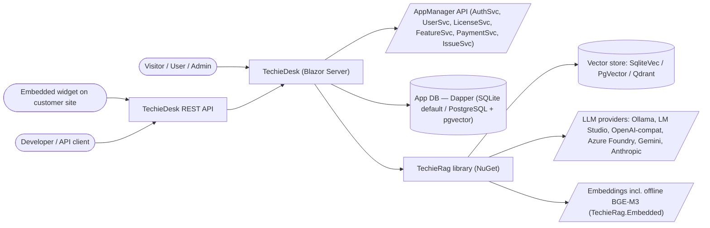
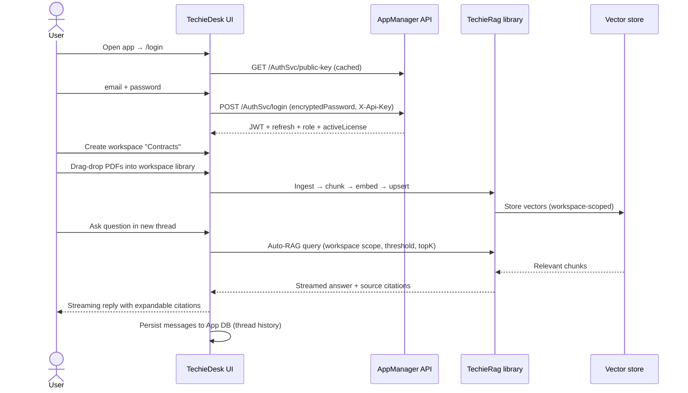
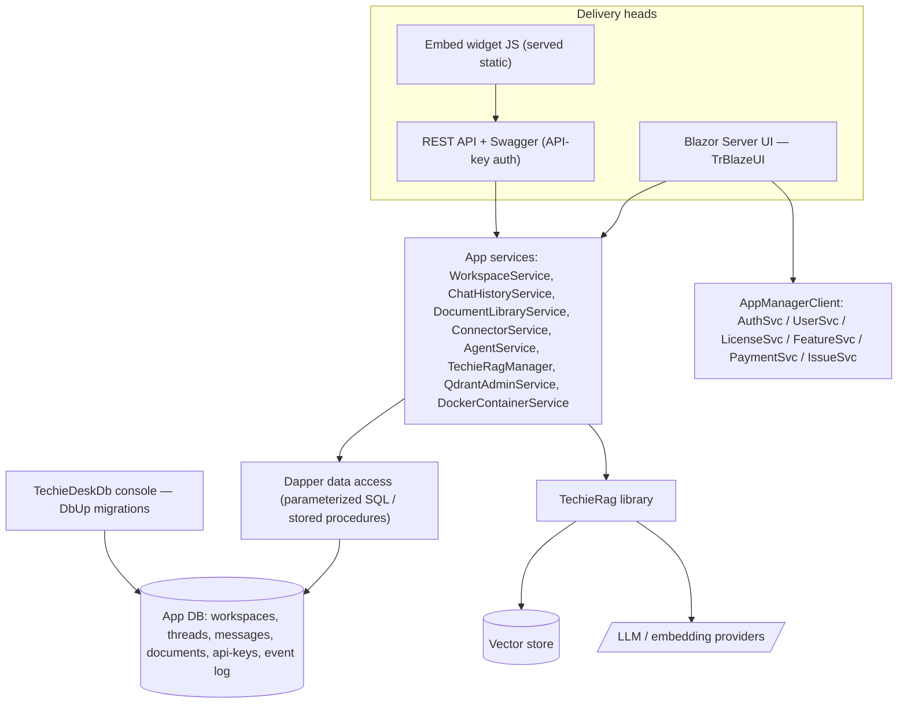
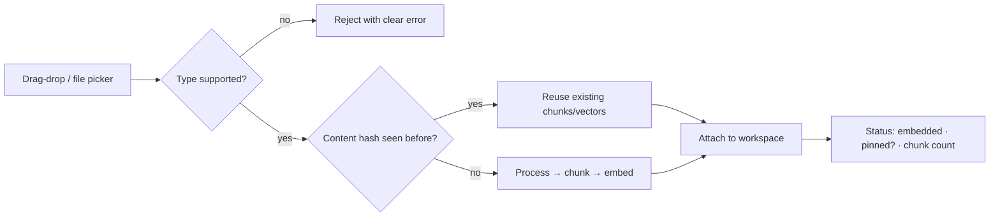

# TechieDesk — Business Requirements

<!-- AGENT-ONLY AUTHORING NOTES.
  STABLE IDS: every requirement has a BRD-{N} ID. IDs are append-only across revisions.
  This BRD has its OWN ID space (BRD-1…) separate from docs/TechieRag-BRD.md (library BRD).
  TechieDesk's origin entries in the library BRD (BRD-81 repositioning, BRD-82 rename) remain
  there as historical record; this document is the product BRD going forward.
  Gap traceability: requirements derived from docs/TechieRag-CompetitorAnalysis.md carry their
  GAP-APP-* / GAP-LIB-* source ID for register traceability. Library-side dependencies
  (GAP-LIB-*) are NOT given BRD-Ns here — they are tracked in the library BRD/checklist; app
  requirements that depend on them name the dependency inline.
  MERMAID MANDATE: quote every node/edge/subgraph label; never use `end` as a node id.
-->

## Table of Contents

1. [Executive summary](#executive-summary)
2. [Business objectives](#business-objectives)
3. [Scope](#scope)
4. [Development status](#development-status)
5. [Stakeholders / users](#stakeholders-users)
6. [Context diagram](#context-diagram)
7. [User journey — primary use case](#user-journey-primary-use-case)
8. [Component sketch](#component-sketch)
9. [Feature catalog](#feature-catalog)
10. [Functional requirements (BRD ledger)](#functional-requirements-brd-ledger)
11. [Non-functional requirements](#non-functional-requirements)
12. [Constraints & assumptions](#constraints-assumptions)
13. [Success metrics](#success-metrics)
14. [Risks](#risks)
15. [Glossary](#glossary)

## 1. Executive summary

**TechieDesk** is a self-hostable, workspace-based RAG chat product built on .NET 10 / Blazor Server with the TrBlazeUI component kit, powered by the **TechieRag** library (the reusable RAG core published on NuGet). Its mandate — confirmed by the product owner and recorded in `docs/TechieRag-CompetitorAnalysis.md` — is to become a **full productized AnythingLLM alternative**: workspace-based chat over private documents with any LLM/embedder/vector store, plus agents, a developer API, and an embeddable widget — re-imagined for the .NET ecosystem, where every product capability is also reusable by any .NET app via the underlying library.

As of 2026-07-17 the application has been separated from its sample-app origins: renamed from `TechieRagWeb` to **TechieDesk**, moved to `apps/TechieDesk`, fully re-branded and regression-verified (REQ-UI-014 / library BRD-82). What exists today is a strong **single-user operator console** — chat with Auto-RAG and citations, document/folder/text ingestion, an LLM playground, runtime provider settings, a unique Qdrant admin console with Docker lifecycle management, and a token/cost dashboard. What is missing is the **product layer**: users/auth/roles, workspaces and threads, persistent chat history, a document library UI, data connectors, a developer REST API, an embeddable widget, agent UX, white-labeling, i18n, and Docker distribution.

Four strategic decisions shape this BRD:

1. **User management is NOT built in-app.** TechieDesk integrates with the owner's **AppManager** platform (`docs/AppManager-api-usage-guide.md`, API v1.4) as a child application. Authentication, registration, password lifecycle, profiles, roles, **licensing/feature gating, payments/subscriptions, and support tickets** all come from AppManager's AuthSvc / UserSvc / LicenseSvc / FeatureSvc / PaymentSvc / IssueSvc. This replaces the competitor analysis' GAP-APP-01 (ASP.NET Core Identity) approach and — as a bonus AnythingLLM cannot match in its open-source tier — gives TechieDesk a **monetizable license/tier model and in-app support desk from day one**.
2. **Everything else follows the competitor benchmark.** Feature depth for workspaces, document library, connectors, developer API, widget, agents, branding, and i18n is taken from AnythingLLM (application benchmark); library-side capabilities they depend on are the GAP-LIB-* items — now ledgered **in this BRD** (F-LIB) so one checklist drives both codebases.
3. **One checklist governs the combined effort.** All open TechieRag library gaps (GAP-LIB-01…23 — verified unimplemented as of 2026-07-17), the open library feedback items (TR-RAG-001, TR-RAG-002; TrBlazeUI TR-002/003/004), and any **future** feedback are developed and tracked in the **TechieDesk Checklist** (`docs/TechieDesk-Checklist.md`, produced by `*split-brd TechieDesk`). The TechieRag BRD/checklist remain as historical record of the shipped v1.1/v2 scope; no new work is scheduled there.
4. **Data access is Dapper, not EF Core.** All TechieDesk data access uses Dapper — parameterized SQL for SQLite, stored procedures/queries for PostgreSQL (pgvector) — with schema migrations owned by a dedicated **TechieDeskDb** console project built on **DbUp**. All logging is **Serilog** (the standing TechieFlow NFR, BRD-100).

## 2. Business objectives

- **O1 — Product, not demo:** a stranger can `docker compose up`, register, create a workspace, drag in PDFs, and get streamed, cited answers — the competitor analysis Phase-2 exit criterion — within the MVP timeline (~12–16 weeks per `TechieRag-CompetitorAnalysis.md` §6).
- **O2 — .NET-native differentiation:** remain the only offering that is simultaneously a self-hostable RAG product **and** an embeddable .NET library; protect the §4.3 differentiators (offline BGE-M3, Qdrant admin console, token/cost governance, LLM playground).
- **O3 — Monetization-ready:** every install can run free/offline, but license tiers, feature gating, subscriptions, and payments are wired through AppManager so paid tiers can be switched on without re-architecture.
- **O4 — Zero-config first run:** out-of-the-box operation with no external services (Embedded BGE-M3 + SqliteVec + optional local Ollama), matching AnythingLLM's "works immediately" bar.
- **O5 — Operational trust:** all user documents, chats, and vectors remain on the self-hosted instance; only LLM-provider and AppManager calls leave the box; no product telemetry.

## 3. Scope

**In scope (this BRD):**

- The TechieDesk application (`apps/TechieDesk`): product shell, AppManager integration (auth/roles/licensing/billing/support), workspaces & threads, persistent chat history, document library, streaming citations UX, retrieval tuning, data connectors UI, developer REST API + keys + Swagger, embeddable chat widget, admin console, agent UX, TTS/STT (browser-first), white-labeling, i18n, Docker distribution, onboarding wizard, and security hygiene.
- App-observable outcomes that require library work (e.g. native streaming citations, reranking toggle, XLSX/PPTX ingestion, connectors, MCP) — the app requirement is stated here, **and** the library work itself is ledgered here too (F-LIB, BRD-105…127) so it is planned, built, and verified through the TechieDesk Checklist.
- **The open TechieRag library gap register (GAP-LIB-01…23)** — all 23 verified unimplemented as of 2026-07-17 — plus the open library feedback items (TR-RAG-001/002, TrBlazeUI TR-002/003/004). Future library feedback also lands as rows in the TechieDesk Checklist (single-checklist governance).
- **TechieDesk data platform:** Dapper-based data access and the TechieDeskDb migration console (DbUp) — see F-DATA.

**Library-first boundary (standing rule):** any capability that is reusable outside this app is implemented in the **TechieRag library** (as a GAP-LIB-* item) and only *surfaced* by TechieDesk. Concretely: the agent loop, agent skills/tools, MCP client, agent orchestration engine, data connectors and web crawlers, document processors, chunking, reranking, retrieval tuning primitives, workspace/collection primitives, persistent conversation memory, content-hash document dedupe, and TTS/STT abstractions are all **library** components. TechieDesk itself owns only what is inherently app-shaped: the Blazor UX, AppManager integration, the REST API + widget hosting, app metadata storage (user↔workspace assignments, thread metadata, API keys, event log, branding), and deployment packaging. Any new requirement that violates this boundary must be re-scoped into the library before implementation.

**Out of scope (explicit):**

- **In-app user/identity store** — no ASP.NET Core Identity, no local password handling beyond RSA-encrypting for transit to AppManager (owner decision, supersedes GAP-APP-01's Identity approach).
- **Payment processing UI beyond AppManager's API surface** — checkout/purchase happens on AppManager's side; TechieDesk shows pricing, subscriptions, invoices, and promo validation only.
- **Entity Framework Core** — banned in the TechieDesk codebase (owner decision); all data access is Dapper (see F-DATA).
- The TechieRag library's **already-shipped** v1.1/v2 scope — its historical record stays in `docs/TechieRag-BRD.md`; only the *open* gaps (F-LIB) are governed here.
- Browser extension, mobile app, desktop (MAUI) heads (GAP-APP-19) — deferred until demand.
- No-code agent flow builder and scheduled tasks are **in catalog but last phase** (Phase 5); realtime voice calls, fine-tuning UIs, image/video generation — not planned.

## 4. Development status

**Snapshot as of 2026-07-18.** Live, per-requirement status: see `PROJECT-STATUS.md` and the **Requirements Status** table in `docs/TechieDesk-Checklist.md`.

| Feature (F-code) | Phase | Status | % | Notes |
|------------------|-------|--------|---|-------|
| F-SHELL: App shell, branding & navigation | 0 | Done | 100 | TechieDesk rename/rebrand verified 2026-07-17; runtime render-confirmed 2026-07-18 (9 console routes clean @1280/390) |
| F-CHAT: Chat (Direct-LLM + Auto-RAG, streaming) | 0 | Partial | 75 | RAG-024/029 (streaming sources + usage) Verified 2026-07-18; live LLM stream pending provider UAT |
| F-INGEST: Folder/text ingestion (console-style) | 0 | Done | 100 | Folder/pattern + paste-text; superseded by F-DOCLIB for product UX |
| F-PLAYGROUND: LLM playground | 0 | Done | 100 | Differentiator |
| F-QADMIN: Qdrant admin + Docker lifecycle | 0 | Done | 100 | Differentiator |
| F-SETTINGS: Provider settings + connection test | 0 | Done | 100 | |
| F-TOKENS: Token/cost dashboard + budgets | 0 | Done | 100 | Differentiator |
| F-TOOLS: Agent/tool demo | 0 | Done | 100 | Dev-oriented; superseded by F-AGENT for product UX |
| F-AUTH: AppManager authentication & session | 1 | In progress | 60 | FN-001/004 Verified 2026-07-18 (RSA/wire); UI-006…013 render+visual confirmed, live AppManager round-trip = UAT |
| F-ROLES: Roles & access control | 1 | In progress | 85 | FN-005/006/007 Verified 2026-07-18 (role map, capability matrix, server-side authz); multi-user gating = UAT |
| F-WS: Workspaces & threads | 1 | In progress | 85 | UI-014/015/016 driven live + FN-008/009 + RAG-007/028 Verified 2026-07-18; UI-017 resume pending |
| F-HIST: Persistent chat history | 1 | In progress | 80 | RAG-008/009/027 Verified 2026-07-18 (thread persisted live); resume-after-restart = pending |
| F-CITE: Native streaming citations | 1 | In progress | 60 | RAG-024 Verified; RAG-010 + UI-018 need live LLM (provider UAT) |
| F-DOCLIB: Document library | 1 | In progress | 65 | RAG-012 Verified; UI-019/020/021 + FN-012 render+visual confirmed; RAG-011/013 PARTIAL; live ingest = UAT |
| F-RETRIEVE: Retrieval tuning | 1 | In progress | 90 | RAG-014/015/025 Verified 2026-07-18 (threshold/topK/rerank, chat-vs-query) |
| F-LIC: Licensing & feature gating (core) | 1 | Planned | 0 | New (AppManager LicenseSvc/FeatureSvc); FN-013/014/015 Not Started |
| F-ONBOARD: First-run onboarding wizard | 1 | In progress | 55 | ⚠ visual: UI-022 /setup stepper overflows @390 (Needs re-verify); UI-023/FN-016 render OK |
| F-DEPLOY: Docker distribution | 1 | In progress | 55 | FN-017/018/019 Implemented; container boot + volume persistence = owner UAT (no Docker here) |
| F-SEC: Security hygiene | 1 | In progress | 30 | NFR-002 confirmed (empty secrets); NFR-001 Blocked (owner PAT); NU1902 AngleSharp advisory logged (NFR-004) |
| F-CONNECT: Data connectors | 2 | Planned | 0 | GAP-APP-06 · depends GAP-LIB-05/06 |
| F-API: Developer REST API | 3 | Planned | 0 | GAP-APP-07 |
| F-WIDGET: Embeddable chat widget | 3 | Planned | 0 | GAP-APP-08 |
| F-ADMIN: Admin console | 3 | Planned | 0 | GAP-APP-16 |
| F-BILLING: Subscriptions, invoices & promos | 3 | Planned | 0 | New (AppManager PaymentSvc) |
| F-SUPPORT: In-app support desk | 3 | Planned | 0 | New (AppManager IssueSvc) |
| F-AGENT: Agent experience | 4 | Planned | 0 | GAP-APP-10 · depends GAP-LIB-12 |
| F-SPEECH: TTS/STT in chat | 4 | Planned | 0 | GAP-APP-15 |
| F-BRAND: White-labeling & appearance | 4 | Planned | 0 | GAP-APP-13 |
| F-I18N: Localization | 4 | Planned | 0 | GAP-APP-14 |
| F-FLOWS: No-code agent flow builder | 5 | Planned | 0 | GAP-APP-11 |
| F-SCHED: Scheduled tasks | 5 | Planned | 0 | GAP-APP-12 |
| F-DATA: Dapper data access + TechieDeskDb migrations (DbUp) | 1 | In progress | 85 | FN-029 (0 EF refs) + FN-030 (live DbUp migrations) Verified 2026-07-18; FN-031 Postgres boot = UAT |
| F-LIB: TechieRag library gap closure (GAP-LIB-01…23) | 1–5 | In progress | 30 | 7 of 23 gaps closed: RAG-024…030 Verified 2026-07-18 (53/53 lib tests); remainder Phase 2–5 |

**Legend:** **Done** = shipped & working · **In progress** = actively being built · **Partial** = some sub-features done, others pending · **Planned** = not started. (Maps to the checklist's `Done (pre-existing)` / `In Progress` / `PARTIAL` / `Not Started`.)

## 5. Stakeholders / users

TechieDesk maps AppManager's per-application role (`applicationRole`, returned app-scoped by `GET /UserSvc/profile` when called with the app's `X-Api-Key`) onto three product roles, mirroring AnythingLLM's proven model:

| Product role | AppManager `applicationRoleCode` | Responsibilities | Key screens |
|---|---|---|---|
| **Admin** | `Admin` | Instance settings, provider config, all workspaces, user–workspace assignment, API keys, branding, logs, Qdrant admin, MCP servers | Everything, incl. `/admin/*`, `/settings`, `/qdrant-admin` |
| **Manager** | `Manager` | Create/manage workspaces, document library, connectors, retrieval tuning, assign users to their workspaces | Workspaces, documents, connectors |
| **User** | `User` (default) | Chat in assigned workspaces, threads, own history/export, own profile/licenses/support tickets | Chat, threads, profile, billing, support |

**Registration/onboarding path:** visitor → `/register` (or invited by Admin) → AppManager `POST /AuthSvc/register` with the app's API key (role defaults to `User`) → auto-login → assigned workspaces appear. The **first-run wizard** bootstraps the first Admin.

**Proposed license & feature matrix** (via AppManager FeatureSvc feature codes — final tier composition is a pricing decision for the owner, structure is the requirement):

| Feature code | Type | Free | Professional | Enterprise |
|---|---|---|---|---|
| `WORKSPACES` | Level | 2 | 10 | Unlimited |
| `SEATS` | Level | 1 | 5 | Unlimited |
| `API_REQUESTS` | Level | — | 10k/mo | Unlimited |
| `EMBED_WIDGET` | Binary | ✗ | ✓ | ✓ |
| `AGENTS` | Binary | ✗ | ✓ | ✓ |
| `CONNECTORS` | Binary | ✗ | ✓ | ✓ |
| `WHITE_LABEL` | Binary | ✗ | ✗ | ✓ |

## 6. Context diagram

## 7. User journey — primary use case

New user's first cited answer (the Phase-1 exit journey):

## 8. Component sketch

## 9. Feature catalog

### F-SHELL: App shell, branding & navigation

**Personas:** all · **Phase:** 0 (done)

TrBlazeUI sidebar shell with 10 routes, TechieDesk branding, responsive at 1280 px and 390 px (Playwright-verified). Post-Phase-1 the navigation reorganizes around workspaces (workspace switcher in sidebar), with operator screens (Qdrant admin, settings, playground) moving under an Admin section.

| Screen | Route | Description |
|--------|-------|-------------|
| Home | `/` | Dashboard, status cards |
| All current pages | `/chat`, `/ingestion`, `/text-ingestion`, `/llm-playground`, `/llm-settings`, `/qdrant-admin`, `/settings`, `/token-usage`, `/tool-demo` | Existing console screens |

**Requirements:** BRD-1, BRD-2

### F-CHAT: Chat (Direct-LLM + Auto-RAG, streaming)

**Personas:** all · **Phase:** 0 (done, partial) → evolves through F-WS/F-HIST/F-CITE

Streaming chat with a Direct-LLM vs Auto-RAG toggle; Auto-RAG retrieves from the vector store and shows source citations (currently via an app-side workaround while streaming — TR-RAG-001). In Phase 1 chat becomes workspace/thread-scoped with persistent history and native streaming citations.

**Requirements:** BRD-3, BRD-4

### F-INGEST: Folder/text ingestion (console-style)

**Personas:** Admin/Manager · **Phase:** 0 (done)

Folder-path + include-pattern ingestion and paste-text ingestion through the library's 9 processors (70+ code extensions). Remains as the operator-grade bulk path; the product-grade path is F-DOCLIB.

**Requirements:** BRD-5, BRD-6

### F-PLAYGROUND / F-QADMIN / F-SETTINGS / F-TOKENS / F-TOOLS (existing differentiators)

**Personas:** Admin (QADMIN/SETTINGS), all (others) · **Phase:** 0 (done)

- **F-PLAYGROUND:** completion / structured-output / chat playground — no competitor equivalent.
- **F-QADMIN:** Qdrant collection browse/CRUD, point inspection, Docker container lifecycle — unique operator tooling.
- **F-SETTINGS:** runtime LLM/embedding/vector-store provider settings with connection test.
- **F-TOKENS:** token/cost dashboard with budget alerts and block-on-exceed.
- **F-TOOLS:** tool/agent demo with live execution trace (dev-oriented; product agent UX = F-AGENT).

After Phase 1 these screens are role-gated: QADMIN + SETTINGS → Admin; TOKENS → Admin (instance-wide) with per-user view.

**Requirements:** BRD-7, BRD-8, BRD-9, BRD-10, BRD-11

### F-AUTH: AppManager authentication & session

**Personas:** all · **Phase:** 1 · **Source:** GAP-APP-01 (re-scoped per owner decision)

All identity flows delegate to AppManager (API v1.4). TechieDesk registers as a child application and identifies itself with `X-Api-Key` / `X-Api-Secret` on every call. Passwords are **never sent or stored in plaintext**: the app fetches and caches the RSA public key (`GET /AuthSvc/public-key`) and encrypts all password fields with RSA-OAEP-SHA256. Sessions are server-side (Blazor circuit + protected session storage); access tokens auto-refresh via `POST /AuthSvc/refresh`.

| Screen | Route | Description |
|--------|-------|-------------|
| Login | `/login` | Email + password; forgot-password link; deep-link return |
| Register | `/register` | Email, name, mobile (optional), password (complexity per AppManager rules) |
| Forgot / Reset password | `/forgot-password`, `/reset-password` | Token-based reset via AppManager email |
| Profile | `/profile` | View/update profile, change password, GDPR export/delete, addresses |

**Workflow (login):**
1. App ensures cached RSA public key.
2. User submits credentials → password RSA-encrypted → `POST /AuthSvc/login` with `X-Api-Key`.
3. Response yields JWT, refresh token, app-scoped `applicationRole`, and `activeLicense` — all captured into the session.
4. On token expiry the app silently calls `/AuthSvc/refresh`; on refresh failure the user is returned to `/login` (original route preserved).
5. Errors map to friendly UI states: `INVALID_CREDENTIALS`, `ACCOUNT_LOCKED` (423), `ACCOUNT_DISABLED` (403), `DECRYPTION_FAILED` (stale key → refetch key and retry once).

**Requirements:** BRD-12 … BRD-22

### F-ROLES: Roles & access control

**Personas:** all · **Phase:** 1 · **Source:** GAP-APP-01

The §5 role matrix, enforced **server-side** on every UI operation and API endpoint (never UI-hiding alone). Role comes from the app-scoped `applicationRole`; users with `NO_APP_ACCESS` get a "no access to this application" page. Workspace membership (which User sees which workspace) is stored in the local App DB and managed by Admin/Manager (AppManager has no workspace concept — it owns identity, TechieDesk owns authorization objects).

**Requirements:** BRD-23 … BRD-26

### F-WS: Workspaces & threads

**Personas:** all · **Phase:** 1 · **Source:** GAP-APP-02 · **Depends:** GAP-LIB-08

The core product concept (AnythingLLM parity): a workspace is an isolated container of documents + settings; threads are separate conversations within it. Retrieval in a workspace only sees that workspace's documents (workspace-scoped collections/filters via the library's workspace primitives).

| Screen | Route | Description |
|--------|-------|-------------|
| Workspace switcher | sidebar | List of workspaces the user can access; new-workspace button (role-gated) |
| Workspace chat | `/workspace/{slug}` | Threads list + active thread chat |
| Workspace settings | `/workspace/{slug}/settings` | Name, system prompt, LLM override, mode, retrieval tuning, members, danger zone |

**Per-workspace settings:** display name/slug, custom system prompt, optional LLM provider/model override, chat mode (`chat` = general + context vs `query` = context-only), retrieval settings (F-RETRIEVE), member assignment.

**Requirements:** BRD-27 … BRD-32

### F-HIST: Persistent chat history

**Personas:** all · **Phase:** 1 · **Source:** GAP-APP-03 · **Depends:** GAP-LIB-07

Message persistence itself is a **library** capability — the DB-backed `IConversationMemory` with threads (GAP-LIB-07; SQLite by default, PostgreSQL option) — so any TechieRag consumer gets persistent conversations, not just TechieDesk. The app layer adds only the thread *metadata* UX (titles, ordering, ownership mapping to AppManager users) on top. History is per user, per workspace, per thread; survives restarts and logins; feeds the LLM context window with token-aware trimming.

**Workflow:** open workspace → thread list (most recent first) → resume any thread with full context → export or delete.

**Requirements:** BRD-33 … BRD-37

### F-CITE: Native streaming citations

**Personas:** all · **Phase:** 1 · **Source:** GAP-APP-05 · **Depends:** GAP-LIB-01 (TR-RAG-001 fix)

The flagship UX defect fix: streamed answers must carry sources natively (AnythingLLM does). Citations render as they arrive, expandable to show document name, snippet, and relevance score.

**Requirements:** BRD-38, BRD-39

### F-DOCLIB: Document library

**Personas:** Admin/Manager (manage), User (view) · **Phase:** 1 · **Source:** GAP-APP-04 · **Depends:** GAP-LIB-08 (workspace primitives), GAP-LIB-11 (XLSX/PPTX)

Product-grade document management replacing folder-path ingestion for end users: drag-drop multi-file upload, per-workspace embed/unembed, pinning, live status, and dedupe (a file uploaded once is embedded once and reusable across workspaces — AnythingLLM's cost-saving pattern).

| Screen | Route | Description |
|--------|-------|-------------|
| Document library | `/workspace/{slug}/documents` (+ instance-wide `/admin/documents`) | Upload, embed/unembed, pin, delete, metadata |

**Requirements:** BRD-40 … BRD-46

### F-RETRIEVE: Retrieval tuning

**Personas:** Admin/Manager · **Phase:** 1 · **Source:** GAP-APP-09 · **Depends:** GAP-LIB-02 (reranker), GAP-LIB-08 (threshold)

Per-workspace retrieval controls, AnythingLLM-parity: similarity threshold, snippet count (top-K), rerank toggle ("accuracy optimized"), and chat-vs-query mode.

**Requirements:** BRD-47, BRD-48

### F-LIC: Licensing & feature gating (core)

**Personas:** all · **Phase:** 1 (core) · **Source:** new — AppManager LicenseSvc/FeatureSvc

License state arrives with login (`activeLicense`) and is re-validated via `POST /LicenseSvc/validate`. Feature access is resolved through `GET /FeatureSvc` (binary + level features per §5 matrix) and cached per session; gated features render an upgrade prompt instead of silently disappearing. If AppManager is unreachable, the app degrades gracefully: last-known-good license honored for a configurable grace period (self-hosted instances must not brick when the license server is down). Feature flags (`GET /FeatureSvc/flags/{code}`) support staged rollout of new TechieDesk features.

**Requirements:** BRD-49 … BRD-51

### F-ONBOARD: First-run onboarding wizard

**Personas:** Admin (first run) · **Phase:** 1 · **Source:** GAP-APP-18

Zero-config first run mirroring AnythingLLM's out-of-the-box bar: on an empty instance the wizard (1) applies offline defaults — TechieRag.Embedded BGE-M3 + SqliteVec, (2) detects a local Ollama and offers it as the LLM, (3) captures AppManager connection settings (base URL, API key/secret) or lets the operator skip into **offline single-user mode**, (4) bootstraps the first Admin (register or login via AppManager), and (5) creates a default workspace.

**Requirements:** BRD-52 … BRD-54

### F-DEPLOY: Docker distribution

**Personas:** operator · **Phase:** 1 · **Source:** GAP-APP-17

`docker compose up` = running product: app container + Postgres/pgvector, optional Qdrant and Ollama profiles; all settings via environment variables; named volumes for DB, uploads, and the bundled ONNX model so upgrades are data-safe.

**Requirements:** BRD-55 … BRD-57

### F-SEC: Security hygiene

**Personas:** owner · **Phase:** 1 · **Source:** GAP-APP-20

Pre-distribution blockers: revoke + untrack the TrBlazeUI PAT committed in `nuget.config`; all secrets (AppManager API key/secret, provider keys) load from environment/user-secrets and are never committed.

**Requirements:** BRD-58, BRD-59

### F-CONNECT: Data connectors

**Personas:** Admin/Manager · **Phase:** 2 · **Source:** GAP-APP-06 · **Depends:** GAP-LIB-05/06

AnythingLLM-parity ingestion sources beyond file upload, run as background jobs with visible progress: single-URL scrape, site crawler (depth + max-links), YouTube transcripts, GitHub/GitLab repos, Confluence spaces.

| Screen | Route | Description |
|--------|-------|-------------|
| Connectors | `/workspace/{slug}/connectors` | Pick source type, configure, run, monitor job status |

**Requirements:** BRD-60 … BRD-65

### F-API: Developer REST API

**Personas:** developer · **Phase:** 3 · **Source:** GAP-APP-07

Key-authenticated REST API covering workspaces, documents, threads, and chat (incl. streaming/SSE), with Swagger UI at `/api/docs`. API keys are created/revoked by Admin. Usage can be metered against the AppManager `API_REQUESTS` level feature — turning the developer API into a monetizable tier (beyond AnythingLLM's story).

**Requirements:** BRD-66 … BRD-69

### F-WIDGET: Embeddable chat widget

**Personas:** developer, end-customer visitors · **Phase:** 3 · **Source:** GAP-APP-08

A `<script>` snippet served by the instance embeds a workspace-scoped, API-key-authenticated chat bubble on any site, with configurable appearance (color, logo, welcome text). License-gated (`EMBED_WIDGET`).

**Requirements:** BRD-70, BRD-71

### F-ADMIN: Admin console

**Personas:** Admin · **Phase:** 3 · **Source:** GAP-APP-16

In-product operations: user list (identity data read from AppManager; local workspace assignments editable), event log (auth events, ingestion runs, admin actions — sourced from the existing Serilog pipeline into a queryable store), chat logs across workspaces (compliance view), and instance defaults.

| Screen | Route | Description |
|--------|-------|-------------|
| Users | `/admin/users` | Users + roles (from AppManager), workspace assignment |
| Event log | `/admin/events` | Filterable event stream |
| Chat logs | `/admin/chats` | Cross-workspace chat inspection/export |
| Instance settings | `/admin/settings` | Defaults, branding entry point |

**Requirements:** BRD-72 … BRD-75

### F-BILLING: Subscriptions, invoices & promos

**Personas:** User (own billing), Admin · **Phase:** 3 · **Source:** new — AppManager PaymentSvc/LicenseSvc

Self-service billing surface over AppManager: pricing page from `GET /LicenseSvc/types` (multi-currency), own licenses, subscriptions with cancel (immediate or period-end), transaction/invoice history with PDF download, and promo-code validation.

**Requirements:** BRD-76 … BRD-79

### F-SUPPORT: In-app support desk

**Personas:** User · **Phase:** 3 · **Source:** new — AppManager IssueSvc

Users raise and track support issues without leaving the product: create issue (type/priority), list with status filters, comment thread, close. All app-scoped by AppManager.

**Requirements:** BRD-80 … BRD-82

### F-AGENT: Agent experience

**Personas:** all (license-gated) · **Phase:** 4 · **Source:** GAP-APP-10 · **Depends:** GAP-LIB-12 (MCP)

Product-integrated agents, AnythingLLM-parity: invoke with `@agent` in any workspace chat; per-workspace skill toggles (RAG search, web search, web scrape, SQL query, chart generation, file operations); live execution trace (already proven in F-TOOLS); Admin-registered MCP tool servers exposing their tools to the agent loop. **Boundary:** the agent loop already lives in the library, and every skill is implemented as a library `ITool` (reusable by any TechieRag consumer), as is the MCP client (GAP-LIB-12); TechieDesk contributes only the `@agent` chat UX, the per-workspace toggle persistence, and the trace rendering.

**Requirements:** BRD-83 … BRD-86

### F-SPEECH: TTS/STT in chat

**Personas:** all · **Phase:** 4 · **Source:** GAP-APP-15 · **Depends:** GAP-LIB-16 (provider TTS/STT, later)

Browser-first: microphone dictation via the Web Speech API, and read-aloud playback of responses via browser speech synthesis. Provider-backed voices (Whisper/ElevenLabs-class) follow when the library abstractions land.

**Requirements:** BRD-87, BRD-88

### F-BRAND: White-labeling & appearance

**Personas:** Admin · **Phase:** 4 · **Source:** GAP-APP-13

License-gated (`WHITE_LABEL`): custom logo, application display name, login/welcome messages, footer links; light/dark theme with TrBlazeUI theming and custom accent color.

**Requirements:** BRD-89, BRD-90

### F-I18N: Localization

**Personas:** all · **Phase:** 4 · **Source:** GAP-APP-14

Resource-based localization (.resx) of all UI strings; ship `en` + 2 additional locales initially; per-user language picker; RTL deferred.

**Requirements:** BRD-91

### F-FLOWS: No-code agent flow builder · F-SCHED: Scheduled tasks

**Personas:** Admin/Manager · **Phase:** 5 · **Source:** GAP-APP-11/12

Visual multi-step agent flow builder and cron-scheduled agent/ingestion jobs — the last AnythingLLM parity items; deliberately deferred behind everything above. **Boundary:** the flow *execution engine* (graphs, handoffs, guardrails) is the library's orchestration framework (GAP-LIB-13); TechieDesk contributes the visual builder UI and the cron scheduling host.

**Requirements:** BRD-92, BRD-93

### F-DATA: Data access & migrations (Dapper + DbUp)

**Personas:** developer/operator · **Phase:** 1 · **Source:** owner decision (2026-07-17)

**EF Core is banned in the TechieDesk codebase.** All app data access goes through **Dapper**: parameterized SQL for the SQLite default, stored procedures/functions (or parameterized queries) for the PostgreSQL + pgvector option — SQLite has no stored-procedure support, so the SQLite path is script-based by necessity. Schema lifecycle is owned by a dedicated **TechieDeskDb console application** (a new project beside the app) that applies versioned, idempotent migration scripts via **DbUp**, with per-provider script sets producing equivalent schemas. The console runs standalone (operator-invoked) and at container start-up (F-DEPLOY) so `docker compose up` always boots against a current schema.

**Workflow (migration):**
1. Developer adds a versioned script pair (SQLite + PostgreSQL) to TechieDeskDb.
2. TechieDeskDb (console or startup hook) connects, reads the DbUp journal, applies only pending scripts in order.
3. Outcome logged via Serilog; non-zero exit code on failure blocks app start.

**Requirements:** BRD-102 … BRD-104

### F-LIB: TechieRag library gap closure (managed here)

**Personas:** developer (library consumers benefit) · **Phase:** 1–5 (per item) · **Source:** GAP-LIB-01…23, `docs/TechieRag-CompetitorAnalysis.md` §5.1

**Governance decision (2026-07-17):** all 23 library gaps are verified unimplemented, and the TechieRag BRD carries them only as the BRD-81 umbrella — no per-item requirement existed anywhere. From now on the open library work is ledgered **here** (BRD-105…127) and driven by the **TechieDesk Checklist**, alongside the open feedback items it absorbs (TR-RAG-001 → BRD-105, TR-RAG-002 → BRD-110; TrBlazeUI TR-002/003/004 tracked as checklist feedback rows). Future library feedback lands in the TechieDesk Checklist too. The library-first boundary (§3) is unchanged — this is *where the work is tracked*, not where the code lives: every one of these items is implemented inside `src/TechieRag*` and published via the library packages.

Phase alignment: each item below is tagged with the TechieDesk phase that needs it; P-numbers are the register's priorities.

**Requirements:** BRD-105 … BRD-127

## 10. Functional requirements (BRD ledger)

### Phase 0 — existing console (pre-existing, done)

- **BRD-1** — User can navigate all product screens via the TrBlazeUI sidebar shell, responsive at 1280 px and 390 px *(F-SHELL)*
- **BRD-2** — User can see a Home dashboard with instance status cards *(F-SHELL)*
- **BRD-3** — User can chat with the configured LLM directly (no RAG) with streamed responses *(F-CHAT)*
- **BRD-4** — User can chat in Auto-RAG mode and see source citations for retrieved context *(F-CHAT)*
- **BRD-5** — Admin can ingest documents from a folder path with include patterns through the library's 9 processors *(F-INGEST)*
- **BRD-6** — Admin can ingest pasted text as a document *(F-INGEST)*
- **BRD-7** — User can exercise completion, structured-output, and chat modes in the LLM playground *(F-PLAYGROUND)*
- **BRD-8** — Admin can browse/create/delete Qdrant collections, inspect points, and manage the Qdrant Docker container lifecycle *(F-QADMIN)*
- **BRD-9** — Admin can configure LLM/embedding/vector-store providers at runtime and run a connection test *(F-SETTINGS)*
- **BRD-10** — User can view token/cost usage on a dashboard with budget alerts and block-on-exceed *(F-TOKENS)*
- **BRD-11** — User can run tool-calling demos and see the live agent execution trace *(F-TOOLS)*

### F-AUTH — AppManager authentication & session (Phase 1)

- **BRD-12** — Visitor can register an account (email, first/last name, optional mobile, password meeting AppManager complexity rules) via AppManager `POST /AuthSvc/register` under this application *(F-AUTH)*
- **BRD-13** — User can log in with email + password via AppManager `POST /AuthSvc/login` and receives an app-scoped role and active license with the session *(F-AUTH)*
- **BRD-14** — System shall RSA-encrypt (OAEP-SHA256) every password field using the cached `GET /AuthSvc/public-key` key and shall never transmit or store a plaintext password; on `DECRYPTION_FAILED` it refetches the key and retries once *(F-AUTH)*
- **BRD-15** — System shall silently refresh the access token via `POST /AuthSvc/refresh` before expiry; on refresh failure the user is redirected to login with their original route preserved *(F-AUTH)*
- **BRD-16** — User can log out of the current session, or of all devices, via `POST /AuthSvc/logout` *(F-AUTH)*
- **BRD-17** — User can request a password reset (`/AuthSvc/forgot-password`) and set a new password with the emailed token (`/AuthSvc/reset-password`) *(F-AUTH)*
- **BRD-18** — Logged-in user can change their password (both current and new RSA-encrypted) via `POST /UserSvc/change-password` with field-level error feedback *(F-AUTH)*
- **BRD-19** — User can view and update their profile (name, mobile, avatar URL) via UserSvc *(F-AUTH)*
- **BRD-20** — System shall require authentication on every product route; unauthenticated visitors are redirected to `/login` and returned to their requested route after login *(F-AUTH)*
- **BRD-21** — System shall identify itself to AppManager with `X-Api-Key`/`X-Api-Secret` headers on every call, loading the credentials from environment/secret configuration *(F-AUTH)*
- **BRD-22** — User can submit GDPR data-export and account-deletion requests from their profile via UserSvc *(F-AUTH)*

### F-ROLES — Roles & access control (Phase 1)

- **BRD-23** — System shall map the AppManager app-scoped `applicationRole` to product roles Admin / Manager / User per the §5 matrix *(F-ROLES)*
- **BRD-24** — System shall restrict capabilities by role: Admin = instance settings + all workspaces + admin console; Manager = workspace/document/connector management; User = chat in assigned workspaces + own data *(F-ROLES)*
- **BRD-25** — System shall enforce every role check server-side (UI hiding alone is not sufficient) *(F-ROLES)*
- **BRD-26** — System shall present friendly, distinct states for `NO_APP_ACCESS`, `ACCOUNT_DISABLED`, and `ACCOUNT_LOCKED` responses from AppManager *(F-ROLES)*

### F-WS — Workspaces & threads (Phase 1)

- **BRD-27** — Manager/Admin can create, rename, and delete workspaces *(F-WS)*
- **BRD-28** — Manager/Admin can configure per-workspace settings: system prompt, optional LLM provider/model override, and chat-vs-query mode *(F-WS)*
- **BRD-29** — Manager/Admin can assign users to workspaces; a User sees only their assigned workspaces *(F-WS)*
- **BRD-30** — User can create, rename, and delete conversation threads within a workspace *(F-WS)*
- **BRD-31** — System shall auto-create a default workspace on first run *(F-WS)*
- **BRD-32** — System shall scope retrieval strictly to the active workspace's documents *(F-WS)*

### F-HIST — Persistent chat history (Phase 1)

- **BRD-33** — System shall persist every chat message (user + assistant + citations) per user/workspace/thread, surviving restarts, via the library's DB-backed conversation memory *(F-HIST — depends GAP-LIB-07)*
- **BRD-34** — User can browse past threads and resume any thread with its full context after re-login *(F-HIST)*
- **BRD-35** — User can export a thread as Markdown or JSON *(F-HIST)*
- **BRD-36** — User can delete a thread, or their entire chat history, permanently *(F-HIST)*
- **BRD-37** — System shall build the LLM context from persisted history with token-aware trimming *(F-HIST — depends GAP-LIB-07)*

### F-CITE — Native streaming citations (Phase 1)

- **BRD-38** — Streamed RAG answers shall display their source citations natively as the stream arrives, with no post-hoc workaround *(F-CITE — depends GAP-LIB-01)*
- **BRD-39** — User can expand any citation to see document name, matching snippet, and relevance score *(F-CITE)*

### F-DOCLIB — Document library (Phase 1)

- **BRD-40** — Manager/Admin can upload documents by drag-drop or file picker, multiple files at once, into a workspace library *(F-DOCLIB)*
- **BRD-41** — System shall accept all library-supported types (9 processors + XLSX/PPTX once GAP-LIB-11 lands) and reject unsupported files with a clear per-file error *(F-DOCLIB)*
- **BRD-42** — Manager/Admin can embed/unembed a document per workspace and see live status (pending / embedding / embedded / failed) *(F-DOCLIB)*
- **BRD-43** — System shall deduplicate by content: a document uploaded once is embedded once and reusable across workspaces without re-embedding (content-hash dedupe as a library ingestion capability) *(F-DOCLIB — depends GAP-LIB-08)*
- **BRD-44** — Manager/Admin can pin a document so it is always included in the workspace's context (pinning is a library workspace primitive) *(F-DOCLIB — depends GAP-LIB-08)*
- **BRD-45** — Manager/Admin can delete a document, which removes its vectors from every workspace using it (with confirmation) *(F-DOCLIB)*
- **BRD-46** — Document library shall list per-document metadata: name, type, size, chunk count, upload date, and workspaces using it *(F-DOCLIB)*

### F-RETRIEVE — Retrieval tuning (Phase 1)

- **BRD-47** — Manager/Admin can tune retrieval per workspace: similarity threshold, snippet count (top-K), and rerank toggle *(F-RETRIEVE — depends GAP-LIB-02/08)*
- **BRD-48** — Manager/Admin can set a workspace to chat mode (general knowledge + context) or query mode (context-only, with an honest "not in my documents" answer) *(F-RETRIEVE)*

### F-LIC — Licensing & feature gating, core (Phase 1)

- **BRD-49** — System shall validate the user's license at login and periodically (`POST /LicenseSvc/validate`), showing license name/status/expiry in the UI *(F-LIC)*
- **BRD-50** — System shall gate license-tier features via FeatureSvc codes (binary + level per §5 matrix); gated features render an upgrade prompt, not a silent absence *(F-LIC)*
- **BRD-51** — System shall degrade gracefully when AppManager is unreachable: last-known-good license honored for a configurable grace period; clear banner shown *(F-LIC)*

### F-ONBOARD — First-run wizard (Phase 1)

- **BRD-52** — On an empty instance, the first-run wizard shall configure offline defaults (TechieRag.Embedded BGE-M3 + SqliteVec) with zero external services *(F-ONBOARD)*
- **BRD-53** — Wizard shall detect a local Ollama instance and offer discovered models as the LLM provider *(F-ONBOARD)*
- **BRD-54** — Wizard shall capture AppManager connection settings and bootstrap the first Admin (register/login) — or let the operator choose offline single-user mode explicitly *(F-ONBOARD)*

### F-DEPLOY — Docker distribution (Phase 1)

- **BRD-55** — Operator can self-host the full product with one command via Dockerfile + docker-compose (app + Postgres/pgvector; optional Qdrant and Ollama profiles) *(F-DEPLOY)*
- **BRD-56** — System shall read all deployment configuration from environment variables (12-factor) *(F-DEPLOY)*
- **BRD-57** — Compose shall define persistent volumes for the App DB, uploaded documents, and the bundled ONNX model so upgrades preserve data *(F-DEPLOY)*

### F-SEC — Security hygiene (Phase 1)

- **BRD-58** — The committed TrBlazeUI PAT shall be revoked and removed from git tracking before any public distribution *(F-SEC)*
- **BRD-59** — System shall load all secrets (AppManager key/secret, provider API keys) from environment/user-secrets; no secret shall be committed to the repository *(F-SEC)*

### F-CONNECT — Data connectors (Phase 2)

- **BRD-60** — Manager/Admin can ingest a single URL into a workspace (scrape → clean text → embed) *(F-CONNECT — depends GAP-LIB-05)*
- **BRD-61** — Manager/Admin can crawl a website with depth and max-links limits *(F-CONNECT — depends GAP-LIB-05)*
- **BRD-62** — Manager/Admin can ingest YouTube video transcripts by URL *(F-CONNECT — depends GAP-LIB-05)*
- **BRD-63** — Manager/Admin can connect a GitHub/GitLab repository and ingest its files (branch + glob filters) *(F-CONNECT — depends GAP-LIB-06)*
- **BRD-64** — Manager/Admin can connect a Confluence space and ingest its pages *(F-CONNECT — depends GAP-LIB-06)*
- **BRD-65** — Connector runs shall execute as background jobs with visible progress, per-item results, and per-item failure reasons *(F-CONNECT)*

### F-API — Developer REST API (Phase 3)

- **BRD-66** — Developer can drive workspaces, documents, threads, and chat (including streamed responses) through a REST API *(F-API)*
- **BRD-67** — Admin can create, label, and revoke API keys; every API call authenticates by key *(F-API)*
- **BRD-68** — Developer can explore the API via Swagger/OpenAPI UI at `/api/docs` *(F-API)*
- **BRD-69** — System shall meter API usage and (when licensing is active) enforce the `API_REQUESTS` level from the user's license *(F-API)*

### F-WIDGET — Embeddable chat widget (Phase 3)

- **BRD-70** — Site owner can embed a workspace-scoped, API-key-authenticated chat widget on any website via a script snippet served by the instance *(F-WIDGET)*
- **BRD-71** — Admin can configure widget appearance: color, logo, welcome message, position *(F-WIDGET)*

### F-ADMIN — Admin console (Phase 3)

- **BRD-72** — Admin can view all users of this application (identity from AppManager) and manage their workspace assignments *(F-ADMIN)*
- **BRD-73** — Admin can view a filterable event log (auth events, ingestion runs, admin actions) in-product *(F-ADMIN)*
- **BRD-74** — Admin can inspect and export chat logs across workspaces *(F-ADMIN)*
- **BRD-75** — Admin can manage instance defaults (default LLM/embedding/vector-store, upload limits) from the admin console *(F-ADMIN)*

### F-BILLING — Subscriptions, invoices & promos (Phase 3)

- **BRD-76** — User can view available license types with multi-currency pricing (`GET /LicenseSvc/types`) on a pricing page *(F-BILLING)*
- **BRD-77** — User can view their subscriptions and cancel one (immediately or at period end) via PaymentSvc *(F-BILLING)*
- **BRD-78** — User can view transaction and invoice history and download invoice PDFs *(F-BILLING)*
- **BRD-79** — User can validate a promo code against this application before purchase *(F-BILLING)*

### F-SUPPORT — In-app support desk (Phase 3)

- **BRD-80** — User can create a support issue (title, description, type, priority) via IssueSvc without leaving the product *(F-SUPPORT)*
- **BRD-81** — User can list their issues with status filters and read/add comments *(F-SUPPORT)*
- **BRD-82** — User can close their own resolved issues *(F-SUPPORT)*

### F-AGENT — Agent experience (Phase 4)

- **BRD-83** — User can invoke the agent in any workspace chat with `@agent` *(F-AGENT)*
- **BRD-84** — Manager/Admin can toggle agent skills per workspace: RAG search, web search, web scrape, SQL query, chart generation, file operations — each skill implemented as a reusable library tool, not app code *(F-AGENT — depends GAP-LIB-12/13 skill surface)*
- **BRD-85** — Agent responses shall show a live execution trace of tool calls and results in the product chat *(F-AGENT)*
- **BRD-86** — Admin can register MCP tool servers whose tools become available to the agent *(F-AGENT — depends GAP-LIB-12)*

### F-SPEECH — TTS/STT (Phase 4)

- **BRD-87** — User can dictate a chat message via microphone (browser speech recognition) *(F-SPEECH)*
- **BRD-88** — User can play back an assistant response as speech (browser speech synthesis first; provider voices later) *(F-SPEECH)*

### F-BRAND — White-labeling (Phase 4)

- **BRD-89** — Admin can set custom logo, application display name, login/welcome messages, and footer links (license-gated `WHITE_LABEL`) *(F-BRAND)*
- **BRD-90** — User can switch light/dark theme; Admin can set a custom accent color *(F-BRAND)*

### F-I18N — Localization (Phase 4)

- **BRD-91** — All UI strings shall be resource-localized; the product ships `en` plus at least 2 locales with a per-user language picker *(F-I18N)*

### F-FLOWS / F-SCHED (Phase 5)

- **BRD-92** — Manager/Admin can compose multi-step agent flows in a no-code visual builder and run them from chat; the execution engine is the library's orchestration framework *(F-FLOWS — depends GAP-LIB-13)*
- **BRD-93** — Manager/Admin can schedule recurring agent or ingestion jobs (cron) with run history *(F-SCHED)*

### F-DATA — Data access & migrations (Phase 1)

- **BRD-102** — All TechieDesk data access shall use Dapper with parameterized SQL (SQLite) or stored procedures/parameterized queries (PostgreSQL + pgvector); EF Core shall not be referenced by any TechieDesk project *(F-DATA)*
- **BRD-103** — A TechieDeskDb console application shall apply versioned, idempotent schema migrations via DbUp (journaled, ordered, re-runnable), runnable standalone and at container start-up, exiting non-zero on failure *(F-DATA)*
- **BRD-104** — Migration scripts shall be maintained per provider (SQLite and PostgreSQL) and produce equivalent schemas, verified by booting the app against each *(F-DATA)*

### F-LIB — TechieRag library gap closure (Phases 1–5, built in `src/TechieRag*`, tracked here)

*Phase 1 (unblocks the product shell):*

- **BRD-105** — Library: streaming RAG shall return source citations and honor the PromptTemplateEngine (closes TR-RAG-001) *(F-LIB — GAP-LIB-01, P0; unblocks BRD-38)*
- **BRD-106** — Library: reranking stage — `IReranker` abstraction with a local ONNX cross-encoder option and at least one API reranker *(F-LIB — GAP-LIB-02, P0; unblocks BRD-47)*
- **BRD-107** — Library: pluggable `IChunker` with recursive, token-based, markdown/code-aware, and sentence strategies *(F-LIB — GAP-LIB-03, P0)*
- **BRD-108** — Library: persistent DB-backed conversation memory (`IConversationMemory`, SQLite/Postgres) with threads *(F-LIB — GAP-LIB-07, P0; unblocks BRD-33)*
- **BRD-109** — Library: workspace/collection concept — isolated docs + settings, doc pinning, similarity threshold, query-vs-chat mode *(F-LIB — GAP-LIB-08, P0; unblocks BRD-27…32/43/44)*
- **BRD-110** — Library: cost table externalized to configuration and streamed-token usage reported correctly on all providers (closes TR-RAG-002) *(F-LIB — GAP-LIB-19, P1)*
- **BRD-111** — Library: unit-test coverage for processors, providers, agent loop, memory, and cost math — continuous, grows with every phase *(F-LIB — GAP-LIB-22, P0)*

*Phase 2 (ingestion breadth + providers):*

- **BRD-112** — Library: web ingestion — URL scraper, site crawler (depth/maxLinks), YouTube transcripts *(F-LIB — GAP-LIB-05, P1; unblocks BRD-60…62)*
- **BRD-113** — Library: `IDataConnector` framework with GitHub/GitLab and Confluence connectors *(F-LIB — GAP-LIB-06, P1; unblocks BRD-63/64)*
- **BRD-114** — Library: XLSX/PPTX/CSV document processors *(F-LIB — GAP-LIB-11, P1; unblocks BRD-41)*
- **BRD-115** — Library: provider expansion + model-name→provider routing (Bedrock, Groq, Mistral, Cohere, DeepSeek, xAI, OpenRouter, Together, Perplexity, …) *(F-LIB — GAP-LIB-04, P1)*
- **BRD-116** — Library: additional embedding providers (Cohere, Voyage, Mistral, Gemini) *(F-LIB — GAP-LIB-15, P2)*

*Phase 3 (developer platform):*

- **BRD-117** — Library: OpenTelemetry exporters (metrics + tracing) *(F-LIB — GAP-LIB-18, P2)*
- **BRD-118** — Library: broaden TFMs — add net8.0 (netstandard2.0 if feasible) *(F-LIB — GAP-LIB-21, P2)*

*Phase 4 (agents & multimodal):*

- **BRD-119** — Library: MCP client — consume MCP tool servers in the agent loop *(F-LIB — GAP-LIB-12, P1; unblocks BRD-86)*
- **BRD-120** — Library: multimodal chat input — vision first, then audio/docs-as-attachment *(F-LIB — GAP-LIB-09, P1)*
- **BRD-121** — Library: audio-transcription ingestion processor (Whisper local ONNX or API) *(F-LIB — GAP-LIB-10, P2)*
- **BRD-122** — Library: `ITextToSpeech` / `ISpeechToText` provider abstractions *(F-LIB — GAP-LIB-16, P2; extends BRD-87/88)*

*Phase 5 (orchestration):*

- **BRD-123** — Library: agent orchestration — multi-step graphs, handoffs, guardrails, agent-as-tool *(F-LIB — GAP-LIB-13, P2; unblocks BRD-92)*
- **BRD-124** — Library: prompt-caching passthrough (Anthropic/Gemini) *(F-LIB — GAP-LIB-17, P3)*

*Deferred (pull forward on demand):*

- **BRD-125** — Library: additional vector stores (Chroma, Milvus, Pinecone, Weaviate or LanceDB) behind `IVectorStore` *(F-LIB — GAP-LIB-14, P2, deferred)*
- **BRD-126** — Library: Microsoft.Extensions.AI interop package *(F-LIB — GAP-LIB-20, P3, deferred)*
- **BRD-127** — Library: image generation / realtime audio / batch / fine-tuning / moderation / OCR endpoints *(F-LIB — GAP-LIB-23, P3, deferred; re-scope per demand)*

## 11. Non-functional requirements

- **BRD-94** — Performance targets *(NFR)*:

  | Metric | Target |
  |---|---|
  | First streamed token after send (excluding model inference) | < 2 s overhead |
  | UI interaction latency (navigation, toggles) | < 200 ms |
  | Document upload → embedded (10-page PDF, local BGE-M3) | < 60 s |
  | Concurrent active chat users per instance (reference hardware) | ≥ 25 |

- **BRD-95** — Security: TLS for all AppManager/provider traffic; JWT + refresh tokens held server-side (never in browser-readable storage); every authorization check server-side; OWASP Top-10 hygiene on all inputs; API keys stored hashed *(NFR)*
- **BRD-96** — Accessibility: keyboard navigability, focus states, ARIA labels, and WCAG 2.1 AA contrast on all product screens *(NFR)*
- **BRD-97** — Responsiveness: every screen usable at 1280 px and 390 px with no horizontal overflow (Playwright-gated, existing standard) *(NFR)*
- **BRD-98** — Browser support: current Chrome, Edge, Firefox, Safari (evergreen) *(NFR)*
- **BRD-99** — Privacy/data locality: documents, chats, and vectors never leave the instance except to the configured LLM/embedding provider; no product telemetry is collected *(NFR)*
- **BRD-100** — Observability: Serilog rolling-file logging under `logs/` in every executable head, wired at startup, unhandled exceptions logged (TechieFlow standing requirement; see Coding Standards §Logging) *(NFR)*
- **BRD-101** — Resilience: AppManager outage does not interrupt active sessions (license grace per BRD-51); LLM-provider failures surface the library's retry/fallback behavior with user-visible status; app restart loses no persisted data *(NFR)*

## 12. Constraints & assumptions

- **AppManager dependency:** TechieDesk is registered as a child application in AppManager; API credentials (X-Api-Key/X-Api-Secret) are provisioned there. Integration targets **API v1.4** (`a`-prefixed URL parameters; DTO JSON names unchanged). Checkout/purchase UX lives on AppManager's side.
- **Library dependency:** product features requiring core capabilities depend on the corresponding F-LIB items landing first (streaming citations ← BRD-105, reranking ← BRD-106, persistent memory ← BRD-108, workspace primitives ← BRD-109, XLSX/PPTX ← BRD-114, web/connectors ← BRD-112/113, MCP ← BRD-119). The library work is scheduled inside the same phases as the app features it unblocks.
- **Single-checklist governance:** the TechieDesk Checklist is the only live work tracker for app **and** library items (F-LIB) **and** feedback (existing TR-RAG-001/002, TrBlazeUI TR-002/003/004, and all future feedback). The TechieRag BRD/checklist are frozen historical records of the shipped v1.1/v2 scope.
- **UI system:** TrBlazeUI throughout (known open issues TR-002/TR-003/TR-004 in `docs/TechieRag-TrBlazeUI-Feedback.md`; now tracked via the TechieDesk Checklist).
- **Stack:** .NET 10, Blazor Server; **data access via Dapper only** — parameterized SQL (SQLite) / stored procedures or queries (PostgreSQL + pgvector); schema migrations via the TechieDeskDb console (DbUp); **all logging via Serilog** (BRD-100); solo AI-assisted development under the TechieFlow workflow; effort model in `TechieRag-CompetitorAnalysis.md` §6. Note: SQLite has no stored-procedure support, hence the script-based SQLite path.
- **Assumption:** offline single-user mode (no AppManager configured) remains supported for evaluation installs; product features that inherently need identity (multi-user, API keys tied to users, billing, support) are unavailable in that mode.

## 13. Success metrics

- **M1:** Phase-1 exit — fresh `docker compose up` to first cited streamed answer in under 15 minutes by an uncoached user.
- **M2:** 100% of §10 Phase-1 requirements Verified by the TechieFlow verifier (build + Playwright + live smoke gates).
- **M3:** Zero plaintext-credential findings and zero committed secrets (BRD-58/59) at every phase handoff.
- **M4:** MVP (Phases 1–2 app scope + library Phase-1 deps) within the ~12–16-week competitor-analysis estimate.
- **M5:** First paid license activated end-to-end through AppManager (register → license → gated feature unlock) in a staging environment before Phase-3 exit.

## 14. Risks

| Risk | Likelihood | Impact | Mitigation |
|------|-----------|--------|------------|
| Library dependencies (GAP-LIB-01/02/07/08) slip and block Phase 1 app work | Medium | High | Sequence library Phase 1 first (per competitor analysis §6); app work on F-AUTH/F-DEPLOY/F-ONBOARD is library-independent and can proceed in parallel |
| AppManager API availability/latency couples product login to an external service | Medium | High | BRD-51 grace period + offline single-user mode; cache public key and feature matrix per session |
| AppManager v1.4 breaking-change cadence (v1.2→v1.4 already renamed params twice) | Medium | Medium | Isolate all calls in one `AppManagerClient`; contract tests against the local dev instance |
| TrBlazeUI component gaps for new surfaces (drag-drop upload, flow builder) | Medium | Medium | Known-workaround pattern (TR-002/003/004); fall back to custom components; log feedback upstream |
| Committed PAT already in git history | High (exists) | High | BRD-58: revoke first (kills the credential), then untrack; history rewrite optional afterwards |
| Competitor drift (AnythingLLM ships weekly) | High | Medium | Monthly delta scan per competitor-analysis §8; append-only BRD additions via `*amend-docs` |
| Solo-developer bandwidth vs 30+ feature surface (now incl. all open library gaps) | High | Medium | Strict phase gates; each phase ends shippable; defer Phase-5/deferred F-LIB items without guilt |
| Dual SQL dialect maintenance (SQLite scripts + PostgreSQL procedures) drifts | Medium | Medium | BRD-104 equivalence check (boot against both) in the verifier gates; shared schema docs in TechieDeskDb |

## 15. Glossary

- **TechieDesk** — this product (formerly TechieRagWeb sample), `apps/TechieDesk`.
- **TechieRag** — the core .NET RAG library (NuGet) powering TechieDesk.
- **TechieRag.Embedded** — offline BGE-M3 ONNX embedding package.
- **TrBlazeUI** — the Blazor component kit used for all UI.
- **AppManager** — the owner's central platform for auth, users, licensing, features, payments, and support; consumed via `docs/AppManager-api-usage-guide.md` (v1.4).
- **Workspace / Thread** — isolated document+settings container / a conversation within it.
- **Chat vs Query mode** — general knowledge + context vs context-only answering.
- **GAP-APP-* / GAP-LIB-*** — stable gap-register IDs from `docs/TechieRag-CompetitorAnalysis.md` §5.
- **AnythingLLM / LLMTornado** — application / library benchmarks from the competitor analysis.
- **Dapper** — the micro-ORM used for ALL TechieDesk data access (EF Core is banned).
- **TechieDeskDb** — the console project owning schema migrations, built on **DbUp** (versioned, journaled SQL script runner).
- **F-LIB** — this BRD's feature that ledgers the open TechieRag library gaps (GAP-LIB-01…23) so the TechieDesk Checklist manages them.
- **REQ-UI-* / REQ-FN-* / REQ-RAG-* / REQ-NFR-*** — checklist requirement IDs produced by `*split-brd`.

---
Last updated: 2026-07-17
Highest BRD ID: BRD-127
