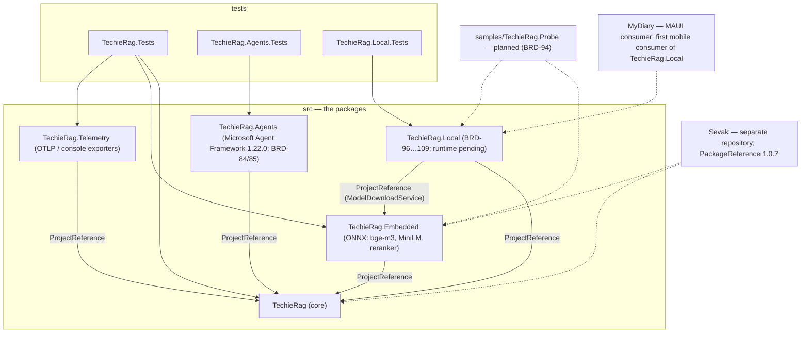
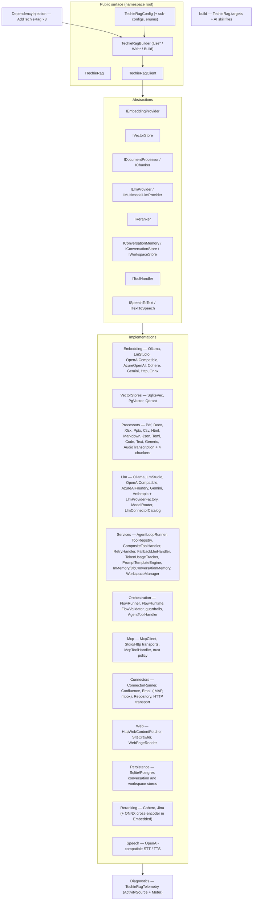
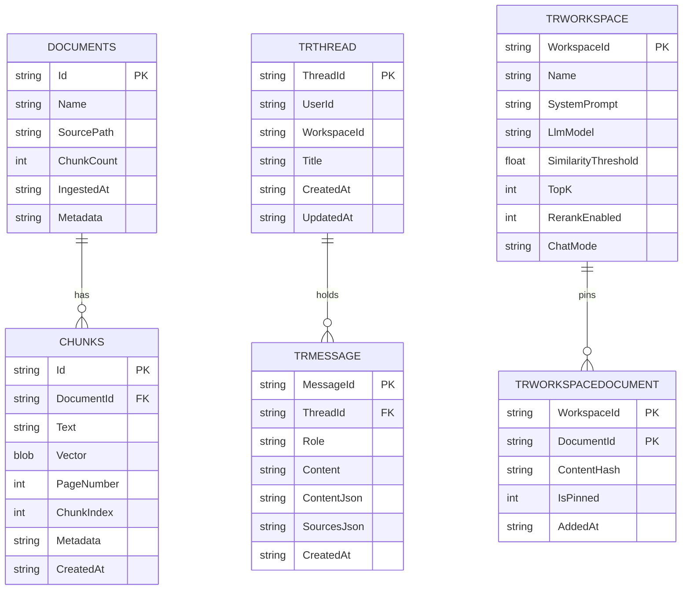

# TechieRag — Architecture

| | |
|---|---|
| App | TechieRag |
| Kind | library |
| Size | Large |
| Stack answer set | dotnet |
| Date | 2026-09-24 |

Status: Current (brownfield, read from the code on 2026-09-24). This document describes the four-package .NET library as it is built; every planned change is a Decisions-log row naming its BRD item. The application that consumes the packages, **Sevak** (TechieDesk until 2026-09-24), lives in its own repository and is described there. Harvested from the previous Architecture (2026-06-25, amended 2026-07-17, 2026-09-03 and 2026-09-24; now `docs/OldDocs/TechieRag-Architecture.md`), `DECISIONS.md`, `docs/TechieRag.Agents-Proposal.md`, `NUGET-PUBLISHING.md` and a full scan of `src/`, `tests/` and `.github/workflows/`.

## 1. Stack decisions

One row per stack question. "Source" says where the answer came from: the answer set, the owner, or the existing code.

| Q | Topic | Decision | Source |
|---|---|---|---|
| Q1 | Configuration | The library binds a `TechieRag` section of the host's `IConfiguration` (`AddTechieRag(IConfiguration)`), or takes a fluent `TechieRagBuilder`, or a hand-built `TechieRagConfig`. It reads two environment variables of its own, `TECHIERAG_MODEL_BASE_URL` and `TECHIERAG_RERANKER_BASE_URL` (model download mirrors). The library never owns an `appsettings.json`; the host does. | code (`DependencyInjection/ServiceCollectionExtensions.cs`, `TechieRag.Embedded/EmbeddedEmbeddingProvider.cs:36`); answer set for the host's layering |
| Q2 | Secrets in development | API keys are configuration strings the host supplies; the library never persists one. Live tests read keys and connection strings from environment variables (`TechieRagLiveNetworkTests`, `TechieRagTestPostgres`) and skip when absent. No `secrets.example.json` exists; the UsageGuide lists every key the tests read. | code (`tests/TechieRag.Tests/*/Live/*FactAttribute.cs`); answer set (user secrets) applies to consumers, not to the library |
| Q3 | Database | The library owns no database of its own. Its stores are pluggable: SQLite (`Microsoft.Data.Sqlite`, default file `techierag.db`), PostgreSQL with pgvector (`Npgsql` 10 + `Pgvector`), and Qdrant (`Qdrant.Client`). Conversation and workspace stores exist for SQLite and PostgreSQL. Live PostgreSQL tests run only when `TechieRagTestPostgres` names a server; nothing starts a container. | code (`VectorStores/`, `Persistence/`); overrides the answer set's "PostgreSQL in Docker" because a library must not pick its consumer's engine |
| Q4 | Authentication | None in the library. Identity, roles, licences and subscriptions are the consuming application's concern (Sevak uses AppManager). The planned subscription sign-in (BRD-112…114) authenticates the *user to an LLM vendor*, not the user to the app, and the host persists that session. | owner decision 2026-09-24 (`docs/TechieRag-Update-Brief.md` decision 8); answer set Q4 ("AppManager, or something else?") answered "none, library" |
| Q5 | Logging | `Microsoft.Extensions.Logging.Abstractions` only (`ILogger<T>`, `NullLogger` fallback), injected through `WithLogging(ILoggerFactory)` or DI. No logging framework is referenced; the host chooses Serilog or anything else. Three `Console.WriteLine` calls remain in `EmbeddedEmbeddingProvider` (download progress) and are a defect to route through `ModelDownloadService` events (BRD-92). | code (39 files use `ILogger`); overrides the answer set's Serilog because a package must not pin a sink |
| Q6 | Tests | xUnit 2.9.3 with coverlet, `tests/TechieRag.Tests` (96 files, about 634 test methods; 558 `[Fact]`, 35 `[Theory]`, 41 live-gated). Live tests are gated by custom `FactAttribute`s that set `Skip` with a reason. No mocking library; hand-written doubles in `TestDoubles/`. A second test project, `tests/TechieRag.Agents.Tests`, covers the Agents package (BRD-84; 2026-09-24) so the core suite never loads Microsoft Agent Framework; its live LM Studio tests are gated by `LiveLmStudioFactAttribute` (`TechieRagLiveLmStudioModel`). | code; answer set (xUnit) |
| Q7 | Layout and naming | `src/` holds one folder per package (`TechieRag`, `TechieRag.Embedded`, `TechieRag.Telemetry`; planned `TechieRag.Agents`, `TechieRag.Local`); `tests/` holds the test projects; `samples/` is planned for the MAUI probe app (BRD-94). Package id equals folder name equals root namespace. There is no executable head: the "primary project" is the core package `TechieRag`. | code (`TechieRag.slnx`); answer set Q7 for `src/` and `tests/` |
| Q8 | User interface | None. The library ships no UI. Sevak (TrBlazeUI, MAUI Blazor Hybrid) and MyDiary (MAUI) are its consumers and own their screens. | code; owner (`docs/TechieRag-Update-Brief.md` decision 3) |
| Q11 | Standing rules | (1) Log files under the build output folder, never at the repository root. (2) No stray folders at the repository root; everything under `src/`, `tests/`, `samples/` or `docs/`. (3) Agents never run git; the owner commits. (4) Core stays dependency-light: raw `HttpClient` + `System.Text.Json` for every LLM and embedding provider; a heavy or fast-moving dependency (ONNX Runtime, OpenTelemetry exporters, Microsoft Agent Framework, a local inference runtime) goes into a sibling package, never into `TechieRag`. (5) Every public member carries XML documentation (this is a published SDK). (6) Every `ILlmProvider` change is additive until a major version is decided; `LlmSource.None` keeps v1 behaviour. | answer set defaults (1, 2); `AGENTS.md` (3); ADR-003/005/008/014 (4, 6); Coding Standards (5) |

Q9 (hosting) and Q10 (production secrets) do not apply: the library is published as NuGet packages, not deployed. The publishing process is in `NUGET-PUBLISHING.md`.

## 2. Solution structure

| Project | Kind | Purpose |
|---|---|---|
| `TechieRag` | class library, NuGet package (`net10.0;net8.0`) | The core: ingestion and 13 document processors, 4 chunkers, 8 embedding providers, 3 vector stores, semantic search with optional reranking, 6 LLM providers behind `ILlmProvider`, auto-RAG (`Ask*`, `ChatWithRag*`), structured output, the tool-calling agent loop and flow orchestration, MCP client, data connectors (Confluence, email, repository), web ingestion, conversation and workspace stores, token tracking, resilience, prompt templates, and the MSBuild targets that install the AI skill files into a consumer's repository. 17 packages, no vendor AI SDKs. |
| `TechieRag.Embedded` | class library, NuGet package (`net10.0`) | Offline embeddings and reranking on ONNX Runtime: `UseEmbedded()` (bge-m3, 1024 dimensions, downloaded once), `UseMiniLM` / `UseBgeSmall` (384 dimensions), `UseEmbeddedReranker()` (bge-reranker-v2-m3), `ModelDownloadService`, the macOS native-library resolver. |
| `TechieRag.Telemetry` | class library, NuGet package (`net10.0;net8.0`) | Opt-in OpenTelemetry exporters (OTLP, console) over the core's `ActivitySource` and `Meter`, so the core links no exporter. Never packed by either workflow today (Open question 4). |
| `TechieRag.Tests` | xUnit test project (`net10.0`) | Unit tests plus live-gated tests for network, PostgreSQL, the ONNX reranker and the embedder tokenizer. References all three packages. |
| `TechieRag.Agents` *(BRD-84/85, ADR-008/011; built 2026-09-24)* | class library, NuGet package (`net10.0;net8.0`) | Agents on Microsoft Agent Framework 1.22.0 over TechieRag: `TechieRagAgentBuilder` (LM Studio first), `ITechieRagAgent`, `RetrievalContextProvider` over the core `TechieRag.Agentic` contract, and the four public seam adapters in `Interop/`. References `Microsoft.Agents.AI` 1.22.0, `Microsoft.Extensions.AI` 10.10.0, `Microsoft.Extensions.AI.OpenAI` 10.10.0. No MSBuild targets. |
| `TechieRag.Agents.Tests` | xUnit test project (`net10.0`) | Offline tests of the builder and adapters against a scripted `IChatClient` and a real `TechieRagClient`; live LM Studio tests gated by `LiveLmStudioFactAttribute`. |
| `TechieRag.Local` *(BRD-96…109, ADR-014; built 2026-09-24 up to the runtime)* | class library, NuGet package (`net10.0`) | In-process local language model behind `UseLocalLlm()` (via `UseCustomLlmProvider`): one public `LocalLlmProvider` over the internal `ILocalLlmRuntime` seam; `LocalModel` catalog (Qwen2.5 0.5B on phones, Phi-3 mini on desktops; one pinned, SHA-256-hashed file set per runtime format); terms-gated resumable download through `TechieRag.Embedded`'s `ModelDownloadService` into the model root; `MemoryGate`; chat templates, stop sequences and the context-length refusal in managed code; `LocalLlm.Register()` for `LlmSource.Local`. References core and `TechieRag.Embedded`; **no inference runtime and no `buildTransitive` targets yet** — both wait for the owner's per-platform runtime choice (Open question 11). |
| `TechieRag.Local.Tests` *(built 2026-09-24)* | xUnit test project (`net10.0`) | The runtime-neutral conformance suite (`LocalLlmConformanceTests`) run against a scripted runtime, provider, download (loopback HTTP), memory, template and registration tests; live tests gated by `LiveLocalLlmFactAttribute` in the non-parallel `LiveLocalLlm` collection. |
| `samples/TechieRag.Probe` *(planned, BRD-94)* | .NET MAUI app, four heads | The four-platform proof: embed, store, search, generate, with timings. Not packed. |

Removed on 2026-09-24 (BRD-87, `REQ-FN-006`): the five `apps/TechieDesk*` projects, `tests/TechieDesk.Tests`, `tests/appium`, `tests/verify`, `playwright.config.ts`, `publish-desktop.yml`, the application documents and mockups. They live in the Sevak repository, which pins `TechieRag` and `TechieRag.Embedded` 1.0.7.

## 3. Component map



Inside the core, every backend sits behind an interface in `Abstractions/`, and `TechieRagClient` depends only on those interfaces:



**How a request travels** (one `AskAsync` call; per-service detail is in the DevGuide):
1. The host calls `AddTechieRag(...)` or builds a `TechieRagBuilder`; `Build()` (`TechieRagBuilder.cs:604`) creates the embedding provider, the vector store (`TechieRagBuilder.cs:854`), the optional LLM provider wrapped in `RetryHandler` and `FallbackLlmHandler`, the token tracker, the prompt engine and the optional reranker, and returns a `TechieRagClient`.
2. `InitializeAsync` calls `IVectorStore.InitializeAsync`, which runs the store's idempotent `CREATE TABLE IF NOT EXISTS` (or creates the Qdrant collections).
3. `AskAsync(question, topK, ...)` embeds the question through `IEmbeddingProvider.EmbedAsync`, then calls `IVectorStore.SearchAsync(vector, topK, documentFilter)`. On SQLite that is a managed cosine scan over every chunk (`SqliteVecStore.cs:340`); on pgvector an `ivfflat` cosine query; on Qdrant a `SearchAsync` against `techierag_chunks`.
4. When a reranker is configured, `IReranker.RerankAsync` reorders the candidate set (`CandidateCount`, default 20) down to `TopN`.
5. `PromptTemplateEngine` builds the system and user messages from the top chunks within `MaxContextTokens`; `ILlmProvider.ChatAsync` (or `ChatStreamAsync`) sends them; `RetryHandler` retries transient failures with backoff and honours `Retry-After`; `FallbackLlmHandler` switches provider when the primary fails.
6. The provider raises `OnCompletionCompleted`; `TokenUsageTracker` records tokens and cost and fires budget alerts; `TechieRagTelemetry.RecordSearch` and `RecordLlmCompletion` update the `Meter` and the `TechieRag.Search` activity.
7. `RagResponse` (answer, sources with scores, usage) returns to the host. Streaming variants yield text pieces, or `RagStreamEvent`s when sources are wanted mid-stream.

### 3.1 Typed streaming and the agent layer (BRD-110, BRD-111, BRD-83…85; 2026-09-24)

**Typed streaming contract (core, `TechieRag.Models` / `TechieRag.Abstractions`).** This is the contract later providers (the local-model and subscription providers) implement:

```csharp
// ILlmProvider — additive, with a default interface implementation (ADR-005/013)
IAsyncEnumerable<LlmStreamEvent> ChatStreamEventsAsync(
    IReadOnlyList<ChatMessage> messages, LlmCompletionOptions? options = null, CancellationToken cancellationToken = default);

public enum LlmStreamEventKind { TextDelta, ToolCall, Completed }
public sealed class LlmStreamEvent
{
    LlmStreamEventKind Kind; string? Text; ToolCall? ToolCall; TokenUsage? Usage; string? FinishReason; string? ModelName;
    static LlmStreamEvent FromText(string); FromToolCall(ToolCall); FromCompleted(TokenUsage, string finishReason, string modelName);
}
// TechieRag.Llm.LlmStreamEventExtensions
static IAsyncEnumerable<string> ToTextStreamAsync(this IAsyncEnumerable<LlmStreamEvent>, CancellationToken = default);
```

- **Order:** zero or more `TextDelta`, then zero or more `ToolCall` (each complete: id, name, full arguments JSON), then exactly one `Completed` (usage, finish reason, model), always last.
- **Built-in providers:** all six override it. `ChatStreamAsync` is now `ChatStreamEventsAsync(...).ToTextStreamAsync()` in each, so the text path cannot drift from the typed path, and `CompleteStreamAsync` still delegates to `ChatStreamAsync` (unchanged behaviour). OpenAI-style services (`OpenAICompatible`, `LmStudio`, `AzureAIFoundry`) share `Llm/OpenAIStreamReader`, which assembles `tool_calls` fragments by `index`; Anthropic assembles `input_json_delta` fragments in `Llm/AnthropicStreamState` and emits the call at `content_block_stop`; Ollama and Gemini send calls whole, emitted after the text. Each still raises `OnCompletionCompleted` once, now with `InvolvedToolCalls` and cache-read tokens.
- **Decorators:** `RetryHandler` (circuit breaker, no mid-stream retry) and `FallbackLlmHandler` (fails over before the first event) forward it.
- **Default for custom providers** (`Llm/LlmStreamEventFallback`): with tools, or when `SupportsStreaming` is false, it calls `ChatAsync` and replays text, tool calls, completed; otherwise it projects `ChatStreamAsync` into text deltas with estimated usage. A custom provider that implements `ChatStreamAsync` over the typed method must override the typed method too, or the two defaults recurse.

**Streaming agent loop (core).** `AgentLoopRunner.RunStreamAsync(List<ChatMessage>, LlmCompletionOptions?, IProgress<AgentStep>?, CancellationToken) → IAsyncEnumerable<AgentStreamEvent>` (`AgentStreamEventKind`: `TextDelta`, `ToolCallRequested`, `ToolExecuted`, `Completed`). Every model call goes through `ChatStreamEventsAsync`; every tool call runs through the constructor's `IToolHandler` (a `ToolRegistry`, composite or guarded handler) exactly as `RunAsync` does, appending the same assistant and tool messages and reporting the same `AgentStep` trace. `Completed.Response.Usage` is summed over the run; `MaxIterationsReached` flags a forced final answer.

**Agentic retrieval contract (core, `TechieRag.Agentic`, zero packages; ADR-009).** `IRetrievalSource` (`TechieRagRetrievalSource` over `ITechieRag` with an explicit rerank switch, `DelegateRetrievalSource` over delegates), `RetrievalToolOptions` (TopK 5, MaxTopK 20, MaxSearchesPerTurn 4, WeakScoreThreshold 0.55, NoneScoreThreshold 0.35, MaxChunkChars 1500), `RetrievalTurnState` (budget, refs S1… stable per chunk across turns, typed `Collected` results, `Searches` traces; `BeginTurn()` per user turn), `RetrievalTrace`, `KnowledgeBaseTools` (descriptions, schemas, `ExecuteSearchAsync` → JSON with `status` strong / weak / none / limit_reached, `best_score`, `searches_used`, `searches_remaining`, `results[]` with `ref`, `document`, `document_id`, `page`, `chunk_index`, `score`, `text`, and `hint`), `AgenticInstructions.Default` / `WithDomainGuidance`, and `ToolRegistry.RegisterKnowledgeBase(source, options, state)`. Model-facing strings are invariant English.

**`TechieRag.Agents` (ADR-008/011).** `TechieRagAgentBuilder(ITechieRag)` → `ITechieRagAgent` (`Agent : AIAgent`, `Rag`, `CreateSessionAsync`, `AskAsync(string | IEnumerable<ChatMessage>, AgentSession?)` → `AgentRagResponse { Answer, Sources, Searches, PendingApprovals, Raw }`, `AskStreamAsync` → `RagStreamEvent`s). `Build()` wraps the chosen `IChatClient` in `FunctionInvokingChatClient` (cap `WithMaxToolIterations`, default 8), creates a `ChatClientAgent` whose `AIContextProviders` include `RetrievalContextProvider` (one `RetrievalTurnState` per `AgentSession`, tools served through adapter 2a over a `ToolRegistry`), and applies `AgentStepReporter` when `WithTrace` is set. Public adapters in `Interop/`: `LlmProviderChatClient` (`ILlmProvider` → `IChatClient`; its streaming runs over `ChatStreamEventsAsync`, so a tool-using MAF turn streams end to end), `ToolHandlerFunctions` / `ToolHandlerAIFunction` (`IToolHandler` → `AITool`, `RequiresConfirmation` → `ApprovalRequiredAIFunction`), `AIToolHandler` (`AITool` / `AIAgent` → `IToolHandler`), `AgentStepReporter.WithAgentSteps` (MAF run and function middleware → `IProgress<AgentStep>`, four loop kinds only, `ToolResult.Message` codes carried), `ConversationMemoryChatHistoryProvider` (`IConversationMemory` → `ChatHistoryProvider`). DI: `AddTechieRagAgent(Action<TechieRagAgentBuilder>)` registers `ITechieRagAgent` and a keyed `AIAgent` (`"techierag"`). Not used: `HarnessAgent`, hosted tools, MAF exporters.

### 3.2 `TechieRag.Local` (BRD-96…109, ADR-014; 2026-09-24)

**One provider, a runtime per platform underneath.** `LocalLlmProvider : ILlmProvider` is the only thing an app sees. Everything observable is done in it, above the internal seam, so every runtime behaves the same: the chat template (`ChatTemplateFormatter`: ChatML, Phi-3, Llama 3, Gemma, applied in managed code), stop sequences (`StopSequenceFilter`, the caller's plus the template's end-of-turn marker, never partly streamed), the context-length refusal (`LocalPromptTooLongException` before inference), `MaxTokens` clamped to the room left, usage from the model's tokenizer, the typed-stream order, `OnCompletionCompleted` once per call. `ChatStreamAsync` is `ChatStreamEventsAsync(...).ToTextStreamAsync()`; `ChatStreamEventsAsync` is overridden. `CompleteAsync<T>` sends `T`'s JSON schema (`JsonSchemaExporter`) with JSON mode so a runtime can constrain to it, then parses strictly. `SupportsToolCalling` is false and a request with tools is refused.

```csharp
internal interface ILocalLlmRuntime   // one implementation per platform, chosen per DECISIONS.md
{
    string Name { get; }                       // logs only
    LocalModelFormat Format { get; }           // Gguf | OnnxGenAi
    ILocalTokenizer LoadTokenizer(string modelDirectory);
    ILocalLlmModel Load(string modelDirectory, int contextSize, int? threads);
}
internal interface ILocalLlmModel : ILocalTokenizer   // CountTokens(text): special tokens parsed, no BOS
{
    IAsyncEnumerable<string> GenerateAsync(string templatedPrompt, LocalGenerationSettings settings, CancellationToken ct);
}
```

**Load path (lazy; `LoadAsync` pre-loads).** Pick the runtime (`LocalRuntimeSelector.ForCurrentPlatform()`, null on every platform until the owner decides, so a load throws `PlatformNotSupportedException` saying so) → pick the model's file set for that runtime's format → `LocalModelStore.EnsureAsync`: terms (`LocalLlmOptions.TermsAccepted` or `ConfirmTermsAsync`; otherwise `LocalModelTermsNotAcceptedException` carrying the terms URL, no request sent) → `ModelDownloadService.DownloadAsync` (size before the first byte, `.part` resume, progress events; `TECHIERAG_MODEL_BASE_URL` as `<mirror>/<folder>/<file>`) → SHA-256 of every file against the catalog (mismatch deletes the file; a `.techierag-verified` mark avoids re-hashing) → `MemoryGate` (weights + context cache per token × context + 256 MB against `MemAvailable` / `GlobalMemoryStatusEx` / `os_proc_available_memory` (iOS); `LocalModelMemoryException` names the shortfall) → `runtime.Load`.

**Core side (additive).** `LlmSource.Local`; `LlmConnectorCatalog` row `local` (no endpoint, no key, no prefixes, so only `local/<model>` routes there); `LlmProviderFactory` and `TechieRagBuilder.CreateLlmProviderFromConfig` arms call `LocalLlmProviderRegistry.Create`, which `LocalLlm.Register()` fills (every `UseLocalLlm()` overload calls it).

## 4. Data model

The library owns no schema of its own beyond the tables its stores create on first use. Every store uses `IF NOT EXISTS` DDL; none records a schema version (Open question 6).



| Entity | Key fields | Notes |
|---|---|---|
| `Documents` (SQLite, pgvector) | `Id` text PK; `Name`, `SourcePath`, `ChunkCount`, `IngestedAt`, `Metadata` (JSON / JSONB) | Created at `SqliteVecStore.cs:80`, `PgVectorStore.cs:90`. No table prefix, so a shared host database sees `Documents` and `Chunks` unqualified. |
| `Chunks` (SQLite, pgvector) | `Id` text PK; `DocumentId` FK cascade; `Text`; `Vector` BLOB (SQLite, raw float32) or `Embedding vector(N)` (pgvector); `PageNumber`, `ChunkIndex`, `Metadata`, `CreatedAt`; index `IdxChunksDocument`; pgvector adds `IdxChunksEmbedding` (ivfflat, cosine) | On SQLite the sqlite-vec extension is never loaded (`SqliteVecStore.cs:118`): every search is a managed cosine scan. On pgvector the ivfflat index is built on an empty table. |
| Qdrant `techierag_chunks`, `techierag_documents` | Point id = GUID, or MD5 of the string id; payload `DocumentId`, `Text`, `CreatedAt`, optional `PageNumber`, `ChunkIndex`, `Metadata`; documents collection has a 1-dimension dummy vector | Names configurable via the constructor. No payload index on `DocumentId`. |
| `TrThread`, `TrMessage` | `ThreadId`, `MessageId` PKs; indexes `IxTrThreadUserId`, `IxTrMessageThreadId` | `RelationalConversationStore.cs:49`; the only migration in the library is `ALTER TABLE TrMessage ADD COLUMN ContentJson` (attempt and swallow, line 104). Dates are text on both engines. No foreign keys. |
| `TrWorkspace`, `TrWorkspaceDocument` | `WorkspaceId` PK; composite PK (`WorkspaceId`, `DocumentId`); index on `ContentHash` | `RelationalWorkspaceStore.cs:42`. |
| Vector dimension | 1024 default everywhere | `TechieRagBuilder.cs:854-865` constructs every store without passing dimensions, so pgvector and Qdrant are fixed at 1024 even for 1536 (Cohere, OpenAI) or 3072 (Gemini) embedders (Open question 2). |
| Model caches (files) | `<LocalApplicationData>/TechieRag/models/<model>/` (`ModelRoot`, core `Models/ModelRoot.cs`): `bge-m3` (2.3 GB, desktop default), `all-minilm-l6-v2` (91 MB, Android and iOS default), `bge-reranker-v2-m3` | Since 2026-09-24 (BRD-89, REQ-RAG-053); host override `UseModelRoot` / `ModelRoot.Set` / `TECHIERAG_MODEL_ROOT`; a complete copy under the old `<TechieRag.Embedded.dll folder>/models/` is still read. The live tests expect `~/.cache/techierag-models/` instead (Open question 7). |
| Consumer repository files | `.techierag/TechieRag-AI-Reference.md`, `.claude/commands/techierag.md`, `.opencode/command/techierag.md` | Written into the consumer's repository by `build/TechieRag.targets` after every build (ADR-006). |

## 5. Cross-cutting

- **Identity:** none in the library (Q4). The consuming app owns users and roles. Subscription sign-in (planned, BRD-112) returns a vendor session to the host through `ISubscriptionSessionStore`; the library never stores a secret.
- **Configuration:** three equivalent entry points, fluent builder, `IConfiguration` section, config object (`ServiceCollectionExtensions.cs:57/133/272`). The `IConfiguration` path today drops `VectorStore.ApiKey`, the embedding `Dimensions`, `ApiFormat`, `ApiPath`, `RequestDelayMs` and the `Prompt` section (Open question 5). Two environment variables redirect model downloads. `EmbeddingSource.Embedded` through `UseEmbedding` throws by design (`TechieRagBuilder.cs:877`); callers use `UseEmbedded()` from the Embedded package.
- **Logging:** `ILogger<T>` from `Microsoft.Extensions.Logging.Abstractions`, `NullLogger` fallback, `WithLogging(ILoggerFactory)` or DI. No sink is referenced.
- **Telemetry:** `Diagnostics/TechieRagTelemetry` holds one `ActivitySource` and one `Meter`, both named `TechieRag`, gated by `TechieRagTelemetry.Enabled`; instruments `techierag.llm.*`, `techierag.ingestion.*`, `techierag.search.*`; the only activity is `TechieRag.Search`. `TechieRag.Telemetry` turns exporters on. Events: `OnCompletionCompleted`, `OnEmbeddingCompleted`, `OnBudgetAlert`, `OnUsageRecorded`, `ContextTruncated`, `ModelDownloadService.ProgressChanged`.
- **Errors:** providers throw; `RetryHandler` absorbs transient failures (exponential backoff, HTTP 429 with `Retry-After`, circuit breaker after 5 failures, 120 s timeout) and `FallbackLlmHandler` fails over. A vector store read against an unreachable server throws rather than returning an empty list (REQ-RAG-044). Flow orchestration reports user-visible refusals as `FlowMessage` codes with arguments, never as English sentences, so the host can localise (REQ-RAG-050).
- **Resilience and budgets:** `ResilienceConfig` defaults (3 retries, 1 s initial, 30 s cap, ×2), `UsageTrackingConfig` budgets from 0 to `long.MaxValue` with an alert threshold and optional blocking.
- **Concurrency:** SQLite is single-process by design (documented limitation). Every SQLite operation opens its own connection and re-applies `PRAGMA foreign_keys`.
- **Naming and style:** 256 of 256 private instance fields are bare camelCase (no prefix, no underscore); file-scoped namespaces in 208 of 208 files; nullable and implicit usings on; `var` in about 88 percent of locals; `ConfigureAwait(false)` in about 55 percent of awaits (Open question 9). Recorded in `docs/TechieRag-Coding-Standards.md`.
- **Packaging:** SourceLink, `snupkg` symbols and the MIT licence on `TechieRag` and `TechieRag.Embedded`; `TechieRag.Telemetry` lacks those switches (Open question 4). Versions are stamped from the release tag at pack time; `1.0.0` in the csproj is a standing dev number.

## 6. Decisions log

One row per decision. Every package added to the project has a row saying why.

| Date | Decision | Why | Status |
|---|---|---|---|
| 2026-06-25 | ADR-001: document the shipped stack as-is; `net10.0` class libraries | Brownfield baseline | done |
| 2026-06-25 | ADR-002: every backend (embedding, vector store, processor, LLM, memory, tool handler, prompt template, token tracker) behind an interface in `Abstractions/` | Swap by configuration, not code; the library's core value | done |
| 2026-06-25 | ADR-003: LLM and embedding providers use raw `HttpClient` + `System.Text.Json`, no vendor SDKs | Keep the core package light and uniform across vendors | done |
| 2026-06-25 | ADR-004: the embedded model is downloaded on first use, never packed | 2.3 GB does not belong in a NuGet package; offline after the first run | done |
| 2026-06-25 | ADR-005: v2 (LLM, RAG, agents) is additive; `LlmSource.None` keeps v1 behaviour | Backward compatibility for every v1 consumer | done |
| 2026-06-25 | ADR-006: `buildTransitive` MSBuild targets install the AI skill files into the consumer's repository | A consumer gets `/techierag` guidance with no manual step | done |
| 2026-06-25 | Packages `Dapper`, `Npgsql` + `Pgvector`, `Qdrant.Client`, `Microsoft.Data.Sqlite` + `SQLitePCLRaw.lib.e_sqlite3` | One data-access helper and one client per supported store; the SQLite raw pin closes GHSA-2m69-gcr7-jv3q | done |
| 2026-06-25 | Packages `PdfPig`, `DocumentFormat.OpenXml`, `HtmlAgilityPack`, `Markdig`, `Tomlyn` | One parser per document format processor | done |
| 2026-06-25 | Packages `Microsoft.Extensions.{Configuration,DependencyInjection,Logging}.Abstractions`, `Options`, `Configuration.Binder` | Abstractions only, no framework lock-in for the host | done |
| 2026-06-25 | Package `Azure.AI.OpenAI` 2.1.0 | The Azure OpenAI embedding provider (the LLM providers stay raw HTTP) | done |
| 2026-06-25 | Packages `Microsoft.ML.OnnxRuntime` (+ `.Managed`), `Microsoft.ML.Tokenizers` in `TechieRag.Embedded` only | Offline inference belongs in the sibling package, not core | done |
| 2026-07-17 | ADR-007: the sample app becomes TechieDesk, a product in the monorepo; repo split deferred | Owner repositioning; superseded by ADR-010 | superseded |
| 2026-07-29 | Add `net8.0` to `TechieRag` and `TechieRag.Telemetry` (GAP-LIB-21) | Wider consumer reach; `TechieRag.Embedded` stays `net10.0` for ONNX Runtime | done |
| 2026-07-31 | `IVectorStore` set fixed at SQLite, pgvector, Qdrant (BRD-125 re-scope, `REQ-RAG-044`) | Three stores cover local, server and managed; more stores wait for demand | done |
| 2026-08-01 | Flow orchestration built in core with zero new packages: conditions are data, not delegates; termination triple-bounded (`AllowCycles`, `MaxSteps`, validation) | A flow is persisted user data; a delegate cannot be stored, shown or validated (`REQ-RAG-042`) | done |
| 2026-08-02 | User-visible flow refusals carry `FlowMessage` codes with arguments (`REQ-RAG-050`) | The library has no localisation; the host renders the sentence in the user's language | done |
| 2026-08-09 / 2026-09-03 | Packages `OpenTelemetry`, `.Exporter.Console`, `.Exporter.OpenTelemetryProtocol` in `TechieRag.Telemetry` only (`REQ-RAG-036`, BRD-117) | The core links no exporter (REQ-NFR-008) | done |
| 2026-08-09 / 2026-09-03 | Dual-feed publishing: GitHub Packages on push and tag; nuget.org by manual dispatch against the release tag through Trusted Publishing; the tag is the version | Owner's standard ceremony across libraries (`DECISIONS.md`) | done |
| 2026-09-03 | ADR-008: `TechieRag.Agents` on Microsoft Agent Framework as a sibling package; nothing MAF-shaped enters core | MAF's ecosystem is worth adopting, its monthly cadence is not worth importing into every consumer (BRD-84) | done 2026-09-24 (`src/TechieRag.Agents`) |
| 2026-09-03 | ADR-009: the agentic retrieval contract lives in core (`TechieRag.Agentic`) and both loops bind it (BRD-83) | One tested contract instead of two prompts drifting apart | done 2026-09-24 (`src/TechieRag/Agentic`) |
| 2026-09-03 | ADR-010: TechieDesk moves to its own repository and consumes the packages (BRD-87) | It should consume the library exactly as a customer does | done 2026-09-24 |
| 2026-09-03 | ADR-011: seam adapters are public API of `TechieRag.Agents` (BRD-85) | A consumer keeps one provider configuration and one tool catalogue | done 2026-09-24 (`src/TechieRag.Agents/Interop`) |
| 2026-09-24 | ADR-012: the application is renamed Sevak at the split; one product, one name; freemium, limited not gated; repository private until v0.1 | Owner decisions 1 to 6 (`docs/TechieRag-Update-Brief.md`); the rename is free only at creation | done (rename, split); the deletion here completed 2026-09-24 |
| 2026-09-24 | ADR-013: typed streaming events on `ILlmProvider`, additive, before `TechieRag.Local` exists (BRD-110, BRD-111) | Chatur TR-RAG-002; six providers once instead of seven twice; keeps the 1.0.x line | done 2026-09-24 (`ChatStreamEventsAsync`, `AgentLoopRunner.RunStreamAsync`; §3.1) |
| 2026-09-24 | Packages `Microsoft.Agents.AI` 1.22.0, `Microsoft.Extensions.AI` 10.10.0, `Microsoft.Extensions.AI.OpenAI` 10.10.0 in `TechieRag.Agents` only (versions confirmed live on nuget.org 2026-09-24; 1.22.0 published 2026-09-18 supersedes the proposal's 1.20.0 and needs MEAI 10.10.0) | MAF agent, session, context providers, middleware and approval; MEAI function invocation; the OpenAI SDK route for `UseLmStudio` / `UseOllama` / `UseOpenAI` / `UseOpenAICompatible`. Brings `OpenAI` 2.13.0, which unifies with core's `Azure.AI.OpenAI` 2.1.0 (`OpenAI >= 2.1.0`); a test constructs the core Azure provider against it | done |
| 2026-09-24 | ADR-014: `TechieRag.Local` as a sibling package; one public provider over an internal per-platform runtime; weights downloaded, never packed (BRD-96…109) | MyDiary TR-RAG-001; neither LLamaSharp nor ONNX Runtime GenAI is proven on all four platforms, so the design must not bet on one | built up to the runtime 2026-09-24 (`src/TechieRag.Local`, §3.2); runtime per platform waits for the owner (Open question 11) |
| 2026-09-24 | `TechieRag.Local` references `TechieRag.Embedded` and no inference package yet | Reuses `ModelDownloadService` and the mirror convention instead of forking them (BRD-100); the runtime package (LLamaSharp 0.27.0 + a backend, or `Microsoft.ML.OnnxRuntimeGenAI` 0.16.0, versions checked on nuget.org 2026-09-24) is added with the owner's decision. GenAI 0.16.0 depends on `Microsoft.ML.OnnxRuntime` 1.30.0, above `TechieRag.Embedded`'s 1.24.1 pin, so choosing it moves that pin too | done (reference); runtime pending |
| 2026-09-24 | ADR-015: subscription sign-in is in scope; the host drives the browser; vendor terms are dated facts in the catalog, never rules in code (BRD-112…114) | Chatur TR-RAG-001; owner decision that who signs in decides personal or team use | planned |
| 2026-09-24 | ADR-016: platform groundwork lives in the packages: per-user app-data model root, `buildTransitive` native wiring in `TechieRag.Embedded` and `TechieRag.Local`, small default model on phones, the probe app (BRD-88…95) | Every consuming MAUI app would otherwise solve these by hand; the local model inherits every one of them | planned |
| 2026-09-24 | Pass the embedder's `Dimensions` into every vector store at `Build()` | Every store is fixed at 1024 today; Cohere, OpenAI and Gemini embedders produce other sizes (Open question 2) | planned, needs a BRD item at the next amendment |
| 2026-09-24 | Pack and publish `TechieRag.Telemetry` in both workflows with the same SourceLink and symbol settings as the other packages | The package exists, is tested and referenced by the Architecture, and is never published (Open question 4) | planned, needs a BRD item at the next amendment |
| 2026-09-24 | Remove the automatic nuget.org job from `publish-github-packages.yml` | It contradicts the 2026-09-03 decision that the public feed publishes only by manual dispatch (Open question 3) | planned, needs a BRD item at the next amendment |

## 7. Module responsibilities

| Module | Responsibility | Depends on |
|---|---|---|
| root (`ITechieRag`, `TechieRagClient`, `TechieRagBuilder`, `TechieRagConfig`) | Public SDK surface: fluent configuration, orchestration of embed → store → search → rerank → prompt → LLM | Abstractions, Models |
| `Abstractions` | The 15 provider contracts that make every backend pluggable | (none) |
| `Models` | Immutable DTOs: `Document`, `TextChunk`, `SearchResult`, `SearchOptions`, `RagResponse`, `RagStreamEvent`, `ChatMessage`, `LlmResponse`, `LlmCompletionOptions`, `TokenUsage`, `Workspace`, `ConversationThread`, `EmbeddingStaleness`, tool types | (none) |
| `Embedding` | Eight embedding providers (Ollama, LM Studio, OpenAI-compatible, Azure OpenAI, Cohere, Gemini, HTTP, ONNX) | Abstractions, `HttpClient` |
| `VectorStores` | `SqliteVecStore`, `PgVectorStore`, `QdrantStore`: upsert, search, delete, list, stats, clear | Dapper, Npgsql, Pgvector, Qdrant.Client, Microsoft.Data.Sqlite |
| `Processors` (+ `Chunking`) | 13 format processors and 4 chunkers (recursive, token, markdown, sentence) | PdfPig, OpenXml, HtmlAgilityPack, Markdig, Tomlyn |
| `Llm` | Six LLM providers, `LlmProviderFactory`, `ModelRouter` (longest-prefix model-name routing), `LlmConnectorCatalog`, `LlmHttpGuard` | Abstractions, Models, `HttpClient` |
| `Services` | `AgentLoopRunner`, `ToolRegistry`, `CompositeToolHandler`, `RetryHandler`, `FallbackLlmHandler`, `TokenUsageTracker`, `PromptTemplateEngine`, `InMemoryConversationMemory`, `DbConversationMemory`, `WorkspaceManager` | Abstractions, Models |
| `Orchestration` | Flow graphs (Agent, Tool, Condition, Handoff, Terminal nodes), `FlowRunner`, `FlowRuntime`, `FlowValidator`, `FlowSerializer`, guardrail chain, `GuardedToolHandler`, `AgentToolHandler`, `FlowMessage` codes | Services, Abstractions |
| `Mcp` | `McpClient`, stdio and HTTP transports, `McpToolHandler`, `McpTrustPolicy`, server registry | Abstractions, `HttpClient`, `System.Diagnostics.Process` |
| `Connectors` (`Confluence/`, `Email/`, `Http/`, `Repository/`) | `IDataConnector`, `ConnectorRunner`, sync state, rate-limited HTTP transport, IMAP and mbox mail, MIME parsing | `HttpClient`, root ingestion |
| `Web` | URL fetch, site crawl with depth and link caps, page reading, `WebIngestionExtensions` | HtmlAgilityPack, `HttpClient` |
| `Persistence` | SQLite and PostgreSQL conversation and workspace stores over one relational base | Microsoft.Data.Sqlite, Npgsql |
| `Reranking` | `CohereReranker`, `JinaReranker` (API rerankers) | `HttpClient` |
| `Speech` | OpenAI-compatible speech-to-text and text-to-speech | `HttpClient` |
| `Diagnostics` | `TechieRagTelemetry`: `ActivitySource`, `Meter`, instruments | `System.Diagnostics` |
| `DependencyInjection` | `AddTechieRag(...)` ×3 | root |
| `build` | `TechieRag.targets` and the three AI skill files | MSBuild |
| `TechieRag.Embedded` | `EmbeddedEmbeddingProvider` (bge-m3), MiniLM / bge-small, `OnnxCrossEncoderReranker`, `ModelDownloadService`, `OnnxNativeLibraryResolver`, `OnnxRuntimeProbe` | core, ONNX Runtime, Tokenizers |
| `TechieRag.Telemetry` | `TechieRagTelemetryOptions`, `TechieRagTelemetryPipeline`, `AddTechieRagTelemetry` | core, OpenTelemetry |
| `TechieRag.Local` | `LocalLlmProvider`, `LocalModel`, `LocalLlmOptions`, `UseLocalLlm()`, `LocalLlm.Register()`, `LocalModelStore`, `MemoryGate`, the internal `ILocalLlmRuntime` seam | core, `TechieRag.Embedded` (download service); a runtime per platform once chosen |
| `Agentic` (core) | The agentic retrieval contract: `KnowledgeBaseTools`, `IRetrievalSource`, `RetrievalToolOptions`, `RetrievalTurnState`, `AgenticInstructions`, `ToolRegistry.RegisterKnowledgeBase` | Services, Models, `System.Text.Json` |
| `TechieRag.Agents` | `TechieRagAgentBuilder`, `ITechieRagAgent`, `RetrievalContextProvider`, the four `Interop/` seam adapters, `AddTechieRagAgent` | core, Microsoft.Agents.AI, Microsoft.Extensions.AI (+ .OpenAI) |

## 8. Open questions

1. **sqlite-vec is never loaded.** Resolved 2026-09-24 (BRD-93, REQ-RAG-056): the dead loading code is removed and the managed scan is the documented path, vectorised (`VectorStores/ManagedVectorSearch.cs`, zero-copy BLOB read, bounded top-K heap) and measured at 1k/10k/50k chunks in the UsageGuide.
2. **Every vector store is fixed at 1024 dimensions.** `Build()` never passes the embedder's `Dimensions` (`TechieRagBuilder.cs:854-865`); Cohere (1536), OpenAI (1536) and Gemini (3072) embedders cannot work with pgvector or Qdrant as built. Decisions log: planned; needs a BRD item.
3. **Two paths publish to nuget.org.** `publish-nuget.yml` (manual dispatch, Trusted Publishing, the decided process) and the `publish-nuget-org` job of `publish-github-packages.yml` (on any `v*` tag, with a stored API key). The second contradicts `DECISIONS.md` 2026-09-03.
4. **`TechieRag.Telemetry` is never packed or published**, and its csproj lacks SourceLink and symbol settings. `src/TechieRag/Telemetry/` is an empty folder left from the move to `Diagnostics/`.
5. **The `IConfiguration` registration path is lossy.** It drops `VectorStore.ApiKey` (so Qdrant with a key cannot come from appsettings), the embedding `Dimensions`, `ApiFormat`, `ApiPath`, `RequestDelayMs`, and the whole `Prompt` section; `AddTechieRag(TechieRagConfig)` maps even less. `Microsoft.Extensions.Options` is referenced but no `IOptions<T>` pattern exists.
6. **No store records a schema version.** The only migration is an attempt-and-swallow `ALTER TABLE TrMessage ADD COLUMN ContentJson`. A future column change has nowhere to hang.
7. **Model cache location.** The library writes under the `TechieRag.Embedded.dll` folder (read-only on phones); the live reranker and embedder tests stage weights under `~/.cache/techierag-models/`. BRD-89 moves the library to the per-user application data root; the tests should follow.
8. **`net8.0` is built but never tested**: `TechieRag.Tests` targets `net10.0` only.
9. **`ConfigureAwait(false)` is inconsistent**: about 374 uses against about 305 awaits without it; the vector stores and older code omit it, `Persistence`, `Mcp` and `Connectors` use it. The Coding Standards require it in library code.
10. **Download progress is written with `Console.WriteLine`.** Resolved 2026-09-24 (BRD-92, REQ-RAG-055): the three calls are gone; `ModelDownloadService.DownloadAsync` is the one public downloader (size-known event before the first byte, progress, resume) for the embedder, the reranker and the planned local model.
11. **Local runtime choice** (LLamaSharp vs ONNX Runtime GenAI, per platform) is decided after the probe comparison on named devices (plan 08 step 2) and recorded in `DECISIONS.md` before BRD-96…98 are built. Costly to reverse. 2026-09-24: everything above the runtime seam is built (§3.2); the desktop comparison (WSL and Windows on the Windows 11 laptop), the per-platform package facts (LLamaSharp ships no iOS or Mac Catalyst native library; ONNX Runtime GenAI ships none for Mac Catalyst) and a recommendation are in `docs/TechieRag-Decision-Request.md` for the owner; phone and Mac numbers need the owner's devices.
12. **Vendor subscription policy** changes: OpenAI permits external-tool use for personal use, Anthropic prohibits it since April 2026, Google, Groq, xAI and Meta unknown (BRD-114 research before BRD-112).
13. **Mobile memory limits**: iOS and Android kill an over-budget app without warning; `MemoryGate` (BRD-99), small default models (BRD-91, BRD-96) and per-device limits in the matrix (BRD-108).
14. **Owner-run git after the split**: `tests/TechieDesk.Tests/TestResults/res.trx` is still tracked; the gitignore audit printed the `git rm -r --cached` line for the owner, and the deletions of 2026-09-24 are uncommitted until the owner commits.
