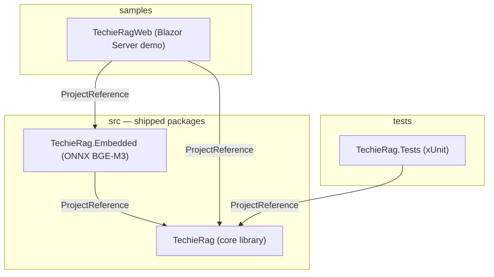
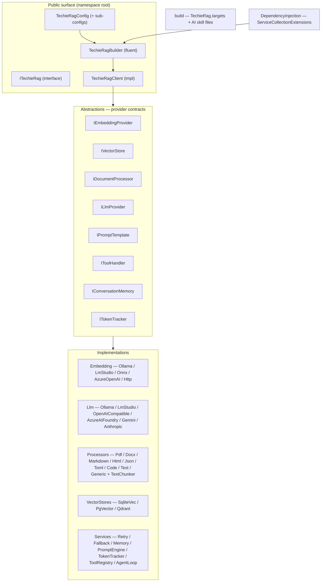
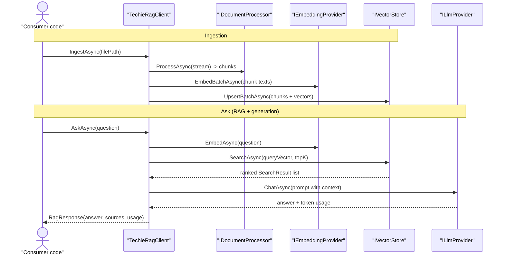
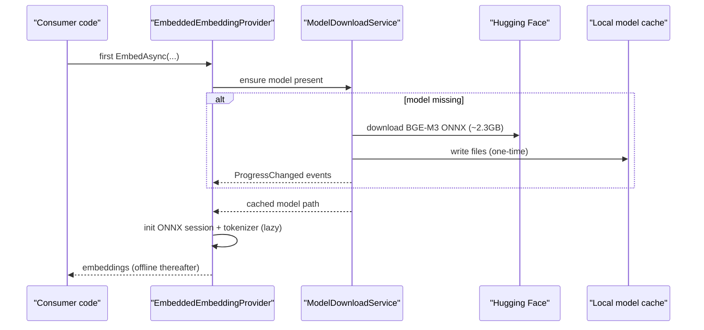
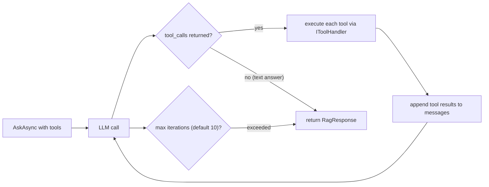
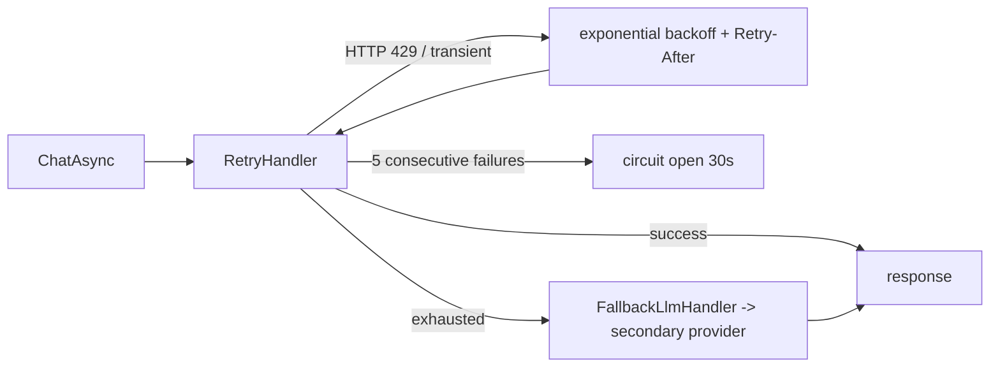
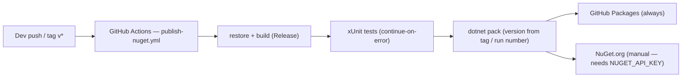
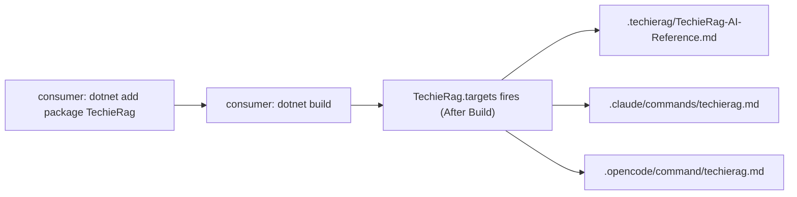

# TechieRag — Architecture

**Last updated:** 2026-06-25
**Status:** Current (brownfield)

> **Depth mandate:** this is a HUMAN document, read as rendered HTML. Module rows in §4 with non-trivial behavior get a prose paragraph beneath the table, and every significant runtime flow beyond §3's primary path (embedded-model load, agent/tool loop, resilience, NuGet autodistribution) gets its own diagram.

> **Mermaid mandate.** Every diagram quotes all node/edge/subgraph labels and never uses `end` as a node id (see `.tfcore/templates/v4custom/html-render-shell.md §5.5`).

## Table of Contents

1. [Tech stack](#tech-stack)
2. [Component map](#component-map)
3. [Data flow — primary path](#data-flow-primary-path)
4. [Module responsibilities](#module-responsibilities)
5. [Cross-cutting concerns](#cross-cutting-concerns)
6. [Deployment architecture](#deployment-architecture)
7. [Architectural decisions (ADR-style log)](#architectural-decisions-adr-style-log)
8. [Target architecture](#target-architecture)
9. [Open questions / risks](#open-questions-risks)
10. [Sources harvested](#sources-harvested)

## 1. Tech stack

TechieRag is a **configurable RAG (Retrieval-Augmented Generation) library for .NET**, shipped as two NuGet packages (`TechieRag`, `TechieRag.Embedded`) plus a Blazor Server sample (`TechieRagWeb`) and an xUnit test project. It is a class-library SDK, not a hosted application — consumers reference it and wire it into their own apps via a fluent builder or DI.

| Layer | Choice | Version | Notes |
|-------|--------|---------|-------|
| Runtime | .NET | net10.0 | All projects target `net10.0`; nullable + implicit usings enabled |
| Package type | NuGet class library | 1.0.0 | `TechieRag` + `TechieRag.Embedded`; semantic versioning, version overridden at CI pack time |
| Document parsing | PdfPig, DocumentFormat.OpenXml, HtmlAgilityPack, Markdig, Tomlyn | 0.1.13 / 3.4.1 / 1.12.4 / 0.45.0 / 0.20.0 | One library per format processor |
| Vector stores | Microsoft.Data.Sqlite + sqlite-vec, Npgsql + Pgvector, Qdrant.Client | 10.0.3 / 10.0.1 + 0.3.2 / 1.16.1 | Pluggable; SQLite-vec is the zero-config default |
| Data access | Dapper | 2.1.66 | Used by the SQL-based vector stores |
| Cloud embedding | Azure.AI.OpenAI | 2.1.0 | Azure OpenAI embedding provider |
| Embedded embedding | Microsoft.ML.OnnxRuntime (+ Managed), Microsoft.ML.Tokenizers | 1.24.1 / 2.0.0 | `TechieRag.Embedded` only — BGE-M3 ONNX inference |
| DI / config | Microsoft.Extensions.{DependencyInjection,Configuration,Logging,Options}.Abstractions | 10.0.3 | Abstractions only — no framework lock-in |
| Sample UI | Blazor Server + TrBlazeUI.Components + TrBlazeUI.Icons.Lucide | 1.0.3 | `samples/TechieRagWeb` only (from GitHub Packages) |
| Test | xUnit | — | `tests/TechieRag.Tests` |

**LLM providers** are implemented with raw `HttpClient` + `System.Text.Json` (no heavy vendor SDKs) so the core package stays dependency-light: Ollama, LM Studio, OpenAI-compatible, Azure AI Foundry, Google Gemini, Anthropic Claude.

## 2. Component map

**Inside `src/TechieRag` — module folders:**

## 3. Data flow — primary path

The core flow is **ingest → embed → store**, then **query → embed → search → (optionally) generate**.

For `SearchAsync` (retrieval only, v1 behaviour) the LLM leg is skipped and the ranked `SearchResult` list is returned directly. `AskStreamAsync` / `ChatWithRagStreamAsync` replace the single `ChatAsync` call with `ChatStreamAsync`, yielding tokens through an `IAsyncEnumerable<string>`.

## 4. Module responsibilities

| Module | Key types | Responsibility | Depends on |
|--------|-----------|----------------|------------|
| (root) | `ITechieRag`, `TechieRagClient`, `TechieRagBuilder`, `TechieRagConfig` | Public SDK surface — orchestration + fluent configuration | Abstractions |
| `Abstractions` | `IEmbeddingProvider`, `IVectorStore`, `IDocumentProcessor`, `ILlmProvider`, `IPromptTemplate`, `IToolHandler`, `IConversationMemory`, `ITokenTracker` | Provider contracts that make every backend pluggable | (none) |
| `Embedding` | `OllamaEmbeddingProvider`, `LmStudioEmbeddingProvider`, `OnnxEmbeddingProvider`, `AzureOpenAIEmbeddingProvider`, `HttpEmbeddingProvider` | Turn text into vectors across local + cloud services | Abstractions |
| `Llm` | `OllamaLlmProvider`, `LmStudioLlmProvider`, `OpenAICompatibleLlmProvider`, `AzureAIFoundryLlmProvider`, `GoogleGeminiLlmProvider`, `AnthropicLlmProvider` | Chat / completion / streaming / tool-calling across 6 LLM backends | Abstractions, Models |
| `Processors` | `Pdf/Docx/Text/Markdown/Html/Json/Toml/Code/GenericTextProcessor`, `TextChunker` | Extract text from 9 formats and split into overlapping chunks | format libraries |
| `VectorStores` | `SqliteVecStore`, `PgVectorStore`, `QdrantStore` | Persist + similarity-search embeddings | Dapper, Npgsql, Qdrant.Client |
| `Services` | `RetryHandler`, `FallbackLlmHandler`, `InMemoryConversationMemory`, `PromptTemplateEngine`, `TokenUsageTracker`, `ToolRegistry`, `AgentLoopRunner` | Resilience, prompt building, token accounting, multi-turn memory, agent loop | Abstractions, Models |
| `Models` | `TextChunk`, `SearchResult`, `Document`, `RagResponse`, `LlmResponse`, `ChatMessage`, `ToolDefinition/Call/Result`, `TokenUsage`, `IngestionStats` | Immutable DTOs across the pipeline | (none) |
| `Telemetry` | `EmbeddingCompletedEventArgs`, `LlmCompletionEventArgs` | Event payloads carrying model, duration, token counts | Models |
| `DependencyInjection` | `ServiceCollectionExtensions` | `AddTechieRag(...)` registration (builder + `IConfiguration` overloads) | builder |
| `build` | `TechieRag.targets`, AI skill markdown | Post-build autodistribution of AI-agent skill files into consumer repos | MSBuild |

**Provider abstractions (`Abstractions`).** Every backend choice — embedding source, vector store, document format, LLM, prompt template, tool handler, conversation memory, token tracker — sits behind an interface. This is the architectural keystone: `TechieRagClient` depends only on the interfaces, so switching Ollama → OpenAI or SQLite-vec → Qdrant is a configuration change, never a code change.

**`TechieRagClient` (orchestrator).** The single concrete implementation of `ITechieRag`. It selects the right `IDocumentProcessor` by file extension, drives the embed→store ingestion pipeline, and on query composes embedding + vector search + prompt building + LLM completion. v2 added the auto-RAG methods (`AskAsync`, `AskStreamAsync`, `ChatWithRagAsync`, `ChatWithRagStreamAsync`) on top of the v1 retrieval surface without breaking it.

**`Services` (cross-cutting behaviours).** `RetryHandler` and `FallbackLlmHandler` are decorators over `ILlmProvider` (exponential backoff, HTTP-429 handling, circuit breaker, primary→fallback failover). `AgentLoopRunner` drives the tool-calling loop; `ToolRegistry` lets callers register tools as delegates. `TokenUsageTracker` subscribes to provider completion events and enforces budgets. `InMemoryConversationMemory` holds per-conversation history with token-budget trimming.

### Secondary flow — embedded ONNX model load (`TechieRag.Embedded`)

`TechieRag.Embedded` adds `.UseEmbedded()` to the builder. The BGE-M3 model (1024-dim, multilingual) is **not** packed into the NuGet (size) — it is fetched once to a platform cache (`%LOCALAPPDATA%\TechieRag\Models` / `~/.local/share/TechieRag/Models`), after which the provider runs fully offline. `ModelDownloadService` is a singleton exposing a `ProgressChanged` event for download UX.

### Secondary flow — agent/tool loop

### Secondary flow — LLM resilience decorators

## 5. Cross-cutting concerns

- **Logging** — `Microsoft.Extensions.Logging.Abstractions` (`ILogger<T>`) injected throughout; `NullLogger` fallback when no `ILoggerFactory` is supplied via `.WithLogging(...)`. Serilog-compatible (the consumer owns the sink).
- **Configuration / options** — `TechieRagConfig` is the root, with nested `EmbeddingConfig`, `VectorStoreConfig`, `ProcessingConfig`, `LlmConfig`, `LlmFallbackConfig`, `UsageTrackingConfig`, `PromptConfig`, `ResilienceConfig`. Bindable from `appsettings.json` (`TechieRag` section) or built fluently. Four equivalent configuration paths: fluent builder, `appsettings.json`, DI extension, or a hand-built `TechieRagConfig` object.
- **Dependency injection** — `ServiceCollectionExtensions.AddTechieRag(...)` registers `ITechieRag` and conditionally registers `ILlmProvider`, `ITokenTracker`, `IConversationMemory`, `IPromptTemplate`, `IToolHandler`, `AgentLoopRunner` based on what was configured; LLM completion events are auto-wired to the token tracker.
- **Telemetry** — event-based: `IEmbeddingProvider.OnEmbeddingCompleted` and `ILlmProvider.OnCompletionCompleted` carry model name, duration, and token counts. `TokenUsageTracker` aggregates per-model usage and cost, fires `OnBudgetAlert` at a configurable threshold (default 80%), and can block on budget exceed. (OpenTelemetry counters / distributed tracing are explicitly deferred — see §9.)
- **Resilience** — retry with exponential backoff (1s→30s, ×2), HTTP-429 `Retry-After` handling, circuit breaker (open after 5 failures, 30s recovery), 120s default timeout, and optional fallback provider — all applied automatically to LLM calls via decorators.
- **Error handling** — argument null-checks at the public surface; structured exceptions with descriptive messages; resilience decorators absorb transient failures.

**Pluggable provider matrix:**

| Category | Implementations |
|----------|-----------------|
| Embedding | Ollama · LM Studio · ONNX (local) · Azure OpenAI · generic HTTP · embedded BGE-M3 · custom |
| Vector store | SQLite-vec (default) · PostgreSQL/pgvector · Qdrant |
| LLM | Ollama · LM Studio · OpenAI-compatible · Azure AI Foundry · Google Gemini · Anthropic Claude · custom |
| Document processor | PDF · DOCX · Markdown · HTML · JSON · TOML · Code · Text · Generic |
| Prompt template | `PromptTemplateEngine` (default) · custom `IPromptTemplate` |
| Conversation memory | `InMemoryConversationMemory` · custom |

## 6. Deployment architecture

TechieRag is published as NuGet packages, not deployed as a service.

- **CI** — `.github/workflows/publish-nuget.yml` on `net10.0`. Version is taken from a `v*` tag, else `1.0.0-preview.{run_number}`. Packages publish to GitHub Packages automatically; NuGet.org push is present but gated on a secret.
- **NuGet feeds** — `nuget.config` adds nuget.org plus a `TrBlazeUI` GitHub Packages source (`nuget.pkg.github.com/techierathore`) for the sample's UI dependency.
- **AI-agent autodistribution** — `src/TechieRag/build/TechieRag.targets` runs post-build in any consumer project and copies the AI skill files (`.techierag/TechieRag-AI-Reference.md`, `.claude/commands/techierag.md`, `.opencode/command/techierag.md`) into the consuming repo, so `/techierag` is available with zero manual setup.

## 7. Architectural decisions (ADR-style log)

- **ADR-001 — Current stack as-is (reverse-doc baseline).** net10.0 class libraries; the architecture documented here is the shipped state at 2026-06-25.
- **ADR-002 — Everything behind a provider interface.** Embedding, vector store, document processor, and LLM are all abstractions so backends swap by configuration, not code. This is the library's core value proposition.
- **ADR-003 — Raw HttpClient + System.Text.Json for LLM providers.** Avoids heavy vendor SDK dependencies, keeps the core package light, and gives uniform behaviour across all 6 LLM backends.
- **ADR-004 — Embedded model downloaded on first use, not packed.** The ~2.3GB BGE-M3 ONNX model is fetched from Hugging Face to a local cache instead of bloating the NuGet; offline after first run.
- **ADR-005 — Additive v2 (LLM/RAG generation).** All v2 methods are additive; `LlmSource.None` preserves identical v1 (retrieval-only) behaviour — guaranteed backward compatibility.
- **ADR-006 — MSBuild autodistribution of AI skills.** Skill files ship inside the package and self-install into consumer repos via `buildTransitive` targets.

## 8. Target architecture

No structural change is in flight — the shipped architecture above is current and stable. The only known forward-looking deltas are **additive, deferred enhancements** (not restructures), tracked in §9 and the BRD §4:

- Optional OpenTelemetry metrics (`TechieRagMetrics`) and distributed tracing (`TechieRagActivitySource`) for Prometheus/Grafana/Jaeger consumers.
- A formal automated test suite to complement the current manual/integration validation.

These bolt onto existing seams (telemetry events, the test project) without changing module boundaries.

## 9. Open questions / risks

- **Field-naming convention (resolved):** the codebase uses **bare camelCase, no prefix, no underscores** for instance fields/params/locals (~95%+ dominance — standard Microsoft style, e.g. `private readonly ILlmProvider llmProvider;`). Recorded as the project convention in Coding-Standards §"Fields, Parameters, Locals". The TechieFlow default `obj`/`a`/`v` prefixes are **not** adopted for this established library; new code follows the codebase's camelCase convention. No drift remediation required.
- **Formal automated tests:** the `tests/TechieRag.Tests` project exists but the suite is minimal — v2 was validated by manual/integration testing (21 documented scenarios, all passed). Formal unit tests are deferred (v2 Phase 7). This is the single largest gap for long-term maintainability.
- **Observability depth:** event-based telemetry exists; OpenTelemetry exporters are deferred (enterprise feature).
- **Sample build dependency:** `samples/TechieRagWeb` pulls `TrBlazeUI.*` from GitHub Packages, which needs an authenticated `nuget.config` token. A clean restore of the **sample** requires that credential; the two shipped library packages have no such dependency and restore from nuget.org alone.
- **SQLite concurrency:** documented limitation — multiple processes against one `.db` file can lock; single-instance or a server-backed store (PgVector/Qdrant) for multi-user.

## 10. Sources harvested

This architecture was reverse-documented from the codebase and the following source docs:

- `docs/techierag-v2-llm-implementation-spec.md` — v2 LLM/RAG component design and phase status
- `docs/trrag-refactoring-roadmap.md` — v1.1 phased build plan and module inventory
- `docs/TechieRag-AI-Reference.md`, `docs/TechieRag-UserGuide.md`, `docs/TechieRag.Embedded-UserGuide.md` — API surface and behaviour
- `docs/ai-agent-autodistribution-guide.md` — MSBuild skill-file distribution
- `docs/SETUP-AND-TESTING-GUIDE.md`, `docs/integration-testing-guide.md`, `docs/NUGET-PUBLISHING-GUIDE.md`, `docs/EMBEDDED-PACKAGE-GUIDE.md` — runbook, test plan, packaging
- `README.md`, `docs/brainstorming-session-results.md` — project intent
- Code scan of `src/TechieRag`, `src/TechieRag.Embedded`, `samples/TechieRagWeb`, `tests/TechieRag.Tests`

---
Last updated: 2026-06-25
