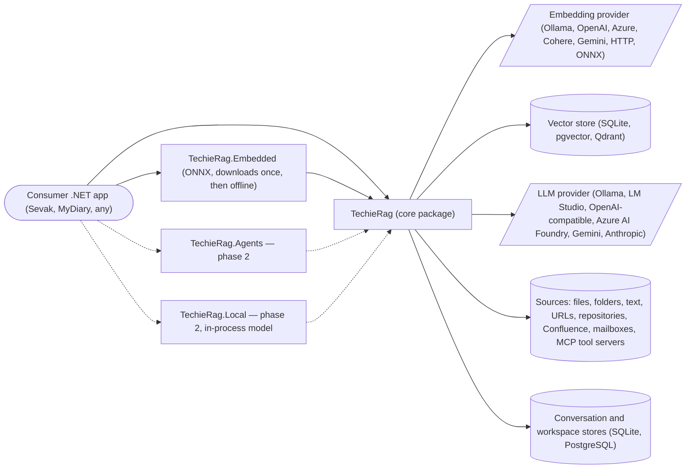

# TechieRag — Business Requirements

| | |
|---|---|
| App | TechieRag |
| Kind | library |
| Size | Large |
| Stack answer set | dotnet |
| Phase | 1 of 2 |
| Status | Approved |
| Date | 2026-09-24 |

Phase 1 of 2. This file holds what the whole library shares (scope, users, non-functional requirements, context, constraints, risks) and the phase-1 items, BRD-1 to BRD-82. Phase 2 is `docs/TechieRag-P2-BRD.md`; the plan is `docs/TechieRag-Phases.md`. Ids are append-only and were carried verbatim from the previous BRD (2026-06-25, amended to 2026-09-24; now `docs/OldDocs/TechieRag-BRD.md`). Harvested from that BRD, `DECISIONS.md`, `docs/TechieRag-CompetitorAnalysis.md`, `docs/TechieRag.Agents-Proposal.md`, `docs/TechieRag-Update-Brief.md`, the two downstream feedback files and a full code scan on 2026-09-24. A "screen" here is a public surface of the library.

## 1. Summary

TechieRag is a configurable Retrieval-Augmented Generation library for .NET, shipped as NuGet packages: `TechieRag` (core), `TechieRag.Embedded` (offline ONNX embeddings and reranking), `TechieRag.Telemetry` (opt-in exporters), with `TechieRag.Agents` and `TechieRag.Local` planned. A .NET developer adds document search, retrieval and question answering to an application with a few builder lines, and swaps embedding providers, vector stores, document formats and language-model backends by configuration, never by code. It exists to remove the RAG plumbing every .NET team rebuilds and to offer a genuinely offline option where data never leaves the machine. Its showcase is **Sevak** (TechieDesk until 2026-09-24), an application in its own repository that consumes the packages exactly as any customer does; its first mobile consumer is MyDiary. Phase 1 is shipped and validated; phase 2 adds agents, four-platform support, an in-process local model, streaming that carries tool calls and subscription sign-in.

## 2. Scope

**In:**
- The `TechieRag` core: ingestion of 13 formats, four chunking strategies, eight embedding providers, three vector stores, semantic search with reranking, six LLM providers behind one `ILlmProvider`, auto-RAG single and multi-turn with streaming and sources, structured output, the tool-calling agent loop and flow orchestration, MCP client, data connectors, web ingestion, workspaces and persistent conversation stores, token tracking, resilience, fallback, prompt templates, AI-skill autodistribution.
- `TechieRag.Embedded`: offline embeddings (bge-m3, MiniLM, bge-small) and the ONNX cross-encoder reranker, downloaded once.
- `TechieRag.Telemetry`: opt-in OpenTelemetry exporters; the core links none.
- Phase 2 (`docs/TechieRag-P2-BRD.md`): `TechieRag.Agents` on Microsoft Agent Framework; repository separation; four-platform groundwork; `TechieRag.Local`, an in-process language model; typed streaming events; subscription sign-in; and the v3 library features harvested from the application ledger.
- Packaging and publishing to GitHub Packages and nuget.org.

**Out:**
- Model fine-tuning or training; image and video generation; formal RAG-evaluation tooling.
- Hosting or provisioning model **servers** (Ollama, vLLM, LM Studio, cloud deployments). Running a model **in-process** inside the consumer's app is in scope (phase 2).
- The Sevak product itself: its screens, services, packaging and verification live in the Sevak repository. Cross-repository references carry the repository name: `Sevak#REQ-FN-054`, `TechieRag#REQ-RAG-054`.
- Enforcing a vendor's terms of use on subscription sign-in: the library records each vendor's terms as dated facts; the consuming app decides what to show.
- Any user interface, identity, roles, licences or billing.

## 3. Users and roles

| Role | Who they are | What they need |
|---|---|---|
| Developer | A .NET application developer integrating the library | One NuGet reference, a few builder lines or an appsettings section, then ingest, search and ask; provider switching by configuration |
| Agent builder | A developer building tool-using agents or flows over documents | `ToolRegistry`, the agent loop, MCP tool servers, flow orchestration, and (phase 2) Microsoft Agent Framework agents |
| App developer | The maintainers of Sevak and MyDiary | Packages that work inside a MAUI app on Windows, macOS, Android and iOS, offline after one download, with subscription sign-in where a vendor permits it |
| Privacy-first team | Teams that must keep data on the device | Embedded embeddings and (phase 2) an in-process model; no cloud path required |
| Maintainer | The owner of this repository | Two feeds, tag-derived versions, one publish path, a green test suite, a library that never pins a sink or a UI |
| AI-tool user | A developer using Claude Code or OpenCode in a consuming repository | The `/techierag` skill files installed by the package on build |
| End user | A person using Sevak or MyDiary | Reached only through those applications; their screens are ledgered there |

## 4. Screens and flow

A library has no routed pages. Each row is a public surface a developer reaches for; the Route column names its entry point. No mockups exist for a library.

| Screen | Route | Role | Mockup | Fields |
|---|---|---|---|---|
| Ingestion | `ITechieRag.IngestAsync` / `IngestDirectoryAsync` / `IngestTextAsync` | Developer | — (library, no mockup) | filePath, searchPattern, text, documentName, metadata |
| Embedding providers | `TechieRagBuilder.UseOllama` … `UseCustomEmbeddingProvider` | Developer | — (library, no mockup) | Source, Endpoint, ApiKey, Model, Dimensions |
| Vector stores | `UseSqliteVec` / `UsePgVector` / `UseQdrant` | Developer | — (library, no mockup) | Type, ConnectionString, ApiKey |
| Semantic search | `ITechieRag.SearchAsync` | Developer | — (library, no mockup) | query, topK, documentFilter, SearchOptions |
| Configuration | `TechieRagBuilder`, `AddTechieRag(...)`, `TechieRagConfig` | Developer | — (library, no mockup) | Embedding, VectorStore, Processing, Llm, Resilience, UsageTracking |
| Embedded package | `TechieRag.Embedded`: `UseEmbedded()` | Developer | — (library, no mockup) | model folder, ProgressChanged |
| LLM providers | `UseOllamaLlm` … `UseAnthropicLlm`, `UseCustomLlmProvider` | Developer | — (library, no mockup) | Source, Endpoint, ApiKey, Model, Temperature, MaxTokens |
| RAG generation | `AskAsync` / `AskStreamAsync` / `ChatWithRagAsync` / `ChatWithRagStreamAsync` | Developer | — (library, no mockup) | question, topK, systemPrompt, documentFilter, history |
| Structured output | `ILlmProvider.CompleteAsync<T>` | Developer | — (library, no mockup) | prompt, T |
| Agent loop | `ToolRegistry`, `AgentLoopRunner` | Agent builder | — (library, no mockup) | ToolDefinition, IToolHandler, max iterations |
| Conversation memory | `WithConversationMemory()`, `IConversationMemory` | Developer | — (library, no mockup) | token budget, system message |
| Token tracking | `ITokenTracker`, `WithUsageTracking` | Developer | — (library, no mockup) | MaxTotalTokens, MaxCostUsd, AlertThreshold, Pricing |
| Resilience | `WithResilience`, `RetryHandler` | Developer | — (library, no mockup) | MaxRetries, backoff, circuit breaker, timeout |
| Fallback provider | `WithFallbackLlm` | Developer | — (library, no mockup) | LlmFallback |
| Prompt templates | `WithPromptTemplate`, `IPromptTemplate` | Developer | — (library, no mockup) | SystemPrompt, ContextChunkTemplate, MaxContextChunks |
| Autodistribution | `build/TechieRag.targets` | AI-tool user | — (library, no mockup) | .techierag/, .claude/commands/, .opencode/command/ |
| Packaging | `publish-github-packages.yml`, `publish-nuget.yml` | Maintainer | — (library, no mockup) | version from tag, two feeds |
| Sevak application (moved) | Sevak repository (TechieDesk until 2026-09-24) | End user | — (library, no mockup) | screens owned by Sevak |

**Primary journey:**
1. The developer adds the package, configures an embedding provider and a vector store (and optionally an LLM) through the builder or an appsettings section, and calls `Build()` then `InitializeAsync()`.
2. The developer ingests files, a folder or raw text; the library extracts, chunks, embeds and stores.
3. The developer calls `SearchAsync` for ranked chunks, or `AskAsync` / `ChatWithRagAsync` for an answer with sources and usage, streamed or not.
4. Token usage, budgets, retries and fallback work without further code; events and logs flow through the host's abstractions.

## 5. Requirements

One item per thing the verifier will test, grouped by surface. Items 62 to 73, 81 and 82 describe the application that moved to Sevak on 2026-09-24 and stay as history. Text is carried verbatim from the previous BRD; acceptance lines were written on 2026-09-24.

### Ingestion

Turns files, folders and raw text into chunks with metadata, for the developer integrating the library.

- **BRD-1** — A developer can ingest a single file via `IngestAsync(filePath)` with auto processor selection by extension *(F-ING)* *Screen:* Ingestion
  - *Acceptance:* When a developer calls `IngestAsync` with a PDF path on the ingestion API, then the file is processed by the PDF processor and a document id returns.
- **BRD-2** — A developer can batch-ingest a directory with a glob pattern via `IngestDirectoryAsync` *(F-ING)* *Screen:* Ingestion
  - *Acceptance:* When a developer calls `IngestDirectoryAsync` with a folder and `*.md` on the ingestion API, then every matching file is ingested and its id listed.
- **BRD-3** — A developer can ingest raw text (no file) with optional metadata via `IngestTextAsync` *(F-ING)* *Screen:* Ingestion
  - *Acceptance:* When a developer calls `IngestTextAsync` with text, a name and metadata, then a document with that metadata is stored and searchable.
- **BRD-4** — The system shall extract text from PDF, DOCX, Markdown, HTML, JSON, TOML, code, plain-text, and generic formats *(F-ING)* *Screen:* Ingestion
  - *Acceptance:* When a developer ingests one file of each supported format, then text is extracted from every one and no format falls to the generic processor by mistake.
- **BRD-5** — The system shall split content into overlapping chunks with configurable size/overlap via `WithChunkSize` *(F-ING)* *Screen:* Ingestion
  - *Acceptance:* When a developer sets `WithChunkSize(500, 50)` and ingests a long text, then chunks are at most 500 characters and overlap by 50.
- **BRD-6** — A developer can attach per-document metadata for later filtering and context *(F-ING)* *Screen:* Ingestion
  - *Acceptance:* When a developer ingests a document with metadata, then every chunk's metadata carries the document-scoped keys and a filtered search honours them.
- **BRD-7** — A developer can list, delete, clear, and get statistics for ingested documents *(F-ING)* *Screen:* Ingestion
  - *Acceptance:* When a developer lists, deletes, clears and reads statistics on the ingestion API, then each call reflects the store's real state.

### Embedding providers

Turns text into vectors through any of eight providers or a custom one, chosen by configuration.

- **BRD-8** — The system shall generate single and batch embeddings behind `IEmbeddingProvider` *(F-EMB)* *Screen:* Embedding providers
  - *Acceptance:* When a developer calls `EmbedAsync` and `EmbedBatchAsync` on any provider, then vectors of the provider's dimension return for one text and for a batch.
- **BRD-9** — A developer can select a local embedding provider (Ollama, LM Studio, ONNX) *(F-EMB)* *Screen:* Embedding providers
  - *Acceptance:* When a developer configures Ollama, LM Studio or ONNX embeddings, then `Build()` creates that provider and `EmbedAsync` reaches it.
- **BRD-10** — A developer can select a cloud/generic embedding provider (Azure OpenAI, HTTP-compatible) *(F-EMB)* *Screen:* Embedding providers
  - *Acceptance:* When a developer configures Azure OpenAI or an HTTP-compatible embedding endpoint, then `Build()` creates that provider and `EmbedAsync` reaches it.
- **BRD-11** — A developer can supply a custom embedding provider via factory *(F-EMB)* *Screen:* Embedding providers
  - *Acceptance:* When a developer passes a factory to `UseCustomEmbeddingProvider`, then `Build()` uses that provider for every embedding call.

### Vector stores

Persists and searches embeddings in SQLite, PostgreSQL with pgvector or Qdrant.

- **BRD-12** — A developer can use SQLite-vec as a zero-config local vector store *(F-VEC)* *Screen:* Vector stores
  - *Acceptance:* When a developer calls `UseSqliteVec()` with no arguments, then `techierag.db` is created with the `Documents` and `Chunks` tables on initialise.
- **BRD-13** — A developer can use PostgreSQL/pgvector as a production vector store *(F-VEC)* *Screen:* Vector stores
  - *Acceptance:* When a developer calls `UsePgVector` with a connection string, then the tables and the vector extension are created on initialise.
- **BRD-14** — A developer can use Qdrant as a vector store *(F-VEC)* *Screen:* Vector stores
  - *Acceptance:* When a developer calls `UseQdrant`, then the two collections are created on initialise and searches run against `techierag_chunks`.
- **BRD-15** — The system shall provide full CRUD, batch upsert, document-filtered search, and statistics across all vector stores *(F-VEC)* *Screen:* Vector stores
  - *Acceptance:* When a developer upserts, batch-upserts, searches with a document filter, deletes and reads stats on each store, then every operation behaves the same.

### Semantic search

Returns ranked, scored chunks for a query, optionally scoped to one document.

- **BRD-16** — A developer can run a semantic similarity search via `SearchAsync(query, topK, documentFilter?)` *(F-SEARCH)* *Screen:* Semantic search
  - *Acceptance:* When a developer calls `SearchAsync` with a query and top-K on the search API, then that many results return in descending score order.
- **BRD-17** — The system shall return ranked results with a 0–1 relevance score and full chunk metadata *(F-SEARCH)* *Screen:* Semantic search
  - *Acceptance:* When a developer reads a search result, then it carries a score between 0 and 1 and the chunk's text, document id and metadata.
- **BRD-18** — A developer can scope a search to a single document/collection via a filter *(F-SEARCH)* *Screen:* Semantic search
  - *Acceptance:* When a developer passes a document filter to `SearchAsync`, then only chunks of that document return.

### Configuration

Lets a developer configure everything by builder, appsettings section, DI or a config object, and swap providers without code.

- **BRD-19** — A developer can configure TechieRag via the fluent `TechieRagBuilder` *(F-CFG)* *Screen:* Configuration
  - *Acceptance:* When a developer configures the library through `TechieRagBuilder` on the configuration API and calls `Build()`, then an `ITechieRag` with those providers returns.
- **BRD-20** — A developer can configure TechieRag from `appsettings.json` (`TechieRag` section binding) *(F-CFG)* *Screen:* Configuration
  - *Acceptance:* When a developer binds a `TechieRag` appsettings section through `AddTechieRag(IConfiguration)`, then the resulting instance uses the configured providers.
- **BRD-21** — A developer can register TechieRag in DI via `AddTechieRag(...)` (builder and `IConfiguration` overloads) *(F-CFG)* *Screen:* Configuration
  - *Acceptance:* When a developer calls `AddTechieRag(...)` on a service collection, then `ITechieRag` and `TechieRagConfig` resolve as singletons.
- **BRD-22** — A developer can configure TechieRag from a hand-built `TechieRagConfig` object *(F-CFG)* *Screen:* Configuration
  - *Acceptance:* When a developer passes a hand-built `TechieRagConfig` to `AddTechieRag`, then the instance uses its embedding, store and chunk settings.
- **BRD-23** — A developer can switch any provider with no code change, only configuration *(F-CFG)* *Screen:* Configuration
  - *Acceptance:* When a developer changes only the configured provider and rebuilds, then the new provider is used with no code change.

### Embedded package

Gives a fully offline embedding path with a model downloaded once.

- **BRD-24** — A developer can enable embedding that downloads once, then works offline, via `.UseEmbedded()` (BGE-M3 ONNX) *(F-EMBEDDED)* *Screen:* Embedded package
  - *Acceptance:* When a developer calls `UseEmbedded()` on the Embedded package and embeds text, then a 1024-dimension vector returns with no network after the first run.
- **BRD-25** — The system shall download the embedded model once to a platform cache and run offline thereafter *(F-EMBEDDED)* *Screen:* Embedded package
  - *Acceptance:* When the model is absent on first `InitializeAsync`, then it downloads once to the model folder and a second run makes no network call.
- **BRD-26** — A developer can monitor model-download progress via `ModelDownloadService.ProgressChanged` *(F-EMBEDDED)* *Screen:* Embedded package
  - *Acceptance:* When a developer subscribes to `ModelDownloadService.ProgressChanged` during a download, then progress events with bytes and percentage arrive.

### LLM providers

One `ILlmProvider` contract over six hosted or local model servers, plus custom providers.

- **BRD-27** — The system shall provide a unified `ILlmProvider` for completion, chat, streaming, and tool calling *(F-LLM)* *Screen:* LLM providers
  - *Acceptance:* When a developer calls complete, chat, stream and tool-calling members on any `ILlmProvider`, then each behaves per the contract and capability flags.
- **BRD-28** — A developer can use Ollama or LM Studio as a local LLM provider *(F-LLM)* *Screen:* LLM providers
  - *Acceptance:* When a developer calls `UseOllamaLlm` or `UseLmStudioLlm`, then `Build()` creates that provider and a completion reaches the local server.
- **BRD-29** — A developer can use an OpenAI-compatible LLM provider (OpenAI, vLLM, Groq, Together, LocalAI) *(F-LLM)* *Screen:* LLM providers
  - *Acceptance:* When a developer calls `UseOpenAICompatibleLlm` with an endpoint and key, then a completion reaches that endpoint in the OpenAI wire shape.
- **BRD-30** — A developer can use Azure AI Foundry as an LLM provider *(F-LLM)* *Screen:* LLM providers
  - *Acceptance:* When a developer calls `UseAzureAIFoundryLlm` with a deployment, then a completion reaches the deployment with the API version.
- **BRD-31** — A developer can use Google Gemini as an LLM provider *(F-LLM)* *Screen:* LLM providers
  - *Acceptance:* When a developer calls `UseGeminiLlm` with a key, then a completion reaches the Gemini API.
- **BRD-32** — A developer can use Anthropic Claude as an LLM provider *(F-LLM)* *Screen:* LLM providers
  - *Acceptance:* When a developer calls `UseAnthropicLlm` with a key, then a completion reaches the Anthropic API.
- **BRD-33** — A developer can supply a custom LLM provider via factory, and read provider capability flags *(F-LLM)* *Screen:* LLM providers
  - *Acceptance:* When a developer passes a factory to `UseCustomLlmProvider`, then `Build()` uses it and its capability flags are readable.

### RAG generation

Answers questions from retrieved context, single-turn or multi-turn, streamed or not.

- **BRD-34** — A developer can ask a single-turn RAG question via `AskAsync` returning answer + sources + usage *(F-RAG)* *Screen:* RAG generation
  - *Acceptance:* When a developer calls `AskAsync` with a question, then the answer, its sources with scores and token usage return.
- **BRD-35** — A developer can stream a RAG answer token-by-token via `AskStreamAsync` *(F-RAG)* *Screen:* RAG generation
  - *Acceptance:* When a developer iterates `AskStreamAsync`, then answer text arrives in pieces before the whole reply exists.
- **BRD-36** — A developer can run multi-turn RAG chat via `ChatWithRagAsync` with conversation history *(F-RAG)* *Screen:* RAG generation
  - *Acceptance:* When a developer calls `ChatWithRagAsync` with history, then the answer uses both retrieved context and the earlier turns.
- **BRD-37** — A developer can stream multi-turn RAG chat via `ChatWithRagStreamAsync` *(F-RAG)* *Screen:* RAG generation
  - *Acceptance:* When a developer iterates `ChatWithRagStreamAsync`, then the multi-turn answer streams in pieces.
- **BRD-38** — The system shall behave identically to v1 (retrieval only) when no LLM is configured *(F-RAG)* *Screen:* RAG generation
  - *Acceptance:* When no LLM is configured and a developer searches and ingests, then behaviour equals v1 and `GetLlmProvider()` is null.

### Structured output

Returns typed objects from a model by asking for JSON.

- **BRD-39** — A developer can request typed JSON output deserialized to `T` via `CompleteAsync<T>` *(F-STRUCT)* *Screen:* Structured output
  - *Acceptance:* When a developer calls `CompleteAsync<T>` with a prompt, then the model's JSON deserialises into `T`.

### Agent loop

Lets a model call registered tools and iterate to an answer under an iteration cap.

- **BRD-40** — A developer can declare tools via `ToolDefinition` (name, description, JSON-schema parameters) *(F-AGENT)* *Screen:* Agent loop
  - *Acceptance:* When a developer declares a `ToolDefinition` with a JSON schema, then the agent loop offers it to the model by that name.
- **BRD-41** — A developer can register tools as delegates via `ToolRegistry` or implement `IToolHandler` *(F-AGENT)* *Screen:* Agent loop
  - *Acceptance:* When a developer registers a delegate on `ToolRegistry` or an `IToolHandler`, then the loop executes it when the model calls it.
- **BRD-42** — The system shall run an agent loop that executes tools and iterates until a final answer *(F-AGENT)* *Screen:* Agent loop
  - *Acceptance:* When a developer runs the agent loop on a tool-using prompt, then tools execute and a final answer returns.
- **BRD-43** — The system shall cap agent-loop iterations (default 10) to prevent infinite loops *(F-AGENT)* *Screen:* Agent loop
  - *Acceptance:* When a model keeps calling tools past the iteration cap, then the loop stops at the cap with a clear result.

### Conversation memory

Keeps multi-turn history within a token budget.

- **BRD-44** — A developer can enable in-memory conversation history via `.WithConversationMemory()` *(F-MEM)* *Screen:* Conversation memory
  - *Acceptance:* When a developer enables `WithConversationMemory()` and chats twice, then the second turn sees the first.
- **BRD-45** — The system shall trim history to a token budget, keeping the system message and recent turns *(F-MEM)* *Screen:* Conversation memory
  - *Acceptance:* When history exceeds the token budget, then the system message and the most recent turns are kept and older turns dropped.
- **BRD-46** — A developer can supply a custom `IConversationMemory` implementation *(F-MEM)* *Screen:* Conversation memory
  - *Acceptance:* When a developer supplies a custom `IConversationMemory`, then the client reads and writes history through it.

### Token tracking

Counts tokens and cost per operation and enforces budgets.

- **BRD-47** — The system shall track token usage and estimated cost per operation and per session via `ITokenTracker` *(F-TOKEN)* *Screen:* Token tracking
  - *Acceptance:* When a developer completes a prompt with tracking on, then `ITokenTracker` records tokens and estimated cost for the operation and the session.
- **BRD-48** — The system shall break down usage by model using a configurable pricing table *(F-TOKEN)* *Screen:* Token tracking
  - *Acceptance:* When a developer sets a pricing entry with `WithModelPricing`, then cost for that model uses it in the per-model breakdown.
- **BRD-49** — A developer can set budget ceilings (max tokens, max USD) and an alert threshold *(F-TOKEN)* *Screen:* Token tracking
  - *Acceptance:* When a developer sets `MaxTotalTokens`, `MaxCostUsd` and `AlertThreshold`, then usage is checked against them on every operation.
- **BRD-50** — The system shall fire budget-alert and usage-recorded events, and optionally block on exceed *(F-TOKEN)* *Screen:* Token tracking
  - *Acceptance:* When usage passes the alert threshold, then `OnBudgetAlert` fires; with `BlockOnExceeded` set, the next call is refused.

### Resilience

Absorbs transient model-server failures with retry, rate-limit handling and a circuit breaker.

- **BRD-51** — The system shall retry transient LLM failures with exponential backoff and timeout *(F-RESIL)* *Screen:* Resilience
  - *Acceptance:* When a provider call fails transiently, then it is retried with exponential backoff up to `MaxRetries` within the timeout.
- **BRD-52** — The system shall detect HTTP 429 and honor `Retry-After` *(F-RESIL)* *Screen:* Resilience
  - *Acceptance:* When a provider returns HTTP 429 with `Retry-After`, then the retry waits that long, capped by `MaxRetryDelayMs`.
- **BRD-53** — The system shall apply a circuit breaker (open after N failures, recovery window) *(F-RESIL)* *Screen:* Resilience
  - *Acceptance:* When five consecutive failures occur, then the circuit opens and calls fail fast until the recovery window passes.

### Fallback provider

Fails over to a second model provider when the primary fails.

- **BRD-54** — A developer can configure a fallback LLM that takes over automatically when the primary fails *(F-FALLBACK)* *Screen:* Fallback provider
  - *Acceptance:* When the primary provider fails after retries, then the fallback provider answers the same request.

### Prompt templates

Lets a developer shape or replace the RAG prompt.

- **BRD-55** — A developer can customize the RAG prompt (system prompt, context template, context limits) *(F-PROMPT)* *Screen:* Prompt templates
  - *Acceptance:* When a developer sets a system prompt and context template with `WithPromptTemplate`, then the RAG prompt uses them.
- **BRD-56** — A developer can replace the prompt template entirely via a custom `IPromptTemplate` *(F-PROMPT)* *Screen:* Prompt templates
  - *Acceptance:* When a developer supplies a custom `IPromptTemplate`, then the client builds every RAG prompt through it.

### Autodistribution

Installs the AI skill files into a consuming repository on build.

- **BRD-57** — The system shall auto-deploy AI skill files into a consumer repo on build via MSBuild targets *(F-AUTODIST)* *Screen:* Autodistribution
  - *Acceptance:* When a consumer builds a project referencing `TechieRag` on their machine, then `.techierag/TechieRag-AI-Reference.md` and the two command files appear in the repository root.
- **BRD-58** — The system shall refresh the deployed skill files on each package update without manual steps *(F-AUTODIST)* *Screen:* Autodistribution
  - *Acceptance:* When a consumer updates the package and rebuilds, then the deployed skill files are refreshed without a manual step.

### Packaging

Builds, versions and publishes the packages to two feeds.

- **BRD-59** — The system shall build and pack `TechieRag`, `TechieRag.Embedded` and `TechieRag.Agents` via GitHub Actions *(F-PKG; amended 2026-09-03: was two packages)* *Screen:* Packaging
  - *Acceptance:* When a maintainer pushes to `main` or dispatches the release workflow on GitHub Actions, then the packages are built, tested and packed by GitHub Actions.
- **BRD-60** — The system shall publish to GitHub Packages automatically (push to `main`, release tags) and to NuGet.org by manual dispatch against a release tag using trusted publishing *(F-PKG; amended 2026-09-03 to the shipped process per DECISIONS.md — was "when a secret is present")* *Screen:* Packaging
  - *Acceptance:* When a maintainer dispatches `publish-nuget.yml` against a release tag, then the packages reach nuget.org through Trusted Publishing; pushes reach GitHub Packages automatically.
- **BRD-61** — The system shall version packages semantically, overridden at pack time from tag/run number *(F-PKG)* *Screen:* Packaging
  - *Acceptance:* When a maintainer tags `v1.2.3` and releases, then the packed version is `1.2.3`, derived from the tag.

### Sevak application (moved)

The application that shows the full capabilities of TechieRag; it moved to its own repository on 2026-09-24 and these items stay as history.

- **BRD-62** — A user can configure the embedding source and vector store on the Settings page *(F-WEB)* *Screen:* Sevak application (moved)
  - *Acceptance:* When a user opens the Settings page on Sevak, then the embedding source and vector store can be configured and saved.
- **BRD-63** — A user can configure LLM provider, fallback, usage, resilience, and prompts on the LLM Settings page *(F-WEB)* *Screen:* Sevak application (moved)
  - *Acceptance:* When a user opens the LLM Settings page on Sevak, then provider, fallback, usage, resilience and prompts can be configured.
- **BRD-64** — A user can upload and manage documents on the Ingestion page and ingest raw text on the Text Ingestion page *(F-WEB)* *Screen:* Sevak application (moved)
  - *Acceptance:* When a user uploads a file or pastes text on Sevak, then the document is ingested and listed.
- **BRD-65** — A user can run RAG chat with streaming, source display, top-K, and document filter on the Chat page *(F-WEB)* *Screen:* Sevak application (moved)
  - *Acceptance:* When a user asks a question on the Chat page on Sevak, then the answer streams with sources, top-K and a document filter.
- **BRD-66** — A user can test direct LLM completion, structured output, and chat on the LLM Playground page *(F-WEB)* *Screen:* Sevak application (moved)
  - *Acceptance:* When a user runs completion, structured output and chat on the LLM Playground page on Sevak, then each returns a result.
- **BRD-67** — A user can exercise the agent loop with built-in and custom tools on the Tool Demo page *(F-WEB)* *Screen:* Sevak application (moved)
  - *Acceptance:* When a user runs a tool-using prompt on the Tool Demo page on Sevak, then tool calls and results show in the trace.
- **BRD-68** — A user can view token usage, budget status, and per-model breakdown on the Token Usage page *(F-WEB)* *Screen:* Sevak application (moved)
  - *Acceptance:* When a user opens the Token Usage page on Sevak, then usage, budget status and the per-model breakdown show.
- **BRD-69** — A user can test the LLM connection before running queries *(F-WEB)* *Screen:* Sevak application (moved)
  - *Acceptance:* When a user presses Test connection on Sevak, then a reachable provider reports success and an unreachable one a clear error.
- **BRD-70** — The app shall render all pages with TrBlazeUI components and Lucide icons *(F-WEB)* *Screen:* Sevak application (moved)
  - *Acceptance:* When a user opens any page on Sevak, then it renders with TrBlazeUI components and Lucide icons.
- **BRD-71** — A user can detect Docker status and create/start/stop/remove a Qdrant container from the admin page *(F-QDRANT)* *Screen:* Sevak application (moved)
  - *Acceptance:* When a user opens the Qdrant Admin page on Sevak, then Docker status shows and the container can be created, started, stopped and removed.
- **BRD-72** — A user can create, list, inspect, and delete Qdrant collections *(F-QDRANT)* *Screen:* Sevak application (moved)
  - *Acceptance:* When a user manages collections on the Qdrant Admin page on Sevak, then create, list, inspect and delete reflect the server.
- **BRD-73** — A user can browse, search, view detail of, and bulk-delete vectors in a collection *(F-QDRANT)* *Screen:* Sevak application (moved)
  - *Acceptance:* When a user browses vectors on the Qdrant Admin page on Sevak, then search, detail and bulk delete work against the collection.
- **BRD-81** — TechieDesk product mandate: the companion app shall be a productized, self-hostable AnythingLLM-alternative application powered by the TechieRag library; the competitive roadmap is the GAP-LIB-*/GAP-APP-* register in `docs/TechieRag-CompetitorAnalysis.md`, with phase-wise BRD-Ns appended (append-only) as each phase is scheduled *(F-WEB; added 2026-07-17)* — **amended 2026-09-03:** TechieDesk is a separate product in its own repository (BRD-87) that consumes `TechieRag`, `TechieRag.Embedded` and `TechieRag.Agents` as NuGet packages and is the live implementation of their capabilities; its roadmap and requirements live in the TechieDesk BRD, and no product BRD-Ns are appended here — **amended 2026-09-24:** the product is **Sevak**, *the application showing the full capabilities of TechieRag*: every library capability is expected to have a visible home in Sevak (a library requirement that needs UI proof gets a matching Sevak requirement referenced by repository and id); Sevak is **freemium with limited, never gated, features** (limits set in a later Sevak revision); it is the first desktop consumer of `TechieRag.Local` (F-LOCAL-LLM), MyDiary the first mobile one *Screen:* Sevak application (moved)
  - *Acceptance:* When a reader opens the product statement on Sevak, then Sevak is the application showing the full capabilities of TechieRag, freemium, limited not gated.
- **BRD-82** — The application shall be renamed `TechieRagWeb` → `TechieDesk`: project folder `samples/TechieRagWeb` → `apps/TechieDesk`, csproj / RootNamespace / AssemblyName, `TechieRag.slnx` entry, namespaces and `@using`s, in-app branding (page titles, Home page), config/log file naming, and Playwright/verify references *(F-WEB; added 2026-07-17)* *Screen:* Sevak application (moved)
  - *Acceptance:* When a reader checks the application name on Sevak, then the rename from `TechieRagWeb` to TechieDesk (2026-07-17) and to Sevak (2026-09-24) is recorded.

## 6. Non-functional requirements

| Id | Area | Requirement | Measure |
|---|---|---|---|
| BRD-74 | Performance | token estimation is immediate (~chars/4); streaming yields tokens in real time with no buffering; batch embedding is supported for throughput. | token estimate immediate; streaming unbuffered; batch embedding accepted (no owner perf-budget stated) |
| BRD-75 | Reliability | transient LLM failures are absorbed by retry + circuit breaker; an optional fallback provider preserves service continuity. | retry 3× backoff, breaker after 5 failures / 30 s recovery, fallback provider |
| BRD-76 | Scalability | budgets scale from 0 (unlimited) to `long.MaxValue`; usage tracking supports arbitrary model counts; conversation history grows unbounded with automatic windowing. | budgets 0…long.MaxValue; any model count; history windowed |
| BRD-77 | Security | API keys are configuration strings (consumer should use a secrets manager); all endpoints support HTTPS; tool execution validates tool names against registered definitions; all public inputs are null-checked; budget blocking prevents runaway spend. | keys never persisted by the library; HTTPS; tool names validated; inputs null-checked; budget blocking |
| BRD-78 | Observability / Logging | every provider fires a completion event with model, duration, and token counts; full `ILoggerFactory` integration with `NullLogger` fallback. | `OnCompletionCompleted` with model, duration, tokens; `ILoggerFactory` with `NullLogger` fallback (Stack Q5: abstractions only, no Serilog in a package) |
| BRD-79 | Portability | 9 document formats, 100+ languages via BGE-M3, a uniform `ILlmProvider` API across all 6 backends, and both builder and config-file paths. | 13 formats today (9 at v2); 100+ languages via bge-m3; one `ILlmProvider` across 6 backends |
| BRD-80 | Compatibility | all v2 additions are backward-compatible; v1 methods and configuration remain valid and unchanged; `TechieRag.Embedded` is unchanged from v1. | v1 API and configuration unchanged; `LlmSource.None` keeps v1 behaviour |

No `perf-budget:` line is written: the owner has stated no numeric budget. The logging requirement records the Stack answer set's Serilog default as overridden for a package: the library takes an `ILoggerFactory` and pins no sink.

## 7. Development status

Written by the status gate after every build, verify and handoff; not by hand.

**Snapshot as of 2026-09-25.** Live per-requirement status: `PROJECT-STATUS.md` and the Requirements Status table in `docs/TechieRag-Checklist.md`.

| Screen | Requirements | Verified | Open | Status |
|---|---|---|---|---|
| Surface: Configuration | 1 | 1 | 0 | Done |
| Surface: Autodistribution | 1 | 1 | 0 | Done |
| Surface: Packaging | 1 | 1 | 0 | Done |
| Non-functional | 7 | 7 | 0 | Done |
| Surface: Ingestion | 1 | 1 | 0 | Done |
| Surface: Embedding providers | 1 | 1 | 0 | Done |
| Surface: Vector stores | 1 | 1 | 0 | Done |
| Surface: Semantic search | 1 | 1 | 0 | Done |
| Surface: Embedded package | 1 | 1 | 0 | Done |
| Surface: LLM providers | 1 | 1 | 0 | Done |
| Surface: RAG generation | 1 | 1 | 0 | Done |
| Surface: Structured output | 1 | 1 | 0 | Done |
| Surface: Agent loop | 1 | 1 | 0 | Done |
| Surface: Conversation memory | 1 | 1 | 0 | Done |
| Surface: Token tracking | 1 | 1 | 0 | Done |
| Surface: Resilience | 1 | 1 | 0 | Done |
| Surface: Fallback provider | 1 | 1 | 0 | Done |
| Surface: Prompt templates | 1 | 1 | 0 | Done |
| Surface: Sevak application (moved) | 0 | 0 | 0 | Not applicable |

## 8. Context diagram

## 9. Constraints and assumptions

- Target runtimes are `net10.0` and `net8.0` for `TechieRag` and `TechieRag.Telemetry`; `TechieRag.Embedded` is `net10.0` only because ONNX Runtime requires it.
- Local providers (Ollama, LM Studio) and external stores (PostgreSQL, Qdrant) must be reachable when selected; cloud providers need the consumer's own API keys; the library never persists a key.
- The embedded model needs a one-time download (about 2.3 GB for bge-m3) and disk and CPU for ONNX inference; phase 2 moves the folder to the per-user application data root and gives phones a small default.
- Model-facing text (tool descriptions, agent instructions) is invariant English by policy; user-facing messages the library produces are codes with arguments for the host to localise.
- The codebase uses bare camelCase fields, file-scoped namespaces, nullable and implicit usings; recorded in `docs/TechieRag-Coding-Standards.md`.
- Agents never run git; the owner commits. Real-device runs (Mac, Android phone, iPhone) are the owner's.
- `TechieRag.Local` depends on a native inference runtime chosen per platform after a measured comparison recorded in `DECISIONS.md`; costly to reverse.
- Subscription sign-in depends on each vendor's policy, recorded with the date checked; the library never asserts a permission it has not verified.

### Platform support matrix (BRD-88, REQ-FN-054)

Each cell reads **supported** (built for it, no recorded run on that platform yet), **tested** (the probe app ran there: device and date), or **not supported**. A cell moves to tested only when the owner records a probe run (UsageGuide, Platform notes, the runbook). Last updated 2026-09-24.

| Package | Windows | macOS / Mac Catalyst | Android | iOS |
|---|---|---|---|---|
| `TechieRag` | tested (Windows 11 laptop, Mi NoteBook Pro, probe Windows head, 2026-09-24) | supported | supported ¹ | supported |
| `TechieRag.Embedded` | tested (Windows 11 laptop, Mi NoteBook Pro, probe Windows head, bge-m3, 2026-09-24) | supported | supported ¹ | supported |
| `TechieRag.Agents` | not supported ² | not supported ² | not supported ² | not supported ² |
| `TechieRag.Local` | supported ³ | tested (owner's Mac, Apple M4 Max 36 GB, macOS 27, probe Mac Catalyst head, Phi-3 mini, 2026-09-25) | supported ³ | supported ³ |

1. The probe ran on an Android emulator (Pixel 5 profile, Android 12, x86_64) on 2026-09-24: all-MiniLM-L6-v2 selected by default, top result correct. An emulator is not a device, so the cell stays supported until a phone run is recorded.
2. The package is being built (REQ-RAG-045); the cells change when it ships and the probe exercises it.
3. Runs on ONNX Runtime GenAI 0.16.0 on all four platforms (`DECISIONS.md` 2026-09-25); `TechieRag.Local.targets` wires the Mac Catalyst library GenAI's own package leaves out (REQ-FN-058). Windows: the engine was measured on the Windows 11 laptop on 2026-09-24, but not yet through `TechieRag.Local` in the probe. iOS: the probe's second button ran on the iPhone 17 Pro simulator (iOS 26.1) on 2026-09-25; a simulator is not a phone, so the cell waits for the owner's iPhone. Android: built, not yet run. Numbers per platform: UsageGuide, Platform notes, "Local model: measured per platform". Last synced with the UsageGuide 2026-09-25.

## 10. Risks

| Risk | Likelihood | Impact | Mitigation |
|---|---|---|---|
| Every vector store is fixed at 1024 dimensions; Cohere, OpenAI and Gemini embedders produce other sizes | High | High | BRD-158 passes the embedder's dimensions into every store |
| sqlite-vec is never loaded; every SQLite search is a managed full scan | High | Medium | BRD-93 vectorises and measures the managed path and removes the dead code |
| Two workflows can publish to nuget.org, one automatically | Medium | Medium | BRD-160 leaves one manual-dispatch path |
| `TechieRag.Telemetry` is never packed | High | Low | BRD-156 |
| Neither local runtime is proven on all four platforms from .NET | Medium | High | One provider over a per-platform runtime interface (BRD-97); measured on named devices before the decision |
| iOS or Android kills the app for memory while a model runs | Medium | Medium | Memory check before load (BRD-99); small defaults (BRD-91, BRD-96); per-device limits recorded (BRD-108) |
| A vendor changes or withdraws its subscription sign-in policy | Medium | Medium | Dated terms in the catalog (BRD-113); live-docs check before build (BRD-114) |
| Provider API drift | Medium | Medium | Raw HttpClient providers are small and isolated; update per provider |
| Structured-output JSON reliability varies by model | Medium | Low | Cloud providers most reliable; documented; grammar constraints where the local runtime allows (BRD-103) |
| SQLite multi-process locking | Low | Medium | Documented; single instance or a server-backed store for multi-user |
| Microsoft Agent Framework renames types monthly | Medium | Medium | Exact pin; MAF types exposed rather than wrapped; live-docs check before each bump |

## 11. Glossary

- RAG — Retrieval-Augmented Generation: retrieve relevant context, then generate an answer with a language model.
- Surface — What a "screen" means for this library: the builder methods, interface or package a developer reaches for.
- Sevak — The application showing the full capabilities of TechieRag; TechieDesk renamed on 2026-09-24, in its own repository.
- In-process local model — A language model executed inside the consuming app's process by `TechieRag.Local`, no server, no network after one download.
- Typed streaming event — One piece of a streamed reply: a text delta, a decided tool call, or the final usage record.
- Device-code sign-in — A browser sign-in where the library shows a URL and a code, the user signs in on the vendor's site, and the library receives a token billed to the user's subscription.
- MCP — Model Context Protocol: a standard for tool servers an agent can call.
