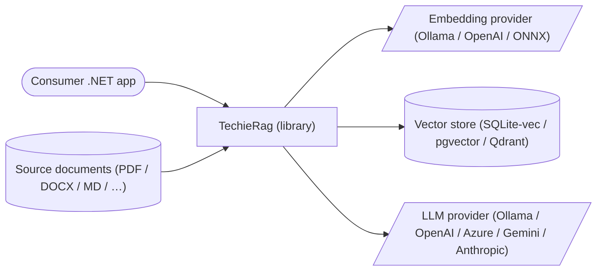
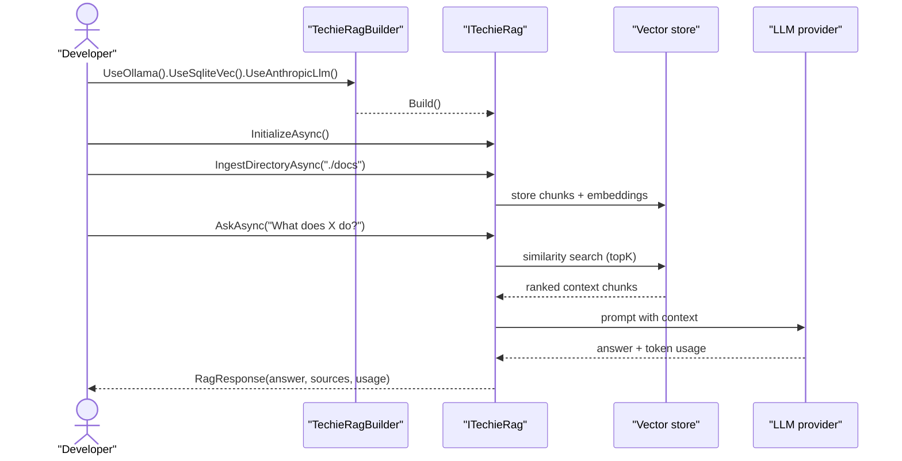
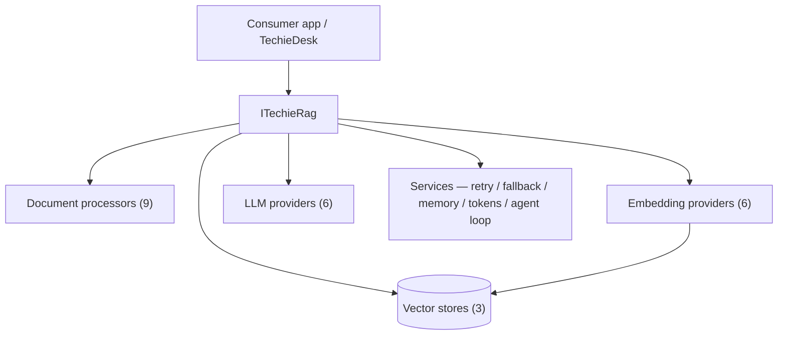
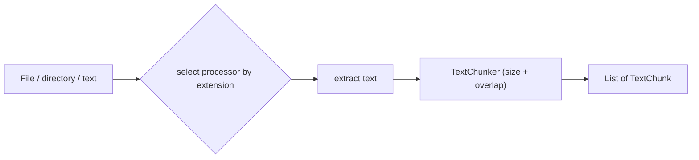
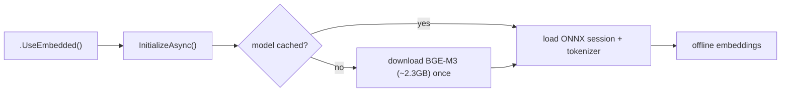
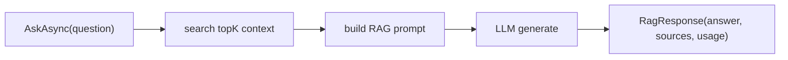
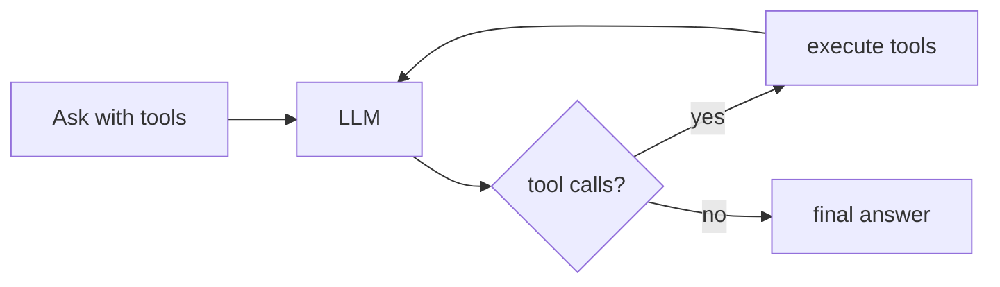
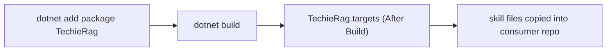

# TechieRag — Business Requirements

## Table of Contents

1. [Executive summary](#executive-summary)
2. [Business objectives](#business-objectives)
3. [Scope](#scope)
4. [Development status](#development-status)
5. [Stakeholders / users](#stakeholders-users)
6. [Context diagram](#context-diagram)
7. [User journey — primary use case](#user-journey-primary-use-case)
8. [Component sketch](#component-sketch)
9. [Feature catalog](#feature-catalog)
   - [F-ING: Document ingestion & processing](#f-ing-document-ingestion-processing)
   - [F-EMB: Embedding providers](#f-emb-embedding-providers)
   - [F-VEC: Vector stores](#f-vec-vector-stores)
   - [F-SEARCH: Semantic search & retrieval](#f-search-semantic-search-retrieval)
   - [F-CFG: Configuration & builder](#f-cfg-configuration-builder)
   - [F-EMBEDDED: Offline embedded embedding](#f-embedded-offline-embedded-embedding)
   - [F-LLM: LLM provider integration](#f-llm-llm-provider-integration)
   - [F-RAG: Auto-RAG generation](#f-rag-auto-rag-generation)
   - [F-STRUCT: Structured / typed output](#f-struct-structured-typed-output)
   - [F-AGENT: Tool calling & agent loop](#f-agent-tool-calling-agent-loop)
   - [F-MEM: Conversation memory](#f-mem-conversation-memory)
   - [F-TOKEN: Token tracking & budgets](#f-token-token-tracking-budgets)
   - [F-RESIL: Resilience & retry](#f-resil-resilience-retry)
   - [F-FALLBACK: Fallback LLM provider](#f-fallback-fallback-llm-provider)
   - [F-PROMPT: Prompt templates](#f-prompt-prompt-templates)
   - [F-AUTODIST: AI-agent autodistribution](#f-autodist-ai-agent-autodistribution)
   - [F-PKG: NuGet packaging & publishing](#f-pkg-nuget-packaging-publishing)
   - [F-WEB: TechieDesk application](#f-web-techiedesk-application)
   - [F-QDRANT: Qdrant database administration](#f-qdrant-qdrant-database-administration)
10. [Functional requirements (BRD ledger)](#functional-requirements-brd-ledger)
11. [Non-functional requirements](#non-functional-requirements)
12. [Constraints & assumptions](#constraints-assumptions)
13. [Success metrics](#success-metrics)
14. [Risks](#risks)
15. [Glossary](#glossary)

## 1. Executive summary

**TechieRag** is a configurable Retrieval-Augmented Generation (RAG) library for .NET, shipped as NuGet packages. It lets a .NET developer add document search, retrieval, and LLM-powered question-answering to an application with a few lines of fluent configuration — and switch embedding providers, vector stores, document formats, and LLM backends **by configuration, not code**. The library abstracts six embedding providers, three vector stores, nine document formats, and six LLM providers behind a single `ITechieRag` surface.

The product exists to eliminate the repetitive, tightly-coupled RAG plumbing that every .NET team rebuilds, and to offer a genuinely **offline** option (`TechieRag.Embedded`) using a bundled BGE-M3 ONNX model so data never has to leave the machine. A companion Blazor Server application — **TechieDesk** (formerly `TechieRagWeb`; renamed 2026-07-17 per BRD-82 / REQ-UI-014) — showcases every capability end-to-end and is being productized as a self-hostable AnythingLLM alternative (BRD-81), and an MSBuild "autodistribution" mechanism ships AI-agent skill files into any consuming repo so tools like Claude Code and OpenCode gain a `/techierag` assistant automatically.

As of this snapshot the library is **~96% complete**: the v1.1 core (config, vector stores, processors, embeddings, sample app, Qdrant admin) and the v2 LLM layer (6 providers, auto-RAG, agent loop, token tracking, resilience, memory, 7 new sample pages) are all shipped and validated by manual/integration testing. The remaining work is a formal automated test suite and optional OpenTelemetry exporters. **Repositioned 2026-07-17:** the companion app is now **TechieDesk**, a productized, self-hostable AnythingLLM alternative powered by the TechieRag library; the competitive roadmap lives in `docs/TechieRag-CompetitorAnalysis.md` (GAP-LIB-*/GAP-APP-* register), with phase-wise BRD-Ns appended as each phase is scheduled.

## 2. Business objectives

- Reduce the cost of adding RAG to a .NET app from "a multi-project integration effort" to "one NuGet reference + fluent config".
- Make provider choice (embedding / vector store / LLM) a configuration concern, swappable with zero code changes.
- Offer a fully offline, privacy-preserving RAG path for air-gapped / on-premises / edge scenarios.
- Support the breadth of real document formats (9) and LLM backends (6) so the library fits existing infrastructure rather than dictating it.
- Ship production concerns — logging, telemetry, token budgeting, retry/circuit-breaker, fallback — in the box.
- Guarantee backward compatibility (v1 → v2 additive) so upgrades never break consumers.

## 3. Scope

**In scope:**
- The `TechieRag` core library: ingestion, processing/chunking, embedding, vector storage, semantic search, and (v2) LLM generation, agent loop, memory, token tracking, resilience.
- The `TechieRag.Embedded` package: offline BGE-M3 ONNX embedding.
- The **TechieDesk** Blazor Server application (formerly `TechieRagWeb`) — demonstrates all library features (incl. Qdrant administration) and is being productized as a self-hostable AnythingLLM alternative (BRD-81/BRD-82; roadmap in `docs/TechieRag-CompetitorAnalysis.md`).
- NuGet packaging/publishing and AI-agent skill autodistribution.

**Out of scope (explicit, per v2 spec §1.4; revised 2026-07-17 per CompetitorAnalysis):**
- Model fine-tuning / training.
- Image / video generation.
- Formal RAG-evaluation tooling (precision/recall harnesses).
- Model hosting / inference-server provisioning (TechieRag consumes providers, it does not host them).

**Formerly out of scope — moved to the roadmap 2026-07-17** (`docs/TechieRag-CompetitorAnalysis.md`, Phases 5–6):
- Multi-agent orchestration (graphs / handoffs / guardrails — GAP-LIB-13).
- Audio: TTS/STT abstractions and audio-file transcription ingestion (GAP-LIB-10/16).

## 4. Development status

<!-- Feature-level SNAPSHOT. Live per-REQ status: PROJECT-STATUS.md + the checklist Requirements Status tables. -->

**Snapshot as of 2026-09-03.** Live, per-requirement status: see `PROJECT-STATUS.md` and the **Requirements Status** table in `docs/TechieRag-Checklist.md`. All feature work below is migrated from `docs/trrag-refactoring-roadmap.md` (v1.1, completed 2025-12-30) and `docs/techierag-v2-llm-implementation-spec.md` (v2, completed 2026-02-18).

| Feature (F-code) | Phase | Status | % | Notes |
|------------------|-------|--------|---|-------|
| F-ING: Document ingestion & processing | v1.1 | Done | 100 | 9 processors + chunker; file/dir/text ingestion |
| F-EMB: Embedding providers | v1.1 | Done | 100 | Ollama, LM Studio, ONNX, Azure OpenAI, HTTP, custom |
| F-VEC: Vector stores | v1.1 | Done | 100 | SQLite-vec, PgVector, Qdrant |
| F-SEARCH: Semantic search & retrieval | v1.1 | Done | 100 | topK, document filter, relevance scoring |
| F-CFG: Configuration & builder | v1.1 | Done | 100 | Fluent, appsettings.json, DI, config object |
| F-EMBEDDED: Offline embedded embedding | v1.1 | Done | 100 | BGE-M3 ONNX, auto-download, offline after first run |
| F-LLM: LLM provider integration | v2 | Done | 100 | 6 providers, complete/chat/stream |
| F-RAG: Auto-RAG generation | v2 | Done | 100 | Ask / AskStream / ChatWithRag (+stream) |
| F-STRUCT: Structured / typed output | v2 | Done | 100 | `CompleteAsync<T>` JSON deserialization |
| F-AGENT: Tool calling & agent loop | v2 | Done | 100 | AgentLoopRunner + ToolRegistry, max-iter guard |
| F-MEM: Conversation memory | v2 | Done | 100 | InMemory, token-budget trimming |
| F-TOKEN: Token tracking & budgets | v2 | Done | 100 | Per-model usage, cost, alerts, blocking |
| F-RESIL: Resilience & retry | v2 | Done | 100 | Backoff, 429, circuit breaker ✓; `Retry-After` now parsed (delta + HTTP-date, capped) via `LlmHttpGuard` in all 6 providers + 4 unit tests (REQ-RAG-012 Verified, 2026-07-02) |
| F-FALLBACK: Fallback LLM provider | v2 | Done | 100 | Primary→fallback failover decorator |
| F-PROMPT: Prompt templates | v2 | Done | 100 | Default engine + custom IPromptTemplate |
| F-AUTODIST: AI-agent autodistribution | v1.1 | Done | 100 | MSBuild targets deploy skill files to consumers |
| F-PKG: NuGet packaging & publishing | v1.1 | Done | 100 | ✅ 2026-09-03: REQ-FN-003 re-Verified — the public `publish-nuget.yml` (manual dispatch against the release tag, per the owner's standard ceremony) now derives the version from the selected tag with an already-published / non-increment guard (BRD-61 met on the public feed; DECISIONS.md 2026-09-03); REQ-FN-004 Verified — install docs lead with nuget.org, no auth; GitHub Packages relegated to an internal-builds section. Prior: UAT 2026-09-03 found both (nuget.org stuck at 1.0.0 while tags reached v1.0.6) |
| F-WEB: TechieDesk application (formerly TechieRagWeb) | v1.1 + v2 | Done | 100 | 10 pages; v2 added 4 AI pages + TrBlazeUI migration |
| F-WEB: TechieDesk rename (BRD-82) | v3 | Done | 100 | App renamed `TechieRagWeb` → TechieDesk: folder → `apps/TechieDesk`, csproj/RootNamespace/AssemblyName, slnx, namespaces, branding, log naming, Playwright refs. Build 0-err; boots as TechieDesk; render+visual 10/10 (REQ-UI-014 Verified, 2026-07-17) |
| F-WEB: TechieDesk product repositioning (BRD-81) | v3 | Planned | 0 | Productize as self-hostable AnythingLLM alternative; phased GAP-LIB-*/GAP-APP-* roadmap per `docs/TechieRag-CompetitorAnalysis.md` (umbrella — per-phase REQs added via `*amend-docs`) |
| F-QDRANT: Qdrant database administration | v1.1 | Done | 100 | Collection/vector CRUD live-verified 2026-07-02; container-row mobile overflow @390 fixed (inline scroll-wrapper; live `scrollWidth`==390 with a running container) — REQ-UI-011 Verified |
| (quality) Formal automated test suite | v2 Phase 7 | Partial | 40 | 11 xUnit tests (RetryHandler resilience/Retry-After + LmStudio provider tool-calling) + Playwright verify suite; broader coverage deferred |
| (quality) OpenTelemetry exporters | Deferred | Planned | 0 | Metrics/tracing for Prometheus/Grafana/Jaeger |

**Legend:** **Done** = shipped & working · **In progress** = actively being built · **Partial** = some sub-features done · **Planned** = not started.

## 5. Stakeholders / users

| Role | Needs |
|------|-------|
| .NET application developer | Add document search / RAG to an app with minimal code; fluent API; DI integration |
| Enterprise architect | A standard RAG solution across projects; offline/privacy option; production reliability |
| ML / research engineer | Quickly compare embedding models and LLM backends without standing up services |
| Privacy-conscious / air-gapped team | Fully offline RAG (embedded ONNX); data never leaves the device |
| DevOps / platform engineer | NuGet packaging, CI publishing, configuration-driven provider switching |
| AI-coding-tool user | A `/techierag` skill auto-installed into the repo for guided integration |

**Primary persona — the integrating .NET developer.** Installs the NuGet package, configures an embedding provider + vector store (and optionally an LLM) via the builder or `appsettings.json`, ingests documents, then calls `SearchAsync` (retrieval) or `AskAsync` (full RAG). The whole library is shaped around making this path short and provider-agnostic.

## 6. Context diagram

## 7. User journey — primary use case

## 8. Component sketch

## 9. Feature catalog

### F-ING: Document ingestion & processing

**Personas:** .NET developer, knowledge-base builder · **Phase:** v1.1

Extracts text from nine document formats and splits it into overlapping semantic chunks ready for embedding. Content can be ingested from a single file, a directory (with a glob pattern), or raw text (for database/API content with no file). Each document carries optional metadata for later filtering.

| API surface | Signature | Description |
|-------------|-----------|-------------|
| Ingest file | `IngestAsync(filePath)` | Auto-routes by extension to the right processor |
| Ingest directory | `IngestDirectoryAsync(path, pattern)` | Batch ingest with glob |
| Ingest text | `IngestTextAsync(text, name, metadata?)` | No file required |
| Chunking | `WithChunkSize(size, overlap)` | Default 500 / 50 chars |
| Lifecycle | `ListDocumentsAsync`, `DeleteDocumentAsync`, `GetStatsAsync`, `ClearAsync` | Manage ingested corpus |

Processors: PDF (PdfPig), DOCX (OpenXml), Markdown (Markdig), HTML (HtmlAgilityPack), JSON, TOML (Tomlyn), Code (70+ extensions), Text, Generic (binary-detection fallback).

**Requirements:** BRD-1, BRD-2, BRD-3, BRD-4, BRD-5, BRD-6, BRD-7 (see §10)

### F-EMB: Embedding providers

**Personas:** developer, ML engineer · **Phase:** v1.1

Generates vector embeddings via a single `IEmbeddingProvider` contract, with batch support for throughput. Six implementations span local and cloud; a custom factory is supported.

| Provider | Builder method | Notes |
|----------|----------------|-------|
| Ollama | `.UseOllama(endpoint?, model?)` | Default localhost:11434, bge-m3 |
| LM Studio | `.UseLmStudio(endpoint?, model?)` | Default localhost:1234 |
| ONNX (local file) | `.UseOnnx(modelPath)` | Local `.onnx` inference |
| Azure OpenAI | `.UseAzureOpenAI(endpoint, apiKey, model)` | text-embedding-3-* |
| Generic HTTP | `.UseHttp(endpoint, format, model, dimensions)` | OpenAI/Ollama/Simple formats |
| Custom | `.UseCustomEmbeddingProvider(factory)` | Any `IEmbeddingProvider` |

**Requirements:** BRD-8, BRD-9, BRD-10, BRD-11 (see §10)

### F-VEC: Vector stores

**Personas:** developer, infrastructure engineer · **Phase:** v1.1

Stores and similarity-searches embeddings behind `IVectorStore`. Three backends cover local-zero-config to distributed-production. All implement full CRUD, batch upsert, document-filtered search, and statistics.

| Store | Builder method | Best for |
|-------|----------------|----------|
| SQLite-vec | `.UseSqliteVec(dbPath?)` | Single-machine, dev, embedded apps (zero-config default) |
| PostgreSQL / pgvector | `.UsePgVector(connectionString)` | Production, multi-user, large datasets |
| Qdrant | `.UseQdrant(endpoint, apiKey?)` | High-performance / existing Qdrant infra |

**Requirements:** BRD-12, BRD-13, BRD-14, BRD-15 (see §10)

### F-SEARCH: Semantic search & retrieval

**Personas:** developer · **Phase:** v1.1

The core retrieval path: embed the query, similarity-search the vector store, return ranked `SearchResult`s with relevance scores and full chunk metadata. Optional document-level filter scopes a search; `topK` bounds results (default 5).

**Requirements:** BRD-16, BRD-17, BRD-18 (see §10)

### F-CFG: Configuration & builder

**Personas:** developer, DevOps · **Phase:** v1.1

Four equivalent ways to configure TechieRag: the fluent `TechieRagBuilder`, `appsettings.json` binding, the `AddTechieRag(...)` DI extension, or a hand-built `TechieRagConfig`. Provider selection, chunking, logging, telemetry, and (v2) all LLM/resilience/budget settings are configurable through every path.

| Path | Entry point |
|------|-------------|
| Fluent builder | `new TechieRagBuilder().Use…().With….Build()` |
| appsettings.json | `services.AddTechieRag(Configuration)` (binds `TechieRag` section) |
| DI fluent | `services.AddTechieRag(rag => rag.Use…())` |
| Config object | `new TechieRagBuilder(config).Build()` |

**Requirements:** BRD-19, BRD-20, BRD-21, BRD-22, BRD-23 (see §10)

### F-EMBEDDED: Offline embedded embedding

**Personas:** privacy-conscious / air-gapped team, edge developer · **Phase:** v1.1

The `TechieRag.Embedded` package adds `.UseEmbedded()` for a fully offline embedding path using a bundled BGE-M3 ONNX model (1024-dim, 100+ languages). On first use the model (~2.3GB) is downloaded once to a platform cache; thereafter it runs with no network. `ModelDownloadService.Instance` exposes a `ProgressChanged` event for download UX.

**Requirements:** BRD-24, BRD-25, BRD-26 (see §10)

### F-LLM: LLM provider integration

**Personas:** developer, AI engineer · **Phase:** v2

A unified `ILlmProvider` contract for text completion, chat, streaming, structured output, and tool calling across six backends, each implemented with raw `HttpClient` + `System.Text.Json`. Providers expose capability flags (`SupportsToolCalling`, `SupportsStreaming`) and fire `OnCompletionCompleted` telemetry.

| Provider | Builder method | Auth / default |
|----------|----------------|----------------|
| Ollama | `.UseOllamaLlm(endpoint?, model?)` | local, llama3.2 |
| LM Studio | `.UseLmStudioLlm(endpoint?, model?)` | local |
| OpenAI-compatible | `.UseOpenAICompatibleLlm(endpoint, apiKey, model)` | OpenAI / vLLM / Groq / Together |
| Azure AI Foundry | `.UseAzureAIFoundryLlm(endpoint, apiKey, model, apiVersion?)` | deployment routing |
| Google Gemini | `.UseGeminiLlm(apiKey, model?)` | `GOOGLE_API_KEY` |
| Anthropic Claude | `.UseAnthropicLlm(apiKey, model?)` | `ANTHROPIC_API_KEY` |
| Custom | `.UseCustomLlmProvider(factory)` | any `ILlmProvider` |

**Requirements:** BRD-27, BRD-28, BRD-29, BRD-30, BRD-31, BRD-32, BRD-33 (see §10)

### F-RAG: Auto-RAG generation

**Personas:** developer building chatbots / QA systems · **Phase:** v2

High-level methods that combine retrieval and generation in one call, returning a `RagResponse` with the answer, the source chunks, and token usage. Single-turn (`AskAsync`), streaming (`AskStreamAsync`), and multi-turn RAG chat (`ChatWithRagAsync` / `…StreamAsync`) are provided. When no LLM is configured (`LlmSource.None`) the library behaves exactly as v1 (retrieval only).

**Requirements:** BRD-34, BRD-35, BRD-36, BRD-37, BRD-38 (see §10)

### F-STRUCT: Structured / typed output

**Personas:** data-extraction developer · **Phase:** v2

`CompleteAsync<T>(prompt, options)` requests JSON from the LLM and deserializes it into a strongly-typed C# object, enabling type-safe extraction from unstructured responses.

**Requirements:** BRD-39 (see §10)

### F-AGENT: Tool calling & agent loop

**Personas:** agent builder, automation developer · **Phase:** v2

Lets the LLM request tool/function execution, receive results, and iterate until it produces a final answer. Tools are declared via `ToolDefinition` (name, description, JSON-schema parameters) and either implemented through `IToolHandler` or registered as delegates through `ToolRegistry`. `AgentLoopRunner` orchestrates the loop with a configurable max-iteration guard (default 10).

**Requirements:** BRD-40, BRD-41, BRD-42, BRD-43 (see §10)

### F-MEM: Conversation memory

**Personas:** chatbot developer · **Phase:** v2

Optional multi-turn history via `IConversationMemory`, with automatic context-window trimming to a token budget (keeps the system message + most recent turns). `InMemoryConversationMemory` is the default per-session implementation; custom implementations are supported.

**Requirements:** BRD-44, BRD-45, BRD-46 (see §10)

### F-TOKEN: Token tracking & budgets

**Personas:** cost-conscious developer, SaaS operator · **Phase:** v2

Centralized token counting and cost estimation across all LLM operations via `ITokenTracker`, with per-model breakdown, a configurable pricing table, budget ceilings (`MaxTotalTokens`, `MaxCostUsd`), an alert threshold (default 80%), optional blocking on exceed, and `OnBudgetAlert` / `OnUsageRecorded` events.

**Requirements:** BRD-47, BRD-48, BRD-49, BRD-50 (see §10)

### F-RESIL: Resilience & retry

**Personas:** production engineer · **Phase:** v2

`RetryHandler` decorates `ILlmProvider` with exponential backoff (1s→30s, ×2), HTTP-429 detection with `Retry-After` parsing, a circuit breaker (open after 5 failures, 30s recovery), and a request timeout (default 120s) — applied automatically to all LLM calls.

**Requirements:** BRD-51, BRD-52, BRD-53 (see §10)

### F-FALLBACK: Fallback LLM provider

**Personas:** reliability engineer · **Phase:** v2

`FallbackLlmHandler` adds a secondary provider that automatically takes over when the primary fails after retries, configured via `.WithFallbackLlm(...)` or the `LlmFallback` config section.

**Requirements:** BRD-54 (see §10)

### F-PROMPT: Prompt templates

**Personas:** prompt engineer, domain-app builder · **Phase:** v2

Customizable RAG prompt construction via `IPromptTemplate` — controls how context chunks are formatted and injected, the system prompt, and context limits (`MaxContextChunks`, `MaxContextTokens`). `PromptTemplateEngine` is the default; `.WithPromptTemplate(...)` and `.WithCustomPromptTemplate(...)` customize or replace it.

**Requirements:** BRD-55, BRD-56 (see §10)

### F-AUTODIST: AI-agent autodistribution

**Personas:** consumer developer, AI-coding-tool user · **Phase:** v1.1

When a consumer installs the TechieRag NuGet and builds, `TechieRag.targets` auto-copies AI skill files into the consuming repo — `.techierag/TechieRag-AI-Reference.md`, `.claude/commands/techierag.md`, `.opencode/command/techierag.md` — so `/techierag` is available with zero manual setup, and stays current on package updates.

**Requirements:** BRD-57, BRD-58 (see §10)

### F-PKG: NuGet packaging & publishing

**Personas:** maintainer, DevOps · **Phase:** v1.1

Both packages are built and published through GitHub Actions (`publish-nuget.yml`): restore → build (Release) → test → pack → publish to GitHub Packages (always) and NuGet.org (gated on a secret). Versioning is semantic, overridden at pack time from a `v*` tag or the run number. `TechieRag.Embedded` packs its ONNX runtime assets.

**Requirements:** BRD-59, BRD-60, BRD-61 (see §10)

### F-WEB: TechieDesk application

**Personas:** new user, reference-implementation seeker, self-hosting end user · **Phase:** v1.1 + v2 (repositioned v3, 2026-07-17)

**TechieDesk** (formerly `TechieRagWeb`; renamed 2026-07-17 per BRD-82 / REQ-UI-014) is a Blazor Server application built with TrBlazeUI components and Lucide icons. Originally the capability-demonstration sample, it is now positioned as a **productized, self-hostable AnythingLLM alternative** powered by the TechieRag library (BRD-81) — the competitive roadmap (workspaces, multi-user, persistent history, connectors, developer API, agents) is tracked as the GAP-APP-*/GAP-LIB-* register in `docs/TechieRag-CompetitorAnalysis.md`. Ten routed pages cover configuration, ingestion, RAG chat, direct LLM playground, tool demo, token dashboard, and Qdrant admin.

| Screen | Route | Description |
|--------|-------|-------------|
| Home | `/` | Landing + navigation |
| Settings | `/settings` | Embedding + vector store config |
| LLM Settings | `/llm-settings` | Provider / fallback / usage / resilience / prompts tabs |
| Ingestion | `/ingestion` | File upload + document management |
| Text Ingestion | `/text-ingestion` | Raw-text ingestion |
| Chat | `/chat` | LLM-powered RAG chat (streaming, sources, top-K, filter) |
| LLM Playground | `/llm-playground` | Direct completion / structured output / chat |
| Tool Demo | `/tool-demo` | Agent loop with built-in + custom tools, execution trace |
| Token Usage | `/token-usage` | Usage dashboard, budget status, per-model breakdown |
| Qdrant Admin | `/qdrant-admin` | Collection + vector management (see F-QDRANT) |

**Requirements:** BRD-62, BRD-63, BRD-64, BRD-65, BRD-66, BRD-67, BRD-68, BRD-69, BRD-70, BRD-81, BRD-82 (see §10)

### F-QDRANT: Qdrant database administration

**Personas:** DevOps, vector-DB operator · **Phase:** v1.1

In TechieDesk, programmatic Docker container lifecycle management plus a Qdrant admin UI: connection status, create/start/stop/remove container, collection CRUD, paginated vector browsing/search, vector detail (payload + chunk + source), bulk delete, and cluster info.

**Requirements:** BRD-71, BRD-72, BRD-73 (see §10)

## 10. Functional requirements (BRD ledger)

**F-ING — Document ingestion & processing (Phase v1.1)**
- **BRD-1** — A developer can ingest a single file via `IngestAsync(filePath)` with auto processor selection by extension *(F-ING)*
- **BRD-2** — A developer can batch-ingest a directory with a glob pattern via `IngestDirectoryAsync` *(F-ING)*
- **BRD-3** — A developer can ingest raw text (no file) with optional metadata via `IngestTextAsync` *(F-ING)*
- **BRD-4** — The system shall extract text from PDF, DOCX, Markdown, HTML, JSON, TOML, code, plain-text, and generic formats *(F-ING)*
- **BRD-5** — The system shall split content into overlapping chunks with configurable size/overlap via `WithChunkSize` *(F-ING)*
- **BRD-6** — A developer can attach per-document metadata for later filtering and context *(F-ING)*
- **BRD-7** — A developer can list, delete, clear, and get statistics for ingested documents *(F-ING)*

**F-EMB — Embedding providers (Phase v1.1)**
- **BRD-8** — The system shall generate single and batch embeddings behind `IEmbeddingProvider` *(F-EMB)*
- **BRD-9** — A developer can select a local embedding provider (Ollama, LM Studio, ONNX) *(F-EMB)*
- **BRD-10** — A developer can select a cloud/generic embedding provider (Azure OpenAI, HTTP-compatible) *(F-EMB)*
- **BRD-11** — A developer can supply a custom embedding provider via factory *(F-EMB)*

**F-VEC — Vector stores (Phase v1.1)**
- **BRD-12** — A developer can use SQLite-vec as a zero-config local vector store *(F-VEC)*
- **BRD-13** — A developer can use PostgreSQL/pgvector as a production vector store *(F-VEC)*
- **BRD-14** — A developer can use Qdrant as a vector store *(F-VEC)*
- **BRD-15** — The system shall provide full CRUD, batch upsert, document-filtered search, and statistics across all vector stores *(F-VEC)*

**F-SEARCH — Semantic search & retrieval (Phase v1.1)**
- **BRD-16** — A developer can run a semantic similarity search via `SearchAsync(query, topK, documentFilter?)` *(F-SEARCH)*
- **BRD-17** — The system shall return ranked results with a 0–1 relevance score and full chunk metadata *(F-SEARCH)*
- **BRD-18** — A developer can scope a search to a single document/collection via a filter *(F-SEARCH)*

**F-CFG — Configuration & builder (Phase v1.1)**
- **BRD-19** — A developer can configure TechieRag via the fluent `TechieRagBuilder` *(F-CFG)*
- **BRD-20** — A developer can configure TechieRag from `appsettings.json` (`TechieRag` section binding) *(F-CFG)*
- **BRD-21** — A developer can register TechieRag in DI via `AddTechieRag(...)` (builder and `IConfiguration` overloads) *(F-CFG)*
- **BRD-22** — A developer can configure TechieRag from a hand-built `TechieRagConfig` object *(F-CFG)*
- **BRD-23** — A developer can switch any provider with no code change, only configuration *(F-CFG)*

**F-EMBEDDED — Offline embedded embedding (Phase v1.1)**
- **BRD-24** — A developer can enable fully offline embedding via `.UseEmbedded()` (bundled BGE-M3 ONNX) *(F-EMBEDDED)*
- **BRD-25** — The system shall download the embedded model once to a platform cache and run offline thereafter *(F-EMBEDDED)*
- **BRD-26** — A developer can monitor model-download progress via `ModelDownloadService.ProgressChanged` *(F-EMBEDDED)*

**F-LLM — LLM provider integration (Phase v2)**
- **BRD-27** — The system shall provide a unified `ILlmProvider` for completion, chat, streaming, and tool calling *(F-LLM)*
- **BRD-28** — A developer can use Ollama or LM Studio as a local LLM provider *(F-LLM)*
- **BRD-29** — A developer can use an OpenAI-compatible LLM provider (OpenAI, vLLM, Groq, Together, LocalAI) *(F-LLM)*
- **BRD-30** — A developer can use Azure AI Foundry as an LLM provider *(F-LLM)*
- **BRD-31** — A developer can use Google Gemini as an LLM provider *(F-LLM)*
- **BRD-32** — A developer can use Anthropic Claude as an LLM provider *(F-LLM)*
- **BRD-33** — A developer can supply a custom LLM provider via factory, and read provider capability flags *(F-LLM)*

**F-RAG — Auto-RAG generation (Phase v2)**
- **BRD-34** — A developer can ask a single-turn RAG question via `AskAsync` returning answer + sources + usage *(F-RAG)*
- **BRD-35** — A developer can stream a RAG answer token-by-token via `AskStreamAsync` *(F-RAG)*
- **BRD-36** — A developer can run multi-turn RAG chat via `ChatWithRagAsync` with conversation history *(F-RAG)*
- **BRD-37** — A developer can stream multi-turn RAG chat via `ChatWithRagStreamAsync` *(F-RAG)*
- **BRD-38** — The system shall behave identically to v1 (retrieval only) when no LLM is configured *(F-RAG)*

**F-STRUCT — Structured / typed output (Phase v2)**
- **BRD-39** — A developer can request typed JSON output deserialized to `T` via `CompleteAsync<T>` *(F-STRUCT)*

**F-AGENT — Tool calling & agent loop (Phase v2)**
- **BRD-40** — A developer can declare tools via `ToolDefinition` (name, description, JSON-schema parameters) *(F-AGENT)*
- **BRD-41** — A developer can register tools as delegates via `ToolRegistry` or implement `IToolHandler` *(F-AGENT)*
- **BRD-42** — The system shall run an agent loop that executes tools and iterates until a final answer *(F-AGENT)*
- **BRD-43** — The system shall cap agent-loop iterations (default 10) to prevent infinite loops *(F-AGENT)*

**F-MEM — Conversation memory (Phase v2)**
- **BRD-44** — A developer can enable in-memory conversation history via `.WithConversationMemory()` *(F-MEM)*
- **BRD-45** — The system shall trim history to a token budget, keeping the system message and recent turns *(F-MEM)*
- **BRD-46** — A developer can supply a custom `IConversationMemory` implementation *(F-MEM)*

**F-TOKEN — Token tracking & budgets (Phase v2)**
- **BRD-47** — The system shall track token usage and estimated cost per operation and per session via `ITokenTracker` *(F-TOKEN)*
- **BRD-48** — The system shall break down usage by model using a configurable pricing table *(F-TOKEN)*
- **BRD-49** — A developer can set budget ceilings (max tokens, max USD) and an alert threshold *(F-TOKEN)*
- **BRD-50** — The system shall fire budget-alert and usage-recorded events, and optionally block on exceed *(F-TOKEN)*

**F-RESIL — Resilience & retry (Phase v2)**
- **BRD-51** — The system shall retry transient LLM failures with exponential backoff and timeout *(F-RESIL)*
- **BRD-52** — The system shall detect HTTP 429 and honor `Retry-After` *(F-RESIL)*
- **BRD-53** — The system shall apply a circuit breaker (open after N failures, recovery window) *(F-RESIL)*

**F-FALLBACK — Fallback LLM provider (Phase v2)**
- **BRD-54** — A developer can configure a fallback LLM that takes over automatically when the primary fails *(F-FALLBACK)*

**F-PROMPT — Prompt templates (Phase v2)**
- **BRD-55** — A developer can customize the RAG prompt (system prompt, context template, context limits) *(F-PROMPT)*
- **BRD-56** — A developer can replace the prompt template entirely via a custom `IPromptTemplate` *(F-PROMPT)*

**F-AUTODIST — AI-agent autodistribution (Phase v1.1)**
- **BRD-57** — The system shall auto-deploy AI skill files into a consumer repo on build via MSBuild targets *(F-AUTODIST)*
- **BRD-58** — The system shall refresh the deployed skill files on each package update without manual steps *(F-AUTODIST)*

**F-PKG — NuGet packaging & publishing (Phase v1.1)**
- **BRD-59** — The system shall build and pack `TechieRag` and `TechieRag.Embedded` via GitHub Actions *(F-PKG)*
- **BRD-60** — The system shall publish to GitHub Packages automatically and to NuGet.org when a secret is present *(F-PKG)*
- **BRD-61** — The system shall version packages semantically, overridden at pack time from tag/run number *(F-PKG)*

**F-WEB — TechieDesk application (Phase v1.1 + v2; repositioned v3, 2026-07-17)**
- **BRD-62** — A user can configure the embedding source and vector store on the Settings page *(F-WEB)*
- **BRD-63** — A user can configure LLM provider, fallback, usage, resilience, and prompts on the LLM Settings page *(F-WEB)*
- **BRD-64** — A user can upload and manage documents on the Ingestion page and ingest raw text on the Text Ingestion page *(F-WEB)*
- **BRD-65** — A user can run RAG chat with streaming, source display, top-K, and document filter on the Chat page *(F-WEB)*
- **BRD-66** — A user can test direct LLM completion, structured output, and chat on the LLM Playground page *(F-WEB)*
- **BRD-67** — A user can exercise the agent loop with built-in and custom tools on the Tool Demo page *(F-WEB)*
- **BRD-68** — A user can view token usage, budget status, and per-model breakdown on the Token Usage page *(F-WEB)*
- **BRD-69** — A user can test the LLM connection before running queries *(F-WEB)*
- **BRD-70** — The app shall render all pages with TrBlazeUI components and Lucide icons *(F-WEB)*
- **BRD-81** — TechieDesk product mandate: the companion app shall be a productized, self-hostable AnythingLLM-alternative application powered by the TechieRag library; the competitive roadmap is the GAP-LIB-*/GAP-APP-* register in `docs/TechieRag-CompetitorAnalysis.md`, with phase-wise BRD-Ns appended (append-only) as each phase is scheduled *(F-WEB; added 2026-07-17)*
- **BRD-82** — The application shall be renamed `TechieRagWeb` → `TechieDesk`: project folder `samples/TechieRagWeb` → `apps/TechieDesk`, csproj / RootNamespace / AssemblyName, `TechieRag.slnx` entry, namespaces and `@using`s, in-app branding (page titles, Home page), config/log file naming, and Playwright/verify references *(F-WEB; added 2026-07-17)*

**F-QDRANT — Qdrant database administration (Phase v1.1)**
- **BRD-71** — A user can detect Docker status and create/start/stop/remove a Qdrant container from the admin page *(F-QDRANT)*
- **BRD-72** — A user can create, list, inspect, and delete Qdrant collections *(F-QDRANT)*
- **BRD-73** — A user can browse, search, view detail of, and bulk-delete vectors in a collection *(F-QDRANT)*

## 11. Non-functional requirements

- **BRD-74** — Performance: token estimation is immediate (~chars/4); streaming yields tokens in real time with no buffering; batch embedding is supported for throughput.

| Concern | Target |
|---------|--------|
| Retry backoff cap | 30,000 ms (×2 multiplier, default 3 retries, initial 1,000 ms) |
| Circuit breaker | open after 5 consecutive failures; 30 s recovery |
| Request timeout | 120 s default, configurable |
| Agent loop cap | 10 iterations default |
| Context window | trimmed to `MaxContextTokens` (default 4,000) |

- **BRD-75** — Reliability: transient LLM failures are absorbed by retry + circuit breaker; an optional fallback provider preserves service continuity.
- **BRD-76** — Scalability: budgets scale from 0 (unlimited) to `long.MaxValue`; usage tracking supports arbitrary model counts; conversation history grows unbounded with automatic windowing.
- **BRD-77** — Security: API keys are configuration strings (consumer should use a secrets manager); all endpoints support HTTPS; tool execution validates tool names against registered definitions; all public inputs are null-checked; budget blocking prevents runaway spend.
- **BRD-78** — Observability: every provider fires a completion event with model, duration, and token counts; full `ILoggerFactory` integration with `NullLogger` fallback.
- **BRD-79** — Accessibility / portability: 9 document formats, 100+ languages via BGE-M3, a uniform `ILlmProvider` API across all 6 backends, and both builder and config-file paths.
- **BRD-80** — Compatibility: all v2 additions are backward-compatible; v1 methods and configuration remain valid and unchanged; `TechieRag.Embedded` is unchanged from v1.

## 12. Constraints & assumptions

- Target runtime is `net10.0`; consumers must target a compatible framework.
- Local providers (Ollama, LM Studio) and external stores (PostgreSQL, Qdrant) must be reachable when selected; cloud providers require the consumer's own API keys.
- The embedded model requires a one-time ~2.3GB download and sufficient local disk + CPU/GPU for ONNX inference.
- The TechieDesk app (folder `apps/TechieDesk`, renamed per BRD-82) depends on `TrBlazeUI.*` from GitHub Packages, which requires an authenticated `nuget.config` token to restore.
- The codebase uses standard Microsoft camelCase naming (no `obj`/`a`/`v` prefixes, no underscores) — recorded in Coding-Standards.

## 13. Success metrics

- Time-to-first-search for a new consumer: minutes (one NuGet reference + a few builder lines).
- Provider switch (embedding / vector store / LLM) requires zero code changes.
- Offline path works with no network after first model download.
- Backward compatibility: 100% of v1 consumers upgrade to v2 without code changes.
- Breadth: 6 embedding providers, 3 vector stores, 9 formats, 6 LLM providers supported.

## 14. Risks

| Risk | Likelihood | Impact | Mitigation |
|------|-----------|--------|------------|
| No formal automated test suite | High | Medium | Manual/integration validation done (21 scenarios); add xUnit suite (v2 Phase 7) |
| TechieDesk build blocked on TrBlazeUI GitHub Packages auth | Medium | Low | Document the token requirement; library packages restore from nuget.org alone |
| Provider API drift (LLM vendors change endpoints) | Medium | Medium | Raw HttpClient providers are small and isolated; update per provider |
| Token-count estimates ±10% for providers without tokenizer detail | Medium | Low | Documented; exact counts where the provider returns them |
| SQLite multi-process locking | Low | Medium | Documented; recommend single-instance or server-backed store for multi-user |
| Structured-output JSON reliability varies by model | Medium | Low | Cloud providers most reliable; documented limitation |

## 15. Glossary

- **RAG** — Retrieval-Augmented Generation: retrieve relevant context, then generate an answer with an LLM.
- **TechieRag** — this library; the core NuGet package.
- **TechieRag.Embedded** — the offline variant bundling a BGE-M3 ONNX embedding model.
- **TechieDesk** — the Blazor Server application (formerly `TechieRagWeb`): TechieRag's showcase, being productized as a self-hostable AnythingLLM alternative (BRD-81/82).
- **TrBlazeUI** — the Blazor UI component library used by TechieDesk.
- **Embedding** — a vector representation of text used for similarity search.
- **Vector store** — a database that indexes and similarity-searches embeddings (SQLite-vec / pgvector / Qdrant).
- **REQ-UI-/REQ-FN-/REQ-RAG-/REQ-NFR-** — implementation requirement IDs derived from BRD-N in the split checklists.

---
Last updated: 2026-06-25
Last amended: 2026-07-17 — TechieDesk repositioning: app renamed TechieRagWeb → TechieDesk (BRD-82) and productized as an AnythingLLM alternative (BRD-81); multi-agent orchestration + audio moved from out-of-scope to the roadmap (docs/TechieRag-CompetitorAnalysis.md)
Highest BRD ID: BRD-82
Sources harvested: docs/techierag-v2-llm-implementation-spec.md, docs/trrag-refactoring-roadmap.md, docs/TechieRag-AI-Reference.md, docs/TechieRag-UserGuide.md, docs/TechieRag.Embedded-UserGuide.md, docs/ai-agent-autodistribution-guide.md, docs/brainstorming-session-results.md, docs/SETUP-AND-TESTING-GUIDE.md, docs/integration-testing-guide.md, docs/NUGET-PUBLISHING-GUIDE.md, docs/EMBEDDED-PACKAGE-GUIDE.md, docs/Coding-Standards.md, README.md
Custom instructions applied: none
Drafted from reverse-doc — review and edit. New BRDs may be added (append-only); do not renumber.
