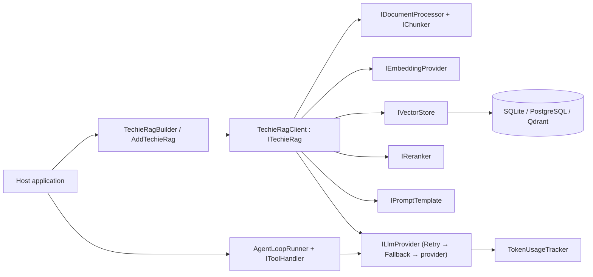
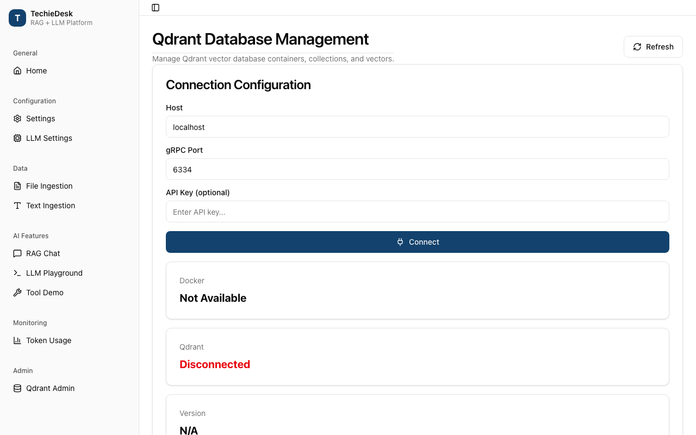
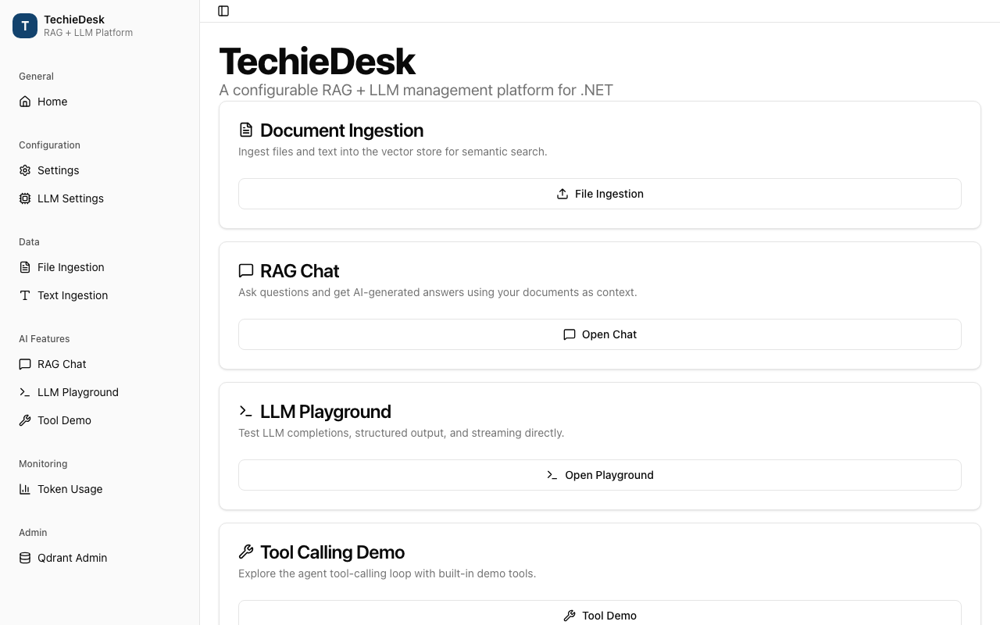

# TechieRag — Developer Guide

| | |
|---|---|
| App | TechieRag |
| Kind | library |
| Size | Large |
| Phase | 1 of 2 |
| Verified on | 2026-09-24 |
| Date | 2026-09-24 |

⚠ STATIC-ONLY — not runtime-verified

This guide maps each public service of the TechieRag library (packages `TechieRag`, `TechieRag.Embedded`, `TechieRag.Telemetry` under `src/`, tests under `tests/TechieRag.Tests`) to the code that serves it, read at file and line on 2026-09-24. The ten screenshots under `docs/screenshots/TechieRag/` were captured in July 2026 from the sample application of that time (TechieDesk, now Sevak, which moved to its own repository on 2026-09-24). No sample application can boot in this repository today, so every entry describes what the screenshot showed as static-only (unconfirmed) and links the sample screen that exercised the service. Line numbers are as of "Verified on"; when a line has moved, search for the function named in the same row.

## Architecture cheat-sheet

| Layer | Project or folder | What lives here |
|---|---|---|
| Entry point | `src/TechieRag/TechieRagClient.cs`, `ITechieRag.cs` | Ingest, search, ask, chat; owns every abstraction below |
| Composition | `src/TechieRag/TechieRagBuilder.cs`, `DependencyInjection/` | Fluent builder, `Build()`, three `AddTechieRag` overloads |
| Abstractions | `src/TechieRag/Abstractions/` | `ILlmProvider`, `IEmbeddingProvider`, `IVectorStore`, `IReranker`, `IChunker`, `IToolHandler`, `ITokenTracker`, stores |
| Providers | `src/TechieRag/Llm/`, `Embedding/`, `Reranking/`, `Speech/` | HTTP clients per vendor; `LlmConnectorCatalog`, `ModelRouter`, `LlmProviderFactory` |
| Processing | `src/TechieRag/Processors/`, `Processors/Chunking/` | One processor per file type, `TextChunker`, four chunkers |
| Storage | `src/TechieRag/VectorStores/`, `Persistence/` | `SqliteVecStore`, `PgVectorStore`, `QdrantStore`; conversation and workspace stores |
| Services | `src/TechieRag/Services/` | Retry, fallback, token tracking, tools, agent loop, prompt engine, workspaces, memory |
| Agents | `src/TechieRag/Orchestration/`, `Mcp/` | `FlowRunner`, guardrails, `AgentToolHandler`; MCP client, transports, trust policy |
| Sources | `src/TechieRag/Connectors/`, `Web/` | Confluence, repository, email connectors; page and site ingestion |
| Diagnostics | `src/TechieRag/Diagnostics/`, `src/TechieRag.Telemetry/` | BCL `ActivitySource`/`Meter`; opt-in OTLP and console exporters |
| Local models | `src/TechieRag.Embedded/` | BGE-M3 ONNX embeddings, cross-encoder reranker, model download, native resolver |

Every LLM call passes through the same decorator chain built in `TechieRagBuilder.Build()`: the concrete provider is wrapped in `RetryHandler` (`TechieRagBuilder.cs:619`), then optionally in `FallbackLlmHandler` (`:626`). The token tracker subscribes to `OnCompletionCompleted` on the outermost wrapper (`:638`). Nothing in the library reads configuration files itself; a host binds `TechieRagConfig` and hands it to the builder.

## Screen-by-screen code map

### Ingestion pipeline (IngestAsync / IngestDirectoryAsync)

Static-only (unconfirmed): the sample's Ingestion screen let a user pick files or a folder and showed the chunk count per document; it called `ITechieRag.IngestAsync` (`src/TechieRag/ITechieRag.cs:28`) or `IngestDirectoryAsync` (`:47`).

**Call chain:** `TechieRagClient.IngestAsync` (`src/TechieRag/TechieRagClient.cs:138`) → `TechieRagClient.FindProcessor` (`:778`) → `IDocumentProcessor.ProcessAsync` (`src/TechieRag/Abstractions/IDocumentProcessor.cs:36`, with `DocumentProcessingOptions.Chunker` = the configured `IChunker`) → `TechieRagClient.EmbedAndStampAsync` (`:845`) → `IEmbeddingProvider.EmbedBatchAsync` (`src/TechieRag/Abstractions/IEmbeddingProvider.cs:72`) → `IVectorStore.UpsertBatchAsync` (`src/TechieRag/Abstractions/IVectorStore.cs:43`, e.g. `src/TechieRag/VectorStores/SqliteVecStore.cs:206`) → `TechieRagTelemetry.RecordIngestion` (`:211`).

`IngestAsync` checks the file exists (`:142`), lower-cases the extension (`:147`) and asks `FindProcessor` for the first processor whose `SupportedExtensions` contains it (`:781`). An unknown extension falls back to `GenericTextProcessor` (`:796`) unless `GenericTextProcessor.IsBinaryExtension` (`src/TechieRag/Processors/GenericTextProcessor.cs:159`) says it is binary, in which case `IngestAsync` throws `NotSupportedException` (`:152-158`). The processor list is fixed in `TechieRagBuilder.CreateProcessors` (`src/TechieRag/TechieRagBuilder.cs:976-1004`): eleven typed processors, an optional `AudioTranscriptionProcessor` when `UseSpeechToText` was called (`:995-998`), and `GenericTextProcessor` last (`:1001`). The file size is read before the stream is consumed (`:171`) and stamped on every chunk with `DocumentName`, `SourcePath` and `FileName` (`:189-197`). Chunk size and overlap come from `config.Processing` (`src/TechieRag/TechieRagConfig.cs:245` default 500, `:255` default 50); the chunker is the one `Build()` chose (`TechieRagBuilder.cs:666`, `CreateChunkerFromStrategy` at `:742`) or `RecursiveChunker.Instance` (`TechieRagClient.cs:86`).

`EmbedAndStampAsync` embeds all chunk texts in one batch and writes both the vector and `EmbeddingSignature` metadata onto each chunk (`:848-855`) so stale corpora can be detected later (`DetectStaleEmbeddingsAsync`, `:501`). `EnsureDocumentExistsAsync` (`:858`) is a no-op that only logs; the store creates the document row during upsert (`SqliteVecStore.cs:237`). `IngestDirectoryAsync` (`:318`) enumerates recursively, filters by `GetSupportedExtensions` (`:808`), and calls `IngestAsync` per file inside a try/catch that logs and continues (`:345-354`).

| File and line | Function | Watch | Expected value |
|---|---|---|---|
| `src/TechieRag/TechieRagClient.cs:148` | `IngestAsync` | `processor` | the processor whose `SupportedExtensions` holds the extension; `GenericTextProcessor` for unknown text types |
| `src/TechieRag/TechieRagClient.cs:181` | `IngestAsync` | `chunks.Count` | greater than zero; zero returns the id without storing anything |
| `src/TechieRag/TechieRagClient.cs:848` | `EmbedAndStampAsync` | `vectors.Count` | equals `chunkList.Count`; each vector has the provider's `Dimensions` |
| `src/TechieRag/TechieRagClient.cs:854` | `EmbedAndStampAsync` | `signature` | the provider's `EmbeddingSignature`, e.g. `Embedded-ONNX/bge-m3/r2` |
| `src/TechieRag/VectorStores/SqliteVecStore.cs:257` | `UpsertBatchAsync` | `vectorBytes.Length` | `Dimensions * 4` bytes per chunk |
| `src/TechieRag/TechieRagClient.cs:347` | `IngestDirectoryAsync` | `documentIds.Count` | rises by one per file that did not throw |

**Calculations on this screen:** `fileSizeBytes = stream.Length` (`:171`); chunking arithmetic lives in the chosen `IChunker`.

### Raw text ingestion (IngestTextAsync)

Static-only (unconfirmed): the sample's Text Ingestion screen took pasted text plus a document name and called `ITechieRag.IngestTextAsync` (`src/TechieRag/ITechieRag.cs:38`). The same method is the sink for every non-file source: web pages (`src/TechieRag/Web/WebIngestionExtensions.cs:165`), connector items (`src/TechieRag/Connectors/ConnectorIngestionExtensions.cs:57`) and workspace text (`src/TechieRag/Services/WorkspaceManager.cs:170`).

**Call chain:** `TechieRagClient.IngestTextAsync` (`src/TechieRag/TechieRagClient.cs:226`) → `TextChunker.ChunkText` (`src/TechieRag/Processors/TextChunker.cs:34`) → `IChunker.Chunk` (`src/TechieRag/Processors/Chunking/RecursiveChunker.cs:22` for the default) → `TechieRagClient.EmbedAndStampAsync` (`:845`) → `IEmbeddingProvider.EmbedBatchAsync` → `IVectorStore.UpsertBatchAsync` (`SqliteVecStore.cs:206`) → `TechieRagTelemetry.RecordIngestion(count, "text")` (`:303`).

The method rejects empty text or name (`:232-233`), mints a GUID document id (`:237`) and computes the UTF-8 byte count as the document size (`:243`). `TextChunker.ChunkText` with a chunker argument (`TextChunker.cs:34`) short-circuits to the built-in recursive splitter when the chunker is null or `RecursiveChunker` (`:36-38`) and otherwise delegates to `chunker.Chunk` (`:41`). Each chunk becomes a `TextChunk` with `DocumentId`, incrementing `ChunkIndex`, and metadata `DocumentName`, `SourcePath = "text-input"`, `FileName` and `FileSize` (`:259-271`). Caller metadata is merged afterwards and overwrites those defaults key by key (`:274-280`), which is how web ingestion replaces `SourcePath` with the final URL and connectors add `SourceType`, `SourceUrl` and `Version`.

If chunking produced nothing the method logs a warning and returns the id without touching the store (`:285-289`). Otherwise it embeds and stamps (`:293`), calls the no-op `EnsureDocumentExistsAsync` (`:296`) and upserts (`:300`). In `SqliteVecStore.UpsertBatchAsync` the whole batch runs in one transaction (`:221`): the `Documents` row is inserted with `INSERT OR IGNORE` using the first chunk's `DocumentName` and `SourcePath` (`:231-249`), chunks are written with `INSERT OR REPLACE` (`:252-274`), the document's `ChunkCount` is recomputed (`:277-280`) and the transaction commits (`:282`). Note the document `Metadata` column is `SerializeDocumentMetadata(firstChunk)` (`:246`, `:586`), so listing documents later does not return chunk-level metadata; `WebIngestionExtensions.WebSourceUrl` (`WebIngestionExtensions.cs:134`) exists because of that.

| File and line | Function | Watch | Expected value |
|---|---|---|---|
| `src/TechieRag/TechieRagClient.cs:243` | `IngestTextAsync` | `textSizeBytes` | UTF-8 byte count of the pasted text |
| `src/TechieRag/Processors/TextChunker.cs:36` | `ChunkText` | `chunker` | null or `RecursiveChunker` takes the built-in path; any other strategy calls `chunker.Chunk` |
| `src/TechieRag/TechieRagClient.cs:278` | `IngestTextAsync` | `chunk.Metadata[kvp.Key]` | caller keys overwrite defaults, e.g. `SourcePath` becomes a URL for web ingestion |
| `src/TechieRag/TechieRagClient.cs:285` | `IngestTextAsync` | `chunkList.Count` | at least one; zero means whitespace-only input |
| `src/TechieRag/VectorStores/SqliteVecStore.cs:234` | `UpsertBatchAsync` | `docName` | the `documentName` argument, not "Unknown" |
| `src/TechieRag/VectorStores/SqliteVecStore.cs:282` | `UpsertBatchAsync` | `transaction` | commits once; a throw at `:286` rolls back the whole batch |

**Calculations on this screen:** `Encoding.UTF8.GetByteCount(text)` (`:243`); `chunkIndex++` per chunk (`:263`).

### Configuration and build (TechieRagBuilder.Build and AddTechieRag)

Static-only (unconfirmed): the sample's Settings screen edited embedding source, vector store and chunking, then rebuilt the client. In library terms that is `TechieRagBuilder` plus one of the three `AddTechieRag` overloads in `src/TechieRag/DependencyInjection/ServiceCollectionExtensions.cs`.

**Call chain:** `ServiceCollectionExtensions.AddTechieRag(IConfiguration)` (`src/TechieRag/DependencyInjection/ServiceCollectionExtensions.cs:133`) → `configuration.Get<TechieRagConfig>()` (`:141`) → `AddTechieRag(Action<TechieRagBuilder>)` (`:57`) → `builder.WithLogging` inside the lazy singleton factory (`:72-81`) → `TechieRagBuilder.Build` (`src/TechieRag/TechieRagBuilder.cs:604`) → `CreateVectorStore` (`:850`) / `CreateEmbeddingProvider` (`:868`) / `CreateProcessors` (`:976`) / `CreateLlmProvider` (`:774`) / `CreateReranker` (`:687`) → `new TechieRagClient(...)` (`:668`).

The builder overload registers `builder.GetConfig()` as a singleton (`:68`) and defers `Build()` until `ITechieRag` is first resolved, so the host's `ILoggerFactory` can be injected (`:75-78`). The `IConfiguration` overload re-applies the bound config through builder calls (`:147-247`): embedding (`:150-155`), vector store (`:158-160`), chunking (`:163-166`), telemetry flag (`:169`), Cohere or Jina rerank when an API key exists (`:174-185`), persistence (`:188-194`), LLM (`:197-206`), fallback LLM (`:209-220`), usage tracking (`:223-233`) and resilience (`:236-246`). The `TechieRagConfig` overload (`:272`) applies only embedding, vector store, chunk size and telemetry (`:281-296`). See Known issues for the fields both overloads drop.

`Build()` constructs in a fixed order. The vector store switch (`:852-858`) passes only the connection string (and, for Qdrant, the API key), so every store takes its constructor default of 1024 dimensions. When an LLM is configured it is wrapped in `RetryHandler` (`:619`) and, if `LlmFallback` is set, `FallbackLlmHandler` (`:626`). Usage tracking creates `TokenUsageTracker` and subscribes it to `OnCompletionCompleted` (`:633-646`). Conversation and workspace stores come from `config.Persistence.Provider` (`:751`, `:759`); memory is `DbConversationMemory` when a store exists, else `InMemoryConversationMemory` (`:653-657`). `EmbeddingSource.Embedded` throws unless `TechieRag.Embedded`'s `UseEmbedded` (`src/TechieRag.Embedded/TechieRagBuilderExtensions.cs:25`) installed a custom factory (`:877-879`, `:37`).

| File and line | Function | Watch | Expected value |
|---|---|---|---|
| `src/TechieRag/DependencyInjection/ServiceCollectionExtensions.cs:141` | `AddTechieRag(IConfiguration)` | `config.VectorStore.Type` | the bound enum, e.g. `SqliteVec`; null config throws `InvalidOperationException` |
| `src/TechieRag/DependencyInjection/ServiceCollectionExtensions.cs:75` | `AddTechieRag` factory | `loggerFactory` | non-null in a host with logging; null leaves `NullLogger` |
| `src/TechieRag/TechieRagBuilder.cs:606` | `Build` | `vectorStore.Name` | `SQLite-vec`, `PGVector` or the Qdrant store name |
| `src/TechieRag/TechieRagBuilder.cs:614` | `Build` | `config.Llm.Source` | `None` skips the whole LLM block; anything else must resolve at `:808` |
| `src/TechieRag/TechieRagBuilder.cs:663` | `Build` | `reranker` | null unless a source with credentials or a custom factory was set |
| `src/TechieRag/TechieRagBuilder.cs:854` | `CreateVectorStore` | `config.VectorStore.ConnectionString` | `Data Source=techierag.db` by default from `UseSqliteVec` (`:233`) |

**Calculations on this screen:** none; `Build()` only composes objects.

### LLM provider selection and factory

Static-only (unconfirmed): the sample's LLM Settings screen chose a provider, model, API key and fallback. The library offers three routes to the same `ILlmProvider`: an explicit source (`UseLlm`), a named connector (`UseConnectorLlm`) or a bare model name (`UseLlmForModel`).

**Call chain:** `TechieRagBuilder.UseLlmForModel` (`src/TechieRag/TechieRagBuilder.cs:366`) → `ModelRouter.Require` (`src/TechieRag/Llm/ModelRouter.cs:74`) → `ModelRouter.Resolve` (`:31`) → `LlmConnectorCatalog.Find` (`src/TechieRag/Llm/LlmConnectorCatalog.cs:156`) → `TechieRagBuilder.ApplyRoute` (`:369`) → `Build` → `CreateLlmProviderFromConfig` (`:785`) → provider constructor (`:808-847`) → `new RetryHandler` (`src/TechieRag/Services/RetryHandler.cs:60`) → `new FallbackLlmHandler` (`src/TechieRag/Services/FallbackLlmHandler.cs:58`).

`ModelRouter.Resolve` first splits `connector/model` on the first slash (`ModelRouter.cs:37-47`), then tries the longest matching prefix across `LlmConnectorCatalog.All` (`:52-62`); an ambiguous open-weight name returns null and `Require` throws with the connector list (`:76-79`). The catalog is a static array of `LlmConnectorDescriptor` (`LlmConnectorCatalog.cs:19-146`); multi-vendor hosts such as `groq` carry no prefixes (`:93-129`) and local runtimes set `RequiresApiKey = false` (`:130-145`). `LlmProviderFactory.Create` (`src/TechieRag/Llm/LlmProviderFactory.cs:32`) is the standalone equivalent for hosts that build a provider without the builder: it refuses a missing key when the connector needs one (`:41-44`) and switches on `connector.Source` (`:46-78`).

Inside the builder, `CreateLlmProviderFromConfig` consults the catalog when `Connector` is set and `Endpoint` is empty (`:790-806`), then switches on `Source` (`:808-847`); Ollama and LM Studio default their endpoints, the others throw when endpoint or key is missing. `RetryHandler.ExecuteWithRetryAsync` (`RetryHandler.cs:111`) checks the circuit (`:113`, `:177`), retries `HttpRequestException` up to `MaxRetries` (`:125`), honours `Retry-After` from `LlmRateLimitException` capped at `MaxRetryDelayMs` (`:131-135`), waits through the `DelayAsync` seam (`:151`) and multiplies the delay (`:152`); the circuit opens at `CircuitBreakerThreshold` consecutive failures (`:199-206`). Streaming methods only check the circuit (`:77`, `:94`). `FallbackLlmHandler.ChatAsync` (`FallbackLlmHandler.cs:95`) tries the primary (already retry-wrapped) and on any non-cancellation exception switches to the fallback (`:102-107`); streams are bridged through a `Channel` (`:143-180`). The fallback provider itself is built raw at `TechieRagBuilder.cs:625` and gets no retry wrapper.

| File and line | Function | Watch | Expected value |
|---|---|---|---|
| `src/TechieRag/Llm/ModelRouter.cs:64` | `Resolve` | `best` | a connector for `claude-*`, `gpt-*`, `gemini-*`; null for `llama-3.3-70b` |
| `src/TechieRag/TechieRagBuilder.cs:790` | `CreateLlmProviderFromConfig` | `connector` | non-null only when `llmConfig.Connector` names a catalog row |
| `src/TechieRag/TechieRagBuilder.cs:808` | `CreateLlmProviderFromConfig` | `llmConfig.Source` | one of the six handled sources; `None` throws at `:846` |
| `src/TechieRag/Services/RetryHandler.cs:125` | `ExecuteWithRetryAsync` | `attempt`, `delay` | `delay` doubles per attempt up to `MaxRetryDelayMs` |
| `src/TechieRag/Services/RetryHandler.cs:179` | `EnsureCircuitNotOpen` | `consecutiveFailures` | below `CircuitBreakerThreshold`, else throws until recovery elapses |
| `src/TechieRag/Services/FallbackLlmHandler.cs:106` | `ChatAsync` | `usingFallback` | flips to true only after the primary threw |

**Calculations on this screen:** exponential backoff `delay = min(delay * BackoffMultiplier, MaxRetryDelayMs)` (`RetryHandler.cs:152`).

### RAG question answering (AskAsync, AskStreamAsync, ChatWithRagAsync)

Static-only (unconfirmed): the sample's RAG Chat screen streamed an answer with source citations; it used `AskStreamWithSourcesAsync` or `ChatWithRagStreamWithSourcesAsync` and displayed the `Sources` event before the tokens.

**Call chain:** `TechieRagClient.AskAsync` (`src/TechieRag/TechieRagClient.cs:552`) → `TechieRagClient.SearchAsync(query, topK, filter)` (`:370`) → `SearchAsync(query, SearchOptions)` (`:391`) → `IEmbeddingProvider.EmbedAsync` (`:416`) → `IVectorStore.SearchAsync` (`:418`) → `TechieRagClient.ApplyRerankAsync` (`:459`) → `IReranker.RerankAsync` (`src/TechieRag/Abstractions/IReranker.cs:35`) → `PromptTemplateEngine.BuildRagPrompt` (`src/TechieRag/Services/PromptTemplateEngine.cs:28`) → `ILlmProvider.ChatAsync` (`:567`) → `RagResponse` (`:569`).

`EnsureLlmConfigured` (`:759`) throws when no provider was built. `SearchAsync` resolves whether to rerank from `SearchOptions.Rerank` or `config.Rerank.Enabled` (`ResolveRerank`, `:444`), logging and returning false when no `IReranker` exists (`:449-454`). It opens a `TechieRag.Search` activity (`:409`), embeds the query (`:416`), fetches `max(topK, Rerank.CandidateCount)` candidates when reranking (`:417`; `CandidateCount` defaults to 20 at `src/TechieRag/TechieRagConfig.cs:615`), reranks to `TopN` or `topK` (`:465-468`) and records the search histogram (`:429`).

`PromptTemplateEngine.BuildRagPrompt` formats the first `MaxContextChunks` results (`PromptTemplateEngine.cs:82`, default 5 at `TechieRagConfig.cs:572`) through `ContextChunkTemplate`, replacing `{index}`, `{text}`, `{source}`, `{score:P0}` and `{score}` (`:94-99`), then appends the block to the system prompt between `--- Retrieved Context ---` markers (`:107-113`). The result is two messages: system and user (`:39-43`). `BuildRagChatPrompt` (`:47`) inserts prior history, skipping system messages (`:62-71`).

`AskStreamAsync` (`:580`) is the same search followed by `ChatStreamAsync` (`:594`). `ChatWithRagAsync` (`:601`) pulls history from `IConversationMemory` when the caller passed none (`:613-616`), searches without a document filter (`:618`), and after the reply appends both turns to memory (`:624-628`). `AskStreamWithSourcesAsync` (`:677`) yields `RagStreamEvent.FromSources` first (`:689`), then one `FromToken` per token and finally `FromCompleted` with the whole answer (`:700`); the chat variant (`:704`) adds the memory writes before completing (`:732-736`).

| File and line | Function | Watch | Expected value |
|---|---|---|---|
| `src/TechieRag/TechieRagClient.cs:402` | `SearchAsync` | `useReranker` | true only when requested and `reranker` is not null |
| `src/TechieRag/TechieRagClient.cs:416` | `SearchAsync` | `queryVector.Length` | the provider's dimension; must match what the store holds |
| `src/TechieRag/TechieRagClient.cs:418` | `SearchAsync` | `results.Count` | up to `fetchCount`; zero means an empty or mismatched store |
| `src/TechieRag/Services/PromptTemplateEngine.cs:82` | `FormatContext` | `chunks.Count` | at most `MaxContextChunks` (5) |
| `src/TechieRag/Services/PromptTemplateEngine.cs:112` | `BuildSystemPromptWithContext` | return value | system prompt plus the context block, or the prompt alone when nothing was retrieved |
| `src/TechieRag/TechieRagClient.cs:567` | `AskAsync` | `response.Usage` | non-null `TokenUsage` with `ModelName` and `ProviderName` |

**Calculations on this screen:** `fetchCount = useReranker ? max(topK, CandidateCount) : topK` (`:417`); `topN = TopN > 0 ? min(TopN, topK) : topK` (`:465`).

### Direct completion, structured output and chat (OpenAICompatibleLlmProvider)

Static-only (unconfirmed): the sample's LLM Playground sent a prompt straight to `ILlmProvider.CompleteAsync`, `ChatStreamAsync` or `CompleteAsync<T>` without retrieval. The provider shown here is `OpenAICompatibleLlmProvider`; Anthropic, Gemini, Azure AI Foundry, Ollama and LM Studio implement the same `ILlmProvider` (`src/TechieRag/Abstractions/ILlmProvider.cs:16`).

**Call chain:** `OpenAICompatibleLlmProvider.CompleteAsync` (`src/TechieRag/Llm/OpenAICompatibleLlmProvider.cs:109`) → `OpenAICompatibleLlmProvider.ChatAsync` (`:134`) → `BuildRequest` (`:263`) → `HttpClient.PostAsync("chat/completions")` (`:141`) → `LlmHttpGuard.EnsureSuccess` (`src/TechieRag/Llm/LlmHttpGuard.cs:27`) → `JsonSerializer.Deserialize<OpenAIChatResponse>` (`:145`) → `ParseToolCalls` (`:333`) → `RaiseCompletionEvent` (`:345`).

The constructor keeps the whole endpoint as `BaseAddress` and posts to the relative path `chat/completions` (`:70-77`) so base paths such as `/openai/v1` survive; a bearer header is added when a key exists (`:79-82`). `CompleteAsync` turns a prompt plus optional `SystemPrompt` into messages and delegates to `ChatAsync` (`:111-116`). `BuildRequest` maps roles, content parts, `tool_call_id` and `tool_calls` (`:265-283`), sets `model` from `options.Model` or `ModelName` (`:287`), asks for a final usage chunk when streaming (`:295`), applies prompt-cache routing (`:300`), copies sampling options (`:302-308`), sets `response_format = json_object` for `JsonMode` (`:310-311`) and serialises `Tools` and `ToolChoice` (`:313-328`).

`ChatAsync` reads `prompt_tokens`, `completion_tokens` and cached tokens (`:151-153`), builds `LlmResponse` with `ToolCalls`, `FinishReason` and the server's model name (`:156-170`) and raises the completion event (`:172`). `ChatStreamAsync` (`:177`) sends with `ResponseHeadersRead` (`:185`), reads server-sent events line by line, skipping anything not prefixed `data: ` (`:198`), stopping at `[DONE]` (`:201`), capturing usage when a chunk carries it (`:205-209`) and yielding each `delta.content` (`:211-216`). When no usage arrived it estimates tokens at four characters each (`:222-226`, `EstimateTokenCount` at `:257`). `CompleteAsync<T>` (`:232`) appends "Respond with valid JSON only." (`:234`), forces `JsonMode` and a JSON system prompt (`:235-241`), strips a Markdown fence (`:244-250`) and deserialises case-insensitively (`:252`). `LlmHttpGuard.EnsureSuccess` throws `LlmRateLimitException` for 429, or 503 with `Retry-After` (`LlmHttpGuard.cs:31-42`), which is what `RetryHandler` honours.

| File and line | Function | Watch | Expected value |
|---|---|---|---|
| `src/TechieRag/Llm/OpenAICompatibleLlmProvider.cs:106` | `EffectiveCompletionsUri` | value | `{endpoint}/chat/completions`, base path preserved |
| `src/TechieRag/Llm/OpenAICompatibleLlmProvider.cs:138` | `ChatAsync` | `json` | request body with `model`, `messages`, `stream: false` |
| `src/TechieRag/Llm/OpenAICompatibleLlmProvider.cs:142` | `ChatAsync` | `response.StatusCode` | 200; 429 becomes `LlmRateLimitException` |
| `src/TechieRag/Llm/OpenAICompatibleLlmProvider.cs:211` | `ChatStreamAsync` | `delta` | the next text fragment; null on role or usage-only chunks |
| `src/TechieRag/Llm/OpenAICompatibleLlmProvider.cs:222` | `ChatStreamAsync` | `totalInputTokens` | server count, or the estimate when both totals are zero |
| `src/TechieRag/Llm/OpenAICompatibleLlmProvider.cs:252` | `CompleteAsync<T>` | `content` | bare JSON with any code fence removed |

**Calculations on this screen:** `EstimateTokenCount = ceil(text.Length / 4)` (`:260`).

### Tool calling and the agent loop (ToolRegistry, AgentLoopRunner, IToolHandler plug-ins)

Static-only (unconfirmed): the sample's Tool Calling Demo registered a few delegate tools, ran a question through the agent loop and rendered each `AgentStep`. The library does not run the loop inside `TechieRagClient`; a host builds `AgentLoopRunner` with `rag.GetLlmProvider()` (`src/TechieRag/TechieRagClient.cs:742`) and an `IToolHandler`.

**Call chain:** `TechieRagBuilder.WithTools` (`src/TechieRag/TechieRagBuilder.cs:463`) → `ToolRegistry.Register` (`src/TechieRag/Services/ToolRegistry.cs:37`) → `AgentLoopRunner.RunAsync` (`src/TechieRag/Services/AgentLoopRunner.cs:66`) → `ILlmProvider.ChatAsync` with `Tools` (`:94`) → `IToolHandler.ExecuteToolAsync` (`src/TechieRag/Abstractions/IToolHandler.cs:14`, e.g. `ToolRegistry.ExecuteToolAsync` at `ToolRegistry.cs:70`) → `ChatMessage.Tool(result)` appended (`:125`) → loop until `response.HasToolCalls` is false (`:96`).

`IToolHandler` has two members: `ToolDefinitions` (`IToolHandler.cs:11`) and `ExecuteToolAsync` (`:14`). `ToolRegistry` stores a `ToolDefinition` and a delegate per name (`:45-51`); an unknown name or a throwing delegate returns an unsuccessful `ToolResult` rather than an exception (`:74-83`, `:90-99`). `AgentLoopRunner.RunAsync` copies the caller's options and adds `Tools = toolHandler.ToolDefinitions` with `ToolChoice = "auto"` (`:75-87`), then iterates up to `maxIterations` (default 10, `:43`): call the model (`:94`), return on a plain answer (`:96-106`), otherwise append the assistant message with its tool calls (`:116`), execute each call (`:119-145`) and report `ToolExecuted` steps with `IsSuccess` and the coded `FailureMessage` (`:132-144`). When the budget is spent it forces one final call without tools (`:149-165`).

Three handlers plug in through the same interface. `CompositeToolHandler` (`src/TechieRag/Services/CompositeToolHandler.cs:20`) merges several handlers. `AgentToolHandler.ForAgent` (`src/TechieRag/Orchestration/AgentToolHandler.cs:115`) wraps a `FlowAgent` as one tool with a single `input` string (`BuildSchema`, `:80`) and runs a nested `AgentLoopRunner` (`:144-154`); `ForFlow` (`:179`) runs a nested `FlowRunner` (`:203`) and maps a blocked or exhausted run to an unsuccessful result (`:209-237`). `ExecuteToolAsync` (`:242`) enforces `MaxInvocations` (default 8, `:44`) at `:257`. `McpToolHandler.CreateAsync` (`src/TechieRag/Mcp/McpToolHandler.cs:86`) lists each server's tools, names them `{server}-{tool}` (`QualifyToolName`, `:207`), and `ExecuteToolAsync` (`:136`) forwards to `McpClient.CallToolAsync` (`:153`) and truncates results to `McpTrustPolicy.MaxToolResultCharacters` (`:157`, `:244`). `GuardedToolHandler` (`src/TechieRag/Orchestration/GuardedToolHandler.cs:82`) runs guardrails before delegating.

| File and line | Function | Watch | Expected value |
|---|---|---|---|
| `src/TechieRag/Services/AgentLoopRunner.cs:85` | `RunAsync` | `toolOptions.Tools.Count` | the number of registered tools sent to the model |
| `src/TechieRag/Services/AgentLoopRunner.cs:96` | `RunAsync` | `response.HasToolCalls` | true continues the loop; false returns the answer |
| `src/TechieRag/Services/ToolRegistry.cs:74` | `ExecuteToolAsync` | `toolCall.Name` | a registered name; unknown returns `IsSuccess = false` |
| `src/TechieRag/Services/AgentLoopRunner.cs:124` | `RunAsync` | `result.Content` | the tool's string, or an `Error: ...` message |
| `src/TechieRag/Orchestration/AgentToolHandler.cs:257` | `ExecuteToolAsync` | `invocations` | at most `MaxInvocations`; above it the model gets an `unavailable:` refusal |
| `src/TechieRag/Mcp/McpToolHandler.cs:157` | `ExecuteToolAsync` | `content.Length` | at most `MaxToolResultCharacters` (100000) plus the truncation marker |

**Calculations on this screen:** iteration counter versus `maxIterations` (`AgentLoopRunner.cs:89`); `QualifyToolName` hash suffix when a name exceeds 64 characters (`McpToolHandler.cs:215-217`).

### Token tracking and budgets (TokenUsageTracker)

Static-only (unconfirmed): the sample's Token Usage screen listed per-model totals and estimated cost from `ITokenTracker.GetSessionUsage` and `GetUsageByModel`, and showed a budget bar. It obtained the tracker from `ITechieRag.GetTokenTracker` (`src/TechieRag/TechieRagClient.cs:745`).

**Call chain:** `TechieRagBuilder.WithUsageTracking` (`src/TechieRag/TechieRagBuilder.cs:405`) → `Build` creates `new TokenUsageTracker(config.UsageTracking)` (`:635`) and subscribes `llmProvider.OnCompletionCompleted` (`:638`) → provider `RaiseCompletionEvent` (`src/TechieRag/Llm/OpenAICompatibleLlmProvider.cs:345`, `OnCompletionCompleted?.Invoke` at `:350`) → `TokenUsageTracker.RecordUsage` (`src/TechieRag/Services/TokenUsageTracker.cs:61`) → `CalculateCost` (`:168`) → `OnUsageRecorded` (`:71`) → `CheckBudget` (`:194`) → `OnBudgetAlert` (`:208`, `:212`).

The event is declared on `ILlmProvider` (`src/TechieRag/Abstractions/ILlmProvider.cs:64`). Because the builder subscribes on the outermost wrapper, the decorators forward it: `RetryHandler` re-targets `add`/`remove` to its inner provider (`src/TechieRag/Services/RetryHandler.cs:48-52`) and `FallbackLlmHandler` subscribes both primary and fallback (`src/TechieRag/Services/FallbackLlmHandler.cs:38-50`), so a completion served by the fallback is still counted. Every concrete provider raises the event after a completion: OpenAI-compatible at `:350`, Anthropic at `src/TechieRag/Llm/AnthropicLlmProvider.cs:515`, Azure AI Foundry `:325`, Gemini `:381`, LM Studio `:316`, Ollama `:362`. The same helper also records `TechieRagTelemetry.RecordLlmCompletion` (`OpenAICompatibleLlmProvider.cs:347`).

`TokenUsageTracker`'s constructor seeds default pricing (`InitializeDefaultPricing`, `:221-231`), lets `UsageTrackingConfig.Pricing` override or add rows (`:42-45`) and sets a budget when `MaxTotalTokens` or `MaxCostUsd` is positive (`:48-57`). `RecordUsage` fills `EstimatedCostUsd` when zero (`:65-68`) using `FindPricing`, which matches exactly, then by substring, case-insensitively (`:180-192`), appends to a `ConcurrentBag` (`:70`) and evaluates the budget under a lock (`:196-214`): `BudgetStatus.IsExceeded` (`src/TechieRag/Models/TokenUsage.cs:100`) raises an exceeded alert, `IsAlertTriggered` (`:105`) a threshold alert. `GetSessionUsage` (`:77`) and `GetUsageByModel` (`:97`) aggregate the bag on demand; `Reset` drains it (`:152`). When usage tracking is off, `TechieRagClient` still creates a bare tracker (`TechieRagClient.cs:82`) but nothing feeds it. `BlockOnExceeded` is copied onto the budget (`:55`) and exposed, but no code in the library refuses a call because of it.

| File and line | Function | Watch | Expected value |
|---|---|---|---|
| `src/TechieRag/TechieRagBuilder.cs:638` | `Build` | `args.InputTokens`, `args.ModelName` | the provider's counts; model name as the provider reports it |
| `src/TechieRag/Llm/OpenAICompatibleLlmProvider.cs:350` | `RaiseCompletionEvent` | `OnCompletionCompleted` | non-null when tracking is on; null means nothing subscribed |
| `src/TechieRag/Services/TokenUsageTracker.cs:67` | `RecordUsage` | `usage.EstimatedCostUsd` | positive when the model matches a pricing row; 0 for unknown models |
| `src/TechieRag/Services/TokenUsageTracker.cs:187` | `FindPricing` | `kvp.Key` | the substring that matched, e.g. `gpt-4o` for `gpt-4o-2024-08-06` |
| `src/TechieRag/Services/TokenUsageTracker.cs:206` | `CheckBudget` | `status.IsExceeded` | true once tokens or cost pass the budget |
| `src/TechieRag/Services/TokenUsageTracker.cs:87` | `GetSessionUsage` | `records.Length` | one record per completion since the last `Reset` |

**Calculations on this screen:** `cost = input / 1,000,000 * inputPrice + output / 1,000,000 * outputPrice` (`:175-177`).

### Vector stores (SqliteVecStore, PgVectorStore, QdrantStore)

Static-only (unconfirmed): the sample's Qdrant Admin screen listed collections and point counts through `IVectorStore.ListDocumentsAsync` and `GetStatsAsync`. All three stores implement `IVectorStore` (`src/TechieRag/Abstractions/IVectorStore.cs:15`); `SearchAsync` is declared at `:53`.

**Call chain:** `TechieRagClient.SearchAsync` (`src/TechieRag/TechieRagClient.cs:418`) → `SqliteVecStore.SearchAsync` (`src/TechieRag/VectorStores/SqliteVecStore.cs:310`) → `SqliteVecStore.InitializeAsync` (`:317`, `:68`) → `TryLoadSqliteVecExtension` (`:76`, `:118`) → `ComputeSimilarityFallbackAsync` (`:325`, `:340`) → `ComputeCosineSimilarity` (`:363`, `:381`) → ordered `SearchResult` list (`:368-372`).

`SqliteVecStore` never loads sqlite-vec. `TryLoadSqliteVecExtension` (`:118-131`) contains only a commented `connection.LoadExtension("vec0")` (`:124`) and returns false (`:125`), so `sqliteVecAvailable` is always false, `SearchAsync` always takes the managed path at `:322-325`, and the `Array.Empty` return at `:329` is unreachable. The managed scan selects every chunk with a vector, optionally filtered by `DocumentId` (`:349-353`), deserialises each BLOB (`DeserializeVector`, `:614`), computes cosine similarity (`:381-403`; mismatched lengths score 0 at `:383`), sorts descending and takes `topK` (`:368-372`). It is exact but O(chunks). The `dimensions` field (`:32`, constructor default 1024 at `:47`) is stored and never used in SQL.

`PgVectorStore` (`src/TechieRag/VectorStores/PgVectorStore.cs:42`, default dimension 1024) creates the `Chunks` table with a `vector({vectorDimension})` column (`:108`) in `InitializeAsync` (`:61`), so the dimension must match the embedding provider or inserts fail. `SearchAsync` (`:347`) requires prior initialisation (`:354`, `:657`), runs `1 - (Embedding <=> @QueryVector) AS Score ... ORDER BY Embedding <=> @QueryVector LIMIT @TopK` (`:365-385`) with a `Pgvector.Vector` parameter (`:387`) and maps rows to `SearchResult` (`:393-416`).

`QdrantStore` (`src/TechieRag/VectorStores/QdrantStore.cs:71`, `apiKey` named argument, default dimension 1024) creates the chunks collection with `Size = dimensions` and `Distance.Cosine` (`:140-147`) plus a one-dimensional documents collection (`:151-160`). `SearchAsync` (`:257`) initialises lazily (`:263`, `:502`), builds a `DocumentId` keyword filter when requested (`:270-287`), calls `client.SearchAsync(collectionName, queryVector, filter, limit: topK, payloadSelector: true)` (`:289-295`) and rebuilds chunks from payload (`:301`, `CreateChunkFromPayload` at `:596`).

| File and line | Function | Watch | Expected value |
|---|---|---|---|
| `src/TechieRag/VectorStores/SqliteVecStore.cs:76` | `InitializeAsync` | `sqliteVecAvailable` | always false |
| `src/TechieRag/VectorStores/SqliteVecStore.cs:353` | `ComputeSimilarityFallbackAsync` | `rows` | every stored chunk (or the filtered document's chunks) |
| `src/TechieRag/VectorStores/SqliteVecStore.cs:383` | `ComputeCosineSimilarity` | `vectorA.Length == vectorB.Length` | true; false silently scores 0 after a provider change |
| `src/TechieRag/VectorStores/PgVectorStore.cs:387` | `SearchAsync` | `queryVector.Length` | equals `vectorDimension` used at `:108` |
| `src/TechieRag/VectorStores/QdrantStore.cs:144` | `InitializeAsync` | `dimensions` | 1024 unless a host constructed the store itself |
| `src/TechieRag/VectorStores/QdrantStore.cs:289` | `SearchAsync` | `searchResult.Count` | up to `topK` scored points |

**Calculations on this screen:** cosine `dot / (|a| * |b|)` (`SqliteVecStore.cs:386-403`); Qdrant size estimate `chunks * (dimensions * 4 + 500)` (`QdrantStore.cs:453`).

### Embedded ONNX embedding and reranking (TechieRag.Embedded)

Static-only (unconfirmed): the sample's landing page showed the configured embedding provider ("Embedded-ONNX", bge-m3) and the reranker, with a model download progress bar fed by `ModelDownloadService.ProgressChanged`.

**Call chain:** `TechieRagBuilderExtensions.UseEmbedded` (`src/TechieRag.Embedded/TechieRagBuilderExtensions.cs:25`) → `builder.UseCustomEmbeddingProvider(() => EmbeddedEmbeddingProvider.CreateDefault())` (`:37`) → `EmbeddedEmbeddingProvider.EmbedBatchAsync` (`src/TechieRag.Embedded/EmbeddedEmbeddingProvider.cs:373`) → `EnsureInitializedAsync` (`:229`) → `InitializeAsync` (`:180`) → `EnsureModelDownloadedAsync` (`:237`) → `DownloadFileWithProgressAsync` (`:325`) → `InitializeFromDirectory` (`:210`) → `GenerateEmbedding` (`:435`) → `InferenceSession.Run` (`:472`) → `Normalize` (`:509`).

`GetModelDirectory` (`:145-150`) places the cache at `<assembly folder>/models/bge-m3`. `IsModelDownloaded` (`:129`) treats a `model.onnx_data` above 2 GB as complete (`:139`). The download loop (`:273-312`) walks the five `ModelFiles` (`:59-66`), skips complete files, updates the `ModelDownloadService` singleton (`src/TechieRag.Embedded/ModelDownloadService.cs:80`, `UpdateProgress` at `:106`, `ProgressChanged` at `:101`) and fetches from `ModelBaseUrl` (`:43`), overridable through `TECHIERAG_MODEL_BASE_URL` (`:36`). Progress is also written with `Console.WriteLine` (`:305`, `:311`, `:315`). `InitializeFromDirectory` opens an `InferenceSession` with `ORT_ENABLE_ALL` (`:218-224`) and loads the tokenizer (`LoadTokenizer`, `:520`), preferring `sentencepiece.bpe.model` for a `tokenizer.json` model directory (`:527-534`).

`GenerateEmbedding` encodes with two slots reserved (`:442`), wraps ids in `<s>`/`</s>` and shifts each piece id with `ToModelId` (`:432`, `:451-457`), runs the session and prefers a `sentence_embedding` output, else `last_hidden_state` with mean pooling (`:474-489`), then L2-normalises. The encoding revision (`:91`) feeds `EmbeddingSignature` (`:94`). `OnnxNativeLibraryResolver.Install` (`src/TechieRag.Embedded/OnnxNativeLibraryResolver.cs:54`) is a module initializer that, on macOS and Linux only (`:62`), registers a `DllImport` resolver (`:69`) mapping `onnxruntime.dll` to `libonnxruntime.dylib` or `.so` (`:92`) in three candidate paths (`:112-125`).

`UseEmbeddedReranker` (`TechieRagBuilderExtensions.cs:127`) sets `RerankSource.LocalOnnx` and installs a factory (`:139-144`). `OnnxCrossEncoderReranker.RerankAsync` (`src/TechieRag.Embedded/OnnxCrossEncoderReranker.cs:247`) initialises (`:209`; download at `:330`, session `:233`, tokenizer `:236`), scores every candidate with `ScorePair` (`:287`; pair encoding `:294-305`, sigmoid `:327`) and returns the top `topN` (`:268-271`).

| File and line | Function | Watch | Expected value |
|---|---|---|---|
| `src/TechieRag.Embedded/EmbeddedEmbeddingProvider.cs:239` | `EnsureModelDownloadedAsync` | `modelDir` | `<assembly folder>/models/bge-m3` |
| `src/TechieRag.Embedded/EmbeddedEmbeddingProvider.cs:243` | `EnsureModelDownloadedAsync` | `IsModelDownloaded()` | true skips the download; false enters the semaphore at `:254` |
| `src/TechieRag.Embedded/EmbeddedEmbeddingProvider.cs:307` | `EnsureModelDownloadedAsync` | `url` | `https://huggingface.co/BAAI/bge-m3/resolve/main/onnx/<file>` or the mirror |
| `src/TechieRag.Embedded/EmbeddedEmbeddingProvider.cs:447` | `GenerateEmbedding` | `seqLength` | token count plus 2, at most `maxSequenceLength` (8192) |
| `src/TechieRag.Embedded/EmbeddedEmbeddingProvider.cs:480` | `GenerateEmbedding` | `outputTensor.Dimensions` | `[1, 1024]` for `sentence_embedding`; 3-D triggers mean pooling |
| `src/TechieRag.Embedded/OnnxCrossEncoderReranker.cs:327` | `ScorePair` | return value | a 0 to 1 relevance score |

**Calculations on this screen:** `ToModelId = id == 0 ? 3 : id + 1` (`EmbeddedEmbeddingProvider.cs:432`); mean pooling (`:492-507`); sigmoid `1 / (1 + e^-logit)` (`OnnxCrossEncoderReranker.cs:327`).

## Cross-cutting flows

### Data connectors

`ITechieRag.IngestConnectorAsync` (`src/TechieRag/Connectors/ConnectorIngestionExtensions.cs:23`) creates a `ConnectorRunner` and calls `RunAsync` (`:33`), skips items with no text (`:47`) and ingests the rest through `IngestTextAsync` with `BuildMetadata` (`:57`, `:67`). `ConnectorRunner.RunAsync` (`src/TechieRag/Connectors/ConnectorRunner.cs:45`) pages through `IDataConnector.ListAsync` (`:90`) up to `MaxPages` (`:82`), skips unchanged items via `previousSync.IsUnchanged` (`:116`), rejects oversized items from the listing (`:131`), waits `RequestDelay` between fetches (`:142`), calls `FetchAsync` (`:150`), records one failure per bad item and throws after `MaxConsecutiveFailures` (`:162-177`), stops at `MaxTotalBytes` (`:195`) and prunes stale versions only after a complete walk (`:216-222`). The three connectors implement `IDataConnector` (`src/TechieRag/Connectors/IDataConnector.cs:29`).

| Connector | Class | List / Fetch |
|---|---|---|
| Confluence | `src/TechieRag/Connectors/Confluence/ConfluenceConnector.cs:42` | `:85` / `:132` |
| Repository | `src/TechieRag/Connectors/Repository/RepositoryConnector.cs:29` | `:67` / `:81` |
| Email | `src/TechieRag/Connectors/Email/EmailConnector.cs:36` (`ListsEntireSource = false`, `:74`) | `:77` / `:120` |

Break at `ConnectorRunner.cs:150` and watch `item.Id` and `item.Version`; a version recorded at `:190` means the item will be skipped next run.

### MCP client

`McpClient.Create` (`src/TechieRag/Mcp/McpClient.cs:82`) picks `StdioMcpTransport` or `HttpMcpTransport` (`:87-92`); both constructors call `McpServerConfig.Validate(policy)` (`src/TechieRag/Mcp/StdioMcpTransport.cs:60`, `src/TechieRag/Mcp/HttpMcpTransport.cs:53`; `FindProblems` at `src/TechieRag/Mcp/McpServerConfig.cs:104`). `InitializeAsync` (`McpClient.cs:103`) starts the transport (`:107`), sends `initialize` (`:120`) and `notifications/initialized` (`:129`). `ListToolsAsync` (`:145`) pages with `nextCursor` (`:179`) and drops tools outside `AllowedTools` (`:167`); `CallToolAsync` (`:194`) refuses a tool not in the allow-list before any I/O (`:201`) and flattens `content` to text (`:220`, `:260`). `McpTrustPolicy` (`src/TechieRag/Mcp/McpTrustPolicy.cs:22`) defaults closed: `Strict` (`:29`), `AllowLocalProcessLaunch = false` (`:40`), `AllowPlaintextHttp = false` (`:62`), `MaxToolResultCharacters = 100000` (`:72`). `StdioMcpTransport.StartAsync` re-checks the launch permission at the moment of `Process.Start` (`:75`, `:117`). `McpAgentExtensions.BuildWorkspaceToolsAsync` (`src/TechieRag/Mcp/McpAgentExtensions.cs:124`) assembles a handler that tolerates one failing server. Break at `McpClient.cs:214` and watch `parameters["name"]`.

### Flow orchestration

`FlowRunner.RunAsync` (`src/TechieRag/Orchestration/FlowRunner.cs:92`) validates the definition (`:101`), resolves the start node (`:118`) and loops (`:123`) until a terminal node (`:192`), a block (`:162`), the `MaxSteps` budget (`:127`) or no satisfied edge (`:228`). `ExecuteNodeAsync` (`:238`) builds the guardrail chain (`:256`, `FlowGuardrailChain.BuildAsync` at `src/TechieRag/Orchestration/FlowGuardrailChain.cs:68`, host guardrails first at `:74`, unresolvable ids deny at `:84`), evaluates the `Input` stage (`:259`), dispatches on node kind (`:271-277`), then evaluates `Output` (`:281`). `RunAgentNodeAsync` (`:301`) resolves the agent through `FlowRuntime.Agents` (`:305`), wraps its tools in `GuardedToolHandler` (`:324`; `ToolCall` stage at `src/TechieRag/Orchestration/GuardedToolHandler.cs:89`) and runs `AgentLoopRunner` (`:328-344`). `FlowRuntime` (`src/TechieRag/Orchestration/FlowRuntime.cs:66`) carries `Agents`, `Guardrails`, `Tools`, `HostGuardrails` and `SystemPreamble` (`:80-105`). Every person-facing sentence is a `FlowMessage` (`src/TechieRag/Orchestration/FlowMessage.cs:35`, `Create` at `:72`) with a stable code. `FlowGuardrailChain.EvaluateAsync` (`FlowGuardrailChain.cs:98`) treats a faulting guardrail as a block (`:121-129`). Break at `FlowRunner.cs:159` and watch `step.Blocked` and `step.Output`.

### Web ingestion

`IngestUrlAsync` (`src/TechieRag/Web/WebIngestionExtensions.cs:24`) fetches one page through `IWebContentFetcher.FetchAsync` (`:34`; `HttpWebContentFetcher.FetchAsync` at `src/TechieRag/Web/HttpWebContentFetcher.cs:40`, capped at `MaxContentBytes` 8 MB, `:19`) and calls `IngestPageAsync` (`:118`), which writes `SourceUrl` and `SourcePath` both as the final URL (`:137-142`). `IngestSiteAsync` (`:45`) runs `SiteCrawler.CrawlAsync` (`src/TechieRag/Web/SiteCrawler.cs:43`), which refuses non-http seeds (`:51`) and private-network hosts (`:57`), bounds pages (`:71`) and depth (`:103`) and delays between requests (`:78`). `HttpWebContentFetcher.CreateGuardedHandler` (`:291`) blocks private addresses at connect time (`:310`). Break at `WebIngestionExtensions.cs:123` and watch `page.Text`.

### Workspaces and persistent memory

`TechieRagClient` builds a `WorkspaceManager` only when a workspace store exists (`src/TechieRag/TechieRagClient.cs:88-90`) and exposes it via `GetWorkspaceManager` (`:757`); `WithPersistence` (`src/TechieRag/TechieRagBuilder.cs:574`) selects `Sqlite*` or `Postgres*` stores (`:751`, `:759`). `WorkspaceManager.AskAsync` (`src/TechieRag/Services/WorkspaceManager.cs:425`) loads the workspace (`:437`), composes context (`:438`, `ComposeContextAsync` at `:649`: scope `:655`, search `:656`, pinned chunks `:658`, budget `:665`, truncation event `:666`), returns the fixed "not covered" answer in Query mode with no context (`:441-451`) and otherwise prompts the LLM (`:455-456`). `ApplyContextBudget` (`:711`) evicts retrieved before pinned chunks. `DbConversationMemory` (`src/TechieRag/Services/DbConversationMemory.cs:31`) creates a thread lazily (`EnsureThreadAsync`, `:101`) and delegates to `IConversationStore` (`:49`, `:56`); `RelationalConversationStore` creates tables in `InitializeAsync` (`src/TechieRag/Persistence/RelationalConversationStore.cs:38`) and stores messages at `:226`. `RelationalWorkspaceStore` (`src/TechieRag/Persistence/RelationalWorkspaceStore.cs:31`) handles documents (`:155`), hashes (`:207`) and pins (`:219`). Break at `WorkspaceManager.cs:665` and watch `pinnedUnique.Count` and `retrievedUnique.Count`.

### Speech

`UseSpeechToText` (`src/TechieRag/TechieRagBuilder.cs:30`) stores the provider; `CreateProcessors` adds `AudioTranscriptionProcessor` before the generic fallback (`:995-998`). `AudioTranscriptionProcessor.ProcessAsync` (`src/TechieRag/Processors/AudioTranscriptionProcessor.cs:82`) calls `ISpeechToText.TranscribeAsync` with segments requested (`:93-101`) and chunks by segment or by text (`:110-112`). `OpenAICompatibleSpeechToText.TranscribeAsync` (`src/TechieRag/Speech/OpenAICompatibleSpeechToText.cs:108`) rejects non-audio extensions (`:117-122`), posts a multipart form (`:126-128`) through `LlmHttpGuard.EnsureSuccess` (`:131`) and parses the transcript (`:134`). `OpenAICompatibleTextToSpeech.SynthesizeAsync` (`src/TechieRag/Speech/OpenAICompatibleTextToSpeech.cs:124`) is the reverse path. Break at `AudioTranscriptionProcessor.cs:103` and watch `transcript.Segments.Count`.

### Telemetry

`TechieRagTelemetry` (`src/TechieRag/Diagnostics/TechieRagTelemetry.cs:61`) owns one `ActivitySource` and one `Meter` named `TechieRag` (`:80-99`); `Enabled` defaults to false (`:109`), so `StartActivity` (`:121`), `RecordLlmCompletion` (`:133`), `RecordIngestion` (`:161`) and `RecordSearch` (`:174`) are no-ops until a host flips it. Callers: `TechieRagClient.cs:409`, `:429`, `:211`, `:303` and every provider's completion helper (`OpenAICompatibleLlmProvider.cs:347`). The `TechieRag.Telemetry` package adds exporters: `TechieRagTelemetryPipeline.Create` (`src/TechieRag.Telemetry/TechieRagTelemetryPipeline.cs:66`) returns an inert pipeline when neither flag is set (`:70-73`), validates a non-loopback OTLP endpoint (`:77`; `TechieRagTelemetryOptions.ValidateEndpoint` at `src/TechieRag.Telemetry/TechieRagTelemetryOptions.cs:76`, default `http://localhost:4318` at `:21`), builds tracer and meter providers (`:80-81`) and sets `TechieRagTelemetry.Enabled = true` (`:84`), restoring it on `Dispose` (`:109-112`). `AddTechieRagTelemetry` (`src/TechieRag.Telemetry/TechieRagTelemetryServiceCollectionExtensions.cs:27`) registers it lazily (`:33`). Break at `TechieRagTelemetry.cs:143` and watch `Enabled`.

### Resilience

LLM calls: `WithResilience` (`src/TechieRag/TechieRagBuilder.cs:444`) fills `ResilienceConfig` (`src/TechieRag/TechieRagConfig.cs:646`), consumed by `RetryHandler` (`src/TechieRag/Services/RetryHandler.cs:111-175`) with `LlmHttpGuard.EnsureSuccess` (`src/TechieRag/Llm/LlmHttpGuard.cs:27`) turning 429 and 503-with-Retry-After into `LlmRateLimitException`. Connectors: consecutive-failure circuit at `ConnectorRunner.cs:168`. MCP: result truncation at `McpToolHandler.cs:244` and per-request timeout from `McpServerConfig.TimeoutSeconds` (`HttpMcpTransport.cs:63`). Web: response cap at `HttpWebContentFetcher.cs:19` and private-network refusal at `:310`. Agent loop: `maxIterations` (`AgentLoopRunner.cs:89`) and `AgentToolHandler.MaxInvocations` (`AgentToolHandler.cs:257`). Flows: `MaxSteps` (`FlowRunner.cs:127`). Break at `RetryHandler.cs:127` to see a failure counted.

## Known issues

- sqlite-vec is never loaded: `src/TechieRag/VectorStores/SqliteVecStore.cs:118-131` returns false with the `LoadExtension` call commented out at `:124`, so every search runs the managed O(n) cosine scan at `:340-373` and the branch at `:328-329` is dead code. REQ-RAG vector-store performance.
- Every vector store is built with the 1024 default dimension: `src/TechieRag/TechieRagBuilder.cs:854`, `:856` and `:865` pass no dimension, so `SqliteVecStore.cs:47`, `QdrantStore.cs:71` and `PgVectorStore.cs:42` default to 1024 and `config.Embedding.Dimensions` (`TechieRagConfig.cs:173`) is ignored; a 384- or 1536-dimension provider breaks PgVector inserts and Qdrant collections.
- `AddTechieRag(IConfiguration)` drops settings: `src/TechieRag/DependencyInjection/ServiceCollectionExtensions.cs:158-160` omits `VectorStore.ApiKey`; `:150-155` calls `UseEmbedding`, which rebuilds `EmbeddingConfig` (`TechieRagBuilder.cs:51-58`) without `Dimensions`, `ApiFormat`, `ApiPath` or `RequestDelayMs`; the `Prompt` section (`TechieRagConfig.cs:64`) is never applied. The `TechieRagConfig` overload (`:272-298`) additionally drops LLM, rerank, persistence, usage and resilience.
- `TechieRagConfig.EnableTelemetry` (`TechieRagConfig.cs:52`, default true) is written by `WithTelemetry` (`TechieRagBuilder.cs:263`) but read by nothing; the real gate is `TechieRagTelemetry.Enabled` (`src/TechieRag/Diagnostics/TechieRagTelemetry.cs:109`, default false).
- `UsageTrackingConfig.BlockOnExceeded` (`TechieRagConfig.cs:545`) is copied to the budget (`TokenUsageTracker.cs:55`) but no code blocks a completion; only `OnBudgetAlert` fires (`:208`).
- Download progress is written with `Console.WriteLine` in `src/TechieRag.Embedded/EmbeddedEmbeddingProvider.cs:305`, `:311` and `:315`, beside the `ModelDownloadService` progress the same method already reports.
- Model cache location: `EmbeddedEmbeddingProvider.GetModelDirectory` (`:145-150`) and `OnnxCrossEncoderReranker.GetModelDirectory` (`src/TechieRag.Embedded/OnnxCrossEncoderReranker.cs:172-177`) resolve under the executing assembly's folder, while the live tests stage weights under `~/.cache/techierag-models` (`tests/TechieRag.Tests/Reranking/Live/LiveRerankerFactAttribute.cs:38-42`, `LiveEmbeddedTokenizerDiagnosticTests.cs:47-49`), so a developer's cached download is not found by the library unless copied.
- `src/TechieRag/Telemetry/` is an empty folder holding only `.gitkeep`; the telemetry code lives in `src/TechieRag/Diagnostics/` and `src/TechieRag.Telemetry/`.
- `ConfigureAwait(false)` is inconsistent: `TechieRagClient.cs` applies it on 30 of 44 awaits (missing at `:173`, `:201`, `:208`, `:481`, `:510` among others), `SqliteVecStore.cs` on 0 of 46 and `EmbeddedEmbeddingProvider.cs` on 0 of 13, while `WorkspaceManager.cs` applies it everywhere.
- `TechieRag.Telemetry` is never packed: `.github/workflows/publish-nuget.yml:113-114` and `.github/workflows/publish-github-packages.yml:86-87` pack only `TechieRag` and `TechieRag.Embedded`, although `src/TechieRag.Telemetry/TechieRag.Telemetry.csproj:16` declares `PackageId` `TechieRag.Telemetry`.
- `.github/workflows/publish-github-packages.yml:140-165` (`publish-nuget-org` job) pushes to nuget.org on every `v*` tag when the `NUGET_API_KEY` secret exists, with `--skip-duplicate`; this contradicts the header of `publish-nuget.yml` (lines 1-31), which states nothing publishes to nuget.org automatically and that the version comes from the tag through `determine-version.sh`.
