# TechieRag — Developer Guide

| | |
|---|---|
| App | TechieRag |
| Kind | library |
| Size | Large |
| Phase | 2 of 2 |
| Verified on | 2026-09-25 |
| Date | 2026-09-25 |

This guide maps each public service that phase 2 added or changed to the code that serves it, read at file and line on 2026-09-25: the local model package `TechieRag.Local`, the phase-2 changes in `TechieRag.Embedded` and the platform work, the `TechieRag.Agents` package and typed streaming, and subscription sign-in, provider routing, configuration mapping, connectors, reranking and telemetry packaging in `TechieRag`. Phase-1 services are in `docs/TechieRag-DevGuide.md`. The sample that runs here is `samples/TechieRag.Probe`, a MAUI app with one screen: it booted on this Mac as the Mac Catalyst head and in the iOS 26.1 simulator on 2026-09-25, and the four screenshots under `docs/screenshots/TechieRag/probe-*.png` come from those runs. Entries the probe exercises are marked `renders`; the rest have no sample here and are `static-only (unconfirmed)`, covered by the test project each entry names, and their image is the July 2026 screen of the sample application of that time (TechieDesk, now Sevak, in its own repository since 2026-09-24) that exercised the service. Line numbers are as of "Verified on"; when a line has moved, search for the function named in the same row.

## Architecture cheat-sheet

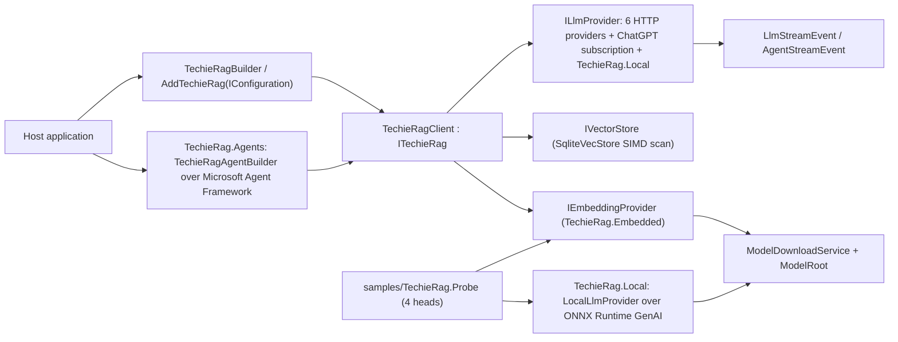

| Layer | Project or folder | What lives here |
|---|---|---|
| Public entry points | `src/TechieRag/TechieRagBuilder.cs`, `src/TechieRag/DependencyInjection/` | builder methods, `AddTechieRag(IConfiguration)` through `TechieRagConfigMapper` |
| Providers and routing | `src/TechieRag/Providers/`, `src/TechieRag/Services/LlmProviderFactory.cs`, `ModelRouter.cs` | the HTTP providers, typed streaming readers, the subscription sign-in provider, the catalog |
| Agentic retrieval | `src/TechieRag/Agentic/` | the knowledge-base tools both agent loops bind |
| Agents package | `src/TechieRag.Agents/` | `TechieRagAgentBuilder`, `TechieRagAgent`, the seam adapters in `Interop/` |
| Embedded models | `src/TechieRag.Embedded/` | ONNX embedding and reranking, `ModelDownloadService`, `EmbeddedModel`, `buildTransitive/TechieRag.Embedded.targets` |
| Local model | `src/TechieRag.Local/` | `LocalLlmProvider`, `LocalModelStore`, `MemoryGate`, the ONNX Runtime GenAI runtime, `buildTransitive/TechieRag.Local.targets` |
| Connectors and web | `src/TechieRag/Connectors/`, `src/TechieRag/Web/` | `ConnectorRunner`, repository and email connectors, the SSRF-guarded fetcher |
| Telemetry | `src/TechieRag.Telemetry/` | `AddTechieRagTelemetry`, packed by both publish workflows |
| Sample and CI | `samples/TechieRag.Probe/`, `.github/workflows/probe.yml` | the four-head probe, its scripts, the CI that builds every head |
| Tests | `tests/TechieRag.Tests`, `tests/TechieRag.Local.Tests`, `tests/TechieRag.Agents.Tests` | 1,097 tests; each entry names the file that covers it |

## Screen-by-screen code map

### Registration and the model catalogue: `UseLocalLlm`, `LocalLlm`, `LocalModel` (`TechieRag.Local`)

The probe constructs `LocalLlmProvider` directly rather than through the builder; the builder path is covered by tests in tests/TechieRag.Local.Tests.

**Runtime:** `static-only (unconfirmed)`. The probe reaches only `LocalModel.PlatformDefault`; the overloads, `LocalLlm.Register` and the `local/<model>` route are proven by `LocalRegistrationTests` and `LocalModelCatalogTests`.

**Call chain:** `LocalLlmBuilderExtensions.UseLocalLlm(builder, configure)` → `UseLocalLlm(builder, LocalModel.PlatformDefault, configure)` → `LocalModel.EnsureSupported` → `LocalLlm.Register` → `LocalLlmProviderRegistry.Register` (core) → `TechieRagBuilder.UseCustomLlmProvider(() => new LocalLlmProvider(options, logger))`. Configuration route: `LlmProviderFactory` (`src/TechieRag/Llm/LlmProviderFactory.cs:81`, the `LlmSource.Local` arm) → `LocalLlmProviderRegistry.Create` → `LocalLlm.Create` → `LocalLlm.RequireModel` → `LocalModel.FromId`.

`UseLocalLlm()` picks the platform default: Qwen2.5 0.5B Instruct on phones, Phi-3 mini 4k Instruct on desktops and Mac Catalyst. The string overload takes a catalogue id; the `DirectoryInfo` overload a host-filled folder, with no download or terms. All end in the `LocalModel` overload: refuse Phi-3 on a phone, write `LlmSource.Local` and the model id into the config, hand the builder a provider factory. Nothing touches network or disk until the first call.

`LocalModel` is the catalogue: two models pinned to Hugging Face commits, every file with size and SHA-256. `FromHuggingFace` names any other GenAI model, starting empty with `ContextLength` 0, and restores an earlier resolution from disk offline. Without `LocalLlm.Register`, a model named in `IConfiguration` makes the core's factory throw.

| File and line | Function | Watch | Expected value |
|---|---|---|---|
| `src/TechieRag.Local/LocalLlmBuilderExtensions.cs:77` | `UseLocalLlm(builder, model, configure)` | `model.RunsOnPhones` | `NotSupportedException` only for Phi-3 on a phone |
| `src/TechieRag.Local/LocalLlmBuilderExtensions.cs:85` | `UseLocalLlm(builder, model, configure)` | `config.Llm.Source`, `config.Llm.Model` | `LlmSource.Local`, the model id; `Endpoint` and `ApiKey` null |
| `src/TechieRag.Local/LocalLlm.cs:56` | `LocalLlm.RequireModel` | `LocalModel.FromId(modelId)` | a catalogue model, or `ArgumentException` listing known ids |
| `src/TechieRag.Local/LocalModel.cs:154` | `LocalModel.PlatformDefault` | `IsPhonePlatform` | true on Android and real iOS; false on Catalyst and desktops |
| `src/TechieRag.Local/LocalModel.cs:284` | `LocalModel.FromHuggingFace(repository, folder, version, modelRoot)` | `source.Id`, `contextLength` | `owner/name[/folder]`; 0 until `genai_config.json` exists |

**Calculations on this service:** `LocalModel.DefaultContextSize` (`src/TechieRag.Local/LocalModel.cs:338`): min(model context length, 2,048 on a phone or 4,096 elsewhere); `LocalModelVariant.DownloadBytes` (`src/TechieRag.Local/Runtime/LocalModelVariant.cs:23`) sums file sizes: Qwen 332,589,148 ("333 MB"), Phi-3 2,725,536,824 ("2.7 GB").

### Terms, download and verification: `LocalModelStore` and `ModelDownloadService` (`TechieRag.Local`)

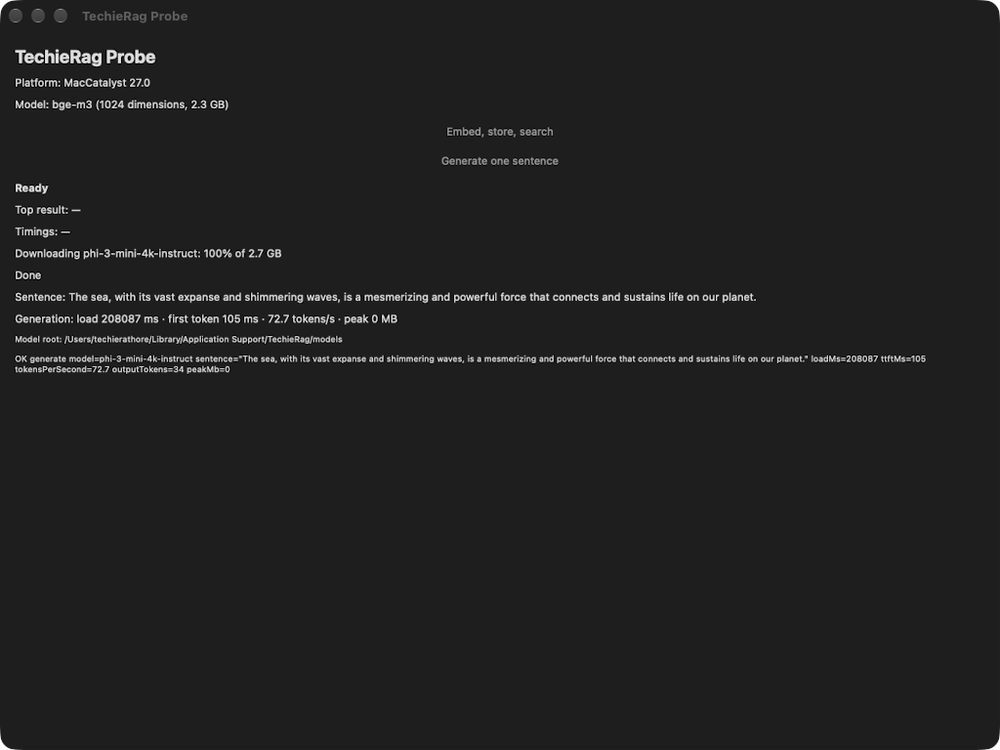

**Runtime:** `renders (probe Mac Catalyst head, 2026-09-25)`.

**Call chain:** `LocalLlmProvider.LoadAsync` → `LocalModelStore.PrepareAsync` (Hugging Face names only: `HuggingFaceHub.ResolveAsync` → `HuggingFaceSnapshot.WriteManifest` → `HuggingFaceResolution.WritePin`) → `LocalLlmProvider.Resolve` → `LocalModelStore.EnsureAsync` → `LocalModelVariant.IsOnDisk` → `LocalModelVariant.GetDownloadFiles(mirror)` → `LocalModelStore.RequireTermsAsync` → `LocalLlmOptions.ConfirmTermsAsync` → `ModelDownloadService.DownloadAsync` → `DownloadFileAsync` (writes `<file>.part`, then renames) → `LocalModelStore.VerifyAsync` → `HashAsync` or `HashGitBlobAsync` → writes `.techierag-verified`.

`LocalModelStore` is internal; the host sees `LoadAsync`, the `ConfirmTermsAsync` callback and three exceptions. The order is fixed: terms, bytes, hashes. A missing or wrong-size file makes the store build a `LocalModelTerms` and ask; `TermsAccepted = true` skips the callback, and a false or missing answer throws `LocalModelTermsNotAcceptedException` before any request.

`ModelDownloadService` (`TechieRag.Embedded`) resumes a `.part` file with a range request. `TECHIERAG_MODEL_BASE_URL` redirects catalogue models only; a Hugging Face name uses its pinned `resolve/<commit>` address. Hashes are SHA-256, or git blob SHA-1 for small Hugging Face files; a mismatch deletes the file and throws `LocalModelIntegrityException`. Passed files go into `.techierag-verified`, so later starts re-hash only changes. An unpinned Hugging Face name is resolved once into `<root>/hf--owner--name[@version].pin`.

| File and line | Function | Watch | Expected value |
|---|---|---|---|
| `src/TechieRag.Local/LocalLlmProvider.cs:182` | `LoadAsync` | `mirror` | `TECHIERAG_MODEL_BASE_URL` for catalogue models; null for Hugging Face |
| `src/TechieRag.Local/LocalModelStore.cs:129` | `EnsureAsync` | `variant.IsOnDisk(directory)` | false on the first run; true afterwards |
| `src/TechieRag.Local/LocalModelStore.cs:176` | `RequireTermsAsync` | `options.TermsAccepted`, `options.ConfirmTermsAsync` | probe: false plus the alert callback; false throws at line 186 |
| `src/TechieRag.Embedded/ModelDownloadService.cs:381` | `DownloadFileAsync` | `resumeFrom` | `.part` length when resuming, else 0; Range at line 386 |
| `src/TechieRag.Local/LocalModelStore.cs:213` | `VerifyAsync` | `actual` against `file.Hash` | equal lower-case hex; mismatch deletes at line 215, throws |

**Calculations on this service:** `ModelDownloadService.GetPendingBytes` (`src/TechieRag.Embedded/ModelDownloadService.cs:257`): incomplete files' expected size minus `.part` length; `LocalModelStore.HashGitBlobAsync` (`src/TechieRag.Local/LocalModelStore.cs:249`): SHA-1 over git blob header plus bytes; `HuggingFaceModelSource.FolderName` (`src/TechieRag.Local/HuggingFace/HuggingFaceModelSource.cs:106`): stem plus commit's first 12 characters.

### Memory check before load: `MemoryGate`, `AvailableMemory`, `LocalModelMemoryException` (`TechieRag.Local`)

**Runtime:** `renders (probe Mac Catalyst head, 2026-09-25)`; the refusal is covered by `MemoryGateTests` and `AvailableMemoryIosTests`.

**Call chain:** `LocalLlmProvider.LoadAsync` → `LocalModel.EstimateMemoryBytes(weightBytes, ContextSize)` → `MemoryGate.Ensure(Model.Id, required)` → `AvailableMemory.Read` → one of `ReadProcMeminfo` (Linux, Android), `ReadWindows` (`GlobalMemoryStatusEx`), `OsProcAvailableMemory` + `FromIosLimit` (iOS), `ReadRuntimeEstimate` (Mac Catalyst, macOS, anything else) → `throw new LocalModelMemoryException` or return → `ILocalLlmRuntime.Load` on the thread pool.

A phone kills a process that allocates past its limit, so the provider estimates the load first: weight files (pinned size, or the folder's size) plus the key/value cache for the context size plus 256 MiB. Catalogue models carry their cache cost per token (Qwen 12,288 bytes, Phi-3 393,216); a Hugging Face model reads it from `genai_config.json`.

If nothing could be read, the gate returns null and the load proceeds. On iOS `os_proc_available_memory()` is the room left before the app is killed; the simulator reports 0, which `FromIosLimit` replaces with the .NET estimate (`GC.GetGCMemoryInfo().TotalAvailableMemoryBytes` minus the working set), the figure Mac Catalyst always uses. A refusal names the model, bytes needed, bytes free and the shortfall; both are logged at `LocalLlmProvider.cs:189`.

| File and line | Function | Watch | Expected value |
|---|---|---|---|
| `src/TechieRag.Local/LocalLlmProvider.cs:186` | `LoadAsync` | `weightBytes` | the variant's `DownloadBytes` (Phi-3: 2,725,536,824) |
| `src/TechieRag.Local/LocalLlmProvider.cs:187` | `LoadAsync` | `required` | Phi-3 at 4,096 tokens: 4,604,585,016; Qwen at 2,048: 626,190,428 |
| `src/TechieRag.Local/MemoryGate.cs:31` | `MemoryGate.Ensure` | `available` | bytes free, or null (load proceeds) |
| `src/TechieRag.Local/AvailableMemory.cs:41` | `AvailableMemory.Read` | `OsProcAvailableMemory()` | non-zero on a real iPhone; 0 on simulator |
| `src/TechieRag.Local/AvailableMemory.cs:66` | `ReadRuntimeEstimate` | `info.TotalAvailableMemoryBytes - Environment.WorkingSet` | the Catalyst figure; never below 0 |

**Calculations on this service:** `LocalModel.EstimateMemoryBytes` (`src/TechieRag.Local/LocalModel.cs:348`): weights + KvBytesPerToken × contextSize + 256 MiB; `GenAiConfigInfo.Parse` (`src/TechieRag.Local/Runtime/GenAiConfigInfo.cs:60`): KvBytesPerToken = layers × kvHeads × headSize × 2 × elementBytes (2 unless `kv_cache_dtype` differs); `AvailableMemory.ParseMemAvailable` (`src/TechieRag.Local/AvailableMemory.cs:72`): `MemAvailable` kilobytes × 1,024.

### Generation, streaming and typed answers: `LocalLlmProvider` over `OnnxGenAiModel` (`TechieRag.Local`)

**Runtime:** `renders (probe Mac Catalyst head, 2026-09-25)` for `ChatStreamEventsAsync`; `CompleteAsync<T>` is `static-only (unconfirmed)`, covered by `TypedAnswerSchemaTests` and `LocalLlmProviderTests`.

**Call chain:** `LocalLlmProvider.ChatStreamEventsAsync` → `StreamCoreAsync` → `RefuseUnsupported` → `LoadAsync` → `PrepareConversation` → `ChatTemplateFormatter.Format` (or `OnnxGenAiModel.ApplyChatTemplate`) → `OnnxGenAiModel.CountTokens` → `BuildSettings` → `OnnxGenAiModel.GenerateAsync` → `OnnxGenAiSearchOptions.From` → `CreateParameters` (`GeneratorParams.SetSearchOption`, `SetGuidance`) → `Generator.AppendTokenSequences` → `NextToken` (`generator.GenerateNextToken`) → `TokenizerStream.Decode` → `DecodedText.Clean` → `StopSequenceFilter.Push` → `LlmStreamEvent.FromText` / `FromCompleted`. `CompleteAsync<T>` → `TypedAnswerSchema.For(typeof(T))` → `ChatAsync` (same core, non-streaming) → `StripCodeFence` → `JsonSerializer.Deserialize<T>`.

Every `ILlmProvider` member funnels into `StreamCoreAsync`: refuse tools or a foreign per-call model, load, apply the system prompt and any JSON instruction, render the template, count the prompt (no room for an answer token throws `LocalPromptTooLongException`), merge options over the defaults (512 tokens, temperature 0.7, top-p 0.95), clamp `MaxTokens` to the room left. A semaphore allows one answer at a time; each token is computed on the thread pool, decoded, stop-filtered and yielded as a `TextDelta`. `CompleteAsync<T>` constrains decoding to a strict JSON schema of `T`; without native guidance it throws once, then relies on strict parsing.

| File and line | Function | Watch | Expected value |
|---|---|---|---|
| `src/TechieRag.Local/LocalLlmProvider.cs:349` | `StreamCoreAsync` | `promptTokens` | below `ContextSize`, else throws at line 351 |
| `src/TechieRag.Local/LocalLlmProvider.cs:441` | `BuildSettings` | `MaxTokens` | min(call's `MaxTokens` or 512, room left); probe 64 |
| `src/TechieRag.Local/Runtime/OnnxGenAiSearchOptions.cs:54` | `OnnxGenAiSearchOptions.From` | `greedy` | true when temperature ≤ 0 (the probe) |
| `src/TechieRag.Local/Runtime/OnnxGenAiModel.cs:80` | `GenerateAsync` | `token` | one token id per loop; decoded at line 81 |
| `src/TechieRag.Local/LocalLlmProvider.cs:383` | `StreamCoreAsync` | `finishReason` | `"stop"` on a stop or end token; `"length"` at `MaxTokens` |
| `src/TechieRag.Local/LocalLlmProvider.cs:291` | `CompleteAsync<T>` | `content` | fence-stripped JSON into `T`; `JsonException` becomes `InvalidOperationException` |

**Calculations on this service:** `OnnxGenAiSearchOptions.From` (`src/TechieRag.Local/Runtime/OnnxGenAiSearchOptions.cs:56`): `max_length` = min(contextSize, promptTokens + max(1, MaxTokens)); `RepetitionPenaltyFrom` (line 79): clamp(1 + (frequency + presence) / 2, 0.5, 2), null when neither set; usage at `LocalLlmProvider.cs:384`: prompt tokens in, tokens produced out.

### Chat templates and stop sequences: `ChatTemplateFormatter`, `LocalChatTemplate`, `StopSequenceFilter` (`TechieRag.Local`)

**Runtime:** `renders (probe Mac Catalyst head, 2026-09-25)` for the Phi-3 template and the `"\n"` stop; the rest is covered by `ChatTemplateFormatterTests`, `ModelDefinedTemplateTests` and `StopSequenceFilterTests`.

**Call chain:** `LocalLlmProvider.StreamCoreAsync` → `PrepareConversation` → `ChatTemplateFormatter.Format(Model.ChatTemplate, conversation)` → `AppendTurn` per message → `AppendAssistantOpening`; for `LocalChatTemplate.ModelDefined`: `ChatTemplateFormatter.ToMessagesJson` → `OnnxGenAiModel.ApplyChatTemplate` → `Tokenizer.ApplyChatTemplate`. Stops: `LocalLlmProvider.BuildSettings` → `ChatTemplateFormatter.EndOfTurn` → `new StopSequenceFilter(settings.StopSequences)` → `Push` per decoded piece → `FirstStopIndex` / `IsPrefixOfStop` → `Flush` at the end.

The template is applied in managed code so the same characters reach the engine on every platform (REQ-RAG-058). Four fixed templates ship: ChatML (Qwen), Phi-3, Llama 3 and Gemma; roles normalise to system, user or assistant and the formatter ends by opening the assistant's turn. `ModelDefined` (Hugging Face models) sends a `[{"role","content"}]` array to GenAI's `Tokenizer.ApplyChatTemplate`, system messages joined and same-role neighbours merged. Each template's end-of-turn marker joins the caller's stop list; the filter cuts at the first stop, never streaming part of one, and `ModelDefined` relies on the engine's end token.

| File and line | Function | Watch | Expected value |
|---|---|---|---|
| `src/TechieRag.Local/ChatTemplateFormatter.cs:120` | `AppendTurn` (Phi-3 case) | `builder` | `<\|user\|>\nWrite one sentence about the sea.<\|end\|>\n`, then `<\|assistant\|>\n` (line 139) |
| `src/TechieRag.Local/ChatTemplateFormatter.cs:57` | `EndOfTurn` | the return | `<\|end\|>` for Phi-3, `<\|im_end\|>` for ChatML, `<end_of_turn>` for Gemma, null for `ModelDefined` |
| `src/TechieRag.Local/ChatTemplateFormatter.cs:93` | `ToMessagesJson` | `turns[^1].Role == role` | true for same-role neighbours (joined) |
| `src/TechieRag.Local/StopSequenceFilter.cs:40` | `Push` | `cut` | −1 until a stop; its index sets `Stopped` |
| `src/TechieRag.Local/StopSequenceFilter.cs:48` | `Push` | `keep` | at most `longest − 1`, shrunk to a prefix of some stop |

**Calculations on this service:** `StopSequenceFilter.Push` (`src/TechieRag.Local/StopSequenceFilter.cs:48`): keep = min(text length, longest stop − 1), decremented while the tail is not a prefix of any stop; the probe's list `["\n", "<|end|>"]` (`src/TechieRag.Local/LocalLlmProvider.cs:447`) holds at most six characters.

### The probe's second button: `LocalProbeRunner`, `PeakMemory`, `GenerationResult` (`samples/TechieRag.Probe`)

**Runtime:** `renders (probe Mac Catalyst head, 2026-09-25)`.

**Call chain:** `MainPage.GenerateAsync` (the `RunGenerateButton` click, or `OnAppearing` when `ProbeLaunch.AutoRunLocal` is set by `TECHIERAG_PROBE_AUTORUN=local` or the Android extra `autorunlocal`) → `Task.Run(localRunner.RunAsync)` → `new LocalLlmProvider(new LocalLlmOptions { ConfirmTermsAsync })` → `LocalLlmProvider.LoadAsync` (first run: `MainPage.ConfirmTermsAsync` → `DisplayAlertAsync`, then the download) → `LocalLlmProvider.ChatStreamEventsAsync` → `PeakMemory.ReadBytes` → `ProcPidRusage` (Apple) or `Process.PeakWorkingSet64` → `new GenerationResult(...)` → `MainPage.Report` (console line prefixed `TECHIERAG_PROBE_RESULT:`, plus `probe-result.txt`).

The runner uses the package as an app would: platform default model, terms through the callback, provider kept between presses so a second press measures a warm model. The prompt is "Write one sentence about the sea." with `MaxTokens` 64, temperature 0 and a newline stop. Load time wraps `LoadAsync`; time to first token runs to the first `TextDelta`; tokens per second excludes that token. Peak memory is `Process.PeakWorkingSet64` except on iOS and Mac Catalyst, where .NET reports 0, so `PeakMemory` calls `proc_pid_rusage` with `RUSAGE_INFO_V4` and reads `ri_lifetime_max_phys_footprint`.

| File and line | Function | Watch | Expected value |
|---|---|---|---|
| `samples/TechieRag.Probe/LocalProbeRunner.cs:43` | `RunAsync` | `loadMs` | first press: terms + download + load; second: milliseconds (`LocalLlmProvider.cs:164`) |
| `samples/TechieRag.Probe/LocalProbeRunner.cs:54` | `RunAsync` | `firstTokenMs` | set once at the first `TextDelta`; Catalyst: 110 to 520 ms |
| `samples/TechieRag.Probe/LocalProbeRunner.cs:66` | `RunAsync` | `tokensPerSecond` | (outputTokens − 1) / ((totalMs − ttft) / 1000); Catalyst 65 to 73 |
| `samples/TechieRag.Probe/PeakMemory.cs:58` | `ReadApplePeakFootprint` | the `UInt64` at byte offset 16 + 28 × 8 | `ri_lifetime_max_phys_footprint`; Catalyst 1.96 to 2.17 GB; line 39 elsewhere |
| `samples/TechieRag.Probe/GenerationResult.cs:25` | `Timings` | the string | `load N ms · first token N ms · N.N tokens/s · peak N MB` |

**Calculations on this service:** tokens per second and time to first token as above (`LocalProbeRunner.cs:65` to `66`); peak MB (`GenerationResult.cs:26`, `:31`) divides by 1,048,576 while `ModelDownloadService.FormatBytes` uses decimal units, so the two "MB" figures differ by about 5 percent.
### Probe screen: MainPage (`samples/TechieRag.Probe`)

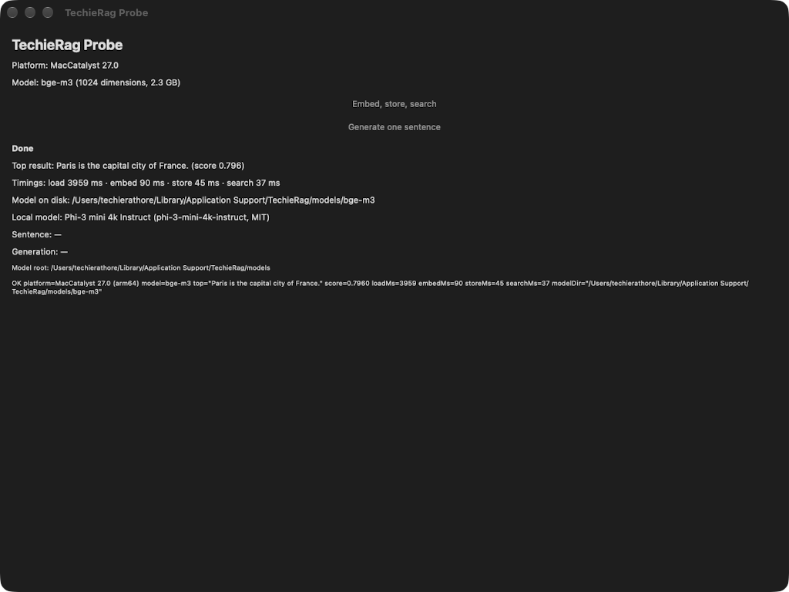

**Runtime:** `renders (probe Mac Catalyst head and iOS simulator, 2026-09-25)`

**Call chain:** `MainPage.OnAppearing` → `MainPage.RunAsync` → `ProbeRunner.RunAsync` → `EmbeddedEmbeddingProvider.CreateDefault` → `EmbeddedEmbeddingProvider.InitializeAsync` → `EmbeddedEmbeddingProvider.EmbedBatchAsync` → `SqliteVecStore.UpsertBatchAsync` → `SqliteVecStore.SearchAsync` → `ProbeResult.ToLine` → `MainPage.Report`

One MAUI page built in code, no XAML. Every control carries an `AutomationId`; the Windows, Android and Apple drivers find controls by that id, never by position.

`RunAsync` disables the button, sets `StatusLabel` to `Running`, runs `ProbeRunner.RunAsync` on a worker thread, fills the labels from the returned `ProbeResult` and sets `Done`; an exception sets `Error: …` and `FAIL <type>: <message>`. `Report` then writes the line to the console with the prefix `TECHIERAG_PROBE_RESULT:` and to `probe-result.txt`; the emulator script greps logcat for that prefix.

CI presses the button through autorun: `OnAppearing` calls `RunAsync` once when `TECHIERAG_PROBE_AUTORUN=1` or the Android intent extra `--ez autorun true` is set.

| File and line | Function | Watch | Expected value |
|---|---|---|---|
| `samples/TechieRag.Probe/MainPage.cs:36` | `MainPage` constructor | `runButton.AutomationId` | `RunEmbedButton`; line 47 is `RunGenerateButton` |
| `samples/TechieRag.Probe/MainPage.cs:105` | `OnAppearing` | `ProbeLaunch.AutoRun` | `true` only with `TECHIERAG_PROBE_AUTORUN=1` or the Android `autorun` extra |
| `samples/TechieRag.Probe/MainPage.cs:122` | `RunAsync` | `result.TopResult` | `Paris is the capital city of France.`, score near 0.80 (bge-m3) or 0.82 (MiniLM) |
| `samples/TechieRag.Probe/MainPage.cs:181` | `Report` | `ProbeLaunch.ResultPrefix` | `TECHIERAG_PROBE_RESULT:` then a space and the line |
| `samples/TechieRag.Probe/ProbeRunner.cs:50` | `ProbeRunner.RunAsync` | `store` | `SqliteVecStore` on `<app data>/probe.db`, `Pooling=False`, cleared before the upserts |
| `samples/TechieRag.Probe/ProbeResult.cs:35` | `ProbeResult.ToLine` | return | `OK platform=… model=… top="…" score=0.7960 loadMs=… embedMs=… storeMs=… searchMs=… modelDir="…"` |

**Calculations on this service:** `ProbeRunner.RunAsync` (`ProbeRunner.cs:40-69`) times four phases with one restarted `Stopwatch`: load (provider creation, including any download), embed, store and search (`SearchAsync`, `topK: 1`). `ProbeResult.Timings` (`ProbeResult.cs:29`) formats them as `load N ms · embed N ms · store N ms · search N ms`, invariant culture.

### Model root and the phone default: ModelRoot, EmbeddedModel, UseEmbedded (`TechieRag`, `TechieRag.Embedded`)

**Runtime:** `renders (probe Mac Catalyst head and iOS simulator, 2026-09-25)`

**Call chain:** `TechieRagBuilderExtensions.UseEmbedded` → `EmbeddedModel.PlatformDefault` → `EmbeddedModel.DefaultFor` → `TechieRagBuilderExtensions.UseEmbedded(builder, model, isPhone)` → `EmbeddedModel.EnsureSupported` → `EmbeddedEmbeddingProvider` constructor; later `EmbeddedModel.ResolveDirectory` → `EmbeddedModel.GetModelDirectory` → `ModelRoot.GetModelDirectory` → `ModelRoot.Current` → `ModelRoot.DefaultPath` → `ModelRoot.ComputeDefault`

`EmbeddedModel` has two entries: `BgeM3` (1024 dimensions, five files, 2.3 GB, `runsOnPhones: false`) and `MiniLM` (384 dimensions, two files, 91 MB, allowed everywhere). `PlatformDefault` picks MiniLM when `IsPhonePlatform` is true: Android, or iOS but not Mac Catalyst, where `OperatingSystem.IsIOS()` also answers true. `UseEmbedded(EmbeddedModel.BgeM3)` on a phone reaches `EnsureSupported`, which throws `NotSupportedException` (REQ-RAG-054). The chosen name lands in `config.Embedding.Model`.

`ModelRoot` is the one folder every local model lives under (REQ-RAG-053), `<root>/<model name>`. `Current` resolves `ModelRoot.Set`, then `TECHIERAG_MODEL_ROOT`, then `DefaultPath`, normally `<LocalApplicationData>/TechieRag/models`. On iOS and Mac Catalyst .NET reports `Documents` as `LocalApplicationData`, so `ComputeDefault` uses `<home>/Library/Application Support` there. `ResolveDirectory` still honours a complete copy next to the assembly.

| File and line | Function | Watch | Expected value |
|---|---|---|---|
| `src/TechieRag.Embedded/EmbeddedModel.cs:97` | `IsPhonePlatform` | return | `true` on Android and iOS proper; `false` on Mac Catalyst, Windows, macOS, Linux |
| `src/TechieRag.Embedded/EmbeddedModel.cs:177` | `EnsureSupported` | `isPhone && !RunsOnPhones` | `true` only for bge-m3 on a phone; line 179 throws naming `2.3 GB` |
| `src/TechieRag.Embedded/TechieRagBuilderExtensions.cs:63` | `UseEmbedded(builder, model, isPhone)` | `config.Embedding.Model` | `bge-m3` on desktops, `all-minilm-l6-v2` on phones |
| `src/TechieRag/Models/ModelRoot.cs:65` | `Current` | `configured` | the `ModelRoot.Set` path, or `null` |
| `src/TechieRag/Models/ModelRoot.cs:71` | `Current` | `fromEnvironment` | `TECHIERAG_MODEL_ROOT` when set, made absolute at line 74 |
| `src/TechieRag/Models/ModelRoot.cs:132` | `ComputeDefault` | `baseFolder` | `<home>/Library/Application Support` on iOS and Catalyst; `LocalApplicationData` elsewhere; else `~/.local/share` or temp |

**Calculations on this service:** `EmbeddedModel.DownloadBytes` (`EmbeddedModel.cs:112`) sums the catalogue's per-file byte counts (2,289,798,201 for bge-m3, 90,636,722 for MiniLM); `DownloadSize` formats it through `ModelDownloadService.FormatBytes`, giving "2.3 GB" and "91 MB".

### Download size, decline and resume: ModelDownloadService (`TechieRag.Embedded`)

**Runtime:** `renders (probe Mac Catalyst head and iOS simulator, 2026-09-25)`

**Call chain:** `EmbeddedEmbeddingProvider.InitializeAsync` → `EmbeddedModel.ResolveDirectory` → `EmbeddedModel.GetDownloadFiles` → `ModelDownloadService.DownloadAsync` → `ModelDownloadService.GetPendingBytes` → `DownloadSizeKnown` handlers → `ModelDownloadService.DownloadFileAsync` → `ModelDownloadService.ReportBytes` → `ModelDownloadService.UpdateProgress` → `ProgressChanged` handlers

`ModelDownloadService.Instance` is process-wide; a host subscribes once for every download. `DownloadAsync` takes a model name, a folder and `ModelDownloadFile` records, serialised through a semaphore.

REQ-RAG-055 is kept in `DownloadAsync`. A file at 95 percent or more of its expected length counts as complete; nothing missing reports `Completed` without a request. Otherwise it publishes `Checking` with `TotalBytes` and raises `DownloadSizeKnown`; a handler may set `Decline`, which resets the status to `NotStarted` and throws `ModelDownloadDeclinedException` (an `OperationCanceledException`) before any HTTP request.

`DownloadFileAsync` writes `<name>.part`; an existing part file's length becomes `resumeFrom` and a `Range` header. `206` appends, `200` starts over, `416` means the part is whole and is renamed. Progress fires at most every 250 ms; the events are the only output.

| File and line | Function | Watch | Expected value |
|---|---|---|---|
| `src/TechieRag.Embedded/ModelDownloadService.cs:289` | `DownloadAsync` | `pending` | files under 95 percent of expected size; empty means `Completed` |
| `src/TechieRag.Embedded/ModelDownloadService.cs:302` | `DownloadAsync` | `totalBytes` | bytes still missing, `.part` lengths subtracted |
| `src/TechieRag.Embedded/ModelDownloadService.cs:316` | `DownloadAsync` | `sizeKnown.Decline` | `false` continues; `true` throws before any request |
| `src/TechieRag.Embedded/ModelDownloadService.cs:381` | `DownloadFileAsync` | `resumeFrom` | length of `<file>.part`, or 0 |
| `src/TechieRag.Embedded/ModelDownloadService.cs:402` | `DownloadFileAsync` | `resumed` | `true` only on a `206`; otherwise the part file restarts at byte 0 |
| `src/TechieRag.Embedded/ModelDownloadService.cs:438` | `DownloadFileAsync` | `File.Move` | `<file>.part` renamed to `<file>` after the last byte |

**Calculations on this service:** `GetPendingBytes` (`ModelDownloadService.cs:257`) sums `ExpectedBytes` minus the part-file length over incomplete files; `ModelDownloadProgress.OverallBytesProgressPercent` (`ModelDownloadService.cs:50`) is `BytesDownloaded / TotalBytes` capped at 100; `FormatBytes` (`ModelDownloadService.cs:359`) uses decimal units, one decimal for GB only.

### SQLite exact search: SqliteVecStore.SearchAsync (`TechieRag`)

**Runtime:** `renders (probe Mac Catalyst head and iOS simulator, 2026-09-25)`

**Call chain:** `SqliteVecStore.SearchAsync` → `SqliteVecStore.ScoreAllChunks` → `raw.sqlite3_step` / `raw.sqlite3_column_blob` → `ManagedVectorSearch.CosineSimilarity` → `ManagedVectorSearch.DotAndSquares` → `ManagedVectorSearch.TopKCollector.Add` → `ManagedVectorSearch.TopKCollector.ToRankedList` → `SqliteConnection.QueryAsync` (winners' rows)

REQ-RAG-056 drops sqlite-vec, a native extension phones and the Catalyst sandbox do not load; the managed scan is the only path, exact, in two passes.

Pass one reads `rowid` and the `Vector` BLOB through SQLitePCL's raw API; `MemoryMarshal.Cast` reads the blob span as `float32` in place. One SIMD pass over `Vector<float>` lanes accumulates the dot product and the stored sum of squares. A width mismatch or a zero vector scores 0.

`TopKCollector` is a worst-first `PriorityQueue` bounded at `topK`; a candidate replaces the worst only when strictly better. Pass two fetches full rows for the winning ids only; a row deleted between the passes is dropped.

| File and line | Function | Watch | Expected value |
|---|---|---|---|
| `src/TechieRag/VectorStores/SqliteVecStore.cs:342` | `ScoreAllChunks` | `sql` | `SELECT rowid, Vector FROM Chunks WHERE Vector IS NOT NULL`, plus `AND DocumentId = ?1` when filtered |
| `src/TechieRag/VectorStores/SqliteVecStore.cs:373` | `ScoreAllChunks` | `stored` | `ReadOnlySpan<float>` over SQLite's row buffer, stored dimensions long |
| `src/TechieRag/VectorStores/SqliteVecStore.cs:374` | `ScoreAllChunks` | `score` | cosine similarity in [-1, 1]; 0 for a width mismatch or zero vector |
| `src/TechieRag/VectorStores/ManagedVectorSearch.cs:63` | `DotAndSquares` | `Vector.IsHardwareAccelerated` | `true` on every probe head; line 77 handles the remainder |
| `src/TechieRag/VectorStores/ManagedVectorSearch.cs:121` | `TopKCollector.Add` | `Compare(candidate, heap.Peek())` | positive only when the candidate beats the worst kept row |
| `src/TechieRag/VectorStores/SqliteVecStore.cs:308` | `SearchAsync` | `byRowId` | one `ChunkRow` per winner still present, in collector order |

**Calculations on this service:** cosine similarity `dot(q, s) / (|q| · |s|)` with `|q|` from `Magnitude` (`ManagedVectorSearch.cs:25`) and `|s|` from the same pass as the dot product (`ManagedVectorSearch.cs:56`); the bounded top-K heap (`ManagedVectorSearch.cs:93`). Benchmark: 50,000 chunks of 1024 dimensions in 238.2 ms, 1,896.4 ms before, top-10 identical.

### Native ONNX Runtime wiring: TechieRag.Embedded.targets and TechieRag.Local.targets (`TechieRag.Embedded`, `TechieRag.Local`)

**Runtime:** `renders (probe Mac Catalyst head and iOS simulator, 2026-09-25)`

**Call chain:** `TechieRag.Probe.csproj` `<Import>` (or NuGet's buildTransitive import) → property group `_TechieRagWireOnnx` → `NativeReference` item (Mac Catalyst) → target `TechieRagCheckOnnxXcframework` → target `TechieRagEnsureOnnxAndroidLibrary` → target `TechieRagBuildOnnxCustomOpsStub` → `xcrun clang` and `xcrun ar`

REQ-FN-055 puts the native wiring in a `buildTransitive` targets file; the probe imports it by path (`TechieRag.Probe.csproj:68`).

**Mac Catalyst:** ONNX Runtime ships an empty placeholder, so the targets add the static `NativeReference` to `onnxruntime.xcframework.zip` (`ForceLoad`, `-lc++`, CoreML weak), erroring when the zip is absent. **Android:** the targets add `onnxruntime.aar` as an `AndroidLibrary` when the package did not, erroring if absent. **iOS and Catalyst Debug:** a `RegisterCustomOps` stub is compiled with `xcrun clang` and linked; Debug does not trim that unused P/Invoke and no shipped binary defines it.

The Local file repeats the Catalyst and Android parts for GenAI 0.16.0 (ORTGENAI-001), no stub. Switches: `TechieRagOnnxRuntimeVersion` / `TechieRagOnnxRuntimeGenAIVersion` pin versions; `TechieRagDisableOnnxNativeWiring` / `TechieRagDisableLocalNativeWiring` disable a file; `TechieRagDisableOnnxCustomOpsStub` skips the stub; all off for `OutputType=Library`.

| File and line | Function | Watch | Expected value |
|---|---|---|---|
| `src/TechieRag.Embedded/buildTransitive/TechieRag.Embedded.targets:40` | property group | `TechieRagOnnxRuntimeVersion` | `1.30.0` unless the app set it (`EmbeddedPackagingTests` checks the PackageReference) |
| `src/TechieRag.Embedded/buildTransitive/TechieRag.Embedded.targets:44` | property group | `_TechieRagWireOnnx` | `true` for an app unless `TechieRagDisableOnnxNativeWiring` is `true` |
| `src/TechieRag.Embedded/buildTransitive/TechieRag.Embedded.targets:52` | `NativeReference` (Mac Catalyst) | `Include` | `<NuGetPackageRoot>/microsoft.ml.onnxruntime/1.30.0/runtimes/ios/native/onnxruntime.xcframework.zip` |
| `src/TechieRag.Embedded/buildTransitive/TechieRag.Embedded.targets:76` | `TechieRagEnsureOnnxAndroidLibrary` | `Error` condition | fires only when no `onnxruntime.aar` is in `@(AndroidLibrary)` or on disk |
| `src/TechieRag.Embedded/buildTransitive/TechieRag.Embedded.targets:101` | `TechieRagBuildOnnxCustomOpsStub` | `Exec Command` | `xcrun clang -target <arch>-apple-ios<min><env> -c onnx-customops-stub.c` then `xcrun ar rcs`, Debug only |
| `src/TechieRag.Local/buildTransitive/TechieRag.Local.targets:37` | property group | `TechieRagOnnxRuntimeGenAIVersion` | `0.16.0` unless the app set it (`LocalPackagingTests`) |

**Calculations on this service:** none beyond MSBuild evaluation; the clang triple is assembled at `TechieRag.Embedded.targets:88-94` from the `RuntimeIdentifier` suffix, the platform and `SupportedOSPlatformVersion` (default 15.0).

### CI and the scripts: probe.yml, select-xcode.sh, run-android-emulator.sh, Invoke-ProbeWindows.ps1 (`.github/workflows`, `samples/TechieRag.Probe/scripts`)

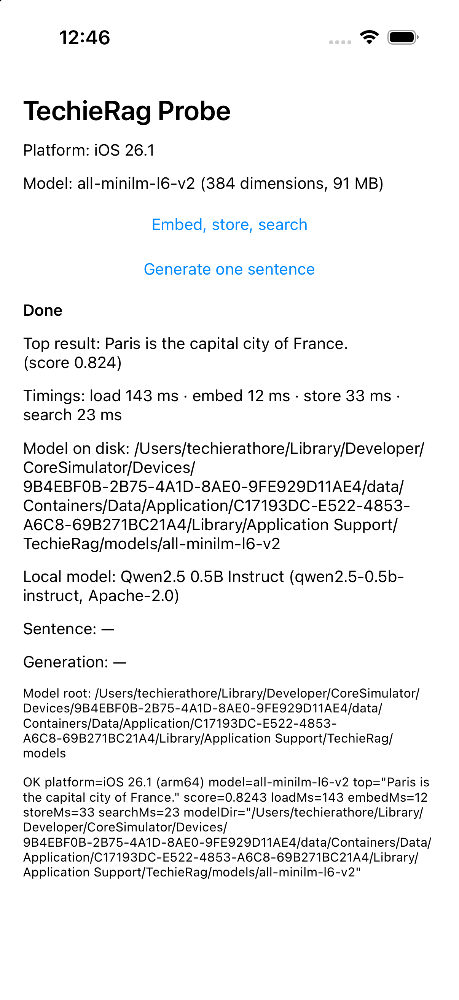

CI itself has no screen; its run page is the evidence (run 36152358243), and the workflow is covered by tests in tests/TechieRag.Tests.

**Runtime:** `static-only (unconfirmed)`

**Call chain:** `probe.yml` jobs `windows`, `android`, `maccatalyst`, `ios` (in parallel) → `report`; per job `dotnet workload install` → (Apple) `select-xcode.sh` → `dotnet build -f <head> -p:ProbeHead=<head>` → (Windows) `Invoke-ProbeWindows.ps1` / (Android) `reactivecircus/android-emulator-runner` → `run-android-emulator.sh`

REQ-FN-057: every head is built and reported on every push. One job per head, then a `report` job that always runs, writes a `Probe heads` table to the step summary and exits non-zero unless all four builds succeeded.

Apple jobs run on `macos-26`. `select-xcode.sh` reads the newest `Microsoft.iOS.Sdk` or `Microsoft.MacCatalyst.Sdk` pack for the Xcode major.minor .NET demands, selects `/Applications/Xcode_<wanted>.app` when it exists, and otherwise writes `PROBE_BUILD_FLAGS=-p:ValidateXcodeVersion=false` to `$GITHUB_ENV`.

`run-android-emulator.sh` installs the APK, starts the activity with `--ez autorun true` and polls logcat every five seconds for the last `TECHIERAG_PROBE_RESULT:` line until the timeout.

`Invoke-ProbeWindows.ps1` launches the exe, finds its top-level window by process id, invokes `RunEmbedButton` by AutomationId, polls `StatusLabel` until `Done` or `Error`, then reads every label and captures the window. No global input is sent.

| File and line | Function | Watch | Expected value |
|---|---|---|---|
| `.github/workflows/probe.yml:47` | job `windows`, step Build | `-p:ProbeHead` | `net10.0-windows10.0.19041.0`; also lines 80, 124, 142 |
| `.github/workflows/probe.yml:99` | job `android`, emulator step | `script` | `run-android-emulator.sh <apk> probe-artifacts 1500`, with `continue-on-error` |
| `.github/workflows/probe.yml:174` | job `report` | `for r in …` | exits 1 unless all four job results are `success` |
| `samples/TechieRag.Probe/scripts/select-xcode.sh:44` | main | `FLAGS` | `-p:ValidateXcodeVersion=false` when `/Applications/Xcode_<WANT>.app` is absent (`WANT` read at line 27) |
| `samples/TechieRag.Probe/scripts/run-android-emulator.sh:25` | main | exit status | 0 only when the captured line contains `TECHIERAG_PROBE_RESULT: OK` |
| `samples/TechieRag.Probe/scripts/Invoke-ProbeWindows.ps1:88` | main loop | `$status` | exits the loop on `Done…` or `Error…`; line 111 exits 1 unless `Done` |

**Calculations on this service:** none; `select-xcode.sh:24` reduces a version to major.minor, `run-android-emulator.sh:15` derives the deadline from the timeout argument.
### Agent builder and registration (`TechieRag.Agents`)

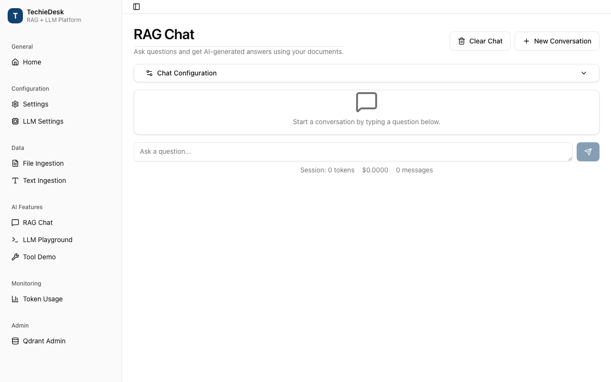

Static-only: the July 2026 Sevak screen that exercised RAG answering; covered by tests in tests/TechieRag.Agents.Tests — `TechieRagAgentBuilderTests.BuiltAgentAnswersFromDocuments`, `ServiceRegistrationTests.AddTechieRagAgentRegistersBoth`.

**Runtime:** static-only (unconfirmed)

**Call chain:** `TechieRagAgentServiceCollectionExtensions.AddTechieRagAgent` → `TechieRagAgentBuilder.Build` → `OpenAICompatibleChatClientFactory.Create` (or `LlmProviderChatClient` for `UseConfiguredLlm`) → `ChatClientAgent` (Microsoft Agent Framework, wrapped by `FunctionInvokingChatClient`) → `TechieRagAgent.AskAsync` → `AIAgent.RunAsync` → `RetrievalContextProvider.GetState` — read from `TechieRagAgentBuilder.cs`, `TechieRagAgentServiceCollectionExtensions.cs` and `TechieRagAgent.cs`.

`TechieRagAgentBuilder` (REQ-RAG-016) builds a MAF agent over a TechieRag knowledge base. Routes: `UseLmStudio`, `UseOllama`, `UseOpenAI` and `UseOpenAICompatible` go through `OpenAICompatibleChatClientFactory` (appends `/v1`, placeholder key `not-needed`; lines 18,35-38,44-49); `UseConfiguredLlm` reuses the instance's `ILlmProvider` and throws at `Build` if absent or unable to call tools (`TechieRagAgentBuilder.cs:113-121`).

`Build` (lines 270-300) wires the retrieval source, the `RetrievalContextProvider` (injects knowledge-base tools per run), the chat client under `UseFunctionInvocation` with `MaximumIterationsPerRequest = maxToolIterations` (default 8), instructions (`AgenticInstructions.Default` plus `DOMAIN GUIDANCE`, line 316), optional `ChatHistoryProvider`, and `AgentStepReporter` under `WithTrace`. `WithPrefetch` adds a `TextSearchProvider` searching before the first model call (lines 323-338).

`AddTechieRagAgent` registers `ITechieRagAgent` as a singleton plus a keyed `AIAgent` `"techierag"`. `AskAsync` runs the turn, then reads the session's `RetrievalTurnState` into `AgentRagResponse.Sources`, `Searches` and `PendingApprovals`. `AskStreamAsync` (`TechieRagAgent.cs:71-90`) yields a `Sources` event with `state.Collected` whenever an update carries a `FunctionResultContent`, a `Token` per text fragment, and one `Completed` with the full answer.

| File and line | Function | Watch | Expected value |
|---|---|---|---|
| `src/TechieRag.Agents/TechieRagAgentBuilder.cs:272-276` | `Build` | `chatClientFactory` | Non-null; null throws "Choose a model first" |
| `src/TechieRag.Agents/TechieRagAgentBuilder.cs:278-283` | `Build` | `source`, `pipeline` | `TechieRagRetrievalSource` unless `UseRetrievalSource` was called; client under the iteration cap |
| `src/TechieRag.Agents/TechieRagAgentBuilder.cs:308-309` | `BuildChatOptions` | `tools` | Handler tools plus `WithTools` extras, or null; knowledge-base tools are not here |
| `src/TechieRag.Agents/DependencyInjection/TechieRagAgentServiceCollectionExtensions.cs:27-38` | `AddTechieRagAgent` | `builder` | Logger factory applied before `configure`; keyed `AIAgent` is `ITechieRagAgent.Agent` |
| `src/TechieRag.Agents/TechieRagAgent.cs:52-63` | `AskAsync` | `state.Collected`, `state.Searches` | Distinct `SearchResult`s and one `RetrievalTrace` per search |

**Calculations on this service:** `TechieRagAgentBuilder.ComposeInstructions` (line 313-318) joins additional guidance with blank lines and appends it to the default or custom instructions; otherwise none.

### Agentic retrieval: the knowledge-base tools (`TechieRag`)

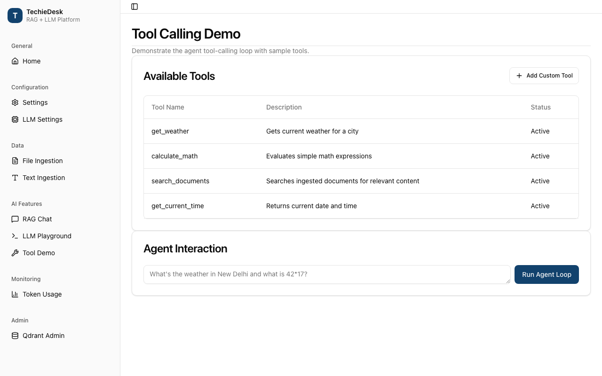

Static-only: the July 2026 Sevak screen that exercised tool calling; covered by tests in tests/TechieRag.Tests — `Agentic/KnowledgeBaseToolsTests` (`RegisteredSearchReturnsRefsScoresAndStatus`) — and tests/TechieRag.Agents.Tests — `TechieRagAgentBuilderTests.SessionKeepsRefsAcrossTurns`.

**Runtime:** static-only (unconfirmed)

**Call chain:** `ToolRegistryKnowledgeBaseExtensions.RegisterKnowledgeBase` → `ToolRegistry.Register` (lambda) → `KnowledgeBaseTools.ExecuteSearchAsync` → `RetrievalTurnState.TryUseSearch` → `IRetrievalSource.SearchAsync` (`TechieRagRetrievalSource` → `ITechieRag.SearchAsync`) → `KnowledgeBaseTools.Classify` → `RetrievalTurnState.Collect` → `RetrievalTurnState.Record` → `KnowledgeBaseTools.BuildResult`. In the MAF agent the same chain starts at `RetrievalContextProvider.ProvideAIContextAsync`, which calls `BeginTurn` and `RegisterKnowledgeBase` on a fresh `ToolRegistry` per run (`src/TechieRag.Agents/Retrieval/RetrievalContextProvider.cs:55-59`).

REQ-RAG-015 lives in the core package, no MAF dependency. `KnowledgeBaseTools` defines `search_knowledge_base` and `list_documents` with JSON schemas (`KnowledgeBaseTools.cs:44-65`); `RegisterKnowledgeBase` binds them to a `ToolRegistry`, which the agents package reaches through `ToolHandlerFunctions`.

A search is parsed and clamped (`top_k` 1..`MaxTopK`; `DocumentFilter` overrides `document_id`; lines 257-258), charged against the per-turn budget, run, classified by best score, and recorded as a `RetrievalTrace`. `BuildResult` (lines 168-223) writes `status`, `best_score`, `searches_used`, `searches_remaining`, `results[]` (`ref`, `document_id`, `page`, `chunk_index`, `score`, truncated `text`) and a `hint`.

Refs (`S1`, `S2`, ...) are assigned once per chunk id in `RetrievalTurnState` and reused across turns, so follow-ups can cite earlier passages. `BeginTurn` resets only the budget, `Collected` and `Searches`.

| File and line | Function | Watch | Expected value |
|---|---|---|---|
| `src/TechieRag/Agentic/KnowledgeBaseTools.cs:107-112` | `ExecuteSearchAsync` | `used` | 1..`MaxSearchesPerTurn` (default 4); null means `limit_reached` |
| `src/TechieRag/Agentic/KnowledgeBaseTools.cs:118-121` | `ExecuteSearchAsync` | `best`, `status`, `refs` | Max score or null; `strong` >= 0.55, `weak` >= 0.35, else `none` |
| `src/TechieRag/Agentic/KnowledgeBaseTools.cs:158-165` | `Classify` | `options.Rerank` | True: only `RerankWeakThreshold` applies (null makes every hit `strong`) |
| `src/TechieRag/Agentic/RetrievalTurnState.cs:91-100` | `Collect` | `reference`, `collectedChunkIds` | `"S" + nextRef` on first sight of a chunk id, same ref after |
| `src/TechieRag/Agentic/RetrievalTurnState.cs:49-58` | `BeginTurn` | `refsByChunkId` | Untouched; only `searchesUsed`, `collected`, `searches` cleared |
| `src/TechieRag/Agentic/TechieRagRetrievalSource.cs:31-32` | `SearchAsync` | `SearchOptions.Rerank` | Equals the `rerank` the source was built with |

**Calculations on this service:** `KnowledgeBaseTools.Classify` (status from best score and thresholds); `BuildResult` rounds scores to two decimals and computes `searches_remaining = max(0, MaxSearchesPerTurn - used)`; `Truncate` cuts text at `MaxChunkChars` (default 1500).

### Seam adapters (`TechieRag.Agents`)

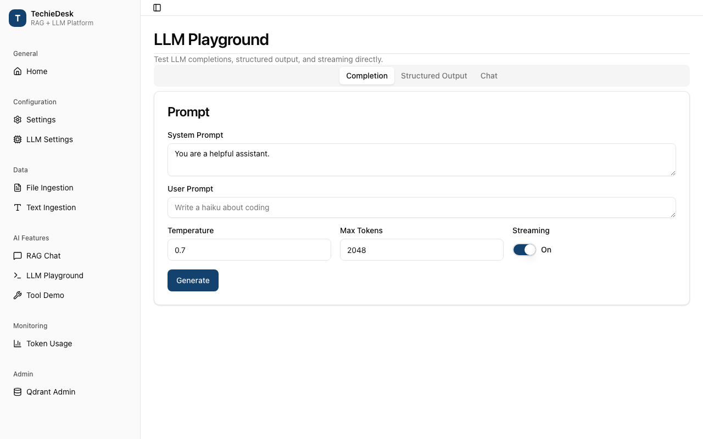

Static-only: the July 2026 Sevak screen that exercised the provider; covered by tests in tests/TechieRag.Agents.Tests/Interop — `LlmProviderChatClientTests`, `ToolAdapterTests`, `AgentStepReporterTests`, `ConversationMemoryChatHistoryProviderTests.AgentReadsAndWritesConversationMemory`.

**Runtime:** static-only (unconfirmed)

**Call chain (adapter 1):** `LlmProviderChatClient.GetResponseAsync` → `ChatOptionsMapper.ToCore` → `ChatMessageMapper.ToCore` → `ILlmProvider.ChatAsync` → `ChatMessageMapper.ToFunctionCall` per tool call. Streaming: `GetStreamingResponseAsync` → `ILlmProvider.ChatStreamEventsAsync` → `ToUpdate`.

REQ-RAG-017: five adapters so TechieRag pieces plug into MAF unchanged:

1. **`ILlmProvider` → `IChatClient`: `LlmProviderChatClient`.** Messages map one-to-one (a tool message per `FunctionResultContent`; `ChatMessageMapper.cs:30-34`), `ChatOptions.Instructions` becomes a leading system message (`ChatOptionsMapper.cs:59-68`), functions become `ToolDefinition`s, `ToolMode` maps to `none`/`required`/`auto`. Tool calls return as `FunctionCallContent`, so MAF's `FunctionInvokingChatClient` runs the loop. Streaming: `ToUpdate` (lines 94-113), one `ResponseId` per model call (lines 70-75).
2. **`IToolHandler` → `AITool`: `ToolHandlerFunctions.From` / `ToolHandlerAIFunction`.** One `AIFunction` per `ToolDefinition`; a bad schema fails at build. Invocation rebuilds a core `ToolCall` for `IToolHandler.ExecuteToolAsync`; the model gets `ToolResult.Content`.
3. **`AITool` / `AIAgent` → `IToolHandler`: `AIToolHandler`.** The reverse, for the classic loop and flow nodes; unknown tools and exceptions return a failed `ToolResult`.
4. **MAF middleware → `IProgress<AgentStep>`: `AgentStepReporter.WithAgentSteps`.** Emits the four loop kinds; the typed `ToolResult` arrives via `AsyncLocal` (`ToolResultCapture`).
5. **`IConversationMemory` → `ChatHistoryProvider`: `ConversationMemoryChatHistoryProvider`.** History read before each run, request and response appended after unless it threw; the memory's `ConversationId` picks the thread.

| File and line | Function | Watch | Expected value |
|---|---|---|---|
| `src/TechieRag.Agents/Interop/ChatOptionsMapper.cs:22-40` | `ToCore` | `coreMessages[0]`, `coreOptions.Tools` | System message with the instructions; tools null unless MEAI supplied functions |
| `src/TechieRag.Agents/Interop/LlmProviderChatClient.cs:97-109` | `ToUpdate` | `streamEvent.Kind` | `TextDelta` → `TextContent`; `ToolCall` → `FunctionCallContent`; `Completed` → `UsageContent` + `FinishReason` |
| `src/TechieRag.Agents/Interop/ToolHandlerAIFunction.cs:55-64` | `InvokeCoreAsync` | `toolCall.Id`, `result.Content` | MAF call id; string returned to the model |
| `src/TechieRag.Agents/Interop/ToolHandlerFunctions.cs:30-31` | `From` | `definition.RequiresConfirmation` | True wraps in `ApprovalRequiredAIFunction` |
| `src/TechieRag.Agents/Interop/AgentStepReporter.cs:81-103` | `InvokeFunctionAsync` | `iteration`, `toolResult` | `context.Iteration + 1`; captured `ToolResult` or null |
| `src/TechieRag.Agents/Interop/ConversationMemoryChatHistoryProvider.cs:48-54` | `StoreChatHistoryAsync` | `context.InvokeException` | Null; a failed run stores nothing |

**Calculations on this service:** `LlmProviderChatClient.ToUsage` and `ToFinishReason` (field and string mappings); `AgentStepReporter.ReportFinal` picks `MaxIterationsReached` when `lastIteration >= cap`; otherwise none.

### Typed streaming on a provider: `ChatStreamEventsAsync` (`TechieRag`)

The probe calls `ChatStreamEventsAsync` only on the `TechieRag.Local` provider (`samples/TechieRag.Probe/LocalProbeRunner.cs:50-61`); the six built-in providers are covered by tests in tests/TechieRag.Tests — `Llm/TypedStreamingTests.TypedStreamOrdersTextToolCallCompleted` and siblings.

**Runtime:** static-only (unconfirmed)

**Call chain (LM Studio, the worked example):** `LmStudioLlmProvider.ChatStreamEventsAsync` → `BuildOpenAIRequest(stream: true)` → `HttpClient.SendAsync` (`POST /v1/chat/completions`, headers-first) → `LlmHttpGuard.EnsureSuccess` → `OpenAIStreamReader.ReadAsync` → `LlmStreamEvent.FromText` / `ToolCallFragments.ToToolCall` + `FromToolCall` / `StreamReadContext.BuildUsage` + `FromCompleted`. `ChatStreamAsync` is now `ChatStreamEventsAsync(...).ToTextStreamAsync()` (`LmStudioLlmProvider.cs:152-153`).

REQ-RAG-067: `ILlmProvider.ChatStreamEventsAsync` has a default body (`ILlmProvider.cs:72-76`) via `LlmStreamEventFallback`: `ChatAsync` with tools or without streaming support, else `ChatStreamAsync` text deltas. Contract: `TextDelta*`, `ToolCall*` (each whole, once), one `Completed` with `Usage`, `FinishReason`, `ModelName`.

`OpenAIStreamReader` reads `data:` lines until `[DONE]`: `usage` kept, `finish_reason` last wins, tool-call fragments accumulated by `index` (id and name first, arguments appended), text yielded immediately. After the loop each assembled call is yielded, then `Completed`.

Where the other providers (under `src/TechieRag/Llm/`) emit `ToolCall`:

- **OpenAI-compatible** — `OpenAICompatibleLlmProvider.cs:182-203`, reader line 199.
- **Azure AI Foundry** — `AzureAIFoundryLlmProvider.cs:165-186`, reader line 182.
- **Ollama** — `OllamaLlmProvider.cs:168-222`; `ParseToolCalls` (line 195), emitted at 211-214.
- **Google Gemini** — `GoogleGeminiLlmProvider.cs:166-225`; `ExtractToolCalls` (line 204), emitted at 214-217.
- **Anthropic** — `AnthropicLlmProvider.cs:171-215`; fragments append until `content_block_stop` (`AnthropicStreamState.cs:108-123`); `tool_use` becomes `tool_calls` (line 213).
- **ChatGPT subscription** — `ChatGptSubscriptionLlmProvider.cs:139-140,167-186`; `OpenAIResponsesStreamReader.cs:82-84,99-109` at `response.output_item.done`.

| File and line | Function | Watch | Expected value |
|---|---|---|---|
| `src/TechieRag/Llm/LmStudioLlmProvider.cs:159-165` | `ChatStreamEventsAsync` | `request`, `response.StatusCode` | `stream: true`; non-success throws before any event |
| `src/TechieRag/Llm/OpenAIStreamReader.cs:45-60` | `ReadAsync` | `chunk.Usage`, `finishReason`, `delta` | Usage kept when present; each non-empty `delta.content` yields a `TextDelta` |
| `src/TechieRag/Llm/OpenAIStreamReader.cs:79-90` | `AppendToolCallFragments` | `index` | `delta.Index` or position; one `ToolCallFragments` per index |
| `src/TechieRag/Llm/OpenAIStreamReader.cs:63-72` | `ReadAsync` | `reason` | Reported reason, else `tool_calls` if calls exist, else `stop`; `Completed` last |
| `src/TechieRag/Llm/StreamReadContext.cs:32-36` | `BuildUsage` | `inputTokens`, `outputTokens` | Estimated from text only when both reported values are 0 |

**Calculations on this service:** `StreamReadContext.BuildUsage` (token estimate fallback); `LlmStreamEventFallback.FromTextStreamAsync` sums `EstimateTokenCount` over message contents and the streamed text; otherwise none.

### Streaming agent loop: `AgentLoopRunner.RunStreamAsync` (`TechieRag`)

Static-only: the July 2026 Sevak screen that exercised the agent loop; covered by tests in tests/TechieRag.Tests — `Services/AgentLoopStreamingTests` (`StreamingRunStreamsTextAndExecutesToolThroughRegistry`, `StreamingRunSumsUsage`, `StreamingRunWorksOverLmStudioWireFormat`).

**Runtime:** static-only (unconfirmed)

**Call chain:** `AgentLoopRunner.RunStreamAsync` → `BuildToolOptions` (tools from `IToolHandler.ToolDefinitions`, `ToolChoice` default `auto`) → `ILlmProvider.ChatStreamEventsAsync` → `StreamedTurn.Apply` → `StreamedTurn.ToResponse` → `AddUsage` → (per tool call) `AgentLoopRunner.ExecuteToolAsync` → `IToolHandler.ExecuteToolAsync` → `ChatMessage.Tool` appended → next iteration, or `Completed`.

REQ-RAG-068 is the streaming twin of `RunAsync`: same handler, trace and message list, but text is yielded as it arrives even when the iteration ends in tool calls. Each iteration (1-based, up to `maxIterations`, default 10) opens a `StreamedTurn`, forwards each non-empty `TextDelta`, buffers `ToolCall`s and keeps `Completed`; `ToResponse` rebuilds the `LlmResponse` and its usage joins `totalUsage`.

No tool calls: report `FinalAnswer`, yield `Completed`, stop. Otherwise append the assistant message and, per call in order, yield `ToolCallRequested`, execute (`ExecuteToolAsync` appends the tool message), yield `ToolExecuted` with the `ToolResult`. At the cap one more call runs without tools (`BuildFinalOptions`) under `Iteration = maxIterations`, and `Completed` carries `MaxIterationsReached = true`. `Completed.Response.Content` is the last iteration's text, `Usage` the run total (line 285).

| File and line | Function | Watch | Expected value |
|---|---|---|---|
| `src/TechieRag/Services/AgentLoopRunner.cs:157` | `RunStreamAsync` | `totalUsage` | Zeroed `TokenUsage` with provider and model names; grows per model call |
| `src/TechieRag/Services/AgentLoopRunner.cs:165-172` | `RunStreamAsync` | `text` | Non-null only for a `TextDelta` with content; one `AgentStreamEvent.TextDelta` each |
| `src/TechieRag/Services/AgentLoopRunner.cs:174-182` | `RunStreamAsync` | `response.HasToolCalls` | False ends the run: `FinalAnswer`, `Completed`, `yield break` |
| `src/TechieRag/Services/AgentLoopRunner.cs:192-197` | `RunStreamAsync` | `toolCall`, `result` | `ToolCallRequested` then `ToolExecuted` per call, in order |
| `src/TechieRag/Services/AgentLoopRunner.cs:249-250` | `ExecuteToolAsync` | `result.ToolCallId` | Matches the call id; a `tool` message with `result.Content` appended |
| `src/TechieRag/Services/AgentLoopRunner.cs:322-329` | `ToResponse` | `Usage`, `FinishReason` | `completed.Usage` or a fresh `TokenUsage`; reported reason, else `tool_calls`, else `stop` |

**Calculations on this service:** `AddUsage` (lines 274-281) sums `InputTokens`, `OutputTokens`, `CacheReadTokens`, `CacheWriteTokens` and `EstimatedCostUsd` across every model call of the run; `Completed` (lines 283-293) assigns that total to the final response's `Usage`.
### ChatGPT subscription sign-in (`TechieRag`)

REQ-RAG-069. A host app can bill model calls to the user's own ChatGPT plan instead of an API key. It never opens a browser: it requests a device code, hands the URL and code to the host's callback, waits for authorisation, then keeps the tokens in an `ISubscriptionSessionStore` (default in-memory; implement the three-method seam over a secure store to sign in once per device). Tokens never reach disk or logs.

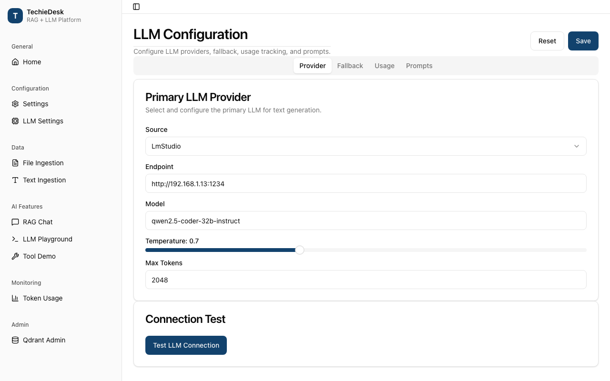

Static-only: the July 2026 Sevak screen that configured providers; covered by tests in tests/TechieRag.Tests — `Llm/Subscription/ChatGptSubscriptionTests.cs`.

**Runtime:** static-only (unconfirmed)

**Call chain:** `TechieRagBuilder.UseChatGptSubscriptionLlm` → `TechieRagBuilder.CreateLlmProvider` (returns the captured factory) → `ChatGptSubscriptionLlmProvider..ctor` (guarded `HttpClient` + `ChatGptDeviceSignIn`) → `ChatGptSubscriptionLlmProvider.ChatAsync` / `ChatStreamEventsAsync` → `StreamAsync` → `SendWithSessionAsync` → `GetSessionAsync` → `ISubscriptionSessionStore.LoadAsync` → (expired or missing) `RenewAsync` → `ChatGptDeviceSignIn.RefreshAsync` or `ChatGptDeviceSignIn.SignInAsync` → `RequestUserCodeAsync` (POST `{issuer}/api/accounts/deviceauth/usercode`) → host callback → `PollForAuthorisationAsync` (POST `.../deviceauth/token` until not 403/404) → `ExchangeCodeAsync` (POST `{issuer}/oauth/token`) → `ISubscriptionSessionStore.SaveAsync` → `SendAsync` (POST `{BackendEndpoint}/responses` with `Bearer` access token) → `OpenAIResponsesStreamReader.ReadAsync`.

| File and line | Function | Watch | Expected value |
|---|---|---|---|
| `src/TechieRag/TechieRagBuilder.cs:418` | `UseChatGptSubscriptionLlm` | `config.Llm.Source` / `Connector` | `LlmSource.Subscription`, `"chatgpt-subscription"`; factory captured at line 424 |
| `src/TechieRag/Llm/ChatGptSubscriptionLlmProvider.cs:59` | `..ctor` | `httpClient` handler | `options.Handler` (test seam) or `HttpWebContentFetcher.CreateGuardedHandler()` |
| `src/TechieRag/Llm/ChatGptSubscriptionLlmProvider.cs:238` | `GetSessionAsync` | `needsRenewal` | true on `forceRenewal` or `session.IsExpired(now, 5 min)` |
| `src/TechieRag/Llm/ChatGptDeviceSignIn.cs:118` | `PollForAuthorisationAsync` | `options.Clock() < expiresAt` | runs until `SignInTimeout` (15 min); 403/404 = not yet, else `CodeRejected` |
| `src/TechieRag/Llm/ChatGptDeviceSignIn.cs:178` | `BuildSession` | `expiresAt` | `now + expires_in` seconds, else the JWT `exp` claim via `JwtClaimReader` |
| `src/TechieRag/Llm/ChatGptSubscriptionLlmProvider.cs:203` | `SendWithSessionAsync` | `response.StatusCode` after renewal | not 401; a second 401 clears the store, throws `CodeSessionRejected` |

Key types: `ChatGptSubscriptionOptions` (`src/TechieRag/Llm/ChatGptSubscriptionOptions.cs:13`: model 21, client id 18, issuer 30, backend 33, `SignInTimeout` 36; `Handler`, `Delay`, `Clock` are test seams); `ISubscriptionSessionStore` (`src/TechieRag/Abstractions/ISubscriptionSessionStore.cs:20`); `SubscriptionSignInException` (`src/TechieRag/Llm/SubscriptionSignInException.cs:11`: four stable `Code*` strings, no token in messages); `SubscriptionSignInPrompt` (`src/TechieRag/Models/SubscriptionSignInPrompt.cs:11`).

**Calculations on this service:** `SubscriptionSession.IsExpired` (`src/TechieRag/Models/SubscriptionSession.cs:38`) returns `ExpiresAt - margin <= now`; `ChatGptDeviceSignIn.ReadInterval` (`ChatGptDeviceSignIn.cs:220`) reads the vendor's poll interval (number or numeric string), default 5 seconds; `EstimateTokenCount` (`ChatGptSubscriptionLlmProvider.cs:157`) is `ceil(length / 4)`.

---

### Connector catalog, model routing and the subscription factory arm (`TechieRag`)

REQ-RAG-070, REQ-FN-062, REQ-RAG-099, REQ-RAG-103. `LlmConnectorCatalog` is a static table of connectors; `ModelRouter` turns a model string into a `(connector, modelId)` route; `LlmProviderFactory` turns a route into an `ILlmProvider`. `CreateSubscription` is a separate arm: a subscription has no API key and needs the host's sign-in callback.

Static-only: the July 2026 Sevak screen that chose a model; covered by tests in tests/TechieRag.Tests — `Llm/Subscription/SubscriptionCatalogTests.cs`, `Llm/ModelRouterTests.cs`, `Documentation/SubscriptionDecisionsTests.cs`.

**Runtime:** static-only (unconfirmed)

**Call chain (by name):** `TechieRagBuilder.UseLlmForModel` → `ModelRouter.Require` → `ModelRouter.Resolve` → `LlmConnectorCatalog.Find` (explicit `connector/model`) or the longest-prefix scan over `LlmConnectorCatalog.All` → `TechieRagBuilder.ApplyRoute` (writes `config.Llm`) → at `Build()`, `CreateLlmProviderFromConfig` → `LlmConnectorCatalog.Find(config.Llm.Connector)` → provider constructor for the connector's `Source`. Outside the builder: `LlmProviderFactory.CreateForModel` → `ModelRouter.Require` → `LlmProviderFactory.Create` → switch on `connector.Source`. Subscription: `LlmProviderFactory.CreateSubscription` → checks `connector.Subscription.Permitted` → `new ChatGptSubscriptionLlmProvider(...)` or throws `CodeNotPermitted`.

| File and line | Function | Watch | Expected value |
|---|---|---|---|
| `src/TechieRag/Llm/LlmConnectorCatalog.cs:156` | static initialiser | `Connectors` tail | `SubscriptionConnectorRows.All` after the 16 API-key/local rows |
| `src/TechieRag/Llm/SubscriptionConnectorRows.cs:29` | `All` | `Subscription.Permitted` for `chatgpt-subscription` | `true`, `BuilderMethod = "UseChatGptSubscriptionLlm"` (37); others `false`, `CheckedOn` 2026-09-24 (19) |
| `src/TechieRag/Llm/ModelRouter.cs:56` | `Resolve` | `bestPrefixLength` | grows only on a longer match; no match → null, `Require` throws (line 74) |
| `src/TechieRag/Llm/LlmProviderFactory.cs:78` | `Create` | `LlmSource.Subscription` arm | throws `SubscriptionNeedsSignIn` naming the builder method |
| `src/TechieRag/Llm/LlmProviderFactory.cs:133` | `CreateSubscription` | `connector.Name` switch | only `chatgpt-subscription` with `Permitted`; else `CodeNotPermitted` with the terms text (148) |
| `src/TechieRag/TechieRagBuilder.cs:892` | `CreateLlmProviderFromConfig` | default switch arm | `"Unsupported LLM source: Subscription"` (defect below) |

No `ModelPrefixes` on subscription rows (`SubscriptionConnectorRows.cs:12`): bare `gpt-` routes to the API-key `openai` row; use `chatgpt-subscription/<model>`.

**Defect noticed:** `CreateLlmProviderFromConfig` (`TechieRagBuilder.cs:851`) has no `LlmSource.Subscription` arm, so `Llm.Connector = "chatgpt-subscription"` via `AddTechieRag(IConfiguration)` gets the generic message instead of the `SubscriptionNeedsSignIn` text at `LlmProviderFactory.cs:142`. Throwing is right; the message is not.

**REQ-RAG-103 (streaming with sources):** `TechieRagClient.AskStreamWithSourcesAsync` (`src/TechieRag/TechieRagClient.cs:690`): `SearchAsync` (701), `FromSources` (702), `FromToken` per token (710), `FromCompleted` (713).

**Calculations on this service:** `ModelRouter.Resolve` splits on the first slash only (`ModelRouter.cs:37`) so `openrouter/anthropic/claude-x` keeps `anthropic/claude-x` as the model id; an empty remainder falls back to `connector.DefaultModel` (line 44).

---

### Configuration mapping: `AddTechieRag(IConfiguration)` and `TechieRagConfig` (`TechieRag`)

REQ-FN-066. Both configuration overloads now go through one internal mapper, `TechieRagConfigMapper.Apply`, so a field set in `appsettings.json` and one set on a `TechieRagConfig` object reach the built instance the same way. Before, each overload dropped `VectorStore.ApiKey`, embedding `Dimensions`/`ApiFormat`/`ApiPath`/`RequestDelayMs` and the `Prompt` section. A reflection test fails if any public settable property does not survive.

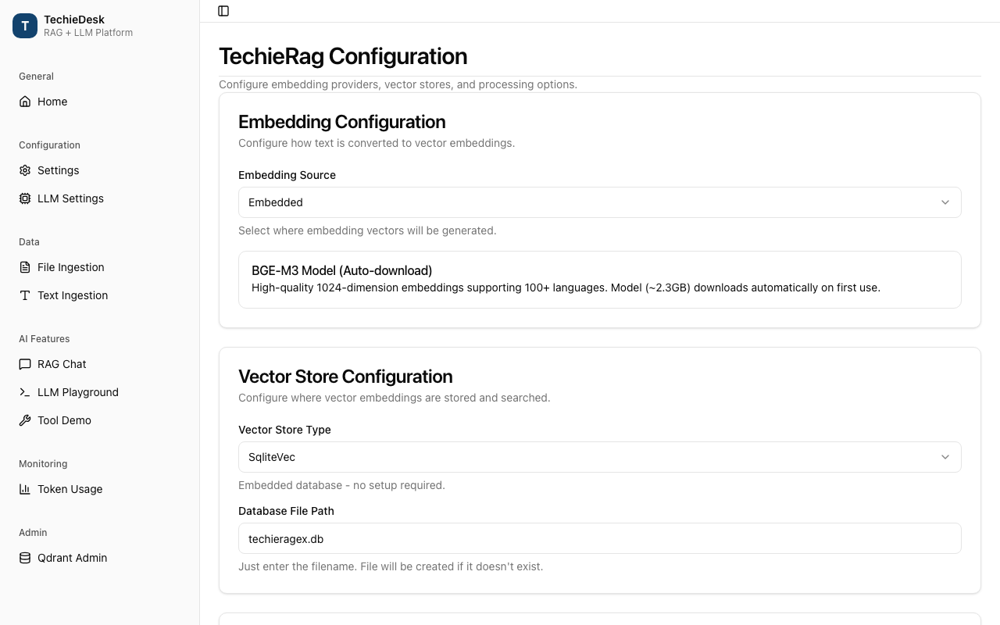

Static-only: the July 2026 Sevak screen that edited configuration; covered by tests in tests/TechieRag.Tests — `DependencyInjection/TechieRagConfigMappingTests.cs`.

**Runtime:** static-only (unconfirmed)

**Call chain:** `ServiceCollectionExtensions.AddTechieRag(IServiceCollection, IConfiguration)` → `IConfiguration.Get<TechieRagConfig>()` → `ServiceCollectionExtensions.AddTechieRag(IServiceCollection, Action<TechieRagBuilder>)` → `TechieRagConfigMapper.Apply(builder, config)` → `MapEmbedding` / `UseVectorStore` / `WithChunkSize` / `WithChunking` / `WithTelemetry` / `MapLlm` / `MapUsageTracking` / `MapPrompt` / `WithResilience` / `MapRerank` / `MapPersistence` → `services.AddSingleton(builder.GetConfig())` → `services.AddSingleton<ITechieRag>(sp => builder.WithLogging(loggerFactory).Build())` (lazy, on first resolve). `AddTechieRag(IServiceCollection, TechieRagConfig)` skips the bind and enters at the same `Apply`.

| File and line | Function | Watch | Expected value |
|---|---|---|---|
| `src/TechieRag/DependencyInjection/ServiceCollectionExtensions.cs:141` | `AddTechieRag(IConfiguration)` | `config` | a bound `TechieRagConfig`; null (missing section) throws `InvalidOperationException` |
| `src/TechieRag/DependencyInjection/ServiceCollectionExtensions.cs:147` | `AddTechieRag(IConfiguration)` | delegate passed on | `builder => TechieRagConfigMapper.Apply(builder, config)`; the `TechieRagConfig` overload (line 179) passes the same lambda |
| `src/TechieRag/DependencyInjection/TechieRagConfigMapper.cs:35` | `Apply` | third argument of `UseVectorStore` | `source.VectorStore.ApiKey` — the field the old overloads dropped |
| `src/TechieRag/DependencyInjection/TechieRagConfigMapper.cs:52` | `MapEmbedding` | `target.ApiFormat`, `ApiPath`, `Dimensions`, `RequestDelayMs` | copied onto `builder.GetConfig().Embedding` after `UseEmbedding` (line 49) |
| `src/TechieRag/DependencyInjection/TechieRagConfigMapper.cs:95` | `MapPrompt` | `WithPromptTemplate(SystemPrompt, ContextChunkTemplate)` | both strings applied; `MaxContextChunks`, `MaxContextTokens` copied at lines 98–99 |
| `src/TechieRag/DependencyInjection/TechieRagConfigMapper.cs:123` | `MapRerank` | `target.Enabled` | `source.Enabled && IsRerankUsableFromConfiguration(source)`; keyless Cohere/Jina or `LocalOnnx` leaves the stage off instead of throwing at resolve |

The instance is lazy (`ServiceCollectionExtensions.cs:72–82`): `ILoggerFactory` comes from the container inside the singleton factory and goes to `builder.WithLogging` before `Build()`. `MapPersistence` (`TechieRagConfigMapper.cs:141`) calls `WithPersistence` only when provider and connection string are both present; it always copies `DefaultUserId`.

**Calculations on this service:** none — every method is a field copy; the only decisions are `IsRerankUsableFromConfiguration` (`TechieRagConfigMapper.cs:132`: Cohere/Jina need a non-empty `ApiKey`, `LocalOnnx` is always false, anything else true) and the persistence guard above.

---

### Web ingestion and the SSRF guard: `IngestUrlAsync`, `CrawlAsync`, `CreateGuardedHandler` (`TechieRag`)

REQ-RAG-074, REQ-RAG-075, REQ-RAG-077. `WebIngestionExtensions` adds URL and site ingestion as extension methods on `ITechieRag`; `SiteCrawler` walks a site breadth-first within `WebCrawlOptions`; `HttpWebContentFetcher` fetches one page. Its static `CreateGuardedHandler` is the SSRF enforcement point: a `SocketsHttpHandler` whose `ConnectCallback` resolves the host itself, refuses private, loopback and link-local addresses, and connects only to checked addresses, on every redirect hop. Other host checks are fast-path messages, not the guard.

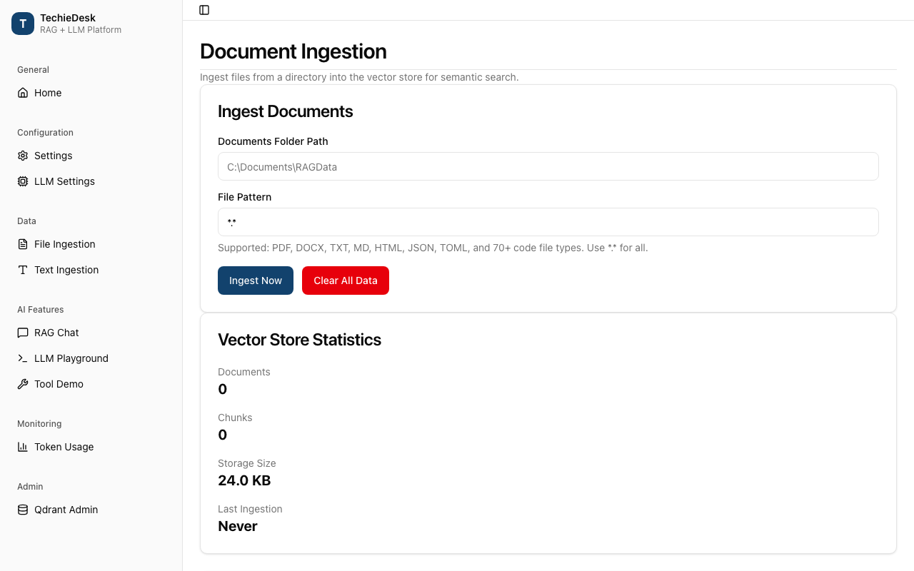

Static-only: the July 2026 Sevak screen that ingested content; covered by tests in tests/TechieRag.Tests — `Web/WebIngestionEndToEndTests.cs`, `Web/HttpWebContentFetcherGuardTests.cs`.

**Runtime:** static-only (unconfirmed)

**Call chain (single page):** `WebIngestionExtensions.IngestUrlAsync` → `IWebContentFetcher.FetchAsync` (`HttpWebContentFetcher.FetchAsync`) → `RefusePrivateResolutionAsync` → `HttpClient.GetAsync` (through the handler from `CreateGuardedHandler` → `ConnectToPublicAddressAsync` → `Socket.ConnectAsync`) → `ReadCappedAsync` → `WebPageReader.Read` → `WebIngestionExtensions.IngestPageAsync` → `ITechieRag.IngestTextAsync`.
**Call chain (site):** `WebIngestionExtensions.IngestSiteAsync` → `SiteCrawler.CrawlAsync` → per queued URL `IWebContentFetcher.FetchAsync` → enqueue `page.Links` → `IngestPageAsync` per page with text.

| File and line | Function | Watch | Expected value |
|---|---|---|---|
| `src/TechieRag/Web/WebIngestionExtensions.cs:137` | `IngestPageAsync` | metadata `SourceUrl`, `SourcePath` | both `page.FinalUrl`; `SourceType = "web"` |
| `src/TechieRag/Web/SiteCrawler.cs:71` | `CrawlAsync` | loop guard | `queue.Count > 0 && pages.Count < options.MaxPages`; defaults `MaxDepth = 1`, `MaxPages = 25` (`WebCrawlOptions.cs:16,19`) |
| `src/TechieRag/Web/SiteCrawler.cs:103` | `CrawlAsync` | `depth >= options.MaxDepth` | true stops link discovery; children enqueued at `depth + 1` (136) after same-host and private-host filters (122, 128) |
| `src/TechieRag/Web/HttpWebContentFetcher.cs:303` | `CreateGuardedHandler` | `handler.ConnectCallback` | `ConnectToPublicAddressAsync` when `blockPrivateTargets` (default true); `MaxAutomaticRedirections = 5` (296) |
| `src/TechieRag/Web/HttpWebContentFetcher.cs:323` | `ConnectToPublicAddressAsync` | `WebCrawlOptions.IsPrivateNetworkAddress(address)` per resolved address | all false; a private address throws `WebFetchException` naming it |
| `src/TechieRag/Web/HttpWebContentFetcher.cs:337` | `ConnectToPublicAddressAsync` | `socket.ConnectAsync(addresses, port, …)` | the checked address list, never a fresh DNS resolution |

`FetchAsync` also checks the literal host (50), pre-flight DNS (60), the final `RequestUri` after redirects (100) and an unfollowed 3xx target (91); refuses non-HTML media (109); caps bodies at `MaxContentBytes` 8 MB (19, 220). `IngestSiteAsync` reports empty-text pages in `WebIngestionResult.Skipped` (69).

**Calculations on this service:** `SiteCrawler.Normalize` (`SiteCrawler.cs:152`) strips a trailing slash so a page is not ingested twice; the enqueue cap `visited.Count >= options.MaxPages * 4` (line 112) bounds the queue.

---

### `ConnectorRunner` and `RepositoryConnector` (`TechieRag`)

REQ-RAG-078, REQ-RAG-079, REQ-RAG-082, REQ-RAG-083. `IDataConnector` is `ListAsync` (pages of `ConnectorItem`) and `FetchAsync` (one `ConnectorDocument`). `ConnectorRunner` drives any connector through a bounded, resumable walk (paging, budgets, incremental sync, per-item failure, consecutive-failure breaker). `RepositoryConnector` is the GitHub/GitLab implementation with branch and glob filters applied during listing.

Static-only: the July 2026 Sevak screen that listed ingested documents; covered by tests in tests/TechieRag.Tests — `Connectors/ConnectorRunnerTests.cs`, `Connectors/ConnectorStreamingTests.cs`, `Connectors/SourceConnectorIngestionTests.cs`.

**Runtime:** static-only (unconfirmed)

**Call chain:** `ConnectorIngestionExtensions.IngestConnectorAsync` → `new ConnectorRunner().RunAsync(connector, previousSync, options, onDocument)` → `ConnectorRunner.RunCoreAsync` → loop: `IDataConnector.ListAsync` → per item `previousSync.IsUnchanged` / size check / `IDataConnector.FetchAsync` → `onDocument` → `ITechieRag.IngestTextAsync` → record `sync.ItemVersions[item.Id]` → byte-budget check → next cursor. For a repository: `RepositoryConnector.ListAsync` → `ResolveBranchAsync` (GET `/repos/{path}` or `/projects/{path}`) → `ListGitHubAsync` (GET `/git/trees/{branch}?recursive=1`) or `ListGitLabAsync` (GET `/repository/tree?…&page=`) → `GlobFilter.IsMatch`; `RepositoryConnector.FetchAsync` → GET blob → `DecodeContent` (base64, NUL-byte binary check). HTTP goes through `HttpConnectorTransport.SendCoreAsync` → `HttpClient.SendAsync` on `HttpConnectorTransport.CreateDefaultClient` → `HttpWebContentFetcher.CreateGuardedHandler`.

| File and line | Function | Watch | Expected value |
|---|---|---|---|
| `src/TechieRag/Connectors/ConnectorRunner.cs:240` | `RunCoreAsync` | `onDocument(document, …)` | awaited before the next fetch; version recorded after (249), so a handler failure re-fetches next run |
| `src/TechieRag/Connectors/ConnectorRunner.cs:256` | `RunCoreAsync` | `totalBytes >= options.MaxTotalBytes` | true sets `limitCode = RunByteBudgetReached` (263); default 64 MB (`ConnectorRunOptions.cs:48`) |
| `src/TechieRag/Connectors/ConnectorRunner.cs:218` | `RunCoreAsync` | `consecutiveFailures >= options.MaxConsecutiveFailures` | 25 (`ConnectorRunOptions.cs:67`) throws `ConnectorException`; resets on success (229) |
| `src/TechieRag/Connectors/ConnectorRunner.cs:278` | `RunCoreAsync` | prune condition | stale versions removed only when `!reachedLimit && connector.ListsEntireSource` |
| `src/TechieRag/Connectors/Repository/RepositoryConnector.cs:129` | `ListGitHubAsync` | `filter.IsMatch(path)` | unmatched paths are never listed or fetched; `Version` is the blob `sha` (138) |
| `src/TechieRag/Connectors/Http/HttpConnectorTransport.cs:258` | `CreateDefaultClient` | handler | `HttpWebContentFetcher.CreateGuardedHandler(blockPrivateTargets)`; bodies capped at `MaxResponseBytes` 16 MB (34) |

Limit codes (`src/TechieRag/Connectors/ConnectorErrorCodes.cs`): `RunByteBudgetReached` (21), `RunItemLimitReached` (27), `RunPageLimitReached` (33) go on `ConnectorRunResult.LimitCode` (`ConnectorRunResult.cs:28`); `ImapLiteralTooLarge` (40), `ImapResponseLineTooLong` (46) go on `ConnectorException.ErrorCode` (they fail the run). `RepositoryConnector` fails on a truncated GitHub tree (148), sends the GitLab token as a `PRIVATE-TOKEN` header (274), ends the run on 401/403 (303).

**Calculations on this service:** `totalBytes` is `Encoding.UTF8.GetByteCount(document.Text)` summed (`ConnectorRunner.cs:245`), bytes not characters; `RepositoryConnector.IsBinary` (line 404) scans the first 8 KB for a NUL byte.

---

### `EmailConnector` with IMAP and mbox transports (`TechieRag`)

REQ-RAG-081, REQ-RAG-082. `EmailConnector` is the mailbox `IDataConnector`. Folder, date, sender, subject, sent-mail and spam filters apply while listing; out-of-scope mail is never downloaded. Transports behind `IMailTransport`: `ImapMailTransport` (TLS; XOAUTH2 or LOGIN) and `MboxMailTransport` (local export). Attachments are decoded in memory and streamed to an `IDocumentProcessor`, never to disk.

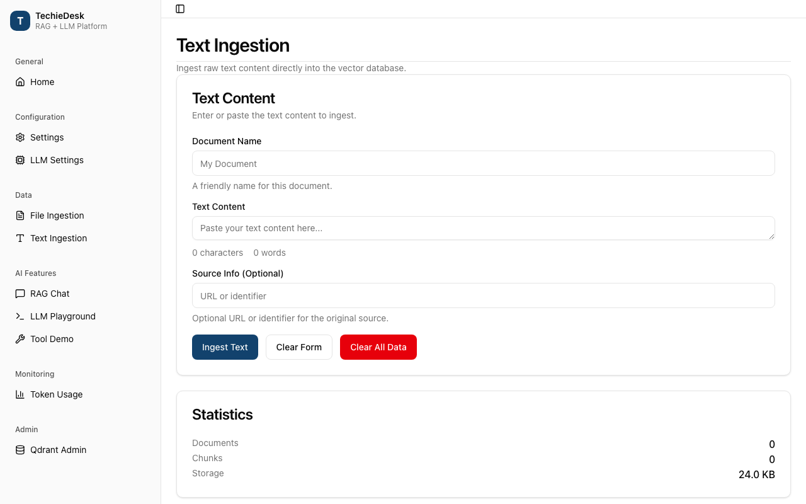

Static-only: the July 2026 Sevak screen that ingested text; covered by tests in tests/TechieRag.Tests — `Connectors/EmailConnectorTests.cs`.

**Runtime:** static-only (unconfirmed)

**Call chain:** `ConnectorRunner.RunCoreAsync` → `EmailConnector.ListAsync` → `ResolveFoldersAsync` (`IMailTransport.ListFoldersAsync` unless `Folders` set; junk folders dropped) → `BuildCriteria(previousSync)` → `IMailTransport.SearchAsync` (IMAP: `ImapMailTransport.SearchAsync` → `UID SEARCH {BuildSearchKeys}` → `UID FETCH … BODY.PEEK[HEADER]`; mbox: `MboxMailTransport.SearchAsync` → in-memory `Matches`) → `ToItem` → `EmailConnector.FetchAsync` → `IMailTransport.FetchAsync` (IMAP `UID FETCH {uid} (BODY.PEEK[])`, mbox `byUid` lookup) → `MimeParser.Parse` → `ReplyTrimmer.Trim` → `AppendAttachmentsAsync` → `IDocumentProcessor.ProcessAsync`. IMAP sockets: `ImapMailTransport.Create` → `SocketImapConnection.OpenAsync` → `TcpClient.ConnectAsync` + `SslStream.AuthenticateAsClientAsync` (TLS 1.2/1.3).

| File and line | Function | Watch | Expected value |
|---|---|---|---|
| `src/TechieRag/Connectors/Email/EmailConnector.cs:297` | `BuildCriteria` | `since` | `previousSync.LastRunUtc - 1 day` if later than `options.SinceUtc`; `SINCE` is day-granular, runner drops duplicates |
| `src/TechieRag/Connectors/Email/EmailConnector.cs:74` | `ListsEntireSource` | return value | always `false`, so the runner never prunes |
| `src/TechieRag/Connectors/Email/EmailConnector.cs:278` | `ToItem` | item id | `header.StableId` (mbox) or `"{Folder}/{UidValidity}/{Uid}"`; a UIDVALIDITY reset is never "unchanged" |
| `src/TechieRag/Connectors/Email/ImapMailTransport.cs:425` | `RunAsync` | `RequireNoControlCharacters(command, …)` | no `char.IsControl` character; `Quote` (616) checks caller values the same way, refusing CRLF injection and the U+0001 XOAUTH2 separator |
| `src/TechieRag/Connectors/Email/ImapMailTransport.cs:470` | `RunAsync` | `length > literalBudget` | false; a literal beyond remaining `MaxMessageBytes` (64 MB, `ImapMailboxOptions.cs:55`) throws `ImapLiteralTooLarge` before allocating |
| `src/TechieRag/Connectors/Email/ImapByteReader.cs:102` | `ReadLineAsync` | `line.Count > maxLineBytes` | false; an over-long line drops the connection with `ImapResponseLineTooLong` (108) |

Attachments (`EmailConnector.cs:172–225`) skip by extension allow-list (177), size (183) or missing processor (189); skips go on `AttachmentsSkipped` metadata (249), never into indexed text.

**Observation:** `SocketImapConnection.OpenAsync` (`SocketImapConnection.cs:72`) opens a plain `TcpClient` with no private-address check, unlike the HTTP transport. Probably intended (LAN IMAP is normal), but undocumented.

**Calculations on this service:** `NextCursor` (`EmailConnector.cs:343`) is `"{folderIndex}:{skip + page.Headers.Count}"`: it advances by what the server returned, not what survived filtering, so filtered-out messages are never re-requested.

---

### Reranking and search options: `SearchOptions.Rerank`, `WithReranker` (`TechieRag`, `TechieRag.Embedded`)

REQ-RAG-097, REQ-RAG-098. A reranker scores each candidate chunk against the query and reorders the results. Core ships `CohereReranker` and `JinaReranker`; `TechieRag.Embedded` ships `OnnxCrossEncoderReranker` behind `UseEmbeddedReranker`. `SearchOptions.Rerank` per call wins, else `RerankConfig.Enabled` (`WithRerankEnabledByDefault`). The reranker is built whenever a usable source is configured, regardless of `Enabled`, so per-call opt-in works with the default off. `Workspace.RerankEnabled` (`src/TechieRag/Models/Workspace.cs:57`) is stored state the host maps into `SearchOptions.Rerank`.

Static-only: the July 2026 Sevak screen that showed search results; covered by tests in tests/TechieRag.Tests — `Reranking/RerankedSearchTests.cs`, `Reranking/SearchRerankSwitchTests.cs`.

**Runtime:** static-only (unconfirmed)

**Call chain:** `TechieRagBuilder.WithReranker(RerankSource, apiKey, …)` or `WithReranker(Func<IReranker>, …)` (or `TechieRagBuilderExtensions.UseEmbeddedReranker` → `WithReranker(factory)`) → `WithRerankEnabledByDefault(bool)` → `Build()` → `CreateReranker` → `customRerankerFactory()` or `CreateApiReranker` → `TechieRagClient..ctor(reranker)`. At query time: `TechieRagClient.SearchAsync(query, SearchOptions)` → `ResolveRerank` → `IEmbeddingProvider.EmbedAsync` → `IVectorStore.SearchAsync(fetchCount)` → `ApplyRerankAsync` → `IReranker.RerankAsync` (Cohere: POST `/v2/rerank`; ONNX: `ScorePair` per candidate).

| File and line | Function | Watch | Expected value |
|---|---|---|---|
| `src/TechieRag/TechieRagBuilder.cs:557` | `WithReranker(Func<IReranker>, …)` | `config.Rerank.Enabled` / `Source` | `true` / `RerankSource.Custom`; `WithRerankEnabledByDefault(false)` afterwards (line 578) flips only `Enabled` |
| `src/TechieRag/TechieRagBuilder.cs:740` | `CreateReranker` | `LocalOnnx` without a factory | throws only when `Enabled` is true, else null; the factory branch at line 732 wins first |
| `src/TechieRag/TechieRagClient.cs:449` | `ResolveRerank` | `requested` | `options.Rerank ?? config.Rerank.Enabled`; no reranker configured logs a warning and returns false (line 452) |
| `src/TechieRag/TechieRagClient.cs:420` | `SearchAsync` | `fetchCount` | `Math.Max(topK, config.Rerank.CandidateCount)` (default 20) when reranking, else `topK` |
| `src/TechieRag/TechieRagClient.cs:468` | `ApplyRerankAsync` | `topN` | `Math.Min(config.Rerank.TopN, topK)` when `TopN > 0`, else `topK` |
| `src/TechieRag.Embedded/OnnxCrossEncoderReranker.cs:251` | `RerankAsync` | result order | `OrderByDescending(r => r.Score).Take(min(topN, count))`; cross-encoder scores replace vector similarity |

`SearchOptions` (`src/TechieRag/Models/SearchOptions.cs:18`) carries `TopK` (5), `DocumentFilter` and `bool? Rerank` (line 38); the legacy positional `SearchAsync` (`TechieRagClient.cs:373`) leaves `Rerank` null, so existing callers keep the global default.

**Calculations on this service:** `CohereReranker.RerankAsync` sends `top_n = min(topN, results.Count)` (`CohereReranker.cs:86`) and maps each returned `index` back to the original chunk with `relevance_score` as the new `Score` (line 106); the ONNX reranker scores every candidate with `ScorePair(query, chunk.Text)` (line 246) then sorts.

---

### Telemetry packaging: `TechieRag.Telemetry`, `AddTechieRagTelemetry`, the publish workflows (`TechieRag.Telemetry`)

REQ-FN-065. The OpenTelemetry exporters live in their own opt-in package, so the core package links no exporter. Both publishing workflows now pack and push it at the same version as the other four packages.

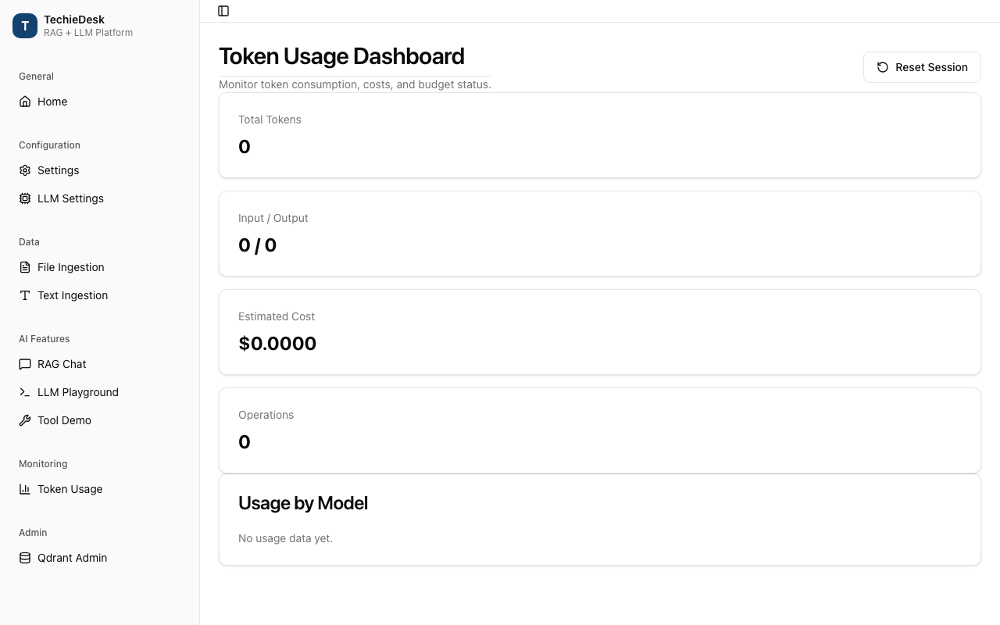

Static-only: the July 2026 Sevak screen that showed usage; covered by tests in tests/TechieRag.Tests — `PublishingWorkflowTests.cs`.

**Runtime:** static-only (unconfirmed)

**Call chain (runtime):** `TechieRagTelemetryServiceCollectionExtensions.AddTechieRagTelemetry(services, configure)` → `services.AddSingleton(...)` → on first resolve: `new TechieRagTelemetryOptions()` → `configure(options)` → `TechieRagTelemetryPipeline.Create(options)` → `options.IsExportEnabled` (inert pipeline when false) → `options.ValidateEndpoint()` (OTLP only) → `BuildTracerProvider` (`AddSource(TechieRagTelemetry.ActivitySourceName)` + console or OTLP exporter) → `BuildMeterProvider` (`AddMeter(TechieRagTelemetry.MeterName)`) → `TechieRagTelemetry.Enabled = true` → the library's `TechieRagTelemetry.Record*` calls start emitting → `Dispose` flips the flag back if this pipeline set it.
**Call chain (packaging):** `.github/workflows/publish-nuget.yml` `workflow_dispatch` → `determine-version.sh` → `dotnet restore/build/pack` of `TELEMETRY_PROJECT` → "Confirm packed version" file check → `NuGet/login` → `dotnet nuget push ./artifacts/*.nupkg`; `.github/workflows/publish-github-packages.yml` push/tag → same restore/build/pack list → upload artifact → `publish-github` job pushes each `.nupkg` to GitHub Packages.

| File and line | Function | Watch | Expected value |
|---|---|---|---|
| `src/TechieRag.Telemetry/TechieRagTelemetryServiceCollectionExtensions.cs:33` | `AddTechieRagTelemetry` | registered factory | one lazy singleton; no `configure` → `IsExportEnabled` false, no socket |
| `src/TechieRag.Telemetry/TechieRagTelemetryPipeline.cs:70` | `Create` | `options.IsExportEnabled` | false → inert pipeline (`IsActive == false`, 53); true → `ValidateEndpoint` (77) |
| `src/TechieRag.Telemetry/TechieRagTelemetryOptions.cs:78` | `ValidateEndpoint` | `Endpoint.IsLoopback \|\| AllowRemoteEndpoint` | true; default `http://localhost:4318` (21); remote without `AllowRemoteEndpoint` throws |
| `src/TechieRag.Telemetry/TechieRag.Telemetry.csproj:31` | package properties | `GeneratePackageOnBuild`, `PublishRepositoryUrl`, `EmbedUntrackedSources`, `IncludeSymbols`, `SymbolPackageFormat` | `false`, `true`, `true`, `true`, `snupkg`; README (26); TFMs `net10.0;net8.0` (10) |
| `.github/workflows/publish-nuget.yml:59` | env | `PACKAGE_IDS` | includes `techierag.telemetry`; restored (98), built (110), packed (125), `.nupkg` asserted (137) |
| `.github/workflows/publish-github-packages.yml:98` | Pack step | `dotnet pack src/TechieRag.Telemetry/…` | present, `-p:Version=${{ steps.version.outputs.version }}` like the other four (96–100); pushed at 147 |

`publish-github-packages.yml:150–154` deliberately has no nuget.org job (REQ-FN-067); nuget.org is reached only by manual `publish-nuget.yml` dispatch, whose file name is bound to the nuget.org trusted-publishing policy (lines 20–22).

**Calculations on this service:** `ConfigureOtlp` (`TechieRagTelemetryPipeline.cs:156`) sets the exporter protocol to HTTP/protobuf and, for metrics, `ExportIntervalMilliseconds = (int)options.MetricExportInterval.TotalMilliseconds` (148; default 15 s, `TechieRagTelemetryOptions.cs:59`).

## Cross-cutting flows

Phase 1's flows are unchanged and stay in `docs/TechieRag-DevGuide.md` (data connectors, MCP client, flow orchestration, web ingestion, workspaces and memory, speech, telemetry, resilience). Phase 2 changed three of them; the rest of this section says where.

### Configuration
**Call chain:** `ServiceCollectionExtensions.AddTechieRag(IConfiguration)` → `TechieRagConfigMapper` → `TechieRagBuilder.Build()`; every field the builder accepts is mapped (entry "Configuration mapping" above). Environment variables the library reads: `TECHIERAG_MODEL_ROOT`, `TECHIERAG_MODEL_BASE_URL`, `TECHIERAG_RERANKER_BASE_URL`, `TECHIERAG_PROBE_AUTORUN` (probe only).

### Model files on disk
**Call chain:** `ModelRoot.Current` → `ModelDownloadService.DownloadAsync` → `<ModelRoot>/<model>` (embedding, reranker) or `<ModelRoot>/<model>-<format>` (local model, with a `.techierag-verified` marker); entries "Model root and the phone default", "Download size, decline and resume" and "Terms, download and verification" above.

### Platform build and CI
**Call chain:** `TechieRag.Embedded.targets` and `TechieRag.Local.targets` (imported from `buildTransitive/`) → the consuming app's MAUI build; `.github/workflows/probe.yml` → `scripts/select-xcode.sh` → one `dotnet build -f <head> -p:ProbeHead=<head>` per job; entries "Native ONNX Runtime wiring" and "CI and the scripts" above.

### Logging and errors
Unchanged from phase 1: `WithLogging(loggerFactory)` on the builder; library messages are codes with arguments (`FlowMessage`, `ConnectorErrorCodes`, `SubscriptionSignInException.Code`), never English sentences; `TechieRag.Local` throws `LocalModelTermsNotAcceptedException`, `LocalModelMemoryException` and `LocalPromptTooLongException` with the numbers a host needs.

## Known issues

Found while reading the code for this guide on 2026-09-25 and fixed the same day by the build that followed (each fix is the Remark on its checklist row; line numbers below are from before the fix).

- REQ-RAG-015, fixed: the `weak` hint quoted the cosine threshold even when reranking had classified the result; it now quotes the threshold that was applied (`src/TechieRag/Agentic/KnowledgeBaseTools.cs`).
- REQ-RAG-016, fixed: `Sources` is raised only after a search grew the turn's search count, as its doc comment says; `Retrieval` is now on `ITechieRagAgent` (`src/TechieRag.Agents/TechieRagAgent.cs`).
- REQ-RAG-053, fixed: the comment in `src/TechieRag/Models/ModelRoot.cs` no longer calls `TechieRag.Local` "the planned" package.
- REQ-RAG-061, fixed: `GetTerms()` reports the pending bytes, files on disk and `.part` remainders subtracted, as `EnsureAsync` does (`src/TechieRag.Local/LocalLlmProvider.cs`, `LocalModelVariant.GetPendingBytes`).
- REQ-FN-059, fixed: the probe's peak memory is decimal megabytes, the same unit as its download line (`samples/TechieRag.Probe/GenerationResult.cs`).
- REQ-RAG-069, fixed: the `ILlmProvider` doc comment lists all eight implementations (`src/TechieRag/Abstractions/ILlmProvider.cs`).
- REQ-FN-066, fixed: `Llm.Source = Subscription` from configuration gives the factory's own sign-in message (`src/TechieRag/TechieRagBuilder.cs`).
- REQ-RAG-082, documented: the IMAP connection deliberately skips the private-address guard because the host names the mail server itself; the rule is in the XML docs of `SocketImapConnection` and `ImapMailboxOptions` and in the UsageGuide's Known limitations.
- Several XML doc headers cite requirement ids from before the phase-2 renumbering (for example `ConnectorRunner` names REQ-RAG-032 and BRD-113); cosmetic, not fixed.
- ORT-001, ORTGENAI-001, ORTGENAI-002: upstream package gaps, filed in `docs/TechieRag-OnnxRuntime-Feedback.md` and `docs/TechieRag-OnnxRuntimeGenAI-Feedback.md`; the two build targets files work around the first two.
