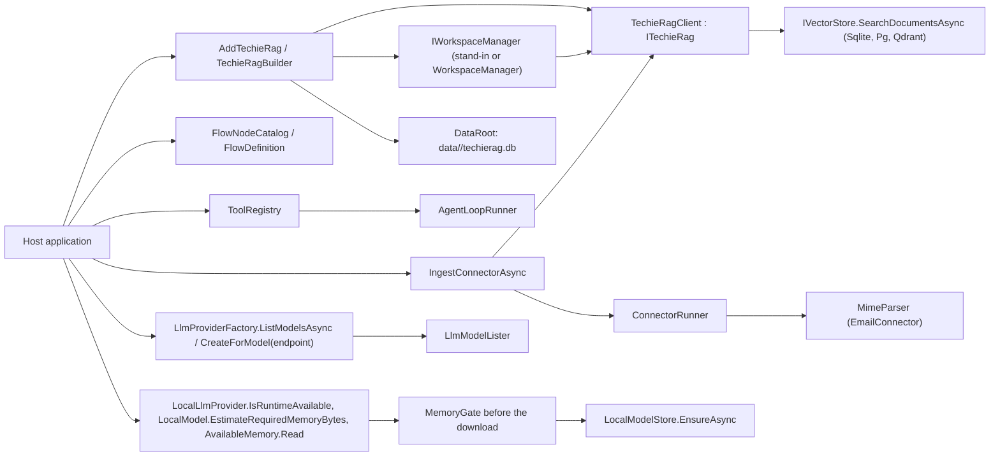
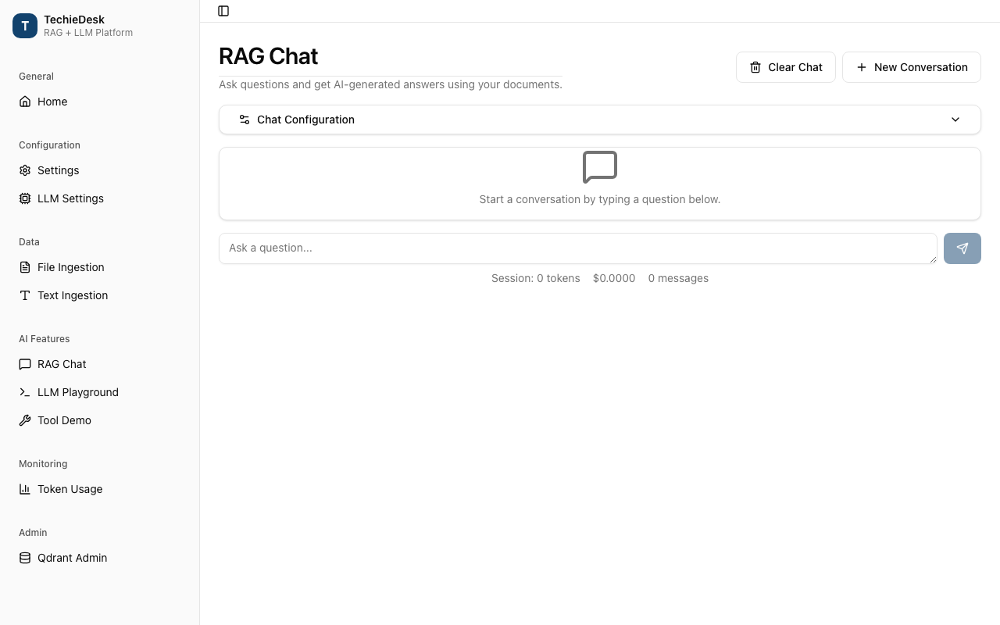
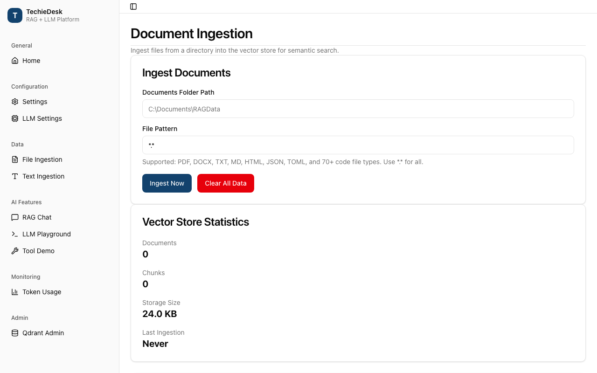
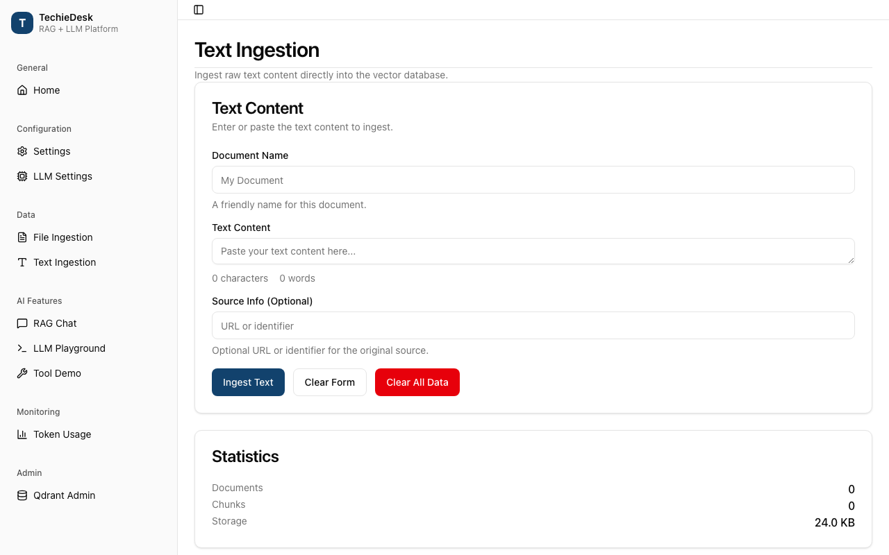
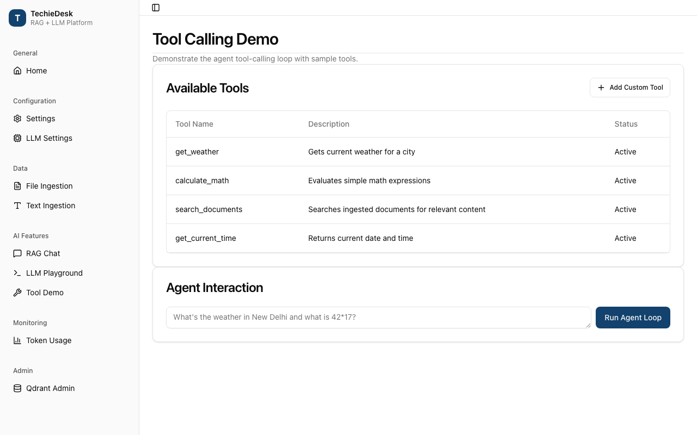
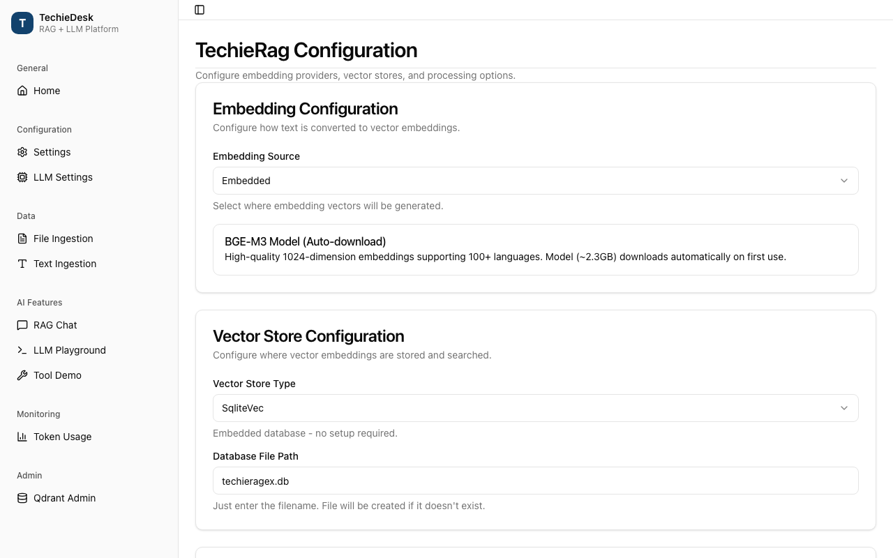
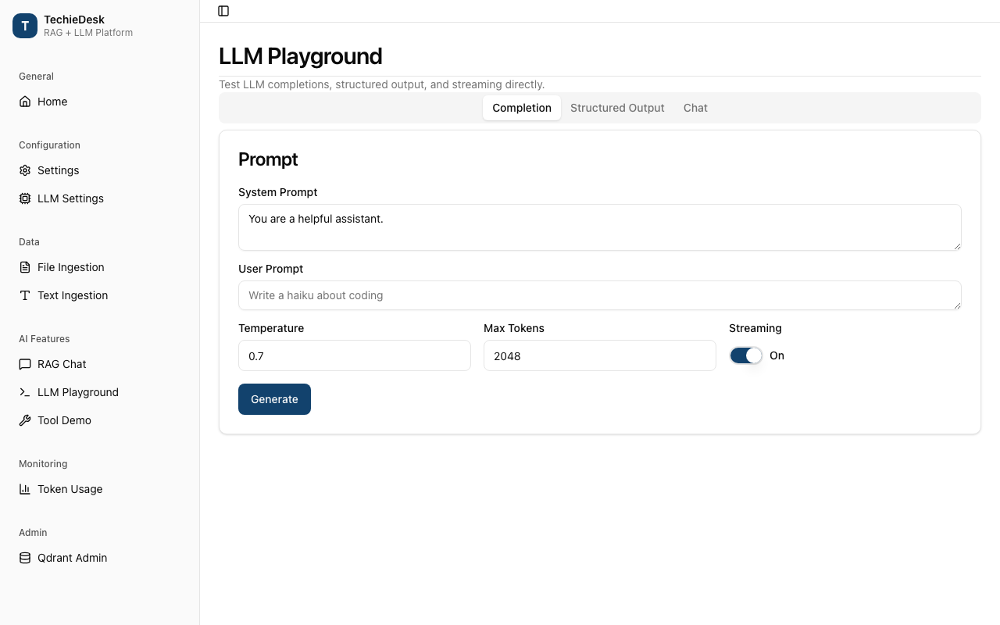
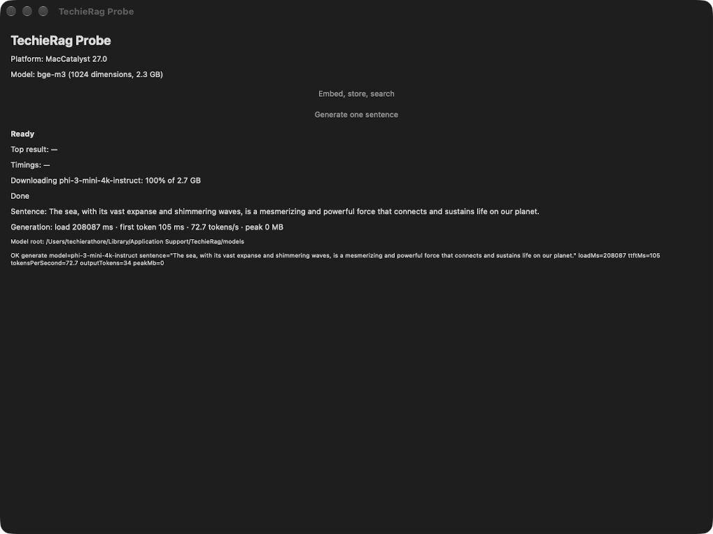
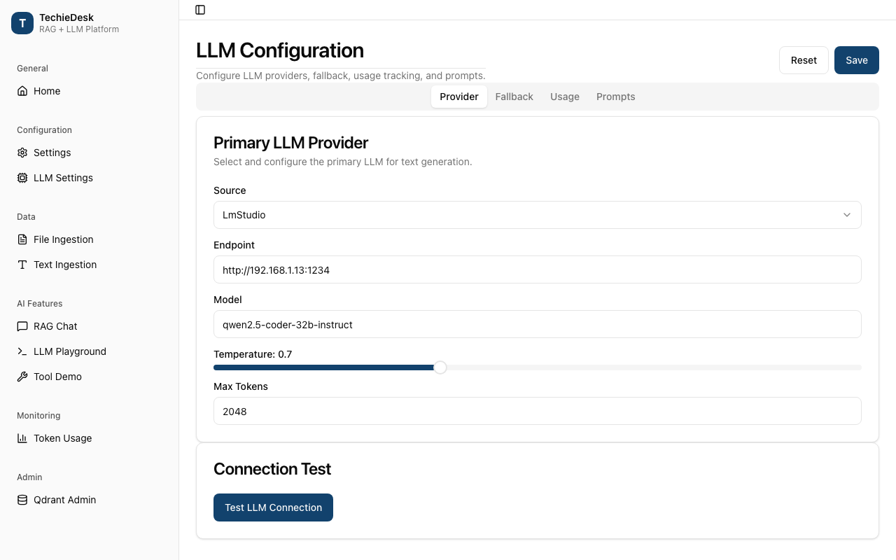

# TechieRag — Developer Guide

| | |
|---|---|
| App | TechieRag |
| Kind | library |
| Size | Small |
| Phase | 3 of 3 |
| Verified on | 2026-10-08 |
| Date | 2026-10-08 |

This guide maps the eight public surfaces phase 3 changed to the code that serves them, read at file and line on 2026-10-06 and re-read on 2026-10-07 and 2026-10-08: workspace pinning and testing, connector run results, document replace on re-ingest, the tool registry, storage defaults, flow step names and model use, the local model fit check, and model routing (REQ-RAG-114 to REQ-RAG-127, BRD-174 to BRD-187). Phase-1 services are in `docs/TechieRag-DevGuide.md`, phase-2 services in `docs/TechieRag-P2-DevGuide.md`.

No sample calls any phase-3 surface: the probe (`samples/TechieRag.Probe`) only embeds, stores, searches and generates. So every entry is `static-only (unconfirmed)` at runtime. What was run on 2026-10-06 is the build (`bash .tfcore/utils/tf-build.sh`: PASS, rung 2, 0 warnings) and each requirement's tests, one filter per id (`~/.dotnet/dotnet test tests/TechieRag.Tests/TechieRag.Tests.csproj --no-build --filter "DisplayName~REQ-RAG-<id>"`): 53 tests, 0 failed. On 2026-10-07 the Sevak fixes (TR-RAG-049 in storage defaults, TR-RAG-047 as the new local model entry) were built and verified: build PASS, every test project run on its own, 0 failed. The other entries' file and line references were re-checked against the code that day and still hold. Each entry gives its counts. The images are the July 2026 screens of the sample application of that time (TechieDesk, now Sevak, in its own repository); they predate phase 3 and show where a host would use the surface, not the change itself. Line numbers are as of "Verified on"; when a line has moved, search for the function named in the same row.

## Architecture cheat-sheet

| Layer | Project or folder | What lives here |
|---|---|---|
| Public entry points | `src/TechieRag/ITechieRag.cs`, `TechieRagBuilder.cs`, `DependencyInjection/` | keyed `IngestTextAsync`, `UseSqliteVec()`, the `IWorkspaceManager` registration |
| Workspaces | `src/TechieRag/Services/WorkspaceManager.cs`, `Abstractions/IWorkspaceManager.cs` | pinned retrieval, the test seam |
| Search | `src/TechieRag/TechieRagClient.cs`, `Models/SearchOptions.cs`, `VectorStores/` | document-set search, rerank resolution |
| Connectors | `src/TechieRag/Connectors/`, `Connectors/Email/` | partial run results, item outcomes, mail parse notes |
| Storage defaults | `src/TechieRag/Models/DataRoot.cs`, `Persistence/Sqlite*Store.cs` | the per-app database location |
| Tools and flows | `src/TechieRag/Services/ToolRegistry.cs`, `Orchestration/` | tool replace, step names, model use |
| Model routing | `src/TechieRag/Llm/LlmProviderFactory.cs`, `Llm/LlmModelLister.cs` | model listing, the per-call endpoint |
| Local model fit check | `src/TechieRag.Local/` (`LocalLlmProvider.cs`, `LocalModel.cs`, `AvailableMemory.cs`, `LocalModelStore.cs`) | the pre-download reads, the early memory refusal, per-provider progress |
| Tests | `tests/TechieRag.Tests`, `tests/TechieRag.Local.Tests`, `tests/TechieRag.Agents.Tests` | the phase-3 test files named per entry, plus the shared overload check (`PublicApi/OverloadShapeCheck.cs`, linked into all three) |

## Screen-by-screen code map

### Workspace pinning and testing: `WorkspaceManager`, `IWorkspaceManager` (`TechieRag`)

REQ-RAG-114, REQ-RAG-115, REQ-RAG-116. Covered by `tests/TechieRag.Tests/Services/WorkspacePinnedRetrievalTests.cs`.

**Runtime:** `static-only (unconfirmed)`; tests run 2026-10-06: REQ-RAG-114 4 passed, REQ-RAG-115 4 passed, REQ-RAG-116 3 passed.

**Call chain:** `WorkspaceManager.AskAsync` / `BuildContextAsync` → `ComposeContextAsync` → `ResolveScopeAsync` → `SearchInScopeAsync` → `CollectPinnedChunksAsync` → `TechieRagClient.SearchAsync(question, SearchOptions { DocumentFilters, Rerank })` → `ResolveRerank` → `IEmbeddingProvider.EmbedAsync` → `IVectorStore.SearchDocumentsAsync` (SQLite `DocumentId IN (...)`, Postgres `= ANY`, Qdrant `Should`) → `ApplyRerankAsync` when on → `ApplyContextBudget`. Stand-in: `AddTechieRag` → `TryAddSingleton<IWorkspaceManager>(ITechieRag.GetWorkspaceManager())`.

`CollectPinnedChunksAsync` sends every in-scope pinned id down as `DocumentFilters`, so five pinned documents cost one embedding and one store query. It asks for ids × 3 × 5 chunks, groups by document and keeps 3 each. A pinned document that won no slot is searched alone as a fallback, so it stays in context (BRD-44). Both searches pass `Workspace.RerankEnabled`, so the workspace switch decides reranking for pinned results in both directions, never the library default.

`IVectorStore.SearchDocumentsAsync` is a default interface method that loops per document; the three built-in stores override it with one filtered query. `IWorkspaceManager` mirrors `WorkspaceManager`'s public members; `GetWorkspaceManager()` still returns the concrete type (owner decision 2026-10-06), and `TryAdd` keeps a stand-in the host registered first.

| File and line | Function | Watch | Expected value |
|---|---|---|---|
| `src/TechieRag/Services/WorkspaceManager.cs:711` | `CollectPinnedChunksAsync` | `pinnedIds` | distinct in-scope pinned ids; empty returns at line 709 |
| `src/TechieRag/Services/WorkspaceManager.cs:716` | `CollectPinnedChunksAsync` | `TopK`, `Rerank` | `pinnedIds.Count × 15`; `workspace.RerankEnabled` (line 718) |
| `src/TechieRag/Services/WorkspaceManager.cs:729` | `CollectPinnedChunksAsync` | `byDocument.TryGetValue` | true for every id in the usual case; false runs the fallback search |
| `src/TechieRag/TechieRagClient.cs:479` | `SearchAsync` | `options.DocumentFilters` | non-empty takes `SearchDocumentsAsync`; else `SearchAsync` with `DocumentFilter` |
| `src/TechieRag/VectorStores/SqliteVecStore.cs:389` | `ScoreAllChunks` | `sql` | `... AND DocumentId IN (?1, ..., ?n)` |
| `src/TechieRag/DependencyInjection/ServiceCollectionExtensions.cs:87` | `AddTechieRag` | the registered `IWorkspaceManager` | the host's stand-in when registered first, else the client's `WorkspaceManager` |

**Calculations on this service:** pinned `TopK` = pinned ids × `PinnedChunksPerDocument` (3) × `OversampleFactor` (5) (`WorkspaceManager.cs:47-48`, `:716`); `fetchCount` = max(topK, `Rerank.CandidateCount`) when reranking (`TechieRagClient.cs:476`).

### Connector run results: `ConnectorRunner`, `ConnectorItemFailure`, `MimeParser` (`TechieRag`)

REQ-RAG-117, REQ-RAG-118, REQ-RAG-119. Covered by `Connectors/ConnectorPartialRunTests.cs` and `Connectors/Email/MailParseNotesTests.cs`.

**Runtime:** `static-only (unconfirmed)`; tests run 2026-10-06: REQ-RAG-117 6 passed, REQ-RAG-118 5 passed, REQ-RAG-119 5 passed.

**Call chain:** `ConnectorIngestionExtensions.IngestConnectorAsync` → `ConnectorRunner.RunAsync` → `RunCoreAsync` → `IDataConnector.ListAsync` → size check → `IDataConnector.FetchAsync` (`EmailConnector.FetchAsync` → `MimeParser.Parse` → `ReadPart` → `AddNote`) → `onDocument` → `ITechieRag.IngestTextAsync`; on cancel `catch OperationCanceledException` → `BuildPartialResult` → `throw ConnectorRunCanceledException`; on failure `ConnectorException.PartialResult` set → rethrow; both re-wrapped by `IngestConnectorAsync` with `PartialIngestion`.

A cancelled run throws `ConnectorRunCanceledException`, an `OperationCanceledException`, so existing cancel handling still catches it; `PartialResult` holds the documents, failures and sync state so far. A run that fails part-way puts the same on `ConnectorException.PartialResult`. The partial sync keeps the previous run's `LastRunUtc`, since advancing it would hide unreached items, and keeps every item version finished this run, so the next run sees them as unchanged. Nothing is pruned.

`ConnectorItemFailure.Outcome` is `Failed` by default; an over-size item and an item with no text are `Skipped`. The size reason is built with the invariant culture: digits, no separator. `BuildMetadata` and `ConnectorDocumentKey` are public.

`MimeParser` records a part nested past `MaxNestingDepth` (10) as `MailParseCodes.NestingTooDeep`, and an attachment past 1,000 as `AttachmentLimitReached`, on `ParsedMailMessage.Notes`, at most 100 notes.

| File and line | Function | Watch | Expected value |
|---|---|---|---|
| `src/TechieRag/Connectors/ConnectorRunner.cs:194` | `RunCoreAsync` | the `Reason` string | `Skipped: <size> bytes exceeds the <max>-byte limit for one item.`, plain digits; `Outcome` `Skipped` (198) |
| `src/TechieRag/Connectors/ConnectorRunner.cs:264` | `RunCoreAsync` | `sync.ItemVersions[item.Id]` | set only after a successful fetch and hand-over |
| `src/TechieRag/Connectors/ConnectorRunner.cs:294` | `RunCoreAsync` (cancel catch) | `fetchedCount` | items finished before the cancel; 3 in the acceptance case |
| `src/TechieRag/Connectors/ConnectorRunner.cs:358` | `BuildPartialResult` | `LastRunUtc` | `previousSync?.LastRunUtc`, never now |
| `src/TechieRag/Connectors/ConnectorIngestionExtensions.cs:87` | `IngestConnectorAsync` | `PartialIngestion` | ids ingested so far, run failures then ingestion skips, partial sync |
| `src/TechieRag/Connectors/Email/MimeParser.cs:301` | `ReadPart` | `depth` | above 10 adds a `NestingTooDeep` note (303) and returns |

**Calculations on this service:** none beyond counting; the note's `PartName` is the decoded file name, else the media type, else `(unlabelled)` (`MimeParser.cs:279-283`).

### Document replace on re-ingest: `ITechieRag.IngestTextAsync(text, name, sourceKey, metadata)` (`TechieRag`)

REQ-RAG-120. Covered by `Ingestion/KeyedTextIngestionTests.cs`.

**Runtime:** `static-only (unconfirmed)`; tests run 2026-10-06: REQ-RAG-120 6 passed.

**Call chain:** `TechieRagClient.IngestTextAsync(text, documentName, sourceKey, metadata)` → `IngestTextCoreAsync` → `DocumentIdForKey(sourceKey)` → `TextChunker.ChunkText` → `EmbedAndStampAsync` → `IVectorStore.DeleteByDocumentAsync(documentId)` → `IVectorStore.UpsertBatchAsync`. Connectors: `IngestConnectorAsync` → `ConnectorDocumentKey(connector, item)` → the same overload.

The new overload sits beside the old one; a null or empty key behaves exactly like it, with a fresh GUID. With a key, the document id is a GUID built from the SHA-256 of `techierag-source-key:<key>`, so every call with that key addresses one document and its workspace memberships survive. The new text is chunked and embedded first; only then are the old chunks deleted and the new ones stored, so a failed embedding leaves the earlier copy rather than nothing. The key is stamped on each chunk as `DocumentMetadataKeys.SourceKey`.

`ITechieRag` carries a default implementation for third-party clients: it lists documents, deletes those whose `SourceKey` matches, then ingests with the key in the metadata. That order deletes before embedding, and the id is not stable.

Connector ingestion passes `connector:<source type>:<source name>:<item id>`, not the bare item id, so two connectors with an item called `INBOX/1` never replace each other.

| File and line | Function | Watch | Expected value |
|---|---|---|---|
| `src/TechieRag/TechieRagClient.cs:253` | `IngestTextAsync` (keyed) | `sourceKey` | null for empty, otherwise unchanged |
| `src/TechieRag/TechieRagClient.cs:285` | `IngestTextCoreAsync` | `documentId` | same GUID for the same key on every call and process |
| `src/TechieRag/TechieRagClient.cs:332` | `IngestTextCoreAsync` | `chunk.Metadata["SourceKey"]` | the caller key |
| `src/TechieRag/TechieRagClient.cs:351` | `IngestTextCoreAsync` | `DeleteByDocumentAsync(documentId)` | reached only after `EmbedAndStampAsync` returned |
| `src/TechieRag/ITechieRag.cs:74` | `IngestTextAsync` (default) | `stored` | the listed document's `SourceKey`; equal to the key means deleted (77) |
| `src/TechieRag/Connectors/ConnectorIngestionExtensions.cs:130` | `ConnectorDocumentKey` | the return | `connector:Email:<name>:<item id>` for a mail item |

**Calculations on this service:** `DocumentIdForKey` (`TechieRagClient.cs:260`): the first 16 bytes of SHA-256(`"techierag-source-key:" + key`) as a GUID.

### Tool registry: `ToolRegistry.Register` (`TechieRag`)

REQ-RAG-121. Covered by `Services/ToolRegistryReplaceTests.cs`.

**Runtime:** `static-only (unconfirmed)`; tests run 2026-10-06: REQ-RAG-121 3 passed.

**Call chain:** `ToolRegistry.Register(name, description, parametersSchema, handler)` (the synchronous overload wraps its delegate and calls it) → `definitions.FindIndex` (case-insensitive) → replace in place or `Add` → `handlers[name] = handler`. At answer time: `AgentLoopRunner.BuildToolOptions` → `LlmCompletionOptions.Tools = toolHandler.ToolDefinitions` → the provider's tool list; `ToolRegistry.ExecuteToolAsync` → `handlers.TryGetValue`.

Before phase 3 a second registration replaced the handler but appended a second definition, so the model saw the name twice with the stale description. Now `Register` looks for an existing definition by name, ignoring case like the handler dictionary, and overwrites it at the same index, so the tool keeps its place in `ToolDefinitions` and the description the model reads belongs to the handler that runs. A new name is appended.

`ToolDefinitions` is the live list, not a copy; `GuardedToolHandler` and `CompositeToolHandler` read through it, so they see the replacement too.

| File and line | Function | Watch | Expected value |
|---|---|---|---|
| `src/TechieRag/Services/ToolRegistry.cs:57` | `Register` | `existing` | −1 on the first registration; the earlier index on a repeat, any case |
| `src/TechieRag/Services/ToolRegistry.cs:60` | `Register` | `definitions[existing]` | the new description and schema |
| `src/TechieRag/Services/ToolRegistry.cs:67` | `Register` | `handlers.Count` | unchanged on a repeat (case-insensitive key) |
| `src/TechieRag/Services/AgentLoopRunner.cs:227` | `BuildToolOptions` | `Tools` | each registered name once |
| `src/TechieRag/Services/ToolRegistry.cs:90` | `ExecuteToolAsync` | `handler` | the last registered delegate for that name |

**Calculations on this service:** none.

### Storage defaults: `DataRoot`, `UseSqliteVec()`, `WithPersistence(provider, connectionString = null, defaultUserId)` (`TechieRag`)

REQ-RAG-122. Covered by `Persistence/DefaultDatabaseLocationTests.cs`, `Persistence/PersistenceOverloadTests.cs` and `PublicApi/OverloadShapeTests.cs` (Sevak TR-RAG-049, 2026-10-07).

**Runtime:** `static-only (unconfirmed)`; tests run 2026-10-07: REQ-RAG-122 19 passed (18 in `TechieRag.Tests`, 1 in `TechieRag.Agents.Tests`).

**Call chain:** `TechieRagBuilder.UseSqliteVec()` → `UseVectorStoreAtDefaultLocation` → `Build` → `CreateVectorStore` → `config.VectorStore.IsConnectionStringSet` false → `DataRoot.ResolveDefaultConnectionString(logger)` → `ResolveDefaultDatabasePath` → `ResolveDatabasePath(Environment.CurrentDirectory, logger, createDirectory: true)` → `AppDirectory` → `Current` → `BesideModelRoot(ModelRoot.Current)` → `new SqliteVecStore`. Persistence: `WithPersistence(Sqlite, connectionString: null, defaultUserId)` (or the one-argument `WithPersistence(Sqlite)`) → `CreateWorkspaceStore` → `RequirePersistenceConnectionString` → the same resolver. Configuration: `TechieRagConfigMapper` → `UseVectorStoreAtDefaultLocation` or `WithPersistence(Sqlite, connectionString: null, defaultUserId)` when no connection string is given.

Resolution follows the models' order: a folder set with `DataRoot.Set`, else `data` beside `ModelRoot.Current` (so `ModelRoot.Set` or `TECHIERAG_MODEL_ROOT` move data too), else `<LocalApplicationData>/TechieRag/data` (iOS and Catalyst: `<home>/Library/Application Support/TechieRag/data`). The database is `<root>/<app name>/techierag.db`; the app name is `SetAppName`'s value, else the entry assembly name. An existing `techierag.db` in the run folder wins, with a warning naming the folder; nothing is moved. An explicit path or connection string, including `UseSqliteVec("x.db")`, is used as given. `DataRoot.DefaultDatabasePath` returns the location without creating or logging.

**One persistence method (TR-RAG-049).** 1.1.2's `WithPersistence(StoreProvider, string defaultUserId)` captured every existing `WithPersistence(provider, "Data Source=…")`, turning the connection string into a user id, so it is removed. The connection string is now optional: null means the per-app default (SQLite only). `IsConnectionStringSet` is public. `PublicOverloadsNeverGiveOneCallTwoMeanings` fails on any overload pair with the same argument types under different names.

| File and line | Function | Watch | Expected value |
|---|---|---|---|
| `src/TechieRag/Models/DataRoot.cs:49` | `Current` | `configured` | the `DataRoot.Set` path, else `…/TechieRag/data` |
| `src/TechieRag/Models/DataRoot.cs:73` | `AppName` | `entry` | the entry assembly name, invalid characters as `_` |
| `src/TechieRag/Models/DataRoot.cs:154` | `ResolveDatabasePath` | `File.Exists(legacy)` | false for a new app; true logs the warning (156) and returns the run-folder file |
| `src/TechieRag/Models/DataRoot.cs:168` | `ResolveDatabasePath` | the return | `<data root>/<app name>/techierag.db`, folder created |
| `src/TechieRag/TechieRagBuilder.cs:1091` | `CreateVectorStore` | `IsConnectionStringSet` | false for `UseSqliteVec()`; true keeps the caller's string |
| `src/TechieRag/TechieRagBuilder.cs:961` | `RequirePersistenceConnectionString` | `config.Persistence.Provider` | `Sqlite` with no string resolves the default; others throw (966) |
| `src/TechieRag/TechieRagBuilder.cs:739` | `WithPersistence` | `connectionString` | the caller's string for a two-argument call; null only when named or omitted, and then `provider` must be `Sqlite` |
| `src/TechieRag/TechieRagConfig.cs:229` | `IsConnectionStringSet` | `connectionString` field | null until set; the getter (221) then returns the per-app default |
| `tests/TechieRag.Tests/PublicApi/OverloadShapeCheck.cs` | `FindConflictingArity` | `sameTypes`, `differentNames` | never both true for one arity in a shipped assembly |

**Calculations on this service:** `BesideModelRoot` (`DataRoot.cs:182`): the model root's parent plus `data`.

### Flow step names and model use: `FlowNodeCatalog.CreateNode`, `FlowDefinition.UsesLanguageModel` (`TechieRag`)

REQ-RAG-123, REQ-RAG-124. Covered by `Orchestration/FlowStepNameAndModelUseTests.cs`.

**Runtime:** `static-only (unconfirmed)`; tests run 2026-10-06: REQ-RAG-123 3 passed, REQ-RAG-124 4 passed.

**Call chain:** `FlowNodeCatalog.CreateNode(kind, id, stepName)` (the two-argument overload passes null) → `Describe(kind).DisplayName` when the name is blank → `new FlowNode { Id, Kind, Name }`. Model use: `FlowDefinition.UsesLanguageModel()` → `GetLanguageModelSteps()` → `FlowNodeCatalog.Kinds` → `FlowNodeKindDescriptor.UsesLlm`.

`CreateNode` gained an optional step name. The library has no localisation, so its default name is the catalogue's English `DisplayName`; the doc comment tells a host to pass its own, localized name. A blank name falls back to the English one. The id rule is unchanged: the given id, or `<kind>-<guid>` cut to 24 characters.

`GetLanguageModelSteps()` returns, in declaration order, the nodes whose kind the catalogue marks `UsesLlm`; only `Agent` is marked (`FlowNodeCatalog.cs:123`), while `Tool`, `Condition`, `Handoff` and `Terminal` are not. `UsesLanguageModel()` is true when that list is not empty. Both are methods rather than properties so `FlowSerializer` never writes them into saved flow JSON, and they read the same flag the palette shows, so a host can decide whether a flow needs a configured model or may run offline.

| File and line | Function | Watch | Expected value |
|---|---|---|---|
| `src/TechieRag/Orchestration/FlowNodeCatalog.cs:214` | `CreateNode(kind, id)` | `stepName` passed on | null, so the English display name |
| `src/TechieRag/Orchestration/FlowNodeCatalog.cs:231` | `CreateNode(kind, id, stepName)` | `Name` | the host's step name; blank gives `Describe(kind).DisplayName` |
| `src/TechieRag/Orchestration/FlowNodeCatalog.cs:229` | `CreateNode` | `Id` | the given id, else `agent-<guid>` cut to 24 characters |
| `src/TechieRag/Orchestration/FlowDefinition.cs:113` | `GetLanguageModelSteps` | the list | every `Agent` node; empty for a flow of tools and conditions |
| `src/TechieRag/Orchestration/FlowDefinition.cs:119` | `UsesLanguageModel` | the return | true with one Agent step |

**Calculations on this service:** none.

### Local model fit check: `LocalLlmProvider.IsRuntimeAvailable`, `LocalModel.EstimateRequiredMemoryBytes`, `AvailableMemory.Read` (`TechieRag.Local`)

REQ-RAG-125 (Sevak TR-RAG-047, added 2026-10-07). Covered by `tests/TechieRag.Local.Tests/PreDownloadFitTests.cs`.

**Runtime:** `static-only (unconfirmed)`: the probe (`LocalProbeRunner.cs`) loads and generates but calls none of the new reads. In the tests on Linux x64 the reads ran for real (`IsRuntimeAvailable` true, `AvailableMemory.Read()` above zero). Tests run 2026-10-07: REQ-RAG-125 10 passed (6 Local, 4 reference checks).

**Call chain:** `IsRuntimeAvailable` → `LocalRuntimeSelector.IsSupported`; `EstimateRequiredMemoryBytes` → variant `DownloadBytes` (or `FolderBytes`) → context size → `EstimateMemoryBytes`. Load: `LoadAsync` → `Resolve` → `IsOnDisk` false → `MemoryGate.Ensure` → `LocalModelStore.EnsureAsync` → `RequireTermsAsync` → `DownloadReportingAsync` → `ModelDownloadService.DownloadAsync` → `VerifyAsync` → `ApplyGenAiConfig` (Hugging Face) → `MemoryGate.Ensure` again → `runtime.Load`.

The reads are the ones the load uses, so a host's answer and the load agree. With files missing, the memory check runs before the terms and the first request. The later check stays: a Hugging Face model's cache size arrives in its `genai_config.json`, so its early estimate is a lower bound. A model on disk is checked once, as before.

`DownloadProgress` subscribes to the shared `ProgressChanged` only during this download, forwards events carrying this model's id, and reports copies (the service mutates one object). Downloads run one at a time, so the id separates them.

| File and line | Function | Watch | Expected value |
|---|---|---|---|
| `src/TechieRag.Local/LocalLlmProvider.cs:113` | `IsRuntimeAvailable` | the return | false on an Intel Mac or in a browser; true on Windows and Linux x64/Arm64, Apple-silicon macOS, Android, iOS, Mac Catalyst |
| `src/TechieRag.Local/LocalModel.cs:377` | `EstimateRequiredMemoryBytes` | `weightBytes` | the catalogue variant's bytes; null for an unresolved Hugging Face model or a missing host folder |
| `src/TechieRag.Local/LocalModel.cs:391` | `EstimateRequiredMemoryBytes` | the return | weights + `KvBytesPerToken` × context + 256 MB (`RuntimeOverheadBytes`, line 29) |
| `src/TechieRag.Local/LocalLlmProvider.cs:196` | `LoadAsync` | `Model.EstimateMemoryBytes(...)` | reached only when `IsOnDisk` (194) is false; throws `LocalModelMemoryException` before line 201 when short |
| `src/TechieRag.Local/LocalLlmProvider.cs:206` | `LoadAsync` | `available` | the second check, with the full estimate after the download |
| `src/TechieRag.Local/LocalModelStore.cs:173` | `DownloadReportingAsync` (`Forward`) | `changed.ModelName` | this model's id; any other name is not reported |
| `src/TechieRag.Local/LocalModelStore.cs:186` | `DownloadReportingAsync` | the handler | removed in `finally`, so a later download of another model never reaches this provider's option |
| `src/TechieRag.Local/AvailableMemory.cs:28` | `Read` | the return | Linux and Android `MemAvailable`; Windows available physical memory; iOS `os_proc_available_memory()`; null when unreadable |

**Calculations on this service:** required bytes = weight bytes + `KvBytesPerToken` × context size + 256 MB (`LocalModel.cs:348`); context size = the asked size, else 2,048 on a phone and 4,096 elsewhere, never above `ContextLength` (`LocalModel.cs:385`).

### Model routing: `LlmProviderFactory.ListModelsAsync`, `CreateForModel(…, endpoint)` (`TechieRag`)

REQ-RAG-126, REQ-RAG-127 (Lekhak TR-RAG-004 and TR-RAG-005, added 2026-10-08). Covered by `tests/TechieRag.Tests/Llm/ModelListingAndEndpointTests.cs`.

**Runtime:** `static-only (unconfirmed)`: no sample lists models or passes an endpoint. The tests run both calls end to end against a loopback HTTP server. Tests run 2026-10-08: REQ-RAG-126 6 passed, REQ-RAG-127 3 passed.

**Call chain:** listing: `ListModelsAsync(route)` → `ListModelsAsync(connector)` → `WithEndpoint(connector, endpoint)` → `LlmModelLister.ListAsync` → key check → path by `Source` → `GET` → `LlmHttpGuard.EnsureSuccess` → `ReadOpenAIModels` or `ReadOllamaModels` → distinct, sorted. Provider: `CreateForModel(…, endpoint)` → `ModelRouter.Require` → `WithEndpoint(route, endpoint)` → `Create`.

LM Studio answers `v1/models`, an OpenAI-compatible connector `models` under its own base path (so Groq's `/openai/v1` stays), and Ollama `api/tags`. A refusing or unreachable server throws; an empty list only ever means the server listed nothing. Anthropic, Gemini, subscription and in-process connectors throw `NotSupportedException`.

`CreateForModel` has two overloads. The new one ends with an optional `endpoint`. The 1.1.2 five-argument shape is kept with no defaults and hidden from IntelliSense, so code compiled against it still binds and every shorter call reaches the new one. `PublicOverloadsNeverGiveOneCallTwoMeanings` passes because both use the same names for the same positions.

| File and line | Function | Watch | Expected value |
|---|---|---|---|
| `src/TechieRag/Llm/LlmProviderFactory.cs:119` | `CreateForModel` | `endpoint` | null keeps the catalog endpoint; a URL replaces it |
| `src/TechieRag/Llm/LlmProviderFactory.cs:213` | `WithEndpoint` | `uri.Scheme` | `http` or `https`; anything else throws `ArgumentException` |
| `src/TechieRag/Llm/LlmModelLister.cs:43` | `ListAsync` | `path` | `v1/models` (LM Studio), `models` (OpenAI-compatible), `api/tags` (Ollama) |
| `src/TechieRag/Llm/LlmModelLister.cs:54` | `ListAsync` | `request.RequestUri` | the endpoint plus the path, base path kept |
| `src/TechieRag/Llm/LlmModelLister.cs:62` | `ListAsync` | `response.StatusCode` | 2xx; 429 raises `LlmRateLimitException`, others `HttpRequestException` |
| `src/TechieRag/Llm/LlmModelLister.cs:65` | `ListAsync` | the return | the ids, distinct and sorted ordinally |

**Calculations on this service:** none.

## Cross-cutting flows

Phase 1's flows are in `docs/TechieRag-DevGuide.md` and phase 2's changes in `docs/TechieRag-P2-DevGuide.md`. Phase 3 changed two; the local model's load order changed in its own entry above.

### Configuration
**Call chain:** `ServiceCollectionExtensions.AddTechieRag(IConfiguration)` → `TechieRagConfigMapper.Apply` → `UseVectorStoreAtDefaultLocation` when the vector store section names no connection string (`TechieRagConfigMapper.cs:55`), `WithPersistence(StoreProvider.Sqlite, connectionString: null, defaultUserId)` when SQLite persistence names none (`:173`) → `TechieRagBuilder.Build()`. `AddTechieRag` also registers `IWorkspaceManager` with `TryAdd` (`ServiceCollectionExtensions.cs:87`). `VectorStoreConfig.ConnectionString` reads `DataRoot.DefaultConnectionString` when never set (`TechieRagConfig.cs:221`); `IsConnectionStringSet` (`:229`, public since 2026-10-07) says whether it was set. No new environment variable: `TECHIERAG_MODEL_ROOT` moves data and models together.

### Logging and errors
`DataRoot.ResolveDatabasePath` logs one warning when it keeps a run-folder `techierag.db` (`DataRoot.cs:156`), under the logger category `TechieRag.Models.DataRoot`. `ConnectorRunner` logs the cancel at Information (`ConnectorRunner.cs:292`). Errors: `ConnectorRunCanceledException` and `ConnectorException` now carry `PartialResult` and `PartialIngestion`; mail parse losses are codes (`MailParseCodes`) on `ParsedMailMessage.Notes`, not exceptions. The rest is unchanged from phase 1.

## Known issues

Found while reading the code for this guide on 2026-10-06 and 2026-10-07; none contradicts a requirement's acceptance.

- Fixed 2026-10-06 (fix-issues): REQ-RAG-119, `EmailConnector` now copies `ParsedMailMessage.Notes` onto the item's metadata under `ParseNotesMetadataKey` (`src/TechieRag/Connectors/Email/EmailConnector.cs:43`, written at `:263`), so a connector sync sees them too. REQ-RAG-116, the `IWorkspaceManager` registration (`ServiceCollectionExtensions.cs:88`) throws `InvalidOperationException` naming `WithPersistence` when no persistence is configured, instead of returning null.
- REQ-RAG-120: connector ingestion keys documents by `connector:<type>:<name>:<item id>` rather than the bare item id the BRD names; deliberate and documented at `ConnectorIngestionExtensions.cs:121-124`.
- REQ-RAG-118: the byte-budget stop is still logged with `{Bytes:N0}` (`ConnectorRunner.cs:272`), culture-formatted; it is a log line, not an item reason, so the requirement holds.
- REQ-RAG-125: for a Hugging Face model, `EstimateRequiredMemoryBytes` before the download leaves out the context cache (`KvBytesPerToken` is 0 until `ApplyGenAiConfig`, `LocalModel.cs:447`), so the early check can pass a model the check after the download refuses. This is documented on the method and in the AI reference.
- REQ-RAG-122: removing 1.1.2's `WithPersistence(StoreProvider, string defaultUserId)` breaks binary compatibility with an assembly compiled against 1.1.2 that called it (`MissingMethodException`). The next release notes must say so.
