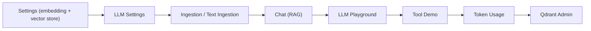

# TechieRag — Usage Guide (Test Users · Test Plan · Setup)

> The single source for **how to test and run** this project. Every agent (flow-master self-smoke, the verifier) and the human UAT use the SAME setup and the SAME walkthrough listed here.

## Test users (canonical — use THESE for all smoke / verify / UAT)

**TechieRag is a library, and the `TechieRagWeb` sample has NO authentication / user accounts** — it is a single-user, config-driven demo with no login. There are therefore no user credentials to seed. What the test plan *does* require is **provider configuration** (local services + cloud API keys), captured below. No accounts are created in day-1.

| # | "Account" | Secret | Role / Purpose | Created? | Notes |
|---|-----------|--------|----------------|----------|-------|
| 1 | (none — no auth) | — | TechieRagWeb has no login | ✅ | Single-user demo; nothing to create |

### Provider configuration the test plan uses (supply your own — never invent keys)

| Provider / service | Secret / endpoint | Needed for | Status |
|--------------------|-------------------|-----------|--------|
| Ollama (local) | `http://localhost:11434`, model `bge-m3` | Embedding (Priority 1) | local — no auth |
| LM Studio (local) | `http://localhost:1234` | Local LLM (Priority 1) | local — no auth |
| OpenAI / compatible | API key | Cloud LLM testing | {supply at /llm-settings} |
| Azure AI Foundry | endpoint + API key + api-version | Cloud LLM testing | {supply at /llm-settings} |
| Google Gemini | `GOOGLE_API_KEY` | LLM (Priority 3) | {supply at /llm-settings} |
| Anthropic | `ANTHROPIC_API_KEY` | LLM (Priority 3) | {supply at /llm-settings} |
| Qdrant (optional) | `http://localhost:6333` (Docker) | Qdrant vector store + admin page | local — managed via /qdrant-admin |
| TrBlazeUI packages | GitHub PAT (`read:packages`) in `nuget.config` | Restoring/running the sample app | {required to build TechieRagWeb} |

- Provider settings are entered at runtime on `/settings` and `/llm-settings`, and persisted to `techierag-config.json`. No secrets are hardcoded; supply them at the UI.

## How to test — screen by screen / menu by menu

The sample (`samples/TechieRagWeb`) exposes ten pages. Walk them in this order; each names the config to use, the steps, the expected result, and the BRD/REQ it covers. (Reference: `docs/integration-testing-guide.md`, 21 scenarios S1–S21.)



### Home (`/`)
- **Config:** none
- **Steps:** 1) open `/` → 2) confirm navigation to every feature page.
- **Expected:** landing page renders; all nav links resolve.
- **Covers:** BRD-62 (entry), REQ-UI-001

### Settings (`/settings`)
- **Config:** Embedding = Ollama, endpoint `http://localhost:11434`, model `bge-m3`; Vector store = SqliteVec.
- **Steps:** 1) set the fields → 2) Save → 3) Initialize.
- **Expected:** success toast; client initializes; config persisted to `techierag-config.json`.
- **Covers:** BRD-62, REQ-UI-002, REQ-RAG-002/003

### LLM Settings (`/llm-settings`)
- **Config:** a reachable LLM (LM Studio on 1234, or OpenAI/Azure key).
- **Steps:** 1) Primary tab — set provider/endpoint/model → 2) Test connection → 3) optionally set Fallback / Usage budget / Resilience / Prompts → 4) Save.
- **Expected:** connection test passes; each tab's config saves and reloads.
- **Covers:** BRD-63, BRD-69, REQ-UI-003/009, REQ-RAG-006/011/012/013/014

### Ingestion (`/ingestion`) + Text Ingestion (`/text-ingestion`)
- **Config:** embedding configured (above).
- **Steps:** 1) upload `dotnet-basics.pdf`, `cooking-recipes.md`, `company-policy.txt`, `techierag-readme.md` → 2) enter a space-exploration paragraph via Text Ingestion.
- **Expected:** each ingest returns a doc id; document/chunk counts increase.
- **Covers:** BRD-64, REQ-UI-004, REQ-RAG-001

### Chat (`/chat`)
- **Config:** embedding + LLM configured; docs ingested.
- **Steps:** 1) ask "What is .NET?" → 2) ask "Give me a pasta recipe" → 3) ask "What is quantum computing?" (not ingested).
- **Expected:** first two answer from the ingested docs with a sources panel + relevance scores (streaming); the third returns a "no relevant context" style answer.
- **Covers:** BRD-65, REQ-UI-005, REQ-RAG-004/007

### LLM Playground (`/llm-playground`)
- **Config:** LLM configured.
- **Steps:** 1) Completion tab — run a prompt → 2) Structured Output tab — request a typed object (e.g. SentimentAnalysis) → 3) Chat tab — multi-turn.
- **Expected:** completion returns text + token counts; structured output parses into the typed object.
- **Covers:** BRD-66, REQ-UI-006, REQ-RAG-006/008

### Tool Demo (`/tool-demo`)
- **Config:** an LLM that supports tool calling (Llama 3.2 / Mistral / cloud).
- **Steps:** 1) ask a question that needs a tool (e.g. weather + doc search) → 2) inspect the execution trace.
- **Expected:** the LLM calls tools (get_weather, calculate_math, search_documents); the trace shows each step; final answer uses tool results.
- **Covers:** BRD-67, REQ-UI-007, REQ-RAG-009

### Token Usage (`/token-usage`)
- **Config:** run a few LLM operations first.
- **Steps:** 1) open the dashboard → 2) review totals, per-model breakdown, budget status.
- **Expected:** counts/costs reflect the session; budget alert appears at threshold if a budget is set.
- **Covers:** BRD-68, REQ-UI-008, REQ-RAG-011

### Qdrant Admin (`/qdrant-admin`)
- **Config:** Docker available.
- **Steps:** 1) check Docker status → 2) create/start a Qdrant container → 3) create an `astrology-kb` collection → 4) ingest 3 docs into it → 5) browse + search vectors → 6) open a vector detail → 7) switch the Chat doc filter to `astrology-kb` and confirm isolation.
- **Expected:** container lifecycle works; collection CRUD works; vectors page/search/detail; cross-collection queries don't leak.
- **Covers:** BRD-71, BRD-72, BRD-73, REQ-UI-011/012/013

## Prerequisites
- .NET 10 SDK
- Ollama with the `bge-m3` embedding model (local embedding) — `ollama pull bge-m3`
- LM Studio (optional, local LLM) and/or a cloud LLM API key
- Docker (optional — only for the Qdrant vector store + admin page)
- A GitHub PAT (`read:packages`) in `nuget.config` to restore the sample's TrBlazeUI dependency

## Setup / Deployment steps (runbook — one command per line, in order)

1. `git clone <repo> && cd TechieRag`
2. `ollama serve` (then `ollama pull bge-m3`)
3. `dotnet restore src/TechieRag/TechieRag.csproj` (libraries restore from nuget.org)
4. `/home/srkra/.dotnet/dotnet build src/TechieRag/TechieRag.csproj` (WSL rung #2 — see build-invocation-ladder.md)
5. (sample) ensure `nuget.config` has a GitHub PAT, then `/home/srkra/.dotnet/dotnet run --project samples/TechieRagWeb/TechieRagWeb.csproj`
6. Open the URL shown in the console (e.g. `http://localhost:5000`); configure `/settings` then `/llm-settings`.

## Test (automated)
```bash
/home/srkra/.dotnet/dotnet test tests/TechieRag.Tests/TechieRag.Tests.csproj
npx playwright test
```
xUnit: 11 tests (RetryHandler resilience + `Retry-After`, LmStudio provider tool-calling). Playwright: the `tests/verify/` UI/RAG specs (need the sample booted on `:5099`). Broader coverage is deferred — see PROJECT-STATUS "Deferred / future".

## Smoke checklist (quick capability pass)
- [ ] Configure Ollama embedding + SqliteVec at `/settings`; Initialize succeeds.
- [ ] Configure + test an LLM connection at `/llm-settings`.
- [ ] Ingest a document at `/ingestion`; doc/chunk count increases.
- [ ] Ask a question at `/chat`; answer cites ingested sources (streaming).
- [ ] Run a completion at `/llm-playground`; token counts show.
- [ ] Trigger a tool call at `/tool-demo`; execution trace shows steps.
- [ ] View usage at `/token-usage`.
- [ ] Create a Qdrant collection at `/qdrant-admin`; ingest + search isolated.

## Known limitations
- Sample requires a TrBlazeUI GitHub Packages PAT (`read:packages`) in `nuget.config` to restore/build (see Prerequisites). Note: the committed PAT should be untracked + revoked before publishing the repo.
- Streaming RAG chat can't return sources via the library API and bypasses the configured prompt engine — the sample works around it (TR-RAG-001, open for the TechieRag team).
- Some providers report 0 token usage on streamed completions; the sample estimates to compensate (TR-RAG-002).
- Estimated Cost reads $0.0000 for any model absent from the hard-coded pricing table (tokens are still counted).
- Qdrant Admin: DataTable action buttons rely on a wrapper scroll on narrow (390px) viewports (TR-003/TR-004 — app-side inline workaround applied).
- Tool calling / structured output reliability depends on the loaded model (cloud most reliable).
- SQLite database locking with multiple processes — use single-instance or a server-backed store.
- Token counts are ±10% estimates for providers that don't expose tokenizer detail.
- Large PDFs (>50 pages) may be slow to process.
