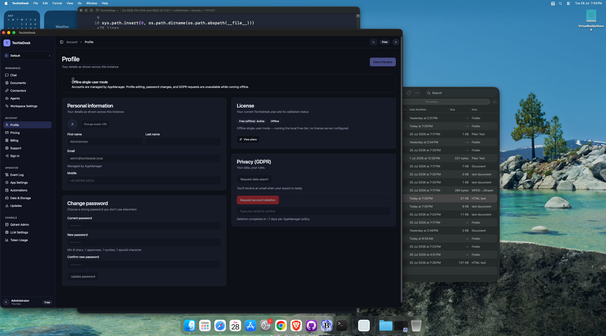
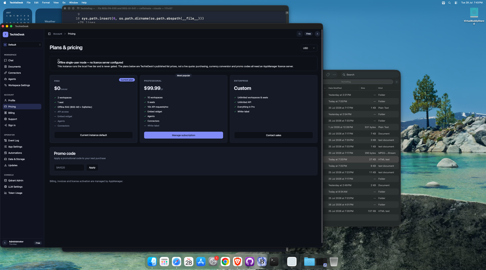
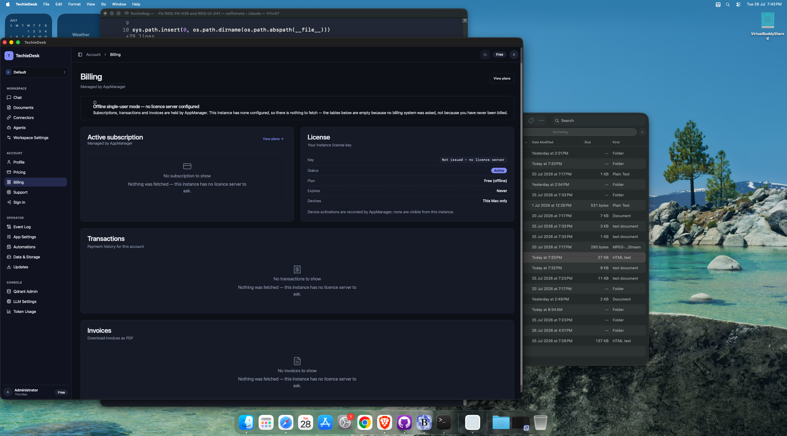
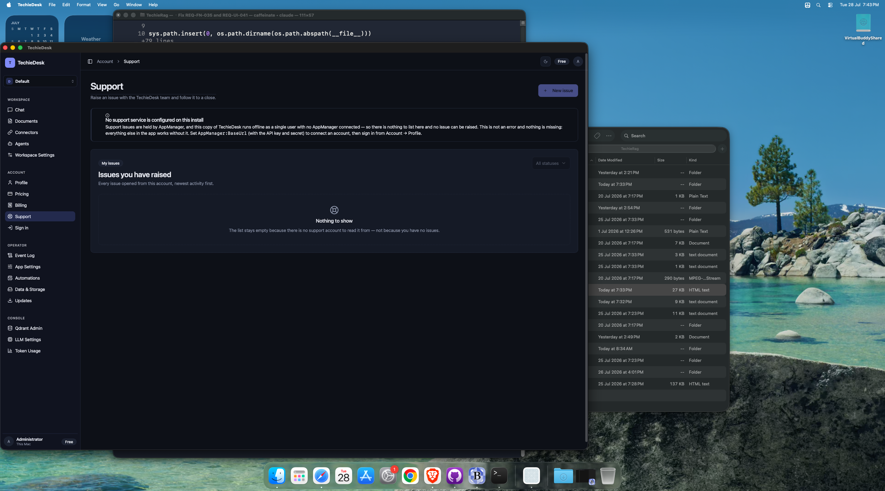
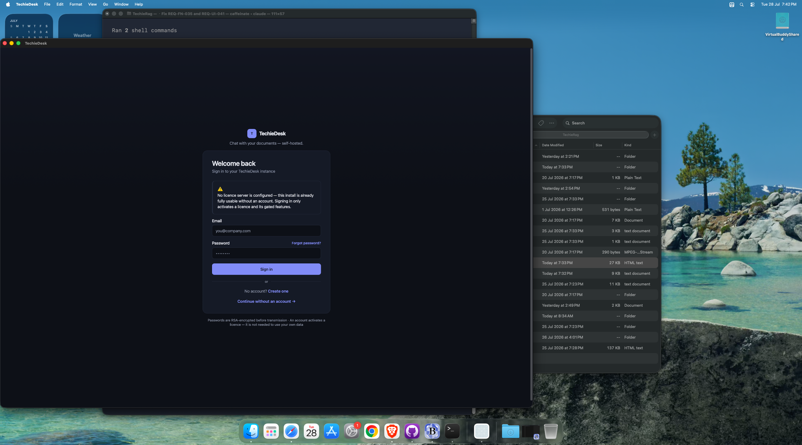
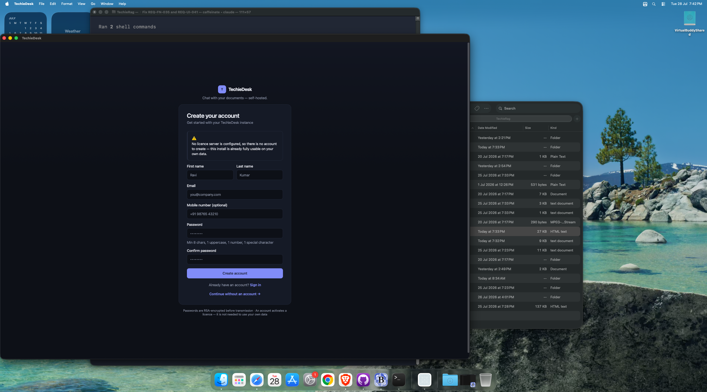
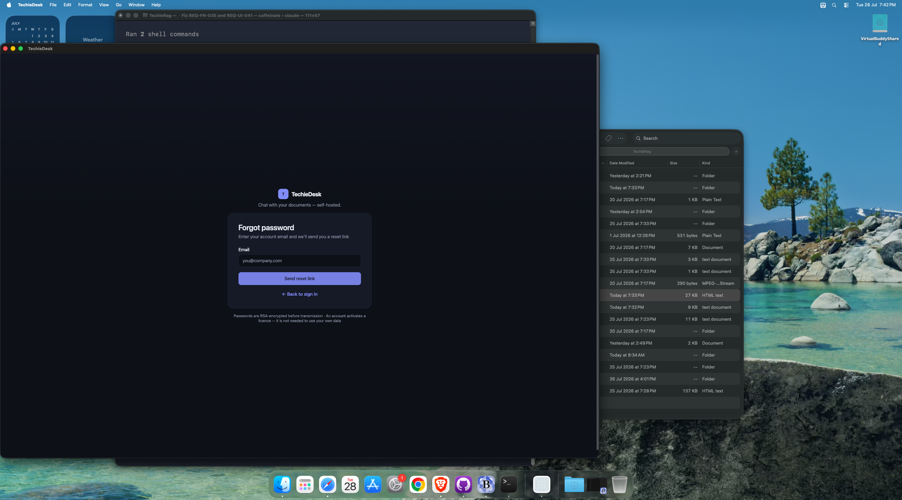

# TechieDesk DevGuide — Account

*Generated 2026-07-28 · reflects code as built.* [← index](./TechieDesk-DevGuide.md)

> ✅ **Runtime-verified 2026-07-29** — re-swept on the live **Mac Catalyst** head over Appium (`mac2`), bound by `appPath` to the universal Release bundle, driving **28 of the 30 screens** at **1600×1240** and **1024×720** (the REQ-UI-041 floor). Every `Observed` line below is what the running app did; `Visual (§4b)` is the overlap / zero-size / off-viewport geometry check plus a human look at the screenshot. Screens that could not be reached say so and are **not** claimed as verified. Screenshots: `test-results/ui-verify/`.

8 screen(s) in this area.

## `/profile` — Profile

- **File:** `apps/TechieDesk/Components/Pages/Auth/Profile.razor` (448 lines)
- **Reached via:** Sidebar → ACCOUNT → Profile
- **Observed:** renders ✓ (runtime-confirmed 2026-07-29) — offline banner, Personal information (Avatar, First/Last name, Email, Mobile), Change password (3 fields + rule hint), License panel with real values, Privacy (GDPR) with export/delete + email-confirm Input.
- **Visual (§4b):** looks-right ✓ (runtime-confirmed 2026-07-29) — 1600 and 1024: 0 overlaps, 0 zero-size; two-column layout holds at 1024.
- **Known issues (2026-07-29):** Every write path is disabled: `AppManager` is unreachable and no `AppManager:BaseUrl` ships, so profile update, password change and GDPR requests are **unexercised** (REQ-UI-010/011/012).

### Controls

| Component | Uses | Razor line(s) |
|---|---|---|
| `<Input>` | 9 | 69, 78, 84, 92… |
| `<Button>` | 5 | 19, 59, 147, 182… |
| `<Spinner>` | 4 | 22, 150, 185, 196 |
| `<Alert>` | 4 | 35, 36, 176, 177 |
| `<Card>` | 3 | 45, 107, 168 |
| `<LucideIcon>` | 2 | 36, 177 |
| `<Avatar>` | 1 | 52 |
| `<Separator>` | 1 | 191 |

### Data lineage — Razor → injected service

| Call | Service (as injected) | Razor line(s) |
|---|---|---|
| `AppManager.ChangePasswordAsync()` | `IAppManagerClient` | 356 |
| `AppManager.GetProfileAsync()` | `IAppManagerClient` | 282 |
| `AppManager.RequestAccountDeletionAsync()` | `IAppManagerClient` | 430 |
| `AppManager.RequestDataExportAsync()` | `IAppManagerClient` | 395 |
| `AppManager.UpdateProfileAsync()` | `IAppManagerClient` | 307 |
| `Logger.LogError()` | `ILogger<Profile>` | 291, 319, 401 |
| `Logger.LogInformation()` | `ILogger<Profile>` | 314, 357, 396… |
| `Logger.LogWarning()` | `ILogger<Profile>` | 363, 437 |
| `ToastService.Error()` | `ToastService` | 292, 320, 373… |
| `ToastService.Success()` | `ToastService` | 315, 359 |
| `TokenRefresher.EnsureValidTokenAsync()` | `ITokenRefresher` | 280, 306, 355… |

**Injected services:** `IAppManagerClient`, `ITechieDeskAuthModeProvider`, `ITechieDeskUserContext`, `SessionTokenStore`, `ITokenRefresher`, `ToastService`, `ILogger<Profile>`

**Conditional render guards:** 12 `@if` blocks — the render-truth risk on this screen. First few:

- `@if (isSavingProfile)` (line 20)
- `@if (!canManage)` (line 33)
- `@if (!string.IsNullOrWhiteSpace(profileImageUrl))` (line 53)

## `/pricing` — Pricing

- **File:** `apps/TechieDesk/Components/Pages/Pricing.razor` (380 lines)
- **Reached via:** Sidebar → ACCOUNT → Pricing
- **Observed:** renders ✓ (runtime-confirmed 2026-07-29) — three tier cards with prices and feature ticks, `Current plan` badge on Free, `Most popular` on Professional, currency Select (USD), promo-code Input + Apply.
- **Visual (§4b):** looks-right ✓ (runtime-confirmed 2026-07-29) — 1600 and 1024: 0 overlaps, cards reflow.
- **Known issues (2026-07-29):** Prices are TechieDesk's published list, not a live `GET /LicenseSvc/types` quote — the screen says so. Multi-currency conversion is **unexercised**.

### Controls

| Component | Uses | Razor line(s) |
|---|---|---|
| `<Alert>` | 8 | 39, 40, 51, 52… |
| `<LucideIcon>` | 5 | 40, 52, 89, 140… |
| `<Card>` | 2 | 61, 114 |
| `<Badge>` | 2 | 66, 72 |
| `<Button>` | 2 | 103, 125 |
| `<Select>` | 1 | 21 |
| `<Input>` | 1 | 122 |
| `<Spinner>` | 1 | 128 |

### Data lineage — Razor → injected service

| Call | Service (as injected) | Razor line(s) |
|---|---|---|
| `AppManager.GetLicenseTypesAsync()` | `IAppManagerClient` | 217 |
| `AppManager.ValidatePromoCodeAsync()` | `IAppManagerClient` | 331 |
| `LicenseService.EnsureFreshAsync()` | `ILicenseService` | 204 |
| `Logger.LogError()` | `ILogger<Pricing>` | 245, 342 |
| `Logger.LogInformation()` | `ILogger<Pricing>` | 333 |
| `Logger.LogWarning()` | `ILogger<Pricing>` | 239, 337 |

**Injected services:** `ILicenseService`, `ITechieDeskAuthModeProvider`, `IAppManagerClient`, `ILogger<Pricing>`

**Conditional render guards:** 6 `@if` blocks — the render-truth risk on this screen. First few:

- `@if (!IsAppManagerConfigured)` (line 37)
- `@if (tier.Popular)` (line 63)
- `@if (IsCurrent(tier))` (line 69)

## `/billing` — Billing

- **File:** `apps/TechieDesk/Components/Pages/Billing.razor` (840 lines)
- **Reached via:** Sidebar → ACCOUNT → Billing
- **Observed:** renders ✓ (runtime-confirmed 2026-07-29) — License panel populated (Key/Status/Plan/Expires/Devices); Active subscription, Transactions and Invoices each render a labelled empty state that names *why* (“nothing was fetched — this instance has no licence server to ask”).
- **Visual (§4b):** looks-right ✓ (runtime-confirmed 2026-07-29) — 1600 and 1024: 0 overlaps, 0 zero-size.
- **Known issues (2026-07-29):** Subscription cancel and invoice-PDF download (REQ-UI-030/031) are **unexercised** — no AppManager.

### Controls

| Component | Uses | Razor line(s) |
|---|---|---|
| `<Button>` | 16 | 28, 31, 73, 129… |
| `<LucideIcon>` | 6 | 49, 57, 86, 203… |
| `<Badge>` | 5 | 95, 98, 158, 227… |
| `<Spinner>` | 4 | 34, 300, 358, 397 |
| `<Alert>` | 4 | 48, 49, 56, 57 |
| `<Card>` | 4 | 65, 145, 189, 252 |
| `<DataTable>` | 2 | 211, 274 |
| `<AlertDialog>` | 2 | 335, 370 |
| `<Input>` | 1 | 382 |

### Data lineage — Razor → injected service

| Call | Service (as injected) | Razor line(s) |
|---|---|---|
| `AppManager.CancelSubscriptionAsync()` | `IAppManagerClient` | 645 |
| `AppManager.DeactivateDeviceAsync()` | `IAppManagerClient` | 720 |
| `AppManager.DownloadInvoiceAsync()` | `IAppManagerClient` | 764 |
| `AppManager.GetInvoicesAsync()` | `IAppManagerClient` | 573 |
| `AppManager.GetLicensesAsync()` | `IAppManagerClient` | 539 |
| `AppManager.GetSubscriptionsAsync()` | `IAppManagerClient` | 535 |
| `AppManager.GetTransactionsAsync()` | `IAppManagerClient` | 565 |
| `LicenseService.EnsureFreshAsync()` | `ILicenseService` | 513 |
| `Logger.LogError()` | `ILogger<Billing>` | 554, 594, 618… |
| `Logger.LogInformation()` | `ILogger<Billing>` | 648, 721, 771 |
| `Logger.LogWarning()` | `ILogger<Billing>` | 549, 662, 729… |
| `ToastService.Error()` | `ToastService` | 595, 619, 675… |
| `ToastService.Show()` | `ToastService` | 668 |
| `ToastService.Success()` | `ToastService` | 651, 723, 772 |
| `TokenRefresher.EnsureValidTokenAsync()` | `ITokenRefresher` | 532, 589, 613… |

**Injected services:** `IAppManagerClient`, `ITechieDeskAuthModeProvider`, `SessionTokenStore`, `ITokenRefresher`, `ILicenseService`, `IConfiguration`, `ToastService`, `ILogger<Billing>`

**Conditional render guards:** 18 `@if` blocks — the render-truth risk on this screen. First few:

- `@if (CanLoad)` (line 29)
- `@if (isLoading)` (line 32)
- `@if (!CanLoad)` (line 46)

## `/support` — Support

- **File:** `apps/TechieDesk/Components/Pages/Support.razor` (1312 lines)
- **Reached via:** Sidebar → ACCOUNT → Support
- **Observed:** renders ✓ (runtime-confirmed 2026-07-29) — gated correctly: `New issue` is disabled, the status filter is disabled and the list shows a labelled empty state explaining that no support account exists.
- **Visual (§4b):** looks-right ✓ (runtime-confirmed 2026-07-29) — 1600 and 1024: 0 overlaps, 0 zero-size.
- **Known issues (2026-07-29):** The create-issue Dialog, comment thread, attachments and change-priority (REQ-UI-032/033/047) sit behind the disabled `New issue` button and are **unreachable on this install**.

### Controls

| Component | Uses | Razor line(s) |
|---|---|---|
| `<Alert>` | 14 | 83, 84, 97, 98… |
| `<Button>` | 13 | 60, 72, 166, 195… |
| `<LucideIcon>` | 10 | 73, 84, 98, 112… |
| `<Badge>` | 8 | 121, 124, 184, 189… |
| `<Spinner>` | 4 | 63, 321, 430, 551 |
| `<Select>` | 4 | 127, 243, 258, 514 |
| `<Dialog>` | 3 | 208, 334, 503 |
| `<Textarea>` | 3 | 274, 406, 528 |
| `<Card>` | 2 | 118, 447 |
| `<FileUpload>` | 2 | 287, 412 |
| `<DataTable>` | 1 | 172 |
| `<Input>` | 1 | 230 |
| `<Switch>` | 1 | 304 |
| `<Label>` | 1 | 306 |
| `<Separator>` | 1 | 476 |

### Data lineage — Razor → injected service

| Call | Service (as injected) | Razor line(s) |
|---|---|---|
| `AppManager.AddIssueCommentAsync()` | `IAppManagerClient` | 920, 1005 |
| `AppManager.CloseIssueAsync()` | `IAppManagerClient` | 926 |
| `AppManager.CreateIssueAsync()` | `IAppManagerClient` | 823 |
| `AppManager.GetIssueAsync()` | `IAppManagerClient` | 868, 973 |
| `AppManager.ListIssuesAsync()` | `IAppManagerClient` | 732 |
| `AttachmentStore.BeginDraft()` | `ISupportAttachmentStore` | 773, 862, 937 |
| `AttachmentStore.DiscardDraft()` | `ISupportAttachmentStore` | 1189 |
| `AttachmentStore.Remove()` | `ISupportAttachmentStore` | 1180 |
| `AttachmentStore.SaveAsync()` | `ISupportAttachmentStore` | 1097, 1153 |
| `Logger.LogError()` | `ILogger<Support>` | 739, 840, 875… |
| `Logger.LogInformation()` | `ILogger<Support>` | 946 |
| `Logger.LogWarning()` | `ILogger<Support>` | 977, 1038, 1214… |
| `ToastService.Error()` | `ToastService` | 911, 1015, 1039… |
| `ToastService.Success()` | `ToastService` | 835, 927, 931… |
| `TokenRefresher.EnsureValidTokenAsync()` | `ITokenRefresher` | 731, 811, 867… |

**Injected services:** `IAppManagerClient`, `ITechieDeskAuthModeProvider`, `ITechieDeskUserContext`, `SessionTokenStore`, `ITokenRefresher`, `ISupportAttachmentStore`, `IAppVersionProvider`, `IConfiguration`, `ToastService`, `IJSRuntime`, `ILogger<Support>`

**Conditional render guards:** 19 `@if` blocks — the render-truth risk on this screen. First few:

- `@if (CanUseSupport)` (line 58)
- `@if (isLoading)` (line 61)
- `@if (!BackendConfigured)` (line 81)

## `/login` — Login

- **File:** `apps/TechieDesk/Components/Pages/Auth/Login.razor` (179 lines)
- **Reached via:** Sidebar → ACCOUNT → Sign in
- **Observed:** renders ✓ (runtime-confirmed 2026-07-29) — AuthLayout (no sidebar), Email + Password Inputs, `Forgot password?`, `Sign in`, `Create one`, `Continue without an account`, and the offline banner.
- **Visual (§4b):** looks-right ✓ (runtime-confirmed 2026-07-29) — 1600 and 1024: 0 overlaps, card stays centred.
- **Known issues (2026-07-29):** ✅ The sidebar `Sign in` link **is** actionable — driven this run with W3C pointer actions at the element centre. The older “not clickable” claim was a harness artifact (`element/click` no-ops on WebView content), not an app defect. Sign-in itself is **unexercised**: AppManager is unreachable and no test account may be invented (`_smoke-test-policy.md`).
- ⚠ **Icon defect (TR-032):** Icon not found: alert-circle renders as literal text on this screen.

### Controls

| Component | Uses | Razor line(s) |
|---|---|---|
| `<Input>` | 2 | 23, 90 |
| `<Alert>` | 2 | 34, 35 |
| `<Separator>` | 2 | 68, 68 |
| `<Card>` | 1 | 26 |
| `<LucideIcon>` | 1 | 35 |

### Data lineage — Razor → injected service

| Call | Service (as injected) | Razor line(s) |
|---|---|---|
| `AuthProvider.NotifySessionChanged()` | `TechieDeskAuthenticationStateProvider` | 140 |
| `Nav.NavigateTo()` | `NavigationManager` | 141 |
| `SignIn.SignInAsync()` | `IDesktopSignInService` | 128 |

**Injected services:** `ITechieDeskAuthModeProvider`, `IDesktopSignInService`, `TechieDeskAuthenticationStateProvider`, `NavigationManager`

**Conditional render guards:** 1 `@if` blocks — the render-truth risk on this screen. First few:

- `@if (Banner is not null)` (line 32)

## `/register` — Register

- **File:** `apps/TechieDesk/Components/Pages/Auth/Register.razor` (210 lines)
- **Reached via:** /login → “Create one”
- **Observed:** renders ✓ (runtime-confirmed 2026-07-29) — First/Last name, Email, optional Mobile, Password + Confirm with the complexity hint, `Create account`, and the banner explaining there is no account to create.
- **Visual (§4b):** looks-right ✓ (runtime-confirmed 2026-07-29) — 1600 and 1024: 0 overlaps, 0 zero-size.
- **Known issues (2026-07-29):** Registration is **unexercised** — no licence server.
- ⚠ **Icon defect (TR-032):** Icon not found: alert-circle renders as literal text on this screen.

### Controls

| Component | Uses | Razor line(s) |
|---|---|---|
| `<Alert>` | 2 | 24, 25 |
| `<Card>` | 1 | 16 |
| `<LucideIcon>` | 1 | 25 |

### Data lineage — Razor → injected service

| Call | Service (as injected) | Razor line(s) |
|---|---|---|
| `AuthProvider.NotifySessionChanged()` | `TechieDeskAuthenticationStateProvider` | 173 |
| `Nav.NavigateTo()` | `NavigationManager` | 174 |
| `SignIn.RegisterAsync()` | `IDesktopSignInService` | 163 |

**Injected services:** `ITechieDeskAuthModeProvider`, `IDesktopSignInService`, `TechieDeskAuthenticationStateProvider`, `NavigationManager`

**Conditional render guards:** 1 `@if` blocks — the render-truth risk on this screen. First few:

- `@if (Banner is not null)` (line 22)

## `/forgot-password` — ForgotPassword

- **File:** `apps/TechieDesk/Components/Pages/Auth/ForgotPassword.razor` (90 lines)
- **Reached via:** /login → “Forgot password?”
- **Observed:** renders ✓ (runtime-confirmed 2026-07-29) — Email Input, `Send reset link`, `← Back to sign in`. Reached from `/login` → `Forgot password?`.
- **Visual (§4b):** looks-right ✓ (runtime-confirmed 2026-07-29) — 1600 and 1024: 0 overlaps, 0 zero-size.

### Controls

| Component | Uses | Razor line(s) |
|---|---|---|
| `<Alert>` | 2 | 40, 41 |
| `<Card>` | 1 | 9 |
| `<Input>` | 1 | 18 |
| `<Button>` | 1 | 26 |
| `<Spinner>` | 1 | 29 |
| `<LucideIcon>` | 1 | 41 |

### Data lineage — Razor → injected service

| Call | Service (as injected) | Razor line(s) |
|---|---|---|
| `AppManager.ForgotPasswordAsync()` | `IAppManagerClient` | 72 |
| `Logger.LogInformation()` | `ILogger<ForgotPassword>` | 75 |
| `Logger.LogWarning()` | `ILogger<ForgotPassword>` | 81 |

**Injected services:** `IAppManagerClient`, `ITechieDeskAuthModeProvider`, `ILogger<ForgotPassword>`

**Conditional render guards:** 3 `@if` blocks — the render-truth risk on this screen. First few:

- `@if (emailError is not null)` (line 19)
- `@if (isBusy)` (line 27)
- `@if (submitted)` (line 38)

## `/reset-password` — ResetPassword

- **File:** `apps/TechieDesk/Components/Pages/Auth/ResetPassword.razor` (151 lines)
- **Reached via:** emailed reset link only (token in the query string)
- **Observed:** ⚠ **NOT RUNTIME-VERIFIED (2026-07-29)** — the route is reachable only from an emailed reset link carrying a token, and no mail path exists on this install. Render-status remains unconfirmed.
- **Visual (§4b):** visual gate not run (2026-07-29) — screen not reached.

### Controls

| Component | Uses | Razor line(s) |
|---|---|---|
| `<Alert>` | 4 | 18, 19, 28, 29 |
| `<LucideIcon>` | 2 | 19, 29 |
| `<Button>` | 2 | 22, 60 |
| `<Input>` | 2 | 37, 52 |
| `<Card>` | 1 | 10 |
| `<Spinner>` | 1 | 63 |

### Data lineage — Razor → injected service

| Call | Service (as injected) | Razor line(s) |
|---|---|---|
| `AppManager.ResetPasswordAsync()` | `IAppManagerClient` | 125 |
| `Logger.LogError()` | `ILogger<ResetPassword>` | 142 |
| `Logger.LogInformation()` | `ILogger<ResetPassword>` | 126 |
| `Logger.LogWarning()` | `ILogger<ResetPassword>` | 131 |
| `Nav.NavigateTo()` | `NavigationManager` | 22 |

**Injected services:** `IAppManagerClient`, `ITechieDeskAuthModeProvider`, `NavigationManager`, `ILogger<ResetPassword>`

**Conditional render guards:** 5 `@if` blocks — the render-truth risk on this screen. First few:

- `@if (succeeded)` (line 16)
- `@if (errorMessage is not null)` (line 26)
- `@if (passwordError is not null)` (line 38)

