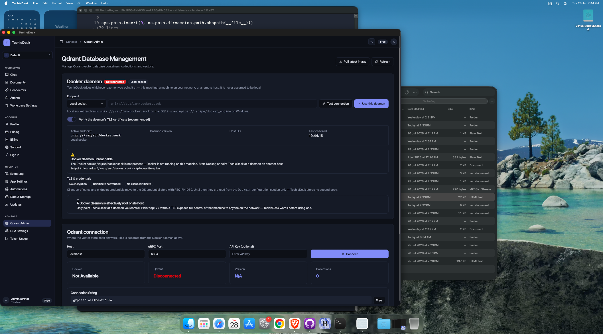
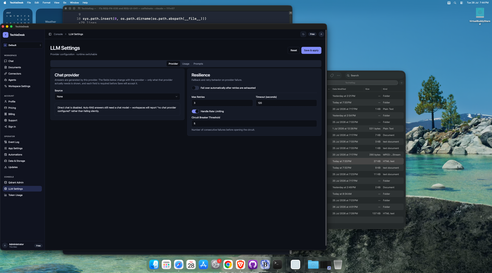
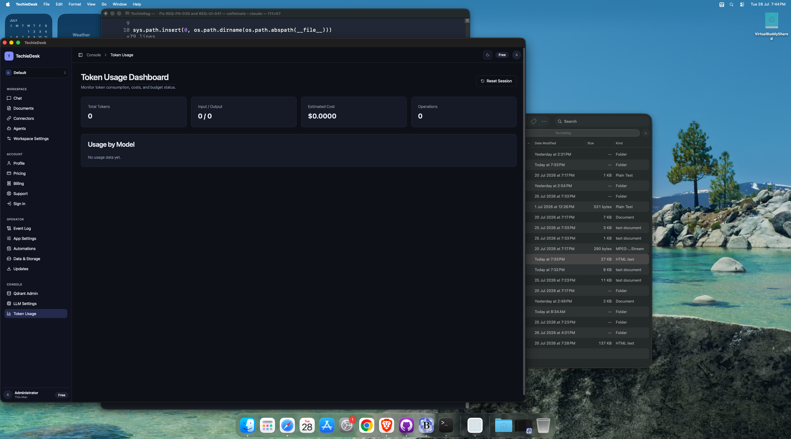
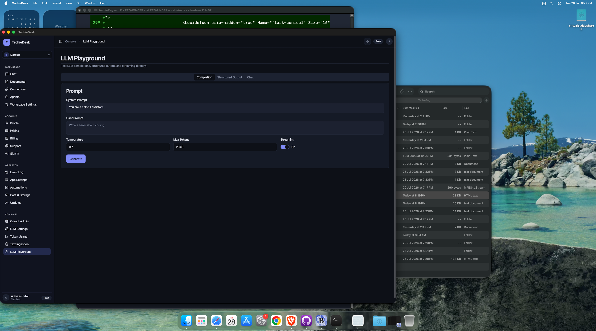
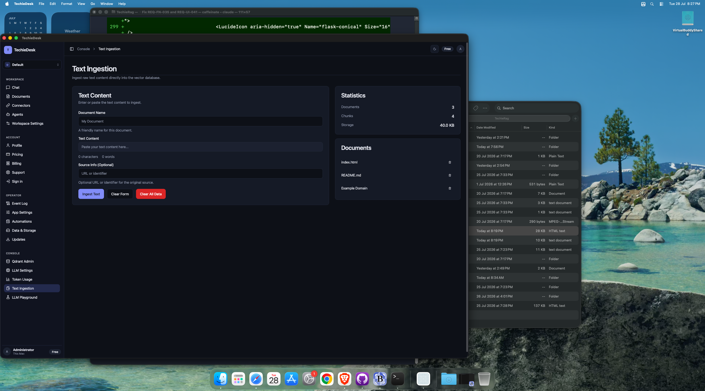
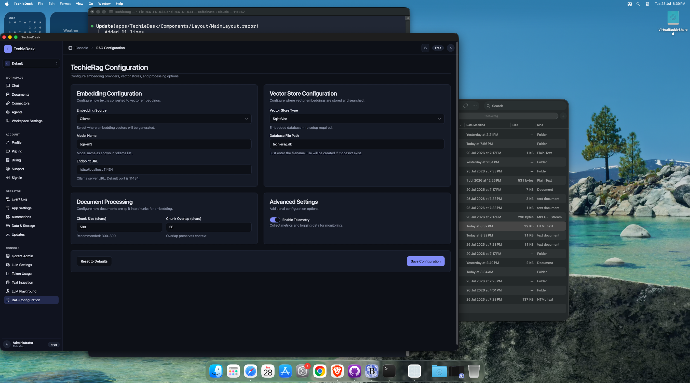

# TechieDesk DevGuide — Console

*Generated 2026-07-28 · reflects code as built.* [← index](./TechieDesk-DevGuide.md)

> ✅ **Runtime-verified 2026-07-29** — re-swept on the live **Mac Catalyst** head over Appium (`mac2`), bound by `appPath` to the universal Release bundle, driving **28 of the 30 screens** at **1600×1240** and **1024×720** (the REQ-UI-041 floor). Every `Observed` line below is what the running app did; `Visual (§4b)` is the overlap / zero-size / off-viewport geometry check plus a human look at the screenshot. Screens that could not be reached say so and are **not** claimed as verified. Screenshots: `test-results/ui-verify/`.

8 screen(s) in this area.

## `/qdrant-admin` — QdrantAdmin

- **File:** `apps/TechieDesk/Components/Pages/QdrantAdmin.razor` (1169 lines)
- **Reached via:** Sidebar → CONSOLE → Qdrant Admin
- **Observed:** renders ✓ (runtime-confirmed 2026-07-29) — Docker-daemon card (endpoint-kind Select, address Input, TLS Switch, Test/Use buttons, active-endpoint panel, `Not connected` badge) and the Qdrant connection card (Host/Port/API key, 4 status tiles, connection string + Copy). Failures render honestly and specifically (“The Docker socket /var/run/docker.sock is not present…”).
- **Visual (§4b):** looks-right ✓ (runtime-confirmed 2026-07-29) — 1600 and 1024: 0 overlaps, 0 zero-size.
- **Known issues (2026-07-29):** Collection CRUD, point browse/detail and container lifecycle (REQ-UI-003) are behind a live connection and are **unreachable on this host** — there is no Docker daemon and no Qdrant. This is an environment dependency, not a defect.
- ⚠ **Icon defect (TR-032):** Icon not found: alert-circle renders as literal text on this screen.

### Controls

| Component | Uses | Razor line(s) |
|---|---|---|
| `<Button>` | 34 | 18, 19, 22, 23… |
| `<Card>` | 13 | 30, 184, 217, 227… |
| `<LucideIcon>` | 12 | 19, 23, 76, 80… |
| `<Alert>` | 9 | 124, 125, 142, 143… |
| `<Input>` | 8 | 68, 194, 200, 206… |
| `<Badge>` | 5 | 35, 40, 153, 156… |
| `<Dialog>` | 4 | 283, 379, 559, 573 |
| `<DataTable>` | 3 | 341, 440, 515 |
| `<Select>` | 2 | 56, 408 |
| `<Switch>` | 1 | 92 |

### Data lineage — Razor → injected service

| Call | Service (as injected) | Razor line(s) |
|---|---|---|
| `DockerService.ConfigureEndpointAsync()` | `IDockerContainerService` | 807 |
| `DockerService.CreateQdrantContainerAsync()` | `IDockerContainerService` | 984 |
| `DockerService.GetActiveEndpointAsync()` | `IDockerContainerService` | 739, 890 |
| `DockerService.GetContainerLogsAsync()` | `IDockerContainerService` | 842 |
| `DockerService.ListQdrantContainersAsync()` | `IDockerContainerService` | 898 |
| `DockerService.PullQdrantImageAsync()` | `IDockerContainerService` | 856 |
| `DockerService.RestartContainerAsync()` | `IDockerContainerService` | 875 |
| `DockerService.StartContainerAsync()` | `IDockerContainerService` | 1005 |
| `DockerService.StopContainerAsync()` | `IDockerContainerService` | 1020 |
| `DockerService.TestConnectionAsync()` | `IDockerContainerService` | 780, 893 |
| `JS.InvokeVoidAsync()` | `IJSRuntime` | 964 |
| `Logger.LogError()` | `ILogger<QdrantAdmin>` | 847, 863, 928 |
| `Logger.LogWarning()` | `ILogger<QdrantAdmin>` | 793, 946 |
| `QdrantService.BrowseVectorsAsync()` | `IQdrantAdminService` | 1081, 1094, 1118… |
| `QdrantService.ConfigureEndpoint()` | `IQdrantAdminService` | 907, 935 |
| `QdrantService.CreateCollectionAsync()` | `IQdrantAdminService` | 1042 |
| `QdrantService.DeleteCollectionAsync()` | `IQdrantAdminService` | 1057 |
| `QdrantService.DeleteVectorAsync()` | `IQdrantAdminService` | 1141 |
| `QdrantService.GetClusterInfoAsync()` | `IQdrantAdminService` | 917 |
| `QdrantService.GetCollectionInfoAsync()` | `IQdrantAdminService` | 1077 |
| `QdrantService.GetVectorByIdAsync()` | `IQdrantAdminService` | 1130 |
| `QdrantService.ListCollectionsAsync()` | `IQdrantAdminService` | 918 |
| `QdrantService.TestConnectionAsync()` | `IQdrantAdminService` | 912 |
| `ToastService.Error()` | `ToastService` | 776, 792, 824… |
| `ToastService.Show()` | `ToastService` | 816 |
| `ToastService.Success()` | `ToastService` | 785, 857, 876… |

**Injected services:** `IDockerContainerService`, `IQdrantAdminService`, `ToastService`, `ILogger<QdrantAdmin>`, `IJSRuntime`

**Conditional render guards:** 14 `@if` blocks — the render-truth risk on this screen. First few:

- `@if (daemonTest is { Success: false })` (line 122)
- `@if (!string.IsNullOrEmpty(daemonTest.FailureKind))` (line 131)
- `@if (!string.IsNullOrEmpty(daemonSecurityWarning))` (line 140)

## `/llm-settings` — LlmSettings

- **File:** `apps/TechieDesk/Components/Pages/LlmSettings.razor` (689 lines)
- **Reached via:** Sidebar → CONSOLE → LLM Settings
- **Observed:** renders ✓ (runtime-confirmed 2026-07-29) — **all three tabs driven.** *Provider*: Source Select with 7 providers plus the Resilience card. *Usage*: token-tracking Switch, Max total tokens, Max cost, the alert-threshold Slider and `Block Requests When Exceeded`. *Prompts*: system prompt, RAG and context templates, context limits.
- **Visual (§4b):** looks-right ✓ (runtime-confirmed 2026-07-29) — 1600 and 1024: 0 overlaps, 0 zero-size on every tab.
- **Known issues (2026-07-29):** ✅ **REQ-UI-043 proven end-to-end.** Selecting `OpenAI-compatible endpoint` swapped the visible field set (Base URL / Model / API key / Max tokens / Temperature / Test connection) — no union-of-all-providers form — and `Save & apply` was **refused** with the error named on each offending field (`Base URL required`, `Model required`, `API key required`) plus a `This provider is not fully configured` summary. The named regression (saving OpenAI-compatible with no endpoint) is prevented. Configuration was restored to `None` afterwards.

### Controls

| Component | Uses | Razor line(s) |
|---|---|---|
| `<Input>` | 12 | 117, 123, 134, 163… |
| `<Card>` | 4 | 65, 95, 145, 191 |
| `<Separator>` | 4 | 79, 108, 112, 158 |
| `<Switch>` | 4 | 102, 128, 152, 182 |
| `<Label>` | 4 | 103, 129, 153, 183 |
| `<Button>` | 3 | 16, 17, 80 |
| `<Spinner>` | 3 | 18, 27, 81 |
| `<Alert>` | 3 | 38, 86, 380 |
| `<Slider>` | 2 | 177, 485 |
| `<Textarea>` | 2 | 200, 206 |
| `<Tabs>` | 1 | 56 |
| `<Select>` | 1 | 362 |

### Data lineage — Razor → injected service

| Call | Service (as injected) | Razor line(s) |
|---|---|---|
| `ConfigService.LoadConfigAsync()` | `TechieRagConfigService` | 301 |
| `ConfigService.SaveConfigAsync()` | `TechieRagConfigService` | 574, 618 |
| `Logger.LogError()` | `ILogger<LlmSettings>` | 310, 592, 625… |
| `Logger.LogInformation()` | `ILogger<LlmSettings>` | 569, 576, 620… |
| `Logger.LogWarning()` | `ILogger<LlmSettings>` | 558, 587, 646… |
| `RagManager.GetLlmProviderAsync()` | `TechieRagManager` | 643 |
| `RagManager.ReconfigureAsync()` | `TechieRagManager` | 575, 619 |
| `ToastService.Error()` | `ToastService` | 311, 561, 588… |
| `ToastService.Success()` | `ToastService` | 577, 621, 666 |

**Injected services:** `TechieRagConfigService`, `TechieRagManager`, `ToastService`, `ILogger<LlmSettings>`

**Conditional render guards:** 19 `@if` blocks — the render-truth risk on this screen. First few:

- `@if (isSaving) { <Spinner Size="SpinnerSize.Small" Class="mr-2" /> Saving... }` (line 18)
- `@if (isLoading)` (line 24)
- `@if (validationSummary.Count > 0)` (line 32)

## `/token-usage` — TokenUsage

- **File:** `apps/TechieDesk/Components/Pages/TokenUsage.razor` (183 lines)
- **Reached via:** Sidebar → CONSOLE → Token Usage
- **Observed:** renders ✓ (runtime-confirmed 2026-07-29) — 4 stat tiles populated (Total tokens, Input/Output, Estimated cost, Operations), `Usage by Model` with a labelled empty state, `Reset Session`. **Budget Status proven**: setting a budget on `/llm-settings` → *Usage* made the card appear with both `<Progress>` bars (`Token budget used`, `Cost budget used`) and correct `0 / 10,000` and `$0.0000 / $5.00` values.
- **Visual (§4b):** looks-right ✓ (runtime-confirmed 2026-07-29) — 1600 and 1024: 0 overlaps, 0 zero-size, with and without the Budget Status card.
- **Known issues (2026-07-29):** The Budget Status card is **correctly conditional**, not renders-empty: it appears only once a budget is configured. Budgets were reverted to 0 after the check. Block-on-exceed enforcement needs a live provider and is **unexercised**.

### Controls

| Component | Uses | Razor line(s) |
|---|---|---|
| `<Card>` | 6 | 24, 32, 40, 48… |
| `<Button>` | 2 | 16, 17 |
| `<Progress>` | 2 | 73, 84 |
| `<Alert>` | 2 | 90, 97 |
| `<LucideIcon>` | 1 | 17 |
| `<DataTable>` | 1 | 118 |

### Data lineage — Razor → injected service

| Call | Service (as injected) | Razor line(s) |
|---|---|---|
| `TechieRag.GetTokenTrackerAsync()` | `TechieDesk.Services.TechieRagManager` | 141 |
| `ToastService.Success()` | `ToastService` | 173 |

**Injected services:** `TechieDesk.Services.TechieRagManager`, `ToastService`

**Conditional render guards:** 5 `@if` blocks — the render-truth risk on this screen. First few:

- `@if (budgetStatus != null)` (line 59)
- `@if (budgetStatus.Budget.MaxTotalTokens > 0)` (line 66)
- `@if (budgetStatus.Budget.MaxCostUsd > 0)` (line 77)

## `/llm-playground` — LlmPlayground

- **File:** `apps/TechieDesk/Components/Pages/LlmPlayground.razor` (395 lines)
- **Reached via:** Sidebar → CONSOLE → LLM Playground (re-linked 2026-07-28)
- **Observed:** renders ✓ (runtime-confirmed 2026-07-29) — 3 tabs (Completion / Structured Output / Chat), system and user prompt Textareas, Temperature, Max tokens, Streaming Switch, `Generate`.
- **Visual (§4b):** looks-right ✓ (runtime-confirmed 2026-07-29) — 1600 and 1024: 0 overlaps, 0 zero-size.
- **Known issues (2026-07-29):** Generation is **unexercised** — no LLM provider is reachable on this host.

### Controls

| Component | Uses | Razor line(s) |
|---|---|---|
| `<Card>` | 5 | 26, 75, 94, 128… |
| `<Textarea>` | 4 | 34, 40, 102, 168 |
| `<Button>` | 4 | 66, 119, 146, 169 |
| `<Input>` | 2 | 47, 53 |
| `<Spinner>` | 2 | 67, 120 |
| `<Tabs>` | 1 | 16 |
| `<Switch>` | 1 | 60 |
| `<Label>` | 1 | 61 |
| `<Select>` | 1 | 108 |
| `<LucideIcon>` | 1 | 170 |

### Data lineage — Razor → injected service

| Call | Service (as injected) | Razor line(s) |
|---|---|---|
| `TechieRag.GetLlmProviderAsync()` | `TechieDesk.Services.TechieRagManager` | 198 |
| `ToastService.Error()` | `ToastService` | 200 |

**Injected services:** `TechieDesk.Services.TechieRagManager`, `ToastService`

**Conditional render guards:** 6 `@if` blocks — the render-truth risk on this screen. First few:

- `@if (isGenerating) { <Spinner Size="SpinnerSize.Small" Class="mr-2" /> Generating... }` (line 67)
- `@if (!string.IsNullOrEmpty(completionResponse))` (line 73)
- `@if (!string.IsNullOrEmpty(completionStats))` (line 81)

## `/ingestion` — Ingestion

- **File:** `apps/TechieDesk/Components/Pages/Ingestion.razor` (515 lines)
- **Reached via:** native Go menu, "Document Ingestion" ⌘3 (MainPage.xaml.cs:81)
- ⚠ **Not in the sidebar** — reachable only from the native Go menu, "Document Ingestion" ⌘3 (MainPage.xaml.cs:81).
- **Observed:** renders ✓ (runtime-confirmed 2026-07-29) — **now observed** (was `not observed` on 2026-07-28). Driven through the native Go menu → *Document Ingestion* ⌘3. Folder-path and pattern Inputs, `Choose files…`/`Choose folder…`, `Ingest Now`, a Vector-store statistics card (12 documents / 13 chunks / 100.0 KB / last ingestion) and an `Ingested Documents` table with 12 rows across 3 pages.
- **Visual (§4b):** looks-right ✓ (runtime-confirmed 2026-07-29) — 1600 and 1024: 0 overlaps, 0 zero-size.
- **Known issues (2026-07-29):** This screen's `Storage Size` column **does** show real byte sizes, unlike the workspace document library — the two read different stores.

### Controls

| Component | Uses | Razor line(s) |
|---|---|---|
| `<Button>` | 6 | 46, 50, 73, 79… |
| `<Card>` | 4 | 36, 101, 126, 153 |
| `<Alert>` | 2 | 21, 22 |
| `<Spinner>` | 2 | 22, 74 |
| `<Progress>` | 2 | 26, 91 |
| `<LucideIcon>` | 2 | 47, 51 |
| `<Input>` | 2 | 59, 67 |
| `<DataTable>` | 2 | 110, 165 |

### Data lineage — Razor → injected service

| Call | Service (as injected) | Razor line(s) |
|---|---|---|
| `Logger.LogError()` | `ILogger<Ingestion>` | 220, 266, 295… |
| `Rag.ClearAsync()` | `ITechieRag` | 462 |
| `Rag.DeleteDocumentAsync()` | `ITechieRag` | 478 |
| `Rag.GetStatsAsync()` | `ITechieRag` | 491 |
| `Rag.IngestAsync()` | `ITechieRag` | 415 |
| `Rag.InitializeAsync()` | `ITechieRag` | 213 |
| `Rag.ListDocumentsAsync()` | `ITechieRag` | 496 |
| `ToastService.Error()` | `ToastService` | 221, 267, 276… |
| `ToastService.Success()` | `ToastService` | 436, 466, 481 |

**Injected services:** `ITechieRag`, `ToastService`, `ILogger<Ingestion>`

**Conditional render guards:** 7 `@if` blocks — the render-truth risk on this screen. First few:

- `@if (isDownloadingModel)` (line 19)
- `@if (isIngesting) { <Spinner Size="SpinnerSize.Small" Class="mr-2" /> Ingesting... }` (line 74)
- `@if (isIngesting)` (line 77)

## `/text-ingestion` — TextIngestion

- **File:** `apps/TechieDesk/Components/Pages/TextIngestion.razor` (325 lines)
- **Reached via:** Sidebar → CONSOLE → Text Ingestion (re-linked 2026-07-28)
- **Observed:** renders ✓ (runtime-confirmed 2026-07-29) — Document-name Input, content Textarea with a live character/word counter, source Input, `Ingest Text`/`Clear Form`/`Clear All Data`, a Statistics card with real values and a Documents list with per-row delete.
- **Visual (§4b):** looks-right ✓ (runtime-confirmed 2026-07-29) — 1600 and 1024: 0 overlaps, 0 zero-size.

### Controls

| Component | Uses | Razor line(s) |
|---|---|---|
| `<Button>` | 4 | 71, 75, 76, 135 |
| `<Card>` | 3 | 37, 94, 117 |
| `<Alert>` | 2 | 20, 21 |
| `<Spinner>` | 2 | 21, 72 |
| `<Progress>` | 2 | 25, 82 |
| `<Input>` | 2 | 46, 65 |
| `<Textarea>` | 1 | 54 |
| `<LucideIcon>` | 1 | 136 |

### Data lineage — Razor → injected service

| Call | Service (as injected) | Razor line(s) |
|---|---|---|
| `Logger.LogError()` | `ILogger<TextIngestion>` | 176, 259 |
| `Rag.ClearAsync()` | `ITechieRag` | 273 |
| `Rag.DeleteDocumentAsync()` | `ITechieRag` | 288 |
| `Rag.GetStatsAsync()` | `ITechieRag` | 301 |
| `Rag.IngestTextAsync()` | `ITechieRag` | 245 |
| `Rag.InitializeAsync()` | `ITechieRag` | 169 |
| `Rag.ListDocumentsAsync()` | `ITechieRag` | 306 |
| `ToastService.Error()` | `ToastService` | 177, 210, 216… |
| `ToastService.Success()` | `ToastService` | 249, 276, 291 |

**Injected services:** `ITechieRag`, `ToastService`, `ILogger<TextIngestion>`

**Conditional render guards:** 5 `@if` blocks — the render-truth risk on this screen. First few:

- `@if (isDownloadingModel)` (line 18)
- `@if (isIngesting) { <Spinner Size="SpinnerSize.Small" Class="mr-2" /> Ingesting... }` (line 72)
- `@if (isIngesting)` (line 79)

## `/chat` — Chat

- **File:** `apps/TechieDesk/Components/Pages/Chat.razor` (410 lines)
- **Reached via:** native Go menu, "RAG Chat" ⌘2 (MainPage.xaml.cs:80)
- ⚠ **Not in the sidebar** — reachable only from the native Go menu, "RAG Chat" ⌘2 (MainPage.xaml.cs:80).
- **Observed:** renders ✓ (runtime-confirmed 2026-07-29) — **now observed** (was `not observed` on 2026-07-28). Driven through the native Go menu → *RAG Chat* ⌘2. Chat-configuration card (Mode, Doc filter, Top-K, Streaming), session counters, message Input and `New Conversation`/`Clear Chat`.
- **Visual (§4b):** looks-right ✓ (runtime-confirmed 2026-07-29) — 1600 and 1024: 0 overlaps, 0 zero-size.
- **Known issues (2026-07-29):** Answering is **unexercised** — no LLM provider is reachable.

### Controls

| Component | Uses | Razor line(s) |
|---|---|---|
| `<LucideIcon>` | 7 | 19, 23, 34, 36… |
| `<Button>` | 5 | 18, 19, 22, 23… |
| `<Card>` | 2 | 31, 92 |
| `<Select>` | 2 | 45, 59 |
| `<Input>` | 1 | 73 |
| `<Switch>` | 1 | 80 |
| `<Label>` | 1 | 81 |
| `<Badge>` | 1 | 122 |
| `<Spinner>` | 1 | 145 |
| `<Textarea>` | 1 | 157 |

### Data lineage — Razor → injected service

| Call | Service (as injected) | Razor line(s) |
|---|---|---|
| `Logger.LogError()` | `ILogger<Chat>` | 227 |
| `Logger.LogWarning()` | `ILogger<Chat>` | 364 |
| `TechieRag.AskAsync()` | `TechieDesk.Services.TechieRagManager` | 320 |
| `TechieRag.GetLlmProviderAsync()` | `TechieDesk.Services.TechieRagManager` | 252, 296 |
| `TechieRag.GetTokenTrackerAsync()` | `TechieDesk.Services.TechieRagManager` | 261, 306, 357 |
| `TechieRag.SearchAsync()` | `TechieDesk.Services.TechieRagManager` | 240, 293 |

**Injected services:** `TechieDesk.Services.TechieRagManager`, `ToastService`, `ILogger<Chat>`

**Conditional render guards:** 4 `@if` blocks — the render-truth risk on this screen. First few:

- `@if (messages.Count == 0)` (line 94)
- `@if (msg.Role == "assistant" && msg.Sources?.Count > 0)` (line 110)
- `@if (isProcessing)` (line 134)

## `/rag-config` — RagConfig

- **File:** `apps/TechieDesk/Components/Pages/RagConfig.razor` (409 lines)
- **Reached via:** Sidebar → CONSOLE → RAG Configuration (renamed from /settings 2026-07-28)
- **Observed:** renders ✓ (runtime-confirmed 2026-07-29) — Embedding configuration (Source `Ollama`, model `bge-m3`, endpoint), Vector store (`SqliteVec`, `techierag.db`), Document processing (chunk size 500 / overlap 50), Advanced settings (telemetry Switch), `Reset to Defaults` / `Save Configuration`.
- **Visual (§4b):** looks-right ✓ (runtime-confirmed 2026-07-29) — 1600 and 1024: 0 overlaps, 0 zero-size.

### Controls

| Component | Uses | Razor line(s) |
|---|---|---|
| `<Input>` | 8 | 72, 83, 93, 104… |
| `<Card>` | 5 | 34, 113, 157, 183… |
| `<Spinner>` | 2 | 27, 207 |
| `<Select>` | 2 | 43, 122 |
| `<Button>` | 2 | 201, 204 |
| `<Alert>` | 1 | 62 |
| `<Switch>` | 1 | 190 |
| `<Label>` | 1 | 191 |

### Data lineage — Razor → injected service

| Call | Service (as injected) | Razor line(s) |
|---|---|---|
| `ConfigService.LoadConfigAsync()` | `TechieRagConfigService` | 254, 335 |
| `ConfigService.ResetToDefaults()` | `TechieRagConfigService` | 334 |
| `ConfigService.SaveConfigAsync()` | `TechieRagConfigService` | 317 |
| `Logger.LogError()` | `ILogger<RagConfig>` | 259, 323 |
| `RagManager.ReconfigureAsync()` | `TechieRagManager` | 318 |
| `ToastService.Error()` | `ToastService` | 260, 324 |
| `ToastService.Success()` | `ToastService` | 319, 336 |

**Injected services:** `TechieRagConfigService`, `TechieRagManager`, `ToastService`, `ILogger<RagConfig>`

**Conditional render guards:** 6 `@if` blocks — the render-truth risk on this screen. First few:

- `@if (isLoading)` (line 24)
- `@if (config.Embedding.Source == EmbeddingSource.Embedded)` (line 60)
- `@if (config.Embedding.Source == EmbeddingSource.Onnx)` (line 78)

