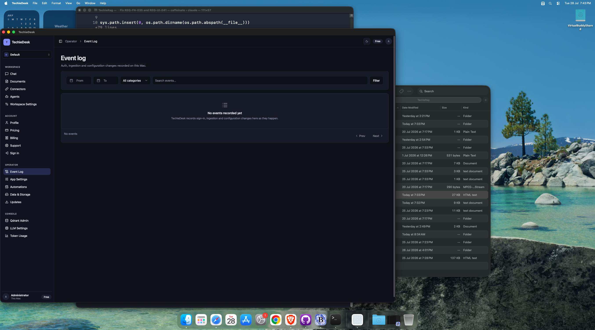
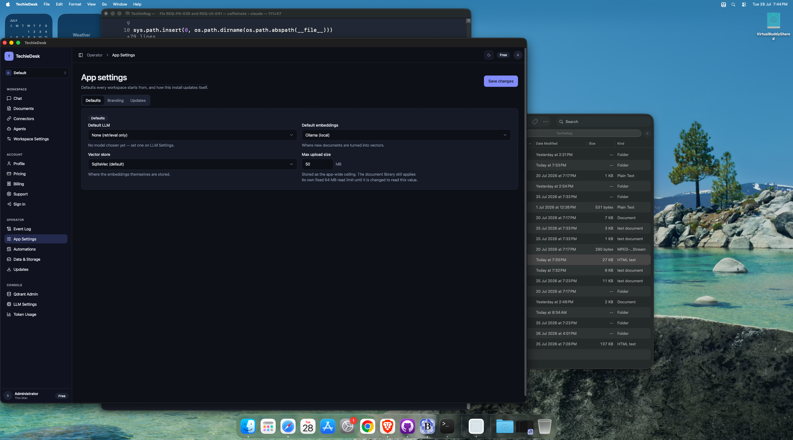
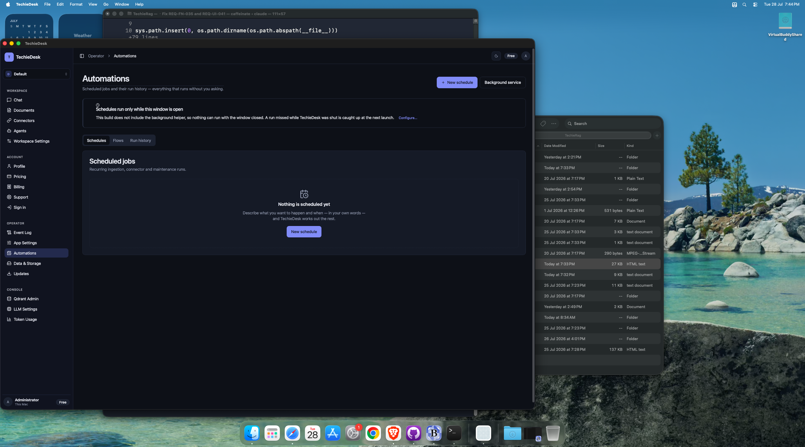
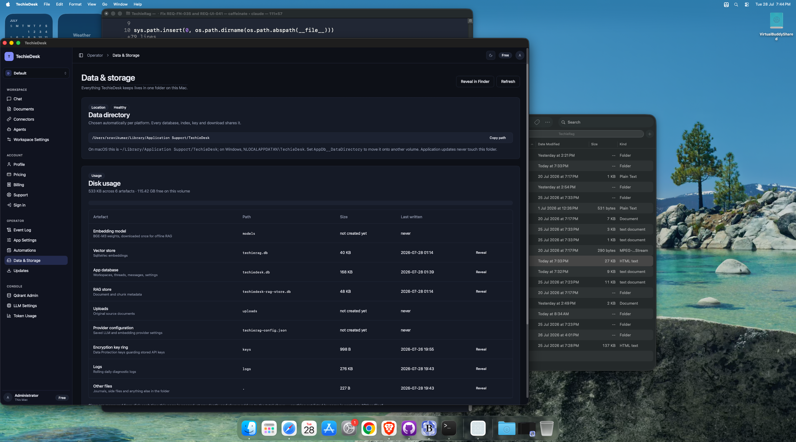
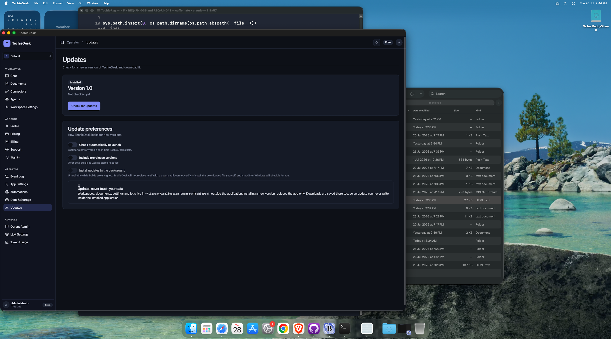

# TechieDesk DevGuide — Operator

*Generated 2026-07-28 · reflects code as built.* [← index](./TechieDesk-DevGuide.md)

> ✅ **Runtime-verified 2026-07-29** — re-swept on the live **Mac Catalyst** head over Appium (`mac2`), bound by `appPath` to the universal Release bundle, driving **28 of the 30 screens** at **1600×1240** and **1024×720** (the REQ-UI-041 floor). Every `Observed` line below is what the running app did; `Visual (§4b)` is the overlap / zero-size / off-viewport geometry check plus a human look at the screenshot. Screens that could not be reached say so and are **not** claimed as verified. Screenshots: `test-results/ui-verify/`.

5 screen(s) in this area.

## `/admin/events` — AdminEvents

- **File:** `apps/TechieDesk/Components/Pages/AdminEvents.razor` (487 lines)
- **Reached via:** Sidebar → OPERATOR → Event Log
- **Observed:** renders ✓ (runtime-confirmed 2026-07-29) — **proven with real data.** The screen was empty on arrival (the `EventLog` table held 0 rows), so a real config change was made on `/admin/settings` and saved; the row then rendered with every column populated (Time / Category `Configuration` / Actor `you` / Event / Source `admin:settings`), the header count `1 events · configuration` matched `Showing 1–1 of 1`, and the **Details Dialog** rendered its Summary / Raw record / Related events tabs with the correlation id.
- **Visual (§4b):** looks-right ✓ (runtime-confirmed 2026-07-29) — 1600 and 1024: 0 overlaps, 0 zero-size, dialog centred.
- **Known issues (2026-07-29):** ⚠ **Coverage gap (not a render defect).** `IEventLogRepository` has exactly **one** producer — `AppSettingsChangeLog`, driven only by the `/admin/settings` save. The screen's own subtitle and REQ-UI-026 both promise “auth, ingestion and configuration changes”, yet 12 ingested documents and 5 connector runs on this install produced **zero** events. Auth and ingestion have no writer at all.

### Controls

| Component | Uses | Razor line(s) |
|---|---|---|
| `<Button>` | 6 | 61, 93, 163, 167… |
| `<Badge>` | 3 | 81, 144, 225 |
| `<Alert>` | 2 | 34, 35 |
| `<LucideIcon>` | 2 | 35, 105 |
| `<Card>` | 2 | 42, 66 |
| `<DataTable>` | 2 | 68, 214 |
| `<Select>` | 1 | 46 |
| `<Input>` | 1 | 59 |
| `<Dialog>` | 1 | 125 |
| `<Tabs>` | 1 | 134 |

### Data lineage — Razor → injected service

| Call | Service (as injected) | Razor line(s) |
|---|---|---|
| `EventLogs.CountAsync()` | `IEventLogRepository` | 337 |
| `EventLogs.ListCategoriesAsync()` | `IEventLogRepository` | 352 |
| `EventLogs.QueryAsync()` | `IEventLogRepository` | 351 |
| `EventLogs.QueryByCorrelationAsync()` | `IEventLogRepository` | 390 |
| `Logger.LogError()` | `ILogger<AdminEvents>` | 356 |
| `Logger.LogWarning()` | `ILogger<AdminEvents>` | 394, 465, 483 |
| `ToastService.Error()` | `ToastService` | 395, 466, 484 |
| `ToastService.Success()` | `ToastService` | 461, 479 |

**Injected services:** `IEventLogRepository`, `IConfiguration`, `ToastService`, `ILogger<AdminEvents>`

**Conditional render guards:** 5 `@if` blocks — the render-truth risk on this screen. First few:

- `@if (loadError is not null)` (line 32)
- `@if (selected is not null)` (line 132)
- `@if (!string.IsNullOrWhiteSpace(selected.CorrelationId))` (line 165)

## `/admin/settings` — AdminSettings

- **File:** `apps/TechieDesk/Components/Pages/AdminSettings.razor` (347 lines)
- **Reached via:** Sidebar → OPERATOR → App Settings (MainLayout.razor:226)
- **Observed:** renders ✓ (runtime-confirmed 2026-07-29) — **all three tabs driven.** *Defaults*: Default LLM, Default embeddings, Vector store Selects and the Max-upload NumericInput all show live values; Save works and is audited. *Branding*: AppearancePanel (Theme radios, 5 accent swatches, Language picker) **plus** the `WHITE_LABEL` FeatureGate rendering its upgrade prompt — the correct render for a Free install, not a missing form. *Updates*: the hosted `AppUpdates Embedded="true"` surface.
- **Visual (§4b):** looks-right ✓ (runtime-confirmed 2026-07-29) — 1600 and 1024: 0 overlaps, 0 zero-size on every tab.
- **Known issues (2026-07-29):** ✅ **`ForceMount="true"` on all three `<TabsContent>` (the 2026-07-29 `aria-controls` fix) causes no visual regression and no duplicate heading.** Verified directly: inactive panels mount hidden and contribute **nothing** to the accessibility tree (the Defaults fields disappear from the element dump the moment Branding is active), exactly one `App settings` `<h1>` is present on every tab, and the embedded `AppUpdates` emits no second `<h1>`/`<PageTitle>` — its standalone `/settings/updates` copy does show its own `Updates` heading, confirming the `Embedded` switch works.

### Controls

| Component | Uses | Razor line(s) |
|---|---|---|
| `<Select>` | 3 | 85, 103, 121 |
| `<Spinner>` | 2 | 37, 69 |
| `<Alert>` | 2 | 50, 51 |
| `<Button>` | 1 | 34 |
| `<LucideIcon>` | 1 | 51 |
| `<Tabs>` | 1 | 57 |
| `<Card>` | 1 | 75 |
| `<Badge>` | 1 | 78 |

### Data lineage — Razor → injected service

| Call | Service (as injected) | Razor line(s) |
|---|---|---|
| `ChangeLog.RecordAsync()` | `IAppSettingsChangeLog` | 288 |
| `ConfigService.LoadConfigAsync()` | `TechieRagConfigService` | 243 |
| `ConfigService.SaveConfigAsync()` | `TechieRagConfigService` | 282 |
| `DefaultsStore.GetMaxUploadSizeMbAsync()` | `IAppDefaultsStore` | 244 |
| `DefaultsStore.SetMaxUploadSizeMbAsync()` | `IAppDefaultsStore` | 284 |
| `Logger.LogError()` | `ILogger<AdminSettings>` | 249, 299 |
| `RagManager.ReconfigureAsync()` | `TechieRagManager` | 283 |
| `ToastService.Error()` | `ToastService` | 269, 300 |
| `ToastService.Success()` | `ToastService` | 291 |

**Injected services:** `TechieRagConfigService`, `TechieRagManager`, `IAppDefaultsStore`, `IAppSettingsChangeLog`, `ToastService`, `ILogger<AdminSettings>`

**Conditional render guards:** 4 `@if` blocks — the render-truth risk on this screen. First few:

- `@if (isSaving)` (line 35)
- `@if (loadError is not null)` (line 48)
- `@if (isLoading)` (line 66)

## `/automations` — Automations

- **File:** `apps/TechieDesk/Components/Pages/Automations.razor` (1046 lines)
- **Reached via:** Sidebar → OPERATOR → Automations
- **Observed:** renders ✓ (runtime-confirmed 2026-07-29) — *Schedules* tab shows a real scheduled job (plain-language “Every 5 minutes”, last run, paused state) with working pagination; *Run history* shows 5 populated runs (Outcome/Items/Started/Duration/Trigger); the `New schedule` Dialog renders the natural-language authoring surface (free-text description + `Interpret`).
- **Visual (§4b):** looks-right ✓ (runtime-confirmed 2026-07-29) — 1600 and 1024: 0 overlaps, 0 zero-size on every tab.
- **Known issues (2026-07-29):** The *Flows* tab renders an honest “**Flows are not part of this build**” panel — consistent with REQ-UI-040 `Not Started`. NL interpretation is **unexercised**: the dialog itself reports “No local model is configured”.

### Controls

| Component | Uses | Razor line(s) |
|---|---|---|
| `<Button>` | 16 | 37, 38, 41, 57… |
| `<Badge>` | 9 | 200, 201, 258, 274… |
| `<Switch>` | 8 | 142, 372, 379, 438… |
| `<Label>` | 7 | 374, 381, 443, 470… |
| `<LucideIcon>` | 6 | 38, 53, 125, 174… |
| `<Alert>` | 6 | 51, 53, 332, 362… |
| `<Card>` | 5 | 66, 108, 197, 223… |
| `<Dialog>` | 3 | 294, 427, 533 |
| `<Spinner>` | 2 | 76, 319 |
| `<DataTable>` | 2 | 137, 243 |
| `<Input>` | 2 | 397, 483 |
| `<Progress>` | 1 | 85 |
| `<Tabs>` | 1 | 100 |
| `<DropdownMenu>` | 1 | 170 |
| `<Textarea>` | 1 | 305 |
| `<AlertDialog>` | 1 | 580 |

### Data lineage — Razor → injected service

| Call | Service (as injected) | Razor line(s) |
|---|---|---|
| `BackgroundJobs.Cancel()` | `IBackgroundJobService` | 857 |
| `Interpreter.InterpretAsync()` | `IScheduleInterpreter` | 723 |
| `Interpreter.Rebuild()` | `IScheduleInterpreter` | 755 |
| `Logger.LogError()` | `ILogger<Automations>` | 695, 739, 809… |
| `PreferencesStore.LoadAsync()` | `ISchedulerPreferencesStore` | 688 |
| `PreferencesStore.SaveAsync()` | `ISchedulerPreferencesStore` | 936 |
| `SchedulerHelper.GetState()` | `ISchedulerHelper` | 690, 929 |
| `SchedulerHelper.InstallAsync()` | `ISchedulerHelper` | 907 |
| `SchedulerHelper.UninstallAsync()` | `ISchedulerHelper` | 908 |
| `Schedules.CreateAsync()` | `IScheduleService` | 797 |
| `Schedules.DeleteAsync()` | `IScheduleService` | 878 |
| `Schedules.ListAsync()` | `IScheduleService` | 686 |
| `Schedules.ListRecentRunsAsync()` | `IScheduleService` | 687 |
| `Schedules.ListRunItemsAsync()` | `IScheduleService` | 897 |
| `Schedules.RunNowAsync()` | `IScheduleService` | 836 |
| `Schedules.SetEnabledAsync()` | `IScheduleService` | 822 |
| `ToastService.Error()` | `ToastService` | 696, 810, 828… |
| `ToastService.Show()` | `ToastService` | 839, 859 |
| `ToastService.Success()` | `ToastService` | 798, 843, 879… |

**Injected services:** `IScheduleService`, `IScheduleInterpreter`, `IBackgroundJobService`, `ISchedulerHelper`, `ISchedulerPreferencesStore`, `ToastService`, `ILogger<Automations>`

**Conditional render guards:** 13 `@if` blocks — the render-truth risk on this screen. First few:

- `@if (helperState is not null)` (line 49)
- `@if (activeJobs.Count > 0)` (line 64)
- `@if (job.PercentComplete is { } percent)` (line 83)

## `/settings/data` — DataStorage

- **File:** `apps/TechieDesk/Components/Pages/DataStorage.razor` (276 lines)
- **Reached via:** Sidebar → OPERATOR → Data & Storage
- **Observed:** renders ✓ (runtime-confirmed 2026-07-29) — data-directory path with Copy, `Healthy` badge, disk-usage summary, and a 9-row artefact table with real sizes and timestamps plus per-row `Reveal`.
- **Visual (§4b):** looks-right ✓ (runtime-confirmed 2026-07-29) — 1600 and 1024: 0 overlaps; the table compresses without horizontal overflow at 1024.
- **Known issues (2026-07-29):** The `uploads` artefact reads `not created yet` — original source documents are not retained, which is the same root cause as the blank `Size` column on `/workspace/{Slug}/documents`.

### Controls

| Component | Uses | Razor line(s) |
|---|---|---|
| `<Button>` | 6 | 21, 22, 69, 114… |
| `<Badge>` | 5 | 51, 54, 58, 84… |
| `<Alert>` | 3 | 40, 41, 144 |
| `<Card>` | 3 | 48, 81, 131 |
| `<Spinner>` | 1 | 25 |
| `<LucideIcon>` | 1 | 41 |
| `<Progress>` | 1 | 90 |
| `<DataTable>` | 1 | 92 |

### Data lineage — Razor → injected service

| Call | Service (as injected) | Razor line(s) |
|---|---|---|
| `Logger.LogError()` | `ILogger<DataStorage>` | 222 |
| `Logger.LogWarning()` | `ILogger<DataStorage>` | 258, 271 |
| `ToastService.Error()` | `ToastService` | 259, 272 |
| `ToastService.Success()` | `ToastService` | 254, 267 |

**Injected services:** `IConfiguration`, `ToastService`, `ILogger<DataStorage>`

**Conditional render guards:** 4 `@if` blocks — the render-truth risk on this screen. First few:

- `@if (isMeasuring)` (line 23)
- `@if (measureError is not null)` (line 38)
- `@if (snapshot is { DirectoryExists: true })` (line 52)

## `/settings/updates` — AppUpdates

- **File:** `apps/TechieDesk/Components/Pages/AppUpdates.razor` (367 lines)
- **Reached via:** Sidebar → OPERATOR → Updates
- **Observed:** renders ✓ (runtime-confirmed 2026-07-29) — `Installed` badge, `Version 1.0`, `Not checked yet`, `Check for updates`, and three preference Switches with their explanations.
- **Visual (§4b):** looks-right ✓ (runtime-confirmed 2026-07-29) — 1600 and 1024: 0 overlaps, 0 zero-size.
- **Known issues (2026-07-29):** Standalone it emits its own `Updates` `<h1>`; hosted on `/admin/settings` with `Embedded="true"` it emits none. Both were observed this run.

### Controls

| Component | Uses | Razor line(s) |
|---|---|---|
| `<Alert>` | 7 | 56, 57, 64, 73… |
| `<Badge>` | 3 | 37, 40, 44 |
| `<Switch>` | 3 | 160, 170, 185 |
| `<Label>` | 3 | 161, 171, 186 |
| `<Card>` | 2 | 34, 152 |
| `<LucideIcon>` | 2 | 57, 196 |
| `<Button>` | 2 | 115, 129 |
| `<Spinner>` | 2 | 118, 134 |

### Data lineage — Razor → injected service

| Call | Service (as injected) | Razor line(s) |
|---|---|---|
| `Logger.LogError()` | `ILogger<AppUpdates>` | 278, 313, 362 |
| `Logger.LogWarning()` | `ILogger<AppUpdates>` | 332 |
| `Preferences.LoadAsync()` | `IUpdatePreferencesStore` | 260, 274 |
| `Preferences.SaveAsync()` | `IUpdatePreferencesStore` | 357 |
| `ToastService.Error()` | `ToastService` | 279, 314, 333… |
| `ToastService.Success()` | `ToastService` | 309, 328 |
| `UpdateService.CheckAsync()` | `IUpdateService` | 273 |
| `UpdateService.DownloadAsync()` | `IUpdateService` | 308 |

**Injected services:** `IUpdateService`, `IUpdatePreferencesStore`, `ToastService`, `ILogger<AppUpdates>`

**Conditional render guards:** 10 `@if` blocks — the render-truth risk on this screen. First few:

- `@if (!Embedded)` (line 19)
- `@if (!Embedded)` (line 25)
- `@if (result?.Status == UpdateCheckStatus.UpToDate)` (line 38)

