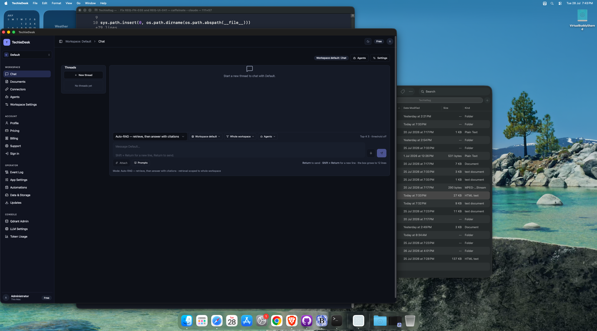
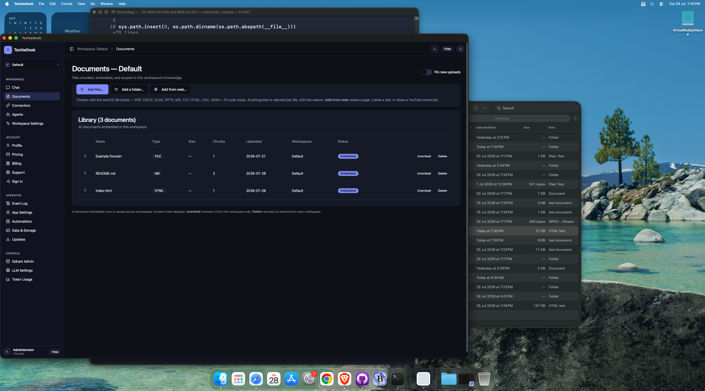
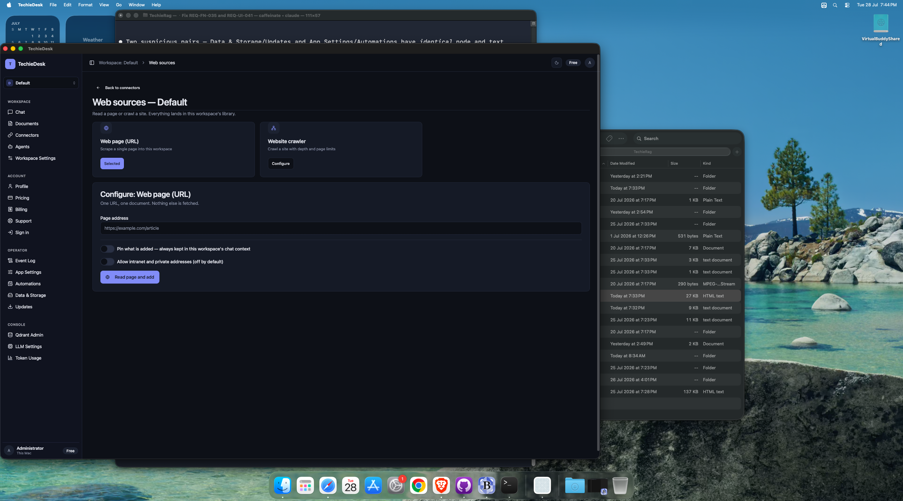
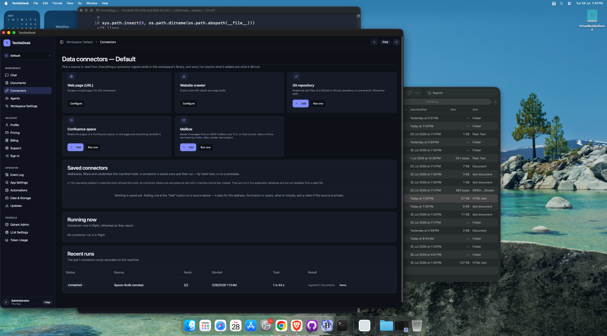
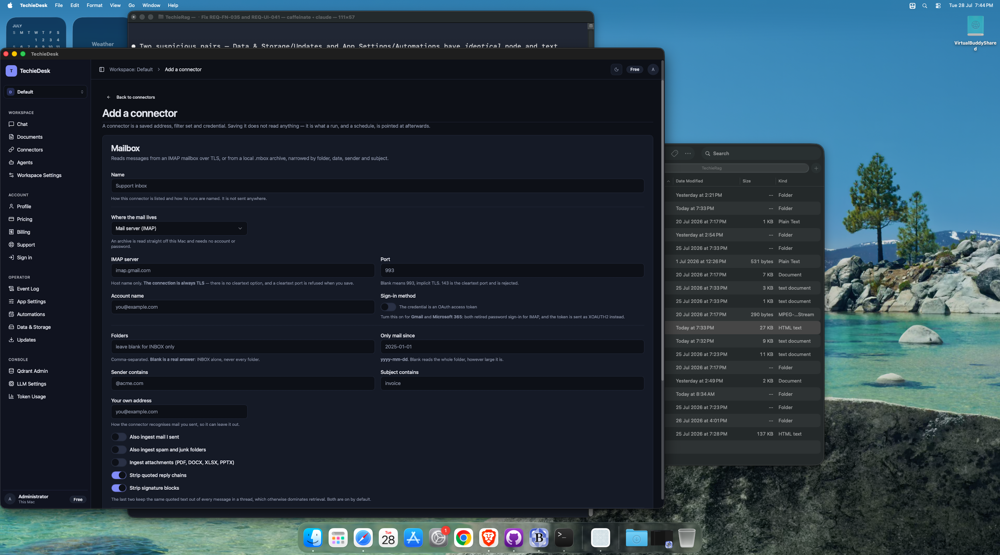
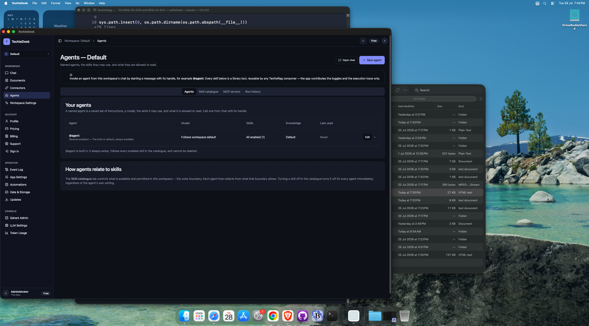
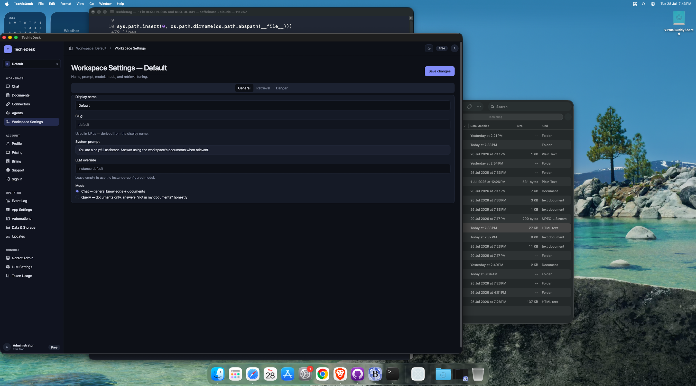

# TechieDesk DevGuide — Workspace

*Generated 2026-07-28 · reflects code as built.* [← index](./TechieDesk-DevGuide.md)

> ✅ **Runtime-verified 2026-07-29** — re-swept on the live **Mac Catalyst** head over Appium (`mac2`), bound by `appPath` to the universal Release bundle, driving **28 of the 30 screens** at **1600×1240** and **1024×720** (the REQ-UI-041 floor). Every `Observed` line below is what the running app did; `Visual (§4b)` is the overlap / zero-size / off-viewport geometry check plus a human look at the screenshot. Screens that could not be reached say so and are **not** claimed as verified. Screenshots: `test-results/ui-verify/`.

7 screen(s) in this area.

## `/workspace/{Slug}` — WorkspaceChat

- **File:** `apps/TechieDesk/Components/Pages/WorkspaceChat.razor` (1787 lines)
- **Reached via:** Sidebar → WORKSPACE → Chat
- **Observed:** renders ✓ (runtime-confirmed 2026-07-29) — 109 a11y content nodes / 68 interactive, all composer controls present: mode Select, model override, retrieval scope, agents, Attach, Prompts, mic, send, Threads panel. Reached from the sidebar AND from the native Go menu.
- **Visual (§4b):** ⚠ **visual-broken (DEFECT — `Read this answer aloud` overlaps `Send message` by 980 px² @1024×720, 2026-07-31)**. Clean at 1600×1240 (0 overlaps, 0 zero-size). Re-observed 2026-07-31 via `tests/appium/run_sweep.py`; §4a data-render still passes (131 content nodes, settled, arrival-gated). Evidence: `test-results/ui-verify/workspace-chat-n1024.png`. Pre-existing — `WorkspaceChat.razor` was not modified by the 2026-07-31 build phase. Supersedes the 2026-07-29 "0 interactive overlaps" reading, which did not reach this state of the message list.
- **Observed 2026-08-04 (verifier, live Catalyst head, Hindi):** renders ✓ and looks-right ✓ at both widths. **REQ-UI-059 clause 2 confirmed on screen**: five legacy English transcript rows (3× no-provider, 2× the egress refusal) render verbatim amid complete Devanagari — each verified in the live store as `ContentJson NULL`, dated 2026-07-30. That English is the persisted-English policy WORKING, not a regression. No NEW coded row exists yet (14 rows, 0 coded), so the coded path has not been seen rendering. One overlap @1024 is the documented phantom (read-aloud button on a message clipped behind the composer).
- **Known issues (2026-07-29):** Streamed answers, citation chips, read-aloud and the agent execution trace could not be exercised: no chat provider is reachable on this host (LLM Settings Source = None; no Ollama/LM Studio listening).

### Controls

| Component | Uses | Razor line(s) |
|---|---|---|
| `<LucideIcon>` | 27 | 20, 30, 63, 69… |
| `<Button>` | 18 | 62, 63, 68, 69… |
| `<DropdownMenu>` | 5 | 112, 305, 333, 358… |
| `<Dialog>` | 5 | 441, 457, 471, 506… |
| `<Alert>` | 4 | 19, 20, 29, 30 |
| `<Spinner>` | 3 | 42, 274, 517 |
| `<Badge>` | 3 | 59, 208, 259 |
| `<Card>` | 2 | 78, 150 |
| `<Select>` | 1 | 290 |
| `<Textarea>` | 1 | 388 |
| `<Input>` | 1 | 447 |
| `<Checkbox>` | 1 | 485 |
| `<Label>` | 1 | 488 |
| `<FileUpload>` | 1 | 513 |

### Data lineage — Razor → injected service

| Call | Service (as injected) | Razor line(s) |
|---|---|---|
| `AgentRegistry.ListAsync()` | `IAgentRegistry` | 902 |
| `AgentRegistry.MarkUsedAsync()` | `IAgentRegistry` | 1378 |
| `AgentRegistry.PermittedSkillsAsync()` | `IAgentRegistry` | 1530 |
| `AgentRegistry.ResolveAsync()` | `IAgentRegistry` | 1429, 1510 |
| `Logger.LogError()` | `ILogger<WorkspaceChat>` | 685, 806, 834… |
| `Logger.LogWarning()` | `ILogger<WorkspaceChat>` | 887, 907, 1194 |
| `Nav.NavigateTo()` | `NavigationManager` | 1165, 1754, 1756 |
| `Nav.ToAbsoluteUri()` | `NavigationManager` | 918 |
| `Rag.GetConversationStoreAsync()` | `TechieRagManager` | 672, 695, 708… |
| `Rag.GetLlmProviderAsync()` | `TechieRagManager` | 1298 |
| `Rag.GetTokenTrackerAsync()` | `TechieRagManager` | 1312 |
| `Rag.GetWorkspaceManagerAsync()` | `TechieRagManager` | 852, 1040, 1288 |
| `Rag.ListDocumentsAsync()` | `TechieRagManager` | 858 |
| `RagConfig.LoadConfigAsync()` | `TechieRagConfigService` | 877 |
| `ToastService.Error()` | `ToastService` | 779, 807, 835… |
| `ToastService.Success()` | `ToastService` | 802, 830, 1068 |
| `Workspaces.ResolveBySlugAsync()` | `IWorkspaceService` | 660 |

**Injected services:** `TechieRagManager`, `TechieRagConfigService`, `IAgentRegistry`, `IWorkspaceService`, `ToastService`, `NavigationManager`, `IJSRuntime`, `ILogger<WorkspaceChat>`

**Conditional render guards:** 17 `@if` blocks — the render-truth risk on this screen. First few:

- `@if (notFound)` (line 17)
- `@if (Workspaces.CanManageWorkspaces)` (line 66)
- `@if (threads.Count > 0)` (line 82)

## `/workspace/{Slug}/documents` — DocumentLibrary

- **File:** `apps/TechieDesk/Components/Pages/DocumentLibrary.razor` (822 lines)
- **Reached via:** Sidebar → WORKSPACE → Documents
- **Observed:** renders ✓ (runtime-confirmed 2026-07-29) — `Library (3 documents)` with 3 real rows; Name, Type, Chunks, Uploaded, Workspaces, Status (`Embedded` badges) and the Unembed/Delete actions all populated; count badge matches visible rows. **`Size` column: was renders-empty; the writer was fixed 2026-07-30 — needs a fresh runtime observation (see Known issues).**
- **Visual (§4b):** looks-right ✓ (runtime-confirmed 2026-07-29) — 1600 and 1024: 0 overlaps, 0 zero-size, table stays inside its card at 1024.
- **Observed 2026-08-04 (verifier, live Catalyst head, Hindi):** renders ✓ and looks-right ✓ (runtime-confirmed) at 1600 and the 1024 floor — `लाइब्रेरी (5 दस्तावेज़)` with 5 populated rows, all columns and the Unembed/Delete actions present, 0 render defects. 🔴 **NEW DEFECT — the stale-embedding banner is MISSING (REQ-RAG-052).** All 5 listed documents were embedded 2026-07-27…07-30 by the old tokenizer and carry `Metadata '{}'` (unstamped ⇒ stale), yet the warning added for exactly this case does not render. The running app is current (bundle assemblies 20:09; `DocsStaleEmbeddingsTitle` present in the shipped assembly), so it is not a stale build. Screenshot `test-results/ui-verify/document-library-d1600.png`.
- **Known issues:** ✅ **FIXED 2026-07-30 — the `Size` column defect.** Was: `DataTableColumn Size` (`DocumentLibrary.razor:194`) showed `—` on every row because `SizeFromMetadata` probed `FileSize`/`Size`/`fileSize`/`size`/`ByteSize` in `Document.Metadata` and **no ingestion path wrote any of them**, while `SqliteVecStore` additionally hardcoded the document row's `Metadata` column to `{}`. The reader was never wrong. Fixed in the library (TR-RAG-038 / TR-RAG-024): `TechieRagClient` now records `DocumentMetadataKeys.FileSize` on the file and text ingestion routes, and the stores round-trip the document-scoped metadata. The probe itself moved to `TechieDesk.Services.Workspaces.DocumentSizeDisplay` (`apps/TechieDesk.Core/Services/Workspaces/DocumentSizeDisplay.cs`), behaviour unchanged, so it can be tested against a real store round trip; `SizeFromMetadata` (`:735`) is now a one-line delegation. ⚠ **Documents ingested before 2026-07-30 keep the `—`** — a size that was never recorded cannot be recovered, and that is the correct rendering, not a residual defect. Proven on the real database: a 7,080-byte file renders `6.9 KB`, a 90-byte file renders `90 B`, the 12 pre-existing documents render `—` without throwing.

### Controls

| Component | Uses | Razor line(s) |
|---|---|---|
| `<Button>` | 8 | 78, 82, 87, 108… |
| `<LucideIcon>` | 7 | 21, 32, 79, 83… |
| `<Badge>` | 7 | 126, 129, 132, 135… |
| `<Alert>` | 6 | 20, 21, 31, 32… |
| `<Spinner>` | 3 | 40, 63, 162 |
| `<Card>` | 3 | 75, 104, 153 |
| `<FileUpload>` | 2 | 69, 289 |
| `<Switch>` | 1 | 53 |
| `<Label>` | 1 | 54 |
| `<Progress>` | 1 | 117 |
| `<DataTable>` | 1 | 176 |
| `<Dialog>` | 1 | 239 |

### Data lineage — Razor → injected service

| Call | Service (as injected) | Razor line(s) |
|---|---|---|
| `Logger.LogError()` | `ILogger<DocumentLibrary>` | 335, 422, 459… |
| `Nav.NavigateTo()` | `NavigationManager` | 442 |
| `Rag.DeleteDocumentAsync()` | `TechieRagManager` | 696 |
| `Rag.GetWorkspaceManagerAsync()` | `TechieRagManager` | 355, 511, 614… |
| `Rag.InitializeAsync()` | `TechieRagManager` | 330 |
| `Rag.ListDocumentsAsync()` | `TechieRagManager` | 366 |
| `ToastService.Error()` | `ToastService` | 423, 460, 469… |
| `ToastService.Success()` | `ToastService` | 622, 652, 698 |
| `Workspaces.ResolveBySlugAsync()` | `IWorkspaceService` | 322 |

**Injected services:** `TechieRagManager`, `IWorkspaceService`, `ToastService`, `NavigationManager`, `ILogger<DocumentLibrary>`

**Conditional render guards:** 8 `@if` blocks — the render-truth risk on this screen. First few:

- `@if (loadError is not null)` (line 18)
- `@if (canManage)` (line 50)
- `@if (isDownloadingModel)` (line 60)

## `/workspace/{Slug}/documents/web` — AddFromWeb

- **File:** `apps/TechieDesk/Components/Pages/AddFromWeb.razor` (687 lines)
- **Reached via:** Documents → “Add from web”
- **Observed:** renders ✓ (runtime-confirmed 2026-07-29) — source picker (Web page / Website crawler), page-address Input, private-address Switch, pin Switch and `Read page and add` all present.
- **Visual (§4b):** looks-right ✓ (runtime-confirmed 2026-07-29) — 1600 and 1024: 0 overlaps, 0 zero-size.

### Controls

| Component | Uses | Razor line(s) |
|---|---|---|
| `<Alert>` | 18 | 16, 17, 26, 27… |
| `<LucideIcon>` | 14 | 17, 27, 47, 59… |
| `<Label>` | 7 | 114, 125, 130, 138… |
| `<Button>` | 4 | 46, 90, 211, 217 |
| `<Card>` | 4 | 79, 107, 232, 286 |
| `<Input>` | 4 | 115, 126, 131, 153 |
| `<Switch>` | 3 | 137, 172, 181 |
| `<Spinner>` | 2 | 35, 242 |
| `<Badge>` | 2 | 244, 302 |
| `<Separator>` | 1 | 169 |
| `<Progress>` | 1 | 238 |
| `<DataTable>` | 1 | 294 |

### Data lineage — Razor → injected service

| Call | Service (as injected) | Razor line(s) |
|---|---|---|
| `Ingestion.IngestAsync()` | `IWebIngestionService` | 628 |
| `Logger.LogError()` | `ILogger<AddFromWeb>` | 480, 656 |
| `Nav.NavigateTo()` | `NavigationManager` | 486 |
| `ToastService.Error()` | `ToastService` | 638, 642, 652… |
| `ToastService.Success()` | `ToastService` | 632 |
| `Workspaces.ResolveBySlugAsync()` | `IWorkspaceService` | 469 |

**Injected services:** `IWebIngestionService`, `IWorkspaceService`, `ToastService`, `NavigationManager`, `ILogger<AddFromWeb>`

**Conditional render guards:** 12 `@if` blocks — the render-truth risk on this screen. First few:

- `@if (loadError is not null)` (line 14)
- `@if (!canManage)` (line 56)
- `@if (sourceKind == "site")` (line 118)

## `/workspace/{Slug}/connectors` — ConnectorsHub

- **File:** `apps/TechieDesk/Components/Pages/ConnectorsHub.razor` (1399 lines)
- **Reached via:** Sidebar → WORKSPACE → Connectors
- **Observed:** renders ✓ (runtime-confirmed 2026-07-29) — 5 source cards, `Saved connectors` with a real mailbox connector (last run, item count, Edit/Test/Sync/Delete), `Running now` honest empty state, and `Recent runs` with 5 populated rows (Status/Source/Items/Started/Took/Result).
- **Visual (§4b):** looks-right ✓ (runtime-confirmed 2026-07-29) — 1600 and 1024: 0 overlaps, cards reflow cleanly.

### Controls

| Component | Uses | Razor line(s) |
|---|---|---|
| `<Alert>` | 28 | 18, 19, 28, 29… |
| `<LucideIcon>` | 26 | 19, 29, 53, 76… |
| `<Button>` | 13 | 87, 100, 107, 293… |
| `<Badge>` | 7 | 218, 223, 227, 231… |
| `<Card>` | 6 | 73, 168, 359, 498… |
| `<Label>` | 5 | 391, 429, 435, 440… |
| `<Spinner>` | 4 | 37, 333, 469, 514 |
| `<Input>` | 3 | 430, 436, 441 |
| `<DataTable>` | 2 | 586, 646 |
| `<Select>` | 1 | 395 |
| `<Separator>` | 1 | 446 |
| `<Switch>` | 1 | 449 |
| `<Progress>` | 1 | 531 |

### Data lineage — Razor → injected service

| Call | Service (as injected) | Razor line(s) |
|---|---|---|
| `Logger.LogError()` | `ILogger<ConnectorsHub>` | 919, 943, 972… |
| `ToastService.Error()` | `ToastService` | 1043, 1092, 1098… |
| `ToastService.Show()` | `ToastService` | 1039, 1251 |
| `ToastService.Success()` | `ToastService` | 1086, 1148, 1203 |
| `Workspaces.ResolveBySlugAsync()` | `IWorkspaceService` | 932 |

**Injected services:** `IServiceProvider`, `IWorkspaceService`, `ToastService`, `NavigationManager`, `ILogger<ConnectorsHub>`

**Conditional render guards:** 26 `@if` blocks — the render-truth risk on this screen. First few:

- `@if (loadError is not null)` (line 16)
- `@if (!canManage)` (line 50)
- `@if (tile.Href is { } href)` (line 81)

## `/workspace/{Slug}/connectors/new` — ConnectorEdit

- **File:** `apps/TechieDesk/Components/Pages/ConnectorEdit.razor` (1277 lines)
- **Reached via:** Connectors → a source card’s “Add”
- **Observed:** renders ✓ (runtime-confirmed 2026-07-29) — Git-repository form with Name, Project path, Branch, include/exclude globs, Access token, API/Web base URL, private-network Switch, pin Switch, Save/Test/Sync. Reached from a source card's `Add` link.
- **Visual (§4b):** looks-right ✓ (runtime-confirmed 2026-07-29) — 1600 and 1024: 0 overlaps, 0 zero-size.

### Controls

| Component | Uses | Razor line(s) |
|---|---|---|
| `<Label>` | 36 | 148, 163, 183, 193… |
| `<Alert>` | 26 | 18, 19, 28, 29… |
| `<Input>` | 21 | 149, 184, 197, 208… |
| `<LucideIcon>` | 18 | 19, 29, 44, 57… |
| `<Switch>` | 10 | 297, 367, 371, 375… |
| `<Button>` | 5 | 43, 126, 612, 620… |
| `<Separator>` | 4 | 157, 322, 462, 531 |
| `<Card>` | 3 | 96, 118, 141 |
| `<Spinner>` | 2 | 37, 637 |
| `<Select>` | 2 | 168, 252 |
| `<RadioGroup>` | 1 | 409 |

### Data lineage — Razor → injected service

| Call | Service (as injected) | Razor line(s) |
|---|---|---|
| `Logger.LogError()` | `ILogger<ConnectorEdit>` | 893, 948, 1145… |
| `Nav.NavigateTo()` | `NavigationManager` | 1227, 1248 |
| `ToastService.Error()` | `ToastService` | 1141, 1147, 1180… |
| `ToastService.Success()` | `ToastService` | 1136, 1176, 1226 |
| `Workspaces.ResolveBySlugAsync()` | `IWorkspaceService` | 881 |

**Injected services:** `IServiceProvider`, `IWorkspaceService`, `ToastService`, `NavigationManager`, `ILogger<ConnectorEdit>`

**Conditional render guards:** 18 `@if` blocks — the render-truth risk on this screen. First few:

- `@if (loadError is not null)` (line 16)
- `@if (!canManage)` (line 54)
- `@if (registry is null)` (line 65)

## `/workspace/{Slug}/agents` — WorkspaceAgents

- **File:** `apps/TechieDesk/Components/Pages/WorkspaceAgents.razor` (1004 lines)
- **Reached via:** Sidebar → WORKSPACE → Agents
- **Observed:** renders ✓ (runtime-confirmed 2026-07-29) — **all four tabs driven**: *Agents* (table with the built-in `@agent` row, Model/Skills/Knowledge/Last-used populated), *Skill catalogue* (8 skills with toggles, guardrail limits, `Show the execution trace in chat`), *MCP servers* (honest “not available yet — REQ-RAG-023”), *Run history* (honest “Agent runs are not persisted yet”).
- **Visual (§4b):** looks-right ✓ (runtime-confirmed 2026-07-29) — 1600 and 1024: 0 overlaps, 0 zero-size on every tab.
- **Known issues (2026-07-29):** **REQ-RAG-006 / REQ-UI-034 evidence is NOT obtainable here.** *Run history* states that runs are not persisted and that the execution trace lives only in the chat thread while it is open; with no chat provider reachable no trace can be produced. The trace is therefore **unexercised**, not confirmed.

### Controls

| Component | Uses | Razor line(s) |
|---|---|---|
| `<LucideIcon>` | 14 | 17, 27, 50, 54… |
| `<Alert>` | 12 | 16, 17, 26, 27… |
| `<Button>` | 11 | 49, 50, 53, 54… |
| `<Switch>` | 11 | 208, 262, 266, 270… |
| `<Label>` | 11 | 212, 263, 267, 271… |
| `<Card>` | 6 | 80, 179, 196, 238… |
| `<Badge>` | 5 | 220, 222, 447, 450… |
| `<Input>` | 3 | 350, 357, 372 |
| `<Tabs>` | 2 | 70, 337 |
| `<Dialog>` | 2 | 319, 546 |
| `<Select>` | 2 | 386, 465 |
| `<Spinner>` | 1 | 38 |
| `<DataTable>` | 1 | 90 |
| `<DropdownMenu>` | 1 | 128 |
| `<Textarea>` | 1 | 378 |

### Data lineage — Razor → injected service

| Call | Service (as injected) | Razor line(s) |
|---|---|---|
| `Agents.DeleteAsync()` | `IAgentRegistry` | 917 |
| `Agents.ListAsync()` | `IAgentRegistry` | 645 |
| `Agents.SaveAsync()` | `IAgentRegistry` | 831, 862, 894 |
| `Logger.LogError()` | `ILogger<WorkspaceAgents>` | 635, 709, 844… |
| `Logger.LogWarning()` | `ILogger<WorkspaceAgents>` | 676 |
| `Nav.NavigateTo()` | `NavigationManager` | 994, 1002 |
| `RagConfig.LoadConfigAsync()` | `TechieRagConfigService` | 666 |
| `Skills.GetCatalogueAsync()` | `IWorkspaceSkillRepository` | 647 |
| `Skills.SetAsync()` | `IWorkspaceSkillRepository` | 699 |
| `ToastService.Error()` | `ToastService` | 710, 840, 845… |
| `ToastService.Success()` | `ToastService` | 703, 835, 864… |
| `Workspaces.ResolveBySlugAsync()` | `IWorkspaceService` | 623 |

**Injected services:** `IWorkspaceService`, `IAgentRegistry`, `IWorkspaceSkillRepository`, `TechieRagConfigService`, `ToastService`, `NavigationManager`, `ILogger<WorkspaceAgents>`

**Conditional render guards:** 9 `@if` blocks — the render-truth risk on this screen. First few:

- `@if (notFound)` (line 14)
- `@if (row.IsBuiltIn)` (line 146)
- `@if (!implementedSkills.Contains(skill.Name))` (line 215)

## `/workspace/{Slug}/settings` — WorkspaceSettings

- **File:** `apps/TechieDesk/Components/Pages/WorkspaceSettings.razor` (279 lines)
- **Reached via:** Sidebar → WORKSPACE → Workspace Settings
- **Observed:** renders ✓ (runtime-confirmed 2026-07-29) — **all three tabs driven**: *General* (Display name `Default`, Slug, System prompt, LLM override, Chat/Query RadioGroup), *Retrieval* (Top-K, similarity threshold, reranker option), *Danger* (Delete workspace).
- **Visual (§4b):** looks-right ✓ (runtime-confirmed 2026-07-29) — 1600 and 1024: 0 zero-size; the only geometry hit is a 3×32 px adjacency between the *Retrieval* and *Danger* tab hit boxes, invisible in the screenshot — **not** a visual defect.
- **Known issues (2026-07-29):** The acceptance clause `members` has no control on this screen. That is by design: REQ-FN-041 deleted the role/capability and user↔workspace assignment stack outright.

### Controls

| Component | Uses | Razor line(s) |
|---|---|---|
| `<Alert>` | 4 | 11, 12, 19, 20 |
| `<Button>` | 4 | 39, 130, 144, 145 |
| `<Input>` | 4 | 58, 63, 74, 113 |
| `<Card>` | 3 | 54, 99, 127 |
| `<Label>` | 3 | 84, 88, 118 |
| `<LucideIcon>` | 2 | 12, 20 |
| `<Spinner>` | 1 | 28 |
| `<Tabs>` | 1 | 43 |
| `<Textarea>` | 1 | 69 |
| `<RadioGroup>` | 1 | 81 |
| `<Switch>` | 1 | 117 |
| `<Dialog>` | 1 | 137 |

### Data lineage — Razor → injected service

| Call | Service (as injected) | Razor line(s) |
|---|---|---|
| `Logger.LogError()` | `ILogger<WorkspaceSettings>` | 210, 253, 274 |
| `Nav.NavigateTo()` | `NavigationManager` | 244, 270 |
| `ToastService.Error()` | `ToastService` | 254, 275 |
| `ToastService.Success()` | `ToastService` | 239, 269 |
| `Workspaces.DeleteWorkspaceAsync()` | `IWorkspaceService` | 267 |
| `Workspaces.ResolveBySlugAsync()` | `IWorkspaceService` | 192 |
| `Workspaces.SlugFor()` | `IWorkspaceService` | 199, 241 |
| `Workspaces.UpdateWorkspaceAsync()` | `IWorkspaceService` | 238 |

**Injected services:** `IWorkspaceService`, `ToastService`, `NavigationManager`, `ILogger<WorkspaceSettings>`

**Conditional render guards:** 1 `@if` blocks — the render-truth risk on this screen. First few:

- `@if (accessDenied)` (line 9)

